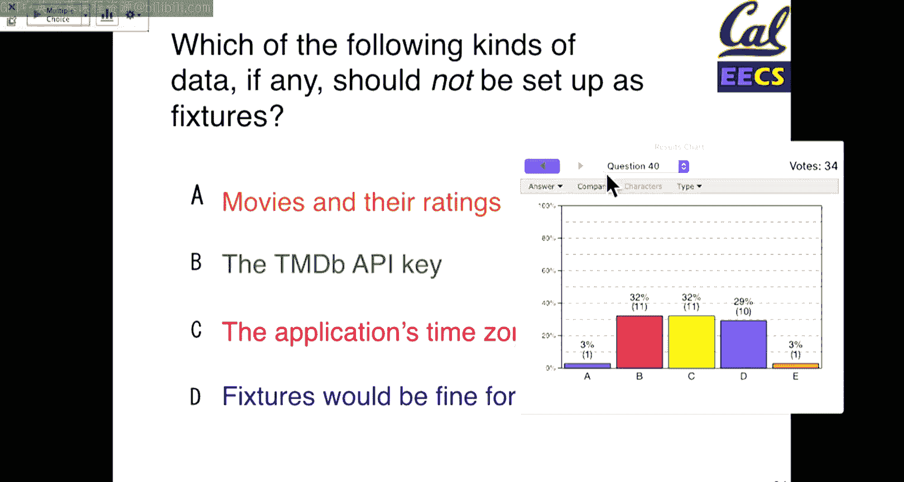
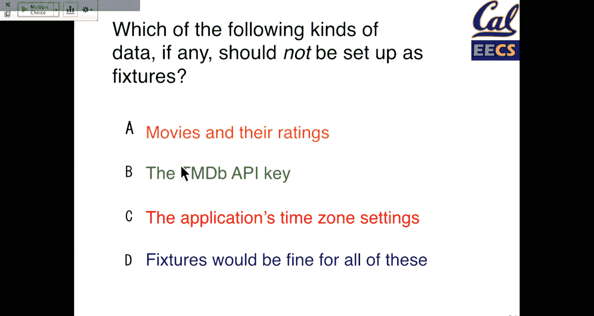
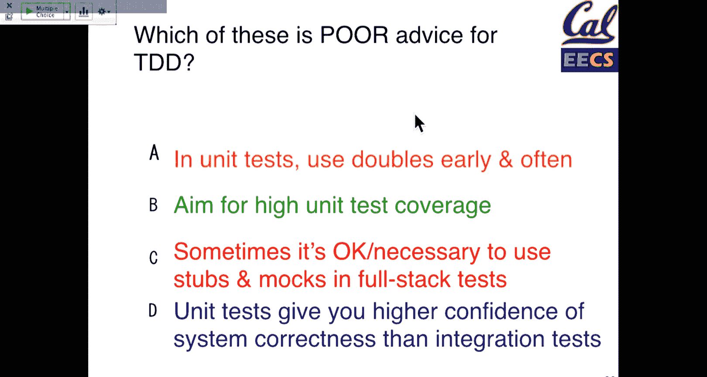
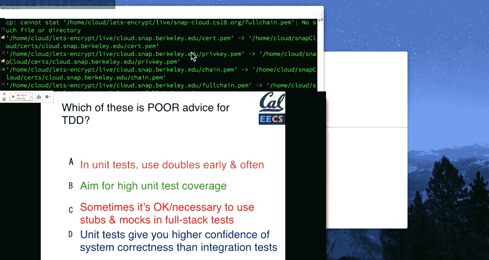

# UCB《软件工程｜UCB CS169 software engineering 2019》中英字幕deepseek p13 13 CS169 13.zh_en -BV1UsB7YPEMj_p13-

All right， so let's get started。 The Icler base station is being weird， so it may not work。

 but it may we'll see。So we're still working on midterm grading。

 hopefully have things out pretty soon， but we'll let you know in piazza when those scores will be out。

When they are， we'll do the standard thing。 You'll have about a week or so。

 if there are any regrade requests， but。You know， we'll let you know when that's out。

 If you haven't already do reach out to your customers。

 We did push the deadlines back for iteration 0 bit since there's a power outage and people couldn't meet。

But going forward， you know， there's going to be a lot of smaller sort of weekly assignments for each iteration。

 Those will be out on B courses and we'll post updates on piazza。

 But the general flow is going to be。Meeting with your customer， then meeting with your team。

 meeting with your GSI in section， and you'll kind of get into cadence for each iteration of meetings to plan the work。

 you a good solid week and a half to two weeks of doing the work at the end of each iteration you'll have a reflection meeting and you'll turn in that work on B courses。

 most of the work will be as a team， so most of the stuff because they are group projects you'll submit as your group on B courses。

 parts of the work will be individual where every person in your group has to submit an assessment which will be things like。

Giving you a chance to all rate your teammates。You know。

 you get to be as honest with us about how your teammates are contributing to your project。

 And the goal is not that anyone yells at each other， of course， but that， you know。

 there is a component in which if five of your teammates say that you are the one who is not doing any work。

 we will notice that you know， there should not be a case where any team has a major slacker or two on their projects。

But you will all have that opportunity to give us feedbacks。

So to continue to continue on today's lecture is a continuation of testing techniques。

 tools and strategies for effectively testing our rails applications。 And the goal here is， you know。

 how can we get。😊，A good confidence in our test cases without necessarily having to test every single scenario possible。

 And so。We will continue on so。Tuesday， we are talking about seams and seas are the places where inputs to our application can change behavior。

 there are places where we might make third partyy API calls where we depend on some results。

 and these are cases that are really useful to focus on for testing and so。

The goal here is to focus on what we think should happen within a method。

 so if it's a controller method， what data should it be passed as inputs。

 and then what should that controller method return and everything in between the API calls that it makes。

 the processing that it does we can use tools like mocks， stubbs。

 we'll talk about those today to then write test cases for a controller method before we have all the details of implementation figured out。

And so we call that outside in because we'll start at a really high level。

 we'll say in our test case， we can assume that this code works。

 And what we're really testing is making sure that our controller code does the bits that it needs to do。

 And then in another test case will focus on you know that specific function that makes an API call or processes some data。

 And so the key idea here is we're breaking a dependency up。

 So a controller method has one responsibility。 Our API call has another。And we call these seams。

 These are places where our application behavior changes based on some other external method。

 And so that could be parameters。 That could be API calls and so on so。 let's see。

 this remote is not working， but I could do this。啊。I don't know if anyone can vote。

 It doesn't show up on the base， but there's a counter here。 Oh， okay， well。

 it doesn't show on the base。 So I have no idea what people are voting for today。

Which is interesting。Well， so I can show it at the end， I like watching people's votes change。

 but the base station is not cooperating。And actually， this is not even the question yet。But。

We'll get to that in a second。 I'm thinking ahead。So， in this case。

We have our goal here is to break up a dependency in our test cases。What we started off， we got。

 we just finished with this example on Tuesday。 We have an expectation here that we're going to call a method。

 and we're going to pass it a particular input。And so in our method here。

 what we're trying to look at is。You know， we have this method， find。Findine in TMD B。

 That is an external service that we may not have implemented yet。We can ask Ruby to say， you。

 assert that this method is called correctly， but don't necessarily worry about actually calling the method so that if we haven't implemented this yet。

 our test will still pass。 And this gives us really high confidence that our controller method in this case is working with some parameters。

 So in this case， a search term with a value of hardware is。

Correctly sent us the part of the post request。 so that would be the second line here。

 and that we can assert that is also then correctly passed into our find in TMDB method。

 And that might be all our controller cares about So even if this fine TMDB method doesn't work yet。

 we have confidence that our controller works and we can move forward with implementation。

 So this is the theme。 the important thing here is if we are stubbing something out in this case。

 we need to set up this expectation before we actually do the the post method。

 So even though normally your expectation will be at the end of a test case when their setup work like this。

 we have to do it before so that we prevent calling the real method。And so depending on your setup。

 the order of the code in your test might vary， but this is perfectly okay and something to be aware of。

And so this will be our controller action。 again， the thing that we're really testing here is making sure that our parameters are passed in the correct order。

How did we make this spec green， Well， we add we used a method that says。

 expect that we should call this method with some inputs。

 So as long as our controller action does that， it calls this fine and TM DB method。

 This spec will pass。 And it's not just that it calls the method， but in this case。

 we added the with keyword。 So it has to call it with the correct parameter value。

 And so this case would be parameter's search term。And so， as we go along。You might assume that like。

 well。I see this search method in my controller。 It's calling another method on the model。

 All it's doing is passing in search term as the parameter。 What， like， why do I need to test this。

And there's a few things that we'll see as your applications get more complicated， but。

You never underestimate the ability of having a test case that prevents you from making a typo。嗯。

At this point， I assume youve all been there， but it is worth reiterating that professional programmers make typos all the time。

 I will share a link sometimes don in Piazza to a wonderful podcast called the B Shed。

 where most of the developers build rails apps， but they are consultants。

 they work on a lot of things。 and on a recent episode， they basically talk about how even they。

 you know people who have。😊，5，6， maybe 10 years of experience， depending who the host is， you know。

 have spent， you know， an hour to debugging a typo。 So it happens。

 but test cases are a great way to give yourself at least a starting point that， you know， hey。

 maybe we just  typepo search term or， you know， the parameter name of an API call changed anything like that。

 So those test cases， if we can make them simple。😊，Are still valuable。 So now here's the question。

 Eventually， we have to write a real implementation of our find NM D B method。

So when we write this implementation， what should we do with our test case。

 So the test case that we're talking about is this test case that says expect fun in TM D B to。

To receive some method。 And so。How should we adapt our test case after we have a working implementation of our fine and TMDB method？

Wow， it magically started working the second time I did that。It's interesting。 don't know why。

And let's see how。How many we can get？All right， well， things are leveling off so。呃。

So we can replace the call is one option。 We can keep the call or we can delete the test case entirely。

 So good on no one saying that we can delete the test case entirely。

 We definitely still't want our test case。 but so our options。😊。

Or we can either keep the call that's the test case that says expect that we should be calling this method。

 but not actually call it， or we could replace that expectation with a real call to find it in TMDB。

Both are valuable。 But in this case， if we want a spec that tests only the controller method。

 we should keep the expectation that we call a method and update the parameters if we need to。 So。

 you know， when you write a test case with test driven development。

You have a sense of what Find and TMDb is going to do。

 We have a sense that it will probably take in a movie title as a parameter to this find method。

But maybe for reason we have to update findMM DB to take an additional information。

 Maybe we change the parameter to be from a string to a hash or a keyword argument。

 which takes title or something like that。 So we might need to update our spec。

 But the reason that it's still valuable to have something that mocks out this API call is that。

It isolates our controller spec from what is actually happening。

 So if the fine TMD B spec ever breaks。We'll have an additional spec for that later on。

But we won't necessarily see the controller spec breaking。

 And that lets us know that when our specs fail， where we should go look first in our application。

 So the right answer here。The right answer here is be， you know。

 we will want to eventually have a spec that covers the correct behavior of our fun and TM D B method。

 but。We will do that in a separate place。 And basically。

 what we're doing here is decoupling our test cases。

So that they only test one piece of information and what we'll talk about later。Is you know。

 revisiting the order of testing， but we'll still have integration tests。

That cover that our entire app is working correctly。You know for a single controller test。

 we really want to just test that controller。So doubles are the next topic。 So we have seams。

 These are the places that we're gonna sort of figure out， you know， where we should be mocking。

 replacing some data in our test cases。 Doubs are going to be a tool that we use to make our tests more robust to write them in a way that doesn't require implementing our entire application。

 These also are sometimes called mocks and stubbs。 The specific terminology can depend on the framework。

 but in general。We're going to have a， a method that。

That returns something which is like a model like an object that we'd use， but not quite。

 it's set up just for testing。 So one of the gems that we'll be using is R spec rails。

 So this takes R specs expect two methods， and it adds some nice rail specific ones。

So assign is a handy method that lets us fake up。Create fake objects that well use to specify what behavior they should have。

 so。So in this case， we have a。We have a method， so we say。Movie， we have a search TM D B method。

 It calls our movie model。 It doesn't， in this case， assign that data to any instance variable。

 So if this is a controller method and we have a view。

 we're probably going to need an instance variable to pass the results of that API call to our view。

And so。呃。Well。We might have a。An instant variable app movie that we want to add。

 And so this stands for， again， the code we wish we had。 So we wish we had something that said at Mo。

 we can use this assigns method to decide if we have actually assigned to app movie。

 And so the way that that works is you could say， expect a at movie to have some value and it might not if it is assigned。

 we'll have an expectation that passes。 it's not assigned， Of course， it will fail。

 Another common method is an instance double。 So。嗯。Instance doubles create A I。

 They are an instance of a class。 So an individual movie， an individual student。

 but they have methods that are stubbed out so that they don't necessarily call the real thing。

 So if we have a movie instance double we might specify that it has a certain title without expecting that movie to be in a database。

 we might say we have you know a movie if our instance methods do some calculation that we haven't yet built。

 we can just say have that method of our movie returns some placeholder of value。

 And why is this not going forward。 So and the goal here is when we。

 when we create an instance double of something， we're not trying to create a movie which has all the information we could ever need about this movie。

 it's the bare minimum to make this one specific test case。

 or maybe these two or three test cases that are grouped together。Fctional enough to pass。

 So it's setting up a scenario， which is the minimum information that I need to know to make these test cases pass。

And it's important that we focus on the minimum amount of information so that it's easy as possible to write our test cases and in the minimum amount of information as a reader of those test cases will let you know what code we're exercising。

So。We have a thing。 So M is our instant double of a movie。This is just a copy。

 a single instance of a movie， but it doesn't really do much yet。We need to stub out these methods。

We can use our spec rails allow method。 So this is gonna to say allow our movie to receive title and return Snowden。

 So in this case， we are mocking out a movie called Snowden。 If we ever call M dot title。

 It should give us this value back。😊，So we have a method name， and we have some return value。

 and we could do this to stub any method。 We could stub methods that we know exist。

 We could even stub methods that don't normally exist on the model。

 Our spec rails will let us do all that。 But you know， in general。

 we're going to be studying only the methods that we need for this test case。嗯。

And because Ruby values short code， there's some nice shortcuts where if we pass in a hash as a second argument to our instance double。

 we can automatically stuffub out those methods in one call。

The goal here is another technique for isolating functionality in our test cases from other parts of our application and。

Instance doubles are one really useful technique where they will really come into play here is。

 you know， if we are testing our movie model。 So you'll have a model spec file。

 So there's going be in。You know， in your spec folder， there'll be spec slash models。

 and there'll be like movie spec in your movie spec。

 you w to make sure you're exercising the real movie class。 You're not gonna want to stuff that out。

 But maybe we have a a model called watch lists。 Maybe we have。You know。

 something that is a combination of movies and users。 So that I guess would be probably a watch list。

 favorites list， anything like that where we have another common another common object that's not necessarily a movie。

 That's where doubles and stubbs will really come into play where we're testing something that is not directly a movie。

 but requires some movie to exist。 And so。When we need it。

 we'll step out only the methods that we need there。 So what does this look like in a spec。 Well。

 were， we have some functionality here。 Make search results available in a template。

 So we're testing， we're continuing to test our controller action， so。

We have something that says fake results。 So again。

 this is something where we're faking a couple instances of a movie。We're allowing。

Movie to receive this method。 So this is another way of faking our call to。Find N TMD B。

 We're gonna say our movie can receive this call and it can return results， which are fake movies。

 So now in this case， we're going from just asserting that the method is called。To saying。

 I'm going to specify some expected type of output for this API call。

 So fun N T and BD now should return a list of movie objects。And what we're going to do is then say。

 expect that we assign this at movie instance variable。And that it equals these movie results。

 So now we test a few things in our controller。 We test not just that we call the method。

 but that the method assigns of value and that it assigns value with some known specific output。

 which in this case would be our list of movies。But again， in this scenario。

 we have not necessarily built fun in TMDB。 We have not decided how it works。

It might not even in practice yet return an actual list of movies。

 but the spec is specifying this is what behavior we think it should happen。So。

Why do we say allow instead of expect， We're not asserting in this case that。

Anything happens with this method， we are just stubing out the behavior。

And that's going to be the goal for that one， so。Some just tips of our spec。 again。

 these are things that。If you are really disciplined， will help you。 But while you're starting out。

 you know， you will probably break some of these cases。 and that's all right。

 But these are things that you should be on the lookout for。 So each spec should test one behavior。

 if there's one thing on the slide that you can follow。It's that one， and。

The simpler each of your test cases are， the easier will be to fix them when they fail。

 And that is something that does get really hard to follow。 It takes a lot of practice。

 But I can promise you that when you have。Your applications will probably not have this many specs。

 but when you have an application that does have a couple thousand specs and you make a change and you know。

 you get like 200 that fail and your response is， oh no。

 where do I start The ones that are the most specific are the best because they give you something actionable to look at if you test three things and it fails will now you have three different places in your application that you could look at。

So that's really helpful。 again， using seams as needed to isolate behavior。

 So this goes to testing one thing。 But making sure that， you know。

 your controller tests are isolated from the model implementation。

 Your models are isolated from the implementation of any other associated models。 You。

 those will be things that you can do。Use the right type of expectation。 So， you know。

 you can always write methods where you say expect this thing to return true， but it's probably。

 you know， expect this method to equal some value。 know when you can relax that condition a little bit。

 You know， if you're working on an error message， maybe the specific wording of the error message is not important to the spec。

 So you could say， expect。Flash or some error message or whatever method to contain some string。

 Maybe that's a little bit more broad of a test case。

 But maybe if all you care about is that the word error is in the output of some method instead of a specific error message。

 that can be really useful。 because believe me， one of the things that will happen is you'll change some text in your views。

 And then you'll realize that you need to go update every single test case because you move a comma or something like that。

 it will happen。 sort of the nature of testing。 But if you can relax those conditions a little bit。

It will， you know， it'll make your life a little bit easier。And again。When you write a test。

 make sure it's failing for the right reason。 So this is the case where seams Mox doubles come in。

And。Keep working on the same set of code until it screen。

 don't start working on multiple different pieces。 You know。

 make one change at a time as you go through your test cases。 And as you're doing this。

 you'll hopefully see opportunities to refactor your code， especially if you're on a legacy project。

 you， none of the past students in this course are going be offended if you refactor their code because they're not even gonna see that you refactor their code。

 So you don't even have to worry about that problem。 But， you know。

 feel free to refactor that refactor existing code as you go through and have those test cases。 So。

In summary， here are some of the things that we've seen so far。 and then we'll。

Take a minute for some questions， too。 So we have an expectation that we call a method。嗯。

That it is called with certain parameters。 And we can optionally say that we expect that we return some data from that method。

 We can allow a method to be called on an object。 So depending on whether we want to just set it up。

 We can choose whether we expect that it's called both those are available。

 We can instance double things so we can create a mock instance of an object。

And the most common thing that we'll use in a variety of cases。

 we can expect some object to match some condition and the conditions that we have on our right side are a host of things。

 So equal being really common contains matching a regular expression。

 all those tools will be available to you B0， be empty， be nil methods that R spec provides that。You。

 you're not expected to memorize these。 But if you say。

 I wonder if there's a nice way that I can see if my object has some property， You know， maybe it's。

More than just a string。 Maybe it's asserting that only the keys and a hash exist。

 you don't care about the values。 There's probably an R spec method that already exists for that。

 So that doc is here。 But， you know， just remember that you can learn those over time， so。嗯。

And again， with these different arguments， you can chain these how you want。

 You don't have to use all of them with every method。And so on。Let's go through this question。

 and then we can talk about。The options that we have for testing。

Expect to and receive combines blank and blank， whereas allowed to and receive is only what？So。嗯。

 this is just checking on some vocabs。We got up to 30 last time。Cool， the counts are going up a bit。

And we're leveling off。So let's stop it there。So。This is just some vocab。

 Don't necessarily worry about the specifics here， but。

So expect to and receive combines a seam and an expectation whereas allowed to and receive is only using a seam。

And the reason we're saying。My same here and not a double is that technically。

 you don't have to create a double an instance double of that object， so。

wanted to go back when we have this expectation here of an object that could be a real object。

 It could be any object。 It doesn't specifically have to be an instant double object。

The reason that we have。A an expectation here is because the call has expect here。

So that one lines up and allowed to， because it doesn't actually say。We expect anything to happen。

 it just sets up some background work for us， that's just the same。And so。Yeah。

The the goal here is that。You know， we can use these methods。

 They will be helpful with we're using instant doubles。

 but we don't have to use them with instant doubles。

 We can use them with really any rubby object that we have。

 And if we ever call that rubby object with that method that you know。

 the allow or the expectation will do its job for us。 So questions on these methods。

 techniques so far。Oh， sorry。That's why that thing is padted and soft。Right。Thanks。Yeah。

 I just wan to be absolutely clear。 Yeah Like for a seam。

 like the purpose of it is if your're controller method that calls like a model method。

 you w to say assuming that the model method works correctly。

 Then our controller method should work correctly。 Yeah， yeah， so it's not in this case。

 it's a controller method and a model method。 It could be。

 there are other seams that we could have in our application。 So in a。You know。

 in a model where we have a course where we want to do something with students。

 we could define that interaction with a student as a seam because from the perspective of a course。

 this is an unrelated or I shouldn't say totally unrelated， right。

 but it's a separate type of object where that functionality might be different And so there there are many places in our applications where we could have seams。

 but the critical thing here is that the yeah， the implementation of our controller being correct。

 doesn't necessarily rely on the。Model method in this case being implemented。 A lot of the times。

 if you're just doing you know， something like an index method where you have a list of movies or a show page。

It will be easy enough that you don't need to go through and set up a double or stuffub out the。

 you know， the， the contents of。You know， of our movie object or whatever we're doing。

 because it's a fairly straightforward page。 So there are places in your code that you could define as seams。

 but you don't necessarily need to test them that way just because there's not as much overhead。

 In this case， the value of separating out something like a fine TM DB method is that that's an API call that。

You know， may be more complicated to write。 It may be a slow method to execute。

 So there might be some advantages， too， in terms of just execution speed of tests。

 And it might also be something that， depending on the complexity， you know， you can't even。You know。

 think about writing that for a few weeks in time， or you have another pair on your project that's implementing that method。

 So you know， a seam there is any place that you want to move forward on whatever code you're working on without having some additional implementation finished。

Yeah， great question。 Other questions， test methods， anything like that。Oh， cool so。呃。

Let's continue on here。So far we've talked about。Doubles， mocks， stubs， same things。

And the goal with those was that when we get when we're writing our single test cases。

 when we're working on a spec file， we set those up。You it just right then in there。

Fixtures and factories are tools that let us create。Actual bona fide。

 real instances of our objects that we be able to operate on and we'll be able to。I use。

 So these will give us fixtures and factories Give us the real thing in two different ways。

 and both of them are appropriate。 You can use them， combineine them in lots of different ways。

 It depends on what you need， so。Fake movie。 We use a double， gives us a fake instance of the movie。

 We tell it which methods it can receive in return。We can specify any data。And that works。

 but would be annoying to set up all the time。How do we get a real movie？One thing that we can use。

 which rails provides really nice mechanisms for our fixtures。

 So fixtures are a way before we even run our test cases。

 we're going to specify some setup of some data that you know。

 we want every single test case in this class or that we load in to have access to。So。

And a factory will be a way of creating the real thing on the fly when we need it。

Both of these have their advantages and disadvantages。 You may use them together。

And later in the semester， when I hopefully get a chance to show you some great scope stuff。

 we have a really complicated setup that builds all the relationships in our application into a nice set of fixtures that are named Well。

 So why， like， why do we want to use the real thing， well。😊。

If we're just setting up some doubles and mocking out behavior， you。

 we'd have to do this for every single method， we'll have a bunch of doubles that don't actually test。

 I went one too far。嗯。We， you know， we'll have a bunch of data that sets up tests every single movie independently。

 This would get pretty frustrating because you can imagine that in an application that has movies。

 we will want to do more things with movies。 And so。You know。

 there are places where we could isolate this behavior。

 but it will be nice for the sake of expediency for clarity and sort of what we're testing。

 if we could say， you know， I need a real movie。 I want it to behave like a real movie。

 I know that movies work at this point in my application。 So let me use the real， the real thing。

 And so。😊，How do we get there？ Well， we can use fixtures。 So fixtures and rails。

 there's a lot of ways that you can create them， but they live in a yaml file， so。Yaml。

 if you're curious， stands for yet another markup language。

 because programmers are amazing at naming things just， just the best。

 But what we get is we get it looks a lot like Json。

 So if you're familiar with a Json data structure from an API。😊，You can think of it as Json。

 except now you have to care about tabs and spaces， but you don't have brackets。

Take whichever you prefer， I guess。 But in this case， this is what rails gives us。

 So we'll go with it。 We have a name for our object。 So we have milk movie。

 We could just name this milk， whatever we want to name them。

 And we specify all the attributes that would be in the database。

 So we're not necessarily specifying model behavior here。

But we are specifying what a record would look like in our database。

 And then when we load that into our database， the model behavior will follow from whatever methods we have defined。

 so。You can think of this in a way， as just。A text version of a database table， so。

In this movies do Yaml file， this will be all the movies that we went to preload。

Into our database for our test cases。So。We have a milk movie。 We could call them documentary movie。

Oh， we can specify different Is if we need to。 So normally。

 your test cases should not depend on specific Is of objects。 In the real world。

 it could be really helpful to have the ability to specify a particular I D。Not exactly proud of it。

 but there is code and grade scope that depends definitely on the school I D。

But that's the reality of building a real application sometimes。

 so you have that ability when you need it。And so we have an interface now that lets us define a set of movies。

 a set of students， courses， users。 What have you。And so in our spec file at the very top。

 we say fixtures。 And so we can say fixtures movies。

 This will look for the movies do yal file and load that in。 Oh。

 there is a nice handy command called fixtures all， which loads in all fixtures。

 So if you have a series of complicated relationships。 if you're kind of just， you know， saying like。

 okay， I've got an integration tests here。 It's doing a bunch of stuff all across my application。

 I don't know what data it's gonna to need。 Let me just load all of it in。 that's available to you。

 It will make your test cases slower。 but sometimes loading in everything is easier than figuring out exactly what you need。

 So that's an option。😊，And the question then is， how do we get to a specific movie， Well， whoops。呃。

Rails provides a really handy command called movies。

 And we just pass in the name of our fixture as a symbol， so。Milk movie。

 we get a movie that has these attributes by saying movies， milk movie。

 we can name these however we want to。I would encourage you as a team to。

 it doesn't matter what you pick， but do try and name these in a consistent manner。

 They will often be post fixed with the type of object that they are just for clarity。

 Rail sort of makes that。You know， easy for you。 But， you know。

 just have a consistent naming structure。 and that will aid in。

And making your test cases easy to work with。 So a really common thing that you will probably have。

 Most of your projects have users， So you should have a users dot yaml file。

 And so one thing that you will probably have is something called a， you know。

 whether you want to call it standard user， whatever your base type of user is。

You'll have one for that。 You'll probably have an admin user， things like that。 So grade scopepe。

 we have a student user， instructor user， admin user。

 Those three users make up like the bulk of our testing because they give us a very clear path。

 you know。😊，We test things that apply to students since students are the most common user of gradecope。

 So we just always say user， student user， we have different kinds of students so we can you know。

 say unenrolled student enrolled student， you know。

 you can make up as many combinations of objects here as you need。

But just the more you can pick a naming scheme， the more intuitive it will be for you as an author。

 as a reader of these test cases to find what you need。 And so these are fixtures。

 They are built in thing of rails。They are a really handy tool， and。They make it a lot。

A lot easier to work with data in your test cases。One thing that is super useful by having fixtures is it makes it easy to have the database cleaned and reloaded before each spec。

 So this means that every single spec runs with a clean copy of the database。

 when I say movie to update title。😊，That change is going to be reset after I finish out that spec。

 And the reason we do this is it makes our test cases independent from each other。

 but it also means that in our head， we don't have to keep track of what state things are in so。

The way you do this is with a gem called database cleaner。 If you're starting a new project。

 I mentioned that you should start with rail 6 because it's nice and new。

 Rail 6 does this automatically。 so it makes it even easier。And so。

 this gives you some nice consistency for test cases。The challenge is that it does mean you。

 if you want to do this， you pretty much have to use fixtures。 What I will say， though。

 is the community has pretty much standardized on using fixtures as a best practice。

 there is a little bit of work in sort of setting up the database you know。

 in tearing it down after each test case。 But modern rails apps， modern computers。 This is fast。

 negligible in time。 And there's even lots of clever work leveraging database technology to make it even faster。

 So。It's， you know。Sometimes it gets a little bit complicated， but by and large。

 I think it's really helpful in terms of making sure that you have all the data you need。 And so。

 you。When。Yeah， and just something to be aware of that。 if you do always have a database state。

 you know， you'll have to sort of understand what fixtures you're loading into your database。

 But once you have that set up， I think， you know， you'll kind of learn what's there in your application。

 So it is something to be aware of。 But it is a handy， a handy tool。

 So factories are the other alternative。And factories are just in time creation of our objects。

 So they let us say things like， let me create a user on the fly with some specific attributes。

 And these will be as needed for each independent test， so。2。

The good thing here is that this gives us independent test cases。 So， you know， we don't necessarily。

 if we assume that the database starts from an empty state。

 we always create our factories on the fly。 Then we have everything that we need， you know。

 for our test case declared right there。😊，The con of factories。

 And you will probably see this if you have complicated relationships， but。

If you have complicated relationships， you may have to specify those out each time。

 so if I have a user， I might need to add that to courses in the case of something like gradecope。

 you know if we are testing whether or not a student has submitted an assignment properly that requires a course。

 a student， an assignment， a school， an assignment submission， and I think that's everything。

But that's like five things that you might need to set up to run one test case。 And so in that。

 in that scenario， having a fixture that loads everything may be easier。

 But if it's a simple test case， you know， factories are a really useful tool。

 And you can combine and use these together。 So there's a really handy gem called factory bot that。

You can import it into your gem file。Most of your legacy projects will probably be using it。

 and it gives you this really nice syntax for creating a factories。

 So what does that syntax look like。Well， we first say that we're going to set up a factory folder。

And this tells us。The factories that we want to have exist。 So there is some configuration here。

But it generally works pretty well， so we say we have a factory called the movie。

And whenever we call a movie factory， we're going to get this movie back。

And so the way that we call this is we use a factory bot do build method。

 and you can import this so you don't have to call factory bot。 You can just call build directly。But。

 you know， it's helpful to see here that this build method， part of the factory bought Ge。

 We're getting a movie。If we want to， we can specify in our call to build a movie。

 the unique attributes for that instance。 So， you know， we'll have a default title here。

 Our built method。 we can give it a custom title。And that gives us realistic looking data。

 So if you need three different movies， you can， you know。

 easily see in your specs that you have three different movies。And any other attributes。

 you could pass them in that way。So build just gives us an instance of our movie that we can operate on。

 create， will build the thing and persist it to the database。

 so you can sort of think of this as calling dot save like you would within a rails controller but both build and create are there。

 depends on what you need to do。And， you know， all these parameters are optional。

 but they give you control over those kinds of things。 So before we get to the question。

 I'll just add， if you are using factory bot， look at the additional methods and features that it provides because there's a lot of really useful things where if you always need an admin user you can specify you know。

 factory users， there's a thing called traits， which clump properties together。

 So you can have a factory called admin user that's there for you。

 that reuses a lot of data there's a lot of really good ways to use this to help model relationships as well。

And so if you are using factory bot， definitely go look at the documentation because it is a really helpful tool。

 GradeScope uses both of them together。 I mean， it's now， you know。

 a seven year old app that has a lot of complicated relationships。

 but it really works out So which of the following kinds of data， if any。

 should we not set up using fixtures in our application。Nice， the counts are going up。

People are waking up or arriving。 That's a good thing。And it's a minute。 So we'll stop there。 cool。

 So we have。not what I wanted to do， bad me。That someone voted really quickly。 No，嗯。Okay。

 let's go to the last one。 Cool。 So we have a。😊，Is that the right。Wan。Yeah， yeah， that's right。 Okay。

 so a good distribution of responses。 Which of these things should we not set up in fixtures or would we want to set up fixtures for all of them。

 So spend a minute， talk to your neighbor。And， and see what we might not want to do。

 or is setting up all of these in fixtures a good idea。Right。两分でも。Okay。我处。嘅长唔度。で。这关系就是一个。时那边。That。

系重先。Alright， so take about 30 more seconds and put in a vote。And we have a couple E's。

 so we'll definitely go over this。No worries。3。😔，32。Previous question got 37。

So maybe we can get to that。All right， well， we've lost three people。 in the meantime。

 it's a little unfortunate， but。All right。Cool， so we have come to some consensus that we want to use fixtures for movies and their ratings。

So。That is。A， good thing。

Why is that Oh， well， so。嗯。We definitely want to use movies and the ratings as fixtures。 So between。

Between B and C， the TM D B API key and the applications of time zone settings so。诶。In general。

ItFs are going to be used for data that will be stored in your database。

 So the TMDB API key really depends on how you're storing that。

 If you are storing all of these in the database。 you could set up them as a fixture。The。

 the least likely to be used in a fixture would be your application's time zone settings。

 If you have one set of configuration that is always there for your application。You know。

 that would be probably the least likely thing。 In this case。

 because they're clicker questions and they're meant for discussion。

 B and C are both totally acceptable answers。And if you had a setup where you had maybe a TMDB API key for every single user。

 you know， that would be totally appropriate to set up as a fixture， but it really depends on。

 you know how you， how you have structured your application if you have an application where time zone settings depend per user or per account or maybe a group of users that would be something that you might set there。

 So a good example is。Great scope。 Every school has a time zone。 So you know， Berkeley's。

 it's specific time， MI I T's， Its East Coast time。 people see deadlines in a reasonable time zone。

You know， that's an important thing for students so that you don't have to do date and time math。

And so， you know， that would be something that's in our configuration。

 So it really depends on your application。 It's more about， you know。

 how you're storing that data as well， so。呃。To sort of reiterate fixtures are a way of predefining data in this case。

 in Yamal files that get loaded as a whole sort of set of data for each set of test cases that we want。

 factories will be a way of defining and creating data on demand。

 So questions on fixtures and factories， when we should use them what they're for。

 any of that kind of stuff。So yeah， I've passed the mic。Sorry。So the answer is。

 I would say it depends on your application。 The answer that is most likely is B or C are both correct answers。

 These are clicker questions so they can have multiple correct answers because they're not graded。

 They're meant for discussion and also a good meta point with clicker questions in general because it kind of goes to building applications in general is that there is。

You know， often not one correct answer for what you should do when you're building applications in the real world。

 So occasionally， some of these will have more than one correct answer。But the caveat there that。

 you know， this really depends on your application D。

 where you fixtures would be fine for all of these。

 If this data is stuff that you store in your database， then you could。You know。

 you could set that up in a fixture， but the， the answer here is really。

 it depends on your application。 A is the only answer here that I would say fixtures are definitely appropriate for。

 because if you have an app about movies， it should definitely be in your database。 Otherwise。

 your app is not really doing anything useful。

嗯。So。Any other questions， fixtures， factories， that kind of stuff。No，Co so。

How thorough is our testing。So。This is a lifelong， difficult question。

 And it is something that you always will be doing the cost benefit analysis。 It is。

100% clear that zero testing is not enough testing。

 I can think of no good arguments in which this is the answer。

 So if you say that I am confident that my code works on my project， therefore we do not need tests。

 I can promise you that conversation will not go well with your GS Is or with your final grade。 But。

 you know， you could have that conversation with your transcript。 It's not gonna。

 it's not gonna argue back at you。You know， so。It's also on the other end。 We haven't seen this yet。

 but because it's pretty hard to demonstrate， you know。

 too much testing does become a pain and can slow you down。

 But there are some clear boundaries on each side。 So， you know。

 until we ship our code is definitely not， not good here。You know。

Are we measuring some relationship between lines of code and lines of test。That is a good。

That that can give you some good indication because methods in Ruby are pretty short。

 Test in ruby are pretty short。 You know， if we have a method that's a few lines。

 it might take us a few lines of testing it， which is like it should do this thing。

 Exp my thing to return a value。 Yeah， we have a few， a few lines in each case。And so。

we could end up with more tests than code in some cases。Excuse me。But the really question is。

 you know。How thorough should we be， What gains are we getting for every single test case。

 so we can assess this in a few different ways。Foral methods， code coverage。And， you know。

 also just general intuition。 So we're gonna to talk about code coverage today。

 You're going to be using tools on your projects that assess code coverage and。

code coverage is this idea that whenever we execute a line of code。

 we want to make sure that we have at least one corresponding test case that makes sure that that line of code has been executed。

 so。In our movies model， we have a method called title。

 If we're using active record and we're just returning a title。

 that methods not even going to be defined for us， but we you know should have something that tests that probably。

 but any code that we definitely write， you know any code that lives in app slash whatever。

 we should have some test cases for it so。How does this work？We have levels， so。

Level 0 is every method has been called。 So just， you know， no matter where we call this method。

 has it been called level1 is every method from every call site， so。If we have。

So this case is just a random class that has fo。You know， can we call fo from just this class。

 Can we call it from， you know， another class called bar， Well， bars method。

 So that's not a good example。 You know， can we call it from your class or whatever other class we have named so。

You know， these are two methods。 in this case。 We have a method fo。 We have a method called bar。

So S0 is a level of coverage that says I've just called a bar in some test cases。

 I know that it's been executed。Level1 of coverage is a way of saying everywhere in my code that I could call bar。

 So this could be a controller that calls model methods。 It could be other models that call you know。

 methods on their associated data。 Have we made sure that we've called those methods。

 And the reason we have this as a higher level is that it ensures that we're always checking our methods with whatever data they're passed in。

 So you can imagine that we test that this bar method works correctly。

 but we never test that we pass in the right data to the bar methods。

 So that would be not a good thing。And so these are our S levels。

 don't worry about what they stand for。The and the goal here is， again。

 not to know that there are specific random levels， but that there are sort of。

There are degrees at which we can measure this stuff。

We're not going to talk about how the tools measure this， but。

What we're trying to also think about is， you know， what should we be testing and how so。嗯。

A lot of our tests are going to live at this C0 level。 So every single statement。

 does that get executed。 So these this is something that tools can do pretty well。

 So a lot of your projects will have the simple co gem already set up。

 we're gonna ask you to set it up if you're starting a new project， it will be in sort of the guide。

 But what simple Co does is as you run your test， it tracks internally。

 if each line of Ruby is executed。And it's gonna give you a really simple percentage。 I have。

 you know，100 lines of code in my class。 Maybe that's a typical class for you。

And as you call a method， it's gonna say， okay， well， I executed the first line。

 I executed this conditional。 I executed this return statement， this test。Tested you。

 three lines in this five line method。And so simple cover will track that。 It will then， you know。

 for the next test case， if you're testing。Maybe displaying an admin user versus a regular user。

It'll then say， okay， you've executed these other three lines of code。So in total。

 you may have executed five out of five lines of a method。

 or maybe you've left some missing simple cove will you know， total of that up。

 give you report and the math that it does， how it does it is imperfect。

 You will have experiences of looking at reports of test coverage and kind of laughing at it and being very confused。

It is not a perfect science， but it is still a very helpful tool。 And so it is something that。

You know， you can use as a barometer for how well your test coverage is doing。 So in general。

It's not perfect， but higher numbers are better。Yeah， we。

 we are asking people to sort of live in the 85% to 90% range of test coverage。

 That is generally a very good spot to be in100% is possible， but to get exactly 100%。

 you sometimes have to jump through ridiculous hoops。 And that's not useful to anyone。 But， you know。

 this is。Because it's an imperfect science， you know， you should not expect 100%。

 but most lines of code should have at least one test case that executes them。

So the next level there is C 1。 C1 is a little bit harder for tools to measure。

 I don't believe simple curve gives you output， but。This execute or measures branch execution。

 So if you have a conditional in a function that has， you know， if a else， you know。

 return some other data that would have two branches。 So 50% test coverage of C 1 would be。

 did I execute one of those two branches，100% would be。

 did I execute two out of two branches and every single sort of level of conditional。

Would be a branch that you could check。See。So there's this other one called C 1 plus。 And this is。

 I think。At least with the tools that we have in Ruby right now， incredibly difficult to， to measure。

 But this is every decision that could be made in code。 can we somehow cover that。 Well。

 every decision means。You know， if we're doing meta programming。We have。Movie dot title， Well。

 active record built that method for us。 So just by measuring lines of code。

 just by analyzing what we've written in our own controller files。

 it can be very difficult to measure this when we talk about validations in more depth。

 you can get really advanced with these validations where in one line。

 you could say movie validates title presence true if some other condition。

 and with one line of Ruby， you could have you know。

20 or 30 different lines behind the scenes that have been executed。

 So measuring this coverage of a detailed level can be difficult。

 But it is something to be aware that we could， if we wanted to track our。You know。

 our branches and things like that。The other high level is seeing。C 2。 So every single code path。

 So not just conditionals， not just declaring methods， but yeah。

Every possible way that we could measure tests or measure our code。And。

As we get higher in these levels， they become more difficult to test。

 The methods become a little bit more unreliable。 So there there's generally some disagreement about how valuable this is as a tool。

But the high level goal here is， are we trending in the right direction with our test coverage？Again。

 the extremes here are the places that we know we should avoid。So， you know， it works on my computer。

Not a good test case。100% test coverage， also unrealistic。嗯。You know。

 use coverage to identify untested paths。 So what you will see。

 especially if you set up a new project， if you have a legacy project。

 hopefully you won't actually see this。But when you get a code coverage report， it'll be broken down。

By file， which usually means by class or by model。 And so you'll see that over time。

 some models have a lot higher test coverage than others。And sometimes this is okay。

 Sometimes this will tell you that， my movies model， my courses model， my projects model。

 whatever it may be。 This thing is really complicated。

 So I'm trying to strive for the highest test coverage here。 And maybe my user model doesn't do much。

So it's a little bit less tested。But what you can use this for as saying， okay。

 I have something that I know is less tested。 I'm taking on a big new adaptation of my project of this piece of code。

 And so let me increase the test coverage there。 Either before I start or as you go along。嗯。Again。

 here， we don't want just unit tests because unit tests don't test if the interaction between the parts of our code are working。

 you could have a perfectly working， you fine in TMDB method that makes a nice API call returns some data。

 but if you always call it with the wrong parameters。

 you're not doing a useful thing in your application。And。Again， only integration tests。

 if an integration test fails， it doesn't tell you where to necessarily go to start looking at how to debug that。

 So the goal here will be to have a mix of test cases at a mix of levels and to generally just be pushing things forward。

 so。And yeah， each type of test case finds bugs at the other misses。

 So if you only get one sort of thing。From testing。

 this is probably the slide to make sure that you get。Because。

 regardless of what we call these things， there are different types of tests and they do different things。

So unit tests， again， one method， they're fast。 They test one thing。

They're hopefully simple to understand。 You know， I can test if  two plus 2 equals 4。

 if you have a test that test 2 plus2 equals 4， you can probably just delete it because it's not doing something useful。

 But in general， right， for individual functions。There are things that。

That we should be able to test。They give us very detailed resolution。And at the opposite end。

 we have our integration test。 These are things that run with cucumber with Cappi Barb。

They are super useful。 They are necessary， but they are also slow to run。 And when they fail。

 they often fail for very opaque reasons。When you get to the point where you have JavaScript in your applications。

You will notice that every once in a while， your cucumber specs start failing because of some ja error。

In your front end code。And that's a really valuable thing。 But when you look at your spec failures。

 it doesn't necessarily tell you， you know， where in the jascript it might be failing。

 or you might see that you now have every single cucumber spec fails because you made one syntax error in jascript。

And so， you know， it， it takes some practice to learn sort of how you interpret course failures。

 but they， they are a thing there， so。We definitely want both of those。And。

The good the way to think about this here is unit tests give us high coverage at a really detailed level of bits of our application that we otherwise might not be sure that we're testing with every single scenario。

Integration tests are one large scenario， so we can't spec out necessarily every possible user workflow path。

 but they give us the large， common cases。Of code that we're going to hit。 And in the middle here。

 we have a functional or module tests that sort of sit somewhere in between so。

And as we go through these things。And we talked about mocks and doubles。

 If we're isolating at a unit test， we'll have more of that。

 If we're testing at an integration level， we want as few of that as possible so that our tests are giving us a realistic scenario so。

Those are levels of tests。 Any questions so far on any of levels of testing when we might want to use one test case or another。

 anything like that。OhCool。In our application， we have a large。Set of places that we can test things。

 right， we have unit tests that are at our movie model level。

 We have database tests that persist things。We have controller tests that tests that a page is rendered。

We can also test things if we really wanted to， you know， that our code just even runs。

 which most test cases give us that。 And then we have things like TMDB with API calls， so。

Where you where do we necessarily want to mock out and stub out behavior in different scenarios？So。H。

Yet we already know this case allow moving to receive。So。This may be useful in a place where。

We don't have our fine TMDB method implemented in a controller。Something like that。

If we're using a library that makes HGEP requests in that library， we probably want to specify。诶。

Some behavior that doesn't have to make an actual internet request so that we could test that reliably。

 It's a very nice thing if your tests work without Wi-fi， you probably don't realize。

 but when you are running tests that require an internet connection。

 they will fail more than you would expect them to or you might be sitting on a plane trying to work on your application and then you realize that your tests fail because you don't have an internet connection。

 that happens more often than you might expect。So you know there。That's really not very helpful。

We'll fix that。 So one of those ways is there's a gem here that helps you fake this data。

There's a few different approaches for there。 But essentially， what this code is trying to do。

 even though it's impossible to read， is faking that Internet connection。

 So assuming that we made an API call， we have a， we can stub out the response that the API call would make。

 And the really cool thing is， depending on the tools that you're using。

 you could do this at any level。 So you could exercise rubbys built in HDP methods。

 but stub out the actual Internet response， So it looks like you're making a call to you know a native Ruby library。

 or you could， you just stub out even the HDP call depending on what you need to test。😊，And。

In our own application， when we're interacting with the TM DB library。

 there's a lot of different ways that we might test this。 So depending on the scenario。

 you might use a live but development or test instance of your service， so。

I don't think anyone in this course is going to be working with the Stripe API， but it's plausible。

 Stripe is a payments processing service， they do a really good job of giving developers test setups that let you mimic passing in a credit card so that you could do any form validations。

 any error handling and making a call to a Stripe API and so。This could hit a dedicated test server。

 And the real value here is that credit card processing kind of sucks。

 There's a lot of things that can go wrong。 So you want to test this on realistic data。

 So what Stripe does is they give all the developers a set of fake credit card numbers and a development service that you can just hammer with a bunch of requests you can verify that your setup is correct。

 that you handle credit card failure， successes， all that kind of stuff in a realistic scenario。 so。

嗯。You know， you have， you have a lot of different options， okay。This not。嗯。Basically。

 the goal here is to have， you know， the appropriate test at separate level。

 So depending on what you're doing， you should mock things out at a different level。

 And I really don't know why that happens。 So we're just gonna continue on。

So last question well take just about a minute to respond to this。But。

Which of these would be poor advice if you're doing test driven development？helello。

And just because we're about out of time， we'll stop it there。诶。But yeah。

 D is the correct answer here。Unit tests do not necessarily give you higher confidence。

you really need both to have the highest level of confidence， but you know。

 so all the rest are good advice in unit tests， you should use doubles。

 you should aim for high unit test coverage， but again，100% is unrealistic。

It's definitely okay to use mos and stubs in your unit tests that's probably where they live most。

And you really need a combination of unit and integration tests to have the good coverage。

 So that is a whole bunch on testing。 it's definitely something that you'll get practice with as the semester goes on as you continue building applications。

 But you know， focus on getting that set up really well， especially your new applications。

 and it will， it will help you as the semester goes along。 So we'll see you on Tuesday。

 there will be a micro quiz on Tuesday。 So anyone who's made it to the end。

 You will be prepared for a microquiz。😊，Otherwise， you know， happy Tuesday。next Tuesday， yeah。

I' like to warn people， but you know sometimes the surprise never hurts。Yeah。那这个。

。笑话。Yeah。

