# UCB《软件工程｜UCB CS169 software engineering 2019》中英字幕deepseek p17 17 CS169 17.zh_en -BV1UsB7YPEMj_p17-

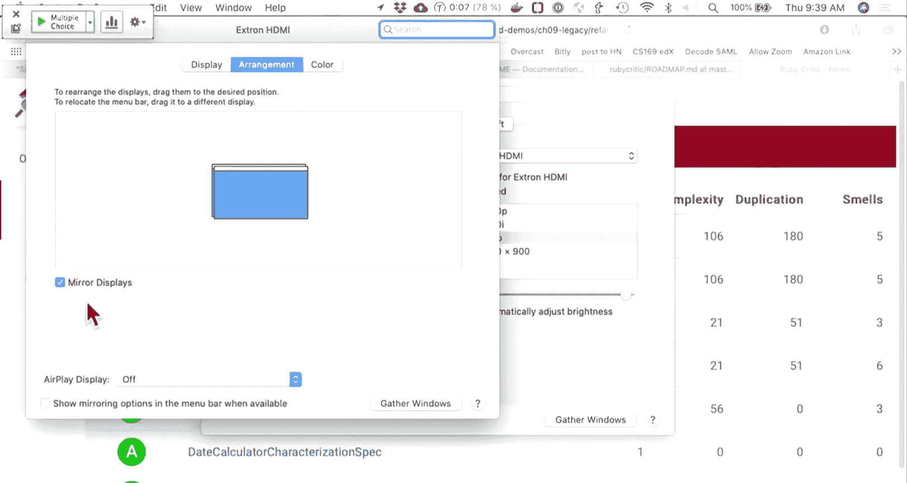

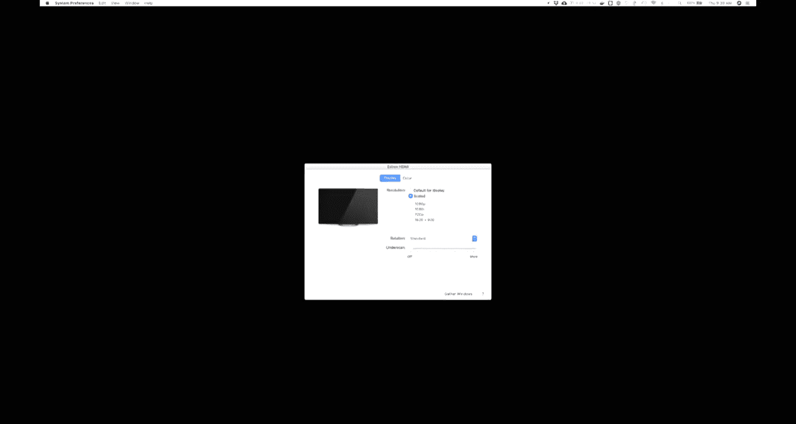

唔系。未借过哎。看没有。

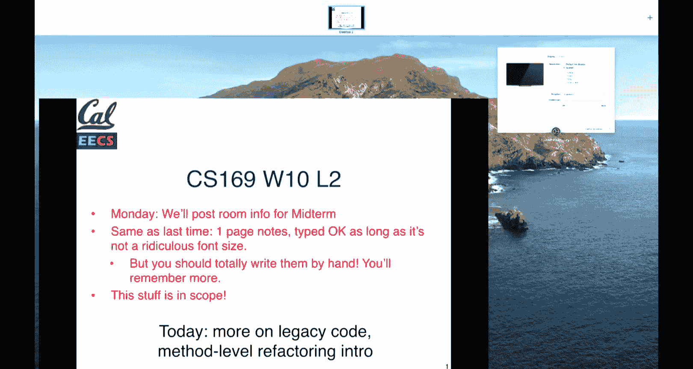

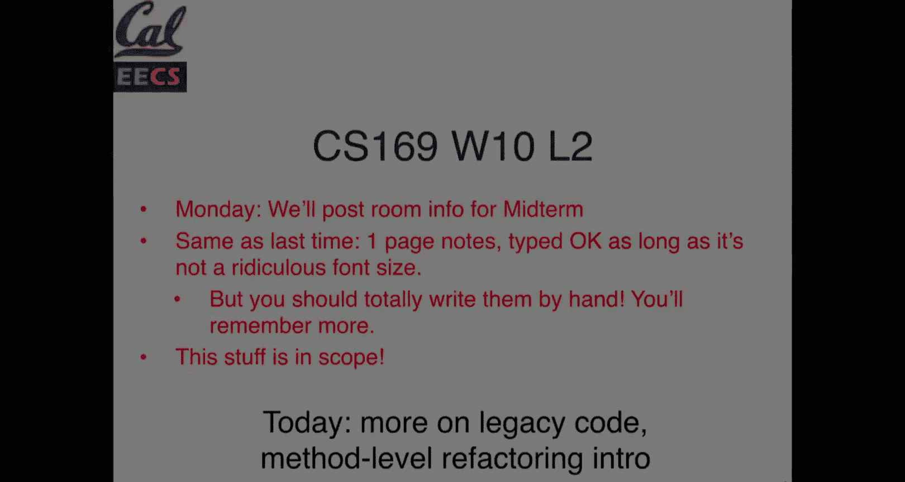

It's microqui5。So it is not up yet。it will be。Thank。啊，王明。第一个。All right， so the。

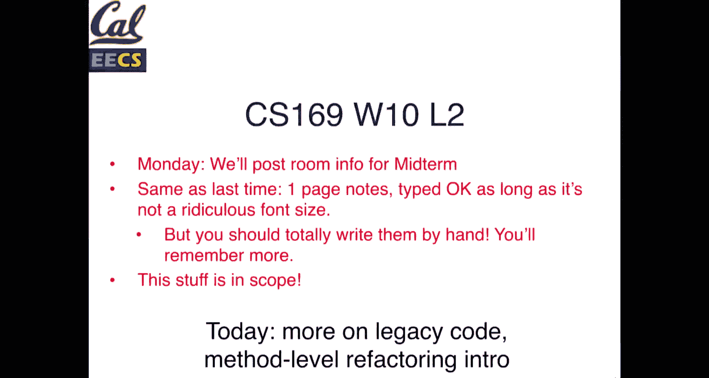

嗯，后面。啊。不判。So the micro quiz is now。

嗯。

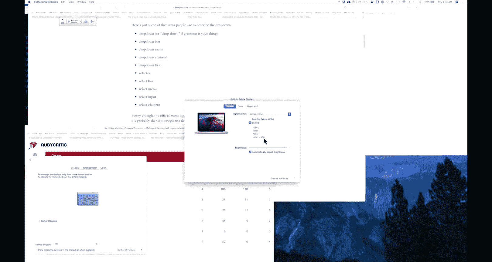

就是对。

不是。Test1， two， yep， thanks。

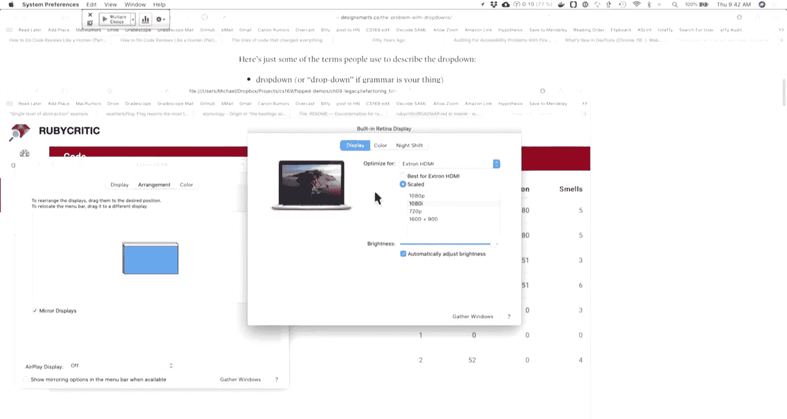

The secret code is refactoring。The quiz will be up for about 10 minutes。And somewhere along the way。

 the eye clicker died， that's fun。Micro quiz 5， there's also a link in the WAC channel in general。

 if you have 169 slack of it。There won't actually be 100 of points on the password。

 but I figured if anyone was taken out home they would get the point。The quiz closes in four minutes。

 so if you want credit for attempting it， just save it with the password and you'll at least get credit for attempting it if you're not sure。

 otherwise you can still submit as many times as you want for the next four or three minutes。

All right， so I believe。The microquiz has closed。Let's just make sure of that。All right。

 let's see if we can。Cool， so。We'll publish the grades after class。

 but we'll just go this really quickly。So there's two questions here。On the liker quiz。And yes。

 there are more correct passwords and there are people in the room， it is possible for me to count。嗯。

But aside from that fact we'll just go over this so for a career fair we want to schedule interviews between both students and interviewers。

 each student may be visiting with many interviewers and each interviewer may be visiting with many students。

Assuming we have tables for interviews and for students。

 which foreign keys are necessary for this and on what tables do they belong？

In this model we have two entities， we have students interviews， they have a many。

 too many relationship， so what is the best way to model this data？

The best way to do this is to use the concept of a join table So a table that has for each pairing。

 there would be one row modeling that relationship。

 So if we have an interviews table that says each row in this table is a scheduled interview。

 presumably that would include things like the time that happens。

 maybe a room location depending on the system。Maybe there are notes associated with this interview thing。

The separate table。Of interviewers would track then who is giving the interview and who is attending it。

 so a student ID and an interview ID would be the two foreign keys that this interview。

woWould make interviews table would make use of technically speaking。

 we could store students with an interviewer ID as a second call or as an additional column on the student' table but for a student who attends multiple interviews you would need to have multiple rows in the student table for the same student to indicate that they were attending multiple interviews so we wouldn't want to duplicate our student data just to indicate that they are attending more than one interview。

 same thing for the interviewers we could have a column on that table that would be a student ID and we could have the interview row repeated for each student that they're interviewing。

 but in general this doesn't make a lot of sense because that means we have duplicated data and we would have to figure out how to deduplicate that when we display it or something else so the standard way to handle many to many relationships is to have a single table that has foreign keys on both sides of that relationship this is often called。

A join table， the model en rails is sometimes referred to as a join model which essentially says it joins two things together in this case the interview model itself would probably be more than just joining there's a lot of interesting things that we might want to start about the interview but that is the first one there。

And so given that we have the second question， which is。😊。

Assum we've set up our foreign keys correctly， which of the relationships could we model so for interviewer which relationships en rails would we have well I use the phrase many too many so that suggests that an interviewer would have many interviews so if there are many interview interviewer IDs on the interviews table they would have many interviews。

And we could model that they have many students through interviews。

As long as there are multiple rows in the interviews table。

 you could grab the list of students that that interviewer is seeing throughout the day。

 and so this models many to many relationship one very directly where an interviewer has many。

Interviews because there's an interviewer ID on the interviews table and they could have many students through the interviews table。

 which then would look up the students based on the student ID column and similarly for our student model we could model the same relationship in the other way a student also has many interviews so a simple mapping of student ID on the interviews table to the current record ID on the student table and the inverse is true as well they have many interviewers through the interviews table as well so these first two options are just the inverse of the many。

 many relationship one on the student side， one on the interviewer side。

And then the final one is on our interviews model， what would we do here。

 we would say an interview belongs to a student and an interview belongs to。

AAn interviewer as well and it would belong to both of those the reason we don't use has one is when you use a has one or a has many relationship that foreign key is on the other table that you're referring to so in this case if our foreign keys are always on the interviews table then we use the belongs to and so that looks up table interviews column student ID table interviews column interviewer ID if an interviewer had one student or sorry if an interview had one student it would look up an interview ID on a student table so belongs to always looks up the ID columns on the table or the model that you're referring to and that's the distinction there。

And the password was refactoring， which most people in this room， I assume got correctly。

And if you're not in this room， well， you managed to skip by for this week。

 I'll figure something out。I don't particularly care， but like。

It's not that many points did not want to click that， whoops。I wanted to click that。

 So a couple bits of interesting just news and intersection of news and computer history。

 The Internet officially turns 50 this week。 I believe the actual date was Tuesday。😊。

The basis for this is the time that the first message was sent over what was ARPnet at the time。

 so before the internet itself was even a thing， the earliest network of computers was funded by ARPA。

 which then became DARPA， a government defense agency doing research projects。

 so a message at the time was sent between UCLA and Stanford Research Institute。

Was the first successful message sent？And the way that this worked。

 the Cloud for article was written by two of the people in the room at the time。

 which is pretty cool to see。This is one of the earliest designers and one of the machines that at the time。

 it was called an Internet or。Interface message protocol。

 which essentially is something that we would now call a router。

 but they typed LO as a start of log on or login， and then the computer crashed。

So they got two characters across before the system crashed and then one of the guys at SRI realized that there was a configuration error。

 he fixed the configuration and they were able to send the full message across and so in October 1969。

 the first precursor to the internet had a success。😊，And for the next few years。

 they're adding nodes to this early prototype internet of about one a month。

 and then it picked up pretty quickly after that so。The initial test was just two computers。

 but it grew pretty quickly。 And so yeah， internet turns 50， which is pretty cool。

 Another interesting just related bit of news is this article。😊。

In late 50 lines of code that changed the world there is a lot of fun things in this list so one of them is the Apollo bailout code if you remember the first lecture I believe we played a snippet of the Apollo lunar module and the beeping of that bailout code so that is on this list the first time somebody did printf hellello world in the 70s in C which is of course now sort of the canonical example of the first program anyone writes。

 and I also enjoyed on this list there's 50 of them so there's a whole bunch more of course。

 but the mill terminated string otherwise known as the most catastrophic design book and the history of computing which if you've spent any time writing C code。

 more than just what you do in 61C or if you've had the extreme pleasure of taking CS162。😊。

You'll know that the potential pitfalls that arise with not being aware of null terminated strings。

 like anything， it's a thing that you can get used to。

But I thought that was a pretty fun description of that design decision。

Today's lecture to get into the media of things is all about。Looking at code quality。

 how we refactor code， tips and tricks and processes for refactoring code。

 this will be on Tuesday's midterm， so for anyone watching at home。

 make sure you go through this stuff。But。know let's get into so the first thing is what happens when we take over a legacy project that we have no idea what's going on？

And you might take over a legacy project in a state where there are no tests。

 you don't know what this app does， but you are tasked with working on it。Hopefully。

 those of you taking of our legacy projects into this course。

 they should all have at least some tests， some might be in better states than others。But， you know。

 this is our challenge， right， we have a new project。 What do we do。

 So you don't want to write code without tests， of course。

 because you don't know if you're gonna break things。 If you don't have tests， well。

 then what do you do， And you can't write tests without understanding the code because you don't know what should be tested。

 So how do we get around this cache22。 Well， we have these things called characterization tests。

 And the idea here is that we're gonna to start writing tests that establish the ground truth of what our app does today。

 So。The central idea here is that。Yes， in a world where we're talking about TDD and BDD。

 the ideal scenario is that we're going to write our tests first and for all new code。

 that should be the goal， right， we should be in a place where we try and write tests as first as much as possible。

 but。Sometimes， as I say， we are S O L， and we need to have at least some tests that we don't keep breaking your app。

 So the goal of characterization test is something that is repeatable。

 So these are tests that we can automate。And there are tests that at least for now establish whatever the app is doing today。

 so we're going to be testing the app manually as a human understanding what it does。

 and then we're going to write some tests for that like what we talked about when developing features。

 it is critically important that if we're just testing our app。

 we don't make any changes to code because if we make changes to code while we're trying to write tests we might also be changing the behavior and then we won't know if we inadvertently change something or at least not without reverting and going through a bunch of pain so integration level characterization tests So big picture what does this app do。

A really high level。 And we already have the tools for writing these tests。 They are cucumber right。

 and Kay Barra。 And the idea here is。😊，If you're trying to set up a test for an application where you don't know much about what's going on。

 just start by writing a very straightforward， very imperative copypy bar test， which is。

You know when I visit the homepage， then I enter my email in the email field and then I enter password in the password field and then I click login。

 I am taken to this page and I see X， Y and Z and these steps are going to be super imperative at the beginning。

 they're very much you know exactly what the user would type they are not necessarily capturing the idea of what should be happening。

 but at your first pass they are a set of steps that are repeatable。

 they capture some information about the system。And then at the point that we understand what's going on。

 we can improve those， we can say， given I am logged in as a user and so on。

 improve those scenarios over time。 but at the very high level。

 the goal with these characterization tests is to say， here's what I know my app is doing today。

 here's how I can write a series of automated tests that prove that you tomorrow next week whenever when I start developing this app。

 I'm not going to break it。 and so if you're in a scenario where you're working on a customer app and you're like。

 well， I don't know what this is supposed to do， I don't know if I'm about to break something。

 the test coverage here is not satisfactory， if you think the test coverage is not satisfactory。

That is a good sign that you are understanding the value of tests。

 that you are seeing and appreciating the things that we have in automated testing。

 and so I encourage you to just take a few minutes。

 maybe more than a few minutes depending on the state of the app。

 but hopefully not too many more and write a few scenarios that just give you the confidence that as you go forward。

 know through the rest of the semester， if you're a consultant through the rest of that project。

 whatever it may be that you're not going to break those things so。Com。

There is an additional screencast which goes through some more examples。

 but here's one idea so you know integration tests are we have copybar。

 we have a series of steps that we can mimic what user behavior is doing in the browser。

 we might also want some unit or some functional level tests。And so how can we write these tests。

 Well as students who probably actually have experience doing this where you write a test case。

 it fails and then you fill in the value of the result of what the code did。

 we're essentially going to be doing that， but we can go through this in a little bit more systematic way so。

In this example， we have an order thing and the order calculates its sales tax。

 so if we have no test for this order， we might start by mocking out the order。

 so order is a mock of an order。And then we write this line where we expect order dot compute tax to equal negative 99。

9。 So why this value， Well， it doesn't really matter what value we picked here。

 but we know that compute tax based on the name of the method。

 at least should probably return some number value that is a you know that represents the amount of tax for this order。

And so we write our test， we run it and our spec says object order received unexpected message get total。

 So we have this order thing， we have a mock and now we have an error well the error is telling us that we have a method called get total that we probably need to specify So let's adapt our test this is a mock so to satisfy this error message we pass in a get total that will return a value of 100 note that like using numbers like 100 in tests is really nice because it makes it easy for us when we need to to do the mental math to verify what should happen So now we just say well okay get tax order totals 100 tax value is negative 99。

9 which like if that were the real tax rate that would be awesome but never going happen and now we get a message that says expected compute tax to be negative 99。

99 but was 8。4。😊，5。We're running through our test。 This actually tells us something useful。 Well。

 we got a value back。 we got 8。45 as the tax rate。For an order of 1008 that would be 8。45% text。

 that seems pretty logical， so now we fill in the body of our test case with what the code actually does。

And we have a working test case for our compute tax method。

 We don't actually look at the method in this case。 We don't know necessarily how it works。

 but we do know that in the future， if we break our compute tax method。

 this spec will now fail obviously if our application today is broken。

 we're writing a test for a broken code， so this is not a perfect scenario。

 but what it does tell us is you know as we're going forward。

 we are not going to accidentally change the behavior of an app and that's really the goal with characterization test is making sure that we don't break things anymore that they might already be broken you know at the very least we have a test that captures the state。

 the understanding of the way in which something is broken， even if it's not perfectly correct so。

We can call these integration level characterization tests， ICTs。

 or module level characterization tests。😊，Of these options。

 which of these is not a difference is not the main difference between I C Ts and UC Ts。

 So we have these characterization tests，1 at an integration level， one at。A module or unit level。は。

Which of these statements is most likely to be false or are all of them true？

LetSee if we can get above 40， okay， that's good， maybe 42， 4 okay， not too bad。See。Can we get to 50？

I'll give it till 130。Cool。So a pretty good distribution。

 we're just going to go through this so in this case D。Is the correct answer here。

 which is all the above are significant differences between integration and unit level characterization tests。

Naturally， this is the first time you're seeing this。 So the， you know。

 the range of responses makes sense。 the， the ideas here are。

 some of them are a little bit counterintuitive in terms of what。

Ting about so we'll just go bottom up for this so telling you that all of them are correct so why so integration tests are primarily based on scripting customer actions。

 UCTs are primarily based on observing method level behavior the reason C is correct which was the second or third most common option is that。

This is essentially just stating the definition and the difference between integration and unit level tests。

 So integration tests are at a system， what does a customer do， These are our cucumber scenarios。

 these are you know our step definitions that we have filling in form fields and so on unit and module level tests are function tests that like the compute tax example that you know these are individual pieces of code that we're testing。

And we're really when we write those tests after the fact。

 were writing a test just based on what the code actually does today。

 not necessarily what it should be doing。 And so you know this is a way of saying that we are just observing the behavior that's going on there B detailed knowledge about the code structure is less important for ICTs than UCTs。

 So because these are higher level tests， detailed knowledge of code is generally less important for integration tests than unit and module tests。

 and the reason for this is that。When we're writing Cappi Barra code that says fill in this form that says click this button。

 we don't really care how our application is implemented。 In fact。

 if you really wanted to take it all the way， you could use cucumber and Cappybarra to test nonrails or non-ruby applications because all they do is go through the steps faking a web browser so you know in theory。

 they could you know control and test things that aren't even。Ruby code。

 although if you're using cucumber or cucumber rails to test a nonrails application。

 you definitely you have no understanding of the code that the application is there。

 so it's totally possible to write tests that mimic user behavior without understanding anything about what's going on in the code。

And so the last reason A， this is kind of tricky one。

 integration tests are more likely or than unit tests to unexpectedly be dependent on the production database。

So why are our integration tests？Possibly unexpectedly dependent on the production database。 Well。

 in theory， right， we want our tests to be independent of production data。

The challenge is that when we go through a working system and we start observing behavior based on what's there。

 we don't necessarily know without until we understand the code later on what the relationships might be between models between different kinds of data。

In in our system， we might observe that someone logs in that they see a certain message and we write a spec for that message that saysWecome back or something like that。

 and so we write a spec that says， you know when user logs in。

 they should see a message that saysWee back and that integration test might very well pass。

 it might very well be a useful thing to have because it's behavior that we want to capture but。

If we're just basing that test on logging into a single user account。

 we don't necessarily know all the conditions in our system that might generate this welcome back message to a user。

 And so maybe that welcome back message only happens on certain days of the year。

 Well that'd be pretty weird， but it's possible。 maybe it only happens when the user logs in after not having logged in for a long enough period of time。

 maybe that's a week， maybe it's you a day， we don't really know。

 but if we're testing or writing a test based on behavior observed on a production website。

This is still a useful thing to do， but we have to be aware that we might be encoding behavior that is dependent on data on setup that's in our database。

 the current time of the day or something like that as well so。

And that could be a simple flash message that could be models or relationships between different models。

 So maybe items order items in an order， something like that would encode a relationship that until we get deeper into our testing。

 we don't necessarily realize what that should be。 So that is something to be aware of that。

 you know， if you observe behavior on a production site。 And then you write a test。

 And it fails locally。 you know， maybe there's some relationship that。

Is there that you're not yet aware of and so。That is integration level tests and unit level characterization tests questions on that。

 There are a couple eases， but don't know if going through that helped。好 ok。Moving along。so。

know acronym part 256 code smells and So is going to be our newest acronym for today。😊。

As a first order， correctness is definitely going to be the most important thing with our code。

 beautiful code that is not correct is entirely useless no matter how beautiful it may be。

 but we do want to have this notion of beautiful code because。😊。

The goal here is as we develop software over time， how can we make things easier to work with？

When we talk about beautiful code， what does it mean， are there qualitative evaluations。

 quantitative evaluations。 And if we have these things， how can we use them。

 And then we'll look at some tools。 So qualitative code smells are things that。😊，As a programmer。

 you know， you are making the judgment based on your experience of what they are。 So acronym So。

 maybe you can think of this as an old smelly sofa。 I have no idea if that helps。

 but here here are the option。 So is it short。 So we're gonna say shorter code is one of our measures of beauty and quality。

 you may have noticed that as a framework rails definitely optimizes for this as a language。

 Ruby provides a lot of tools that help you write really short but really descriptive code。

 know one line of Ruby does a lot more than one line of C， at least on average。😊。

Does it do one thing。 So are we keeping our functions， our classes you know。

 our modules grouped together in a way that they accomplish one thing and they hopefully do that one thing well does it have few arguments。

 So specifically for a function are we sticking to not passing around too many arguments in our function。

 This is especially true if things are positional arguments。

 if you have ever tried to use an API where you have to pass in like eight different positional arguments to a function。

 you always have to look up what order they go in and make sure that you're somehow not passing in you know the size value where there maybe should be some name or something like that。

 So few arguments to a functions we're gonna to say is a good thing。

And is there a consistent level of abstraction？If you remember back to 6 to and a abstraction。

 one of those words that is， you know one of the first buzzwords you see in computer science。

 are we keeping things？Abstract in a way that's consistent。

 are we always working sort of at that same level that abstractions so that our code is appropriately readable。

 we're not necessarily assuming implementations that we don't need to。

And so one of the tools for this is Reak because Reak is a thing that smells。

 And so we'll look at some of that。 So a single level of abstraction。

The idea here is that if we have more complicated tasks。

 we sort of divide and conquer a function should delegate to other items or other functions。

 the details of what it needs to do。And if something is really complicated。

 if we're delving into those details， we should extract that code into its own method and the reason that we do this is because this makes it easier to read our code by being descriptive。

 but also when we extract methods， they become easier to test independently and we'll look at some of that。

嗯。And when we read， when we read our code， what we really want to see is。At a very high level。

You know， code， especially in Ruby and rails that sort of reads like a description。

 what should actually be happening， you know， if current user。It is admin or something like that。

 You， doesn't necessarily tell us how we're tracking whether someone is an admin that could be a database property。

 It could be something in the user name。 It could be based on their email address。

 we really don't care how user might be an admin。 But in our code。

 we can read it and understand that that is the goal of is this person an admin or not。

 And for any number of examples， you can write a method that abstracts away that implementation。

 And as we go deeper down， we would， reveal the implementation details。 And you you can think of。

And our Rails app sort of active record even is its own abstraction over the database。

 we don't necessarily in almost all cases need to understand what SQL happens as long as we understand that this thing represents a database query。

 we don't need to understand how active record goes and translates a column names into the actual ruby methods that you have access to and so know that is its own level of abstraction if we wanted to。

 we could dive into that active record source code， but we probably don't need to。

And so that is abstraction。 So why are lots of arguments bad Well， I briefly mention this。

But one of the other reasons is it's hard to get good testing coverage。 So if a function depends on。

You know， five， six， seven， hopefully not eight different things。

 what this means is that when you test your code， you have to pass in you know setup of eight different things into that function。

 and then you probably have to have permutations of that test。

For all the possible permutations of eight different arguments。

Which is kind of a mess to think about。You know， when you're mocking things out。

 that just means you have to mock things out more often。

 it means you're probably combining multiple ideas。Into one test。And then a special case of this。

 which is。I think really hard to get used to， but is a super useful thing to be aware of is that Boolean arguments are a yellow flag。

There are some cases where they useful。 So it's not necessarily a red flag。

 but it's definitely a place where you should。You know。

 where you should be aware and watch out for something a boolean argument usually means that there are two separate code paths in this function that change its behavior and the really relatively straightforward thing to do is if you see a boolean argument。

 if you see an if else on that boolean condition take that method split it into two methods and name them something much more declarative that explains you know what that boolean is controlling。

Because。While you're reading， while you're reading the definition of that method。

 it might make sense what the Boolean argument is doing。 But wherever that method is called。

 if you see something that's。Called with a true or false value。 So let's see what's a good example。

Loin methods that have remembered me as a parameter， which is just true or false。 and so login true。

 login false， Well， when you're reading that login code， you specify a parameter of true or false。

 what does login of false mean that doesn't necessarily tell you as a reader of the code。

What that means。 So you might choose to separate your login method into a remember user login and just a login or a you know。

 session only login， something like that where。You have。Two login methods， which in their。

Implementation might call， you know， a separate method that shares a lot of code， but。

Separating bullolean arguments into two functions is。

Its something that is once you get in the habit is a really easy way to improve the code quality。

Arguments that sort of travel and unpack， this suggests that you might need a class。

 so if you are constantly passing in four types of data together。

 let's say you have like a course ID， a student ID， an assignment ID or something。

 those things that travel together probably represent a related concept where by extracting that data into a class。

 then you only pass around instances of that class。

 which makes the code easier to maintain it means that if you have。Some refactoring。

 you refactor the class as a whole rather than trying to change every place that a method might be defined or called。

嗯。Those are two particular things to be aware of when。Or factoring。

How do we measure at a numerical level the complexity of our code， the quality。

 and there's a few things。There is this metric called the ABC score if you have looked at code climate。

 this is exposed in code climate， it is one of the factors in their overall score。

 it stands for assignments， branches and conditions and it is a strict formula which is kind of funny but it is the L2 norm of the square root of a squared plus b squared plus C squared。

 which sounds like someone spent too much time in geometry and just wanted to create a method。

 but it's actually pretty useful。There's。A general metric that you want less than or equal to 20 per method for ABC score。

 which is sort of saying。The total amount of complexity through assignments， branches and conditions。

 whatever combination of those you have， you'll notice that they are weighted equally there。

 you want to keep to less than 20 there's a gem called Flog which checks your ABC complexity we'll report that and I'll show that in a second。

Flog is there's a few reasons for the name but。One thing is if you've heard the phrase the beatings will continue until morale improves。

 I believe it's been said the flogging will continue until code quality improves。

So that's one way to remember if you have a legacy project。

Flog is included in the test setup in most of them。

That's something that's pretty easy to get started with。A related measure。

 but sort of a different way of counting this is called smatic complexity。And。

This really looks at how many ways are there through the single path of code。

 so from our red dot to our blue dot， how many different ways could we get from A to B in our code path and if there's a lot of ways it means our code is really complex。

If there's few ways， it means our code is relatively straightforward to understand。 And again。

 this is another metric that will。Help us sort of identify bugs。

 And the simpler code means that while we read it， we're much less likely to miss something。

 So the Nist recommendation here is that our smatic complexity number should be less than 10 per module or function。

 So relatively few pathways through。A single sort of concept， and if our numbers are high。

 that suggests that we should break this into specific smaller functions。

The specific ways that they're calculated don't really matter too much except that in both these cases。

 bigger numbers are bad， smaller numbers good， if the numbers keep decreasing， you're doing fine。

 that's really the goal there。嗯。So just other metrics that we've talked about。

 so you know in terms of testing， we have our lines of code to the lines of test ratio。

 which we generally want to be less than or equal to one to two， so we don't want too many tests。

 but if our tests。Are actually a little bit longer in terms of lines of code， that's not a bad thing。

You've seen simple CoV， which counts statement coverage and our goal there is usually 90% or so。

 depends on the project。But that's sort of a reasonable metric。So ABC score is F and。😊。

Sylomatic complexity， there's a gem calledsycurro， which is also going to be installed Code Cl runs this for you as well。

And there's a few other tools， there's another one that we'll look at in a second but。

The goal here is that as we go through our code， especially things like Code climateimate do a really good job of highlighting sort of the hotspots。

 the places in our code that have at a file or a function level， the most complicated。

 the most complex code， and that's probably a place that if we need to we should start refactoring you will also likely notice that the places with the most complicated code correlate to the places that probably have the most bugs or are the hardest to adapt so。

嗯。quantitativeant metrics give us a score that we can at least improve over time。

 but like everything， they are not perfect。You know， keep the numbers decreasing。

 but always use your own best judgment。So。What's a good example of where shorter code is better。

 So this thing on the left is a bunch of ruby。It combines some words together from。All right。

 sorry it combines anagrams from an array of words and it does a bunch of things like splitting with a regular expression。

 it downcases some stuff， it returns a unique array at the end。嗯。

And it turns out that if we use the conventions that Ruby provides。

We can write the same thing all in about three lines， which。

It's not to just say that you we're not trying to play code golf for the sake of playing code golf。

 but when we read this we do words do group by word。Word。cars。 sortt。

 so order the letters and then group by returns a hash so just return the values。At a。

At a sort of more declarative level， the methods that we have here， we have words。

 which is some array， we're going to group them by a word and then we're going to return these sorted values here。

If you're trying to understand what the code does， the method names here aid a lot in understanding what。

You know what this code is trying to do and it's not just that， but you know if we were testing this。

 there's a lot less to test here because we were relying in this case on built in rubby methods that we don't have to worry about working correctly because rubby provides them for us。

 so idioms， the style， the functions that you have as part of your language or library are an important thing to take advantage of here。

If we were to use Flog to get a score for these， we go from 18。8 to 5。2。😊。

So you know in the abstract。We're saying that less than 20 is good。Or is acceptable。

 at least depending on the case， but this improves it by a factor of more than three。

You know reallyally what we're seeing here is one loop from and basically one level of nesting from at the deepest part here we have one。

 two， three， four levels of nesting。That is something to keep in mind as well there。

So those are some tools and I we'll talk about some method level refactoring。So code smells。😊，So。呃。

We have our sofa code smells。So short one thing， few arguments and consistent level of abstraction。

 so what is a good example of method level， single level of abstraction？

So let's see if this opens up。This is cool， so let's see if we can。Its bigger。

So this is some code from the audience first app， which has been refactoractive for a few years。

 which I believe is a project group this semester。And the first attempt is our customer controller show method。

 So when we're looking at a page for a customer， this might be the first page they visit。

 but we have。If current user is on some email blacklist， if they have a valid email address。

 we're looking at some options that are opting in and then we're setting a flash message to click billing address to update your preferences。

 so this is basically saying if someone has opted out of an email can we encourage them to opt back in。

Based on the user settings， some application options thing。 And this is。

One method that combines a condition which has three conditions and an assignment in the condition statement。

You knowBasically there's quite a few things go on here well these are all different levels of abstraction。

 so we're looking at a current user， we're looking at some specific application options。

 and then we're setting a message so。Over time， this code was improved。

And refactored out into multiple methods。So the first thing that we could do。

And things got moved around， so this login message is now an application controller。Which is。诶。

Login message is encourage opt in message。SelfCurrentus。Oted out of email or has opted out of email。

 so this is you know in one line captures all the spirit of what this is trying to do by relying on some help from other methods so。

If this person has opted out of email， encourage them to opt back in。

And this means that if we are going through reading this code。

 we have a much better time understanding what should happen。

 which also means that if were adapting our code， we're much less likely to break it。

 so what do our other methods do。So we have this encourage optin message。

So this is the thing that checks our application options， which in this case。

 I have not played with audience first much， but I believe this is an admin level setting for the application。

 whether you want to turn this behavior on or off so。This is a reasonable place to put that check。诶。

And basically， you return the message unless that setting is not there or otherwise return the message if the setting to show opt messages is present and then。

How do we capture the customer behavior， Well， we go from in our customer model now。

 we add a method has opt out of out of email。 And this essentially relies on。

Database attributes so email blacklist， so this is probably a column in our database。

 which is a Boolean value， and so rails gives us that method for us。And valid email address。 Well。

 that is not necessarily a built in rails method。 but by reading valid email address question mark。

 we can be pretty sure that if the email I just field on the user looks like an email address and is present。

 that method should return true。 and if not。It's probably going to return false。

 And the nice thing about this is that we probably do want。You know。

 a spec for this method because something might accidentally break。

 but this method is almost simple enough that we you know someone could make an argument that we might not even need to test this because reading this code。

 it's pretty likely that this code is correct we have two methods as long as those two methods are correct。

 they're joined by an and you know we we almost need to test this。

 though we really should still just to be safe， but。That， you know， we go from。

We go from what is this， six lines five lines up here to a couple shorter methods that really declare what's。

What should happen and at the end of it， we can still set the flash to a login message if we need to。

 and this is something that might just happen in the appropriate spots in our application controller。

A first example。Of。Some refactoring of rails code。 and this was。At this point。

 I think audience first has adapted a bit。If you're working on the project。

 you might see something similar to this。Any questions on refactoring any of this code。

 anything like that so far？Yeah。A question no。I saw someone's hand。Cool， so。This is。One example。

 So what did we do here， start with code that has one or more problems or smells。

 So things that are complicated are things that are unclear。You know。

 go step by step to transform them。 So we sort of went from， you know。

 let's just say totally unrefactored code to nicely refactored code that didn't all happen in one step。

 but that was our goal。 And then at each step that we're refactoring。

 we can write we can rely on a test to make sure that we're not breaking things。 And the goal is。

If we're going step by step。Keep tests passing as much as possible at each step。

 don't go from you know let's say totally confusing code to the most beautiful code ever in one step。

 do it over multiple smaller steps where we are sort of continually keeping the code working。

 but making small improvements at a time and that will make our jobs a little bit easier so。嗯。

Refactoring is a really common thing， Martin Fowler who has a excellent software engineering blog。

 has written a bunch of books on refactoring， there are versions for pretty much every language which go through specific examples。

 but in general refactoring，s you can think of it as a bunch of design patterns or recipes。

 Each thing has a name， a summary of when to use it。

Why it matters and then some step by steps of how to apply in that case as well as real world examples Martin Fow is a consultant。

 so a lot of his writing over the past。At this point I believe more than 20 years has been based on real world examples of many different kinds of software projects。

 so the books are good， the blog is also really good。

 and importantly the blog is just free and online So that's there okay so for the next example。

 who has heard of a Zoom。A few people， but not many。 Okay， if you haven't heard of Zoom。

 it was Microsoft's attempt at killing the iPod。 neededless to say by the fact that that was probably less than a quarter of the room。

 it didn't go so well。Of the Zoom in the iPod， one of the products exists today。

 and the other doesn't。This is not the brown zone， but if you really want some comic relief。

 the first zoo， one of the unique colors that it came in was brown， which yeah。

 I don't know what to say about brown as a colored choice， but there's some pretty good images。😊。

On December 31，2008， shortly after Christmas。 So the Zoo had come out a few months ago and。Yeah， was。

ItMaybe not as popular as an iPod， but at least was a common Christmas gift。

 The last day of the year， every Zoom。Was bricked for about a day。 It started。

 It got booted up and it went into an infinite loop。

 and Microsoft solution after a bunch of debugging was well。

 the problem will fix itself on January 1，2009。 and it did fix itself interestingly。

 the problem would have happened on December 31，2012。

 But at that point that the zoom was no longer a thing。

 So that's you know time is one way to end software bugs。 so。Let's go over here。

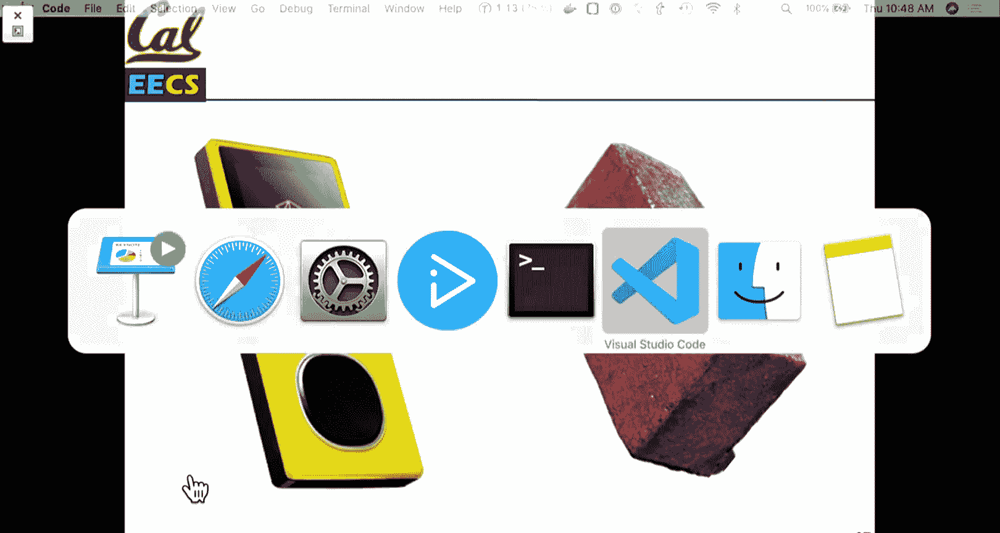

And not this project。 let's see this one。 So what， what was happening with the zoo。 Well。

 when the zoom started up， it would try and check。And try and figure out the current date。

 so it had an internal clock that started at 1980 and it would report the number of days since 1980 so。

January 1st， 1980 would be one day， January 2 would be two days。

And so there's this piece of code that would turn this into the current year。

 the current day and month， and so on so that the software could have dates in a useful format。

So naturally it wasn't written in Ruby， but this code is sort of。An exact。

Transliteration from C or Java to Ruby， and there's a pretty good form thread on the Zoom forms of like people going through and on their own also writing suggestions and refactoring of this code。

But you know you can see that this is just the exact as close as we can get sort of variable for variable translation of what's going on。

And naturally there's a few problems here， first thing is that the variables are just single letters and there's a lot of magic numbers。

 so we might presume that when I said it starts the year starts off at 1980 that y is a year D is in this case the number of days。

 but you know it could be other things and we have some nice magic numbers here that you presumably 365 number days in a year。

嗯。😊，And then we'll get to what the logic in this condition does in a second。

The first thing we can do though， is sort of a little bit more concisely reformat this code。

 write it so that we know what the variables are， and this code still has the bug。😊。

Let's see what is my file name？呃。So we have a simple R spec file here。

And it's going to run through some tests。And one of these will exhibit the actual bug。

 So 365 days in is the year should be 1980。 so December 1 December  December 31s， 1980。

Is going to be。呃。One of the options。That。900 days in is sometime in 1982， and then the first day。

366 days in would be in 1981， and so if we pop over here。

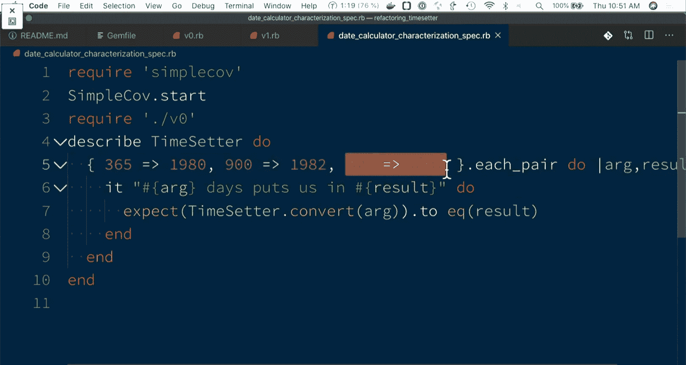

No， don't need to install something。So。We can do our spec。And we have our first two tests。

And then our third tests， well， it's kind of stuck here。

And the reason is that this code leads to an infinite loop。

 and that's why zooms were bricked for a day so。

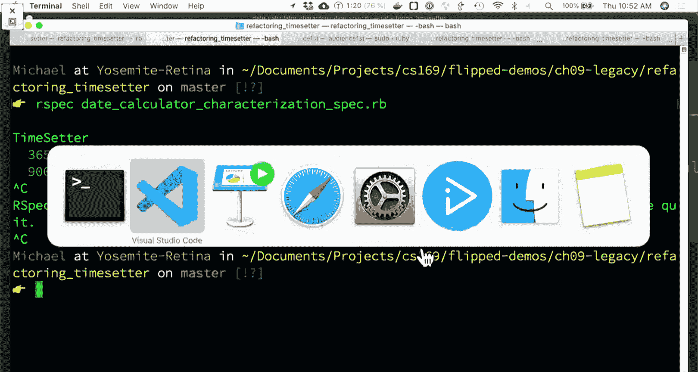

Well， how did this happen， there is a condition that only on the last day of a leap year。

 this date gets。Subtracted out but。But it never then loops or breaks out of this while loop because if days it becomes greater than 366。

 the year gets incremented， but then the while loop stays at zero。

 And the exact reason for that is honestly pretty messy。

 like reading this code is not the nicest thing to do。

 So we're going to walk through a series of improvements。 This code， it's mentioned in the slides。

 but it's all in the flipped demos repository of the SaSbook organization。

So one of the first things that we can do for this method is to extract out a leap year method。

 and this is really important because the rules for leap years are really esoteric。

 most people know that years that are divisible by four are leap years。

What gets weirder is that years that are divisible by four and divisible by 100 are not leap years。

 so 1900， 1800， 1700 are not leap years， except years that are also divisible by 400 are also leap years。

Don't ask me why。 I certainly didn't come up with those rules。

 But so that's why the year 2000 is the leap year。 That's， you know， the year 1600。 Yeah。

 the reason most people don't know the exception is because we are also。

Born or live around a time in which every 400 years， the century year is a leap year。

 so real lucky enough to live in the time where we hit the exception in our code。And so。

 the code for checking if something is a leapier is a little bit more complicated than just if something mod 4 equals0。

And so。Yeah the first thing we can do is just say something if iss a leap year。

And we could write some tests for is leapier to verify that it works correctly。

 and so we could even just do R spec V2。

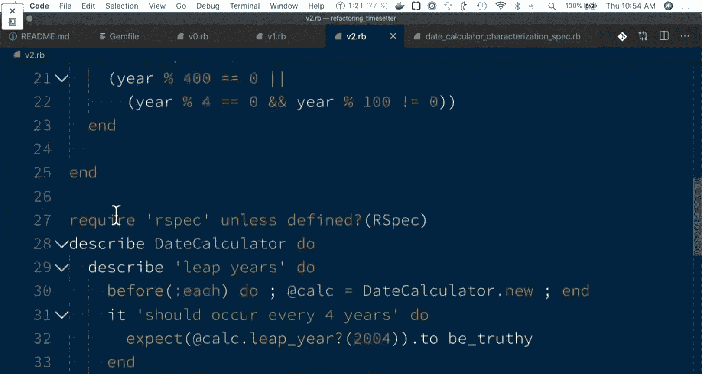

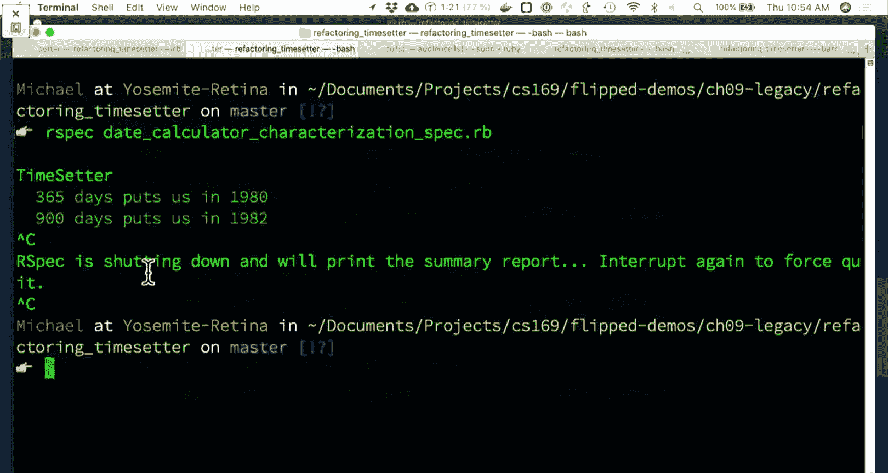

And should occur every four years， but not the 10000th year and yes， on every 400th year。

We have a couple methods here， so 2000 is a leap year， 1900 is not a leap year。At the top here。

 we have a slightly better understanding of what this code is trying to do。If we go to our spec file。

 change this to V2。呃。Why doesn't that work？Okay， so this one is not set up to test V2 really easily。

嗯。What is our。 the methods are indifferent。 So we're not going to bother fixing it right now。

 You can just trust me that this version still exhibits the bug because all we've really done here is refactor out the method。

Is leapier and as we go through。We can nope V3。呃。One of the things that we might notice is that， you。

 there's a few different things going on here so we can extract out a class that has。

Maybe an initial property for a year as an instance variable。

 our days is an instance variable and now we can give some more declarative meaning to the code。

 so while our days is still greater than 365 if it's a leap year， add that it's a leap year。

 otherwise add that it's a regular year and at the end， return our year。

 so this version of the code still technically broken but gives us a better sense of what we're trying to do。

😊，We have our leapier method condensed a little bit， we have our add leapier method， so again。

 what it's doing on the inside hasn't really changed。But。

We can at least try and understand at a higher level what it's trying to do。And let's see how。

Our spec works for V3。So all we've tested so far is still our leap year， but that still works。And。

Sadly， I can't prove that this also runs into an in loop， but it does。

 you can run it later and now V4 is where things。嗯。LetSee， what does V4 do？

OhV4 I think was what I was on， still has a bug。And then the final thing。Is a fifth version。Which。

Use as a Sam loop has a similar structure and this one。W should actually have the bug fixed？

But the more interesting thing here， aside from just fixing the bug is。

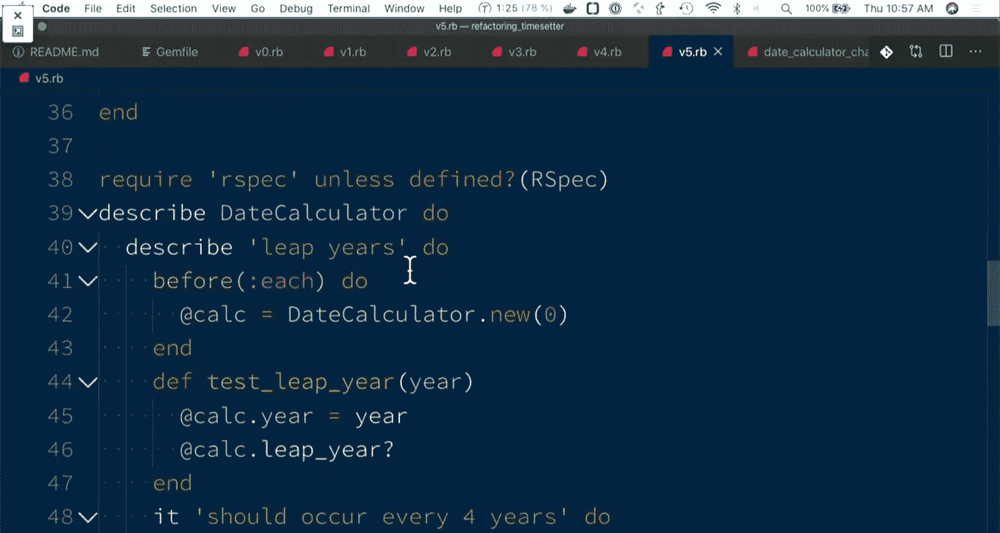

If we were to do something。Where we can。呃。As we go through， we can use Flog to Flog our files。

 and so V0 and V1 don't change much。You can see that V2。

 the total file has a little bit more complexity， but the individual methods here are decreasing。

 so from 21 to 14。

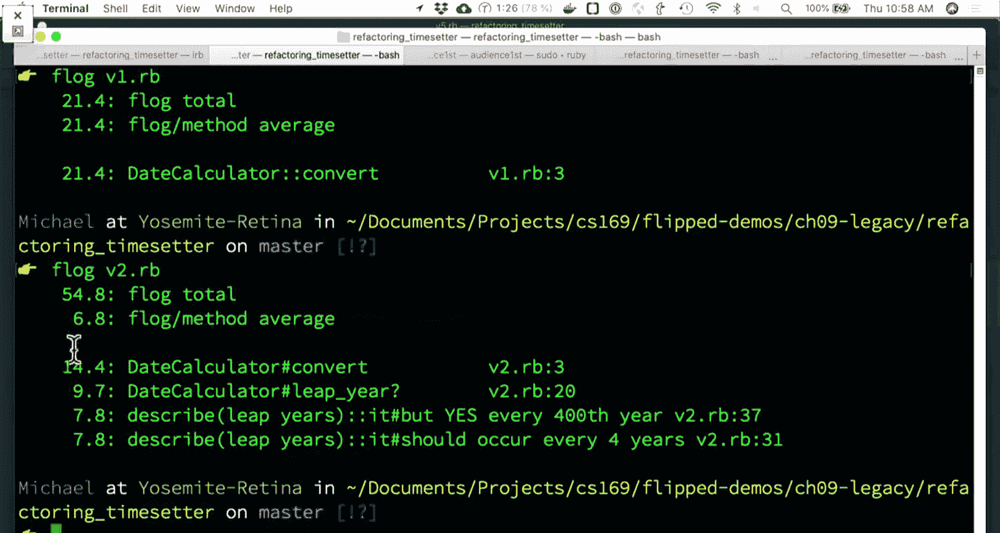

And again， the total file， because we added tests within our file goes up。

But as we go through from each version， we have code， which is。A little bit more understandable。

 we have more methods here but。Again， each of our individual methods。Is。Less complex。And V5 has。

A little bit better overall。 so one of the interesting things so that was F let me see if I have it up here。

 So there is another interesting tool called Ruby Critic and it's not super useful on a repository with four very similar files and not much Git history but what Ruby critic does is it will combine the tool reek with F simple coverage I believe and a couple other things and you can run it on your repository and it kind of is in some ways a similar local version to code climate。

 but something that you can just run nicely simply by just。Running。Ruby critic in the directory。

And when it does that it goes through and it gives you some nice charts。

 you know if you're using code climateimate which you should be and it's all split up。

 you know you can just push and look at code climate。

 but Ruby Cri is also a cool tool that breaks things down for you locally in your browser you just add it to your bundle file as gemm Ruby critic and it's there as well。

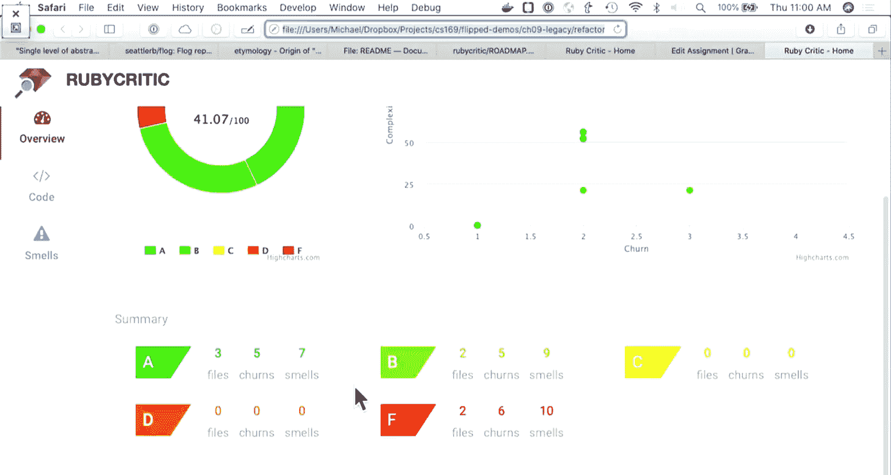

This is another one of the tools that you have available and yeah， we'll leave it there。

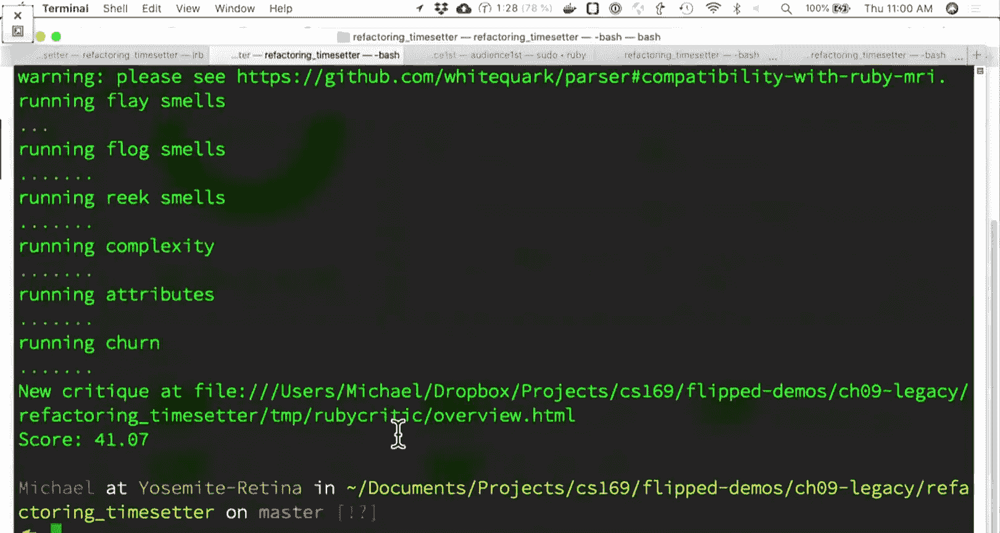

We'll skip the questions， but just there's a lot of things that we have for refactoring。

 use the tools that you have available。And you know， just as you're work in your projects over time。

 keep things moving forward in a positive direction。And we'll see you Tuesday。

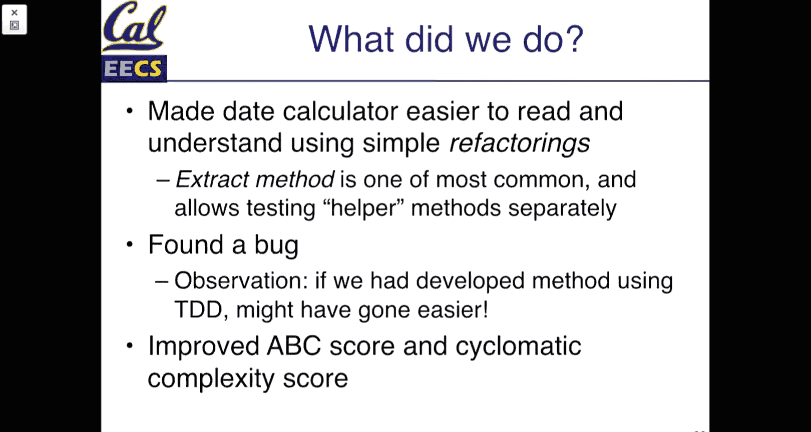

Okay。你有问题，嘿。Are you doing the lunch。not today。

喂。