# UCB《软件工程｜UCB CS169 software engineering 2019》中英字幕deepseek p24 24 CS169 24.zh_en -BV1UsB7YPEMj_p24-

嗯。The idea here is that each browser may have different APIs or slight incompatibilities。

 and JQury will be the way of neutralizing those incompatibilities。

 So there are dozens of years now of development that go into jquery and handling browser bugs。

 So if you use Jquery， someone else has handled the browser bugs before you do， ideally。

And the really nice thing about JQury is that we have a global Jquery object。

 It is most commonly alias to the dollar sign variable。 and so。😊。

This is your typical interface to manipulating the Dom with Jquery。 Now。

 you absolutely do not need JQury， but in terms of speed and efficiency。

 you get a lot of value by being able to select elements simply by saying dollar sign and passing in something like a class name。

And there are a bunch of different ways that you can call it。 So this is。The basis of。

Right J Cy does the most common thing， selecting elements。 So dollar sign selector。

 and you get an array of elements back。 So you can do dot each pass in a function to manipulate them。

 So maybe you have a series of counters。 Maybe you， I need to update a user name。A set of links。

 anything like that。 You can。You can wrap an individual element in a JQury selector。

 So if you have a native Dom element inside a function with JavaScriptscript。

 that's what this will become。 So if I ever have an oncl handler for a button， for example。

 this will refer to that button， and if I do dollar sign of this。

 I have now wrapped my element in JQury。If you want to access something like the whole window and see what JQury does with it。

 you can wrap document do window in JQury， you could wrap document dot body， whatever you need to do。

JCry has a really cool handy syntax， which is if you pass in HTML。Opening tag with angle brackets。

 closing tag with angle brackets， it will create a tag。

 You can actually create a new element just by passing in opening brackets。

 So if you just do a span without any content， it will also create an empty span for you。

 So if you are doing some basic manipulations of your front end， then this is a really handy tool。😊。

And then the nice thing about Jquery is that you can。You can chain methods。

 and it gives you really handy callback for when the document is ready。

 you can pass in a setup function， and it will do that for you。

 So this is a chart of some simple jquery tools for reference。 again， like all APIs。

 don't learn them at once。Learn them over time but know that they are available。

 The JQury documentation is pretty darn comprehensive。 it's up to date。

 it gives you a bunch of examples as well as interactive viewers to play with things so if you haven't seen it yet。

 I encourage you to use JQury， it will make your life a lot easier if you're dealing with browser bugs and you don't have JQury that may be a good tool to reach for。

So。If JQuery and JavaScript give us the ability to modify a web page under band？

AX is the tool that gives us the ability to make our web pages interactive in terms of remote data access so。

It stands with this horribly annoying asynchronous jascript and XM L。

 otherwise known as I'm gonna make a Web request and get some data back。

 So we've talked about this a little bit in the past。

Which is we have some functions in our web application and we have some events that our application needs to respond to and when we do that we can make a call to a remote web service。

 access some data and the response that we get back will be the result of a web request that we can then process with JavaScript and update our application accordingly。

Naturally， most modern web applications use AjaX in some way。To accomplish。Their work。

 which is that on Facebook， when you start infinite scrolling。

 it makes an AjaX request to add the additional posts that weren't there when you first loaded the page。

When you you know click like on a post that is an AjaX request to save a like to Facebook instead of reloading the whole page and the way that this works essentially is each of those buttons has a callback handler that then makes the AJX request and beyond that you can do whatever you want they can add or change the Do。

And they can make as many or as few H X requests as necessary。 So with this， the important thing。

Is being able to test our AJX code， which is we have a Ras app。

Cucumber our specs so far are set up really for testing rails like things。

 we need to make sure that when we do this， we have our test suite set up to test our JavaScript code。

呃。In both。In both cucumber and R specEC， you can tag things with JavaScript to tell it to run JavaScript in the browser。

 which it may not do by default， if you run into tricky scenarios setting up a new test suite。

 post on piazza because there are some tricks to get things to run in the browser nicely。

And the other thing that we'll talk about a bit。Is applying our same testing philosophy that we have in Ruby to our jascript code。

 So Jasmine is a tool in Javascript。 Jest is another one， but there are。

There are lots of tools that we have for that。嗯。How do do we go about manipulating the dom？嗯。

Generally， what we have is we will bind some function to an element so we can do this with jry Do sign element do on click。

 When we want to test that， we have to make sure that the handler gets called。

And so we're going to write our own function。 and when we test things。

 we're going to have to make sure that we have the ability to test this。 So we。

 we use jque to select our elements。 We have a function that does our work。

 and we use dot on click dot on key press。On scroll。

 whatever event handleers we might have to trigger that callback。

 And so let's see if this is not on the next slide。No， okay。

 you're not going to click what I want you to click。There we go。嗯。so。Oh， dear。 that's。There we go。

So we have some HTML here。 This is a really simple page that just has a paragraph。

 it has this thing that says show details and a checkbox。And then somewhere else in our page。

 we have some javascript。 So what does this look like， Well， we have a mod。

 we can drop things in an object just to group them together。

 But this is not necessarily a requirement。 We have。A。We have a hide function。

 So when this function is clicked， if the checkbox is checked。

 So this is syntax that jqueery gives us， which let's make this a little bit larger。

This is checked is a way of checking the instance of this particular checkbox up here and a checkbox because it's a Boolean thing can be either checked or unchecked。

 if this is true， we'll show some stuff。 and if false。We use slide up。

 which is just a nice built in jQury animation。 you could just call hide and show。

 and then we'll toggle some stuff。 and we have a setup handler， which when the checkbox changes。

We call our function， which is on change。That we're going to hide things。By doing this as an object。

 we can just pass this directly into the global Jquery handler。

 That's kind of a shortcut that Jquery gives you。 But we could set this up in， well。

 probably dozens of different ways， which every way。You're comfortable with， you can do that。

 And so what we have here are a callback to update things。A setup function。 And initializing that。

With Jquery。 And that's。Really， the gist of manipulating the dom with， with jQuery。 And from there。

You start with a few simple things。And then you quickly realize that it's very easy to break functionality with javascript。

 So we need to think about how。We test our application and so the same way that we practice TDD with rails。

 we can practice TDD with our JavaScript code as well。

 And so we'll talk about exactly how to do that in a moment， but it works essentially the same way。

 We use a library called Jasmmin。Which gives us our spec like tests for JavaScript。So。With Ajax。

 we can enhance the ability。To test or add interactivity to our applications。

The the really important thing with Ajax and railils is that depending on how you implement your rails application。

It may be easier to render HTML from your rails application。😡，Let's not have that show up。No。

 there we go。So。Within a rails application， we may want to specifically respond to H XMl H TP requests。

 So when a browser。Makes an Ajax request。 It adds an HtP header。

 which says it is requested with Xml HtP request。 Importantly， this header could be left off。

 So this is not necessarily a foolproof method， but it is something that browsers all do by default。

嗯。And our rails application will have a controller that gets triggered by this request。

 so for example， I might have a route which is get user profile and there is a show method and the show method could render a full page。

Or it could different respond to an AJX request differently， maybe it renders a user profile card。

 maybe it renders some JSON data or something。And what this controller action should render depends。

Specifically on。The design and the needs。O application， but。We have the ability to say。

 don't use a layout， we can render a partial。We could render JO。We may choose to render XML。

For your sanity， I hope you don't have to render as much XM L， but it is an option。

 or we could just return plain text， nothing。 These are all。Oops。

 these are all the render options that Rails gives us。

And the design of your application will dictate what is best to render。

 A lot of modern rails applications choose to go the path of rendering Json for。AjaX data。

 so you ask for a specific resource， you return a JSO object that has the details of that resource。

 GitHub。Goes the way of rendering partials for Ajax request。 So if you use the labels feature in。

In a GitHub PoQu， when you click on the labels drop down。

This could have changed since I last looked at it。 but in general， this is how Gitthub works。

 which is you click on something like the labels drop down。

 GitHub makes an Ajax request to the rails application。 and instead of returning Json。

 what the rails application does is it renders a prebuilt HTMLtl partial。

 which is the rows of that labels drop down。 So instead of having a front end take some JSsonN data。

 turn it back into Hml， Github uses the full rails setup of having a view that goes through。

Rils renders HTML， and then the AX request returns HTML。

 which is then added in to the front end page so you could choose to render really whatever you want in response to an AX request。

 but。That will sort of depend on how your application works。

 So if our server can respond to Ajax requests， How does our client make them。

 The easiest way is Jqueries's Ajax method。There is raw XML HGP requests in Javascript。

 If you're not using JQury， it's a perfectly fine and usable tool。

 but this is much easier and much clear whoops and。The reason that jCray is nice in this way is that。

It is much more clear when you separate your success and error callbacks as to what happens。

 So we get to specify the type， get post， put， patch， whatever we're using a URL Timeout is optional。

 but timeout says if our server is slow， automatically fail the request。

 you generally want to think about what will happen in the case of a timeout。

Particularly if you have a mobile application and a user is on a subway and their network connection dies。

 it may be useful to alert the user nicely that they don't have an internet connection。

And then you have a success and error function that you can pass in。

 which is success is we've gotten the data that we want。

 error means that this request has failed for any number of reasons。

 It could be the server returns an error or it could be that the request never even reach the server or never completed for some reason So those are the basic ones that you may want to use。

 but JQury provides a whole bunch of APIs， there are some really useful tools here where if you are dealing with data in a certain format。

 especially if it's JSON data， if it's XML data， JQury has tools to automatically parse that data into a nice jascript object to validate that it is JSsonN or whatever format it should be。

 So if you're doing this check out the JQury APIs because they're helpful there so。U。

If you haven't seen it yet， how do we include JavaScript in our Ruby applications？

We have a really nice tool called Javascript。 includelude tag。 So by default。

 the asset pipeline gives us an application dot Js file。

 which is the entry point for all of our application jascript。😊。

It's included in app assets JavaScript。 if you're using Rail 6 with webpack。

 the setup is a little bit different， but this is all still available to you。In there。

 we get to define whatever ja we want。 Importantly， the nice thing is in your rails application。

 split your JavaScript up into multiple smaller files because rails will bundle those up for you into one bundle that gets loaded。

 So multiple small files again helps for maintainability。

In there we get to define whatever functions we do， we want to， so calling HX。And then。

In our rails application， we'll look at how we define controller actions that respond to Ajax。

And in our JavaScript， we will define whatever callback functions we need。In our client side。

 we write the JavaScript rails uses。Put sight in the right spot。

And then it's up to our server side to handle this。 So depending on your request， you may not need。

You may have different routes， or you may be using。The same route to handle multiple different views。

 And that's perfectly okay。So， this is。Our rotten potatoes application。 we are showing。

 we have a route that shows a movie。 So by default， right， this is just the information page， views。

 movies， show do H T M L。😊，Let's say we want to have a request that is an AjaX request that shows part of the data about a movie。

We can render just a partial in this case， so this would be returning just some HTML about the movie。

And。How we check is Rails gives us this request Xhr question mark method。

 and this is what railils uses to check if a request is coming via JavaScript。

 it checks that X requested with header， and as long as that header is present。

This partial will still be rendered instead of our。

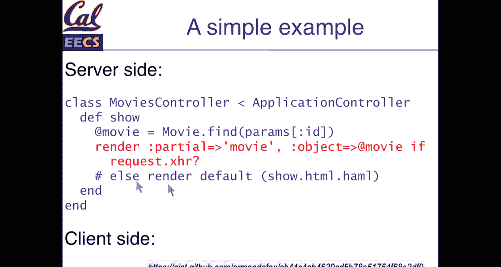

Or other default one， and。That is not particularly helpful。

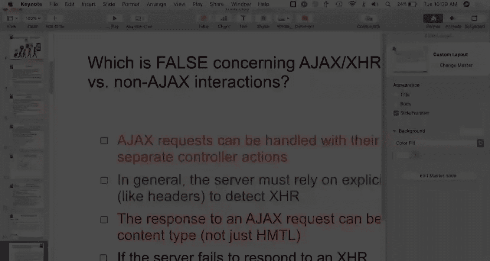

But， we can。If we want to really quickly just view this one。Which， again， a similar setup to before。

 But our client side， we have。Group things into an object again， we'll use the common setup method。

 which is to， in this case， create a pop up Dave。Hide the div， but append it to our body。

And when we click on the link for a movie， we。We will call this get movie info function and get movie info。

Will create a call a function that creates an AjaX request when that AJx request is successful。

It will then show some movie info。 And so how we set this up again， multiple ways。

But the idea being that we have an element that we can click on， when we click on that element。

 a request is made that returns some data， and then we insert that data into the DOm of our web page。

And in this case， we define a hide movie info function， which。Will hide that info that we just added。

 So this is something that。Whatever it needs you have for your application。

 you can interactively add them。 so with that， we'll jump back over here。

And let's see if the iClicker app is cooperating。Which is。Okay， cool。 So it's not showing me things。

 but it appears to be accepting answers。 Which of these is false about Ajax requests versus or Ajax versus non Ajax interaction。

 So one of these is false。Alright， we have about 30。

And it seems like we're probably not going to get much higher than that。

 So let's see how we're doing。And is it now going to stop？Oh， yeah。Is not right。It should be。

 although this application is continually problematic， let me restart it。嗯。Oh， no， hey。

 not what I wanted。Hello。Okay。嗯。W now。Okay， well。That's。Wonderful。No， okay， wellow。

I may not be able to get the online thing working。Let's see if。I have a second one。Now， now。

 what the heck。Oh， it just crashed。 That's fun。问嗯。No， it's not already running it to crashed。Okay。

 well。嗯。It。Oh my gosh。 yeah， let's this， this thing may not， may not be coopering very well。

 So if this， okay， well。

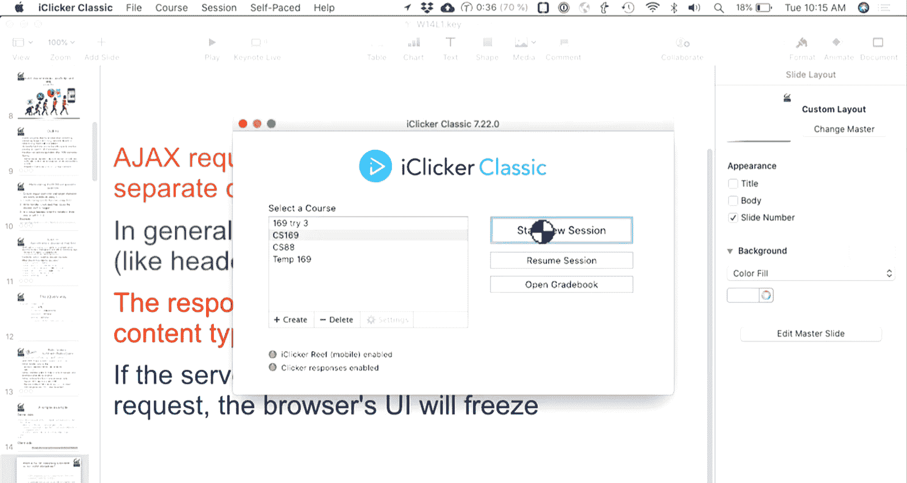

Augt。Yeah，If it shows up， we'll know。 in this case， most of the people， oh。

 I don't have the circle on this one。 Most of people voted for D。

Which is correct。 The browser's UI will not freeze if if an Ajax request fails or if a server fails to respond。

 the reason for this is that despite the fact that ja is single threaded， the browser waits。

In the background and processes the rest of JavaScript until our response comes in。

 which is why we use callbacks and not just。Writing sequential code。

Ajax requests can be handled with their own controller actions。

 This is up to you to call a route that makes sense。 So if you want an Ajax only route。

 you can do that if you want to designate your Ajax request to be the things that return Json。

 where they have a certain。Format to them， you can do that。In general。

 the server must rely on an explicit hint。 This is true。

 So when we make a web request to our servers。The server doesn't know anything about where that request is coming from。

 except for the headers that have been sent with it。

 so browsers will send an X requested with header different applications may send their own headers。

OhBut if if that X requested with header is not present。

 we can't know that that request is necessarily from a browser versus from some other API or something like that。

And the response to an Aja request can be any content。 This is true。

 So which whatever we decide to return， we get full control over that。

 that could be a file that could be HTML。 Most commonly， it'll be HTML or JSON。

 but you can decide that as you will。 So in this case， the correct answer is D。

 and I'll add that to the slides later so。Now that we have had the chance to write some jascript。

We'll want to be able to test and debug JavaScript。So。In the browser。

 the best place to dobu JavaScript is using the browser inspector and we'll show that in a bit。

In our test cases， so if we have Cappy bar specs， if we have R spec integration tests。

 we'll want to use something that mimics a web browser。Like to run these。

 so if you're using cucumber already， it should hopefully be set up。

Pultergeist is an option which has a local headless version of a browser。

 so headless means that instead of opening up Chrome or Safari。

 it in memory has an instance of a browser but doesn't display the page but goes through all the same actions。

More recently， Google Chrome has pretty good integration with。Cpy Bar and testing。

 So you can install Chrome driverver， which also has a headless option。

 This can sometimes be a little bit thinly to set up。 But the way that this works is。

Whatever we're using。We say capybar register driver。 So there's one called poltergeist。

 there's one called Chromedriver。 You add those to your gem file。

 You'll have a local version of whatever browser， whether that's Chrome or poltergeist。And。

You tell Capy Bar what to use for。Javascript and。But within our own tests， we can say page。

 So page is the global variable that represents our， our web page instance。

 and we can call page do driver dot debug。 This gives us in our rails console。

A Reple which lets us interact with the browser。 we have useful things。

 let's see if they're not on here。But within within our page do driver。

 we have a lot of other useful tools， we can save page or save an open page which will save the HTML and open that file。

 We can take screenshots because this happens within our specs。

 we can set any kinds of breakpoints and inspect our。

Either our jascript or our Ruby code from within specs。

 So what our jascript tools will do is let us debug jascript from within a rail spec。

 So if you're having an issue with some front end specs that are not passing using page dot driver is the useful way to get at them。

As well， but。What may also be useful is testing more of our ja directly in ja。

 And we'll go through this pretty quickly so that we have。

Some time for hopefully some more interesting stuff around accessibility。But Jasmine is essentially。

Are our spec equivalent for JavaScript？😡，And the nice thing here is that。If we add the Jasmine gem。

And if we're using Jquery， Jasmine Jquery adds some additional helpers， we get。

We get rails tools that set up our specs in our directories automatically， so。

We can generate and install Jasmine test specs right in the standard place。Which is， again。

 in our spec folder， if we run ra Jasmine。That will run just our JavaScript tests in its own server environment。

And then we'll look at how we build these tests and how we see what they should operate on。

Jasmine works like most TDD libraries。 We have describe blocks that group test together。 So in ja。

 everything。Is called as a function。 So in Ruby， when we say describe that is its own function in Ruby。

 but because Ruby has optional parentheses， it looks like its own mini language in JavaScript。

 we have to put the parentheses there and we have to use the function keyword。

So it's a little bit more verbose， but it does essentially the exact same thing。

 which is describe willll group a series of test cases。

 each test case uses it instead of do and we have a function and。

In terms of what the program is doing， these are both almost identical to each other。

Instead of an argument， so in our spec， we have before each or before suite。In Jasmine。

 we have a before each function。 there's a before suite function if we want to do one setup block or whatever that happens we happen to need。

 And so we call this function and in terms of what we do within there。

 we define an anonymous function that does whatever setup work we need to do and the setup work here is going to be setting up our web page and our front end stuff as well so。

Expectations work almost identically， as well。We have expect some expression and we have to equal to be truthy。

 a whole bunch of these as well， but if there's something that exists in our spec。

 there is almost certainly an equivalent method in Jasmine as well。

To be hidden and to be visible are both really useful things for JavaScript because often what you'll be doing is choosing when to hide and show your content。

 The nice thing about tests like to be hidden。Is that however you hide your HTML from the browser。

 so if you're using display none in CSS， if you're using the HTML attribute hidden equals true to be hidden will handle this nicely so you don't have to check for a specific CSS class or something like that。

 you can just say to be hidden and it will do the right thing。You can。

 you can check for certain text。 of course， all the same stuff that you might do in。

In your R specEC test， but operating on JavaScript code。So jasmine jry adds。A few additional methods。

 which。Also， ensure that you have Jque available inside your。

Individual test cases so that you can operate on them。And。😡。

We could write a really simple test case that says clicking on the hide button。

It hides the movie div。 So when we。Have this function retrigg a click on it。

 we expect the results of our movie to be hidden。And so this works really declaratively。

 we create a test case the same way instead of writing rails code。

We write a snippet of jQury that simulates clicking， so trigger click。

 we can trigger key presses with specific keyboard values that we want to input。And so on。

 And after that action happens， we can expect some div to be hidden and so。

This is essentially our spec， but operating on our。Our JavaScript code。嗯。

Jasmine uses the term stubbs to spy or。Create methods that replace real methods。

 but let us do things like inspect whether or not they're called similar to mocks and doubles in our spec。

So if we want to spy on something， we can use the spy on method with an object and the method name and have it return a particular value。

We can ask whether it's called through something so。which we'll check when we call this。

 we'll set up the stack so that as a movie new movie pop up is called。We can。

We can check that it's been called properly， and then we can say and call fake， which is。Well。

 I function that we get to define what happens in our test case。

 So and call fake will be a callback that if we want to return a fake instance of this movie。

 if we want to stub out some specific Ajax request， we have the option to do that。

And importantly here， what we're passing in on the spy on is the actual object itself。

 So this is whatever we defined in our ja code。 So a movie pop up is a jascript object that exists。

In our code。And we pass in the exact name of that object。So a couple examples here。Ex movieviepopup。

 new。So that most recent call。 So this is a way of checking what this function was called with so we can assert that we've asked for some movie pop up for the movie gravityavity。

 We can assert that the URL in some Ajax request。 so this allows us to inspect the arguments to Jque's Ajax method has been called with movie slash1 so。

We can。Like our unit tests， stub out values that we don't yet have defined and make assertions that they are called with the right data。

And so those are useful things to have。 H TL fixtures operate like rails， fixtures for objects。

 but contain snippets of H TL， so。Again， this is a tool which not every application will need。

 but is a useful thing to be aware of。Which is providing the basic amount of HTML。

 the minimal amount that we need to test a specific test case。 So the question is。

 if we're writing unit tests for our controller actions or for model actions。

 how do we write unit tests for specific pieces of ja。Well， we can use HTML fixtures to do that。

 And so one way of doing this is。Using。Using Jasmine's fixtures function to load in a snippet of HTML。

And set that up and the textbook goes into more detail in this。

 HTML fixtures are a useful thing when your front end gets complex。

 but you may also be able to get away with not adding them just by having enough higher level integrations tests。

 but they are a useful tool for certain kinds of applications。

 and if your controller actions or returning HTML instead of JSON。

 this can be a useful thing for those as well。嗯。And we'll go。We won't go into too much detail here。

 but again， when we stub data。What we're doing in JavaScript is at each level we're stubbing things in a similar way that we might be in rails。

Where we might be studyingbing controller actions， we have the ability to stub things like。

Like individual JQury calls， we have the ability to stub out browser APIs at each level as well。

And this sort of roughly aligns how we might think of them。

But the the mapping here is not necessarily one to one because the UI might not always correspond to our models。

 but again， we have the ability to stuff that out。And。

This is probably not going to let me call this or click on it。 We'll get to that in a second， but。

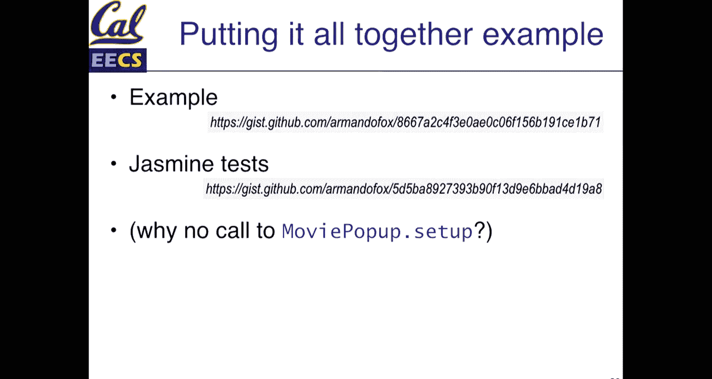

We'll just go through these really quickly， which is。We can put this all together， so。

Each time we're showing a little bit more complex JavaScript， which is。

Going through expanding the amount of detail that our movie info divs have。

 So this is responding to some JsonN data。And in。And in our。spececs。

 we could define jasmine specs that operate just on this jascript， so。We。

 we have tests for our setup function。 We have tests for clicking the link。

 So one thing to be aware of。Is that。呃。When we have JQuery， we'll have to be aware that。

 you know potentially if we're not stubbbing things out， that that would be an asynchronous call。

 but by stubbbing out and spy on JQury， we can just assert that things are called without making that actual HP request so this simplifies the structure of our tests。

We can then stub out。Htm responses。As well。And that when we。When we expect to make things visible。

 then we could use our standard assertions as well。

Everything that we have in R spec with Jasmine tests， we can have the exact same structure and。

The goal here is to use it as our JavaScript gets more complicated than we want to have test cases to cover that。

So。Let's see if this even works。It probably will not work for the。呃。Cool。

 so it should be accepting responses。And we'll see if we can get to 30。

I don't believe the online clicker app is working them。 So in this example， if we have and call fake。

 why do we pass in Ajax as in the in the Ajax call rather than just and return。

 So we went through this pretty quickly。 So don't worry too much。If you didn't get everything， but y。

 we'll with this。And we're a couple shyve where we were before， but it's about a minute。

 so I can't show the responses and the answer thing is hidden again， but most people selected B。

 which is the correct answer， which is the Ajax method。

Doesn't actually return the result of the Ajax call， the Ajax method in Jquery， it returns an object。

 which is all the data about the Ajax request， but the data that we would want to be returned or HTML or our JSON data is。

Would， would be asynchronous。 So that's why we have a success function。 So when we stub out。

When we're dealing with AJX requests， we we don't want to fake the return response of the Ajax method itself。

 We want to use and call fake to assert or to spy on other properties。

 and so this is just something to remember that in JavaScript when we do things asynchronously。

 we're often not necessarily looking at the exact return response。

 but what that function is called with and then stubbing things out at a different level if we need to。

 but the correct answer to this one is be that AjaX itself does not actually return the server content。

So。This is about using JavaScript。 wrapping this piece up is。You know。

 in our serverside applications， we're using rails。

 There are now use cases for node JS which exist on the server and what we've been talking about today in terms of client side manipulations。

 is all very declarative step by step manipulating the API the Dom APIpis with JQury。

 some of you will have used react angular。 if you' are building a frontend heavy application。

 then reach for a framework， which gives you。A little bit more structure on that side。 And that's。

Great。And so。With that， then we have。Hopefully， enough。呃。

Javascript knowledge to talk about how we write JavaScript and how we build applications。

That work in a nice， accessible manner。And there are， of course。

 many different kinds of JavaScript frameworks that we could be using。 So Yahoo has some。

 some of your rails apps will use coffee script。 C script is JavaScript that looks like Ruby。

 if you have it。There is nothing wrong with it， but if you're starting a new Rails app。

 there's no real need to use Ccr anymore， modern JavaScript features get you 90% of the way there without having a special compiler or special language。

 but it is something that you will see potentially in Ruby and Rails applications。

Just something to be aware of that。If you don't need the complexity of JavaScript。

 you should avoid it， which is。MakingT to make your front end faster by initially requiring less data from the server can also lead to making more API calls that end up slowing things down。

 which is one you page of rails loading everything。😡。

That's one server request if we turn that into an initial request that renders no data and replace that with 10 API calls。

Our total server load may go up the more that we have front and JavaScript。

 the more you have to contend with browser APIs and various incompatibilities。

And all this makes testing and debugging a little bit more complex。 That said， most applications。

 especially when you have large teams， are going towards the path of more front to end ja。

 because that is what people want so。With that， the piece that will be useful for homework8。

And something that。Is。Is really important and is how do we write JavaScript in a way that is accessible？

To a wide variety of users。The important thing here with web accessibility is that for most of us as we use our computers。

We don't necessarily think about how the tools that we use。

Interact with excessive technology that we don't need to use。

 So we'll look at some of those examples。 But also the things that we're talking about in terms of building good applications。

 H T L markup， good design， these things have an impact on users in ways that we may not realize， so。

We're gonna talk a little bit about web accessibility。 And at the beginning。

 a little bit about why this matters in general。 So these are a couple older pieces。

 but like really interesting things， which is that one of the。

Fun challenges of at least having the right mindset about doing accessibility work is figuring out how you can solve problems in really interesting ways。

 So this is a few months old now。But there's a really cool piece in the New York Times。

 which is about how designing apartments in a way that they work for users who have wheelchairs。

 which， of course， are wider。😊，Then， you know， sort of most people walking through doors。

 So building things like walk in showers or walking closets are features that help users in wheelchairs that actually lead to spaces feeling like they are more luxury style spaces。

 And so this is using the needs of accessible design to build spaces that feel nicer for everyone as well。

 The other flip side of accessibleibility is that。😊。

If you don't build things in an accessible manner， you can be sued。 and so。

This was a piece about gallery owners being sued because their websites， which are image heavy。

 are not accessible to people with visual impairments and they often say， well。

 if you have a visual impairment， why would you visit a website about images， well。

 maybe someone's doing research， there's lots of potential reasons， but this is a reminder that。

If youre running a business and you don't make your content accessible。😡。

Then the less fun thing is that you could be sued for it。So。In the broadest possible sense。

 when we talk about web accessibility， we're talking about building tools that work for everyone。

 regardless of their disability， regardless of the situation that they're in。

 And this is important because this could be。Something like。

You're using a computer in a room that has good lighting。 and then you go outside。

 and you realize that the contrast， the text on the web page is too light and it's not easy to read。

 This could be something that today， most of your users don't have any particularly special needs。

 But over time， people grow old and they have different needs as well， so。

In terms of and we'll open this up again， just take a guess in terms of the number of users in the United States who have any kind of disability which of these numbers is correct。

 so there's about 330 million people， so there's roughly like a third of a percent， 1%， 10% and 20%。

And let's see if we can get back up to about 30。Give it another 10 seconds。And cool。 So most people。

 we have evenly split between。And the red ring is gone。 We are evenly split between C And D。

 The answer in this case is D。 about1 in five Americans have some。

typepe of disability and what this disability could be could be anything from temporary disabilities due to an injury。

 but it could be cognitive disabilities。 It could be motor impairments， visual impairments。And so on。

 so the the number of users that we're talking about that we're considering here is in general quite large。

 And there's a bunch of other statistics。 So one in four adults on average in the US have a disability。

 which is as you grow older， you develop disabilities， depending on the location。

 one in three above 65， or depending the age group one in3 above 65， have a disability。

 according to the University of New Hampshire， globally。

The average that most people assume is one and seven， but the numbers are pretty hard to track down。

We're grouping these into five sort of broad categories， and of course。

 these don't cover all types of disability。But they help us sort of think about how we might adapt our applications。

 So auditory， So things that if you have a hearing impairment。

 what do you need to be to use an application successfully， cognitive or neurological disability。

 So things like ADHD， dyslexia。Tools that you need for reading and comprehending information。

Visual impairments， so blindness， partial blindness， physical impairments， so motor disabilities。

 how to use a web application if you can't use a mouse。And speak impairment。 So if you can't speak。

 what do you need to do anything differently to interact with the application and for most of our applications。

The places that we'll focus on are cognitive， visual and physical impairments。

 because those affect the tools of。Interacting with web browsers。

 but for some applications that have things like videos。

 providing transcripts may be the solution to people who who are hard of hearing or can't hear it all and so。

Again， the needs for accessibility are often situational。

 so you may go from a light room to a dark room。 You may temporarily have broken your wrist and you can't type。

 So this can change for each user and over time and。Well， aside from legal cases。

 there's a whole bunch of things where it's a really fun problem to work on because。😊。

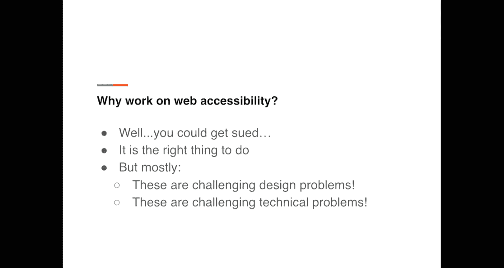

If we think about our。The needs of designing for everyone。

 We get a lot of really interesting results by trying to build inclusive design。

 So curb cuts are a thing that started in Berkeley in the 1950s， and they are now everywhere。

 mostly in part to the。😊。

Americans with Disabilities Act。 But curb cuts are one of these things that we all use every day without necessarily recognizing the fact that we use them。

 They were initially designed for wheelchair users。

 But anyone who has a suitcase can appreciate using a curb cut rather than necessarily trying to pull it up over the actual curb text to speech technology。

 So things like Siri dictation。Those tools started out as providing opportunities for people who can't speak。

 SMS started out as a prototype for people who couldn't hear or couldn't use a phone and so we have a lot of technologies that exist because were trying to solve problems that。

That would otherwise exclude groups of people。 So there's lots of examples here of interesting technology that existed。

 So the challenge is， when we work on our websites。

 how do we make them usable and accessible for everyone。

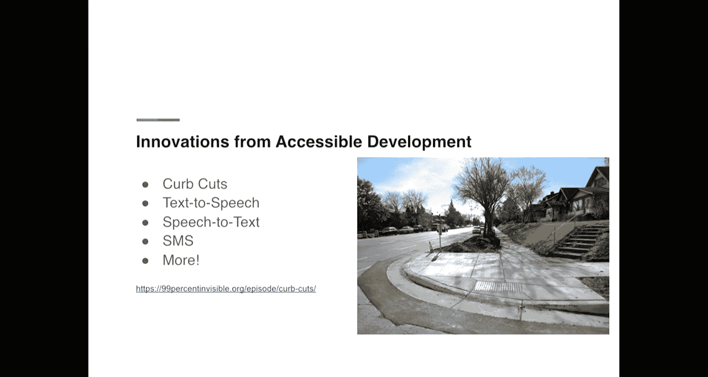

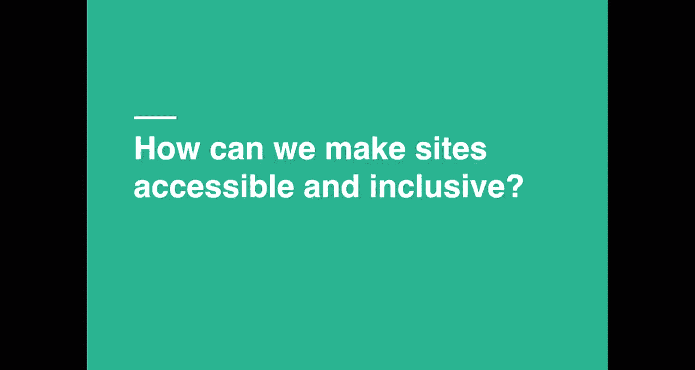

And we're going go through a few， really。呃。A couple of the。

 the starting pieces that you'll encounter。 and these are sort of outlined in the homework assignment as well。

 So color contrast is an important idea。 And if I had time， I would actually go into this more later。

So this is the Berkeley brand website。 It defines if you're building a website。That。

 that uses Berkeley colors， all the， all the nice palettes that they have built for us and。

While we're looking at this， we can see that there's a whole bunch of colors。 We have Berkeley， Blue。

 California， Gold。 We have， you know， a nice array of colors that we could use。😊，The question is。

 we'll come back to that in a second。 How do we decide what colors belong together in terms of text and so。

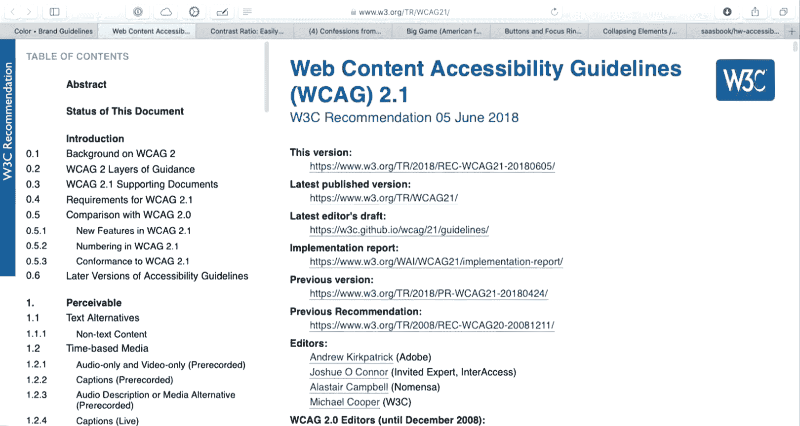

One of the cool things about working on accessibility is that there are a lot of tools that mathematically give us the ability to decide whether we can combine。

😊，2 colors together in a way that's usable or that is readable for the vast majority of people。

 So this is an awesome site， which is linked in。😊，In the homework assignment。

 And it tells us if two colors meet the contrast requirements。

 So the way that this works is there's a formula that ranks things from 1 to 21。

 And our goal is to have a contrast ratio of 4。5 to 1。 So 21， if this were。

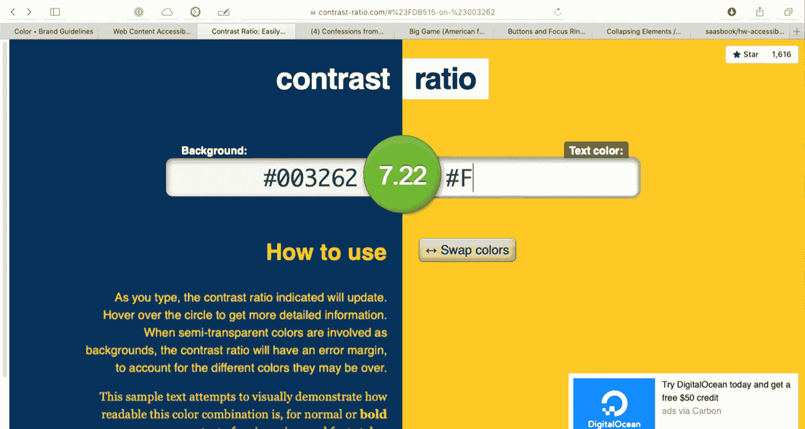

All white。 And this were all whoops。 not what I wanted to do。 And this were all black。

 This is the highest amount of contrast that we can have between two colors。

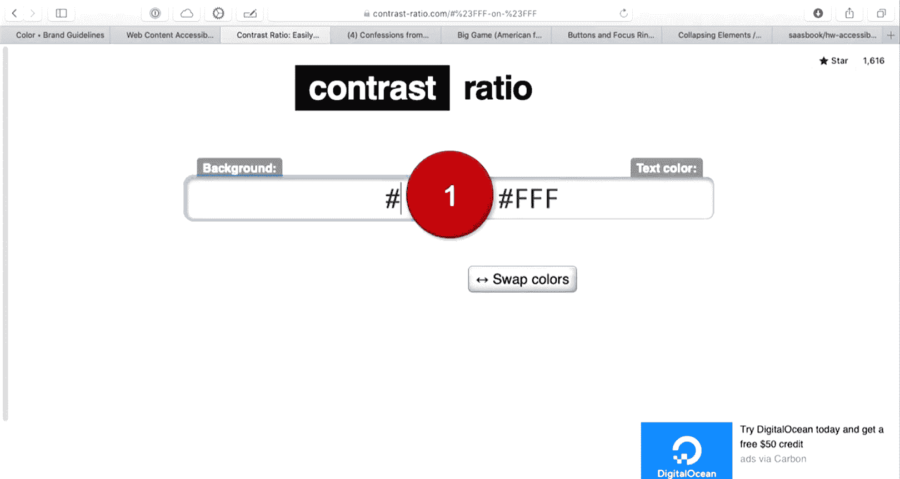

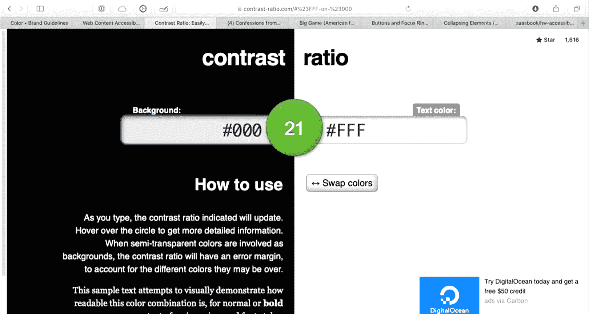

And one is the lowest amount of contrast， which is clear that this is not useful because white on white is not readable to anyone。

A few of you may be able to read something like this。

 which is a light yellow background with white text。And。

It's pretty clear that this actually shows up on the projector better than I expected。

We could even reduce this， or actually that would not help us much。Yeah。

 we could go something like a， which should be a little bit even lighter still。

 So some people will have the ability to discern what text this is。

 But it's clear that in a lot of situations。We would not necessarily be able to。

 or most people would not be able to read this very well。 so there's a group at the W3C。

 these are the people that define the HTML specification。

 They have this both awesome and somewhat intense document called the web content Accessibility guidelines that defines the specifications for what makes applications accessible。

And so one of the things that are in these documents is a formula and a way of viewing color contrast。

 and so if I just go back a few steps。

The the goal for us for our Web applications， according to the spec is four and a half to one。

 and this is not perfect。4 and a half to one is not enough contrast for everyone。

 but it is enough contrast most of the time for most users。

 So this is Berkeley's blue and gold colors which you can nicely combine with each other。

 We could potentially replace this with some other colors that they define like this founders's rock color。

 which is kind of a nice blue。 But what we see here is if we want to use this blue。

 We can't use it on the dark blue background because we don't have enough contrast。

 And this is something where。😊，The goal here is to have a tool which gives us a nice way of checking for this。

 We could。If we wanted to use this to see， well， if we put this on black。

 it shows up pretty nicely against black。

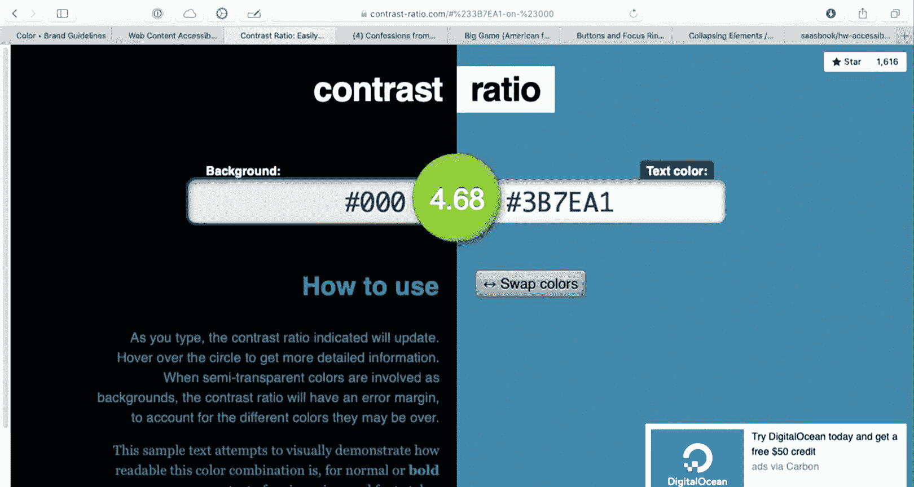

If we try it against white。We are ever so slightly beneath the contrast ratio for white。

 which means that there is a second goal of 3。0 to1， which for large text。

 we could use this value the specifics here don't matter too much because we should have computers do automated testing for us。

 which we'll get to in a moment， but the idea here is that contrast ratio is one of the tools that we have。

To assess our。Our web applications and our tools。And so color contrast is one。 There's a few more。

 One thing that's particularly useful。 are thinking about things like iconography。

 where everywhere that we have an icon， we need to ensure that we have text。

 which will be visible to a screen reader。 So what I'm gonna actually do is。Try and let's see。

 let's go back over here。So。And let's see if this， okay。Let's hope this works。

 I'm gonna demo Facebook， and this is。Well， this is possibly the best confession actually ever written on the UC Berkeley Confessionions page。

 which if you haven't seen it， you should read the lyrics because one of。

 one of our students did an incredibly magnificent job on the song。

 And I don't know if I have sound coming through one like。😊。

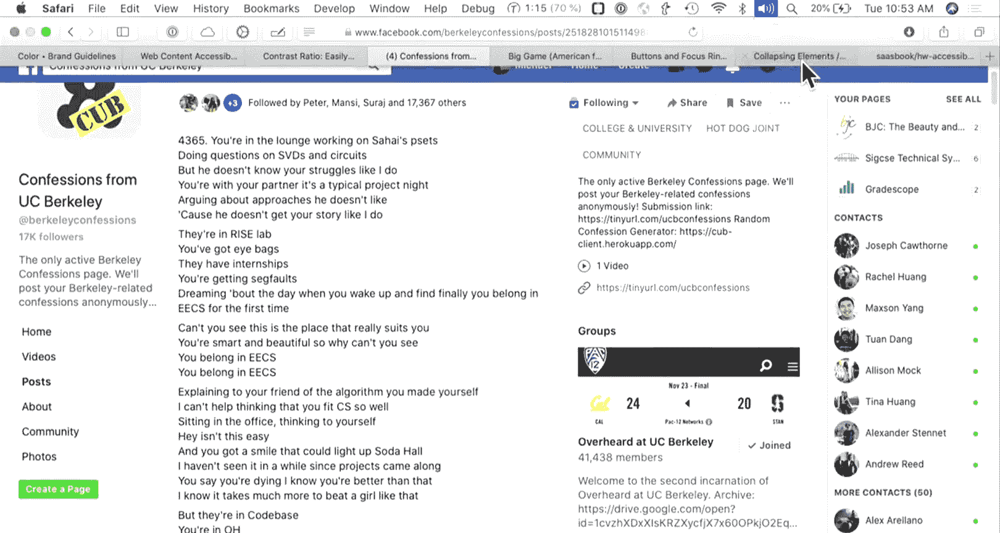

And。

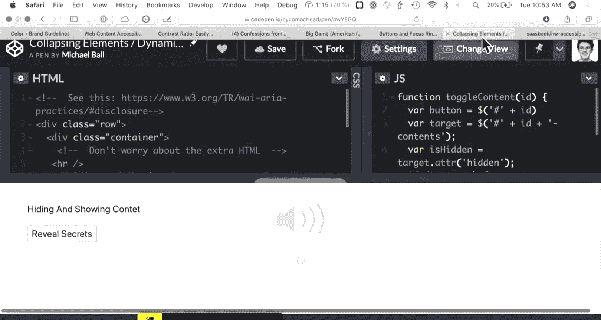

Let's see。 So what I'm going to do here， accessibility options。Weimimei。😔。

Uses a1 key to navigate and press space to toggle an option。

 So what I have turned on here is a screen reader for Mac O 10。And while the screen reader is active。

 it's going to。Well， read the text on the screen and announce things to us。 And so if you have。

No sight at all。 This will be your primary interface。 So if I tab through。

 it's going to read things Safari confessions see Berkeley window4 confessions see Berkeley where concept is keyboard focus。

So when you there's directions in the homework assignment on how you turn a screen reader on for your system。

 but the cool thing here is that what a screen reader is going to do is take everything that is on your computer screen and give you the ability。

To interact with it in a means that it's purely audio。

 or potentially if you have site a combination of audio and visual， and as I go through。

 I can tab through Facebook sections of page。And so an navigation three item。

If you're trying a screen reader， the control key in the Mac will silence it。

 which is a really handy shortcut。Facebook does a really awesome job for the most part of providing interfaces that are accessible。

 which is when you first hit tabab on Facebook， you get this really cool control bar。

 which gives you a bunch of unique tools。And I can use of this page。

And I can use tab to navigate through this different pages。list box not not menu on that combo box。

 Facebook。证据。And so as I tab through。The screen reader is going to read certain elements and try and give them text labels。

 So this said comm box， which is a fairly technical term。

 but this means a thing that I can type in and use arrow keys to navigate the results of link Michael Facebook。

As I go over things that are links， the screen reader declares them as a link。

 it will tell me whether or not I visited them， it will read the text that is in this link。

Li collapse So this is nice in that it tells me that this thing is a menu。 It's pop。

 It can be popped up， and it can be collapsed。😊，And so I can hit it。 And when I do that。

 it will expand the content of the menu。 The screen reader knows that this is a thing that can be expanded and collapsed。

And so while I'll go ahead and turn this off for now。Oh， did that。Aessibility okay， work there。

And what。What screen readers do is they look at the HTML markup of your web page to inspect it to see。

The， the attributes that exist on。

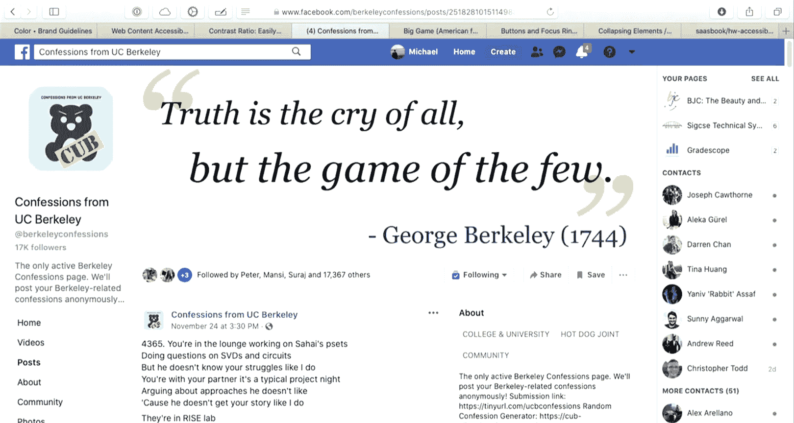

On your web page to make sure that they are accessible。 So with the last two minutes。

 something that I'll go through fairly quickly is looking at how we can take content that is by default。

Might not be interactive and add tools that make it a little bit more interactive so。

This is a button， which by tapping through normally。

 I can just use the space bar to press on this button。And that works as normal， I can click it。

 I get the same result。I've added bootsshoprap to this page。

And I have another button which does the same thing， but just uses bootsottrap。And now。

 as I tab through， you'll notice that I have this。Button in the middle that I can't actually tab over to。

 And if we look at how this is implemented that did not exactly do what I expected it to do。

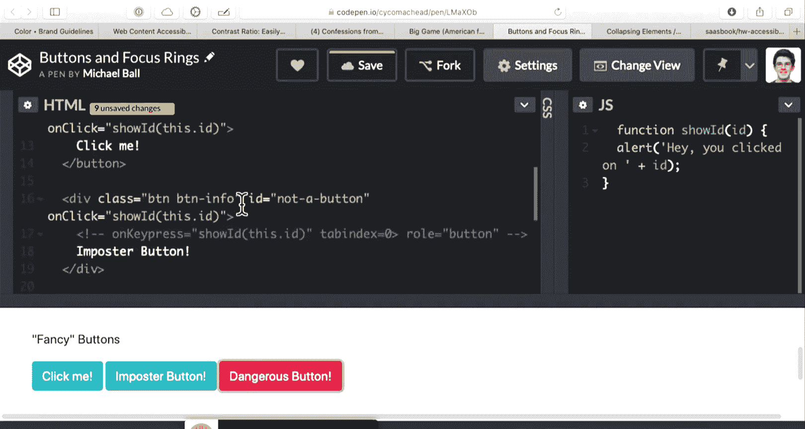

呃。Let's see， oh， okay， that works all right。We have this code here， which。Is using a div tag。

With classes that make it look like a button and with an on click handle。 So in jascript。

 we have the ability with our jascript APIs with the dom to do just about anything we want。

 But if we just add on click handlers without considering。

All the ways that our buttons can be used and accessed。

 this thing will not be accessible via a keyboard， and as a result of that。

 it would not be accessible to a screen reader。So。嗯。

I don't expect anyone to learn or memorize all these attributes at once。

 But what I will do is add and why did。That。n。Show up correctly。 Well， okay， it mostly worked。

 I don't know why it's not syntax highlighting， but what we can do in jascript。Or with our dom is。

 we can say that in addition to responding to a click， this thing also responds to a key press。

to make。A normal object show up as something that you can tab to。

 We specify this property called tab index of 0。 And what this tells the browser is that this thing that's not a button or a link should actually be tabable with the keyboard。

 And so when I have tab index 0 on an element。As I use the tab key to navigate my web page。

 if I use a screen reader to step through the links， this is something that will be read as。

As something that can be clicked on。 and then I can use this this attribute called Ro equals button to say that this thing is a button。

 even though it is made using a div tag and so。One of the things that。If you have the opportunity。

 the homework you'll be able to do is step through and and use tools that audit your web page for。

 for accessibility compliance。 And there's a link to a really awesome extension by Microsoft called Accessibility Insights。

 You add it to Chrome。 You click Fastpas。 So this is the Berkeley subreddit。

 which is good because it has a few errors， but not too many。

 And what you get back is a list of results and ways in which。😊。

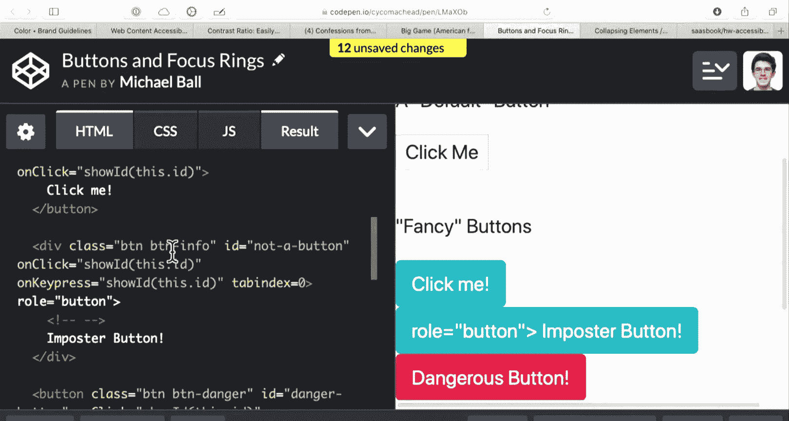

Elements on this web page might be missing things like keyboard handlers。

 They might be elements that are clickable， but not accessible to the keyboard。

 You'll also see things like color contrast here， images that are missing alternative text。

 So if you have an image and someone's using a screen reader the alta attribute on an image is the proper way of giving descriptive text to that screen reader。

 and so。The homework kind of guides you through using， in this case， very loosely guides you through。

 but。It， it kind of gives you the， the basic steps of using accessibility insights。 You run a test。

 And if you run this on your own applications。You'll hopefully get some feedback。

 you can click on them， it will list the places， the actual HTML code on that page that。

We're not passing that test。And there's links to information about how you。How you can fix this test。

 some techniques for passing it， why it matters。And so on。

 And so the idea here is that aside from just wanting to write clean code。

 the markup that we have matters in terms of how users interact with our Web pages。 And so with that。

 I'll see you Tuesday。 microcro quiz tonight。 or we'll be out tonight。

 but you'll have until next Tuesday to do it。And then fill out the project form if you haven't had a chance yet as well。

 so that is on piazza。

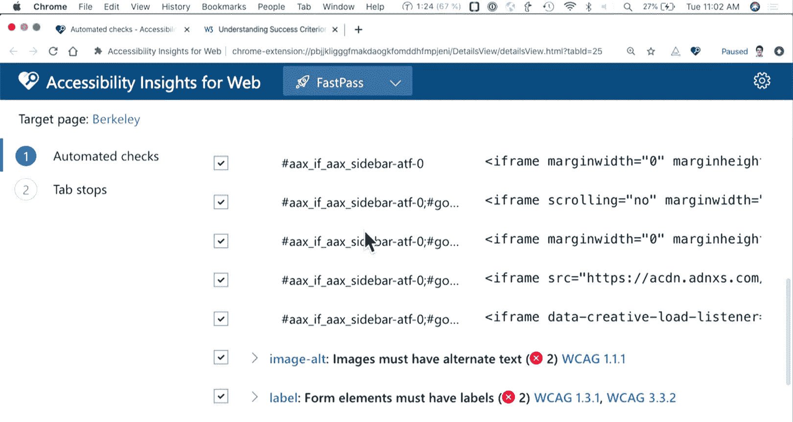