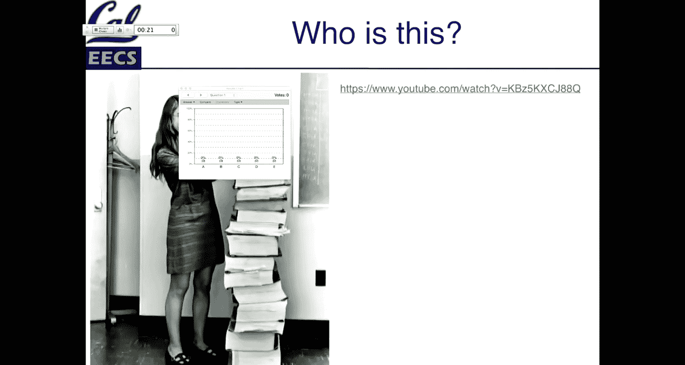
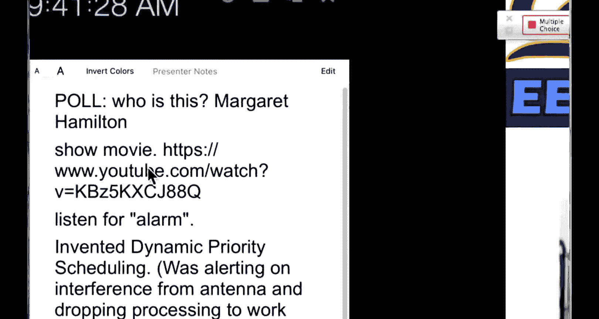
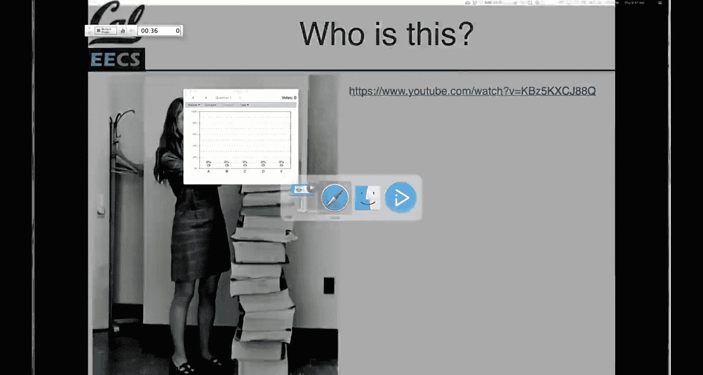
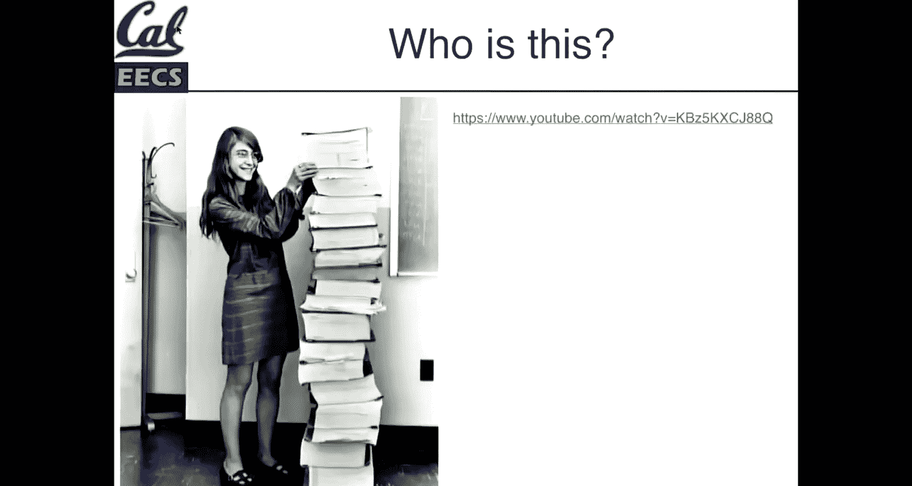
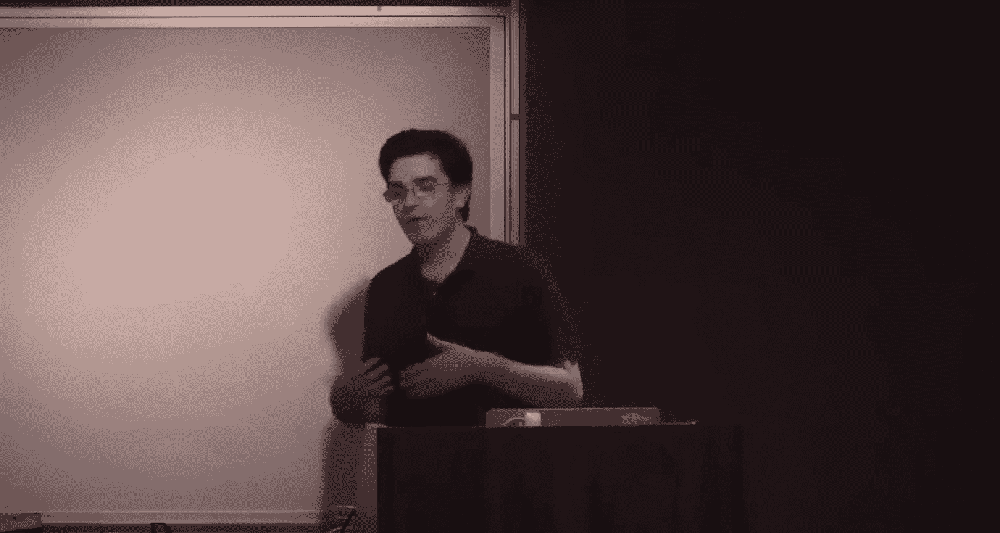

# 软件工程导论：001：课程介绍与软件工程概述

在本节课中，我们将学习软件工程的基本概念，了解它与普通编程的区别，并初步认识CS169课程的结构、目标以及你将使用的工具和流程。

## 概述

软件工程不仅仅是编写代码，它更关注如何系统化地构建、维护和演化软件，以满足用户需求，并确保在团队协作中的高效与质量。本节课将为你勾勒出这门学科的轮廓。

## 课程与讲师介绍

大家好，欢迎回到秋季学期，欢迎来到CS169课程。我是Michael，计算机科学系的新讲师。我三年前从伯克利毕业，研究方向是计算机科学教育，过去几年在Gradescope工作。我相信你们都使用过这个工具，它与你们的成绩息息相关。

CS169是一门关于软件工程的课程。我们将深入探讨如何构建软件及其背后的流程。课程中包含大量编码实践，但代码本身并非本课程的唯一重点，我们今天就会讨论这一点。

## 软件工程的历史一瞥：玛格丽特·汉密尔顿

在课程中，我们会不时穿插一些计算机历史，这既能阐明软件工程作为一门学科和实践的历史，也包含了许多普遍有趣的知识。

这是一张玛格丽特·汉密尔顿的照片。她是原始阿波罗软件工程团队的成员之一。我们来看一个简短的视频片段（假设设备正常播放）。

（视频片段描述了阿波罗任务中的场景，可以听到“警报”一词。）

在这个片段中，可以听到“警报”一词。这涉及到计算和计算历史中一个有趣的点。当时的情况是：在阿波罗任务中，飞船的天线正在处理各种着陆信号。所使用的计算机是1969年的处理器，受限于当时无数的计算资源，它无法同时处理所有需要处理的数据。

玛格丽特·汉密尔顿的贡献之一是提出了动态资源调度的概念。当时发生的情况是，一名宇航员让一个天线信号保持开启状态，计算机需要处理它。但计算机选择放弃该任务，转而专注于处理着陆机动数据，以确保能够成功在月球着陆。计算机发出的“警报”正是在提示它正在丢弃某些任务。

这个小故事说明，当我们审视软件工程这门学科时，涉及的不仅仅是我们编写的代码，还包括我们必须用来处理这些代码的工具和思想。

此外，阿波罗任务使用的所有代码都有一个GitHub仓库，属于公共领域，因为它是一个由纳税人资助的项目。如果你有兴趣查看一些旧代码，这会非常有趣。

这张照片是玛格丽特·汉密尔顿与麻省理工学院软件工程团队的合影，充满了1960年代风格。他们编写了在阿波罗任务中运行的大部分软件。

## 软件工程 vs. 编程

那么，当谈到软件工程与一般编程的区别时，大家有什么想法？软件工程可能关心哪些方面？

*   **需求**：没错。我们构建软件不仅仅是为了自己，可能还有客户，可能需要遵循规格说明。这肯定是其中的一部分。
*   **编程**：当然。这肯定涉及编程，如果没有大量的编程实践，就不能称之为计算机科学课程。
*   **可扩展性**：我们可以讨论它需要多大规模，以及是否总是需要那么大规模。
*   **团队合作**：是的，绝对正确。作为团队的一部分工作是这里最大的区别之一。团队合作包含多个层面：这可能是你和本课程中的其他五位队友；可能是你毕业后实习或工作中的直接团队、整个组织；甚至可能是你在GitHub上参与开源项目，与世界各地、可能说不同语言的人们协作。多人协作是一个关键部分。

## 软件工程的核心

这是一张大卫·帕纳斯（David Parnas）的照片，他对软件工程领域有重要影响。课程中会出现一些人物和照片，用以说明某些思想的来源。本课程的重点不是记忆这些人名，而是将其作为背景，指出我们并非凭空发明所有这些材料。

这是图灵奖得主弗雷德·布鲁克斯（Fred Brooks）的一句名言，它指出了一个非常有趣的部分：“将分别编写的程序组合起来，并使它们适合未曾编写它们的人使用。”

我认为其中有趣的观点是：在生产中使用的软件不仅仅是CS61A中那样独立的代码片段。虽然在本课程后期你们会接触到更复杂的项目，但通常来说，它都是某种封装好的模块。软件会随着时间的推移而演化。“为未曾编写它们的人所用”也是一个关键组成部分，这将是我们关注的重点之一。

围绕代码的所有部分都是为了帮助实现这一方面。值得注意的是，“未曾编写它们的人”会一次又一次地出现，包括三个月后的你自己。在课程项目和实习中，你通常没有机会在数月甚至数年后回头查看自己的代码。但当这种情况发生时，你并不总是拥有相同的上下文。因此，拥有围绕代码的工具、流程和基础设施，将有助于你在需要修改、维护和调整时更加轻松。

## 优秀软件工程师的特质

大约六七年前，当这门课程开发时，David Patterson和Armando Fox教授调查了许多与EECS部门合作的行业伙伴，询问他们需要什么。同时，大约三年前，微软和华盛顿大学进行了另一项调查，旨在了解对个体软件工程师有哪些方面的要求。

以下是调查中强调的一些方面：

**个人层面**
*   **自我驱动**：不断提升自我，是什么让你在团队中表现出色。

**团队层面**
*   **给予反馈**：如何在团队中有效运作。
*   **创造安全空间**：这在教育中也很重要。当有人对某个过程不确定时，你如何回应问题？确保这是一个可以安全提问的空间。在本课程的项目中，任何时候你都可能遇到完全不知道如何做的事情。你向助教或我提出的问题，我们可能也没有现成的解决方案。提出各种想法是完全没问题的。在软件工程团队中，这是一个重要的方面。希望你们在小组项目合作乃至整个课程中都能培养这种氛围。

**技术层面**
*   **技术背景**：当然，如果你在编写代码，拥有适当的技术背景很重要。在伯克利学习到这个阶段，你们已经经历了两年密集的低年级课程，可能还有一两门高年级课程，你们已经在技术能力上打下了良好基础。但这仍然是另一个重要部分。

**决策与流程**
*   **决策制定**：你经历了哪些步骤？你是否在批判性思考？你是否帮助记录和定义这些流程？

这里还有很多内容，但这些是流程每个环节的要点。这是一项关于什么造就了优秀软件工程师的调查的亮点。

## 本课程的精髓

可以将本课程的精髓提炼为一句话：**纪律严明、以客户为中心、敏捷的软件即服务工程**。

*   **纪律**：指软件工程这门学科。
*   **软件即服务**：指我们将要构建的内容。

你们将要从事的项目是**基于数据库的Web应用程序**，旨在解决某些客户需求，并**部署到云端**。如果你有过实习经历，可能接触过类似的东西。这可以说是现代科技初创公司（甚至已非初创公司）的支柱，也是你们日常生活中使用的大多数项目或程序的核心组成部分，它们现在都是软件即服务或具有其组件。

## 课程预期与前提

我们对本课程的预期设定如下：

1.  **假设你具备良好的编码能力**：你们已经在伯克利的学业中取得了进展，这应该不是大问题。
2.  **假设你拥有GitHub或GitHub学生账户**：你不需要GitHub的学生专属功能，但如果你注册了，会有很多很棒的免费福利。如果你还没有GitHub账户，可以创建一个，你们将在那里进行项目工作。GitHub将是本课程的重要组成部分，既用于项目管理，也是你们未来很可能使用的工具。即使不是GitHub，在你未来的工作中，也很可能会使用类似的软件。

本课程的目标是为你们未来在行业环境（以及许多研究环境）中构建超越周末黑客项目的软件做好准备。

## 本课程会教特定框架吗？

有人想猜猜这个问题的答案吗？本课程会教我JavaScript、React、Ruby on Rails、Django或任何当下流行的框架吗？

答案是：**不会**。

原因是框架来来去去，变化迅速。当然，我们将要使用的Rails本身已有超过十年的历史（现在大约15年了），它们并非完全转瞬即逝。但本课程的目标不是教你们Rails的机制。你们绝对有机会学习它们，如果你们深入项目，这将是真正动手实践框架的最广泛方式。本课程将侧重于服务器端组件。

当我修读CS169时，Angular是当时热门的JavaScript框架。一些项目小组深入其中，用Angular构建了非常棒的体验，因为他们想学习它，并且这符合他们项目的功能需求。虽然我们将使用Rails作为本课程的载体，但目的未必是帮助你们成为Rails专家。

## 课程必要组成部分

就本课程的必要组成部分而言，你们确实需要两者：

*   **讲座是必要但不充分的**。
*   **阅读教科书也是必要但不充分的**。

教科书旨在比讲座更深入地探讨特定主题。我们也会有一些新的草稿章节提供给你们。请务必阅读教科书。它并不厚重，旨在简洁扼要，但包含许多很好的例子。可以说，当我还是学生时，这是我真正阅读过的少数教科书之一。我确实喜欢阅读这本教科书，而且它后来有所改进。

## 学生通常缺乏的技术技能

这是一张我本想早些展示的幻灯片：学生通常缺乏哪些技术技能？当与雇主交谈，询问学生实习或毕业时缺乏哪些经验时，会得到以下反馈：

1.  **遗留代码**：在你们目前的学业生涯中，基本上处理的是要么有脚手架的家庭作业（填充部分代码），要么是从头开始的新项目。CS61B中，你们几乎是从白板开始编写所有内容。这是一种可行的学习方式，每个项目都以某种形式从空白开始。但你们真正需要的一项技能是处理遗留代码。本课程的许多项目将从其他169学生接手、正在被客户使用的项目开始。你们将延续该应用程序的生命，处理可能由过去几年里6、18甚至30名其他学生编写的代码。你们基本上需要假设这些编写者不存在（尽管他们确实存在，已经毕业工作），但你们不能直接去问“这段代码是如何工作的？”项目仓库中的内容就是你们需要处理的。遗留代码是一个方面。你们中的一些人将从事新项目，但大多数人将处理遗留项目。我们设计的家庭作业旨在让你们获得这种经验。

2.  **与非技术客户合作**：这也是一个巨大的组成部分。CS169项目部分的一个优点是，你们合作的团队是非营利组织、校园组织、非政府组织等，他们需要构建一些软件，但并不总是具备描述需求的技术经验。他们不会告诉你们“这是我想要的用户模型模式”。他们会告诉你们一系列需求，然后由你们去实现。你们中的少数人将为技术客户做项目，我可能会是一两个项目的客户，你们的助教也可能是一两个项目的客户。当然，你们肯定会有技术客户的项目，但那里的目标是我们仍然不会告诉你们如何规划用户模型。与技术客户合作有其自身不同的挑战，但我们会尽可能以非技术的方式行事。Fox教授也会是几个项目的客户，当他作为客户时，他也以同样的方式工作。

3.  **测试**：这绝对是每个人都说初级软件工程师缺乏经验的事情。本课程将涵盖测试的各个方面、不同类型的测试，以及如何使测试我们的应用程序更容易。我们将通过家庭作业贯穿始终，在你们的项目中，当开始调整他人的遗留代码时，你们将亲密接触他人的测试，并可以判断这些测试用例是否有帮助。总的来说，我们希望它们会非常有帮助。

## 课程项目主题

本课程的项目主题，我认为是作为一所公立大学使命的延伸：**行善致远**。

你们将在本课程中学到很多，而你们承担的项目将有助于外部世界。这些团队、这些其他团体通常需要自动化流程、跟踪数据等软件特别擅长的事情。通过构建这些应用程序，你们可以真正帮助一个团体以他们肯定没有数百万美元去雇佣咨询公司来构建应用程序的方式，完成他们的使命。

## 项目流程概述

以下是你们项目概况的两张幻灯片概览。

**技术流程**
*   有存储在服务器上的仓库代码，通常也存放在GitHub上，并最常部署到Heroku。如果你们没用过Heroku，它是一个非常易于使用的软件部署平台。
*   在这个版本中，这是应用程序的典型运行实例，其中许多至今仍在使用。你们将接手其中一些项目，该应用程序将在学期中投入使用。
*   你们拥有自己团队的副本（在GitHub上称为Fork，但术语不重要）。本学期，你们的团队将有一个规范的代码仓库。你们每个人将在自己的本地副本上工作，并使用一种称为“基于分支的功能开发”模型。
*   在一个六人团队中，任何给定时间可能有两三个不同的功能在同时进行。你们将学习如何使用Git。你们不需要成为Git专家，甚至不需要太多高级知识，但如果还没有经验，将会获得相关经验。
*   这样做的理念是，你们将有机会观察代码库如何演化，以及多人如何同时在其上工作，可能朝着相似但也可能不同的方向调整各个部分。你们将与多个队友一起完成这项工作。
*   随着学期进展，你们将进行“拉取请求”。在项目的每个迭代完成后，你们可以说“我完成了”。你们将有机会与助教团队讨论，然后将其合并回主仓库。
*   在此过程中，我们将使用一些行业标准工具：
    *   **Travis CI**：一个允许你们使用持续集成框架的工具，帮助你们尽可能多地测试代码。每次推送到GitHub时，你们都可以运行一系列测试并获得结果。
    *   **Code Climate**：一个包含Linter和静态分析器等功能的工具。它给出一个分数，这个分数将松散地成为你们项目成绩的一部分。重点不是必须达到某个分数（我记得是4.0，因为它过去实际上是字母等级），而是你们是否采取措施提高代码库的质量。好处在于，这是机器人执行适合机器人的任务：你们是否遵循现有代码库的约定？这不是严格关于项目分数，我们不是说你们必须始终保持100%的分数，而是关于维护健康的代码库。
    *   **Coveralls**：一个类似的应用程序，试图测量测试覆盖率。所有这些工具都旨在作为工具使用，它们都有各自的怪癖和有时毫无意义的指标。但确保编写代码时具有对等性、并且有测试覆盖的总体理念将是重要的一部分，这些工具将帮助你们反映这一点。
*   你们会在许多开源项目上看到这样的徽章，你们将有机会在自己项目的README中看到它们。
*   然后，假设一切顺利，你们将在整个学期中将应用程序的第二个副本部署到Heroku。这将是一个实际体验软件开发完整生命周期的机会。
*   一旦代码部署，你们的客户将就进展情况提供反馈。他们将与他们的应用程序版本进行交互。希望这些回头客中的大多数也能体验上学期版本的应用，尽管并非全部如此，有时会是该团体的新联系人。他们将能够告诉你们发生了什么变化、感觉如何。有时他们会为你们发现错误。但他们是客户，你们为他们构建东西，但他们也不一定是你们的QA团队。
*   在学期末（如果一切顺利可能更早），你们的工作将被合并回那个实时应用程序中。这样做的目的是让每个团队都有实际投入现实世界、正在使用的软件。本课程的许多项目已经持续了数年，有些可能只持续一个学期，但目标是拥有持久的东西。

**协作流程**
*   这是这个过程在人际方面的样子。你们将开始与客户交谈。
*   然后你们可能会进行某种形式的原型设计。这可能是一个草图，也可能是一个PowerPoint幻灯片。我们将讨论用于此的工具。
*   接下来，你们将把那个原型转化为用户故事。例如：“当用户登录时，应该发生X”；“当用户创建新条目时，应该发生Y”。可能是跟踪某种客户互动的功能。
*   你们将与客户一起制定这些用户故事。
*   然后我们将使用一个名为Cucumber的工具，帮助你们以非常类似英语的方式将这些用户故事编写成有用的软件测试。这样，当查看测试文件时，你们将对软件预期行为有清晰的描述。你们将能够把这些用户故事转化为测试。
*   接下来，我们将尝试让你们进入“测试优先”的思维模式。先写测试并不总是自然的，如果你们在实习中做过，那很好，但我预计大多数人没有将测试优先的软件开发作为一项纪律。给它一些时间。你们将编写测试，它们会失败，你们会看到一堆红点，这感觉从来都不好。但随着构建功能，这些东西将通过，看到东西从红变绿也是一种很棒的感觉。
*   在此过程中，你们和你们的客户将使用Pivotal Tracker来跟踪正在构建的这些故事。
*   最后，你们将部署。部署将在整个项目中多次进行，只要你们准备好了某些东西。我们将以迭代方式工作，但你们可以随时将代码发布出去。我们鼓励你们只要完成这个过程就持续测试和部署代码。团队工作越快，就有更多机会将代码推送到实时服务器上并看到它运行。
*   在每个迭代结束时，我们基本上重新开始。希望你们在本课程中完成四次这样的迭代，也就是四个为期两周的迭代。但这实际上取决于课程的实际流程和速度。

在此过程中，你们将获得一些经验：处理遗留代码（构建一个功能后，可能等一个月再去调整它；调整过去学期他人的代码），学习一些设计模式。我们将更具体地讨论这些，但理念是帮助你们以结构化的方式编写代码。

这就是用两张幻灯片概括的软件工程。内容很多，但不必过于担心细节，我们的目标是随着课程深入，让你们自然融入这个过程。

## 课程期望与建议

关于本课程，有几张幻灯片是关于“如何在CS169度过糟糕时光”和“如何做错所有事”的：

*   跳过讲座（反正有网络直播，在线看就行）。
*   不做作业（因为只是作业，都是虚构的、小型的，没什么可学的）。
*   独自工作（你们将与同学竞争，因为一切都是按曲线评分的，所以不要帮助同学）。
*   不需要学习新东西（反正你们已经实习过了）。
*   忽略流程（步骤不重要）。
*   只关注分数（学习不重要，一切都会评分，只尝试考试，别担心其他）。
*   作弊（如果作弊，我们可能抓不到）。

我特别要强调关于分数的一点。在本课程中，你们的项目成绩不仅基于测试是否通过、Code Climate是否健康，还基于所有投入该工作的点点滴滴：你们是否与团队合作？是否努力跟进GitHub？是否用用户故事记录事物？是否编写测试？这门课程的评分有时会有点麻烦和混乱，但核心理念是：在整个课程中，对你们成绩影响最大的是参与所有可能的不同领域。

我今天没有带答题器基站，所以今天不会有任何答题器问题，但我们以后会做，并讨论一下。在项目评分中，它是非常全面的，会有关于团队成员工作情况的调查，这会影响他们的成绩。你们不能仅仅因为在学期最后一周发生争执就说“嘿，我的队友很糟糕，我们不想让他们通过”。我们会考虑所有因素，包括你们编写的代码、队友的调查、家庭作业的练习。当然，考试也是本课程的一个组成部分，但这里的目的是确保你们真正拥有全面的经验，因为当你们在实习或专业构建软件时，每一部分都很重要，任何一个环节出错都可能导致项目脱轨。

请记住，这里的目的是平衡讲座、编码、项目工作等各个方面。对于使用网络直播的同学，有一些幻灯片标有“结束”，如果你们复习网络直播，这些是暂停和反思的地方，它们也将讲座按主题分块。

## 总结

本节课我们一起探讨了软件工程的基本定义，了解了CS169课程的目标、结构以及它将如何通过实际项目帮助你们掌握构建高质量、可维护软件所需的技能、工具和协作流程。记住，软件工程的核心在于系统化的方法、团队协作以及对不断变化的需求的适应能力。

下节课我们将开始深入探讨具体的软件开发方法论。