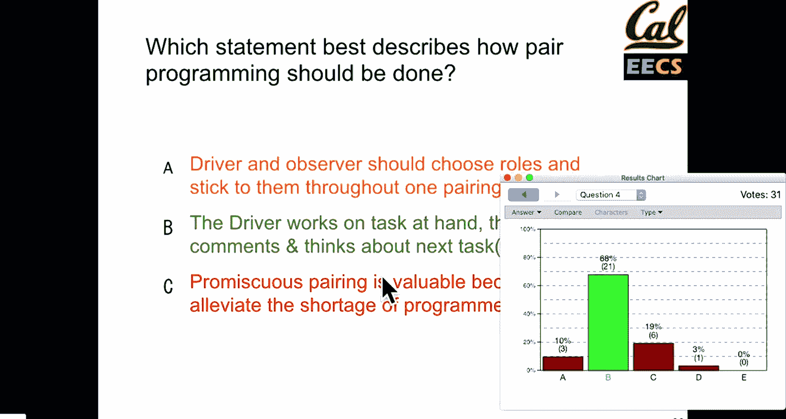
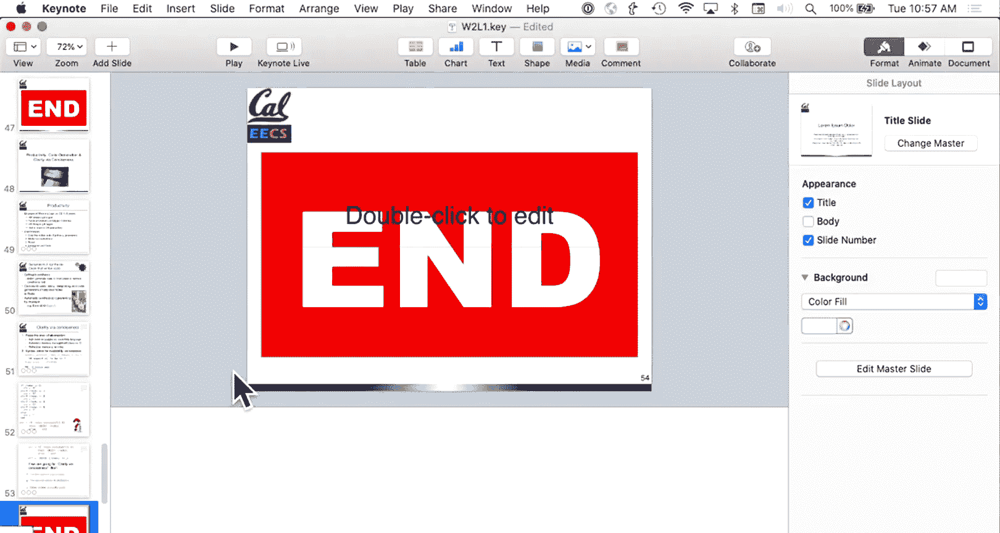

# 002：UCB《软件工程｜UCB CS169 software engineering 2019》中英字幕deepseek p02 2 CS169 2.zh_en -BV1UsB7YPEMj_p2-

Allright， so it's 940 so let's go ahead and get started for today so just a few admin announcements please keep an eye on piazza we'll be sending out the team matching surveys later this week if we're gonna to do it later in the week so if you're still trying to find a group of your own you know we will make every effort to keep groups that submit as a team together just remember that you do have to attend section as a project team so today and depending on when we finish things next week you can attend any section if you are deciding randomly you have all of them available just flip a couple of coins to decide。

If you know which section you can only go to just try and go to that one。

 and we will do our best to fit everyone's schedule。 We will be doing eye clickers today in class。

 If you don't have one yet， please don't worry too much， will， you know， they are for participation。

 they can only help your grade， But if you miss a couple， you know， that's quite al right。

Things happen。 Homework one is up on the website。 We're going to be submitting homework assignments through gradecope。

 The auto grader is not up and running yet。 that will hopefully happen in the next few days。

 maybe on the weekend。 but the directions are there， there's plenty to get started。

 as we talk about pair programming today， you are able to work in pairs on the homework assignment。

 but you each need to submit your own version of the assignment。

 So everyone should be submitting their own work。 if you do work with someone else。

 please put you know your collaborator info at the top of your files that you write just that if we do go through checking anything。

 know there's a reason。 but we're gonna talk about pair programming today。

 you are more than welcome to use it for your homework assignments。

 we encourage you you know to learn anti teach from your peers， you learn best by teaching others。

 and so。Thatll be there。 and then you know， if as far as enrollment stuff。

 this isn' an early drop deadline course again。 So if you are unsure。

 please make your decision by Friday， we may be able to expand the wait list a bit。

 It is dependent on projects and availability。But if you're thinking about dropping。

 please do so so that your peers in the wait list will be able to enroll。

 I know it's an annoying piece， but。It such as that and then hopefully we'll have kind of the basics sorted out soon。

 So also a few people have been using the B courses link to Grcope。

 it should be working for everyone if you get an error that says please email help atgradescope co please email them and CC me or post a note on piazza it is randomly failing for like one in100 and some tries which makes no sense I worked on this at gradescope so I'm hoping trying and debug it and yeah。

 we don't know what's going on。 if you need to get into Grscope and the link doesn't work。

 you can just go to gradescope co you can click school credentials and sign in with Calmat。

 you'll get into Grscope just fine。 everyone should be enrolled in the course but if you run into an issue please send the gradescope folks a know and then also let me know because we're trying to debug it I have no idea why it's randomly failing。

 This is the life of developing software。And so maybe late in the semester。

 this will make an interesting lesson or two。 So with that， let's get started for today。 Oh， no。

 that's interesting。 I clicker。 That's not what I wanted。 cool。 So a theme for today。

 and generally for， I think， software engineering in this class is to keep trying。

 So Martin Fowler is a prolific software engineering author， consultant。😊，Has a wonderful blog。

 but there's a saying which he's one of the first people it's written about a lot。

 Its I don't know what the original author is。 but if something hurts， do it more often。

 and it's a little bit counterintuitive because you know if something hurts。

 it doesn't sound enjoyable。 But the more you keep trying， the easier it gets。

 but also if something hurts do it more often， the idea is it will encourage you to make that process easier。

 So as we talk about getting customer feedback， if it sucks to do customer feedback。

 get customer feedback more often， if it sucks to write tests， write tests more often。

 because each iteration of working on that will become easier。

 So this will be a metatheme throughout the course。 But。😊，You know， just kind of highlighting that。

 So on Thursday， we finished up。 we， we're talking a little bit about plan and document。

 We talked a little bit about this sort of weird little piece in between the spiral life cycle。

 So what， you know， what are the alternative yeah， what are the alternatives to。😊。

Plan and document to spiral development。 So， you know。As is in the name。

 planning and document requires documentation and planning， it's nicely circular。

 but you know being successful you know with this requires an experienced manager。

 which is something that is hard and find and can be rare。

Can we build software effectively using other ways？ And， of course。

 how can we do this in a methodical manner， How can we do this in a way that is more than just hacking on something if we want to build software that last。

 And so， of course， as you know， is the point of this class， The answer is yes。

 we can do all these things。 But it requires some， you know， some thought and some discipline。 So。

The agile manifesto is a piece that was written in 2001。 And， you know。

 it's basically trying to take the ideas of getting iteration。Customer feedback。

 developing software and doing it in a more incremental way。And you know， it's favoring。

The idea is then to favor the team， the individuals， the customers。

 over just the strict processes and tools， you will find that agile often you know in industry gets conflated with strict process but the manifesto is meant to be broad。

 you know not necessarily super prescriptive。 you know write your software you know。

 not just write comprehensive documentation。 So don't try and figure out exactly every scenario that could possibly go wrong and put in a Google Doc。

 write the code， see what can go wrong and then iterate from there。You know。

 customer collaboration of a contract negotiation， if you go ahead and do an internship。

 do a startup， this is something that you will hopefully get to do is to work with a customer to hear their needs to develop software for them and throughout this course。

 you know the customer will be the central piece of your project。And then responding to change。

 So again， as we're building software， we can't know everything that happens。 So change will be。

You know， a big piece and， you know， all the things that are on the right side， plans， documentation。

 you know， contracts， you're definitely not gonna get away from contracts if you are doing a company that is the life。

 you know， there are always processes and tools and they can be a valuable component。

 but just remember that the the idea is to prefer some of the intangible bits over just having Google Docs。

 and you know。Strict plans that， you know， if you fall behind schedule， you have to revise。

 So that is the point of the manifesto。 And so， you know。

 keep in mind that it's not meant to be super prescriptive。

 We'll talk about some of the other types of agile。Today， but it's， you know。

It's it's a philosophy more than it is a strict set of rules。 So again， embracing change。

Continually developing so this is the first point we're talking about the idea of iteration。

 so in a software engineering world you will generally have a plan of work and with with a plan and document approach。

 this plan of work might exist from the beginning of time until until the end of the project with agile the goal to get that down to one to two weeks。

 there are a few companies that do weeks six week iterations。You know， in this course。

 we'll be doing about two week iterations， which would be， you know， because you have you know。

 three other courses at the same time will be about you know， a week's worth of work， but you know。

 they'll be。They'll be short iterations， you don't have time to develop as much as you would want in these iterations。

 but you do have time to develop something usable， something functional， and to get feedback on that。

 and that is really the goal of an iteration。And at each of these steps。

 you're going to be interacting with the customer， writing software， testing your software。

 deploying it in this case to Heroku， and you'll have the opportunities to go through all of those。

And so throughout this process we're gonna to learn about the specifics。 So TDD。

 if you've never tried it is test driven development。

 and this is the idea that you write tests before you write your code。

 So one of the tools that we'll using is cucumber you literally write in an Englishlike syntax that says when I log in I will see this and then this will happen and you get to specify whatever those actions events are。

User stories are work items that describe from a user perspective。

 not from an implementation perspective what should happen within your project。

 so your customer will help you specify what those are and what things should happen and then your job as a team will be to write user stories to track that work。

😡，And then velocity is a measure， which。Can be defined in a whole bunch of different ways。

 But is essentially， you know， how much work are we delivering in this period。

 And over time are we delivering more or less work than we expected to。 And if so。

 how do we account for that？ And so within this course， you know， we're not going。

We're not going to have a whole bunch of time to generate， you know。

A perfect trend of exactly how things will work。 But in， you know， in a professional environment。

 you would use your team's performance over months， maybe a year to understand， you know。

 help you plan better going forward。 And again， the idea is not that you should have no planning。

 but that we'll use some data to generate minimal plans as we need them。

 So the version of agile that we loosely followed this course is extreme programming。

 this was originally attributed to Ken Beck not too long after the agile manifesto came out。

 he was a software engineer early on at Facebook。 he is now somewhere else in the Bay Area。

 But this is， again， following the idea If something hurts， do it more often。

 So short iterations are good。 make them as short as possible。 So weeks and not years。😊。

Extreme program typically specifies a week。 But again， there's variations on these。

 If simplicity is good， do the simplest possible thing。

 So if you've heard the phrase minimum viable product at every iteration。

 you're building the next minimum viable product for that future for that feature。

 and then over time， your minimum starts to， you know expand and be the actual product that you want。

 And if testing is good， test all the time。 So this is definitely something that you will get practice in this course。

😊，Test driven development is a huge component of this。

 but also having the tools at your disposal to make testing easy so that when testing is easy。

 you can test all the time without without the pain。 And if code reviews are good。

 do code review continuously。 So pair programming， which we'll talk about in a bit is one way of code reviewing literally as you write the code is one way of looking at pair programming but also again。

 making the tools available so that you can do continuous feedback on your code。

 whether that's from a professional environment， your managers， colleagues in this case。

 your teammates and your Gsis will be the ones doing that and Github has a great set of tools that aid in this。

 if you have not used them yet。 So agile then and now， So in 2001。

 the manifesto was pretty controversial you know it still is in some circles。

 especially when it gets a little bit dogmatic。But， you know， for the past several years。

 it's been pretty mainstream。 All the big companies that you know of do some form of agile somewhere。

 They all vary， you know， in their details。 But again， following the idea of a philosophy。

They have the big picture elements there。You know in 20 the study is now seven years old。

 so majority of 66 projects， I think almost every tech company in the Bay Area has some part of their process that is pretty close to agile。

 especially if they're a SaS business so。Again， don't know these names， but all these processes。

 extreme programming， scrum， canban， lean development are all variations on agile programming。

 If you've done an internship， Scrum is probably one of the more popular ones right now。

 but they all follow a similar idea of having iterations， delivering on a backlog。

 any of that kind of stuff。 So good test of your clicker question。So option E is always the option。

 I have no idea what's going on。 I'm not sure。 always feel free to click that。 There is no judgment。

 And so let me enable the question。 let's see cool so you can click in now we'll see how many we have for today。

 And if you are trying to use the I clicker reef mobile app。 It should work。 It's enabled。

 it can sometimes be tricky。 but。I'm not exactly sure。You know， how well that will work。

 but it does have a two week free trial so you can try it if it doesn't work， you can get。

A clicker from the student store or rent one on Facebook。 And then also。

 if you have friends that you're willing to share with， I've been told that， you know。

 sharing remotes again as long as they're not in this class or taking another class at the same time is perfectly acceptable。

 So we have 29 for today。Not too bad， and it doesn't look like anyone， oh， 30，31。Cool。

 so we'll give it。A couple more seconds。嗯。So。Let's see how people did。Very nice。 Yeah， So D， you can。

Agile visits things all the time。Again， so if you don't have a clicker。

30 people is not so bad so far， but agile visitss agile visits every stage of the life cycle during every iteration。

 And， of course， you can build Saas apps with plan document， but。You know。

 it is not necessarily meant to be。As effective or， you know。

 you have the advantages of Saas where you can deliver things all the time。 No。

 why are you doing that eye clicker。 Now， And if you haven't seen the W meme。

 here's some great photos， we'll have a fun， five minute talk later this week or early next week。

 which goes to this， so。That is a brief introduction to Agile， Any questions so far。

And if you' are in the back， just wave your hand or shout out since it can sometimes be hard to see with the lights in my eyes。

Cool。So the next topic of the course is a distinction between legacy software and beautiful software。

 which。Its not necessarily meant to be two things that are at odds， so。Again。

 this is something that you can just guess on。What portion of the time of a budget or budget is spent of enhancing versus fix bug fixing。

 So you know， how much of your software is spent。Fixing bugs versus developing new features。

And I'll try and get this up to about 30 each time。I we at 32， but。Nice， so， yeah。

 most people select bug fixing as the first option。 And so what we hear about legacy software。

 when we talk about costs， this is what I would expect most people to select。

 The answer is that more time is spent enhancing software than fixing bugs。

 And let's see if we can hide that。 And so the reason is that。😊。

When we're talking about enhancing software or when software is in a maintenance mode。

About 60% of the maintenance costs end up being enhancements to that software。

 So there are things that， you know， as someone writes in to ask about something ends up being a new feature。

It ends up being， know some challenge that wasn't originally expected。

 but it's not strictly bugs or deficiencies in the software。

 Another great way to think about this is over time， the requirements change。

 those are not bugs in your software， but there are things that end up needing to be addressed。

 So 60% of the software costs maintenance，60% of maintenance is enhancements。 which。

 is just the point that as software lives on， it evolves it adapts and that is a a big distinction。

 So because this legacy code matters。 if 60% of software is maintenance that means we are adapting new code to provide new functionality to it。

 that means that most of the time we're working on code。

 well be working on code that has been around for a while that someone else has written。

 maybe it has been around for 5 or 10 or 20 years， but。

It is something that you know well have to you'll have to deal with and you'll have to become proficient with。

 So many of your projects for this course will be taking projects that past CS169 students have written and you' will get to adapt and enhance them without breaking them of course。

 So you know this is another saying which I wish I had an attribution for。

 which is old hard becomes obsolete old software goes into production every night。

 you could also say many times during the day。You know。Every app， all the Web apps that you use。

 oh there it is， Robert Glas。You know， every every application that you use has bits of it that have been written since the beginning and haven't necessarily been rewritten。

 You know， the core of your iPhone has software that dates back to the 1990s written at Berkeley。

 you know their software lives on and has you know， a long history so。

How we deal with legacy code matters。 And the idea is to do it safely， so。嗯。Legacy code。

You know what we've sort of said it meets the needs， but it needs to be evolved and adapted。

Beautiful code is the idea that it solves a problem。

 but it's easy to evolve and so the idea is that we can write beautiful code that becomes a beautiful legacy code。

 and so the goal of this course will be to practice writing software in a way that is easy to adapt。

 easy to evolve and will be able to live on。😊，So what you'll get to say too is with those of you who are working on legacy projects。

 you know， the beautiful code is not just everything that is in you know。

 the ruby files that you'll be working with， but it is the project as a whole， the test cases。

 the views， you， the documentation， all that is a factor in that so。Check for questions so far。

Anying。No， cool。Something that you'll get practice with in this course。

 here's some quick advice for learning new languages and stacks。

 so the history is along with frameworks that come and go。

 incidentally all of these are still in use in plenty of places today。

You may have heard of them if you ever look at a URL and see CGI bin。

 it is an early web framework for developing dynamic apps。

 there are plenty of department tools that rely on it Pearl is still in use today in plenty of places PhP of course PhP definitely lives on because of Facebook and a bunch of other things Tumblr was originally written in PhHP and I still believe is largely PhHP。

But， you know， the history is long there。 And the good thing is， as things adapt。

 the languages are more similar than they are different。

 So once you learn a framework like rails that will transfer a lot of the ideas to frameworks that are in Javascript。

 Java， you know， even C+ plus web frameworks。 all of these are object oriented languages。

 they have similar object oriented designs for their philosophy。 So。😊。

Learning new languages quickly is sort of the goal of this course of being a professional software engineer because over your career。

 the stacks and tools that you use will change。 So our goal will be learning a new language understand the application architecture of that framework and then understand the mapping between the framework and a language。

 So if you're new to Ruby you know these bits of what's rails and what's Ruby will be a little bit confusing rails adds a whole bunch of really nice things to Ruby that make it easy to work with。

 but they are not necessarily standard features of Ruby so don't stress too much about you know what is exactly rails and what is exactly Ruby but just recognize that while you're learning you know are there are many layers at play to the tools that you're working with。

 And so the first homeworks will just be Ruby and then we'll add rails on top of that so。Yeah。

That will help you hopefully disentangle things a little bit。 But， you know。

 just be mindful that when you're starting something new， Yeah， there's often a whole。

 a whole stack at play that you're starting with so。

This is our sort of recommendation for learning a language。

 If you haven't seen Rubi before as you're working it with it for the first homework， here's。

 you know， sort of how we would suggest you approach things。 So types and typing。

 what are the types that this language uses， Is it dynamically type， Is it statically type。

 strong typing，typing。 What can you do， Do you have to， you know。

 convert your objects into data types before using them or will， you know， anything goes， know。

 jascript is very famously on the anything goes into the spectrum， And then you have， you know。

Languages like C plus plus and C where in Java where you have to actually convert types。

 so primitives， loops， control flow you know， get， you know， just mostly syntax there。

 but what does it provide， what's the construct for if else， you know， stuff like that， Me。

 functions and procedures， Ruby is pretty， you know， forgiving here as well。

 but understand what you need to write a method。How does。

The framework or language handle abstraction and encapsulation。 So are there classes。

 What can you do with those classes， What are the distinctions between private public methods。

 anything like that。Iioms， so this is the hard one。You know。

 what are the things that are typical of that language。 So Python loves to use a phrase Pythonic。

 which can be sometimes very hard to tie down exactly what that means。 But recognize that， you know。

 there are language idioms that you will see that， you know。

 accomplish the same task in a way that is sort of just preferred by that community。

 And if you're working with。That， you know， language or that project。

 those are the patterns that you'll see over again。 a great way to learn idioms of a language is。

 you know， as you're looking through examples online is， you know。

 what are the patterns that you keep seeing in stack overflow answers。

 What are the patterns that you keep seeing in projects that are in Github， those kinds of things。

 So libraries Inency management。😊，Ruby uses bundler， which is pretty good。

 It makes things pretty easy。 You can get what you need to。 mostly with bundle install。

 There's this thing called a gem file because Ruby gemstones。

 you have a list of gems in your gem file。 And so， you know， those will be the tools there。

 and then debugging。 So what do you need to do to debug。😊，And then how do you test your code。

 So we'll be using a couple different libraries for this。 I've mentioned cucumber。 There's our spec。

 which is another specification library。 but those there。 So general advice。

 which don't need to go through all of it。 But just remember， as you're learning， you。

 the more specific you can Google something， the better， if you have an error message just。

Paste the whole error message into Google and see what happens。When you find an answer online。

 especially for stack overflow， I definitely encourage you to practice sort of the meta reading of stack Overflow answers。

 Does this answer make sense Ha it been uploaded do the comments you know that are uploaded also suggest that it's been helpful。

 remember to check the date and if there is a version there。

 you know review that because software does change over time。

 if you're looking especially for something about rails and it mentions rails2 or three。

 the answer might still work but you know those versions of rails are now more than 10 years old so things have changed and evolved over time。

But， you know， just kind of double check doesn't make sense。 If it doesn't make sense。

 it might still be worth trying， but just， you， be a little bit more skeptical。

Always review the documentation and when you're reviewing documentation again。

 double check the version number because things do sometimes change。Ruby。

 as a standard library and rails in the past few versions have been pretty darn good。

 the changes are much more incremental than they are major， but it never hurts to double check。

And if you don't understand something， try and debug the code first before just pasting it in and expecting it to happen。

 This is true of anything。 But just remember that， like， if you take a script from the Internet。

 you have no idea what it does and you run it on your computer。

You have just given some random person access to do whatever they want to on your computer。 You know。

 I think if we're building rails apps， the chances of things being malicious are probably pretty low。

 But there is a long history of people pasting code into their terminals and having terrible things happen。

 So always read what you are about to paste in before pasting it in。So questions so far。

So pair programming。You know， as repair programming。

 are two people programming at the same time better than one， and the general answer is， of course。

 yes， they are so。There is this stereotype that， you know， programmers primarily do individual work。

 And if there's anything that we can do to bust that notion in this course， we're going to do that。

 You're working with a team of your peers。 Youre working with a customer。

 but specific on the programming piece， plenty of companies。

Go through and practice pair programming as their daily discipline。

 And so it's not just this idea of having two people sit there together。

 But as you're doing pair programming， you will have yourself as someone who is primarily writing code and a peer who is working with you to help you。

Drive the decisions， ask you questions about what you're writing。 And the idea is that。

 you know both people are highly engaged in this process。 Of course。

 your peers should not be on social media while you're doing that。 And as we go through these steps。

 this will help you improve quality and reduce bugs at the time of writing code instead of catching them in production so。

So how does this generally work， This is a photo of I believe。

 pivotal labs who does dedicated pair programming stations that are separate from their individual work machines so they don't have email or slacklack setup up。

 it's meant to be a dedicated session of coding。But you have two people。

 so one of them is called the driver and one of them is the observer or the navigator。

And the idea is the driver is the person who is writing the code and the observer navigator is the one who is asking questions about what should be happening。

 Why did you pick that method over another method， you know I don't understand what that variable name means。

 And so both people are highly engaged in the process。 and you know it's pair programming。

 because even though one person is writing code at a time。

 since fourhand on a single keyboard would get a little bit crowded you know both people are actively deciding what code should be ran。

 So do's and don'ts。 So do swap frequently if you are a driver and a navigator you make sure you swap those rules。

 you should have time to be each each role when you're doing it。

 So if you're doing an hour long session which an hour long session of pair programming is pretty intense because you are on for that entire hour。

 you it is tiring， it might be a little bit awkward at first， but。is that is the goal。

 So swap frequently， you exercise different roles。 you exercise different parts of your brain and then you have you know you get to see whoops you get to see more of the codebase that way。

 So do pair with someone different So a lot of companies that do pair programming you start pairing a senior engineer with a junior engineer and that's a really incredibly fast way to learn the codebase to get up to speed。

 It also helps because people who are new to the codebase will ask questions and see things that you know experience programmers might not see。

 you might approach something in a new way。 and so it's always great to get good advice。 of course。

 be mindful when you're practicing do not judge your peers there are no stupid questions when you're working in a project group you know you will have different experiences you know when working with code so just be mindful of that this is true of a class project。

 this is true。😊，of industrydutry， but you want you know paired programming to be a safe environment to ask any questions that come up。

 And of course， while you're driving， remember to stay engaged， you know。

 it is tiring for both payers and or both partners。 and that means that you are doing it right so。

There's a bunch of different studies that have evaluated pair programming， you know。

 and there's a few different results。 But the general idea is that when you're doing something simple。

 pair program can be quicker。 So， you know， both partners understand relatively coherently what needs to be built。

 your partner， the driver is， you know， a check。 they， you know。

 confirm that things are going as expected。And then that leads to higher quality code。 anecdotally。

 people say this is more readable。 And the key insight there is that， you know。

 when you name a variable the name that you give for that variable or method is what is in your head。

 right It's what makes sense to you， but it might not make sense to your colleagues。

 it might not necessarily be consistent with the rest of a code base。

 So having a second set of eyes when you're writing code gives you something that is much more likely to make sense to another person especially if you're comparing you know mixed levels。

 So a junior engineer and a senior engineer， that helps you write code that will be readable to someone at you know sort of all levels of experience with a code base。

Of course， there's two people programming。 So it's hard to always say if it is more efficient than a single person。

 but， you know， it does lead to reducing things like Q A time。

 code review time because you have two people working through code at once。

 So when you sort of consider the whole cycle of， you know， starting or adapting code to releasing。

 you know， pair programminging can sometimes be faster， but that's definitely more mixed。 And then。

 of course， knowledge transfer。 so。2 heads， you know， see the same feature。

 You both understand how it works。 There is a somewhat morbid。You know。

 number that is used on engineering teams， which is called the bus factor。

 which is how many people can be hit by a bus and have the knowledge still survive。

 The idea being that you don't want your startup， you know。

 CEO to be the only person who knows how your company works because unfortunately。

 accidents to do happen。 And so， you know， pair programming is one way to encourage knowledge sharing。

There is also a sort of derivation called promiscuous pairing， which is to swap not just roles。

 but different partners as frequently as possible。 So if you're working on sort of three features at a time。

 you know， you have 6 people in parallel。 every， you know， maybe 15 or 20 minutes。 instead。

 you swap between different partners。 So you go from driving on feature A to navigating on feature B and everyone sort of swaps around。

 And that means that you get more knowledge of the entire code base， not just your specific feature。

 So。Every semester there are surveys of CS169 students。

 these are from one of the more recent semesters last year and on the top 10 list of things that students said they did and they liked or they wish they tried pair programming was number six。

So help avoid slow mistakes definitely。A huge advantage to pair programming。

Because a number of times that we have all been there trying to find a typo that we could not spot because we wrote the code and your eyes kind of just read it correctly。

 paired programming is a great way to avoid those mistakes。 you know it happens to everyone。 So you。

 having a second set of eyes can be great and then changing partners makes the team feel more cohesive。

 So you know， if if you are in a group of six new peers that you haven't met before。

 That is a great way to spend time get to know each other。😊，And then as well， you know。

 make sure that everyone understands what's going on in their project。

That's an interesting building effect so。Question on peer programming。

 Let's see if we're gonna come on eye clicker。There有。

And always remember that E is the I don't know option， and I guess if you want to be funny。

 you can select D for whatever reason。嗯。Allright， yep， so。B， definitely， hey。That's。唔该喂。Okay。

There we go。Yeah， so B is the。Correct option there。 You know。

 just make sure that you're swapping frequently。 Again。

 I would reiterate that paired programming is one of those things that will be awkward at first。

 You know， it's definitely a different environment。

 We're gonna encourage you to try in section this week and next while you're working on getting things set up。

😊，But you know。If it feels awkward the first time， don't just stop right away。

 give it a couple tries。 know it might not be for everyone。

 but it's definitely something that we would hope everyone has a chance to try so。

Software is a service， the big sort of portion of this class， any questions so far on anything today。

酷。So。What do all of these things have in common as is the point of this course。

 They are all backed by software as a service。 So some of these devices only work when connected to the Internet。

 you know， there is no Alexa without， I get nervous just saying that out loud sometimes you know。

 without a cloud service that is able to answer queries and get back results。

 And then there are things like Chrome， your iPhone， iPad。

 smartphones that are enhanced greatly by the idea that they are connected to a large cloud infrastructure。

 So。Software as a service plays a role in sort of almost everything that we do today。

It wasn't always easy to develop software as a service。 You know， there was， you know。

 for a long time and is still fairly common， you know， data。You know， was stored locally。

 And so the move to a public cloud has， you know， some challenges。

 but also brings a lot of advantages。 So if you lose your phone， you have a backup。

 which is hopefully backed up to icloud。 if you don't back up your phone to icloud。You know， like。

 and you lose it， your data is gone。 But if you have it set up， then every night when you plug it in。

 your data is there， youll lose your phone。You know， it sucks， but you can get back， you know。

 all your data， get back going much more quickly that way。For software development。

 the great thing about cloud infrastructure is that you have one sort of single type of hardware and one copy of the software to deploy。

 So if you're using AWs， all you have to do is understand how your code will work on Amazon servers which with the tooling that we're using rails is pretty easy to deploy to a lot of different places。

 but the great thing is you sort of have one environment that you're dealing with if you're writing web frontends。

 which you will be doing a small piece of in this course。

 you will have to recognize the fact that there are hundreds。

 if not thousands of different browser OS combination。

 So Chrome on Windows is slightly different from Chrome on the Mac。

 which is also slightly different from Safari on the Mac and Safari on the Mac is of course。

 slightly different from Safari and iOS because。😊，That's just the way the web is。You will have time。

 too。Experience some of that， but with cloud software。

 you you have the idea of having a single environment to deploy things to。

 which makes managing that process easy。And then the great thing about this is。

One single environment means it's easier to continuously deploy software and get feedback。 So again。

 if something hurts do it more often， make it as easy to deploy as possible by using Heroku。

 there's a lot of different ways that you can actually very easily deploy multiple versions of the same application at a time。

 So we're not gonna require you to use any of those tools。

 but I encourage you as you work on your projects to explore the things that Heroku has to offer so that。

 you know， you could have your main app， and then you could actually deploy a secondary copy for testing with your team before sharing it with a customer。

 know， there's。😊，Lots of ways to。Deploy software quickly。You know。

 deploying things to the Internet does have some challenges。

 and you need to have the right harder infrastructure there so。Communication。

 if you have multiple servers， you have to deal with how things communicate between them。

 If you've heard the term microservices， this becomes a key challenge in handling， you know。

 hundreds or thousands of different processes across different。Applications communicating at time。

sccalalability in and elasticity。 So what do you need to do to be able to just add capacity on demand。

And then dependability so。If you're deploying an application to the cloud。

 then all your customers are dependent on that set of servers being up。

 The great thing now is that tools like Heroku and Amazon make it easy or easier。

 at least to have that complete scalability and dependability because they have a team of people managing the data center for you so。

😊，啊。You， when we're talking about things like our projects， they operate on clusters of hardware。

 So this is generally commodity hardware servers that you could buy and you know。

 run yourself if you wanted to， but by having a company do it。

 you have the advantage of not actually have to worry about when things failure。Fail。

 And because of that， it's a lot cheaper， so。You know， you can buy one server。

 It probably costs you a few hundred or a few thousand dollars。

 If Amazon is buying tens of thousands of those same servers， they get a much better discount， so。

That is， you know， and then they can pass those savings on。And then the great thing as well。

 is if you run run server and that thing dies， your app dies。 If it's Amazon， then you know。

 they can distribute that load so that when any one single server fails nothing really happens。

 you know， at Google， hard drives fail so often that they have robots to destroy and replace hard drives in their data centers and they just you know。

 fail at a rate of， I believe more than one a minute when I last thread one of the statistics， but。😊。

The point being that a hard drive fails， that data is gone。

 but the rest of the systems have redundancies so that they can just swap in a new hard drive。And。

 you know， the service keeps on going and data redundancy is a little bit different than application redundancy。

 But， you know， if anyone pulls a plug or a power supply fails。

 then that single server is out of commission and the rest of the app just gets distributed to the。

The rest of the servers that are still running。So， you know。

 there are only a few operators for the scale that we're talking about。 I've mentioned Amazon。

 Google。 Heroku runs on top of Amazon。 So it is essentially software built on top of Amazon and then Microsoft Azure is the other one。

 all three of these companies also have info sessions and recruit。

 So if youre enjoy the stuff in this class。 There's plenty of work that you could do sort of building the infrastructure as well。

 So。😊，Another term for this is warehouse scale computing。 And this is the idea that。

 when you take Google or Amazon， you can colocate all that power。

 all the needs of tens of thousands of different applications and customers and put them in one big warehouse。

I believe this is a Google data center and as we mentioned， you get economies of scale from that。

 so you get economies of scale not just from the hardware， but from you know the security staff。

 so these data centers are much more secure than most individual companies could ever be。

 especially if they are specifically designed know to store things like government data。

 healthcare data， things like that， they have shared energy requirements you know many of the data centers that are in or around California are operated now by solar energy and you you are not able to very easily just set up you a solar farm for your own office building。

So， you know， you get the benefits there。And then you also get the benefits of highly utilizing that hardware。

 So if you have your own data center， you have to over provision because if you suddenly get more customers。

 you don't want your product to slow down， so。By having， you know。

 a warehouse where everything is co locatedd， you get to distribute that load。And you know。

 one of the earliest ideas that led to Amazon Web services being a thing was that Amazon was building essentially warehouse scale computing to run Amazon itself。

 and they had to over provision because Amazon's biggest shopping season is。

 you the holiday's Black Friday to Christmas。And the rest of the time。

 they had all this extra computing infrastructure that they decided to resell。

 So they saved some money。And then now AWS is built specifically to be resold。

That was happening around 2005 to 2007 was when AWS really started to hit its stride。

And the idea is that because they have this extra capacity。

 they will charge you just based on how much you use their infrastructure。

 So you can pay for a computer for as little as an hour。

 I believe now they have down to the second or microsecon billing for some services， so。You can pay。

 you know for literally as much as you need and the other great thing about that is you have the ability to select exactly the resources that you need。

 So if you're running a research project and you need a giant GPU。

 you could go out and buy GPU yourself except because everyone wants to mine Bitcoincoin GPU's costs like $1500 when they probably shouldn't but Amazon has a whole bunch of them that you can just rent for a few dollars an hour。

 run your projects， turn the service off when you're done and you don't have to worry about it so。😊。

You have that。Ability to do so。 So with each of these you know infrastructures， you have。

 they all operate in the same sort of basic premise。 They have you know。

 different features and specific services。 but you get to turn them on and off exactly when you want。

 you get to automatically scale your app。 And because of that， if you are a startup you know。

 with a team of， you know， as who as one and even， you know， a dozen people。

 you can scale an app to run you know， across really the entire globe if you want to without having a whole team of dedicated staff to do so。

 so。This example is a little bit dated now since Zynga is not doing so well as a company。 But。

 you know， if anyone remembers the Farmville craze， you know。

 they were initially just a single Facebook game you know， that。

Like any other Web app is just deployed online。 But when they go from 1 million users to 75 million users。

 you know， how you deal with that infrastructure is only possible because you have a service like Amazon or Google or Microsoft that you can run on Netflix also owns none of its actual computing infrastructure they are all entirely hosted in Amazon。

 So they have built up， you know， a whole bunch of software that is designed to be operated know。

 through Amazon using their services。 They are one of Amazon's largest customers， of course。

 But because of that， they also get a better rate than the average person using Amazon。

 So they get sort of double savings there。So。You know， obviously， all these tools are great。

 There are， of course， caveats。You know， you have the potential to scale in an unlimited fashion because as much money as you want to throw out the problem。

 you can buy the hardware， but you also have to design your software to do so。

 Fortunatelyly for this class， you know， you won't have to worry about the really gritty problems that come with dealing with massive distributed systems。

You have， you know， applications for customers that。

Are very easy to scale for the uses that they need。 And so that's。You know， that's the option there。

 So this is a slide that sort of sums up the。Goals of Saas， how we'll think about this course。

 which the goal， again， is to manage。诶。You know， a software project that will be long lasting。

 And so we'll be deploying our applications to Heroku using Agile development。

 And we're going use highly productive frameworks and tools。 So that's where I railils as the choice。

 which you'll get to experience in just a few weeks。

And so all three of these together are what we need to deploy web applications。So。Clicker question。

 Which of the following is true about。诶Com on there go。Sweet， got up to 40。And a few E， not too bad。

 Yeah， so。嗯。The option。A is the correct one here， so private data centers are not shared。

There are basically， it's a little bit circular， but that's sort of the definition of private there that they are for their own company。

 There are a few cases where you could sort of build what's considered a private cloud， but。

Generally the idea here when we're talking about private data centers is a single company operating their own services。

 private data centers may be the only option for subject to government regulation。

This is a pretty reasonable guess， Amazon。And I believe also Google and Microsoft now all have offerings that are designed specifically for government services。

 So in the realm of you know massive government contracts， Amazon is you know。

 now one of the larger DoD contract vendor of course。

 they don't build weapons so they don't have the massive amounts of money that Boeing and Lockheed do。

 but the DOD spends a lot of money using Amazon Web services to run。 Well。

 who really knows what they run。But， you know， a bunch of software there。

 C is almost certainly not true with the exception of very specific cases， which is that。You know。

 by using a data center like Amazon， you get to share the benefits of all their security and they have staff。

 they have monitoring， they have a whole bunch of tools that you would otherwise have to monitor yourself。

And。Private data centers just can't match the cost because of hardware。 In most cases。

 they do actually use similar types of software that will be developing。

 So there's nothing nothing to say that you couldn't deploy your rails apps to a private data center。

 You very well could。 They would work the same way， but。

You wouldn't have the cost advantages of doing so。Cool。So before you go on。

 any questions so far on data centers。Cloud， software， things like that。Cool， so。嗯。

Let me clear this out。Come on I clicker。So again， this question is sort of just a check on things that we've talked about earlier。

嗯。But。Just to keep everyone on track。Cool， we'll stop it there。And。Very nice， so D， yes again。

Proving that most of you are indeed awake。Most of the time spent software is maintenance after the initial release。

You know， design development and implementation will are a， are certainly a big chunk。

 but maintenance being， you know， after things have been released， maintaining code。

 not just writing a new fresh code， so。Again， hopefully for most of you。

 you'll get to spend a good amount of time on on that this semester。

How do we build quality software and what do we mean by quality software？ So quality is， you know。

There's a lot of different metrics to， to measure it by the one that， you know。

 we're generally going to be talking about is， does it solve the needs of the customer and does it solve them in a way that has few bugs。

 So when you click the button， it does what you expect it to do， you know， it has。

It has all those good needs。 There's also， you know， the measure of software code quality as well。

 So once it meets the customer' needs， is it easy for you to develop。 And I will stress that。

 you know， software that is pretty， but doesn't solve the customer' needs is not really quality software it might be nice to work on。

 but you're not actually solving a problem。 And so， you know， there is an ordering here of what。

You know， of what needs to happen you know for something to really be a quality piece of software and QA as a department as a tool is an important piece of this。

 but you do not write quality software by hacking on some code and saying， hey， dude。

 go QA that for me because a they will have a frustrating time and then when they come back with bugs if you don't have the tools and processes in place to address those bugs。

 you will have a challenge actually fixing them。So how do we know what to build。

 and there's two ways of doing this。Verification， so did we build the right thing？I was sorry。

 Did we build a thing right？ So， you know， is it。Is the tooling， the setup。

 the code a way that we want it to be built， So testing will be a piece of that。

And did we build the right thing。 So is it what the customer needs， Is it solving the actual issues。

 And that is really where the human element comes in。 So， you know， after each iteration。

 you'll be working with your customer to have them test and get practice with your applications。

 you know， to make sure that it is what they needed。 And again， we you know。

 warnedn you a little bit in the first lecture， But don't be surprised if they come back and say。

 you know， yeah， that's what we asked for。 But actually after playing with it。

 we need something a little bit different。 you know， take that as a learning experience。😊。

That is sort of how software design happens。Just be aware of that。Exhausive testing。

You can't and won't be able to test every single code path in your application。You know。

 if you try to， all you would do is spend your time writing tests。

 and then whenever you make a change， you would have a very hard time adapting to those changes so。

The goal here is to。Divide the testing setup into a bunch bunch of different steps so that you can do what is productive。

 giving you a reasonably high measure of confidence so that as you go along， you will have you know。

 confidence that you can adapt the code， but it won't get in your way。

 So just as no tests is a terrible place where codeb to be too many tests can also be a burden。

 if I were gonna pick one， I would lean on the side of too many versus too few。

 But there's definitely you know， a place where each end of the spectrum becomes more of a burden than a help。

So we're going to use this measure of code coverage and there's actually going to be a tool that each of your projects will use and coverage measures essentially。

 you know how many lines of code are executed by the test suite。

 And so you want this to be pretty high。But expecting it to get to 100%。Is going to be difficult。

 You can certainly get some of the tools to 100%。 but， you know， that is。

 that should not necessarily be your end goal。 We generally try and tell students to get it towards 90%。

But， you know， that's， yeah， that's a goal。 I will add an anecdote that when one of those summers that I was at Salesforce。

 they have a really cool thing where to deploy apps on their platform that customers can use。

 Every application has to have 75% of the code has to pass test coverage。 That is a cool thing。

 I think it makes a lot of sense。 It helps keep their platform stable。😊，However。

 their tool for checking test coverage is not necessarily the most intelligent thing。

 So as I was going through this as an intern， I would write more tests。

 and the coverage number would drop。嗯。That is frustrating。

 I still don't exactly understand how the measurements changed and what it was doing。

But the point being that， you know， there is a time and place for every tool。

 More test coverage is good， but， you know， tools are also imperfect。

 They don't themselves have 100% test coverage of how they work。 You know， software is。You know。

 fraught with challenges all along the way。 So the goal is to keep it moving in the right direction。

 but you're not going to， you know， don't， don't aim for 100% so。As we talk about tests。

 there is a stack of these tests。 So unit tests are the most sort of low level testing an individual function。

Fctional tests are across， you know， sort of a different。A higher level spectrum。

 So they are not necessarily the entire run of your application， but more than just a single unit。

 So enrails。 these are sometimes called module tests， controller tests。 You'll see some of those。

And then integration tests are pieces of your app that test the entire stack。

 So when you have some integration tests， they will actually have a running copy of your application。

 Make your request， Look at something along。The response that's returned from the server and will kind of run through the entire process top to bottom。

嗯。And so。They are also sort of。System tests are sort of another higher level， which is， you know。

 are they meeting the specifications And the the individual boundaries between these can be a little bit funny。

 I wouldn't worry too much about exactly when and where enrails something is， you know。

 a functional test versus a unit test when you're testing your user model。 Like。

 is it a unit test or is a functional test The specifics are not necessarily。You know。

 I'm not going ask you which exactly is which。 But what is important to understand here is that as we go from bottom to top。

 each test gets a little bit slower。 They get a little bit more brittle。

 But they test more of the system at once。 So when you're writing a single function。

 it's really easy to test。 you know， if you have an adder function， right。

 did  two plus 2 give you back for。If that fails， it's very clear where that failure happened and that can help you debug something a lot more quickly。

 but if all you test are the individual functions then but you ignore system and integration tests。

 you won't have the confidence that all the pieces of your application fit together。

On the other hand， if you only have integration tests and some low level code starts failing。

You know， where you suddenly turn your adder function into subtraction function。

 it might take you a lot of debugging to realize that that was the piece that broke。 So， you know。

 ideally， when we're testing， we want to mix and match our levels of testing to give you sort of the best confidence and what is best。

 how much of each test is open to interpretation， there are no hard and fast rules。

 but you're striving for a good balance of what gives you confidence in the softwareer without being a burden。

So let's see if we can clear this， open this up again。37。好 right。Oh， nice。 The numbers keep going up。

 That's a good sign。K。So when a user enters an incorrect password。

 a pop up alert should appear and asking them to try again， what type of test is this。

so I see why a lot of people would write D。The， the piece here is that。

I would say that A or B could be the correct answer。

 You could write this in a functional test in rails。

 depending on which piece of the framework you're using。

 You could also write this as just an integration test， but。There are two pieces。

Here that are important to this question， which is that what is described is happening is happening at multiple levels of the hierarch of your stack。

 So in the hierarchy， you have a user doing something on a web page。 They try some action。

 So something is sent to your server and then a different thing happens on。On the back end。 so。

 you you at some point validated their password。 Just validating their password would probably be best as a unit test。

 possibly a functional test。 But what's happening here is you have multiple different pieces。

 You have a front end displaying some data， you have a backend validating you know。

 that this data was， in this case， incorrect and then returning a response。

 So the piece that makes it integration or functional is that there are multiple components interacting together。

It's pretty much the only thing that you really can't do with a unit test， which by definition。

 should just be a single component。 And but there is， you know， room for debate here。

 none of the options were system tests， that would also be an acceptable type of test。

 depending again， on where exactly you draw the lines。 but in rails。

 these would most commonly be integration tests。 So questions on testing types of testing。

 things like that so far。Where are we in mind。New， cool， so。Last section for today。

 we're going to talk about productivity of code clarity via conciseness。

 So this is definitely something that we'll get in rails quite a bit， which are。😊，You know。

 the tools for helping us productively write software。

 So youve hopefully all heard about Moore's law， which is the idea that you know。

 technically transistor density doubles every 18 months。

 which roughly translates into computing power doubling every 18 months， but。You know。

 in the past two years， it's been a challenge to sort of maintain this。 So as things get larger。

 it's easy to keep up with them as we keep writing more software， but。If you know。

 as the needs of software sort of change and adapt and computing can't just instantaneously and infinitely keep up。

 we also have to change how we write software so。嗯。You know。

 there's a few different techniques that we can help with on these things。

 So code generation is one of them。 So you'll get experience with this when you work on things that render probably HTML for you。

 most likely Ruby has a whole history of meta programminggram So you can dynamically write code that writes other code。

Clarity via conciseness。 so what we're going to talk about is writing code that is concise but is very descriptive of what its intentions are。

 reusing code， so functions， modules， methods， libraries are going to be a component of that。😊。

And then automation and tools。Using， you know， automation to make the process of writing software more easy。

 And you will definitely get experience of that using tools like Travis， Github and so on so。😊。

Code that writes code。very。There's a long history of this。 It is not a new idea。

 but there are lots of examples so web templates today are probably going to be the most common example in this course。

 so you will write， you a loop over things that generate items in HTML list instead of writing that out manually。

 it's going to generate a bunch of HTML， which is its own code that gets rendered by the user's computer。

So。You know， that's there。 And then there are examples of， we're not gonna go through this one。

 but of Excel。 there are many， many tools in Excel for generating a functions code just by using spreadsheets。

 So flashful as a way of automatically filling out cells and a spreadsheet。

 which if there is a skill other than programming that will be helpful in real life。

 I highly encourage you to get good at spreadsheets。😊。

There is just lots of uses for them that will be。there， but that's， that's another topic。

 So clarity via conciseness， this is。Going to be a big sort of goal that。

We'll hopefully just try and work on as。As you write projects。

 as you write your homework assignments， which is。Abstract away methods and ideas that give them descriptive names that as you're reading code。

 you understand what should happen and give it。You know， a clear。A clear example。

 So meta programming can be one of these tools。 You don't have to use it。

 Every one of these tools can also go off the deep end。 You know。

 you can write way too much meta programming， but。AlrightThat's one that you'll see in Ruby。

 certainly things like not needing to manage object allocations and your own memory is a huge advantage of using dynamic languages or even just high level languages like Java。

But， you know， with Ruby， there is almost zero need to manage your own memory。

 There are edge cases where you can do it。 But for this class， you know。

 you won't ever have to touch that and then。You know。

 extracting methods so assert greater than or equal to is a lot more clear about what should be happening than expect function of a to be greater than or equal to 7 that expect syntax is pretty readable。

 but it's also not super clear always what's happening。

 So two is a method and B is also a method and there are optional parentheses in Ruby。

 which is definitely a matter of debate， on how you feel about them。

 but you know the point being that even though the first option is a little bit more long in terms of the characters。

 it is one method that is describing what's going on。

 So maybe you don't like this particular example， but there are you know tons of examples in your projects where you'll be able to extract methods that describe something。

 So user permissions you know you know trying to authorize a user there is a whole bunch of different tools that you can use that make that process more。

Clear， and I encourage you to look at them because when you get into the weeds， you know。

 there's all sorts of tools that。helpful there。 So this is another great one。 time dot now。

 So rails has exceptional date math。 you could just write time dot now minus2 dot hours or you could just write2 dot hours do go。

 which will dot a go will do the math2 dot hours will turn the number two into a value that works as a timestamp and the the date methods in Ruby and rails that get added。

😊，Are extremely useful。 I encourage you to look at them。 they。

Are one of the things that makes rails a great framework。 Rails is， of course。

 not the only framework that has them， but they are a， a great option there， so。

You there is lots of code that could be written。This is checking if an。You know， if an index。

If a string is in an index， you can write this a bunch of different ways。

This is know just if one of those letters is there， then return the letter。You could do it that way。

 You could also write things in rails with a really concise string dot to us here。

 but this is actually not clear and I'm going to redo this example later because it's not my favorite。

 but I'm curious to see which you know， you guys think is sort of the better of these two examples。

 I kind of put my own bias out there first， but you know。

 the idea is if we have a string and we want to return you know， something。

 one of the letters in that string， what should we you know what method is。

And there is no right answer here。I think that。You know， there's plenty of room for debate。

So we have about 40 and we're also just about at the end。So most people say the first version。

 I probably biased that I agree with the first version。

 the second version is interesting because if you were trying to index ABC DE。

 so if you're trying to index the sixth option of that string， if it were not Ruy。

 you would probably get an error because you would have。

 you know out of bounds for the length of the string， returning an empty string at the end is。

A little bit more clear as in terms of the intention。

 but both approaches do solve the problem one is one line versus three， you know。

 so that's up to you。 And then we're gonna save this bit for tomorrow。 So if anyone has any Thursday。

 excuse me if anyone has any questions， please let me know and then we'll see you on Thursday。

Yeah。Hi， I just wanted to then can how I can use that。So that I am。唔色只不。So the course is CS 169。

 I don't know if there is a。Yeah， because they like I tried that and I tried also the title。

