# 003：UCB《软件工程｜UCB CS169 software engineering 2019》中英字幕deepseek p03 3 CS169 3.zh_en -BV1UsB7YPEMj_p3-

Alright， so let's get started for today。 So I'll do some admin bits at the beginning and then we'll go over a couple things in the middle just to break it up。

Today's lecture is going to be sort of an introduction to the web as a whole。

 as a bunch of components that work together。So we'll do some live demos and the internet seems to be working。

Hofully thatll go well， so the homework one auto gridr has been uploaded to Grcope。

About 10 or so people have submitted and so far things look good。 The points are really funny。

' it's out of 300 right now that's going to be scaled down。

 but don't worry about the specific points just you know each test cases there they are the same test cases that you have access to locally。

 but know just to verify you know you can see the results on gradecope。

Homework one should not take you the whole week。 it's meant to be a lighter introduction。

 but because it's the first assignment， you know， make sure you get。

Everything installed and set up beforehand so that you're ready to go but。

It's a good introduction to just the syntax of Ruby we will have the team building survey later today or tomorrow on Piazza you know again。

 we encourage you to form your teams beforehand so that we don't have to you know match you guys up if you don't have a partner we will find space for you to have a team but teams should be six people depending on enrollments and dropping and whatnot we may end up with you know a couple teams of five that's quite al right。

But you know， just try and find a group of six if you can， and again。

 you have to alter the same discussion section。After the first homework。

 we're going to keep a weekly schedule with the homework assignments。

 at least until we get to the projects。A couple of the homework assignments will be peer reviewed。

 which means you're going to be submitting them through B courses and then you'll have from Friday till the Tuesday up until discussion section starts to do your peer reviews。

The peer views will be how you are going to。Graade them。 so you'll each do three peer reviews。

 and then your homework score will be the score， you know， of your peer reviews。

 and then we'll do some double checking to make sure that everything is all good。 And then next week。

 we will have a micro quiz。Not sure whether it'll be Tuesday or Thursday， but。Again。

 microquizzes are just， you know the basics， make sure you're following along with readings and lectures。

 it'll be in class you know five to10 minutes， one or two multiple choice questions。And then。

As a reminder， drop deadline is Friday， we have added eight more spots to the course and we may be able to get everyone off the wait list before Friday。

 but if you don't think you're going to take the course， just please keep that in mind。

So let's get going with the stuff for today， so。嗯。Before you jump into。

Sort of the architecture or the web。finishing up with a few things。

 So reuse and tools are some of the things to just keep about。

 Keep in mind as you're going through this course。 So you， always remember。

 do you reuse existing code or write new code。You know。

 procedures and functions are great ways to reuse code。

 If you have done something in your application and you can extract it out， remember to do so。

As you're going through， working on a project， especially。

 are there libraries that solve the problem that you have， you know， when you are building something。

 especially if it's security related， you know， many of your projects。

 I would say almost all of your projects will have some sort of login system for those of you taking on an existing project。

 it has already been built for you， hopefully。But you know， for those of you starting from scratch。

 don't roll your own login system。 aside from the fact that it's painful and not that interesting。

 That's where you get security vulnerabilities and libraries are great great way to make use of the fact that someone else has debugged the security vulnerabilities。

 So you know we're gonna have you sort of search for your own tools and needs as you go through。

 But if you're looking for advice， Piazza will be a great place to get advice on standard rails libraries you know you will find out as a class together。

 that there are bits and pieces at the rails ecosystem that everyone has just a upon how to solve。

 So if you're doing login with Google or Gitthub or something like that。 there is。

 you know a set of two or three gems that you will all be using and you know you can as part of the course。

 start to search that。 so。😊，interfaceterfaces and mixins。

 These are tools that we'll talk about in Ruby， but they are ways of like having。诶。

Moduleles and classes， you know， sharing code across different parts of your system。

 and then as we get into the semester， we'll talk about design patterns that help you emphasize how to reuse a code reuse code appropriately and how to do it in a way that makes things easy to adapt and maintain abstractions so。

If you haven't heard this rule， this is one of the software rules that you will hear， you know。

 from now on until forever。 And the rule is called dry。 don't repeat yourself。

 If you're writing something you know，3， four times。That code has the same meaning。

 extracted out into something where there is one single source of truth。诶。

Andy Hunt and Dave Thomas have written up many exceptional books on Ruby programming。 But， you know。

 the， the language here is pretty clear， an unambiguous authoritative representation of a system。 So。

 you know。Every if you have some logic， let's say， you know。

 for a user and you're trying to track you know， how many times they have failed to log in。

 for example， you know， so that you can't just for someone's password。

 You should only have that logic in one place and wherever you need to check it。

 you should call that method。 there are plenty of examples， you know， for this， that one。

 it's just one that comes to mind。 But you will see this as you work on your projects。 So。You know。

 refactoring as you go along， this will be a great place to practice TDD。

 So there's a step called red green refactoring。 So you write some tests。

 you know you start refactoring code， they all fail。 and then as you refactor the code。

 your tests start passing and become green again。 you know， for those of you with legacy projects。

 you will have ample opportunities to practice this。 And depending on the task that's going on。

 rake is a command line tool for ruby programs that is a great way to sort of centralize common tasks。

 So if you as a development team are redoing the same thing。 Rake is a handy tool there。

 and you'll get to see a bunch of those so。😊，As part of automation and reuse。

 there are a bunch of tools that we have you at our disposal。 So when you're building code over time。

 you know， as you start up your application， you'll learn the tools that are there。

 But if there's a series of steps， use a tool to automate those series of steps。

 So make is the traditional Uniix example that's been around know for longer than any of us in this room have been here。

 but it still works very well。 it has some esoteric syntax， you know， we've seen it in 61 B and C。

 depending when you've taken it。But， you know， Ruby， there's rake because make with an R。 You know。

 that's a perfect example of it of a good tool。 You know， tools are。A great thing to have。

 but they do have a learning curve。 So just keep that in mind as you add tools to your own projects。

 you know， we will be using Gitthub， Travis C I， code climate， these tools， you know。

Hopefully they're set up if you have a legacy project。

 but they are they are things that you will have to spend time。To learn。

 And so they can also be instrumented。 So we'll be using some things as we get into projects that illustrate this as well。

 Well you'll have access to some feedback， some aggregate data about the tools that you're using。And。

As as a reminder with software engineering in general。

 this is a thing that you will be learning throughout your career。 the tools， adapt。

 they come and go。 if anyone has done jascript programming。

 you will know that jascript has a particular funny history with you know。

 having new build tools every， you， let's say， two to three years each one pretending to solve all of the problems that the rest one has solving some of them and creating new problems。

But， you know， it tools are。They are a valuable thing。

 but just do keep in mind that they do have a cost and an overhead with learning them。

 So that's a bit about that。And we'll show you some tools today that help you sort of debug and get familiar with some web apps。

The web as a client server system， and then a bunch of acronyms that we'll go through today。

This is the web。😡，In one slide， this is a diagram stolen from the book。 So if you've been reading。

 hopefully this is review。 But what we have at the top is the big picture of the Internet in the middle。

 the Internet sits between your application， the web server。 So in this case。

 you Ruby on rails and then the client， a phone， a web browser， you know someone。

 it could be an Internet of things device， a smartwatch now， but you know a user on the other end。

 and between those two computers， the Internet has a bunch of pipes that make it work。

 So today we're gonna to focus on the first level of this， just the Internet。

 how apps connect together。And then as we go through the course。

 we're going to dive into what happens within a rails app。

 And then we'll get into the distinctions of models， views and controllers。

 So we'll kind of take a top down approach。 So this is where we'll be today and。

If you like this content， I highly encourage you to check out CS 168。 If you haven't。

 the class is networking。 It is the。All the gory details of how the internet works。

 so if you like the next few slides and you haven't taken CS 168， I encourage you to do so it is。

 in my opinion， one of the more fun CS courses that we have。So。Just keep that in mind。

 So the Web from 10000 feet。 So we have clients that connect to a server。

 What is another option of how we could have a model of a system with multiple bits that talk to each other。

 yeah。Per client Yeah， peer to peer， absolutely。 So Web apps are client server。

 The other option is peer to peer。What would be a distinction between a client server and a peer to peer architecture？

How might they be different？Any ideas， feel free to shout something out， sure。DeralizedYeah， so。

 so peer to peer is decentralized， right， There is a bunch of peers who are doing。

Roughly the same thing， whereas all the clients in the client server setup are doing roughly the same thing。

 but the server has a very different job。 So we can call this on the client server side request reply oriented。

 it could be request response。 response is sort of the official language that's used in the specifications。

 But what that means is that when your browser， know when you go to Google do com。

 your browser is making a request to Google， what Google sends back， is a web page that has。

 you a Google Doodle， a search box， it is made up of mostly HTMLl and jascript。

 but that is the reply or the response。 But these replies and responses， as you'll see。

 can be many different things。So， you know， client and servers are each had their own specific tasks。

 Firefox is not going to， you know， serve a web page。

 It'll take some data and render it and display it to you， but it's not its own server Similarlyly。

 you can't use a rails app to act as a web browser。 Well。

 you could probably build a web browser in Ruby。 But that would be building your own client on top of an existing language。

 So your client and server are really designed to do two different tasks in a peerto peer model where you have things like a group of phones a cluster of servers。

 They are all sharing in the same task。 so。That's the distinction there。

Request reply is a pretty simple idea that has a lot of powerful implications。

 And so that's what we're going explore today。 This is one of the architectural patterns for how we design。

A design a system。 So this slide， the nuts and bolts of TC P I P。 if you really enjoy what is here。

 definitely take C S16 State because they spend a bunch of time on how TCPIP works in detail。

 And the details here really do affect how the Internet works。😊。

And so you don't need to know them for this course。

 But if you find this interesting if you're curious as to how the internet works at a fundamental level。

 you know， at the very least， go put it into Wikipedia because the Wikipedia articles on TC P IP are pretty darn detailed。

 So I Internet protocol， very creatively named the sort of。

Middle of the Internet stack of how things are put together。It is at the core。 So IP addresses。

 Internet protocol addresses are a set of fouroctets。 So this 1，2，8 do32 is a UC Berkeley IP。

 I don't know which computer on campuses points to。

 but the block of IP addresses that start with 128。32 all belong to UC Berkeley。

 There's a list of a few of them that they have reserved。 this is an IPV4 address。

 We're not going to talk about the differences， but you'll see this a lot。

If you're using your own computer， which you will be， the I address 1，2，7，0，0。

1 is a very special address that on any computer is sort of home。 It is that machine local I address。

 And so when you're running a rail server on your own machine， you can type in 1，2，7 do0，0。

1 in your web browser and you'll get that rail server。 So most of the time， this is named local host。

 local host is just a。😊，An easier way to remember what it refers to。 But， you know， they are。

They are synonymous in this case。 So TCP， the transmission control protocol is an abstraction of a reliable ordered stream。

 So what does that mean when we make a request from one system to another。

 we send a bunch of things you know if it's over w-fi over the air。

 if it's a wired internet connection literally over the wire， these are packets。

 they get broken up sometimes as you can imagine with Wii-fi。

 there is a wall on the way and things get dropped， there is interference， stuff can get messed up。

 So a TCP says is I'm gonna handle all the bits of making sure that the data that you request comes to the other side in a reliable ordered way。

 So that means if I send the word hello， across a TCP connection。

 they're receiving and it gets the word hello， they get it in exactly the same order。

 they get all the letters and you as。The server or the client don't have to worry about reconstructing which order things came in。

 because when you go through the Internet， there are multiple different paths between any two computers。

 So sometimes things arrive faster or slower than other bits of information。

 And TCP basically says you， as one of the parties that's using TCP doesn't have to worry about the gory details。

 though， there are a lot of interesting and not so interesting gory details。 so。

TCP really allows these two systems to be independent in how they use it。

 they make a request over a TCP connection， and that is all that each application needs to know。

Vint Surf and Bob Conhn were two of the inventors of TCP originally in the 70s in 2004 they won a Turing Award for their work because without TCP。

 the Internet today would not work the same way in 2005。

 they also both were awardeded the presidential Medal of freedom for the work too which you doesn't happen too often for computer scientists so that is a pretty cool thing there's also a long history of very significant contributions by computer scientists at Berkeley and Lawrence Berkeley Lab so if you take CS168。

 you'll learn about how in the 1980s there was too much congestion on the Internet at the time。

 which if you can imagine the 1980s the internet was not that big certainly nowhere near the scale of today and so the details of these algorithms matter for keeping things flowing smoothly。

 but what you get back。Is。What we have is a request。 So this request looks like a verb。

 We're going to call this get。 We're going to explore this in a live demo Zoom。 And we're。

 we're sending this verb get with a string of slash bears。

 So this is a URL and what the receiver gets back is they get back that same。

They get back the receiving end gets the request。 and then they have the option to send back a reply。

 So in this case， they are saying， I'm replying with H TDP。 that will be in a second。

 And then your client receives that H TP response back。 and it all comes ordered。

 It is all the data there。 There's no need to worry about whether things have been duplicated or dropped along the way。

 TC P I P makes sure that you as a person writing an application。

 don't have to worry about those bits。 So that is a lot of。A lot of help for you。

 And if you're interested， you can figure out the different ways that you can implement or do T CP PIP。

 so。What is H TP， those， those responses back。 H T TP stands for hypertext transfer protocol。

 Hopefully you have seen this when you go to a website， you will see H TP or ideally H TP S Now。

 the S stands for secure， which we'll talk a little bit later about what。

What it means to be secure and how that works。And what impacts it has in your applications。

 But HP is an ASII protocol。 So that means plain text， which is great because it is readable。

 You can encode your plain text。In many different ways。

 such that is basically unreadable and you can encrypt it so that it becomes actually unreadable。

 but we'll get to those late in the semester。 So an HP request includes a few basic things。

 So when you type Google do com and your browser there is a method。

 your browser knows intelligently what the method that should be sent you'll learn when you build your own projects how to control what methods are requested and the different ways of doing so。

 But typically it is a get request， which means I am just requesting some data from the server。

 it has a uniform resource identifier。 So a URL。 for this course， a URL is synonymous with a URL。

 if you really care you can go read the spec as to how they're different。 but for the most part。

 it does not matter。 And then it includes a protocol version。 So there are different。

Of the HTP protocol。 Most commonly， it'll be 1。1 or 2。For this class， the versions don't matter。

 but it is something that is always present because there are minor details that both the client and server need to handle。

 But the great thing is， you don't need to worry about that。 And then headers。

 So we will learn about this， maybe today and if not in the coming weeks about how。

Headers can control additional data that goes along with their request。So。

The route is a combination of the of the verb。 So get post。 there's a few more。

 Those are the two most common ones and the U。 So get slash bears is different than post slash bears。

 And we'll look at how that works later。So a server gets a route， and then it decides how to respond。

 It includes the protocol version as well。 It includes its own headers。 And， of course。

 the body is the most important part。 So one of the things that is really useful that you'll learn。

 you will also learn that applications can do。 literally whatever the heck they want。

 and that makes our lives as developers sometimes miserable。 but assuming things go well。

 There are a bunch of status codes that have nicely defined meanings。200s mean， everything is good。

 I got what you wanted me to。 I'm sending something back。 there is no problem。

300s say I'm pointing you to a new location。 So maybe the address of this web page has moved maybe it's changing from H TDP to H TDPS to make the connection secure。

 something like that。😊，400s mean， I understood what you asked me， but there was a problem。

 So everyone has seen the 404 error， which means I can't find this thing。And， you know。

 that's the server saying I understood what you're looking for。

 but I don't know how to return it to you because it can't be found。

 There are a bunch of other really fun 400 status codes。 You can look into the history of 418。

 which is the status code。 I am a teapot。 This started from an April Fo's joke and has become a somewhat standard thing。

 or the very interesting status code 451， which is a reference to the book Fahrenheit 451。

 for when content has been removed for legal reasons。 So， you know。

 computer scientists should also read literature， 500s are the server encountered a problem。

 So if you ever see the status code 500， but it's basically a server giving up saying。

 I don't know what happened， I don't know what to do right now。

 I'm going tell you that something went wrong。 So you're at least not waiting on a response forever。

 So we'll see a few of those response codes today， so。😊，That is a very high level overview of HP。

 and what we're going to do is we're going to use the site watch out for snakes。

And we're going to use the command line curl。

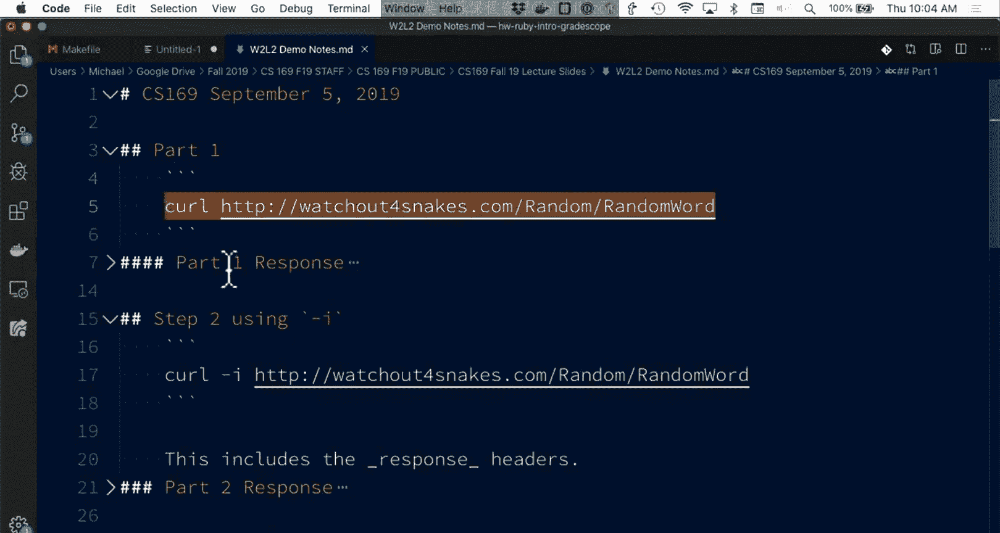

Two。Test out what's going on。 So curl is a tool that。

If you're on a Mac or you have a Linux machine will be installed by default。

 it is an incredibly handy piece of software。 It has 10 different configuration options that you most certainly do not need to know the details of but what it does is it makes a request and then it displays the response。

 you can also save it to a file， So when I curl watch out for snakes， I get back a bunch of stuff。

Does anyone know what this is， you can just shut it out。It's HTML。 Yeah， so this is a web page。

 right， What I have done here is I've used the command line tool to grab the contents of this webp page。

 Yeah， HTML at the top is a nice hint that we are dealing with HTML。

 if I go over to my browser and I have the same site。 I go to watch out for snakes。 I get， you know。

 a very similar looking webp page。 This website just returns a random word。

 So it is something that you'll be using in your homework assignment。😊。

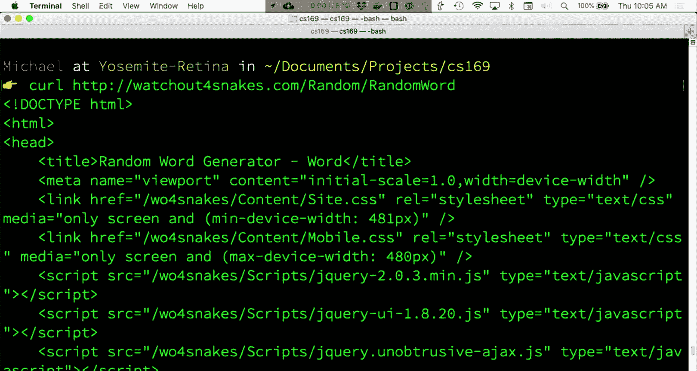

If I open a Web inspector， let me close this。 You know。

 what we see is essentially the same thing here。 So this is a bunch of HTMLM。

 This is what the server returned。

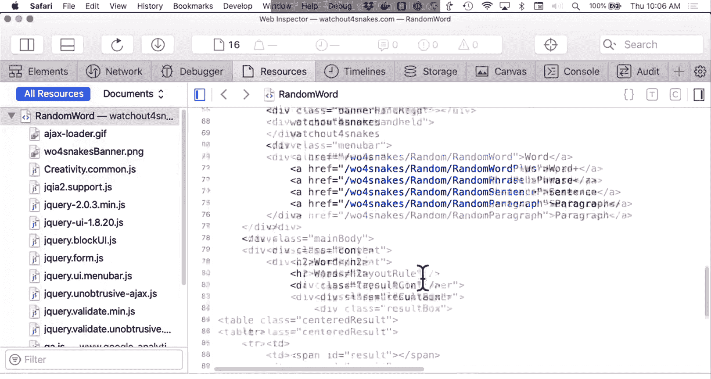

Yeah， these were each independent request。 So the specific data that's in here could potentially be different。

 but。You know， that is。That is these， the standard set。

 So curl gives me back with the URL just tells me the response。

 I can write it to a file if I wanted to。 If you have some experience using Unix tools you know。

 curl is where you could combine this with， let's say something like Gr to search for a specific string in the result of that page。

 you could，Sa it to a file， anything like that。Another option will be so I can just hit the up arrow to go there。

 And I'm gonna add the minus。I parameter。 So you'll be getting practice with this in your second homework assignment。

 So minus I says display some information。And what minus I is。 So we get a lot of stuff back。

 we get a lot of H2l back。 But right at the top of minus I。

 we get back a bunch of new information about this response。

 So this response tells me that it was okay。😊，There's a bunch of additional headers。

 So these are all headers that are data about the response that are distinct from the content of the response。

 So this is informational。 If you are a browser， you might decide that you want to do certain things with it。

 It tells me， you know that this server is a Microsoft server。

 I don't need to do anything with that in this case， it tells me when the web page was last modified。

 because this is doing something random。

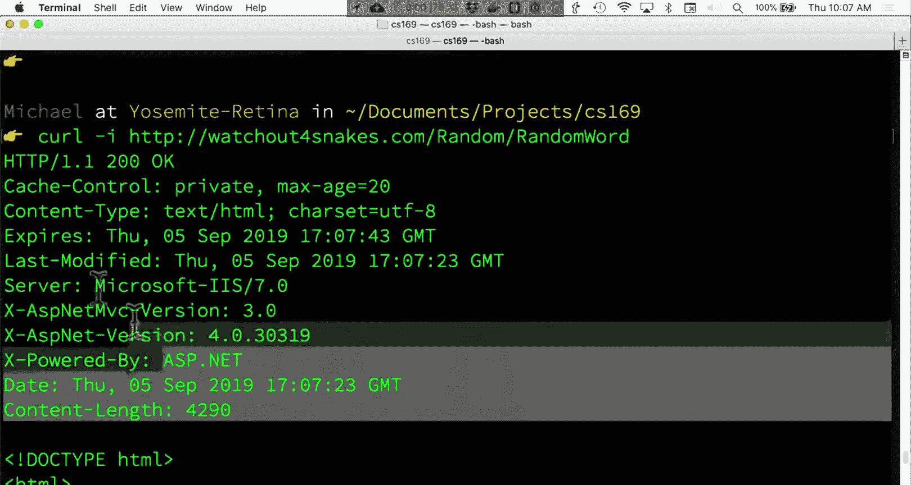

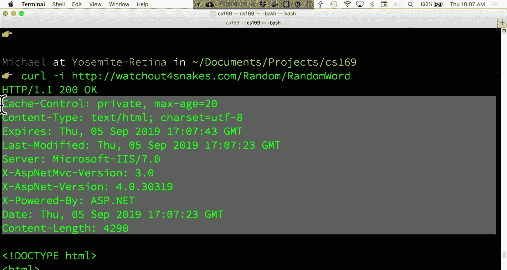

You know it is modified immediately， it gives me the time of the response。

 and it tells me how many characters， how long is this HTML2 page。This is useful because。You know。

 if for whatever reason， a response gets dropped somewhere along the way， a connection gets closed。

 You know， your computer is downloading something that is many， you know， gigabytes long， then。

The computer knows， you know， it knows what it should be expecting。 So if you ever， you know。

 download a file and it's saying0 out of 100 MB or whatever the size is。

 that 100 MB is based on this content length header。 So there's some information that says。

 here's how much data you should be expecting to get back。 it's technically optional and that。

 you know， without it， you know， your computer will just receive the data and will still display it。

 But it's something that you will commonly see。 So。That is a bit of curled。

 You can also so control a on the Mac will jump to the beginning of the line Super handy keyboard shortcut。

 if I do capital I， it gives me just the headers。Again， don't worry about memorizing these options。

 but。What is useful to see is， you know， curl is a great way of debugging things that are going on with the Internet。

 So if we have time at the end， I'll show you how you can sort of debug web pages that you use yourself。

😊，Questions on this so far， what's going on， anything that we've seen。No question。

So basically that is the initial bit of curl in a nutshell。

 I'll just show you one other option really quick， which is dash V。

 so V is often for verbose and what V shows us at the top is the request headers in addition to the response headers so。

These are what curl is sending over to the watchout for snakeakes website。

 So a common thing that you will see。 and one that you could have fun playing around with is this user agent header So this is how a browser or in this case。

 curl as a tool if youre using a Ruby library and you're making requests using something like when the HP libraries the user agent identifies what program is making this request。

 So Chrome Safari Firefox edge all have unique user agent strings that usually identify the version and this is how a web server knows what browser it is it is sending response to。

 So sometimes you know if you're using an old version of ie that needs some additional jascript or something to support the website the browser or the server can send back content just for that browser so that the website still works or。

It might just say， hey， you're on an old browser， I give up。

 but here's how you go upgrade or something like that。So each side。

 the request and the response can have their own set of headers。

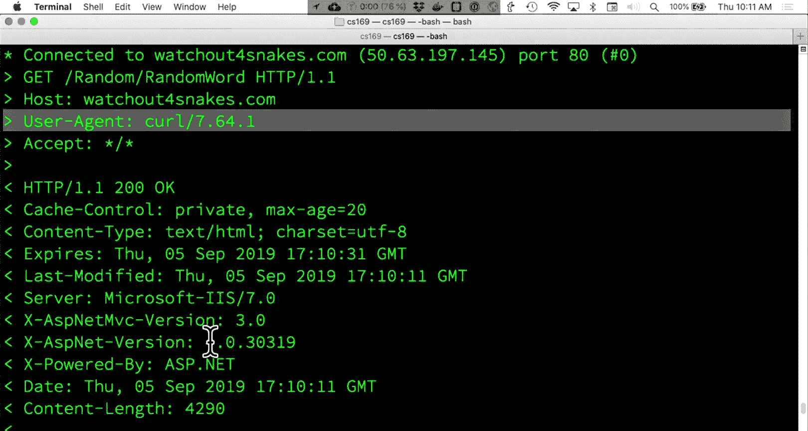

Howd people feeling about that so far， questions。Cool， so what we've seen。

So far is a couple command line calls with a full URL。So we have the get method so by default。

 curl just does a get method when you go to Google do co， you just have a get method。

 We will look at post requests in a bit and you will get experience with post requests on the homework assignment。

So HP is the protocol。 So for most of the things you do in this course， that's what we'll be doing。

 Col slash slash just separates things。The host name。

 the domain name is the human readable version of what you know that site goes to if you take 168 you'll learn about how DNS。

 the domain name system maps that host name to an actual server which has its own IP address。

The port 80 is a way of saying this is a specific location in a sense on the computer that I am requesting access to。

 so there are a bunch of different ports， 80 is the one that is used for HTDP and essentially these allow computers to communicate with multiple different services at a time。

Each protocol has its own set of ports that can be used。So the resource path is。

You know where you might find the data you're looking for。

 So this could just be a file in the early days of the web。 you know， the resource path was。

 you know， Cs do beerkeley dot com slash index dot Hl and all the server was doing was returning that index H file。

 So you would see this。You know， on a lot of pages still， most of the websites now are dynamic。

 meaning that content is generated dynamically。 And we'll talk about that。

 And then the query parameters。 So a question mark is a special character in a URL。

 there are a few of these special characters， which， for the most part。

 if you're using tools like rails， you won't need to worry about。But you will see them。

 And so question mark says everything after this is part of a query string。 and most commonly。

If you see。The letter Q， there is nothing special about the letter Q except that it is the first letter of the word query。

 and this comes from the idea of wanting to use query parameters to search for something。

 So if you type into the Google search box， you hit enter， you look at the full URL。

 it's going to have， you know Q equals some form of what you searched for。And。You know。

 this is saying I'm searching for the word cloud on the site。

 the language I'm using is English and the hash or pound symbol is a fragment。

 so this denotes a resource within a page， you know this may not be there on most URLs。

 it is optional， but this will say you know if the fragment with a name top exists in this web page。

 it tells the browser to scroll to that bit。So there are a lot of different pieces and together these things help give some structure and some flexibility to how clients and service communicate with each other。

But。you won't necessarily see every single one of these things on every single request。

And I will also point out that while there are standard bits of how they should work。

 web servers are built by humans， which means they don't always follow the rules。

 So just keep that in mind as you're going through if something doesn't make sense。

 please you know like ask us on piazza， but it may just be that the site that you're using orre looking at isn't also following the rules。

 So again， a route is a combination of the verb。诶。The HP method and the UI。

 So these two things together make up a route。So what have we talked about so far。

 TCPIP gives you a stable connection between two endpoints。

 it is abstracted for you if you're using TCPIP， you'll get all the data you need in the order that you want it。

HTP is the protocol that we'll be using， but it is one of many protocols if you've seen things like FTP。

 the file transfer protocol， if you've used SSH SSH is another protocol。

 your browsers don't support SSH but your terminal does using the SSH command。

 there are a bunch of protocols that communicate over TCPIP and an HttP request is a request from a client to a server using the HTP protocol again。

 a route is a method and a UI。And the reply or the response is what the server returns to the client。

When we saw the headers and the HTML page， that was a response。 So first clicker question。ho边。

All right， open for voting。Which of these statements is true about HTP requests。

 so we have two requests， a get for slashfoo s bar and a post to slashFo s bar？

Are they indistinguishable from each other in your application。

 are they distinguishable and must have different behaviors？

They are distinguishable and may have different behaviors or a different app can have one or the other。

 but not both。 And as a reminder， E is always the W option。 So if you have no idea what's going on。

 you want more clarification， always feel free to vote E。You know。

 and while your clickers are registered， I am also for the purposes of clicker questions， you know。

 we're never gonna look at whether you get these correct or not。

 So always feel free to vote Eve if you would like more clarification on something。Yeah。

It should be AA。If it asks， which is the default？嗯。Yeah， the default is just AA。If not。

 we can try debugging after class or in off hours。 So as a reminder。

 if you miss a few clicker questions throughout the semester， it is not a big deal。

 We want you to participate in most of these， but you know。They are are participation points。

 they are you know a boost to your grade they aren't going to。They aren't going to hurt in。

If you miss a few。Cool， so it looks like we're up to about 60 responses just under so。

I'm going to turn it off for now。Take about 30 seconds or so and talk with a neighbor and see if you would like to change your response。

And then we'll open for voting。可定系。そす。你啊第。有得过嚟。あす。都唔会。いがれ。关注系都。我系。Yeahや。会。系。咩。我。When they're going。

说两。あ。All right， so as you're talking， I'm opening up for voting again。

 we'll stop when we get to about 60 votes or so。Give it， give it a second vote。

 And if you still have questions， feel free to vote E。

 And if you have more questions than you did before， also feel free to vote E。All right。

 we're up to about 40 or so responses。If you're not sure， just take a guess or just。Cool。

 let's get a few more in。Cool， so I there's definitely some interesting results here。

 So this is your most recent vote and。😊，So pretty somewhere so far。

 I see a few more people have looks like voted for B。Which is interesting。

 So you guys have convinced yourself that they must have a few people have convinced your peer that they must have different roots or risk behaviors。

 So this is one of those interesting things about。The Web and the specifications to that exist。

 I would say that get and post methods should have different behaviors。

 But the correct answer is that they may have different behaviors。

 So the Internet specification doesn't actually。Say that these two things have to be different。

 But by convention， for the sake of developer sanity， if you are developing an API。

 which you very well may be building a new one or extending an existing one。

 I would highly encourage you to have routes that are get and post do different things。

 they are meant to be different。 So the word get is。

Meant to be a request that says I am just asking for data， we haven't talked about specifically。

 but we'll see later on in the semester。 and maybe in the last few minutes of lecture today that the word post is meant to say I am also sending some data to the server to do things。

 so they may be different。But they don't。 They technically do not have to be。

 but proper sort of API design that we'll talk about in a bit suggests they should be。

 So just to recap a bit since the number of Es jumped around a bit。So your server， A。😡。

Someone convinced their peers that a was not the right answer。 So nice job toever that was。

 they are indistinguishable。 sorry， They are distinguishable。 They are not indistinguishable。

And the reason is that what we saw in curl， you know， the method comes across as part of。啊。

As part of the request that's going there。 So when we work on our applications starting next week in homework2。

 you know， you will see that you will be able to define things that respond differently to get and post。

 So your application can definitely distinguish between the two responses。

 it should distinguish between them， but it doesn't have to be and because your application can distinguish between the two responses are the two requests。

 excuse me， it can have both of them。 Now， for some routes。

 it may make sense to only have one or the other so。You know， you may not have a post route that。

You know， like there may be certain routes where you can only get data， but not post to it。

 And so if you use a post verb or method， it will the server will give you an error， but you don't。

You know， you don't have to have both。 you can have both。 you could have one or the other。 you know。

 we've talked about get and post。 there are also a whole host of verbs。

 You will learn about the delete one， So delete is a common way of saying I want this resource to go away。

 name delete but not you know not every application has to。Has to respond to everything。

 Queions so far are on this。 Any other questions。Yeah。I thought saw hand in the middle or back。

if you have it， if anyone has a question。No， okay， if you do have a question， Phil， no， really。

That's not what I wanted。 If you do have questions， feel free to shout them out。So。

Service oriented architecture。 So when I took C S 169。

 the words service oriented architecture existed。 There was a lot more debate about them。

 The word microservice did not exist。 And so we'll talk about how the decoupling and structuring at an architectural level of apps has changed over time。

 so。Originally， you know， in the early days of the web， it stood out as a research projects。

 project by scientists who wanted to share papers， you know between each other。

 So the idea of a hyperlink you know， a URL that when you click it takes you to a new page was meant so that you could have references and your scientific papers that would linked to the other scientific papers and so everything was sort of thought of as I ask for a file and then the server gives me back a file and you know you go about reading things。

 that was sort of the original idea of HTML。And then eventually e-commerce made things interesting。

 So Amazon started out as a book site in the 90s。 they were not the first。

 but they were certainly one of the first sites I to this。 And so when you have e-commerce。

 you you have a catalog of even at the time， thousands of products。

 you are not going to build a single static web page for each of your project products you you're not going to be able to have everything automatically saved and generated。

 so you start having to build content dynamically and so this sort of changes from having files on a computer that are sent back to the client you have a database。

 you have a web server So something like rails but wasn't rails in the 90s and that makes the web a whole lot more interesting because now when you request a page。

 that content it could be entirely new content， it could be content that is coming from a。Base。

 it is。It is something that can be as， you know， a site that generates random words as it could be totally random content。

So the next bit of the Web that you'll get experience with later in the semester is Ajax。

 So do not worry about what these words mean， but asynchronous jascript and X M L。 So X。

 M L is totally a misnomer at this point， because。Most of the responses returned by are not even XMl。

 but this is a way from a web browser in jascript to request some new data without reloading the entire page。

 So in Google Maps， you can pan around in zoom。 You can click on things。

 your web browser is not reloading the page， but is getting that new content right Google has many。

 many millions of you know locations stored around the world。 naturally。

 your computer when you load Google Maps doesn't load all of that information。 In fact。

 it only loads， you know， a few tiles around the area that you're displaying because it's faster。

 It's less data。And Google doesn't know what you might you know， need to look at。

 So as you move around， Google Maps will make an Ax request to say， hey， I'm looking for you know。

 the restaurants in this new region。 Maybe you're scrolling from Berkeley to Oakland。

 and it makes a request for some new data。 but all the while， you're staying on that same website。

 You aren't navigating to a new page。 You aren't refreshing the browser to get new data。😊。

And so AjaX， Google Mas is sort of the first example of this。

 but it sort of dynamically changes you know a web page and it makes it so that you have an experience that feels a lot faster that is you know a lot more sort of native feeling so it feels like an application that you might use on your phone or your computer and for users。

 it's a lot faster。 So if you've heard of the phrase a single page app that sort of falls from AjaX where you make one request and then you never have to reload the page again。

 you never necessarily see a loading bar you know happen as you navigate and as your content changes。

 you make you know more， more request potentially but they're smaller and more frequent so that you can get data on demand so。

You'll get experience with this later in the semester。

 But it is an important development in sort of how the web evolves。

 because without the tools and the sort of distinctions of building products that use Ajax requests。

 we would not have a web that is as interactive as it is today。

 So going back to Amazon as one of the prototypical examples of。How， you know。

 how the Internet and how large applications are built in the 90s。

 Amazon starts out as sort of a single monolithic site。And exists that way for a long time。

 So it's a bookstore service。 So you go to Amazon， you hit the Amazon server。

 and they have a bunch of different databases。 They have users， databases， orders， databases。

 a database of books or products。 And they all talk to each other。 So， you know， within this model。

EachEach of these components of Amazon is sort of one giant application that at any point in time。

Can make。You know。a query or request for some user data from， you know。

 an order page or something like that。 And around 2007 or so， the actual date is in the textbook。

 Jeff Beszo sends a memo， and he says。You know， I want us to sort of rearchitect Amazon to have more distinct components。

 So this is a move to a service oriented architecture。

 And what this means is we are now decoupling the bits and pieces that make Amazon。

 Amazon into distinct parts that could operate independently。

 And so there are two important distinctions here， which is that fundamentally。

 what Amazon is providing is the。Is the same thing， You know， from the user's perspective。

 Amazon is still Amazon。 It does all the same stuff that it's used to do。 And ideally。

 a user would never notice。 But instead of having， you know。

 sort of three components that make up the service， these are now sort of encapsulated in。

Their own view。 So when you have a user service， if any other service。

 like an billing service or or a products catalog needs to get user information。

 it has to go ask the user service for that user information。

 it cannot just directly access the user database。 And so what this means is that when you're building a product。

You have some separation of concerns between the different components and by doing this you have defined a protocol。

 an API， some mechanism for which you know a service that lists orders can go ahead and talk to a service that has user information or a service that tracks billing information。

And so from an internal perspective for Amazon， this can make things easier to scale and adapt because you might have different demands on different services。

 so you you might need to scale things up or down with more or less customer requests。

 but what also is great about service oriented architecture is that if Amazon wants to or if you know another third party wants to。

 depending on what Amazon's API allows， they could connect to just a specific service so they could potentially connect to a reviews database。

 which is its own service that has been segmented from the billing service so you someone accessing customer reviews wouldn't have any access to anyone's billing information which would be a pretty terrible thing。

 they can access and make request to a billing to review service。

And then they could connect that to some third party API。If you're using a social network。

 you could connect with your friends to make a review recommendation app。

 And a few of those things exist。 And， of course， in real life， Amazon has dozens。

 if not thousands of actual specific。 No， done to that。

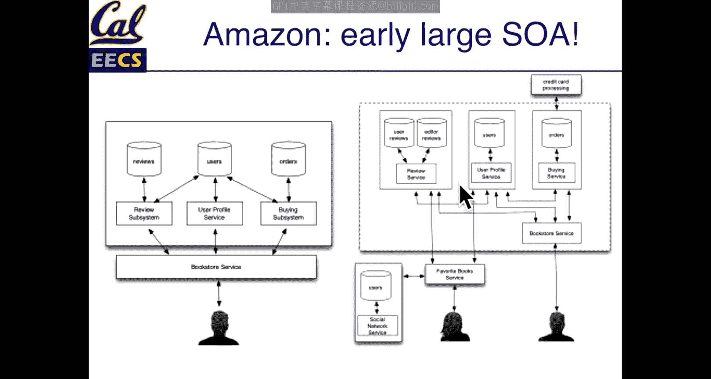

诶。Thousands of services in production。You know， this is a pretty simplified view。

 but the important thing here is that each piece is compartmentalized。So。Clicker question。

It is now open。It is now open。There we go， no。There we go。

So when we're doing service oriented architecture， which of the conditions are necessary。

 if any of them at all， and。Again， we'll have you vote and then we'll take a few moments to talk with some peers and reoke。

All right， we have about 60 responses in。Take， take 30 seconds or so and talk with your peers。

 and then you can re。

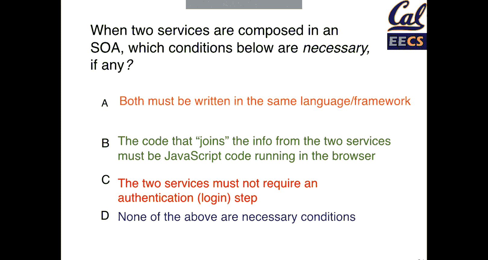

我。可。咗倾。

てく。yeah。不这意思。い。问下。は。一个。Yeah。下。都系小。家系啊呢。系ま。系好。All right。

 so go ahead and start revoing and then we'll talk about it when we get to 50 or 60。Yeah very。s了。

All right， let's get a few more votes in and then we can talk about it。哦。

10 more seconds if you want to just vote。Cool。Again， some nice movement and convincing your peers。

Which is the point of this。Anw， they both must be written in the same language or framework。Yeah。

 so this will be nice if you are a development team working on multiple services in a services oriented architecture。

 it would be nice to have all the tools that you use have some common languages and frameworks。

 but there's nothing that says that this has to be the case。😊。

The reason being that what we are talking about when we talk about a services oriented architecture is。

 you know， you have components that have some contract between them as to what data they will return and how。

 So they can be written in any language。 and from that。

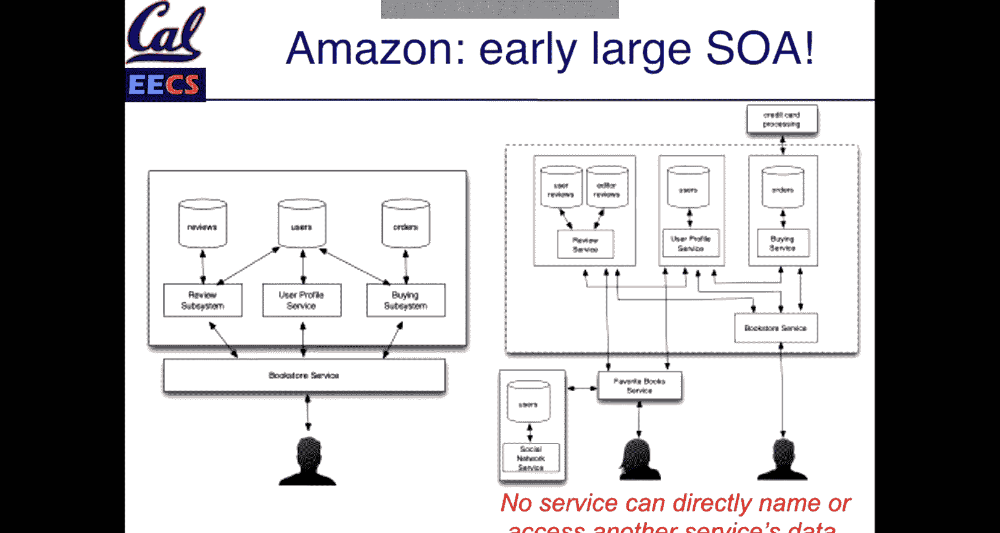

我。Come on。

All right so。From the fact that they can be written in any language， the code that connects services。

 it does not have to be jascript。 It could be jascript in a browser making multiple calls to multiple services。

 But oftentimes， this can often happen on the back end as well before the server even sends a response。

 So you might have。Your Ras application might get a request。For some data， you。

 so it's asking for some user profile information。 and that user profile page might have to go make another request to。

 let's say a billing service and list all the orders that that user has made。

 And so it is possible in the services oriented architecture to before the server even returns a response to the web browser for rails to go ahead and make plenty of different requests and compile all those together before it returns its own response。

 So it doesn't have to be jascript。 it very well could be jascript running in the browser。

 it could be jascript running on the server。 but。You know， it could be any languages。

 they must require an authentication step that is up to you。

 if they are returning sensitive information， then hopefully there is some authentication or security behind them。

 Otherwise you're exposing yourselves to massive data leaks。

 And from saying none of these three are required。 the main answer that is。

 none of them are necessary。 So in services oriented architecture。

It is really the philosophy behind how you structure things。

 but the mechanics of how you do so are up to you， in fact， the number of services that you have。

 whether that's you know two or three or four， or if you're Uber like 400， you know。

 that is up to you to structure these services you know sort of as your team or your product needs a C fit。

So。Every approach has， you know its pros and cons。 So the nice bit here is reusability。

 if you have to distribute an app as the needs of your application grows。

 you get to reuse that service in multiple places。 So authentication is you know a very common thing to pull out so that you your Amazon user account can be used to log in with Amazon com It can be used to log in with Amazon Web services。

 you can even build a login with Amazon button that accesses just you know a user service from Amazon so you get reusability as a benefit。

Best tool for the job。 So， you know， it gives you the option to use multiple languages。

 So depending on what you need， it might make sense to have a specific part of your service or your product written in a different language。

 So maybe you have some very performance， critical code。So you have， you know。

 instead of just using rubion rails， you extract a bit that can be in a different language。

 or maybe you're building a rails application， so this is the case at gradecope that is a rubion rails application。

 but every time someone uploads a PDF， we need to do a bunch of computer vision and machine learning and AI on that image that gets uploaded to extract some data make it easier for instructors to grade and all that stuff happens in Python because as nice as where the is the machine learning tools around Python are much more robust and much better developed so you can extract out of service and use the tools that are appropriate。

This can make it easier to test。You know， you have separations of separation of concerns。

 you define what the service goes in， what should come out， you get to test it more easily。

Because of this， you can adapt your individual services more easily if you are a large company。

 you get to have dedicated teams to do so。And sort of the idea that you know。

 when you make things smaller， it becomes easier to build and deploy individual changes。

 So if you're a developer working on you know， just an authentication piece and you have other teams at your company working on other pieces。

 all you have to do is worry about just the authentication piece to do your job。Of course。

 componentizing things has， you know， lots of potential drawbacks。

 So if you have a lot of state where your application is tracking things that are in progress。

 you know， saving the form information as you're typing it on a web page， if you are。

You know doinging something that is sort of live updating， that becomes trickier to handle。It is。

 you know。It is nice in that everything is componentized。 But because you know how boundaries。

 you have to figure out how to， you know， get data across those boundaries。

 You must define a protocol。 Sometimes it's hard to know what that protocol should be。 But， you know。

 it， if you're cleanly extracting a service， you'll， you'll kind of。You know。

You'll have a good feel for when， when those barriers are more of a hindrance or for a help。

 So just as the individual pieces are easier to test， the system as a whole is harder to test， so。

You as a developer， may be having great success working on this user service。

 but you then don't know what's going to happen if， you know the main bits of the application fail。

 So who is responsible for putting other pieces together and testing that whenever you introduce distinct systems into that problem you know。

 you have new challenges right， what if an HP request between two of your services fails。

 How does it respond to that， know because of that request。

 what happens to performance is it slower and if so。

 how does your application communicate that to the users。And then finally， with multiple services。

 it's easier to deploy an individual one， but it's a lot more work to deploy tens or hundreds of thousands of them。

 so you might become sort of an operations specialist if you are working with dozens of different services for this class。

 most of your rails apps are going to be a single source of truth。

 you don't have too many distinct pieces that you have to manage yourself。

 but you will very likely use thirdparty services so sending email for example。

 there's plenty of services that make the job of sending email a lot easier。

 and that will be a place where you can take advantage of services without having to do all the management of those services。

So。As we're wrapping up， just reminder on admin stuff if you have the opportunity。You know。

 to take this course later and you're not sure about this semester， we will offer it in the spring。

 We intend to offer it every semester as much as possible。 So just keep that in mind。

 if you're a concurrent enrollment student and you can't get into this course。

 all the content is available on edX as well。 So it is free。

 it is also available for a paid certificate， the one thing that you do not get by taking the course online is you don't get the customer project So you can't use the edx course to a place UC Berkeley requirements。

 but if you're just interested in the material just a reminder that that is an option。

And then I mentioned last week that we'll have sort of。Saas blog lunches。 So if you're interested。

 I'm gonna to hang out in the North side Food court at a table around 1 PM just bring some food and。

 you know， ask questions， anything like that。Homework schedule so after the first homework is due。

 they'll be you know basically one due per week and then remember that you'll have peer reviews as well for not for the first homework but homework2 will be entirely peer reviewed with some spot checking by the staff And then with projects。

 you know， we'll get you a schedule when we get closer to projects。

 but therell be a couple different dates there as there are surveys in customer interactions and then the midterm two date has been confirmed。

 it is as we ask for 115 from 7 to 9 PMm。 if you have conflicts we'll be sending out a form for that soon so。

The last bit of lecture today is on APIs。APpis。They are just a contract between two different parties。

And the keyword here here is documented， which does not always happen in practice， but。

They are a way of saying， I would like to get some information from your site and I would like it back in this form and an API is a way of doing that。

 So what must an API specify。You know， how you can call the function， of course。

 So what is the route in this case for a Web API that I would be asking for。

 We're gonna be talking about Web APIs， but the term API can also apply to native applications as well。

 So， you know， again， one of those terms that gets used in multiple contexts， but。

How can I locate and identify the information？ So in this course， that is， you know。

An HP method and a route usually， what do I need to pass to that API。

 So you will commonly see that something that will be required will be an API key。

 a user authentication token， something that identifies who is making that request but you know。

 that will depend on each specific API。Oh what is the API going to give me back So you know we showed you with watch out for S snakes。

 you get back an HTML page an HTML page unless you are a web browser is kind of an annoying document to get information out of There's a lot of data in there that just tells you how to display it but might not be the data that you're interested in。

So， you know， how do you get that value back and the final thing that is very helpful for an API to document。

 although I will caution you that not as many do as they should。

 what happens when you get an error back so。What should the response be。

 how do you go about debugging that， finding more information？

These are the things that good APIs will do for you and you' will have good documentation。

 but in the real world that is not always the case。How， you know。

 how is a user who is making request identified by and by the server， How do， you know。

 if I am watch out for snakes， how do I know who is making that request。

The server usually uses the parameters of the of the UI to provide some of that documentation。

 So sometimes it doesn't matter if I'm getting a random word。

 the server doesn't need to know who I am。 So the path is just there。

 if I am asking for something specific， I can pass in additional pram。

 So the second API that we'll be looking at briefly today is the movie DB So this is。

A database of a bunch of movie information that has a really nicely documented API。

 And so they have a bunch of different methods a。A search route that requests。You know。

 finding a movie by in this case， let's say the movie title。 and that requires some parameters。

 And then if you give it a movie ID， then it will give you the information about that movie title description。

 you know actress and actresses， studio info， all that kind of stuff。

 And so we'll do a small demo with this。 And then you'll also see this in homework to as well。

 you you're gonna get practice making some API calls。 so。Arguments that are required。

 if it's a get request， they're usually just in those queryr。 So you saw that question mark。

 Everything after that are usually where the parameters for a get requests are。 Very occasionally。

 they will be in headers， but。For the most part， they're in the query string。For a post request。

 we'll talk about this and you'll see it。In homework 2， but they are part of a form body。

 So when you fill out， you know， an email form and you hit submit。

 that data is usually a post request。 And there is a body component that gets sent to to the server。

 So you'll get some experience with that in homework2。

So does the example here get for search slash movie， we're searching for the movie Coco。

So that is the parameter query of saying the title that I'm searching for and the value is coco。

 So that is the movie that I want to find。And you make that whole request by using their route that is in their documentation。

APpiI。themoviedb。org s3。 that three is just a version that helps。

The server manage changes in how the request and responses are expected to be。

 but is not necessarily a required thing。And then。You have the actual request itself。

 So there is a bait here that will' see an API key so that is how they identify you so that not just anyone can make a request。

 And that is mostly just to cut down on spam。 So again methods， a UI。

 the operation which includes the path and some arguments and what we'll do here with the last few minutes is just make a simple request so。

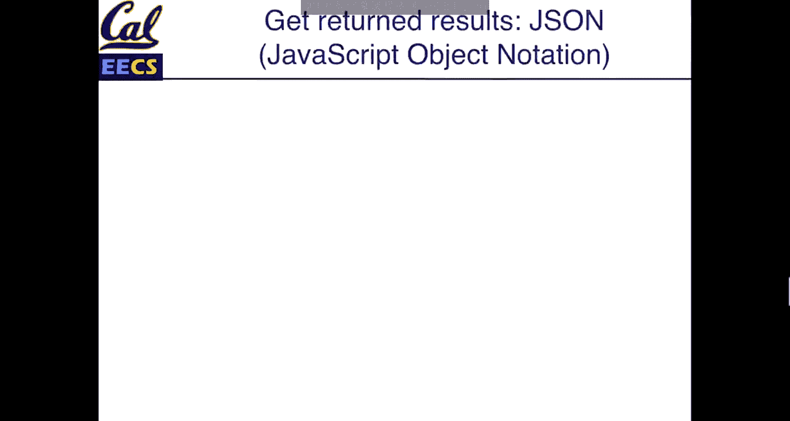

。

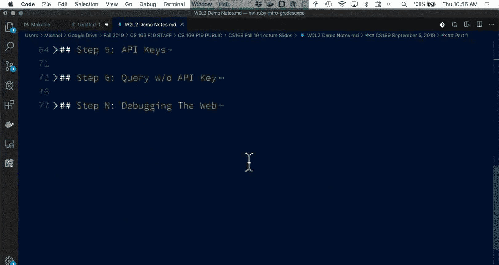

The movie DB has some documentation here。This is the developer site you can click on here。

How do you know what to do， you search for the word search。And you get movies search movies。

And this document tells us， documentation tells us that I need an API key and that I need a query。

 so。This is a great site。 They have nicely searchable documentation。

 they have very cleanly laid out parameters， and I'm not going to go through showing you the steps of getting an API key。

 but you are more than welcome to do so。😊。

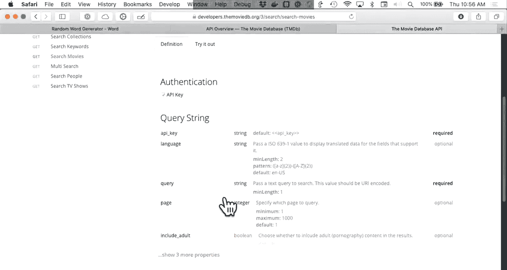

And so what I have here is the sample request。And I'm just going to go ahead and paste that in。

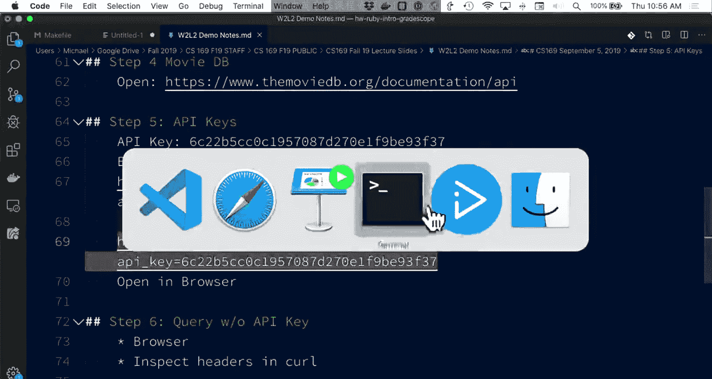

So just a heads up， when you use curl， you will probably want to put things in single quotes so that they are not trying to be interpreted by the shell as a command to be run since there are some special parameters there。

 this is also my personal API key。 So if you're doing this at home or falling along。

 Please don't use it。 You do technically have to agree to terms， but anyone can generate an API key。

 So。I got back a bunch of stuff。There is， you know。A page here， some total results。

 So this is telling me that my query for Coco in this case， returned a hundred and64 movies and。

This data happens to be Json apologies to anyone named Jason， because they sound very similar。

 You should develop a format that has somebody else's name in it。

 But what we're also going to do is we can just paste this in the web browser。 so。

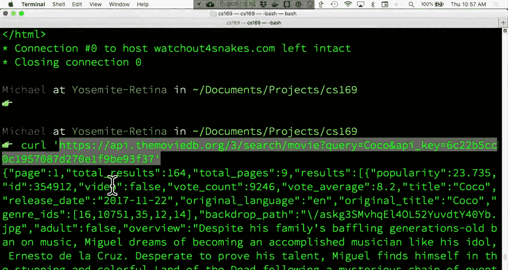

Assuming oh。Let's see what's going on here。

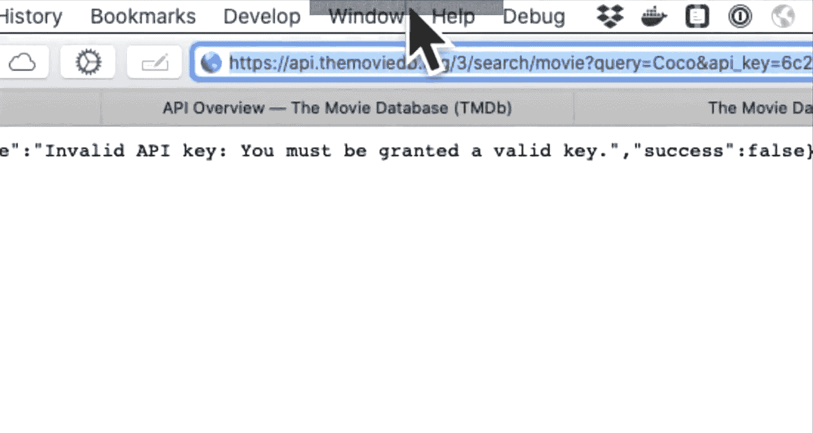

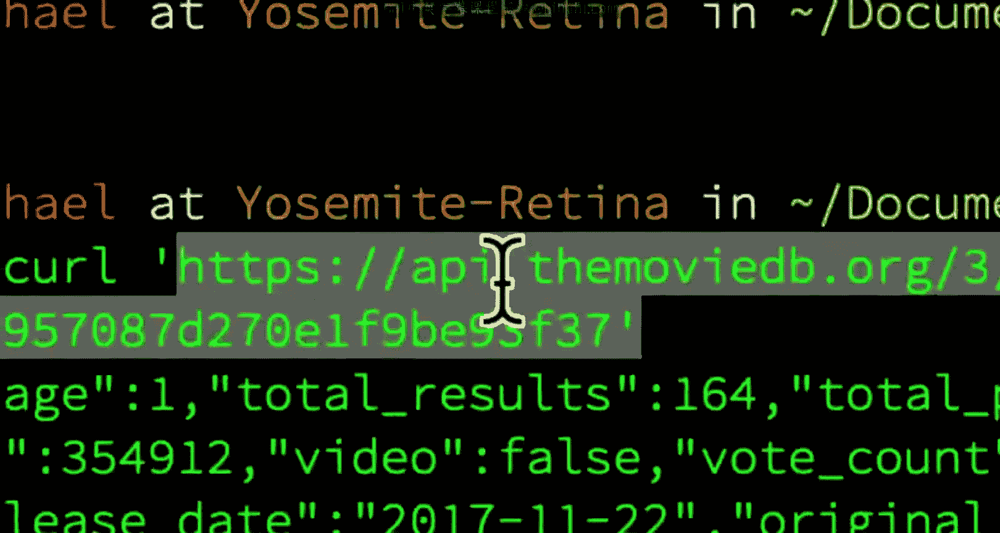

There you go。 Okay， so remember to remove the quotes when you paste things。 So this is， you know。

 all your data just as a web page。 So that is really， you know， all an API is。 It is a protocol。

 It can be accessed in the web browser。😊，But one of the nice things is if I open the Web inspector。

 it will nicely format this for me so I can go through and search through the results so。😊，呃第。

The bit about JSson， it stands for JavaScriptscript Ob notation， and it is a pretty simple standard。

 It uses curly braces， So it's a hash of keys and values。 It looks like the way objects in ja look。

 So don't worry if you've never seen ja before， but you you'll get some experience this semester。

 And it's very similar to a dictionary or in Python， a hash in Java， curly braces， key value pairs。

 every key must be a string in this case。 but when it's a string。

 you can put whatever you want in that string。And then the values can be integers。

 they can be other strings， or they can be arrays， so an array of results。

And then the values can also just be objects themselves。

 So the results is an array of movie objects and。That is the gist of JSON。

 It is a super lightweight format， but it is now the backbone of how internet websites communicate because it is easy to parse。

 it's very flexible Ruby has all the built- in data that you'll need to deal with JSON automatically。

 so that's what you'll see as you work on homework2。 and then if anyone wants to join for lunch。

 Northside Food Court probably 1，10，115 or so。 but we'll just hang out at a table back there。Yeah。

 drop deadline is。

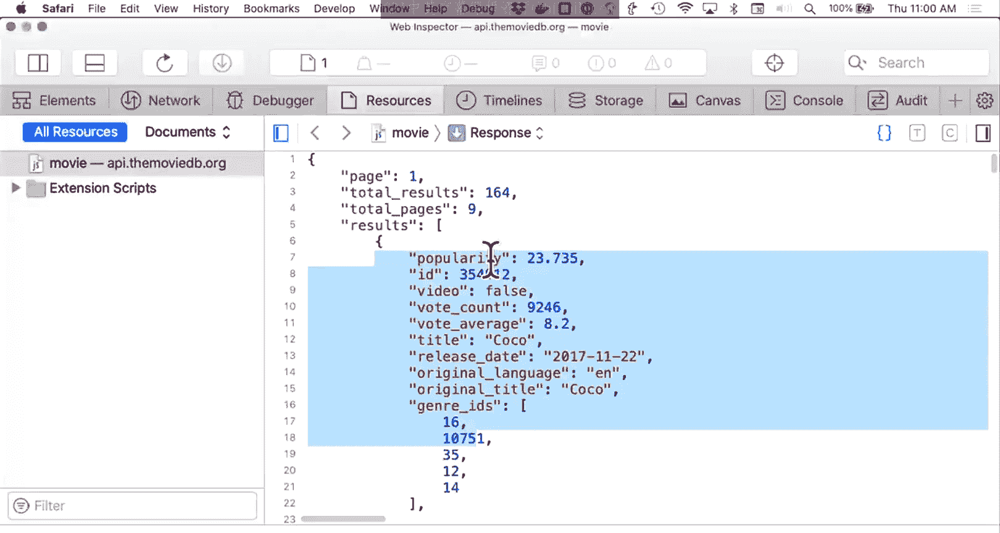