# 软件工程：007：MVC 与 Rails 入门 🚀

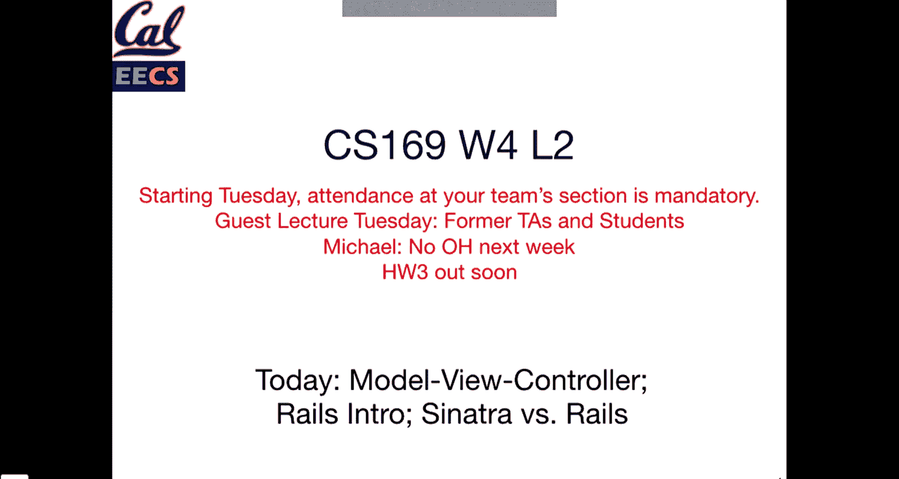


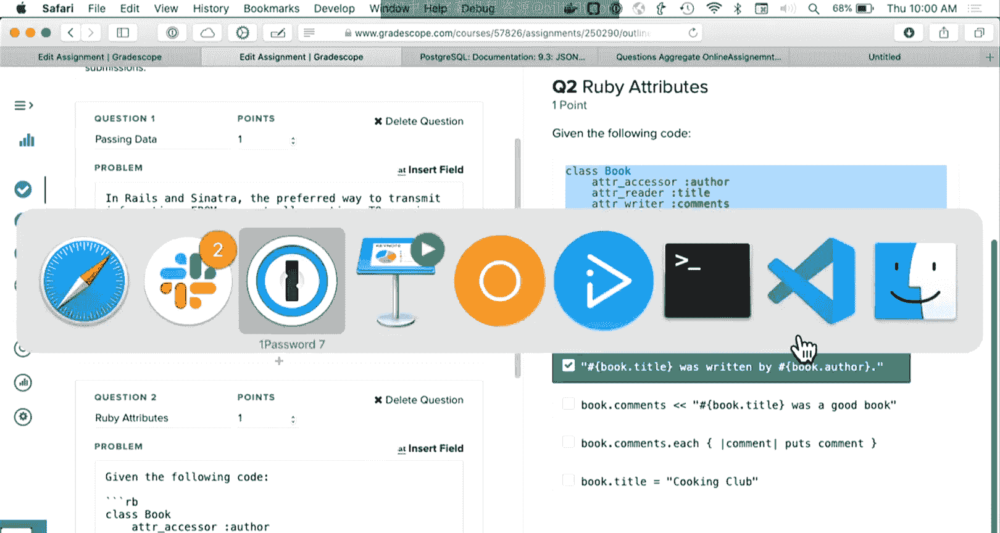

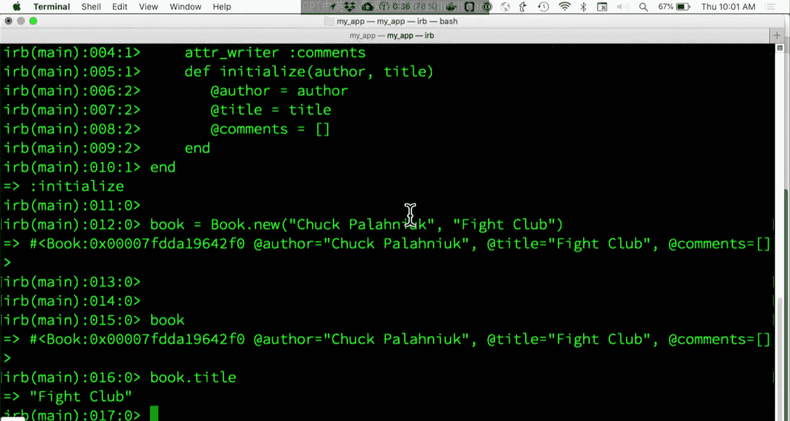

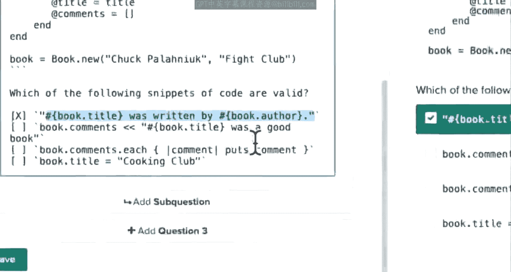

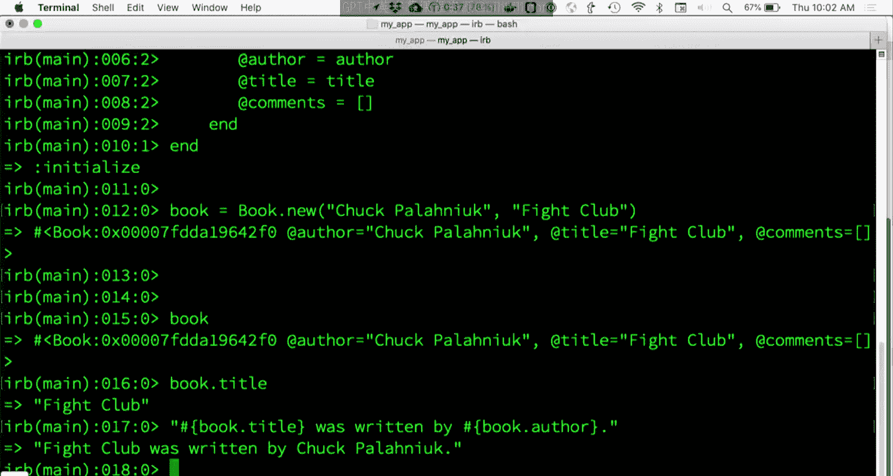

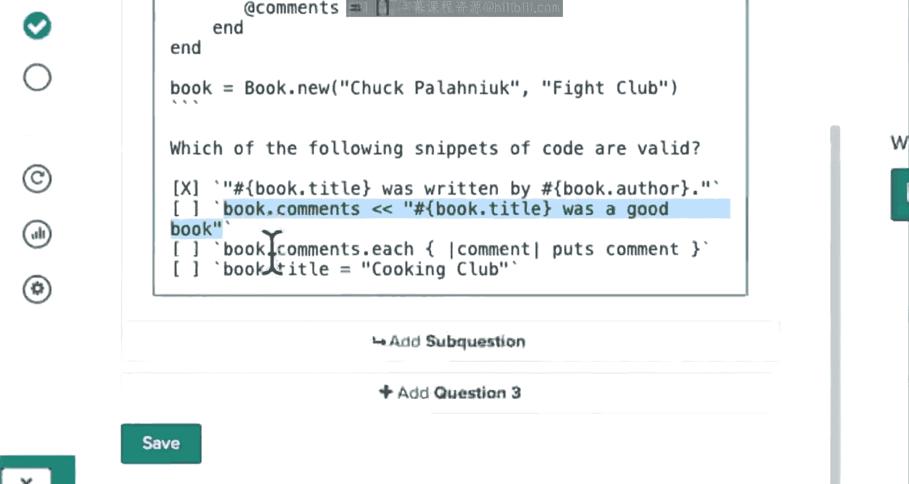

在本节课中，我们将学习模型-视图-控制器（MVC）设计模式，并了解 Ruby on Rails 框架如何实现这一模式，以帮助我们更高效地构建结构化的 Web 应用程序。

## 概述

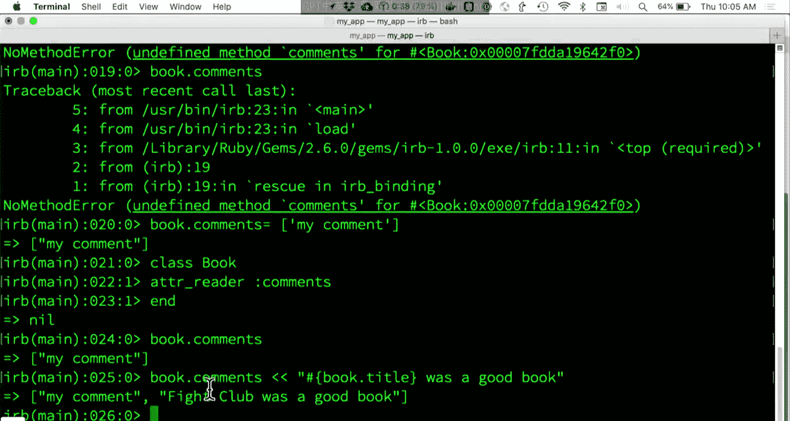

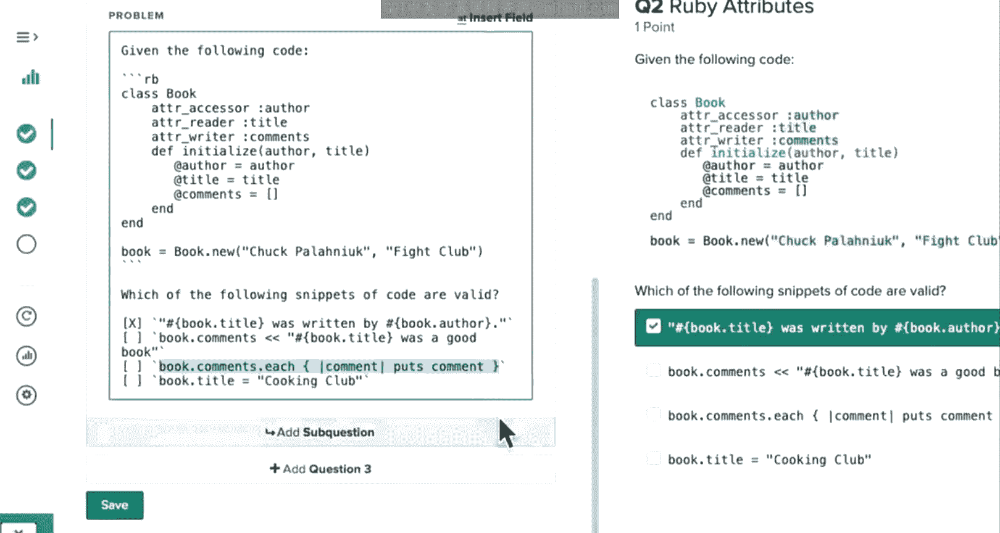

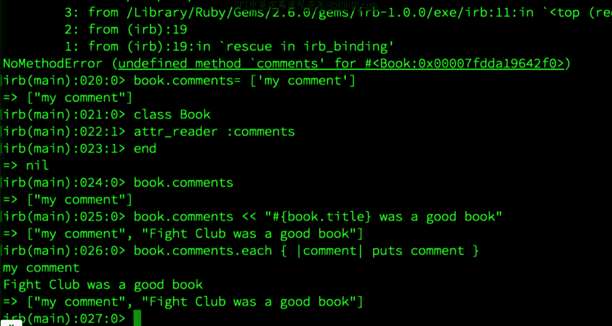

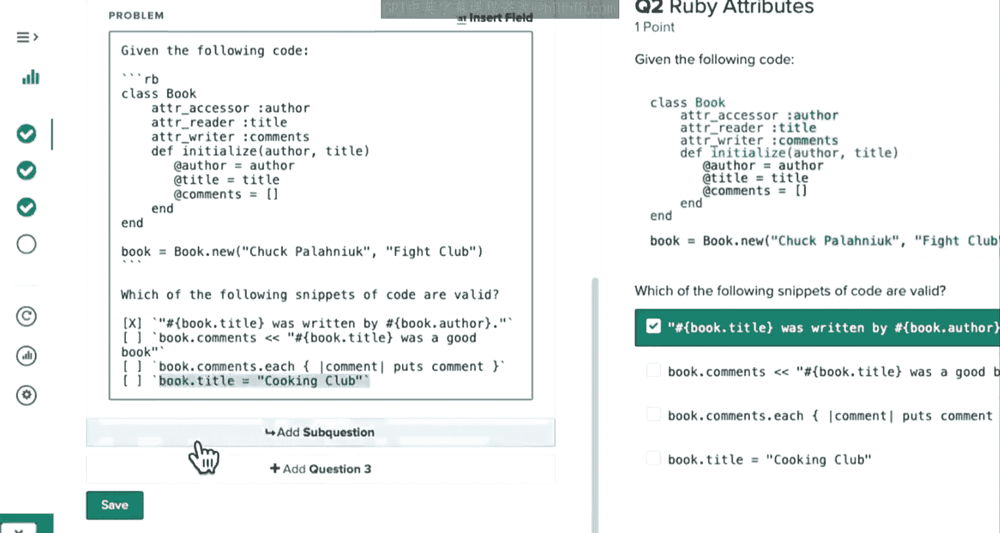

上一节我们介绍了 Sinatra 框架的基础知识。本节中，我们将探讨 MVC 设计模式的核心概念，并了解 Ruby on Rails 框架如何利用这一模式来组织应用程序的代码结构。

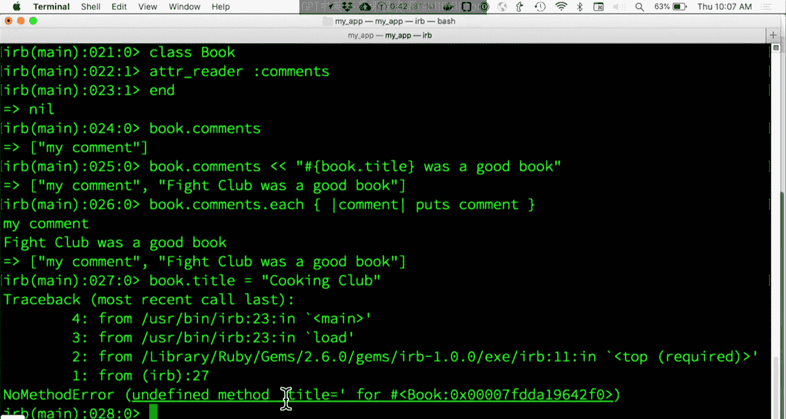

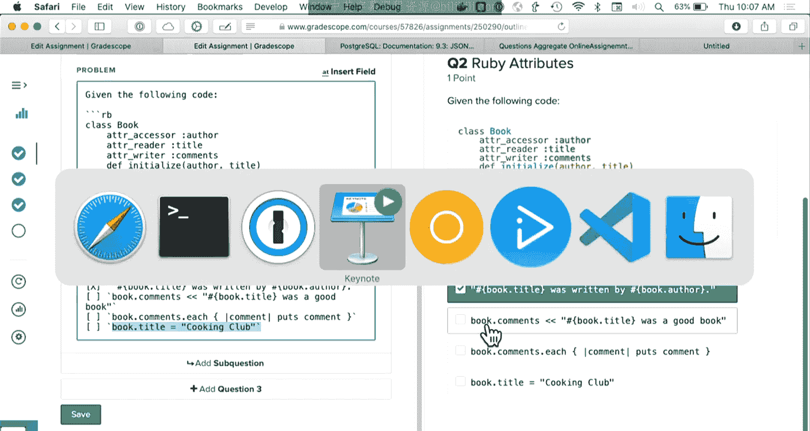

## 什么是 MVC？

MVC 是一种将应用程序逻辑分为三个核心组件的软件设计模式：
*   **模型 (Model)**：负责数据和业务逻辑。
*   **视图 (View)**：负责用户界面和展示。
*   **控制器 (Controller)**：作为模型和视图之间的中介，处理用户输入并协调响应。

在 Sinatra 中，我们主要接触了控制器和视图。Rails 框架则完整地采用了 MVC 模式，并提供了强大的工具（如 Active Record）来简化模型层与数据库的交互。

## MVC 并非 Web 应用专属

需要明确的是，MVC 是一种通用的设计模式，并非仅用于构建 Web 应用。例如，iOS 或 macOS 的客户端应用程序也广泛使用 MVC 来组织代码。对于 SaaS 应用而言，MVC 是一个非常合适的范式。

以下是关于 MVC 模式的一些常见理解，其中一项并不总是成立：

*   A. 所有 MVC 应用都使用 HTTP 协议。
*   B. MVC 应用必须包含客户端、Web 服务器和云端组件。
*   C. MVC 只是构建 SaaS 应用的几种方式之一。
*   D. MVC 可用于点对点（P2P）应用。
*   E. 在 MVC 中，控制器将实例变量传递给视图。

**正确答案是 B**。MVC 是一种设计模式，它不要求应用程序必须部署在云端或具有特定的网络架构。一个本地的桌面应用同样可以采用 MVC 模式。

## Rails 中的 MVC

Rails 是一个遵循“约定优于配置”原则的 MVC 框架。这意味着，只要你遵循其命名和组织文件的约定，就能极大地减少配置工作，快速构建功能。

在 Rails 应用中，代码结构非常清晰：
*   模型文件存放在 `app/models/` 目录。
*   视图文件存放在 `app/views/` 目录。
*   控制器文件存放在 `app/controllers/` 目录。

这种一致性使得开发者能够轻松地在不同的 Rails 项目间切换和理解代码。

### 请求处理流程

让我们通过一个例子来看 Rails 中 MVC 如何协同工作。假设我们访问 `/movies/3` 这个 URL 来查看 ID 为 3 的电影。

1.  **路由**：`config/routes.rb` 文件中的配置会将这个 URL 映射到 `movies` 控制器的 `show` 动作。
    ```ruby
    # config/routes.rb
    get ‘movies/:id‘, to: ‘movies#show‘
    ```
2.  **控制器**：`MoviesController` 中的 `show` 方法会被调用。它通过模型查找数据，并存储在实例变量中，准备传递给视图。
    ```ruby
    # app/controllers/movies_controller.rb
    def show
      @movie = Movie.find(params[:id])
      # Rails 默认会自动渲染对应的视图
    end
    ```
3.  **模型**：`Movie` 模型（通常继承自 `ActiveRecord::Base`）与名为 `movies` 的数据库表交互，执行 `find` 操作。
4.  **视图**：Rails 遵循约定，会自动在 `app/views/movies/` 目录下寻找名为 `show.html.erb` 的视图文件来渲染。控制器中的实例变量 `@movie` 在视图中可以直接使用。
    ```erb
    <%# app/views/movies/show.html.erb %>
    <h1><%= @movie.title %></h1>
    <p>Director: <%= @movie.director %></p>
    ```

Rails 的智能之处在于，它能根据类名自动推断数据库表名（例如，模型 `Movie` 对应表 `movies`），这得益于 Ruby 强大的**自省**能力。

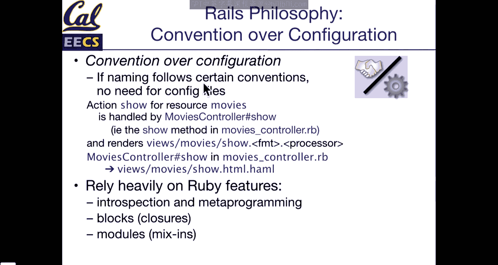

```ruby
# Ruby 自省示例
book = Book.new
book.class # => Book
book.class.name # => “Book”
book.class.name.downcase.pluralize # => “books“ (Rails 会进行更智能的复数化)
```

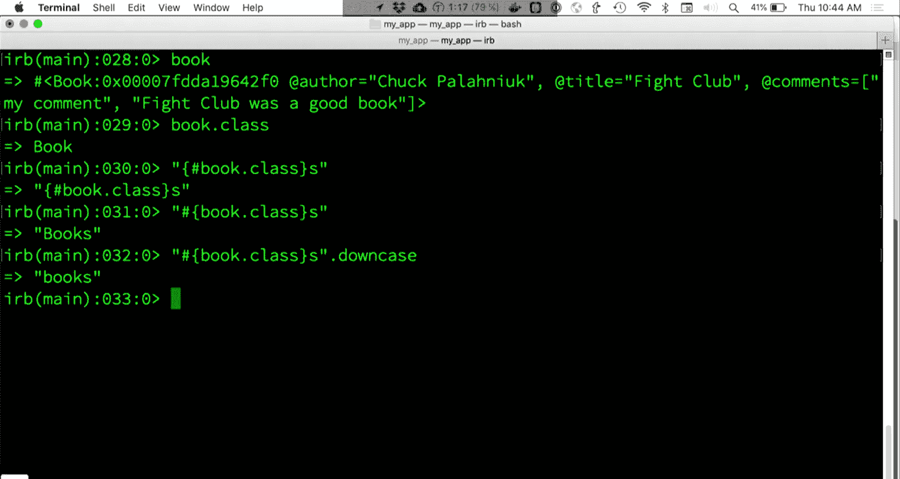

## 控制器必须渲染响应

在 Rails 中，每个控制器动作最终都必须向客户端返回一个响应。这是由 HTTP 协议的本质决定的——它是一种请求-应答协议。

以下是控制器可以渲染的几种响应类型：
*   渲染一个 HTML 视图（最常见）。
*   返回 JSON 数据（用于 API）。
*   返回纯文本。
*   重定向到另一个 URL（本质上也是返回一个带有重定向指令的 HTTP 响应）。
*   返回特定的 HTTP 状态码（如 `204 No Content`）。

即使响应没有直接的“可视化”输出（例如一个文件下载或一个 API 调用），服务器“渲染”一个响应的过程也是必不可少的，以确保客户端不会无限期等待。

## 总结

本节课我们一起学习了 MVC 设计模式的核心思想，并初步探索了 Ruby on Rails 框架如何实现这一模式。我们了解到：
1.  MVC 将应用分为模型、视图和控制器，有助于分离关注点，使代码更易于维护。
2.  Rails 通过严格的约定和目录结构，简化了 MVC 应用的构建。
3.  控制器的核心职责是处理请求，与模型交互，并最终渲染一个响应（视图、重定向、JSON等）返回给客户端。

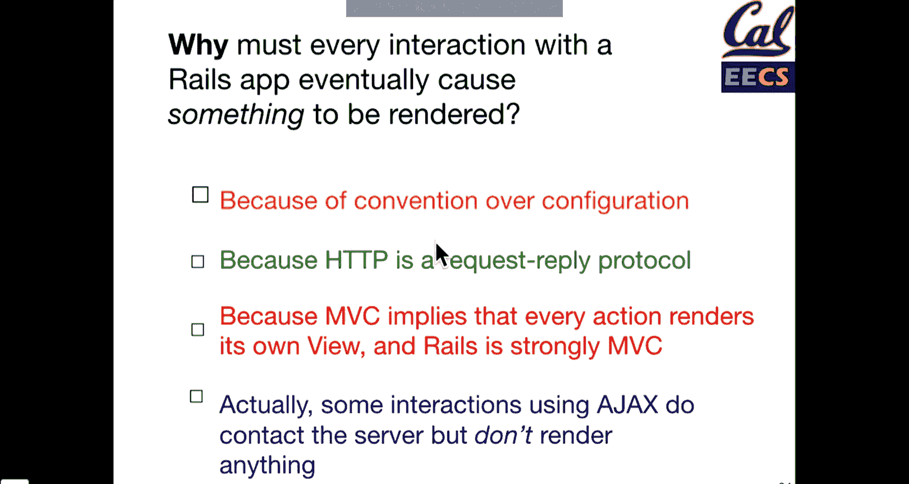

从下节课开始，我们将深入 Rails 的各个组成部分，特别是强大的模型层工具 Active Record。