# 软件工程：009：行为驱动设计与用户故事 📝

在本节课中，我们将要学习如何通过行为驱动设计（BDD）和用户故事来规划和管理软件开发项目。我们将了解如何与客户协作，将模糊的需求转化为具体、可测试的开发任务，并学习如何使用低保真原型来验证设计思路，从而避免在错误的方向上投入过多精力。

## 课程公告与资源

课程开始有一些事务性通知。

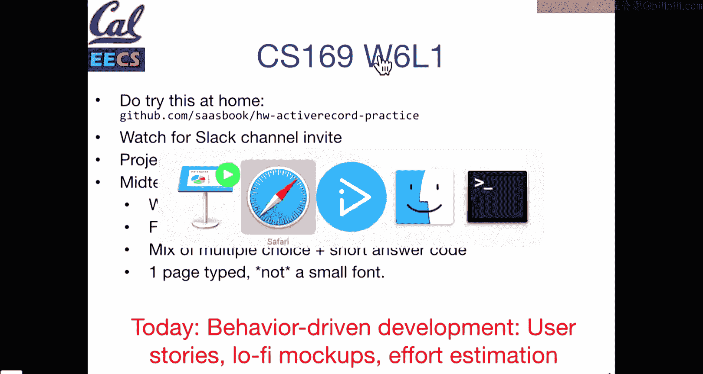

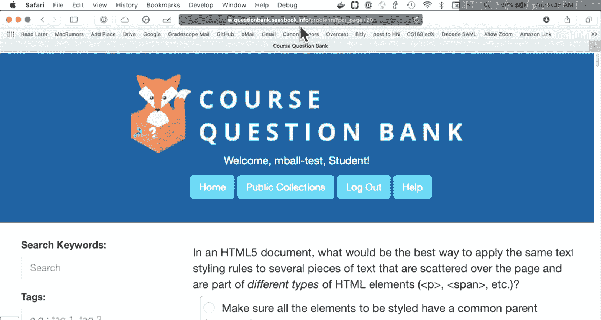

这里有一个GitHub仓库的链接，它被列为一项作业。但它不是一项指定的作业，而是类似于之前作业的ActiveRecord练习。它包含了测试用例，并以作业的风格设置，但不会被评分。这只是一个可用的资源，作为ActiveRecord入门的有效练习。

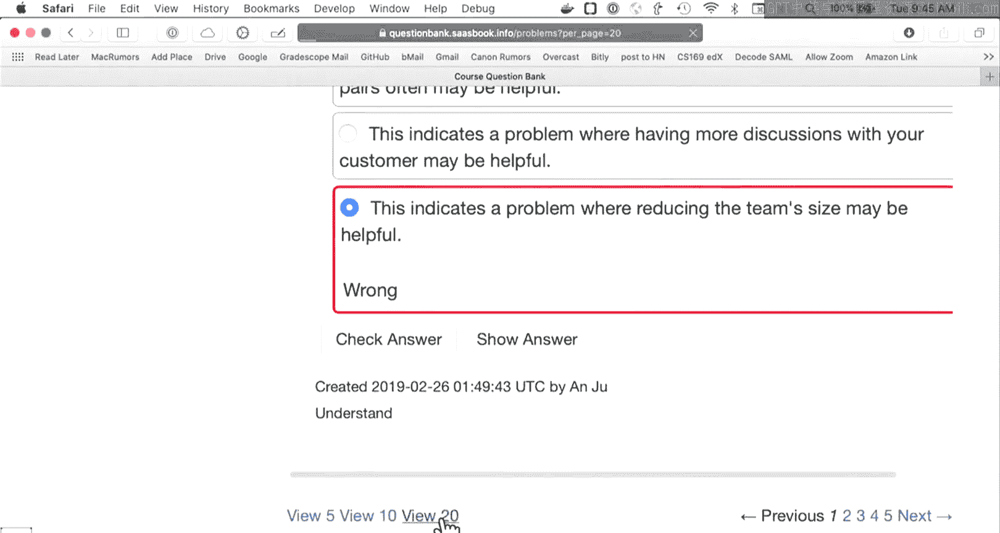

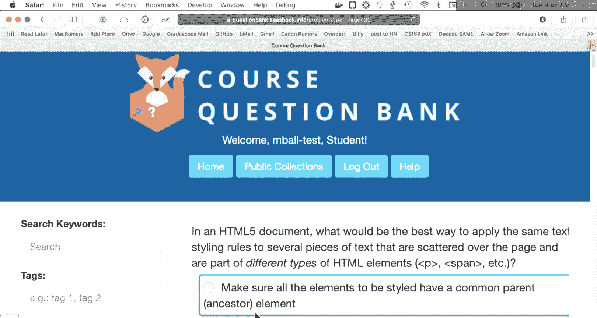

到目前为止，你在课堂上已经接触过一点ActiveRecord。在开发Rails应用时，ActiveRecord要么是你的朋友，要么是你的敌人。你肯定希望它是朋友，因为它是Rails中非常关键的一部分。人们常说，正是这些东西让Rails成为Rails。它是你与数据库交互、获取和存储构成应用独特性的对象和数据的接口。

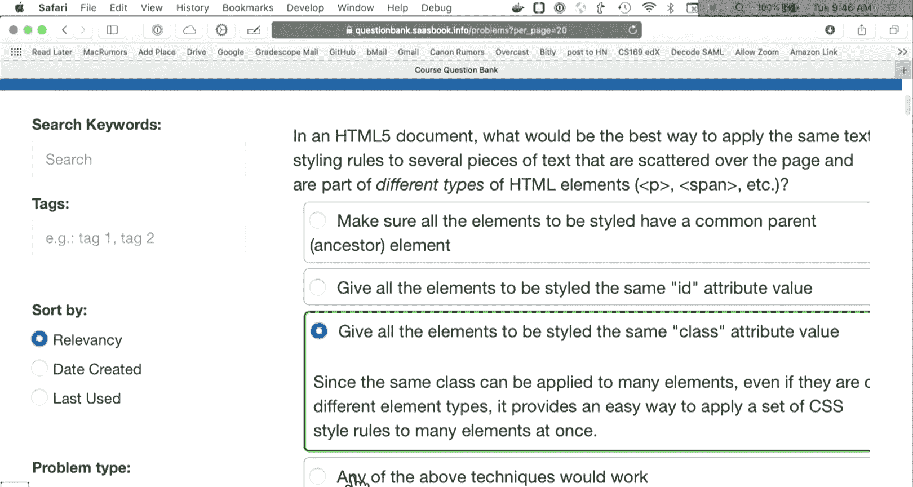

请查看这个仓库进行练习。这对期中考试也是很好的练习。

期中考试是下一件大事，定于下周二。本周会发布一些样题。期中考试的形式是两小时的纸质考试，考场信息会在Piazza上公布，初步定在105 GPB。这基本上是一次标准的CS期中考试：包含选择题部分、简答题部分（例如填空、补全代码行），以及一些更开放的问题。肯定会有一道关于Sinatra的题目，比如“补全这个Sinatra应用的方法”。还会有一些观点性问题，例如“这个说法是否有意义？请证明你的答案。” 你可以带一张双面笔记，但不能使用过小的字体，也不能带放大镜。如果需要，对于ActiveRecord等问题，我们会提供必要的背景信息或方法说明，不会要求你死记硬背Ruby语法细节。

我们还会发布一个Google表单，让大家提交选择题和简答题的建议。这个想法是，当你在复习时，如果想到一个关于课堂内容、作业或讨论部分的公平或有趣的评估问题，可以提交上来。表单可能在周五左右关闭，然后我们会发布学生提交的问题集。我们会挑选一部分，并调整和澄清措辞，使其对所有学生都有意义。提交问题不保证会被采用，但有机会出现在期中考试中。如果你的问题被选中，你将获得一个额外加分，因为你为学习和帮助同学复习做出了贡献。

在资源列表上，我们会在Piazza上发布一个链接。这是一个由历年CS 169学生构建的应用。链接是 `questionbank.saasbook.info`。你用GitHub登录后，会有一些课程助教设置的额外私有题目，但公开部分已经有超过100道选择题可供学习。我们不会直接选用公开题目，但你可以搜索这些题目。它们目前组织得不是特别有条理，但这将是一个可用的学习资源。除了样卷，我们也会提供这个。由于这是CS 169的内容，其中大约50%的题目可能涉及我们尚未讲到的内容（因为这是期中考试1），但作为学习材料是可用的。

## 项目与团队协作 🚀

本课程的一个重要组成部分是项目。我们将在本周晚些时候提供所有项目选项的列表。根据时间安排，你们团队将对这些项目进行投票。从下周或下下周开始，你们将正式开始与客户会面。选择项目后，我们会提供客户联系方式，你们团队需要主动联系客户、安排会议。我们会提供一些关于会议如何进行等的框架。

项目将很快启动。作为其中一部分，我们将使用一个全班级范围的Slack。你们将在接下来的一周左右收到邀请。每个团队将有一个频道用于团队沟通。我们要求你们使用这个平台进行团队沟通。在这个Slack中，我们会设置一些自动化工具，用于检查进度和报告。这样做有两个目的：一是拥有一个集中的团队沟通场所非常有用；二是在“现实世界”中，Slack现在是这类工作的实际标准应用，其集成功能对构建软件至关重要。稍后我会在Piazza分享一个几年前的很棒的演讲，名为“Github如何用Github构建Github”，其中讲述了他们如何利用聊天和其他工具来构建现代软件。我们不会完全照做，因为我们的应用没有Github那么复杂，但这能提供一些关于团队协作和信息访问的思路。请留意相关信息。

## 行为驱动设计与用户故事介绍

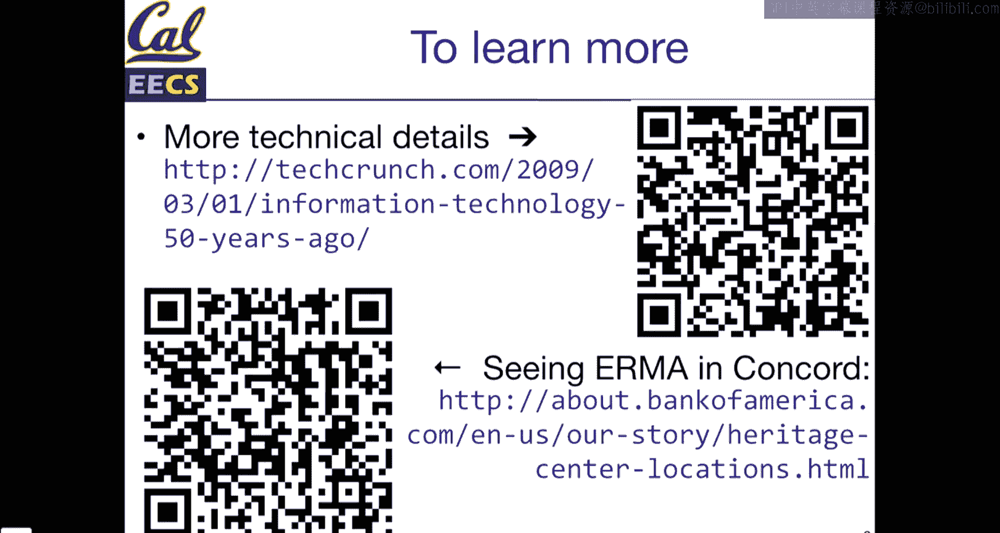

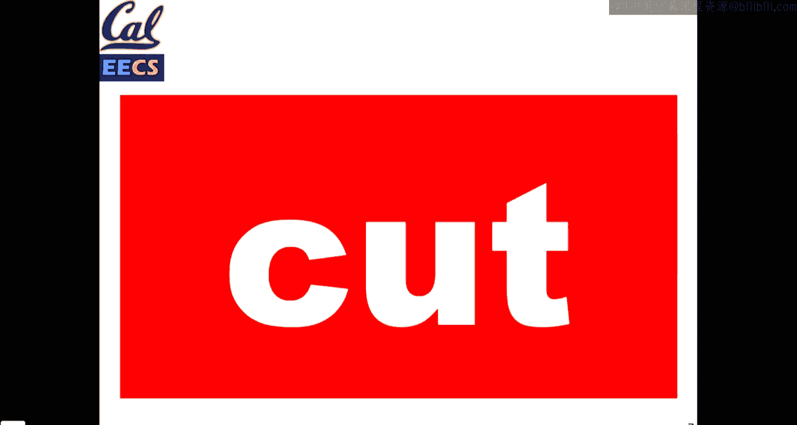

讲完这些通知，今天开始的内容是关于如何开发你们的项目。今天没有现场演示，主要是一些开发实践，可以说是偏“软技能”的一面。其中一些内容可能看起来显而易见，但可以保证在实践中是困难的。

Armanda Fox有一些“计算机历史时刻”。这一个很有趣，它展示了软件的悠久历史。这是一张1950年代的支票，恰好是美洲银行的。支票上缺少什么？如果你没写过支票也很正常，因为现在很多人甚至不再写支票了。这张支票缺少几样东西。一个是什么？可以大声说出来。是的，缺少备注栏。这确实缺失了，但不是最重要的缺失项。路由号码？是的，路由号码，还有账号。在1950年代计算机化之前，没有银行分行的概念。你兑现支票时是去当地分行，或者邮寄到当地分行。当时美洲银行作为一家公司存在，但所有业务都在本地处理。这就是为什么有时别人问你要银行地址时，他们仍然想要一个具体的本地地址，这有点奇怪，因为现在填写表格时，我的银行地址可能在几百英里外。但在1950年代，这很重要。

美洲银行当时是一家大银行，他们提出了一个名为ERMA的系统（电子记录机器会计）。在50年代，他们聘请了SRI（斯坦福国际研究院）。如果你听说过Siri，这个名字实际上源于一个SRI项目，他们想以团队命名，所以加了一个“i”变成了一个名字。SRI与美洲银行合作提出了这个演示系统，并在接下来的大约10年里，美洲银行构建了原型并投入生产。仅仅几年后，美洲银行所有的支票账户会计都通过这个系统处理。考虑到在1960年代建立和维护计算机所需的巨大努力，这个时间相对较短。后来在60年代，它们被IBM 360取代，我们稍后会在另一个计算机历史时刻中谈到IBM 360，它本身也是计算技术的一个里程碑。

从ERMA系统中诞生的一项技术是MICR（磁墨水字符识别）。今天我们可以很好地对手写体进行OCR识别，邮局一直在使用。但他们当时想出的办法是：我们希望自动将支票路由到正确的地方。于是就有了路由号码。最初只用于美洲银行，但现在你可以在所有支票上看到。这个想法很有趣：当时没有光学字符识别的方法，但如果使用磁性墨水（墨水中有铁微粒），他们创造了一套数字，这些数字人类可读，但当磁头扫描时，每个数字都有自己独特的磁信号特征。你会注意到“1”有一个大墨点，但大体上仍能看出是“1”，“4”在某些地方很粗，“8”也是。他们创造了这种数字格式。50多年后的今天，它仍然存在于支票上。这些墨水仍然是磁性的，这意味着你不能随便在家打印支票。你去银行拿到支票簿或现金支票时，使用的是特殊墨水和专用打印机来正确编码。不过今天，随着移动存款的出现，我们已用更智能的计算机取代了磁性识别部分，但相同的东西依然存在。如果你感兴趣，有一篇很酷的《连线》文章讲述了这段历史。美洲银行在康科德有一个很大的次级总部，那里还保存着一台ERMA设备。当然，它不再运行了，但如果你在康科德地区，可以去看看。

这就是计算机历史时刻。同样，我们只是偶尔讲讲这些，不会考试，但仍然是关于计算创新长尾的有趣事情。

## 行为驱动设计与用户故事详解

今天的内容是行为驱动设计和用户故事。这里的核心思想是：我们可以使用哪些工具和流程来确保工作成功？当我们谈论敏捷时，我们实际上是在谈论利益相关者。对你们来说，就是你们的客户，他们将提供反馈和方向。你们应该期待与客户进行多次（如果可能的话）面对面会议，或者至少是视频会议，并在课程期间保持频繁的电子邮件沟通。这些客户也可能是你们公司内部应用的用户，可能是其他开发者，也可能是商业智能团队等。

我们希望以短迭代周期工作，快速交付反馈，展示产品进展，然后获得更多反馈。我们将进行为期两周的迭代，这对本课程的时间安排很重要。

如果你上过用户界面课程（如CS 160），或者参加过像Berkeley Innovation这样的社团，你可能听说过行为驱动设计或行为驱动开发。其思想是，在开发之前和期间，我们要询问我们的应用应该做什么。重点不在于说“这个用户模型是否正确返回了用户的注册日期”或“是否正确计算了用户登录次数”这类具体实现，而在于我们能否在高层面上决定应用应该做什么。行为驱动开发不一定能证明我们的应用做了正确的事（这很难），但它会尝试验证我们遵循了正确的流程。

我们将通过用户故事来实现这一点。用户故事会以两种形式体现：手写或打字的用户故事，以及我们将把它们转化为可运行的、看起来很像英语的测试用例。用户故事旨在轻量级。用户故事是对应用应该做什么、影响谁以及应用于应用的哪个部分的高层描述。这里的关键是，我们始终讨论的是行为，而不是实现。你可能听说过测试驱动开发，它与行为驱动设计密切相关，但行为驱动的重点在于实际的设计、用例和应用应该做什么，而不一定是它实际做了什么，更重要的是，绝对不是它如何工作。当我们编写测试用例时，它们将是高层次的，例如“我应该登录页面，然后应该看到我的用户名的确认信息”。BDD不会验证你的实现，也不会要求特定的实现，但它会帮助你组织实现。

这是我们反复出现的进度幻灯片。今天我们将讨论与客户沟通的内容，稍后在讲座中会讲到线框图。本周晚些时候，我们将重点讨论用户故事，并接触Cucumber，这将是DX作业的一部分。然后最终，我们可能在下周期中考试后，开始使用Pivotal Tracker和将应用部署到Heroku。我们将在接下来两周内完成整个流程。提醒一下，在这个过程中，我们会反复讨论遗留代码和设计模式等内容。

## 用户故事的结构与示例

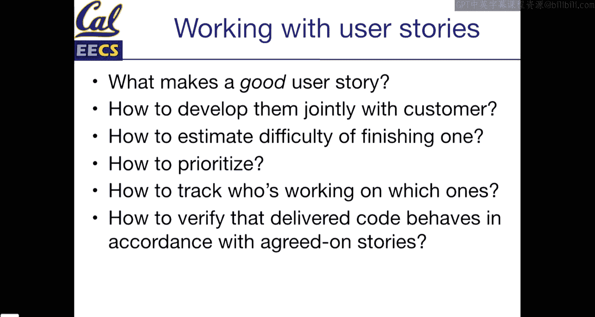

这是一个非常简单的用户故事。这是一张3x5英寸的索引卡。如果你能弄到一叠索引卡，它们是完美的工具，我们稍后会解释原因。用户故事有一个标题：“添加电影”。内容如下：“作为一个电影迷，为了能与他人分享电影，我希望将电影添加到烂土豆数据库。” 用户故事很短，只有几句话，可以写在一张3x5卡片上。它们不仅是你的团队编写的，而且是与客户协作编写的。重点是，你将与客户一起明确他们希望发生什么。

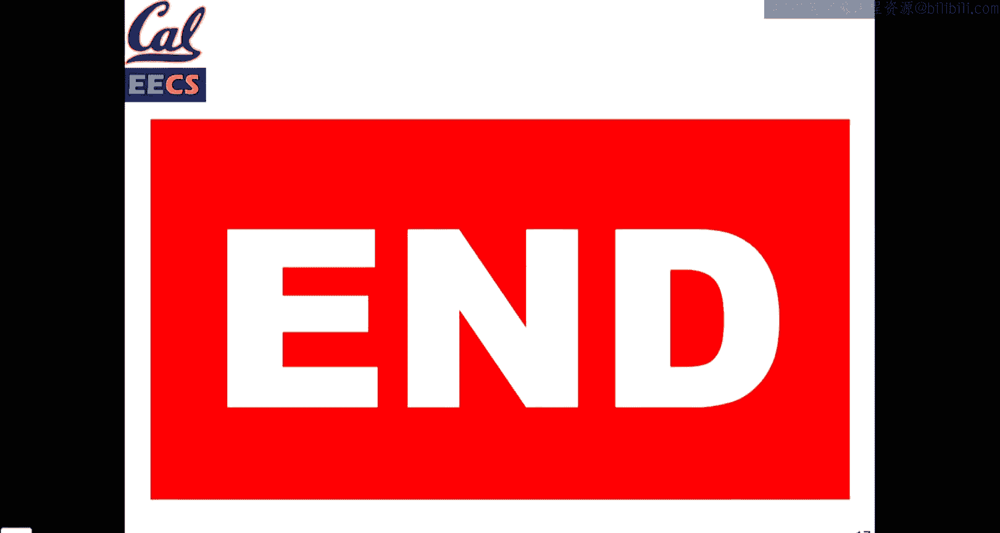

这里有几点需要说明。它们有一个好名字，有几个步骤。你可以按任何方式排序，但这是三个基本组成部分：
*   **作为 [谁]**：使用这个功能的人是谁？是你的应用客户、最终用户、管理员、财务人员，还是审查合规性的审计员？根据你的应用，用户角色可能影响不大，也可能完全改变类似功能的性质。
*   **以便 [为什么]**：这个功能的目标是什么？我们为什么需要这个功能？这将提醒你不仅仅是功能的“是什么”，还有“为什么”。当你从客户会议转向实际实现时，你需要参考这个“为什么”。客户不会指定应用工作的每一个细节，但“为什么”会帮助你在实际编写代码时做出决策。
*   **我希望 [做什么]**：这将是实际应该发生的主要事情。

当然，这只是措辞的框架，你可以根据需要进行调整。这里的想法是，你应该能够拿一个用户故事交给客户，或者交给质量保证团队，他们应该能够阅读这些步骤，测试应用程序，并确认它是可接受的。“可接受”意味着我阅读了描述，并且应用行为与之匹配。

这是一个来自AppFolio的真实例子。在现实世界中，这些通常也使用便利贴，取决于规模。例如：“作为项目经理，我希望每月获得准确的信息系统账单，以便我知道我欠了多少钱。” 这个结构略有不同，但它包含了用户是谁（项目经理），它属于“业务集成”列，所以我们知道它适用于哪个团队，他们需要什么（提供准确账单的工具），以及为什么（作为项目经理，知道欠款很重要）。如果我们问为什么账单重要？因为他们不希望工具被停用。为什么不想被停用？因为如果业务工具离线，可能会严重干扰业务。

## 为什么使用3x5卡片？📋

为什么使用3x5卡片、便利贴或类似大小的东西？它们简短但易于处理。这源于HCI（人机交互）研究的一般理念。如果你做过参与式设计或用户研究，你会在很多其他形式中看到这一点。关键的一点是它们是实体的、“离线”的。这很重要，因为你可以拿起笔和纸，这是一种没有威胁性的方式。它不是网页上有很多表单的文本框，你不会“写错”。如果你听说过关于Jira的笑话，Jira是一个非常强大的软件，但根据配置方式，它有时会显得非常令人生畏，会出现很多红色错误信息。因为3x5卡片是非电子的，它不会说“嘿，你写错了”。但可以保证，你用来构建软件的工具有时会告诉你“嘿，你做错了”。因此，在与利益相关者合作时，这是获得反馈的重要一环。

当你试图以某种方式组织故事时，小而实体的东西可以成为重新排列它们以提供某种结构的非常有用的辅助工具。我们将讨论如何确定工作优先级这个反复出现的主题。如果你有一叠3x5卡片，一件好事就是把它们摊在桌子上，开始将它们排列成不同的部分，例如“这可能是迭代0”、“这个可能依赖于用户模型的存在，所以这可能是迭代1的故事”。你可以很好地进行物理布局。这就是为什么便利贴是非常常见的东西。有些团队如果有白板，会使用磁性白板卡片；有些人如果使用墙壁，就直接用胶带贴上去。你希望利用实体工具的优势。

它们也很简短，所以我们不会承诺太多。记住，敏捷的重点不是零文档，而是倾向于在深入文档之前先实现一些东西。一张3x5卡片，如果使用得当，可以给你足够的信息开始构建，但它不是一周的工作量，如果你开始构建后发现这张卡片不对或不够清晰，你也不会觉得是在浪费时间。因此，它们是非常有用的工具。

## 如何制定好的用户故事？🎯

今天我们要回答的问题是：什么是一个好的故事？如何与客户一起制定它们？如何确定它们的优先级？我们将讨论这些。所有这些在某种程度上都是工具，有些在事后看来可能很明显。我们接下来要讨论SMART用户故事，如果你听说过SMART目标，就是由此而来。听起来很容易，但也可以保证，在实践中详细地做这些事情比看起来要难，尤其是当你进入会议，开始有趣的讨论时，你可能会突然意识到花了20分钟讨论是否应该在应用中添加“点赞”功能，或者是否必要。因此，从客户那里获得良好的反馈需要练习。希望我们这里有一些工具可以帮助你。

到目前为止，关于故事、卡片等有什么问题吗？很好，我们打开一个问题进行投票。我们有两个不同的故事和一个简短的问题，没有选项D，但你总是可以选择选项E。

这两个故事是：
1.  **故事A**：作为一个剧院观众，为了能和朋友们一起享受演出，我希望看到我的哪些Facebook好友会参加某场演出。
2.  **故事B**：作为一个售票处经理，为了吸引顾客购票，我希望展示她的哪些Facebook好友会去看演出。

这是两个关于我们观影应用的类似故事。作为我们应用的实现者，我们应该如何对待它们？再花几秒钟，我们将讨论。

大多数人选择了C（将它们视为两个独立的故事）。在某些情况下，关于哪个是正确答案可能有争论。哪个观点更重要？在这种情况下，将它们保持为独立故事的原因是客户。这里有两种客户。如果你是构建应用的人，你有经理和观影者，他们都是你应用的用户。如果你必须偏向一方，观影者可能更重要，因为他们可能是维持影院和应用开发的人。但售票处经理也是一个重要的角色，根据应用的具体结构，他们可能是委托我们开发应用的人，所以我们也要让他们满意。

另一个关键点是，我们有两个不同的用户。一个是售票处经理，一个是观影者。售票处经理可能不关心Sally的特定朋友以及她为什么和Bob、Alice去看电影，但他们可能关心有多少人在Facebook上分享了信息，也许有一些汇总统计数据。因此，每个功能背后的“为什么”和背景是不同的。在开发过程中，可能会有很多共享的开发工作，你可能一举两得。也就是说，为每种用户类型开发的页面可能有80%是相似的。举个具体例子，当你构建Rails应用时，你会有一个视图，很常见的情况是视图会判断：如果是管理员，渲染这个；如果不是管理员或是其他角色，渲染那个信息。在开发时你可能会这样做。

但我认为，总的来说，将这两个作为独立的故事很重要，因为你捕捉了不同类型的信息。当我们稍后讨论交付故事的“速度”时，如果故事相似，交付更多故事并不是坏事，这也是完全可以接受的。

## SMART用户故事 🎯

那么，如果我们有这些指定了用户的故事，如何从中获得最大价值呢？其中一个方法是SMART用户故事。我忘了SMART目标这个短语的起源，但这是一种非常“哈佛商业评论”风格的东西，告诉你应该如何构建事物。这门课有很多缩写，这个希望能帮到你。

SMART代表：**具体**、**可衡量**、**可操作**、**相关**和**有时间限制**。与SMART目标完全相同的词，但用于SMART故事。

如何将它们付诸实践？具体和可衡量是相关的，关键原因是：具体且可衡量的故事会成为可测试的东西。当你与客户合作时，故事越具体、越可衡量，当你离开客户会议三天或一周后，试图弄清楚实际应该做什么，并问自己“这个完成了吗？我是否交付了客户要求的东西？”时，就会越容易。当然，在这个过程中，你会与他们面对面交流并询问。但故事越可测试、越可衡量（部分源于具体性），你就越容易测试它。这包括手动检查你构建的应用是否做了故事所说的事情。

本周四我们将讨论Cucumber（作业4），你将使用Cucumber，这是一种将故事转化为非常人类可读的测试用例的方法。因此，如果你有一个具体且可衡量的故事，随之而来的将是一组看起来与你写下的故事非常相似的Cucumber测试，这有助于简化应用开发。

举几个例子：
*   **“用户界面应该用户友好”**：显然，这是一个愚蠢的例子，因为相反的情况（用户界面不应该用户友好）永远不会成为一个故事。但我可以保证，校园里一些构建学生信息系统的人可能达到了那个目标——它们并不是最用户友好的东西。但“用户界面应该用户友好”的问题在于，我们都希望同意这是目标，但这并没有告诉我们“用户友好”意味着什么，没有告诉我们用户是谁、他们应该如何操作应用，而且“用户友好”也真的取决于用户类型。如果你为幼儿园和一年级学生构建应用，你需要与为成年人构建应用（比如B课程）不同的用户友好程度，或者如果你构建Snapchat并想开发新的滑动界面，这对青少年和千禧一代很棒，但对成年人来说可能一点也不用户友好（这可能是他们的意图）。关键是，你需要明确用户是谁，以及什么对他们来说是友好的。
*   **一个好的例子**是：“给定[某些条件]，当我[做某事]时，那么[其他事情]应该发生。” “给定”、“当”、“那么”实际上将是你经常在Cucumber规范中使用的三个关键词，你也可以在手写用户故事中使用它们。设定一些条件，指定应该发生什么，然后接下来应该发生什么，这给了你一种衡量方式。例如：“给定我是一个新用户，当我注册这个应用时，我将在收件箱中看到一封确认邮件。” 这是一个相当常见的新用户流程用户故事：我注册，得到一些确认。你可以将其转化为测试用例，验证当你以新用户身份运行注册流程时，去检查邮件并看到确认信。

**另一个例子**：“给定电影票可用，我应该能够购买一张票。” 这个很接近，但它并不总是告诉你用户是谁，也不一定帮助你说明接下来应该发生什么。电影票可用，我应该能够买票。然后呢？是的，你应该能够买票，因为如果不能买票，你的影院就倒闭了。但关键点是，接下来应该发生什么。这个例子更具体，但不一定是可衡量的，因为它没有指定你应该如何买票。提醒一下，其中一些事情在“什么对你和客户最有帮助”方面会有点模糊。但你越具体，这些故事在一两周后你去构建时就越有帮助。

**可实现的**：这里的目标是每个故事应该是你可以在一个迭代中完成的东西。我们进行为期两周的迭代，并且我们意识到你们还有两门、三门或希望不是四门其他课程。所以你们不会在两周内做40小时的软件开发，而是在一个项目上做两周的兼职工作。如果你以前有过实习经历，你在CS169一个迭代中能完成的工作量与你暑期实习两周能完成的工作量是不同的，因为时间没那么多。

如果你不能在一个迭代中交付，如果你拿到一个故事……以亚马逊为例：“给定我是亚马逊的客户，当我搜索一个产品时，我应该能够购买并将其添加到购物车。” 这涉及到很多步骤，它可能是一个故事。它可能具体，可能可衡量。你可以搜索并将产品添加到购物车，但这将是一个巨大的故事，无法在一周或一个迭代中完成。所以你应该将一个故事分解成多个子故事。分解的最佳方式取决于具体的故事。但将故事分解成更小的具体组成部分没有坏处，然后后来意识到你完成了比计划更多的故事。所以，倾向于选择你更有信心可以实现的小故事，而不是几个你不确定的大故事。

这里的目标是，“可实现的”也意味着在这个故事结束时，你有一个已经编写了代码的功能，有该代码的测试用例，有一个将代码合并到主仓库的拉取请求，并且该拉取请求已被合并和部署。你的故事越小，你就有越多的时间来完成所有额外的步骤。在这个过程中你也会学到，编写初始代码相对容易，而所有关于代码审查、测试、验证工作是否正确的过程则比较耗时。可以告诉你，每家公司都会花费大量时间测试和验证他们内部关于代码审查和测试的处理流程，因为这很难做好，而且不一定有一个正确答案。作为一个团队，你们也会学到这一点。再次强调，目标是你应该每个迭代完成多个故事，但这真的取决于范围。如果你分解它们，你更有可能完成整个用户故事。如果你不能完成一个完整的用户故事，那真的说明它太大了，或者可能出了其他问题。如果发生这种情况，你的GSI会与你的团队沟通。但从小故事开始，完成更多故事，仅仅能够说“我完成了一个故事”所带来的多巴胺冲击也是一件非常好的事情。你的小故事越多，你就越能感觉到进步和完成。

## 深入挖掘“为什么” 🔍

因此，当你尝试设计故事时，一个技巧就是不断问自己“为什么”。很多人说你应该问五次，取决于这些“为什么”能深入多少层，五次可能足够了。例如：“作为一个售票处经理，为了吸引顾客购票，我希望向他们展示他们的Facebook好友列表。” 为什么我想这样做？因为人们喜欢和朋友一起看电影。为什么这很重要？如果更多人买票，我就能经营更久。在这个例子中，问了两个“为什么”我就大致明白了：好吧，对售票处经理的商业案例来说，赚钱很重要。有时从故事中就能很清楚为什么重要。但总是可以随时与客户交谈并说：“为什么这很重要？” 你可以让他们知道：“我们正在制定用户故事，我们一起合作这个流程。所以我会问你一些问题，有时可能看起来是显而易见的问题，但我没有你所有的背景信息。所以我会问你五次为什么，我们一起完成这个过程。” 这样你就可以真正让客户参与进来。

## 时间限制 ⏳

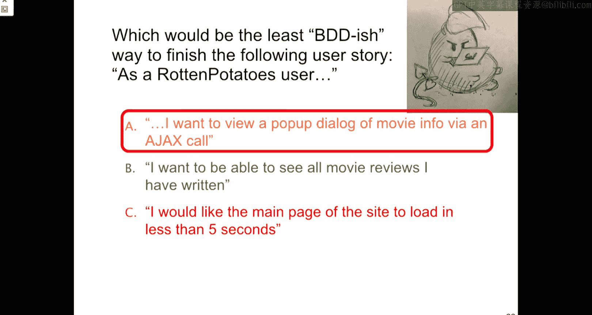

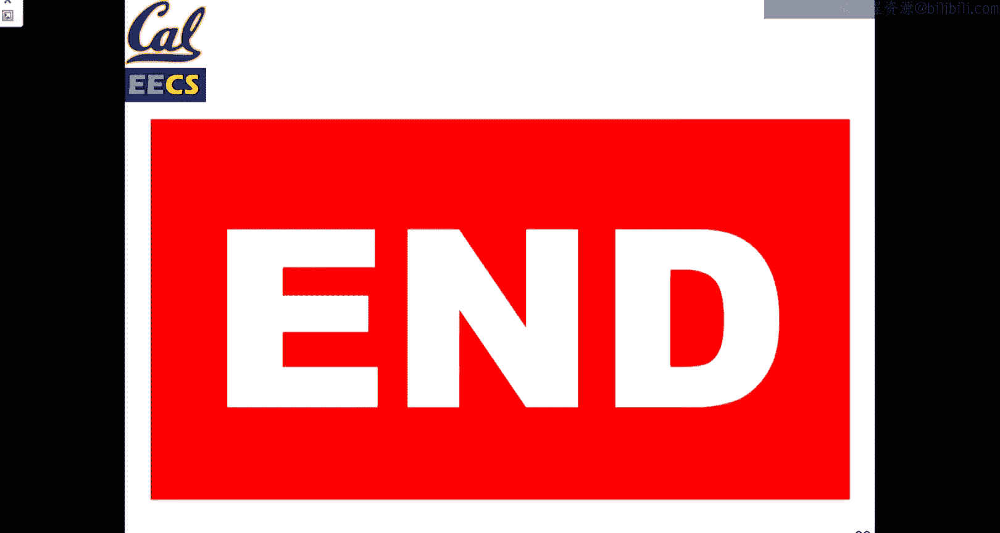

对于故事来说，重要的是你能够完成它们。这与“可实现的”相关，但也重要在于，你不仅要知道一个故事太大可能无法实现，还要知道何时停止在一个故事上工作。当我们谈论预算、软件开发成本时，我们通常指的是完成事情所需的时间。有一件事会发生，而且会发生在每个人身上，我敢打赌它可能已经发生在你CS 61B的项目上：你开始做某事，结果花费的时间比你预期的长五倍。所以，一件事是为一个故事设定一个目标，说我们应该能在一定时间内完成，如果在那个时间结束时事情没有达到预期，我们需要重新审视这个故事。这会发生，希望不会一直发生。这是可以预料和理解的。那时的目标就是说，这件事花了太长时间。我如何将这个功能分解成多个更小的故事？我如何学习我之前不知道的东西，以便在合理的时间内完成这个故事？一般来说，目标应该是避免低估一个故事的时长。特别是当你与客户合作时，你希望少承诺、多交付，你永远不想多承诺、少交付，因为那只会让人感到不快。试着给自己留一些余地，估计事情可能需要多长时间。本课程一个故事的典型时间限制当然是一个迭代。

稍后，我们将讨论“速度”这个度量，它只是一个数字，可以帮助你衡量在一个迭代中能完成多少工作，并基于故事的大小。这将帮助你避免低估难度。所以，一旦你构建了几个故事，你就会对下一个故事需要多长时间有感觉。

## 低保真线框图与故事板 🎨

我们现在所处的位置是，我们已经将低保真线框图放入了构建软件的步骤中。这是我们希望你们能够做的事情。当我们谈论“低保真”时，我们真的是指非常低精度的东西。

构建成功的用户界面很难，大型团队会投入大量精力。因此，从0到漂亮的用户界面是一个巨大的飞跃，你不应该试图在一个迭代中完成，这是一个持续改进的过程。因此，当我们与客户合作决定最高层面应该发生什么时，低保真线框图将是一个非常重要的工具。

我们如何知道应该开始构建什么？低保真线框图将是构建原型的第一步。这里的目标是真正避免出现“我说了，但不是我要的”这种情况。用户会说他们想做某事，你去构建它，然后他们说：“嗯，这不是我想要的。” 低保真线框图是打断这个过程、获得更清晰愿景的一种方式。它们介于3x5用户故事和实现之间，是你们的第一步。

如何在不构建原型的情况下做到这一点？这是教科书中的一个例子。我们有一个电影页面。低保真线框图只是在纸上画一个非常简单的草图。如果你有iPad或Surface配笔，有一些非常棒的应用可以让你画草图并提供一些结构，你完全可以自由使用。但就本课程而言，我们真正鼓励你们做的就是拿一张纸画草图。它可以是白板，然后拍张照片发给客户。

这里发生了什么？我们可以看到这个页面上没有直线。字迹实际上相对清晰，这很好，如果你字迹潦草也不用担心。低保真线框图不是为了赢得任何绘画比赛。事实上，如果你的低保真线框图有非常漂亮的背景阴影和渐变，它们可能保真度不够“低”，它们应该是一个非常粗略的草图。但我们这里有足够的信息说这看起来像一个网页，有一个标题，底部有一个“保存”按钮，还有一个带一些字段的表单。通过看这个，我们对可能发生的事情有了感觉。这是你在思考需要什么、应该发生什么时，几分钟内就能画出来的东西。

这是页面的一个例子。你们要做的就是为每个故事，草拟一页线框图的样子，思考哪些是基本信息。它没有说明你应该使用什么字体，没有说明应用将采用什么配色方案，甚至没有像“这个应该以X、Y或Z方式对齐”这样的细节，或者“当我点击这个时，会有这个动画或弹出窗口”。所有这些你将在应用中构建的东西，你会随着时间的推移而完成。但对于低保真线框图，我们寻找的是非常简单的草图。

我们将把一堆低保真线框图转化为故事板。故事板实际上只是一组带有各种交互形式的场景。例如，我们从这里的“添加到电影数据库”页面开始，这里有一个按钮。然后我们从这个按钮画了一个箭头到另一个低保真线框图。如果你只是在一个屏幕上展示这些，你可以拍张照片并在上面画箭头。如果你与用户合作，一个对原型设计非常有效的技巧是：展示这个页面（这在面对面时效果更好，但也可以在Google Hangouts上模拟），说“点击这些步骤，看看你要做什么”。当他们点击保存按钮时，你将展示的线框图切换成这个页面，即他们刚创建的电影的详细信息视图。这样，在制作原型时，他们会说“我要点击这里”，然后你说“好的，当我们构建应用时，现在会向你展示这个。这有意义吗？” 他们会说：“是的，有意义。当我保存一部电影时，我应该看到我刚创建的东西。” 然后你可以有其他引入更多复杂性的视图。你可以说：“哦，这是详细信息视图。” 然后问他们：“当你点击这里时会发生什么？” 使用低保真线框图的好处是，你实际上不需要构建任何东西。当他们说“我可以点击这里”时，他们可以给出一个非常粗略的理由，因为你们是聪明人，你们可以说：“是的，那将对应这个页面”，甚至在构建任何东西之前。有些人常用的一个工具是PowerPoint，它是制作中等保真交互原型的绝佳方式，但它们比只是简单画草图、通过移动纸张来切换要花费多得多的精力。

这是来自AppFolio的另一个例子，这是几年前的了。他们有一个白板，上面画了很多故事和例子。这是一个设计团队为某个账户管理屏幕构建用户流程的真实例子。这里的细节不重要，但对于实践敏捷设计的公司来说，你也会经历这个过程。所以，这在现实世界中也会发生。这些又是非常基本的屏幕，只是草图，不是整齐的方框，上面只是普通的笔迹，还有很多箭头和注释来说明应该发生什么。这就是低保真线框图真正需要的全部。

“低保真”中的“低”很重要。这里重要的是，一旦你有了低保真线框图，你就有能力将其转化为HTML。当你看到那个表单时，你已经回答了一堆问题：我需要电影标题，我需要表单元素。在Rails中，这很好，因为它们给了你一堆辅助方法来生成这些表单。你有了开始的基础。你的低保真线框图不会指定你应该如何设计样式，但这很大程度上取决于你和你的客户。再次强调，我们在这里寻找的是功能性的应用，而不是最漂亮的应用。但我鼓励每个人都去使用Bootstrap，添加一些非常基本的CSS样式，如果有时间可以自定义，但我们在这里寻找的是可用的、功能性的东西，而不是超级漂亮的东西。

根据过去学生的反馈，低保真线框图和故事板在与客户合作时非常有帮助。频繁的客户反馈至关重要。请记住，你可以非常快速地将低保真线框图交给用户。你会开会，然后与队友讨论，说“我认为我们应该这样做”。然后你可以画点东西，拍张照片，通过电子邮件发给客户，说“这是我们的想法，你觉得怎么样？” 他们会说“很好”，或者说“实际上，既然你给了我更清晰的画面，我认为我真正需要的是这种工具或其他东西”。如果你只投入了五分钟的工作，而客户想改变方向，那也只是你投入的五分钟，而不是五小时。所以，你能用更少的时间学到越多，就越好。

## 学生反馈与总结

需要强调这一点，我认为这是非常关键的一点。有学生反馈说：“我们做了高保真原型，投入了大量时间，结果才发现客户不喜欢。” 提醒一下，你们会希望东西很漂亮，因为我们使用的应用都投入了数百万美元的开发。即使是获得风投的小型初创应用，甚至是不太好的应用，也投入了数百万美元的开发才达到一个不太好的状态（这可能更多地说明了开发过程）。但要抵制第一次就追求完美的冲动。

另一个提醒是：“从未意识到将客户描述转化为技术计划如此具有挑战性。” 这是你们在构建软件时会继续学习的东西。我上了这门课，了解到它有多难。我去用Grscope构建软件，你仍然会学到它有多难。和这里其他使用Grscope的助教聊天也真的很有趣，我们会聊一个小时，仍然不知道正确的事情是什么。所以，这只是一个持续的提醒：你越能练习尽早获得想法和反馈，效果就越好。你们不会被期望拥有所有正确答案。你们都会遇到构建了东西但客户不喜欢的情况。那会是一种糟糕的感觉。没关系。接受你已有的，并从中学习。我构建了某个东西，客户不喜欢。我能做些什么来让这个过程变得更好？

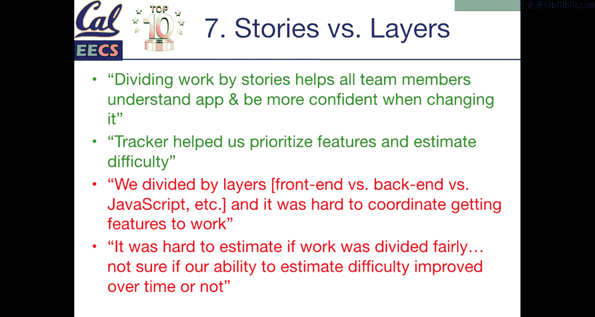

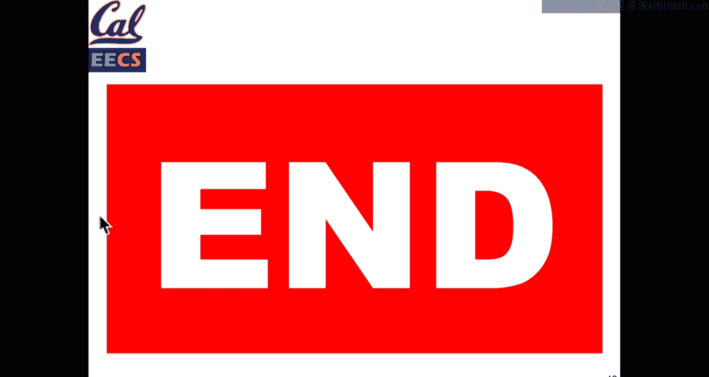

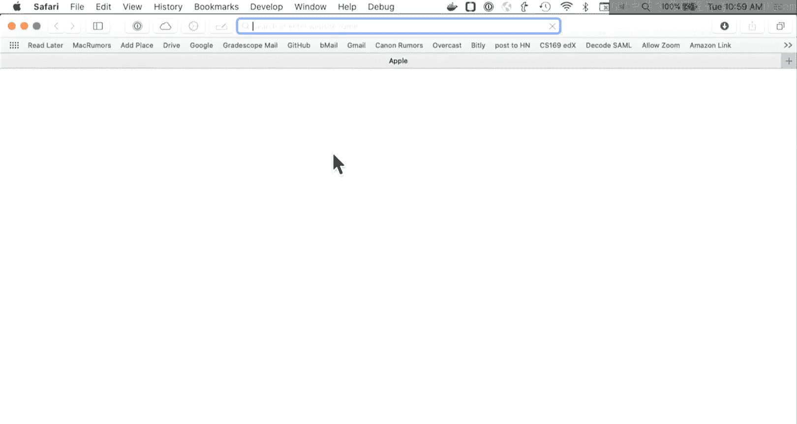

## 课程总结

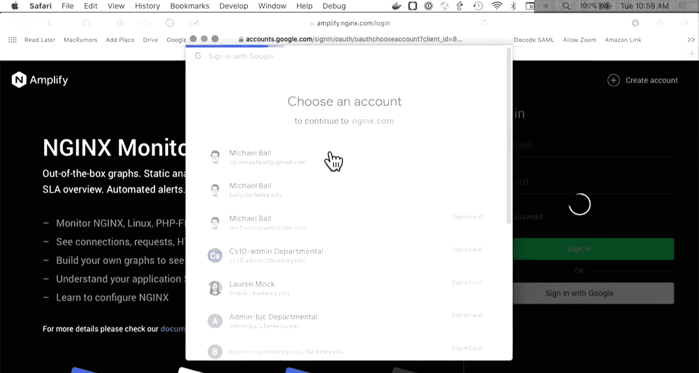

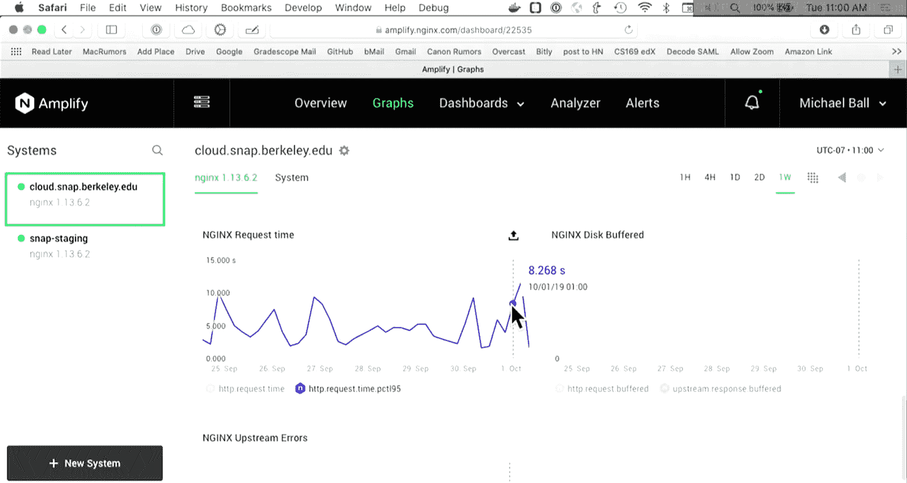

在本节课中，我们一起学习了行为驱动设计（BDD）和用户故事的核心概念。我们了解了如何将客户需求转化为具体、可衡量、可操作、相关且有时间限制的SMART用户故事。通过使用3x5卡片和低保真线框图，我们掌握了与客户有效沟通、快速验证想法的工具，从而避免在错误方向上过度投入。这些实践将帮助你们在接下来的团队项目中，更系统、更高效地进行需求分析和迭代开发。