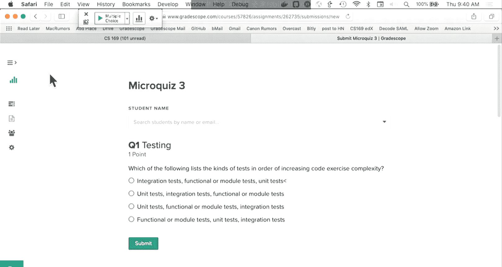
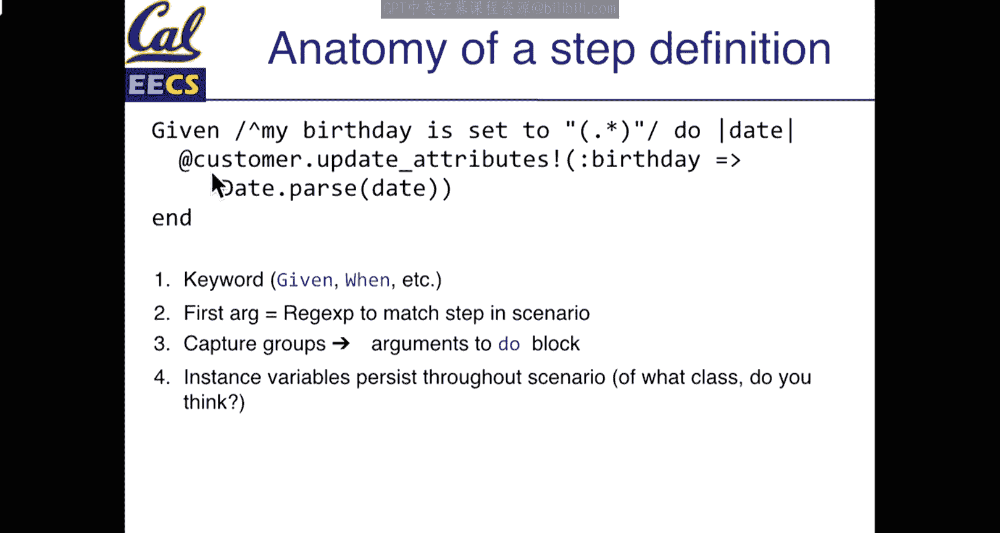

# 010：故事点、速度与Cucumber测试





在本节课中，我们将学习如何将用户故事转化为可执行的任务，并使用敏捷开发中的“故事点”和“速度”概念进行工作量估算与进度管理。我们还将介绍Cucumber和Capybara这两个强大的工具，它们能将用户故事直接转化为自动化测试，确保软件功能符合客户预期。

## 故事点与速度估算

上一节我们讨论了如何从客户那里收集需求并编写用户故事。本节中，我们来看看如何为这些故事估算工作量，并规划团队的工作节奏。

### 故事点的作用

故事点的目标是帮助我们估算生产力。它们帮助团队衡量在两周的迭代周期内可以完成多少工作，并有助于与客户沟通可交付的工作量，避免过度承诺。同时，这也是一个练习如何估算工作量的过程。

### 如何估算故事点

故事点是任意值，没有单位。在本课程中，我们推荐使用一个简单的尺度：**1, 2, 4, 8**。这个尺度类似于T恤尺码（XS, S, M, L）。

*   **1点**：大约相当于半天的专注编码时间（3-4小时）。
*   **2点**：大约相当于一整天的专注编码时间。
*   **4点和8点**：代表更复杂、不确定性更高的工作。我们应尽量避免出现8点的故事，如果遇到，通常意味着需要将其拆分成更小的故事。

估算时，团队应一起进行。推荐的方法是“计划扑克”：每个成员独立估算一个故事的点数，然后讨论差异。**如果估算值存在差异，应选择较高的那个值**，因为认为需要更长时间的人可能预见到了其他人忽略的难点。

### 什么是“史诗”？

当一个故事太大，无法在一个迭代内完成时，我们称之为“史诗”。史诗是一个共享功能的较小故事的集合。例如，“用户可以通过任何第三方服务登录”可能是一个8点的史诗，可以拆分为“通过Facebook登录”、“通过Google登录”等独立的故事。

### 理解“速度”

速度是一个速率，表示团队在单位时间（如每周或每个迭代）内平均能完成的故事点总数。公式可以表示为：
`速度 = 已完成的故事点总数 / 迭代周期数`

速度的目标不是衡量团队的“快慢”，而是帮助**团队内部**建立一致的工作节奏和预测能力。不同团队之间的速度**无法直接比较**。

### 如何拆分大故事：使用“刺探”

当你面对一个不确定如何实现的大故事时，可以进行一次“刺探”。刺探是指分配一个固定的时间盒（例如一天），用于快速构建一个粗糙的原型或进行研究，目的是探索未知领域。**刺探结束后，代码通常会被丢弃**。它的价值在于获取信息，以便更准确地将大故事拆分为可管理的小故事。

## 使用Pivotal Tracker进行项目管理

了解了如何估算故事后，我们需要一个工具来管理这些故事和整个工作流程。我们将使用Pivotal Tracker。

### Tracker界面与工作流

在Tracker中，故事从左到右推进，代表从开始到完成的流程。

*   **冰盒**：最右侧的列。存放尚未确定优先级或未开始的故事，用于记录任何初步想法。
*   **待办列表**：中间的列。存放已确定优先级并估算好点数的故事，它们已准备好被领取开发。
*   **当前工作**：最左侧的列。存放团队当前正在积极开发的故事。

团队应始终保持**当前工作列中有3到6个活跃的故事**（假设6人团队进行结对编程）。待办列表顶部的故事是下一步应该开始工作的故事。

### 故事状态周期

一个故事在Tracker中会经历以下状态：
1.  **已创建** -> **已估算**（团队分配故事点）
2.  **已确定优先级** -> **已分配**（产品负责人分配给具体开发者或结对）
3.  **已开始** -> **已完成**（代码编写、测试通过、代码审查完成）
4.  **已交付**（代码已合并并部署到测试或生产环境）
5.  **已接受**（客户验证功能符合要求后确认）

**只有客户（或代表客户的产品负责人）可以“接受”一个故事。**

### 团队角色：产品负责人

在敏捷开发中，**产品负责人**是一个关键角色。在本课程中，这个角色将在团队成员间轮换。产品负责人负责：
*   在团队会议上代表客户的声音。
*   主持故事点估算会议。
*   根据客户反馈确定待办列表的优先级。
*   将故事分配给开发成员。
*   最终与客户确认故事完成并点击“接受”。

## 使用Cucumber和Capybara编写验收测试

现在，我们有了清晰的故事和开发计划。本节我们将学习如何将这些用户故事转化为可自动运行的测试，确保开发结果符合预期。

### Cucumber简介

Cucumber是一个工具，它能将用近乎自然语言编写的用户故事（称为“特性”）转化为可执行的测试。它是连接客户需求与自动化测试的桥梁。

### 特性文件的结构

Cucumber测试写在`.feature`文件中。每个文件对应一个功能特性，包含多个场景。

一个基本的场景结构如下：
```gherkin
功能: 用户能够添加电影
  场景: 成功添加一部新电影
    假如 我在首页
    当 我点击“添加新电影”链接
    并且 我在“标题”字段中输入“黑客帝国”
    并且 我点击“保存”按钮
    那么 我应该看到消息“电影创建成功”
    并且 我应该在电影列表中看到“黑客帝国”
```

**核心关键字：**
*   `假如`：设置测试的初始状态和前提条件。
*   `当`：描述用户执行的操作。
*   `那么`：断言操作后的预期结果。
*   `并且`/`但是`：用于连接多个`假如`、`当`或`那么`步骤，使阅读更流畅。

### 步骤定义

`.feature`文件中的每一步都需要用Ruby代码在`step_definitions`目录中实现，这就是“步骤定义”。Cucumber使用正则表达式将特性文件中的文本行映射到这些Ruby方法上。

例如，对于步骤`当 我在“标题”字段中输入“黑客帝国”`，其步骤定义可能如下：
```ruby
当(/^我在“([^"]*)”字段中输入“([^"]*)”$/) do |field_name, value|
  fill_in(field_name, with: value)
end
```
这里，`fill_in`是Capybara提供的方法，用于在网页的指定字段中填充内容。

### Capybara的作用

Capybara是一个模拟用户与网页交互的库。它在Cucumber步骤定义中被调用，可以点击按钮、填写表单、检查页面内容等。它运行在一个真实的浏览器环境（或无头浏览器）中，因此能测试包括JavaScript在内的整个应用栈，是一种强大的**系统测试/验收测试**工具。

### 编写好的场景

*   **测试“快乐路径”和“悲伤路径”**：不仅要测试功能正常的情况，也要测试各种出错情况（如输入无效数据）。
*   **场景应保持简短**：每个场景最好包含3到8个步骤。
*   **描述行为，而非实现**：步骤应描述“做什么”，而不是“怎么做”（例如，用“我应该看到成功消息”，而不是“我应该看到`div#success`元素”）。

## 总结

本节课中我们一起学习了敏捷开发中规划与测试的核心实践。

我们首先介绍了如何使用**故事点**来估算用户故事的工作量，并理解了**速度**作为团队内部节奏指标的意义。我们知道了如何用**Pivotal Tracker**这个工具来管理故事的生命周期，从冰盒到最终被客户接受。

接着，我们探讨了如何通过**Cucumber**和**Capybara**将用户故事转化为可执行的自动化验收测试。这确保了我们的代码不仅能用，而且符合客户描述的行为预期。




掌握这些概念和工具，将帮助你更系统化、更高效地与团队协作，并交付真正满足客户需求的软件。