# 软件工程：011：BDD、Cucumber与客户会议


## 概述

在本节课中，我们将继续学习BDD（行为驱动开发）和Cucumber测试。我们将深入了解Cucumber的步骤定义、Capybara的交互方式，并探讨如何有效地与项目客户进行沟通和会议。课程的后半部分将预留时间进行期中考试答疑。

## BDD与Cucumber测试回顾

上一节我们介绍了BDD的基本概念。本节中，我们来看看Cucumber测试框架的具体实现细节。

Cucumber是一个允许我们以接近英语的方式编写测试的框架。它建立在Capybara工具之上，Capybara负责与Web浏览器进行交互。在开发环境中，整个测试栈连接到一个正在运行的应用副本和数据库。

以下是测试栈的结构：
*   **Cucumber**：管理**特性文件**（.feature）和**步骤定义**（Ruby文件）之间的交互。
*   **Capybara**：自动化与Web浏览器的交互。
*   **Rails应用与数据库**：被测试的实际应用。

周四的课程将深入讲解RSpec，这是一个用于单元测试的工具，它提供了断言和期望的语法。

### Cucumber步骤与正则表达式

步骤定义基于**正则表达式**。你应该在本课程中熟悉它们。虽然我们不会就复杂的正则表达式进行测验，但它们是一项非常有用的技能，建议通过实践和搜索来掌握。

### 与页面组件交互

Cucumber和Capybara提供了与表单字段、按钮等页面组件交互的API，例如 `fill_in`、`find`。随着实践，你会逐渐熟悉这些方法。

核心流程是：编写一个响应特定模式的步骤定义，与页面元素进行交互，然后检查输出结果。

### 场景与步骤定义的位置

以下是关于文件位置的问题解答：

*   **场景**本身位于**特性文件**（.feature）中。这些文件看起来是纯文本，使用 `Given`、`When`、`Then` 等关键字。
*   **步骤定义**位于 **Ruby文件** 中，通常放在 `step_definitions` 文件夹下。

### Cucumber的工作机制

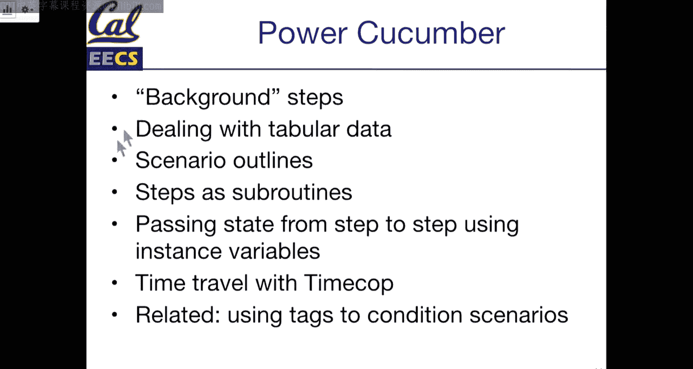


Cucumber是一个管理**特性文件**和**步骤定义**之间交互的框架。它的工作是尝试将特性文件中的步骤与你作为程序员定义的**正则表达式**进行匹配。

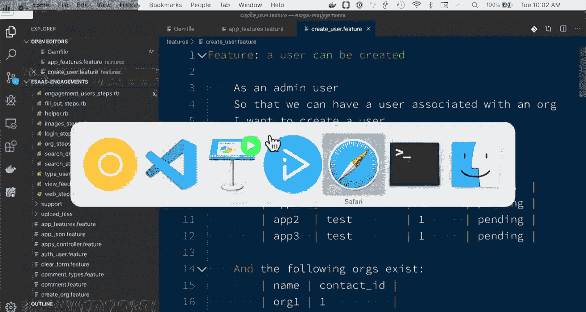

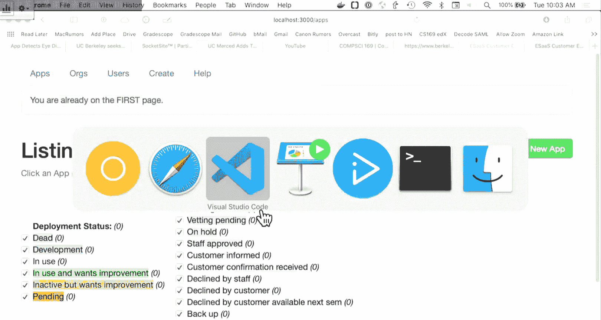

Capybara则是管理与Web浏览器（或模拟浏览器）交互的工具。了解这个区别有助于在遇到错误时更准确地搜索解决方案。

### 匹配步骤定义

步骤定义使用正则表达式来匹配场景中的步骤。用双引号包裹变量部分是一个好习惯，这有助于区分输入参数和固定文本，使场景和步骤定义更易读。例如，`Given my birthday is set to "May 12, 1990"` 可以匹配步骤定义 `/^my birthday is set to "([^"]*)"$/`，并将 `"May 12, 1990"` 作为参数捕获。

### BDD工作流程：从红到绿

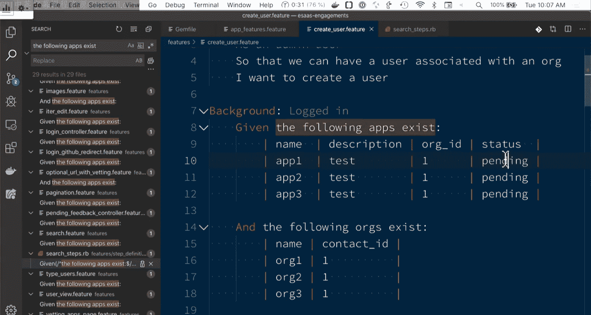

在项目中使用Cucumber的典型流程是：首先编写**失败的测试**（红色），然后实现功能使测试**通过**（绿色）。Cucumber这个名字的寓意是“绿色测试是好的”，就像绿色蔬菜有益健康一样。

### Cucumber的高级功能

Cucumber本身及其周边工具提供了许多功能来简化测试。

#### 1. Background（背景步骤）

`Background` 关键字用于定义在每个场景之前运行的共享设置步骤。这避免了在每个场景中重复相同的准备步骤。在RSpec中，类似的工具有 `before` 和 `after` 钩子。

#### 2. 表格数据

Cucumber支持使用管道符（`|`）定义的表格数据。它会自动将表格解析成哈希数组，方便在步骤定义中使用。这对于填充多个表单字段或创建一组数据特别有用。

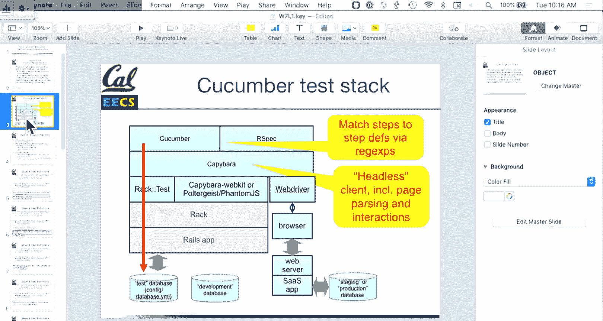

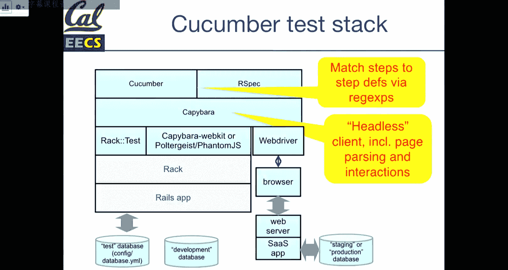

#### 3. 时间测试（Timecop）

对于处理时间敏感数据的应用，`Timecop` gem 非常有用。它允许你“冻结”或“穿越”到特定时间进行测试，确保测试结果不依赖于运行时的实际时间。

### Capybara 交互指南

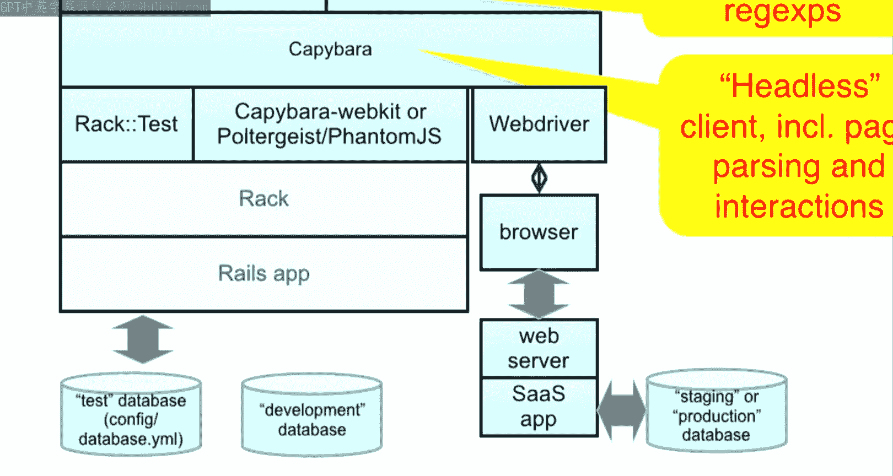

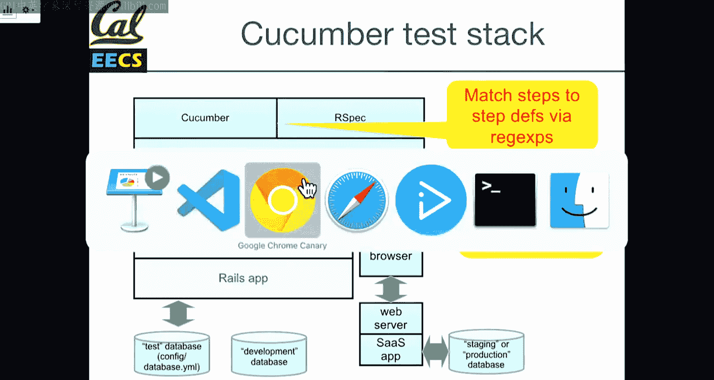

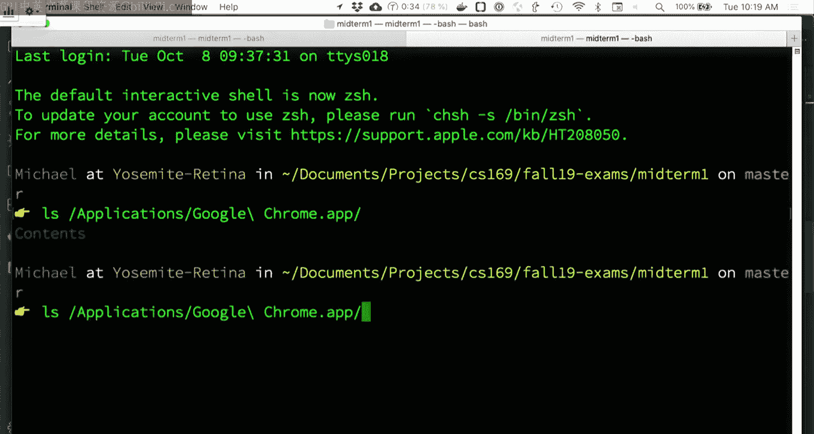

Capybara 与浏览器中的页面进行交互。页面就是一个HTML文档，包含各种元素。


以下是一些核心方法：

*   **`find`**：最常用的方法。可以通过CSS选择器、ID或XPath来查找元素。例如：`find('#username')`。
*   **`have_css`， `have_text`**：这些匹配器内部使用 `find`，并返回是否找到元素的布尔值。例如：`expect(page).to have_css('.user-list')`。
*   **作用域查找**：可以先找到一个父元素，然后在其内部查找。例如：`within('.sidebar') { find('.menu-item') }`。

#### 测试专用CSS选择器

一个有用的技巧是使用专为测试设计的CSS类（例如，以 `.js-` 或 `.test-` 为前缀）。这样做可以将**测试逻辑**与**样式逻辑**分离，当改变页面样式时，无需同时修改大量测试代码。

## 客户会议指南

现在，让我们从技术测试转向项目协作。与客户进行有效沟通是项目成功的关键。

### 沟通频率与团队协作

来自往届学生的建议表明，**频繁的沟通**至关重要。对于六人团队，协调日程可能具有挑战性。
*   考虑每日进行简短站会（例如通过Slack或五分钟视频通话）。
*   每周仅一次会议可能不够。更短、更频繁的同步更有效。
*   团队沟通是软件工程中持续存在的挑战，多加练习会有所帮助。

### 会议准备与执行

以下是为客户会议做准备的一些通用建议：

**会前准备：**
*   **设定议程**：客户应提前知道会议内容。
*   **发送材料**：如果可演示，提前将应用访问方式或截图发给客户，让他们有时间测试并提供具体反馈。
*   **准时开始**：尊重客户时间，准时开始会议。

**会议期间：**
*   **保持专注**：全身心投入会议，不要 multitasking。
*   **专人记录**：指定一人做会议记录。
*   **获取优先级**：最重要的任务之一是让客户**明确优先级**。客户可能有很多需求，但你们时间有限。询问：“哪一两项是最重要的？”
*   **SAMOAS原则**：
    *   **S**tart and stop on time （准时开始和结束）
    *   **A**genda （议程）
    *   **M**inutes （记录）
    *   **O**ne speaker at a time （一次一人发言）
    *   **A**dvance materials （提前发送材料）
    *   **S**et next date （设定下次会议日期）

**会后跟进：**
*   **整理记录**：将会议记录和行动项更新到项目追踪工具（如Pivotal Tracker）中。
*   **及时沟通**：完成行动项后及时告知客户。可以利用Slack的提醒功能。

### 迭代零会议

与客户的第一次会议通常是“迭代零”会议。目标是：
*   互相认识，建立关系。
*   高层次了解项目需求和背景。
*   **不要**在第一次会议后就详细规划所有用户故事。那是后续会议的工作。
*   对于新启动的项目，这次会议对于理解客户需求尤为关键。

### 远程会议建议

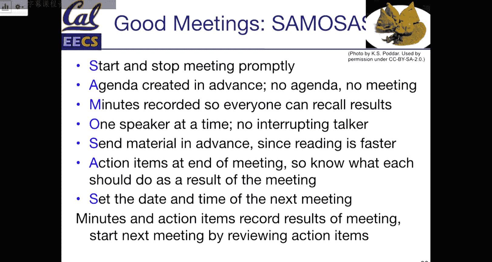


如果需要进行远程会议：
*   **面对面优先**：能线下则线下，沟通效率更高。
*   **使用耳机**：显著提升音频质量。
*   **集体参会**：如果客户远程，团队其他成员最好在同一房间共用一套设备接入，避免多人独立接入造成的混乱。
*   **减少共享切换**：提前准备好要演示的内容，尽量减少屏幕共享的频繁切换。

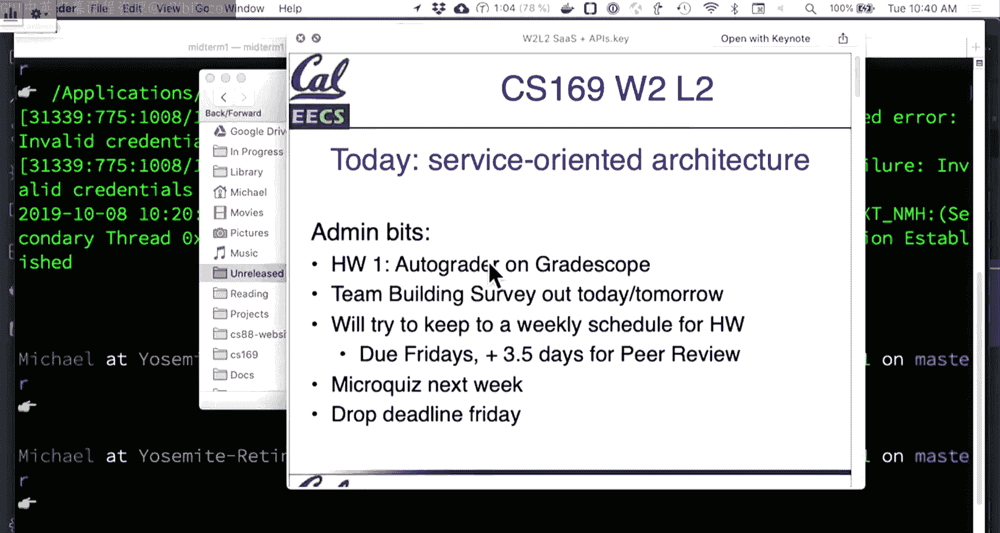

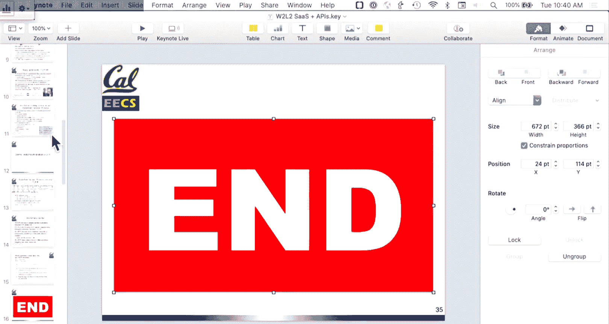


## 期中考试答疑与补充主题

课程剩余时间用于解答问题。涵盖的主题包括软件工程、Ruby on Rails等。

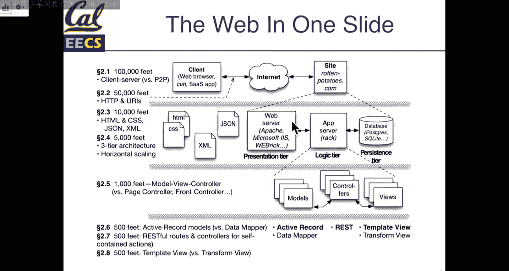

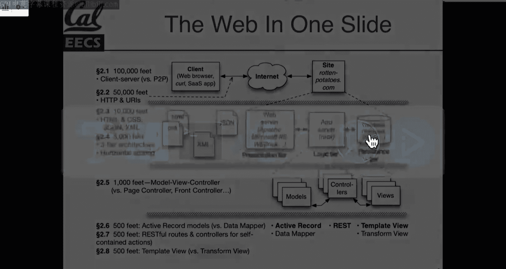

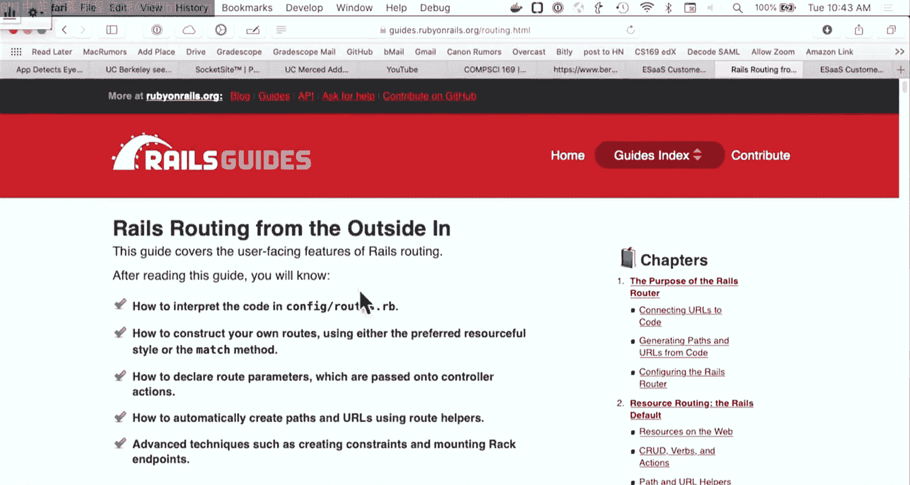

### Web服务器 vs. 应用服务器

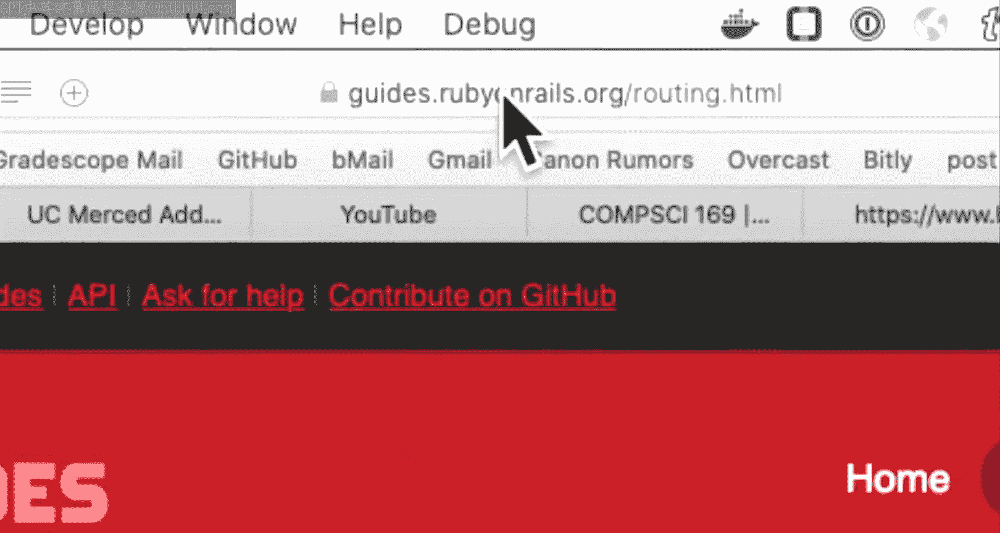

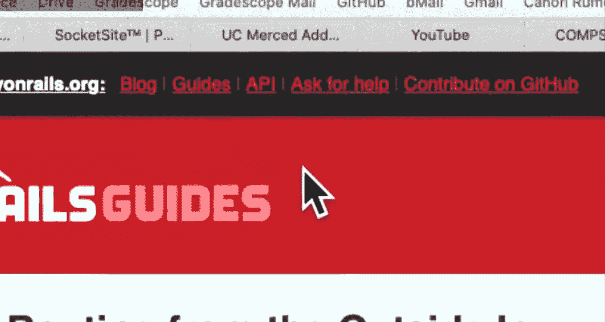

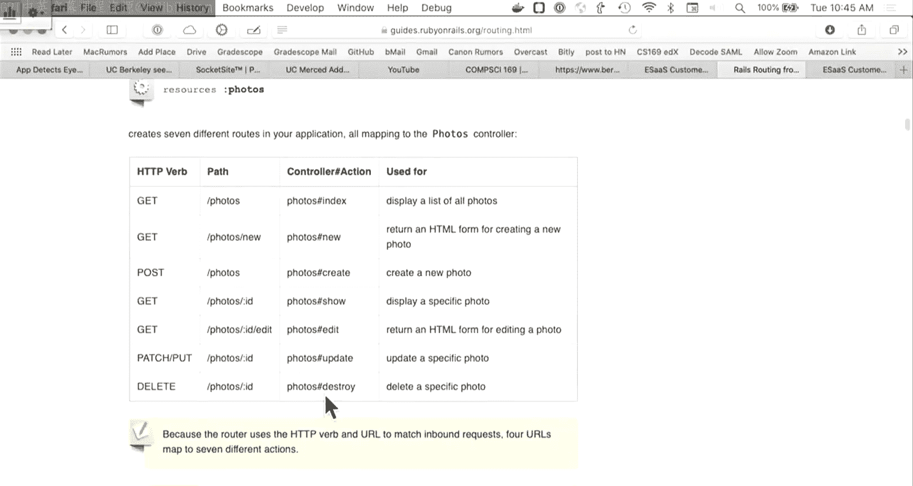

*   **Web服务器**（如Nginx， Puma， Unicorn）：处理原始的HTTP请求/响应，解析协议。
*   **应用服务器**（如Rails）：包含MVC业务逻辑、路由定义等。Rails运行在Web服务器之上。在本课程中，我们主要关注应用服务器（Rails）层面。

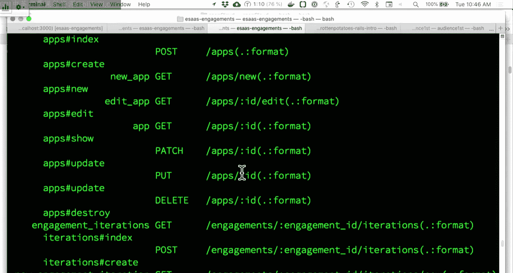

### Rails路由助手

使用 `resources :photos` 会在 `routes.rb` 中生成一套RESTful路由，并创建相应的路径助手方法（如 `photos_path`， `new_photo_path`）。
要查看应用中的所有路由，可以在终端运行命令：
```bash
bundle exec rake routes
```
这会列出所有路径助手、HTTP动词、URL模式和对应的控制器动作。

### Sinatra 与 Rails 对比

*   **Sinatra**：轻量级框架，适合构建简单的Web应用或API。它主要提供路由功能，没有内置的MVC结构或ORM，所有代码通常集中在少数几个文件中。
*   **Rails**：全栈框架，提供大量“开箱即用”的功能和约定。
    *   **结构**：强制性的MVC文件夹结构（`app/models`， `app/views`， `app/controllers`），便于组织大型项目。
    *   **约定优于配置**：通过命名约定（如 `PhotosController` 对应 `Photo` 模型），减少配置。
    *   **Active Record**：强大的ORM，将Ruby对象映射到数据库，抽象了大部分SQL操作，是Rails的核心优势之一。

### 命令式 vs. 声明式步骤

在编写Cucumber步骤时，有两种风格：
*   **命令式**：一步步模拟用户的实际操作（如“填写字段”、“点击按钮”）。这能更真实地测试用户流程。
*   **声明式**：直接设置应用状态（如通过Active Record直接创建数据库记录）。这通常**更快**，编写起来也更简单。
两者结合使用，可以在测试覆盖率和执行效率之间取得平衡。

### 首次客户会议时间

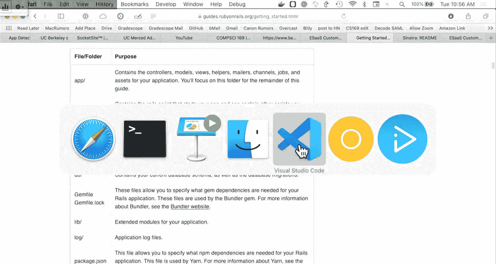

建议**尽早**安排第一次客户会议（例如本周）。越早开始，就能越早熟悉项目，并暴露出理解上的差距，从而能更快地带着更具体的问题进行后续沟通。可以安排一个简短的介绍性会议（例如30分钟）来破冰并了解概要。

### 团队成员无法参会

尽量确保所有成员都能参会。如果个别成员因时间冲突无法参加：
*   确保参会者做好详细记录并共享。
*   让未能参会的成员与参会者结对工作，保持同步。
*   考虑轮流调整会议时间，或为无法参会的成员安排单独的同步会议。

## 总结

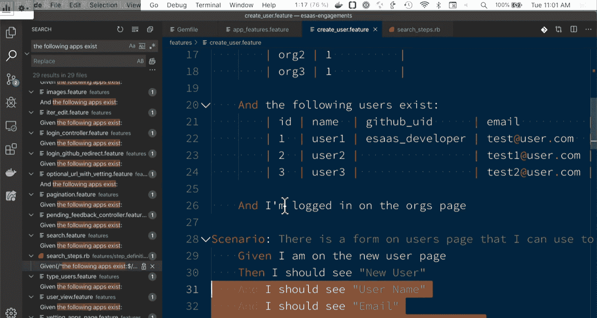

本节课我们一起深入学习了Cucumber测试框架的细节，包括步骤定义、高级功能（Background、表格数据）以及Capybara的页面交互方法。接着，我们探讨了与项目客户进行有效会议的关键策略，包括会前准备、会中执行和会后跟进的最佳实践。最后，我们针对期中考试可能涉及的一些概念（如Web服务器架构、Rails路由、框架对比等）进行了答疑和梳理。掌握这些测试工具和沟通技巧，将为你们接下来的项目开发工作奠定坚实的基础。