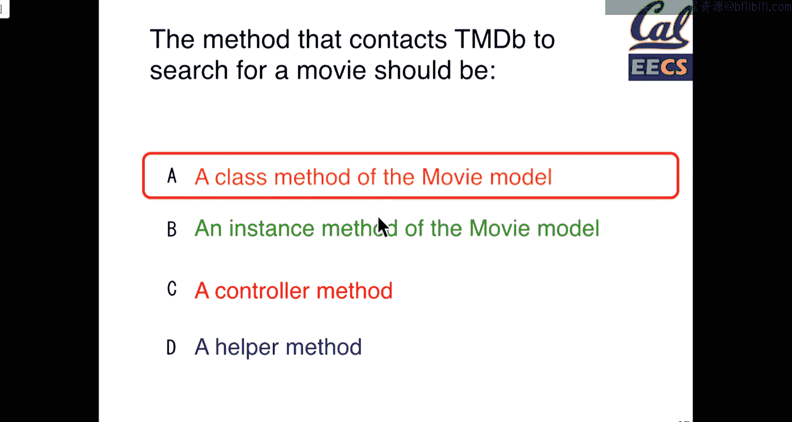
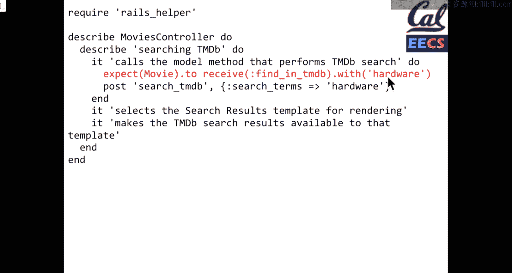

# 012：测试理论与实践 🧪


在本节课中，我们将学习软件测试的不同层次、最佳实践以及如何编写有效的测试用例。我们将探讨从高层次的Cucumber验收测试到低层次的RSpec单元测试，并理解如何利用测试驱动开发（TDD）和行为驱动开发（BDD）来构建更健壮的应用程序。

---

## 课程更新与项目安排 📅

期中考试的情况比预期更令人紧张，但这没关系。由于停电，我们未能按计划完成期中考试的批改工作，对此表示歉意。成绩将在本周内公布。课程大纲将相应调整，但总体计划有弹性，因此不会增加额外的课程或占用考试周的时间。课程项目将替代期末考试。

关于项目，本周应开始与客户进行初次会面，讨论项目需求。目标是理解客户对整个学期项目的期望。如果是回头客，可以询问过往经验以获得改进建议。从本周起，还有两次作业，大部分工作将集中在项目上。

---

## 测试层次与最佳实践 🎯

上一节我们介绍了课程安排，本节中我们来看看测试的不同层次及其最佳实践。

测试是让程序员生活更轻松的重要工具。我们花了很多时间学习Cucumber，它是一种非常有用的工具，但像任何工具一样，它不能完全解决问题，你需要知道如何实践。

### Cucumber使用注意事项

以下是使用Cucumber时需要注意的几点：

1.  **测试“快乐路径”与异常路径**：不仅要测试正常流程（如成功登录），还要测试可能出错的场景（如输入错误）。
2.  **小心正则表达式**：过于宽泛的正则表达式（如 `.*`）可能匹配到不期望的内容，导致多个步骤定义相互冲突。应使其更具体。
3.  **避免过度复杂的正则表达式**：不要为了共享代码而编写复杂的正则表达式。如果需要共享代码，应将步骤定义拆分为多个方法。
4.  **注意匹配位置**：使用 `within` 选择器来限定文本搜索的范围，例如 `within(‘.user-profile-card’)`，这能使测试意图更清晰。
5.  **验证实际结果**：确保测试检查的是实际被触发的内容。有时可以直接在步骤定义中检查测试数据库的状态。

### 测试类型：集成、功能与单元测试

在软件测试中，我们通常将测试分为三个层次：

*   **集成测试 / 验收测试**：这是最高层次的测试，通常使用Cucumber编写。它模拟完整的用户故事，涉及多个页面和交互步骤（例如，登录、添加商品到购物车、结账、收到邮件）。
*   **功能测试 / 模块测试**：这一层次测试应用程序的较大组成部分，但通常局限于单个页面或控制器。它仍然涉及大部分技术栈，但不是完整的端到端用户流程。
*   **单元测试**：这是最底层的测试，专注于测试独立于应用程序其他部分的、特定的小功能单元。我们将使用RSpec来编写这类测试。

**注意**：在业界，这些术语有时会混用（例如，有人将功能测试等同于集成测试）。关键在于理解我们是在不同隔离级别上测试代码。

---

## 测试类型选择练习 🤔

为了加深理解，我们通过几个场景来选择最合适的测试类型。

### 场景一：未登录访问个人资料页

**描述**：当用户未登录时访问个人资料页，应被重定向到登录页面。最适合的测试类型是什么？

**分析**：这个场景主要测试一个特定的控制器动作（重定向）。它不涉及多页面流程，只关心单个请求的响应。因此，**功能测试（B）** 更为合适。你可以使用RSpec的 `redirect_to` 辅助方法来验证重定向。如果测试还涉及重定向后页面的具体内容，则可能需要Cucumber集成测试。

### 场景二：用户注册（含验证码）

**描述**：用户通过提供邮箱、密码并完成验证码来注册新账户。最适合的测试类型是什么？

**分析**：这个流程包含交互元素（验证码）并可能涉及多个步骤和页面状态变化。为了测试完整的用户交互流程，**Cucumber集成测试（A）** 是最佳选择。当然，可以结合单元测试来验证具体的业务逻辑（如密码验证）。

### 场景三：密码非空验证

**描述**：用户设置账户时不能指定空密码。最适合的测试类型是什么？

**分析**：这纯粹是数据模型层面的验证逻辑。它不涉及控制器或视图。因此，最适合使用 **单元测试（D）** 来直接测试用户模型中的验证方法。

---

## 测试驱动开发（TDD）与良好测试原则 🚀

上一节我们探讨了如何选择测试类型，本节中我们来看看如何通过TDD来组织测试，以及良好测试的原则。

### 行为驱动开发与测试驱动开发

Cucumber主要用于**行为驱动开发**。我们先编写描述用户行为的高级场景，然后编写代码使其通过。然而，当Cucumber测试失败时，定位问题可能比较困难。

因此，我们通常将Cucumber场景与更细粒度的RSpec测试（单元和功能测试）结合使用。这就是**测试驱动开发**的模式：**红-绿-重构**。

1.  **红**：先编写一个会失败的测试。
2.  **绿**：编写尽可能简单的代码使测试通过。
3.  **重构**：在测试保护下改进代码质量。

TDD的核心理念是：**首先追求功能正确的代码，然后再优化其设计和可读性**。DRY（不要重复自己）是一个好习惯，但不必一开始就追求完美的抽象。

### 良好测试的F.I.R.S.T.原则

优秀的测试用例应遵循F.I.R.S.T.原则：

*   **快速**：测试应该快速运行，以便频繁执行。
*   **独立**：测试不应依赖于其他测试或外部状态（如当前日期、数据库残留数据）。
*   **可重复**：在任何环境下多次运行都应得到相同的结果。
*   **自验证**：测试应能自动判断通过与否，无需人工干预。
*   **及时**：测试最好与代码同时或提前编写。

---

## 处理测试中的依赖与不确定性 🎲

上一节我们介绍了良好测试的原则，本节中我们来看看测试中的一个常见挑战：如何处理依赖和不确定性。

考虑一个方法 `birthday_today?`，它检查今天是否是用户的生日。直接使用 `Date.today` 会导致测试只在一年中的某一天通过，这违反了**独立**和**可重复**原则。

### 场景：测试随机性和时间依赖

**问题**：如何测试依赖随机数或当前时间/日期的代码？

**分析**：答案是我们可以让这些非确定性因素变得**确定性**。
*   **随机数**：使用固定的**种子**来初始化伪随机数生成器，这样每次生成的序列都是相同的。
*   **日期/时间**：使用**模拟**或**存根**技术。在测试设置中，我们可以“欺骗”系统，让它认为当前是一个特定的日期（例如，总是10月15日）。

RSpec默认以随机顺序运行测试，并会输出使用的种子号。如果遇到因测试顺序导致的偶发失败，可以利用这个种子号进行调试。

---

## RSpec单元测试基础 📝

现在，让我们深入了解一下RSpec单元测试的基本结构。

### 测试结构：Arrange, Act, Assert

一个好的单元测试通常包含三个部分：
1.  **Arrange**：设置测试环境和所需数据。
2.  **Act**：执行被测试的操作。
3.  **Assert**：验证操作结果是否符合预期。

在RSpec中，`expect` 是进行断言的主要方式。

### RSpec示例：斐波那契数列

```ruby
# 引入必要的文件
require ‘rspec’
require ‘fibonacci’

describe Fibonacci do
  it “正确计算第五个斐波那契数” do
    fib = Fibonacci.new
    expect(fib.calc(5)).to eq(5) # 假设序列为 1, 1, 2, 3, 5
  end

  it “将浮点数输入转换为整数” do
    fib = Fibonacci.new
    expect(fib.calc(5.7)).to eq(5)
  end

  it “对负数输入返回错误” do
    fib = Fibonacci.new
    expect { fib.calc(-1) }.to raise_error(ArgumentError)
  end
end
```
*   `describe` 用于组织相关的测试用例。
*   `it` 定义一个具体的测试用例，字符串描述其目的。
*   `expect(...).to eq(...)` 是最基本的断言形式。
*   `expect { ... }.to raise_error(...)` 用于断言会抛出异常。

### 更复杂的RSpec结构

```ruby
describe BookInStock do
  it “类应该存在” do
    expect(BookInStock).to be_a(Class)
  end

  describe “getters and setters” do
    before do
      # Arrange: 为这个describe块内的所有测试进行通用设置
      @book = BookInStock.new(“123”, 33.95)
    end

    it “应该设置ISBN” do
      # Act & Assert
      expect(@book.isbn).to eq(“123”)
    end

    it “应该设置价格” do
      expect(@book.price).to eq(33.95)
    end
  end
end
```
*   `before` 钩子在每个 `it` 块运行前执行，用于公共的 **Arrange** 步骤。
*   每个 `it` 块最好只测试一个具体的期望，这样测试报告会更清晰。

---

## 使用模拟与存根隔离测试 🔗

在最后一节，我们探讨如何通过模拟和存根来编写独立、快速的测试。

### 找到接缝并模拟依赖

应用程序中的**接缝**是指那些行为受外部代码（如API调用）影响的地方。为了测试依赖于接缝的代码（例如，一个调用外部电影数据库API的控制器），我们不应该在单元测试中真正发起网络请求。

**解决方案**：使用RSpec的 `expect(...).to receive(...)` 来模拟方法调用。




### 示例：模拟外部API调用

假设我们有一个控制器动作 `search`，它会调用模型方法 `Movie.find_in_tmdb` 来查询外部API。

我们想测试控制器逻辑，而不依赖真实的API。以下是控制器测试的思路：

```ruby
describe MoviesController do
  describe “搜索TMDB” do
    it “应该调用模型方法来执行搜索” do
      # 1. 在调用控制器动作前，设置期望：Movie类应该收到 `find_in_tmdb` 方法调用
      expect(Movie).to receive(:find_in_tmdb).with(“hardware”)

      # 2. 执行控制器动作（Act）
      post :search, params: { search_term: “hardware” }

      # 3. 如果上一步的 `post` 成功调用了 `Movie.find_in_tmdb(“hardware”)`，则测试通过。
      # RSpec会自动验证期望是否满足，无需额外的assert语句。
    end
  end
end
```

**为什么期望要写在动作之前？**
因为 `expect(...).to receive(...)` 会预先设置一个“间谍”来监听方法调用。它记录该方法是否被调用、调用参数是什么。只有在设置了这个期望之后执行代码，监听才会生效。

这种方法使得测试：
*   **独立**：不依赖外部网络和服务。
*   **快速**：没有真实的网络延迟。
*   **可重复**：每次结果一致。

---

## 总结 📚



本节课中我们一起学习了：
1.  **测试的层次**：从高层的Cucumber集成测试，到功能测试，再到底层的RSpec单元测试，每种测试适用于不同的场景。
2.  **测试驱动开发**：遵循“红-绿-重构”循环，先写测试，再写实现代码，最后重构优化。
3.  **良好测试原则**：测试应遵循F.I.R.S.T.原则（快速、独立、可重复、自验证、及时）。
4.  **处理不确定性**：通过固定种子、模拟时间或存根方法，将非确定性的依赖转化为确定性的测试。
5.  **RSpec基础**：学习了 `describe`, `it`, `before`, `expect` 等关键结构来编写单元测试。
6.  **测试隔离**：通过模拟（`expect to receive`）来隔离外部依赖，使单元测试更专注、更快速。


掌握这些测试理念和工具，将帮助你构建出更可靠、更易于维护的软件。接下来的作业将围绕测试展开，请积极应用这些知识。