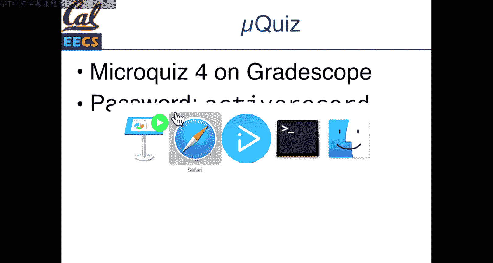
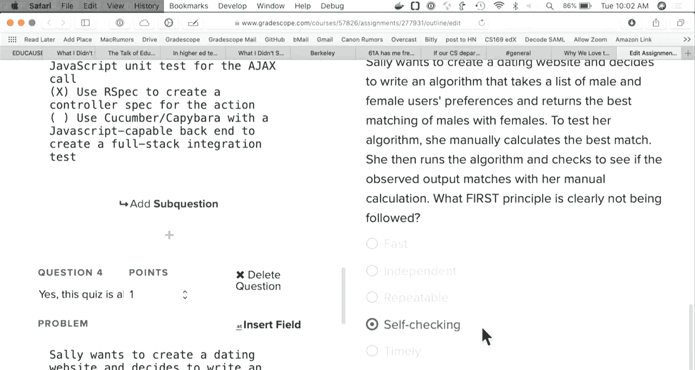
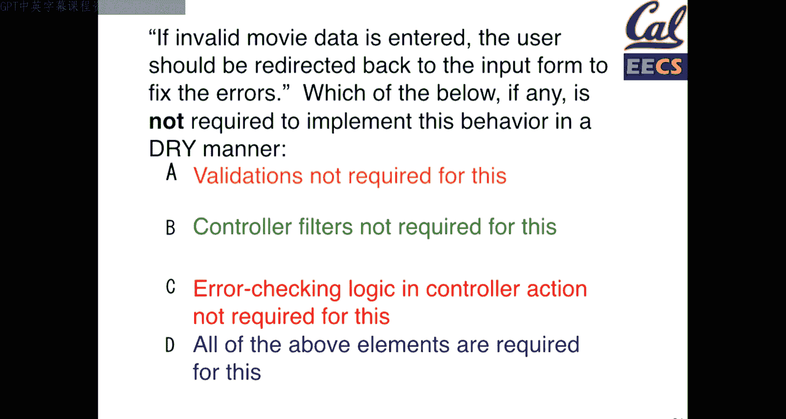
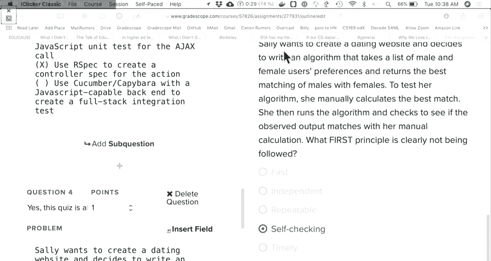
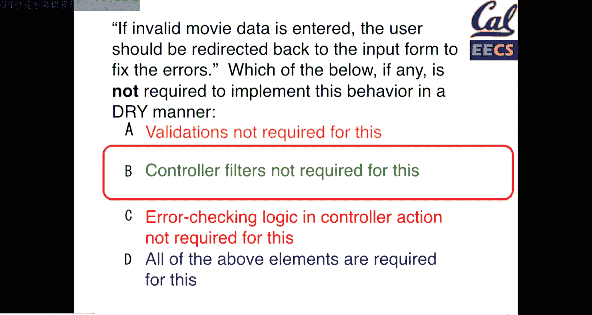
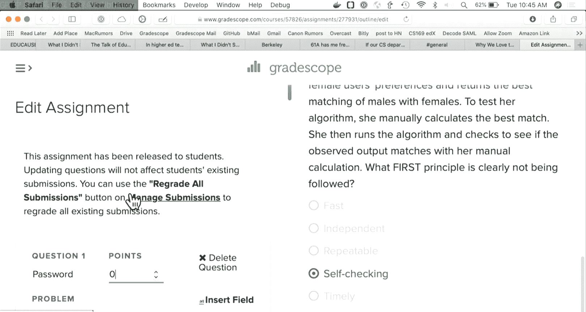
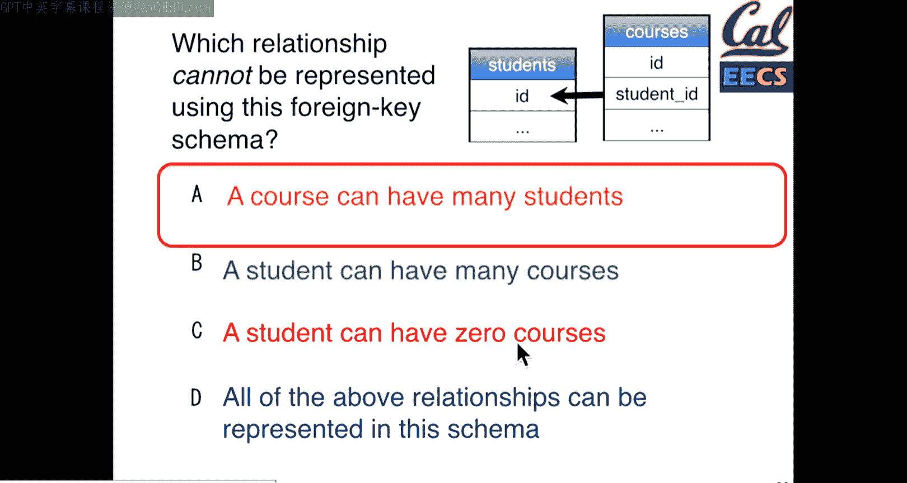

# 014：模型验证、控制器过滤器与数据库关联



在本节课中，我们将学习Rails框架中三个核心概念：模型验证、控制器过滤器以及数据库关联的基础知识。这些工具能帮助我们编写更简洁、更易维护的代码。

## 模型验证：确保数据完整性



上一节我们介绍了Rails的基本结构，本节中我们来看看如何确保模型数据的正确性。模型验证是一种确保数据在保存到数据库前符合特定规则的方法。通过在模型中定义验证规则，我们可以避免在多个地方重复编写相同的检查逻辑。

以下是Rails中定义验证的几种方式：

*   **基本验证**：使用 `validates` 方法，可以检查属性的存在性、长度、格式等。
    ```ruby
    validates :title, presence: true, length: { maximum: 40 }
    validates :release_date, presence: true
    ```
*   **自定义验证**：通过自定义方法实现更复杂的业务逻辑。
    ```ruby
    validate :released_1930_or_later

    def released_1930_or_later
      errors.add(:release_date, 'must be 1930 or later') if release_date.present? && release_date.year < 1930
    end
    ```
*   **条件验证**：使用 `if` 或 `unless` 选项，只在特定条件下运行验证。
    ```ruby
    validates :rating, inclusion: { in: %w[G PG PG-13 R NC-17] }, unless: :grandfathered?
    ```

当调用 `save` 或 `update` 方法时，Rails会自动运行所有定义的验证。如果验证失败，对象不会被保存，并且错误信息会存储在 `errors` 对象中。

## 控制器过滤器：处理横切关注点

模型验证处理了数据层面的规则，那么控制器层面的通用逻辑该如何处理呢？这就是控制器过滤器的作用。控制器过滤器允许我们在执行某个控制器动作之前或之后运行指定的代码，非常适合处理如用户认证、日志记录等横切关注点。

以下是控制器过滤器的主要类型和使用方法：

*   **前置过滤器 (`before_action`)**：在动作执行前运行，常用于权限检查。
    ```ruby
    class SessionsController < ApplicationController
      before_action :set_current_user

      def set_current_user
        @current_user = Moviegoer.find_by(id: session[:user_id])
        redirect_to login_path unless @current_user
      end
    end
    ```
*   **后置过滤器 (`after_action`)**：在动作执行后运行，可用于记录日志或清理工作。
*   **限定过滤器范围**：使用 `only` 或 `except` 选项，将过滤器限定在特定动作上。
    ```ruby
    before_action :require_login, only: [:edit, :update, :destroy]
    ```

过滤器通过继承在控制器间共享。定义在 `ApplicationController` 中的过滤器会被所有子控制器继承。

## 数据库关联基础：建立模型间的关系

在了解了如何保证单个模型的数据质量后，我们需要看看如何定义模型之间的关系。数据库关联是Active Record最强大的功能之一，它允许我们以直观的方式表达如“一部电影拥有多条评论”这样的关系。

关联的基础是**外键**。外键是表中的一列，它存储了另一张表中某条记录的主键ID，从而建立两者间的引用关系。





例如，在 `reviews` 表中有一个 `movie_id` 列，其值指向 `movies` 表中的某条记录。通过这种机制，我们可以将数据关联起来。





一个简单的SQL查询可以展示如何通过外键连接两张表：
```sql
SELECT * FROM movies, reviews WHERE movies.id = reviews.movie_id;
```

然而，在Rails中，我们通常不需要直接编写这样的SQL。Active Record的关联宏（如 `has_many` 和 `belongs_to`）会为我们处理这些细节。我们将在下一节课深入探讨这些关联宏的用法。

## 总结

本节课中我们一起学习了Rails中用于保持代码DRY（Don‘t Repeat Yourself）和结构清晰的三个重要工具：
1.  **模型验证**：在模型层定义数据规则，确保所有创建和更新操作都遵守一致的约束。
2.  **控制器过滤器**：在控制器层处理需要在多个动作前后执行的通用逻辑，如用户认证。
3.  **数据库关联基础**：通过外键建立模型间的关系，为下一节学习Active Record关联宏打下基础。




合理运用这些工具，可以极大地提升Rails应用的可维护性和代码质量。