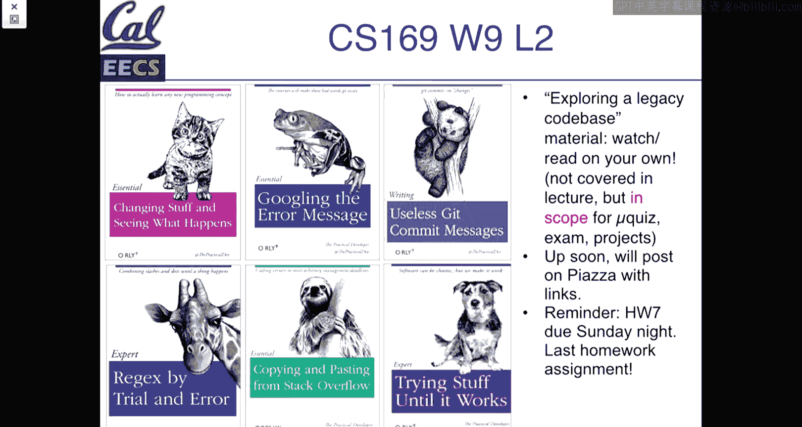
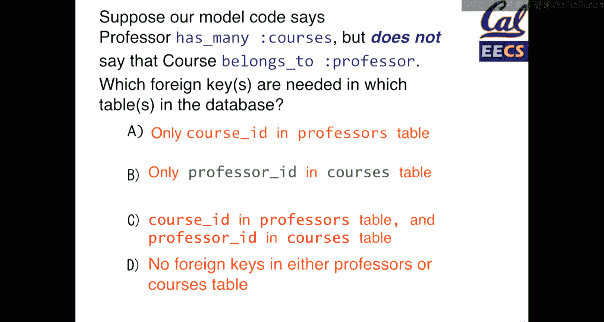
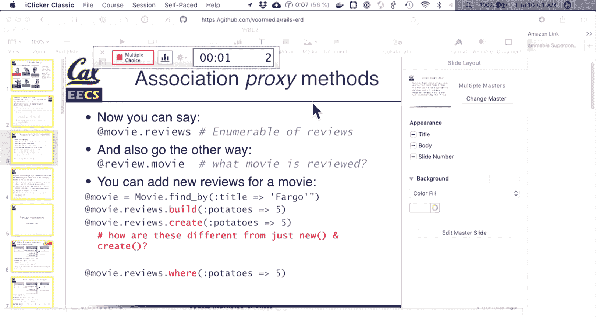
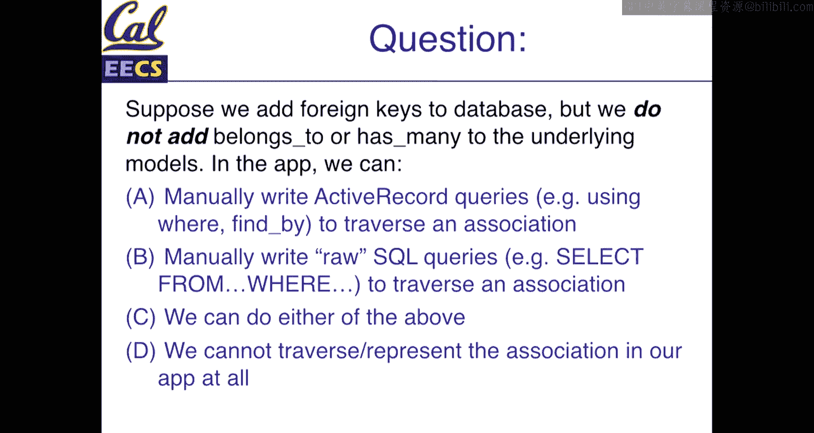
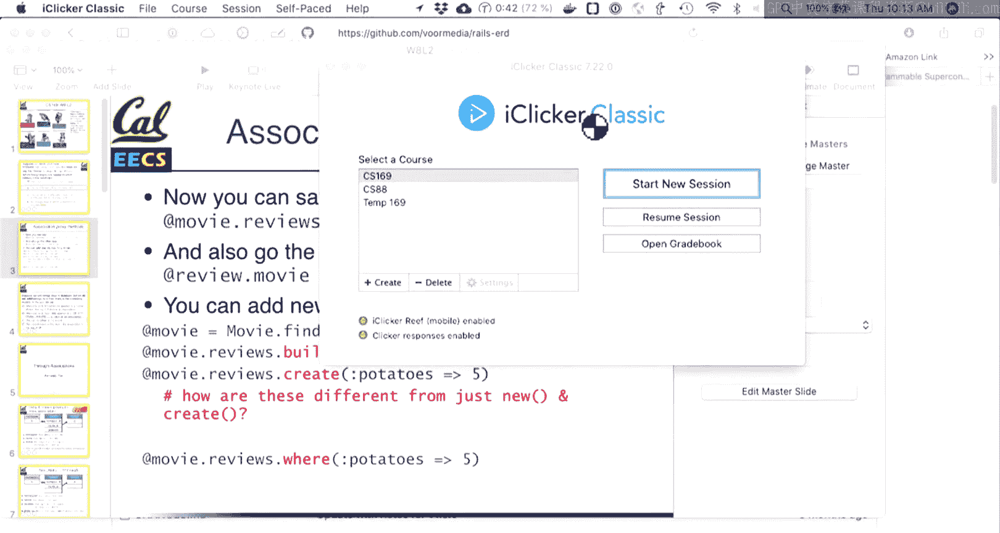
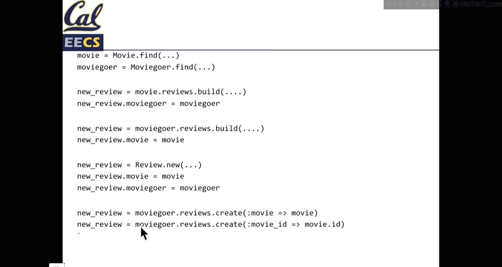
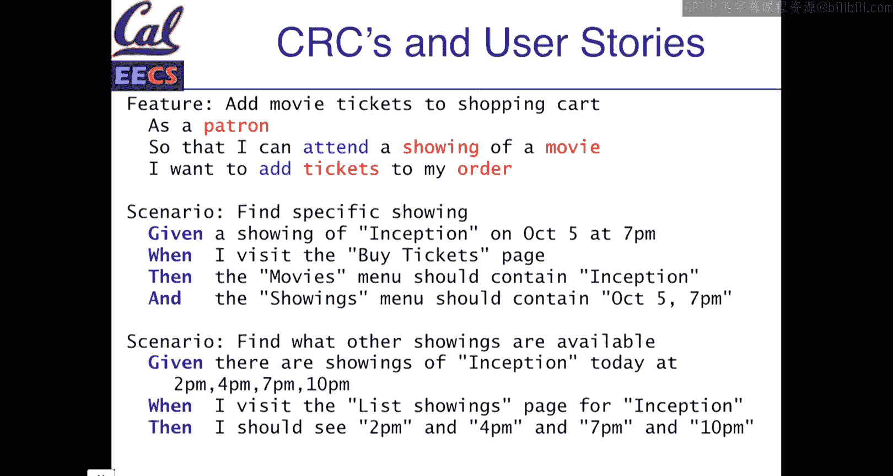

# 015：Active Record 关联与数据建模设计

在本节课中，我们将继续学习 Active Record 关联，并探讨如何设计应用程序中的数据关系。我们将学习如何利用 Rails 提供的工具来优雅地表达模型间的关联，并理解在项目初期做出明智设计决策的重要性。



---

## 课程概述


本节课将深入探讨 Active Record 关联的具体用法，并介绍一些关于如何设计数据关联关系的理论。我们将学习如何利用 `has_many` 和 `belongs_to` 等方法，在代码中轻松地操作数据库关系，从而避免编写复杂的原始 SQL 查询。此外，我们还将了解一些用于理解和可视化数据关系的工具，例如 UML 图和 CRC 卡片。

---

## 数据库关系建模回顾

上一节我们讨论了如何在数据库层面表示关系。例如，我们有一个 `movies` 表和一个 `reviews` 表，其中 `reviews` 表通过一个名为 `movie_id` 的外键与 `movies` 表关联。这使我们能够将特定的影评与特定的电影联系起来。

然而，仅仅在数据库中建立关系还不够。Active Record 的强大之处在于，它允许我们在 Ruby 代码中以更直观、更便捷的方式操作这些关联。

## 在 Rails 中定义关联

为了在 Rails 应用中暴露数据库中的关系，我们需要在模型中使用特定的方法。例如，在 `Movie` 模型中，我们可以声明 `has_many :reviews`；在 `Review` 模型中，我们可以声明 `belongs_to :movie`。

**代码示例：**
```ruby
# app/models/movie.rb
class Movie < ApplicationRecord
  has_many :reviews
end

# app/models/review.rb
class Review < ApplicationRecord
  belongs_to :movie
end
```

这些声明并非必需，但它们为我们提供了强大的辅助方法。`has_many` 和 `belongs_to` 是 Rails 提供的方法，它们基于数据库中的外键关系，为我们生成了便捷的查询接口。

## 关联方法的工作原理

当我们声明 `Movie has_many :reviews` 后，就可以使用 `movie.reviews` 方法。Rails 会自动执行一个查询，查找所有 `movie_id` 等于该电影 ID 的影评，并返回一个由 `Review` 模型对象组成的集合。



同样，声明 `Review belongs_to :movie` 后，我们可以使用 `review.movie` 方法来获取该影评所属的电影对象。



**关键点：**
*   `has_many` 返回的是一个集合（通常是复数形式的方法，如 `.reviews`），你可以对其进行遍历。
*   `belongs_to` 返回的是单个对象（单数形式的方法，如 `.movie`）。
*   Rails 能够智能地处理单复数形式。

## 外键与数据完整性

在数据库迁移中创建关联时，我们使用 `t.references` 方法来指定外键。

**迁移示例：**
```ruby
class CreateReviews < ActiveRecord::Migration[6.0]
  def change
    create_table :reviews do |t|
      t.integer :potatoes
      t.text :comments
      t.references :movie, foreign_key: true
      t.references :moviegoer, foreign_key: true
      t.timestamps
    end
  end
end
```





外键约束确保了数据的**引用完整性**。例如，它保证了 `reviews` 表中的每一个 `movie_id` 都对应 `movies` 表中一个真实存在的记录。

## 理解关联方向：小测验解析

以下是几个帮助巩固概念的小测验及其解析：

**场景一：** 假设我们在 `reviews` 表中设置了 `movie_id` 外键，并且在 `Movie` 模型中添加了 `has_many :reviews`，但**没有**在 `Review` 模型中添加 `belongs_to :movie`。以下哪项是正确的？
*   A. 我们可以调用 `movie.reviews`
*   B. 我们可以调用 `review.movie`
*   C. 尝试保存影评时会出现数据库错误
*   D. A 和 B 都正确

**解析：** 正确答案是 **A**。`has_many :reviews` 提供了从电影到影评的关联方法 `movie.reviews`。`belongs_to :movie` 提供的是反向方法 `review.movie`。没有它，我们就无法直接通过影评对象获取其关联的电影。只要数据库中有 `movie_id` 字段，保存影评就不会仅仅因为缺少 Rails 的 `belongs_to` 声明而报错。

**场景二：** 在另一个应用中，我们声明了 `Professor has_many :courses`，但没有声明 `Course belongs_to :professor`。我们需要在数据库中如何设置？
*   A. 在 `professors` 表中添加 `course_id` 列
*   B. 在 `courses` 表中添加 `professor_id` 列
*   C. 两者都需要
*   D. 两者都不需要

**解析：** 正确答案是 **B**。`has_many` 关联意味着“一”对“多”，外键应该放在“多”的一方。因此，需要在 `courses` 表中添加指向 `professors` 表的 `professor_id` 外键列。选项 A 将建立的是“一个教授属于一门课程”的关系，这与我们的意图相反。

**场景三：** 假设数据库中已设置好外键，但未在 Rails 模型中指定 `has_many` 或 `belongs_to` 关联。以下哪些是可能的？
*   A. 使用 `movie.reviews`
*   B. 使用 `review.movie`
*   C. A 和 B 都可能
*   D. A 和 B 都不可能

**解析：** 正确答案是 **C**。即使不依赖 Active Record 的关联方法，我们仍然可以手动编写 SQL 查询或使用 Active Record 的查询接口（如 `Review.where(movie_id: 1)`）来实现相同的功能。不过，直接使用关联方法要方便得多。

## 间接关联：`has_many :through`

有时我们需要通过一个中间模型来获取关联数据。例如，通过 `Review` 模型，我们可以找到给某部电影写影评的所有用户。



我们可以这样定义：
```ruby
class Movie < ApplicationRecord
  has_many :reviews
  has_many :moviegoers, through: :reviews
end


class Moviegoer < ApplicationRecord
  has_many :reviews
  has_many :movies, through: :reviews
end

class Review < ApplicationRecord
  belongs_to :movie
  belongs_to :moviegoer
end
```

现在，我们可以使用 `movie.moviegoers` 来获取所有评论过这部电影的用户，使用 `moviegoer.movies` 来获取某个用户评论过的所有电影。Rails 会在底层执行 `JOIN` 查询来组合这些数据。

## 嵌套路由

当资源间存在从属关系时（例如影评属于电影），在路由中嵌套它们可以生成更有意义且一致的 URL。

**路由配置示例 (`config/routes.rb`):**
```ruby
resources :movies do
  resources :reviews
end
```

这将生成像 `/movies/1/reviews` 和 `/movies/1/reviews/new` 这样的路径。在控制器中，你可以通过 `params[:movie_id]` 来获取电影 ID，而 `params[:id]` 则对应影评的 ID。

**控制器示例：**
```ruby
class ReviewsController < ApplicationController
  before_action :load_movie

  def create
    @review = @movie.reviews.build(review_params)
    # ... 保存和重定向逻辑
  end

  private

  def load_movie
    @movie = Movie.find(params[:movie_id])
  end
end
```

使用 `before_action` 过滤器（如 `load_movie`）是一种常见的做法，它可以将加载共享资源的逻辑提取出来，保持代码的简洁（DRY）。

## 可视化数据关系：UML 与 ERD

理解复杂应用中的数据模型可能很困难。**统一建模语言（UML）** 或更具体地说，**实体关系图（ERD）**，是可视化模型及其关系的强大工具。

在 Rails 中，你可以使用 `rails-erd` 这个 gem 来自动生成当前应用的 ERD 图。这对于探索遗留代码库特别有用，因为它能快速揭示哪些模型是系统的核心（拥有大量关联）。

## 设计决策：CRC 卡片

如何决定创建哪些模型和关联呢？**类-职责-协作者（CRC）卡片** 是一种简单的设计技术。

为每个候选的类（模型）创建一张卡片，写下：
*   **类名：** 例如 `Order`。
*   **职责：** 这个对象需要做什么？例如，“计算总价”、“知道包含多少张票”。
*   **协作者：** 为了完成职责，它需要与哪些其他类交互？例如，`Ticket`、`Showing`。

你可以从用户故事或需求描述中提取名词（如 patron, showing, ticket, order）来开始创建这些卡片。这个过程有助于厘清模型间的边界和关系。

---

## 课程总结

本节课我们一起深入学习了 Active Record 关联。我们掌握了如何使用 `has_many` 和 `belongs_to` 在 Rails 中便捷地操作一对多关系，并了解了如何通过 `has_many :through` 建立间接的多对多关联。我们还探讨了如何利用嵌套路由来构建符合 RESTful 风格的 URL 结构。



此外，我们介绍了一些重要的设计工具：用于可视化现有模型的 ERD 图，以及用于在项目初期规划模型的 CRC 卡片。记住，良好的数据模型设计对项目的可维护性和未来的开发体验至关重要。这些技能需要实践来巩固，所以不要害怕在项目中尝试、犯错和调整。