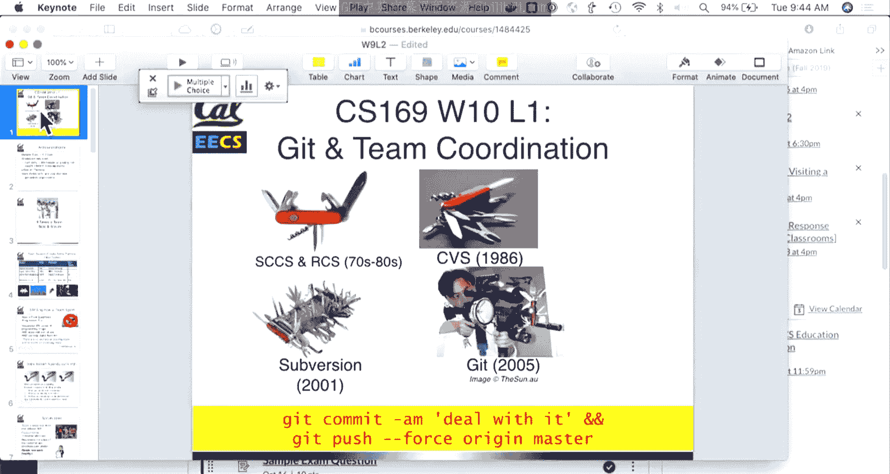
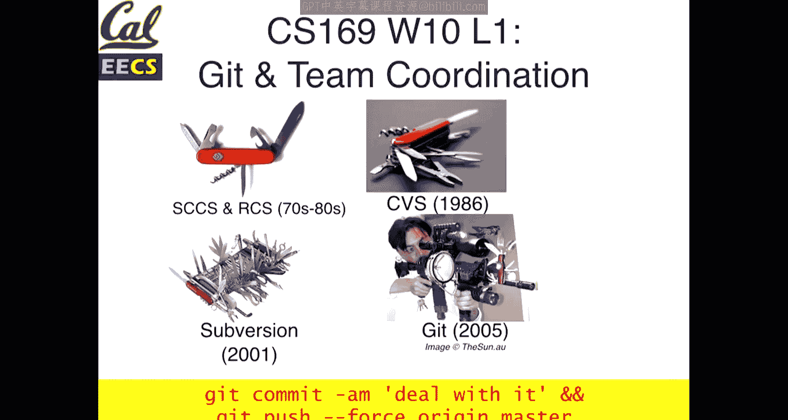
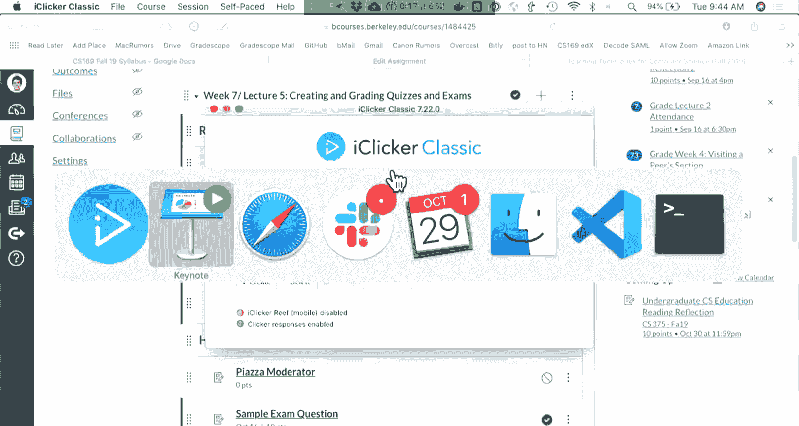
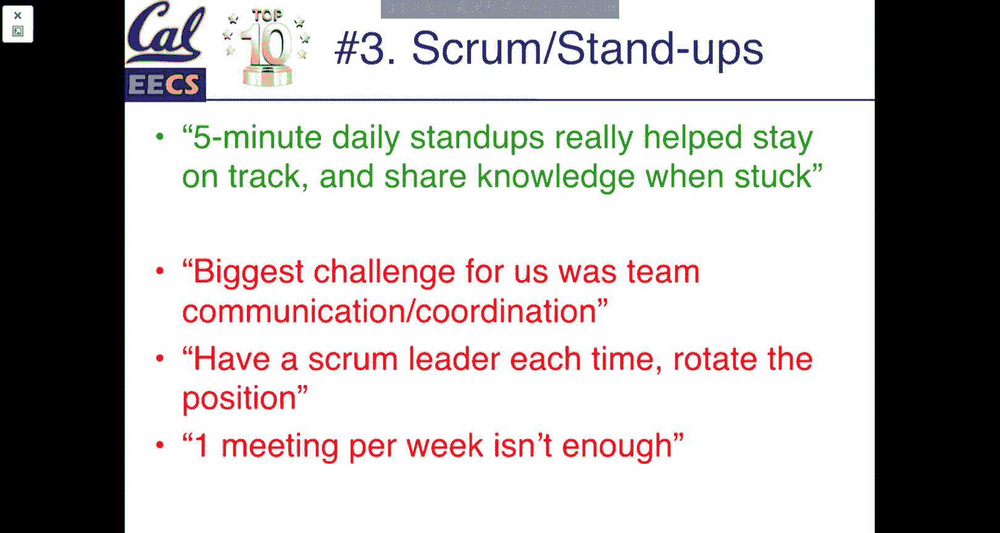
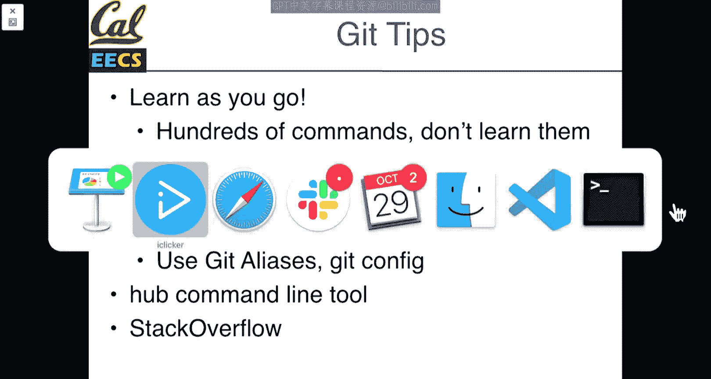
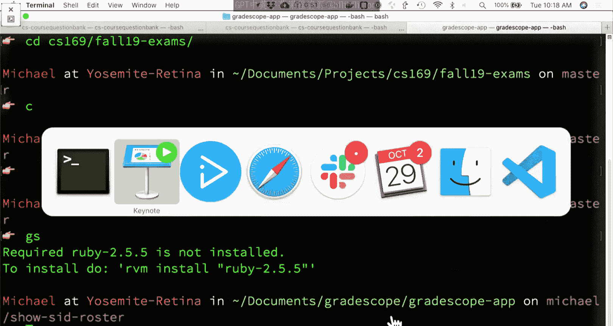
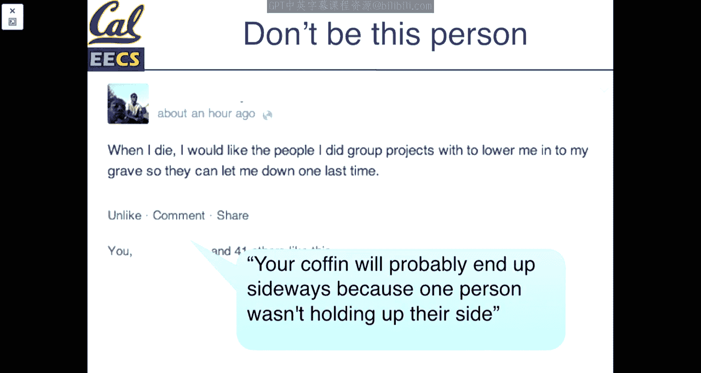
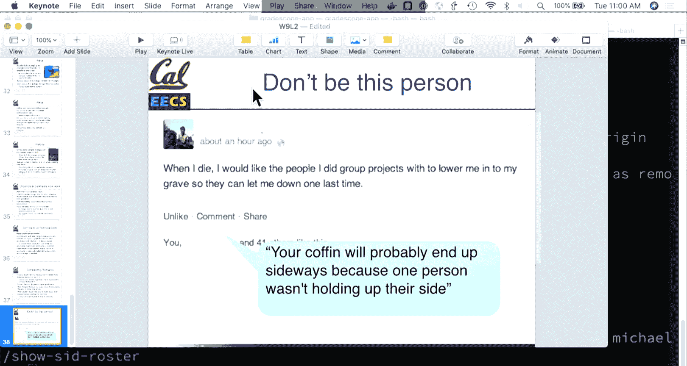

# 016：团队协作与Git工作流 🛠️




在本节课中，我们将要学习如何在团队环境中进行有效的软件协作。我们将探讨团队动态、冲突解决策略，并深入讲解如何使用Git进行版本控制和团队协作，以确保项目顺利进行。





---

## 团队规模与动态 👥

上一节我们介绍了软件工程的基本概念，本节中我们来看看团队协作的重要性。随着软件项目变得越来越复杂，团队规模也在不断增长。从单人开发的《太空侵略者》到数百人协作的《生化危机6》，这说明了在现代软件开发中，团队合作是常态而非例外。

因此，仅仅成为一名优秀的软件工程师是不够的，你还需要学会如何与他人良好合作，并共同管理技术决策。

### 团队角色与规模

一个高效的团队通常有明确的角色分工。以下是常见的角色：

*   **产品负责人**：代表客户利益，负责确定用户故事的优先级。
*   **Scrum Master**：作为团队的倡导者，负责主持每日站会、回顾会议，并帮助团队扫清障碍。
*   **工程师**：负责具体的开发工作。

关于团队规模，一个常见的经验法则是“两个披萨团队”，即团队的规模应该能被两个披萨喂饱（通常指5-8人）。这样的规模便于沟通和协作。

### 解决团队冲突

当团队中的工程师对技术决策有不同意见时，健康的冲突可以带来更好的软件。以下是几种有效的解决策略：

*   **列出共识**：首先，列出所有团队成员都同意的项目目标或事项，建立一个共同的基础。
*   **复述对方观点**：当存在分歧时，尝试用自己的话复述对方的论点，以确保你真正理解了对方的立场，这也有助于对方澄清观点。
*   **建设性批评**：如果你坚信某个技术决策会对产品产生负面影响，你有责任也有义务提出你的强烈意见。
*   **不同意但承诺执行**：当团队做出最终决定后，即使你个人不同意，也应作为一个团队成员承诺执行该决定，以推动项目前进。

---




## Git团队协作工作流 🔀

现在，我们来看看如何利用工具来支持团队协作。Git是一个强大的分布式版本控制系统，而GitHub是基于Git的协作平台。以下是团队协作的核心工作流。

### 分支策略

在Git中，分支是并行开发的利器。我们推荐使用“功能分支”工作流。

**核心工作流公式**：
```
master (稳定版)
    ├── feature/login-page (功能分支A)
    ├── feature/user-profile (功能分支B)
    └── hotfix/typo (紧急修复分支C)
```

**基本原则**：
1.  **`master` 分支**：代表项目稳定、可部署的版本。
2.  **功能分支**：每个新功能或修复都应从 `master` 分支创建一个新的功能分支。
3.  **分支命名**：建议使用清晰的名字，例如 `michael/add-user-authentication`。

**常用命令**：
```bash
# 创建并切换到一个新分支
git checkout -b feature/your-feature-name

# 在该分支上进行开发、提交
git add .
git commit -m "完成用户登录界面"





# 将分支推送到远程仓库（如GitHub）
git push origin feature/your-feature-name
```

### 代码审查与合并

功能开发完成后，需要通过拉取请求（Pull Request, PR）将代码合并回 `master` 分支。

以下是PR流程的关键步骤：

1.  在GitHub上为你的功能分支创建PR。
2.  请求团队成员审查你的代码。
3.  确保所有自动化测试（如Travis CI）通过，显示为绿色勾选标记。
4.  在至少获得一名其他团队成员批准（LGTM - Looks Good To Me）后，合并PR。
5.  合并后，可以将 `master` 分支部署到生产或 staging 环境。

**小贴士**：保持PR的规模小巧且专注，只解决一个明确的问题。这样更容易审查，也更容易定位和回滚可能引入的错误。

---

## 故障修复流程 🐛

在团队项目中，修复bug是常事。一个结构化的修复流程可以提高效率。

以下是推荐的bug修复步骤：

1.  **报告**：在项目跟踪工具（如Pivotal Tracker）中创建bug报告。
2.  **复现与分类**：确保可以稳定复现该bug，并更新报告中的步骤。确认它确实是一个需要修复的bug，而不是功能请求或设计限制。
3.  **回归测试**：在开发环境中验证bug同样存在。
4.  **修复**：遵循TDD（测试驱动开发）原则，先编写一个会失败的测试来暴露这个bug，然后修复代码使测试通过。
5.  **发布**：通过PR流程合并修复，并部署到相应环境。

对于需要紧急修复生产环境bug的情况，可能会使用“热修复分支”，并可能用到Git的 `cherry-pick` 命令将特定提交应用到旧版本分支。

---

## Git实用技巧与注意事项 💡

为了更顺畅地使用Git，这里有一些实用技巧和需要避免的陷阱。

### 实用技巧

*   **频繁提交**：将工作拆分成小块并频繁提交。清晰的提交信息有助于团队理解你的工作内容。
*   **利用别名和配置**：可以配置命令行提示符显示当前分支，或设置Git别名来简化常用命令。
*   **使用`hub`等增强工具**：`hub`是Git的扩展工具，可以简化一些与GitHub交互的操作，例如 `hub pr checkout <编号>` 可以直接拉取同事的PR进行本地测试。
*   **善用`git checkout -- <file>`**：此命令可以丢弃对某个文件的本地修改，将其恢复到最后一次提交的状态。

### 需要避免的陷阱

*   **直接向`master`分支提交**：永远不要这样做。始终通过功能分支和PR流程来合并代码。
*   **忽略合并冲突**：在合并分支前，先使用 `git pull` 或 `git fetch` 获取远程最新更改，减少冲突。解决冲突后务必运行测试。
*   **长期不更新的分支**：分支存在时间越长，未来合并时发生冲突的可能性就越大。尽量保持分支短命，并定期从 `master` 分支合并更新。
*   **提交不完整的代码**：确保提交前代码可以编译并通过相关测试。

---

## 总结 📚





本节课中我们一起学习了软件工程中的团队协作。我们了解了团队角色、解决冲突的策略，并深入掌握了Git在团队协作中的核心工作流，包括功能分支、代码审查和bug修复流程。记住，有效的沟通、清晰的流程和良好的工具使用习惯，是团队项目成功的关键。不断练习这些技能，你将在未来的软件工程职业生涯中受益匪浅。