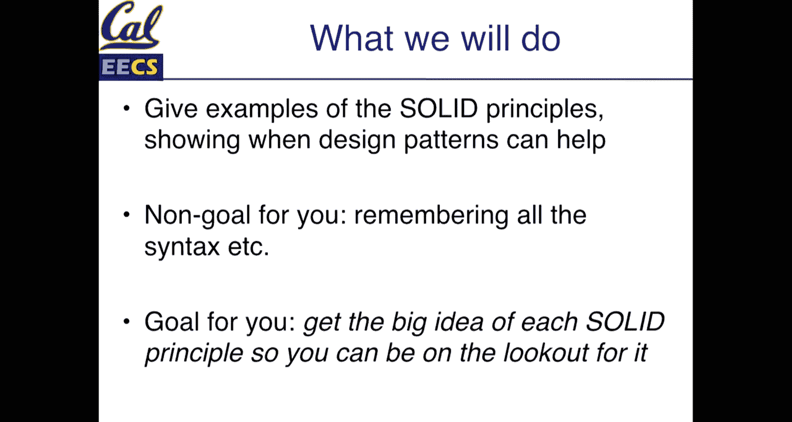
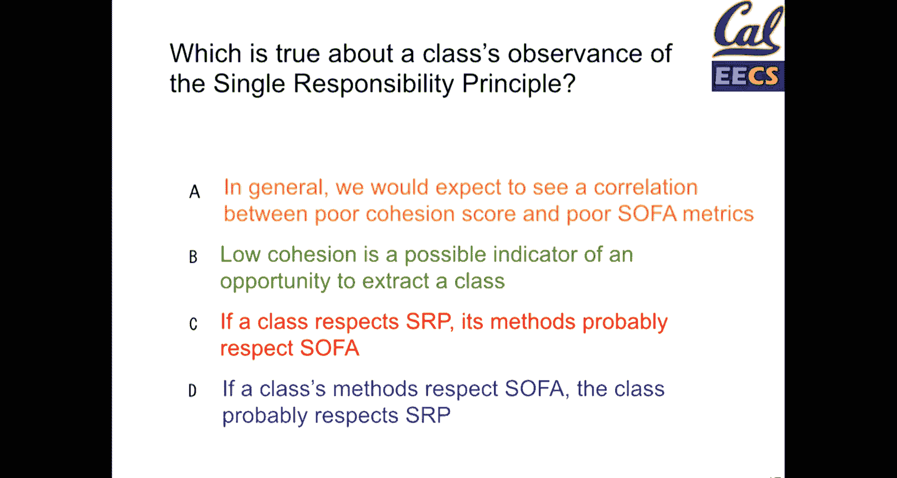
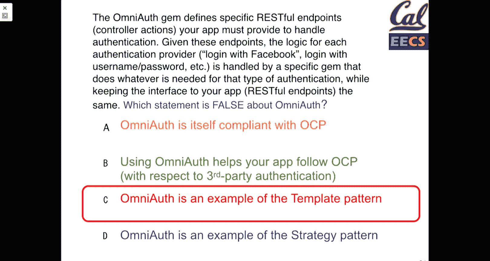
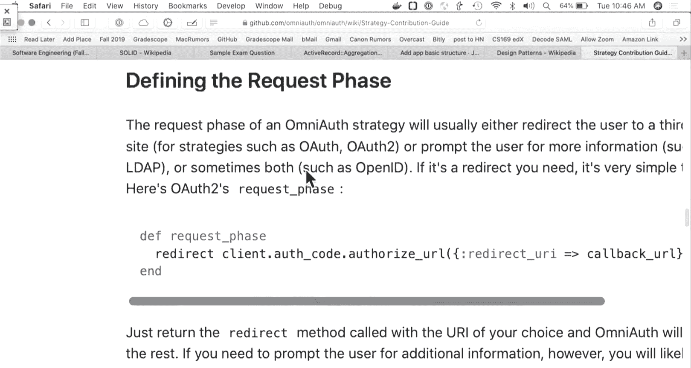
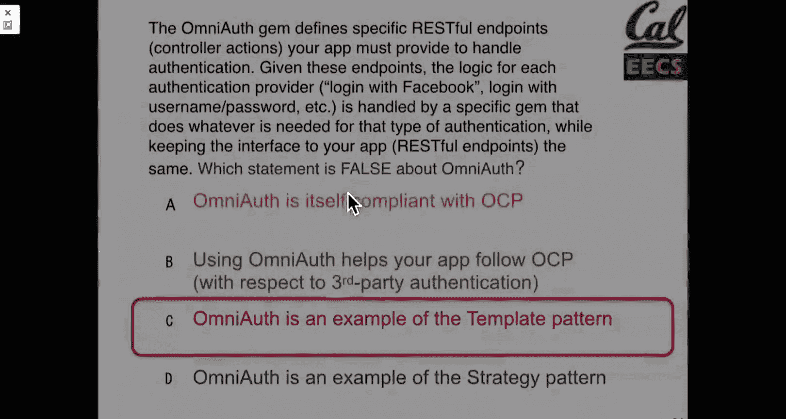
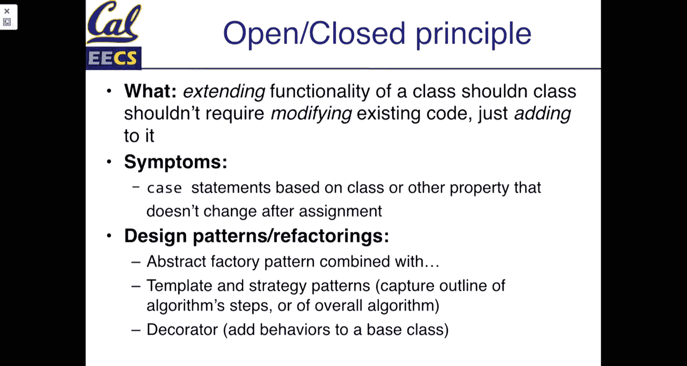
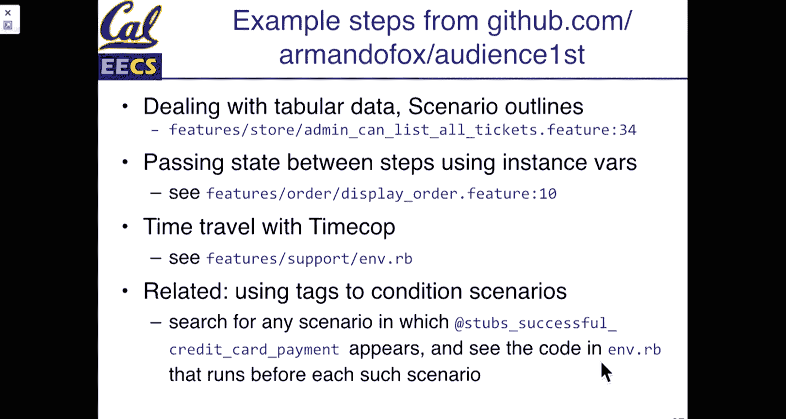

# 018：UCB《软件工程｜UCB CS169 software engineering 2019》中英字幕deepseek p18 18 CS169 18.zh_en -BV1UsB7YPEMj_p18-

Alright， Well， lecture is pack。No， okay， I'm not at all surprised， but that's okay。

 We'll just go through these things and hopefully everyone remembers too。Watch this video online。

If anyone in this watching this after the fact， hopefully they're not surprised that there's a midterm tonight。

呃。So the rooms are in piazza for anyone who hasn't seen them that is actually here。

Just remember to check the list of rooms because it's based on your student ID。 There are two rooms。

not on。哦，别。再微好。Testing。Yeah。Here we will leave this。Here for now。All right， let's see。

 let me actually slide that over here。And so。If anyone hasn't seen the rooms。Take a look on Piazza。

 so today's lecture are two topics。One， well， the big topic is software design patterns。

 So this would have all been great midterm material except power outage。 So some of you are spared。

 but the goal is。Using design patterns as a tool to make building software。Not just easier。

 but a little bit more reliable and then hopefully take some of the guess work about while I'm starting from scratch。

 how I do something I have。A problem。 I can't be the first person in history to have this problem。

 So where am might I go。 So design patterns come from architecture， which in the 60s and 70s。

 one of the original sum works on architecture design patterns was published。

 which was basically a couple hundred different design patterns for common engineering problems。

 So not necessarily specifications It's not like， you know。

 I need a bridge that carries six lanes of traffic X， Y， Z ways。 but。

What are the types of patterns that you should think about when architecting a new building。

 a new bridge， something like that， and so the idea is that a pattern is really a template that we can follow that gives us a lot of particular and concrete advice but is open to a specific implementation。

And you these are separate from principles， they're not something like dry in which it's sort of a goal。

 but they have a set of recommendations and the theory behind each of them so in software there are a bunch of different kinds of patterns so this course we talk about really high level architectural patterns so model model view controller is one。

It's still on okay， it's just the room。It's just it' recording。Cool， thanks。Testing， yep。So。

To continue along， we've seen Model view controller in CS169， if you've done Maxx Unix programming。

 pipe and filter is an architectural software design pattern where you pipe the output of one command to the input of the next command。

 So if you've done something like sort pipe and then unique in Uni。

 that is a software design pattern。Event based。 So this is something that jascript is particularly famous for。

 All of your dom interactions in the browser are event based， where。You might say button。

 and then you have an on click callback handler， so that is an event that clicks that gets dispatched to a function that gets called。

 and so that is a design pattern， node JS because it is a JavaScript software environment also uses event based programming。

And then at sort of a meta level， the layering of the Saas software stack or the layering of。

The Internet protocol stack， if you've taken CS168。

 these are architectural design patterns that exist outside the realm of software。

 or outside the realm of code， but sort of communicate how we design and think about software systems as a whole。

There are also sort of computational design patterns， so fast Fourier transforms。

 if you've taken an EE course， you've hopefully seen them。

 FFTs get used for all sorts of things in computer science。Anything around signal processing。

 of course， but they are a pattern that can be applied to lots of different domains。

 whether that's image processing， audio processing， all sorts of signal processing。

 similarly linear algebra is a pattern for solving certain kinds of tools and systems that is useful and so。

Those are all there what we're going to talk about today are what are sometimes referred to as the gang of four patterns and they come from。

A book in the 1990s called Design Patttererns， if you look at the Wikipedia entry for design patterns。

 it just references this book and we are of course not going to go through all of them。

 but we're going to over the next few weeks， go through some of the major highlights。

And the goal will be as we encounter a， you could say an issue with a code。

 a problem that we're going to try and solve， what we're going to do is look at how we might initially write that code and then how we can use a design pattern to help us。

Improve or fix or scale that code to change in a way that is a little bit easier so there's 23 of these。

 the goal is that they capture really common challenges that you have with software and that they are recommendations for how you might address some of those challenges。

So there， again， patterns are not a full design， they are not a specific implementation。

And they're higher level than just when we talked about function level refactoring。

 they apply to the classes that we're working on， the interactions with classes and we'll see some of that。

They have structured these into three high level categories。The creation of objects and instances。

The structure of those， so how these instances interact together in a sense and behavioral。

 the things that they are supposed to do。And。This is sort of a loose breakdown in practice。

 The boundaries are sometimes fuzzy。 So we're going to go through over the next few lectures。

 probably about a half dozen of them， but。The goal here again， is not to memorize like， you。

 when you see something like the facade pattern。 Okay， now I know where to apply in every sense。

 but to be aware that these patterns are tools and things that you can reach for。

 So when you're trying to solve a problem being like， this code has gotten suddenly messy。

 how do I refactor it well。Just start Googling for design patterns and some of these things will recur as options for you。

When we talk about design patterns， there are also anti patterns and anti patternss are code that looks like it should follow some design pattern that doesn't so。

As you go through the examples， some of these will be made a little bit more concrete and make sense。

But when you're going through。You know it's an awareness that there's probably something I could do to make this code easier to work with。

 make it more flexible and adaptable。 This is one of the most common manifestationfests of technical debt if you had an internship or work in industry this is often just referred to as tech debt and is one of those things that gets thrown around all the time and tech debt is really just the accumulation of software being changed over time without necessarily the time or ability to go back and cleaning things up so。

That is something to be aware of if you are working on legacy projects。

 things that have lived around for years， those have certainly accumulated some form of tech debt and so。

You know while your goal of this course is again to deliver features as you go through and adapt the project。

 then the more you can do to address and improve the quality code， the better of course。

 so some symptoms of this that we'll see commonly viscosity is。

A term for when it's easier to sort of just hack through a new solution than to refactor and do the right thing。

 this is。Especially for software engineers who have a deadline。

 it is easier to meet a deadline often by hacking through code than trying to refactor it。Imobility。

 so when you have。codeode that you can't necessarily refactor and dry out that is repetitive。

 which also goes into needless repetition， so this is stuff that could probably be refactored or abstracted but hasn't and conversely code that is overly general one class that tries to do everything is a form of an antipatter。

 so needless complexity from being overly abstract or overly generalized so。

How do we think about these？This is of the acronyms in this course， of which there are many。

This is one of the acronyms that you should absolutely come away with from this course。

 and they are the solid design principles。😊，And if there is one letter in this acronym that you should come away with。

 then it is the single responsibility principle， the other four letters loosely follow from getting an understanding SRP。

But there's a couple examples later， when you go and build software。

 these are things that do actually come up in real conversations while trying to build software。

 They， of course， come up more naturally and more often from academics than people who like software engineering theory。

 but even among。Just programmers on teams， these are tools that get referred to when looking at things like a Po request or trying to decide how it would structure a system。

Solid comes from Robert Martin， who is one of the co authorsors of the Agile Maneso。

 and the idea here is that。These are goals and ways of thinking about how we should structure structure object oriented code and through exploring these we'll look at some of the specific design patterns from the Ging of forbook so single responsibility is the first and kind of largest one and we'll talk about that open and closed principle is。

Working with classes， so those are the two that we're going to hit today。

 listsov substitution principle is another idea about how you can。

Structure classes and subclasses that interact with each other。

We're going to use I for injection of dependencies。

More traditionally referred to as interface segregation principle。

 the interface segregation principle follows a little bit more closely from SRP。

 but is more applicable to things like Java and C++ that are compiled languages in Ruby JavaScript injection of dependencies is a more useful pattern to think about and something that is also in some ways easier to get wrong。

 at least if you get the other four things right， and then the demeor principle。😊。

These will be things that we'll see if you use REek or rubocop with a RE configuration that does automatic code liing。

 there is a rule for some of these as well， so if you just install rubocop ruby critic Reek any of or many of the common gems for doing code analysis you will see messages that suggest looking through some of these design patterns so。

Last week， we talked about function level refactoring。

So you when we look at an individual piece of code， we have code smells。

 design patterns exist in the form of design smells as well。So higher level。

 how multiple pieces of code interact with each other we have。

Both of them have lots of patterns that we can apply。

 both of them have attributes that are more or less solved than ruby and some that are more difficult to work with。

You know， again， high level versus small level， we'll talk about a couple metrics today as well。

 lack of cohesion in methods is one。😊，And then。Sofa were our acronyms for function level refactoracturing today。

 it is solid for design patterns。Again， and the four So short do one thing。

 a few arguments abstraction， there will definitely be questions on that tonight。

 we won't have another midterm， but there will definitely be micro quizzes and things on solid and architectural design patterns。

So how are we going to go through this， Well， we're going to look at some code。

And we're going to try and look at how would we normally adapt this code and then how can we apply one of these design patterns as a tool to adapt it in a way that it will be easier to maintain going forward。

 the goal is to not memorize the syntax of the code that we're using or the features that are there。

 but to make you aware that these things are available in Ruby。

 particularly some of the stuff around meta programminggramm。

And really it's to understand when we say， you know you should look out for things that violate the single responsibility principle。

 you have an understanding of what that is， how it might show up in code and then you will go and say how do I solve single responsibility principle to Google and there'll be a bunch of resources that you are ready to take advantage of but again the Wikipedia article on the G of four and on solid principles like those are actually pretty darn good starting points for references。

😊。

嗯。😊，You know keep that in mind， any questions so far before we move along？Cool， so SRP。

 probably one of the most important things that we can talk about in terms of object oriented class design。

We have said that functions should do one thing and they should do one thing well。

This extends exactly the same way to our classes， so our user class should do one thing which is handle the logic that users need and it should only do that it should not interact with things like I don't know。

 orders， courses， you know other things to the extent possible of course。

One of the way to figure out what is a class's responsibility is。

Can you document the overall goal for this class in。You know， a sentence or two。

 some people say less than 25 words， particularly number not as important。

 but you know can I write a comment at the top of this file that is easily readable that says this is what this file represents and what it should do and if you could do that then you have a pretty good guidance for what belongs in your class。

And。What we're going to do is look at how we model。You know， things that have lots of behaviors。

 So our user class， the thing that's kind of in the middle。

 How do we pull apart the pieces that we can break off into smaller subclasses or。

Related methods and instances that will make。A code easier to work with and reason about So the first question is how do we know if a class is violating the single responsibility principle well。

 for some of the projects that you work on， you will have an intuition by just looking at that file and especially for user class。

 this is not uncommon you know the user class is the thing where well。

 there's always a user logged in So if I add things to know about its courses list or its order history or。

You know， the number of tickets that it's bought， all those kinds of things， you know。

 end up being thrown into the user class。 But there are some metrics that we could define。

 So lack of cohesion of methods is one of them。 The rough idea here is。

Are all the methods in my user class or are most of the methods in my class that I'm working with relating to a similar concept and one of the ways that we measure this is by seeing if they use related sets of instance variables and instance methods so do I have an instance variable in user。

 let's say a name which appears and is used across a lot of my methods。

 well that is an indication that that thing belongs in this class do I have methods in instance variables that are only used once that don't have any related。

Data， those are things that we can pull out。 So the first ecom formula， again。

 you don't need to memorize this， but it is a tool。 It's essentially just。Awaiting。

 so score between0 and1， the sum of our instance variables and our methods。Divided by the number。

 the multiplication of them。 And normally the tools will exclude the trivial getters and setters。

 So like active record rate will add methods， name equals and name。

 and those can kind of be excluded。 The math there is kind of。

It's annoying to count but the tools do it for you the more interesting one is a related definition which is sometimes referred to as Alcom 4 I don't know why it has number four there's probably some interesting history there but the idea is if you were to graph the instance methods and variables and where they call each other or get called。

😊，You would have a series of nodes with edges that sort of map out your class。And。

You want to count the number of individually individual connected components。

 So if you have a series of methods that are their own connected components。

 so if you've taken 70 or 170 a connected component being these things all refer to each other and then in our graph we have some separate connected component that isn't at all tied into our main sort of graph then you could you could separate your class by different different connected components so basically if I have three methods that all refer to some data that you know let's say an address and those three methods that do something with an address aren't called by any other methods in our user class and they don't rely on much data maybe there's an idea that we could extract those three methods into a very small address class or something like that。

 And so this is a tool that。Again， don't start like going through past projects code and counting things。

 but be on the lookout for it if you're using any of the automated tools。

I reference the fact that people like to debate about these things and there's been a question over time of do active record models violate the single responsibility principle。

 So in some senses， it seems like they do， you know， active record model， So our user model。

 our courses model， our movies model。They load things from the database。

 they know about associations of how they relate to reviews and users。

 they have all these validations， and then of course each of our individual models do all the custom work that we tell them to do。

😊，The reason that weve most people agree that active record。

It doesn't necessarily violate the single responsibility principles that Act record itself is a series of modules that can be included。

 And so when you write movies as a subclass of active record based type。

What you are doing is you're including a bunch of modules that individually handle things。

Like validations。Excuse me， and database connections and what you should be focusing on in terms of a single responsibility are the functions that you write for your own movie。

 do those things all relate to each other。 And if they do all relate to each other， then you're good。

 if you've got a lot of things going on， then that suggests that you can refactor that so。嗯。

To make this all concrete。We'll look at an example， so this is a little bit small。

 but we'll go through it。 So we've got a customer here。 We've got an initialized method。

The customer includes an address， and our address has a customer。

And so one of the things that we can do when we're talking about abstracting small classes is let's say our customer is a database table and we store quite a few attributes on this customer。

 so we have a customer's table， it knows things like the customer's zip code。

 the customer's street address， maybe their phone number。Those kinds of things。

 but we have a lot of methods that relate to doing logic with addresses。

 maybe that's calculating the tax rate， maybe that's formatting them properly， you know。

 maybe that's just looking up a broader geographic region。

So we can create a new model or a new class called address and note that in our rails application。

 this model doesn't have to。Inherit it from active record base types。

 So this is a model which we're going to use to structure our code。

 but it's not going to be stored in the database separately。

 We could decide if we wanted to to make an address table that has a user ID， but。

Maybe that's not necessary， maybe this is you know。

The S's already been built and we're just trying to make our code easier to work with。

 so we just extract a small class on its own。And so one of the things that we can do when we have this is。

It allows us to take these related methods。Rils gives us this nice delegate to。

 So if we say address zip code， it just looks it up from the customer。

 which would be the actual active record model in the database and any methods that we add on address belong in our address class and they make our customer class smaller Well。

 why is this better well， if we're thinking about writing tests especially unit level tests。

 then when we're making an address R spec file， we don't have to think about all the things that a customer might interact with。

 we just have to make sure that we have the four or five fields that are relevant for address。

 And if you want we can make a nice little UML diagram for this So it shows here that our customer。😊。

Is an active record class。But in。It has an attribute， which is of the type address。

 and this address class delegates some of its attributes to the customer。

 And so this just makes them easier to store in our database since that's where they belong。

 And so extracting out small classes is。A really useful thing railils gives you a handy method called composed of it's not something that you will probably use that often。

 but if you're looking at how to extract classes， you can look at the documentation for composed of because you can say customer is composed of an address and these things are what goes in an address。

It's one of the more advanced methods， but can be a really handy tool。嗯。系。

let's see if this cooperates。Always， always an interesting question of whether iClicker will cooperate。

No， yeah， cool no。

Wherehy do we bet it？

All right， and now it's open。So。Which of these is true about a class's observance of the single responsibility principle。

 so one of these is false and as always， E is the W option。Allright。

 so we got up to just about 29 Co， so a good distribution which suggests that there's a lot to talk about。

 so take about a minute and talk with your peers as to why one of these， which one of these is true。

All right， so take another 15 or so seconds and put in a vote。And if you haven't talked。

 use that time to actually talk with someone， I know it's pretty quiet today。

You want to pass this to someone。See if I can get someone to respond。All right。We have。

 we have one less than we did last time。 I hope no one has passed out in the last 30 seconds。

 So who wants to make a case for。One of these answers， why we should vote， let's see， yeah。

 should why is a not true？Why is a not true？How about this， if people participate。

 I'll give you an answer to one of the questions on the midterm。对对。嗯。

Because poor cohesion score is more and like a class level and sofa metrics are more for like individual methods。

 Yeah， yeah so。That is true one thing that。We should think about so A is definitely not true。嗯。

And the thing that realized is that when we talking about individual methods。

 how they relate to each other， you they can all be nicely factored methods and things may not follow for the class as a whole。

 which basically goes to C and D， ACC andD all have sort of the same reasoning。😊。

Which is that if these methods are awesome or not the class as a whole has a different set of responsibilities。

 so the answer to the midterm question and you are seriously going to hate me when you look at it is question5 do not select option D。

 it is a select all question and you should select A B and C you're going hate me later because that question is pretty obvious but I got you to participate so score one for me。

But actually， if anyone does select option D， I don't know what I'll do。

 but seriously don't select option D because I will mark it wrong even though the rest of the question is obvious。

😊，So。More on the single responsibility principle。 So， again， what is it it's。

Giving a class exactly one responsibility or reason to change。

 so the more limited the responsibility of our classes。

 the easier they will be to adapt in the future。Symptoms of this or symptoms of not following SRP。

A high lack of cohesion， so methods that are unrelated to each other。

Long classes with clicks of methods， so when we say clicks of methods。

 there is a really good re tool that checks for this which is arguments that or yeah arguments to functions that follow in sort of packs。

 so if you ever have a traveling pair of arguments， let's say， in the case of our address example。

 you're always passing in street name， house number， zip code to a bunch of functions。😊。

That you all take these three same arguments， that's the suggestion that those three arguments together represent some entity that you should make into its own class。

 it may be a very small class， but by extracting those three things into their own entity。

 you can also extract those methods into that class and make it a little bit more clear about what applies to in this case the user versus our address。

And so。Yeah唔。It doesn't necessarily matter how many arguments there are again， if we're following So。

 we probably want to keep that less than four or five。

 but if you see a set of even two or three or four arguments that all travel together then that is a good idea for something that should be extracted away。

 so how do we make classes follow the single responsibility principle。

 well we extract smaller classes until they only do one thing well。

And that is the goal for single responsibility principle， so any questions on that so far？😊，Oh， cool。

 So moving right along， open and close principles。 So this one is。😊。

A little bit harder to reason about， but it also follows from the idea of doing one thing well。

This gets into a little bit of object oriented design， so to solve this。

 we are eventually going to take advantage of inheritance and smaller classes。

And the idea here is that classes should be open for extension but closed for source modification。So。

In the example that we're going to work with， we have this thing， we're going to call it a report。

And report is an object that has a method called output report， so maybe this is。😊。

Depending on your project， this could be lots of things。

 this could be an invoice for an app that you could render in different formats。

Potentiialally for something like a system like gradeScope。

 it could be a report that is your overall exam with your scores or maybe without the scores。

 there are tools that do things like checking for code similarity so there could be report in various formats so this is this will again sort of going into patterns that you see but a report can have different formats so when it's a website we might generate a view that's HTML。

So something that could be rendered online， we might also generate a PDF that could be printed or shared as a file。

 you might optionally choose to render have a JSON format of this report maybe something that an API could consume so over time you could see how we have a report it could exist in many different formats and we might end up wanting to adapt some of these formats。

When we have a case statement， so a case statement will be a particular sign of one of these smells。

😊，Close to source modification means that as we want to add new types of reports， so in this case。

In this case huh。The code doesn't support right now a JSON format。

 so if we wanted to add a type that was JSON， we would have to add a new case statement。

 say when JSON and then have a new report formatter。

So how can we do this without necessarily having to adapt our original class？

And one of the things that we'll look at is omniath。

Which if you've used authentication is a really useful gem。

Our goal here is to allow a report to extend to additional types of reports。

 so a JSN report may be variations on our PDF format report or report formatter。

 and this is our first of the design patterns that we're going to see。Over the next lecture。

 so the abstract factory pattern。Which has a very CSE name。😊，How do we avoid？

Open close principle violations in our report class so what if and the essential thing is what if we don't know all the formats that a report can take until runtime。

 so our report class is now instead of having a case statement， it's going to say。

 well I'm going to let whatever code I get passed in。

 render the report as long as this render conforms to some sort of standard。

 so the pattern that we're going to use is called the abstract factory pattern and along the way。

 we'll see a couple other patterns as well so。嗯。The way that we're going to do this is we're going to create an instance of a class that isn't known until runtime。

 so this is going to use meta programminggram， also known as introspection or reflection。

 We're going to look at the template pattern to look at how we might structure those classes that get passed in。

And then because there are many patterns that we can just continually improve and refactor things。

 we're going to look at the decorator pattern to extend how many classes we can。You have。

 so let me close that out。So this is the abstract factory pattern， so what we're doing here。

We're taking。A set of case statements， so when HTML， when PDFf。

And we're going to replace those with some meta programming。Again。

 this is the Ruy syntax that is going to be new， so we're going to say our format or class is going to be defined by our format。

2S。classify。conitize so what does this mean well there's a lot going on behind the scenes that Ruby does some really awesome magic。

But essentially our output is going to have a format， which is this string in this case， HTML， PDF。

And it's going to turn that into some representation that we can actually call as a class。

 So we're going to take this thing and turn it into a class of。

PdF report class or HTML formatter class， whatever this specific name is。

 but we're going to turn this。We're gonna turn this format into a real class object that was originally just a string so you can imagine that over time。

 if we have a new type of format， let's say JO， we just specify that in our string and you may have seen send before in some of your ruby code but send is just taking this rubby object and calling the do new method on it。

 it is a super useful ruby tool。 it can do all sorts of crazy things with meta programminggramm and like all super useful tools there is room for abuse here。

 So you have to be careful you know how many levels deep you apply these patterns but for something like this。

 if we know that we might have a lot of formattters we can。😊。

Make it really easy to extend the types of formatters that we support by just defining new classes in our application。

 so this is going to turn a string HTML PDF， into the name of a class that can actually be called and as long as that class exists。

 so as long as that class has been required at some point in the loading of your application Ruby will load that class。

 initialize it and it will and things will just work。So to add a new report format。

 all we would have to do is define a new JSON report class there is some extra work here around begin and rescue which is to say that now that we're doing some meta programming。

 we might encounter some new errors so if this is a checkbox that says report format you might risk having some input that might not fit your structure that the names that you are expecting so doing some meta programming you potentially have to account for errors that might not have occurred in the structure like this。

But this is one way of accepting。Our report class will now accept different kinds of report formattters because they can be dynamically loaded just by turning this string with some cool magic into a class that can be called。

Questions on this， this is in some ways， kind of crazy， other ways awesome。

 but it is doing a lot in just a couple lines of code。😊，Question。Is that a question in the back？No。

Yeah， I hand move， but。So。We have we have a report formatter or we have a series of report formattters。

 the question is。How do we make sure those report formatters work the same way So one of the things that we're going to do is use our template pattern and what we're really trying to solve here is we have a series of things so we have a PDF report and HTML report will they always do the same set of work and so the template pattern is used when we have a series of steps that are the same so the series of steps is the same but within the implementation of those steps。

 things might be different and so this is a really good case for inheritance。So again。

 some UML diagrams， we have our abstract class。And it's got a bunch of methods and it's got two different subclasses that have the same series of methods defined。

And this will allow us to use a template。 so we're going to look at a series of steps that happen in the same way。

 So these three methods are the same。 They all have a similar method that can be called。

The other design pattern that we're going to look at is the strategy pattern。

 So these two are closely related。 The strategy pattern is when we have a task that is similar。

 So in this case， generating a report， but the ways the steps to generate that report might be different。

 So it's a little bit more generic， which means we could apply in more places but because it is more generic。

 it means that it's potentially a little bit harder to comprehend and understand。

 or that there's a couple more places that things could go get a little bit more confusing when implementing the code。

 So we're gonna to look at both of these First， the template pattern。And then the strategy pattern。

And。How does the template pattern work where we said it's a series of steps， though the same thing。

 so we have our output report method。Our report has a title， a header and a body。

 so things that you might expect to see， this might be an exam， a report of scores， an invoice。

 and we say every report has to have these three things and it has to have the title。

 the header in the body。So。When we have subclasses of our report。Each subclass。

 instead of rebuilding the output report method， they're going to only overwrite the title。😡。

Header and not shown here， but probably the body method as well。

So you can imagine that the title method on an HTML report。

 well that might output some HTML title tag， it might output some you know H1 tags or something for the header method。

 the PDF report Trust me you don't really want to know how PDFs are built It's kind of awful there's great ruby gems that do it so it might call the methods on those really cool ruby gems that do all the crazy work for you Always great to use someone else's code to solve problems so that you don't have to。

And as long as those steps are the same， we have one output report method that we can。Always call。

And the way that this will work in yet another UML diagram is we have a report and there are two subclasses of the support HTML report and PDF report if we wanted to add a third kind of report。

All we would do is specify the new title header and body methods or whatever other methods we need。

 and that report could be called in the same way。 So a template pattern again。

 is taking these three sets of steps or however many we have and saying this is the part that differs for each。

For each type of report that we have。So。The question is not every case follows the same set of steps。

 right， you can imagine that there's some format of report where we need to do something a little bit different than just having a title a header and a body。

So。We can use the strategy pattern。Which says I'm going to delegate the output report method to the class or to another class。

 the classes that could be subclasses。And so it's a really subtle difference here。

 but it gives us a little bit more flexibility， instead of defining our steps。

 we're going to define unique output report methods for each of our types。

And in this format we're going to pass in the class of the formatter as an input to a report。

 so we're going to have a composition of our classes so that we can call formatter output report so if this is more flexible。

 why do you not or why don't we just use this all the time？

Which is a great question to ask we don't always we don't always need to jump to something like a strategy pattern if our series of steps is always the same so whoops wrong direction。

 if these three steps are always going to be the same and we know that like this is always going to be the same then it's fair to just say you know our subclasses will implement these three methods and that helps keep them a little bit more consistent of course。

I use the word always， always is never true in software， which means that if I say never。

 then sometimes there's probably a case where it happens。But it is a tool that can be used。

And this is known as composition， so this formatter gets passed in here。

 we are composing these two classes together。So。How does this look in UML。

 so the UML is not necessarily as intuitive in this case？

But we have a formatter and we can have PDF formattters。

And we're going to go a step further and define even multiple kinds of PDF formattters。

 so things that have encryption with a password and things that have a watermark so why might you do this well maybe you are an ebook provider and you don't want people to just upload ebooks that are copyrighted to torrent sites so you put a password on them or you watermark them。

 so if you share the ebook， everyone has your email address and there's maybe some shame associated with sharing things that others paid for so。

What does this look like？This is a lot of code here， so again。

 don't worry about going through all of it， but we'll highlight the big pieces。

 so we have our PDF formatter。This has our same initializing output methods。

 and instead of defining the steps。What we're going to do is define。

An initialized method in our subclasses that takes in the parent class。

Our PDF with password formatter is going to take in a PDF formatter or maybe even another kind of formatter as its base。

😡，And what it's going to do is it's going to define an output method that calls the base format or dot output。

 and it will decorate that method with a specific internal method that sets a password。

 so we're taking some input to our class that is another class。

Calling that method and then doing something unique to it， so this could be a password。

This could be encryption or a watermark， anything， anything unique that might happen to that PDF。

These two classes， they look very similar， but the unique part here is the password or the watermark methods。

So what advantage does this set up bias， Well， if we have a basic PDF oh whoops， no， don't do that。

No， no， no no if we have a basic Pf with nothing special， we just get to call our PDFf formatter。

 but what if we want to have a PDFf with a password， Well。

 we can call PDFf with password formatter and what is that Pf with password formatter use， Well。

 it uses just a basic Pf formatter as its input。That seems nice。

 we could have gotten that with just simple inheritance。

But what if we want a PDF with a password that is also with a watermark？Then we can。

Pass a chain of classes into into another class。 So no。

 I don't want to tap up so we have our Pdf formatter。

 We pass that into our Pdf with password formatter。

 and then we pass this object into our Pf with watermark formatter。 So how does this work。 Well。

 when we call output for Pf with watermark。 we're going to add a watermark to the output of a PDFf with password。

 which is going to add a password to the output of the regular Pdf class。 And so。Why is this useful？

 Well， this allows us with。A base class that is really simple to have a class that adds passwords。

 a class that adds watermarks， and it allows us to have a class that adds watermarks and passwords without defining a PDF with password and with watermark class with two things you know it may be simple enough if I have only two permutations So just say it's not too hard to define a watermark and password class it's a third class。

 it's not that big of a deal why don't I just have a third class and if we stick to three classes you're probably right a third class not so much of a big deal but what if I have a PDF with large type class and then I want a PDF with large type and a password and a watermark or one or two of those the composition allows us to。

Really give us flexibility without defining every single permutation of options that might exist in the world。

 so if we have something that has especially three different permutations or three different options that could be permed。

 know that would be three factorial with or if ordering matters。

 maybe it doesn't to nose you know you don't want six different subclasses。

 if you have like four combinations， you really don't want 24 different subclasses that could define all possible orderings that would clearly be a nightmare。

And so composition gives us this flexibility。Without having to define every possible way that things can be combined。

 So there's a note here。 We're not going to get to this today。

 but it will be probably on Thursday and if not on Thursday。Then next week。嗯。

L or listov composition or substitution is just saying that these two things are instances of PDFs and that's important because it makes them interchangeable。

 we'll talk a little bit more concretely later about how that works。

 but for now the goal is just having things that are interchangeable so this is a decorator pattern。

You have used this， hopefully an active record， so scopes are a really good example。😊。

You may not have used scope specifically， but the query methods also follow this pattern。

 where order by joins。So scopes are if you haven't used them are really cool。

 you define them at the top of your model。And you give them a name and a set of conditions that。

They apply to， so movie。4 kids with good reviews。So this would be a scope called for kids。

 this probably is something like where rating is PG or G， maybe just G。

 and with good reviews so movies that have at least three good reviews， scopes can have parameters。

To them， if you haven't used them。But what this does， this would take a scope。

 add another scope or method that chains onto it and modifies that query。

 So this allows us to have a chain of things that say the G rated movies that also have three good reviews without creating a method that is G rated movies without also three reviews or some number of reviews and we could extend extend this in many different ways we could have another scope。

With many fans and recently reviewed， we could even with just the three or four scopes that are here。

 combine these in another set of ways to say you know movies for kids that are recently reviewed。

 movies for kids that have many fans and so on， and so decoration allows you。

To really combine the many possibilities for an action without specifying beforehand every single possible combination of possibilities。

 and so scopes are a really great manifestation of this，Because they。

They allow you lots of flexibility with a relatively short amount of code。And the idea here is that。

This flexibility， it's all about composing things rather than a typical object oriented inheritance。

 since we can't create every single permutation of classes。So。

Questions on that before we go do another example ofOop。no。Unfortunately。

 I don't have any other exam questions that I know they answer to off the top of my head。嗯。So。

The hard thing about this， I said， you know， talking about a report class。

 if you know that you're going to have different kinds of reports。 Well， in practice。

We often don't understand how our code is always going to be adapted in the future。

 This is why software engineering is a really hard thing。 This is why， or one of the reasons。

 aside from just general economics， why software engineers actually make decent money and why。

 like you can sit for8 hours writing code and feel really exhausted。

 Its that these are hard problems that you don't know the answer to。

 So sometimes you have to pick and choose knowing what I know today。

I think that my class is not going to change in X， Y， or z ways。Or knowing what I know today。

 I think that I'm going to need to support more of this kind of adaptation in the future。

And that will help you structure your classes in a way that respect the open and closed principle where it will make the most sense to。

 but in practice， you can't respect the open and closed principle on every single possible thing that that class can do because it will just be too overly generic and pretty confusing。

 So like all design patterns like all tools， there are limits。And again。

 because we're practicing agile， this is one of the things that can help， which is。

You the more you have interaction with your customer， the more you're working on short iterations。

 developing code。TheThe sooner that you will understand how something is or is not likely to adapt。

 So especially early on in a project， don't try to solve this for every single case。

But as you see code adapting， as you go from one iteration to the next。

 if you have requirements that suggest。You know today your customer might say well right now this view on the website is really important。

 but in the future， I think we might need to report this information as an email。

 I think we might need to download it as a CSV or as a PDFf or I think I might need to view it or format it in some other way。

 Maybe that's a hint that this thing that I'm building might adapt and so。

Frequent customer interaction， relying on TDD are all tools that can help you adapt your classes going forward。

Again， if you use all these things， it'll hopefully be easier to adapt your classes so that they can be extended going forward。

There's a bit of text here。 So omnioff， before you start reading it。

 if you haven't used it is a really awesome gem that allows you to。😊。

Connect with all kinds of different authentication strategies。

 so that could be like a login with Google button， a login with Facebook button that could be even like login with Calna@ Berkeley。

 because it has tools that support all kinds of generic authentication so the Omniath gem defines several restful endpoints controller actions in your app that that your app must provide to handle authentication。

 so Berkeley， Facebook， whatever it is， etcter。😊，Given these endpoints。

 the logic for each authentication provider， username and password。

 Facebook is handled by a specific gem that does whatever is needed for that type of authentication。

 so that would be an omnioff Facebook Ge and an omniathth Google Gem。

while keeping the interface to your app restful。 So which of these statements is false。

 So Omnioff has an omniath Google， an omniath Facebook Ja。

Which of these statements is false with respect to omniathth and the open and closed principle？

All right， it seems like 30 is about where we are today， a few E's that's cool， that makes sense。

 awesome， so there's a lot of disagreement， which means there should be vibrant discussion。

So take a minute and discuss with your peers about whether or not Omnith and its set of Omnioff。

 Facebook， login， et cetera， gems violates or does not violate the open closed principle。

 and which of these is not true。啊对。あそ it just。Yes。All right。

 take another 15 or so seconds and put in a vote。Let's see if I can pull up the Omniath page。

All right， let's see if we can get five more votes in。Two more， can we get two more。

 there was 30 votes last time， cool， one more。阿some。Cool， so a few E's。

 that's good and most of the answers now are C's， so awesome does anyone want to make a case for why C is false？

It want to make a case for YC is false。Conversely， you could make a case for why A。

 B or C is true if you would like to as well。But。Any of those are good options。Fortunately。

 I don't have any midterm answers to promise anyone。Most people got this right， so that's good。Sorry。

 someone want to just take a guess？As to why。You voted for C， so you had some good intuition。

You at least can't be wrong there。Thanks。So。So doesn this description of omnios doesn't really mention it has any templates in it。

Yeah yeah， so it doesn't mention anything that looks like a template that there are a series of steps that every single thing has to follow。

We'll jump to questions about this in a second， I'm trying to see if I can actually pull up。

The Omniathth page。let's see。No， not really what I wanted to autocomp but。That may work well enough。

So Omnioff implements a strategy pattern and one of the reasons that you can。

Figure this out is that if you look at the omnith documentation。

These things are indeed called omnith strategies， so Omnith， Facebook， Omniathth， Google。

Are omnioff strategies。 Why are they strategies， Well。

 they're strategies because at a really high level， let's actually see if this is。

Easy enough to pull up an example。嗯。😊，At a really high level， they are very declarative。

 They define just a few fields that they need， and it's up to。系。It's up to each gem to specify。

Just one or two methods。That the Omnioff strategy would use。

And so。In practice， these are strategies， how do these help follow the open close principle Well A is really important because this means that every time you want to add a new authentication type to omnith all you need to do is build a new omnith compatible gem or if it's not a full published gem。

 it could just be a library in your application and so you there's one omniath thing。

 you add omnith to your gem file and then you add omnith Google and then omnith Facebook and then you add like omniathth my weird login scheme and all that works without ever adapting the original omniathth gem。

 So omniathth itself。

Follows the open close principle。 how does that help your application follow the open closed principle so it doesn't help with things outside of authentication。

 of course。 but within that scheme it allows you to say if I'm going to add new login methods all I need to do is add a new omnios strategy to my application。

 you might start off with an application by saying let users log into Facebook and then it turns out that your customer is now afraid of Facebook and like well。

 I don't really like Facebook that much so let's add login to Google and then like three years later。

 Google ends up to the news for something terrible andre like well let's add a new social network that we can log in with and so each of these strategies。

😊，I am mostly joking about that but this happens far more often than you would expect in reality。

 then each of these strategies you can adapt and add without adding any additional code。

 you just have to add whatever configuration parameters for those specific websites。

 so Omniath does help you follow in your own application open and closed principle as well。😊。

And they're called strategies。That's a bit about open close principle。

 those are our first two design patterns for today questions on design patterns。

 there were a couple E's， so hopefully that helped but questions are good in the back。

 was that a question no。So yeah， can you have like two different。个。Yeah。

 can it be so certain things can definitely follow。Two patterns。 so in the code。

So like in this code here， our report class in this example might be making use of the abstract factory pattern。

And then our individual reports could either be using the template pattern or the strategy pattern so we can pull them together。

And if we go back to all the way back。To this list。

 there are certain versions of these patterns that will compose together know， more easily。

 and some of them are not always entirely distinct。 So like there's a whoops。

 there's a factory pattern and an abstract factory pattern。 Okay， well。

 we're not going talk about factory too much， but like。It's， you know， just a little bit different。

 it's less abstract in the sense there's less meta programming， but you know。

 so abstract factory is kind of a variation， you could say on the factory pattern。

 the neuralll object pattern when we talk about it is something that is relatively easy to combine with other patterns。

And even omnith， it more closely follows the strategy pattern。

 but there is more than one method that each of the strategies need to implement， gosh。

 there's so many effects， so you could say that they potentially follow a little bit of the template pattern but it's again more closely a strategy because it's pretty high level and they are very composable。

And as we go through these， we'll see a few more that could be combined and more easily or less easily。

 but it'll kind of be a mix。 Yeah， that's a good question， though。

 Any other questions on design patterns so far。嗯。Cool， so。A bit of review。

 So the open and closed principle， extending functionality shouldn't require modifying the existing code。

Symptoms in your own code to watch out for case statements， so the initial example， when HTML。

 when PDF。Those are a pretty clear example， you could look at repeated conditionals as well。

Conitionals don't always necessarily indicate something that should be extracted right。

 if login count or let's say maybe failed login attempts greater than 20 lock account。

 that's not necessarily something that you might extract for open and clues。

 but if you have a lot of repeated conditionals， if type equals a if type equals B。

 you things like that。Calling methods from a hash of types is a similar thing to a case statement。

All those types of things suggest that you might have a refactoring。

So the abstract factory pattern can help here by allowing us to dynamically find the thing that we can call。

 so again， turning a string into something callable。

The template pattern helps us implement the instances。

Of those reports in this case were of our objects that get called and the strategy pattern is another form of structuring those instances as well。

 and by using the decorator pattern we can compose our types of classes together in a way that gives us more flexibility without defining all possible kinds of classes。

😊，These are things that。We， you will hopefully get a chance to see in your own projects。

 But as you go on projects outside of just Ruby， outside of rails。

 these design patterns really do apply to。All sorts of different kinds of projects。

I can very much tell you that。The program language Snap that I work on has examples where there are conditionals that have like 20 different kinds of case statements that would benefit from being refactored。

 like all code， who has the time to do that when you're just working on things on the side。

 but they are patterns that have cross-cutting applications to lots of things。

Those are our first two design patterns。 We got through the S and the O and solid and。

The last bit for today is the recurring theme of some power tips for cucumber and Cappi Barra。

 things that will be sort of inserted as you get deeper into projects。

 these are things that you may have gone a little bit of experience with or you may want to add as you're ramping up so。

The gem launchie is pretty cool。 It lets you launch a web browser as you're going through and running your cucumber steps。

 You don't always want to do this。 In fact， like if you're running tests on demand and Chrome suddenly pops up in your face that could be annoying but launching is really useful for when you're exploring an application especially early on or you're trying to debug something I forget what the exact syntax is。

 but you can say like run these cucumber steps and open up real Chrome and show me what is happening on that page as it's going through and so you get to see the browser animations happen as the tests are progressing so like if there's a fill in form field with text you will see text appear in that form field then you'll see the little button press and so on and so that can be a really useful tool。

😊，U。It adds the save an open page method which is useful。

 this is also really easy to find yourself if you don't want to add a whole gem。

 which is Cappybar gives you a save page method and it gives you an open page method。

And you can do that with then show the page and sometimes depending on how your JavaScript is loaded。

 this can get a little bit messy， but this is what it works。

 it is really cool to watch seeing things happen live and depending on what happens it very quickly becomes distracting if it's unexpected。

 so I wouldn't leave this in your cucumber steps because your teammates will probably be shocked when something just pops up in the middle of their testing。

 but as a debugging tool it is incredibly useful。So。

There are a couple really useful things around Cappi bar cheat sheets。

 There is a rails command to get it。 There's also a couple cheat sheets that are online。

 One of them has been linked on piazza。 I forget which post， but。

It's there as well The main object again is the page and so within the page object you can control everything that's happening on the web page。

 so again things that you have hopefully seen finding with some CSS having a particular selector。嗯。

Let's see， not on this slide， but things that you can do with the page object。

 you could inject custom CSS and you could inject custom JavaScript just for tests。

You might be trying to debug something that is a little bit messy or you might be trying to reduce。

Some animations or something like that in your test cases。

 so within the page object you can execute even custom JavaScript so if you're trying to test some react code with Cappy Bar because you want a whole level integration spec。

 you can use page。 execute script。As a really useful tool， again， super powerful。

 but something that you can， if you're not careful， take way too far。

For those of you who have audience first， again， another example from this， which has。

A good history with a lot of tools。So working with tabular data。

 there's an example of this earlier on， there's some specific scenarios there。

APassing state between steps。Instance variables are a really awesome case there if anyone has applications that deal with specific dates and times。

 so for those of you that are working on things that deal with submissions。

 especially if they have like a closed date or release date， theaters have times for shows。

Those are really useful to address with timeC， which is a really nice way to just fake what time your specs think it is when they run。

嗯。And then you can use different tags to search for different scenarios and so we're not going this one may not be useful in every case。

 but there's some nice examples where you can look at the environment code for there and that really is it for today。

Just keep in mind that as you're using Cappi Bar， there's a whole bunch of advanced stuff that you can do。

 And so if you're running into something， feel free to post on Piazza。

Take a few minutes to look through any of the apps that are on the SaSbook Repo or this one I guess is under Amanda Fox's account。

 but they all have lots of good examples for how you might get advanced testing done so we'll see you tonight remember to look at the piazza poster rooms it's based on the last digit of your student ID so please show up to the correct room and good luck。

discussion Yeah， discussion。 Okay， yeah。

佢。