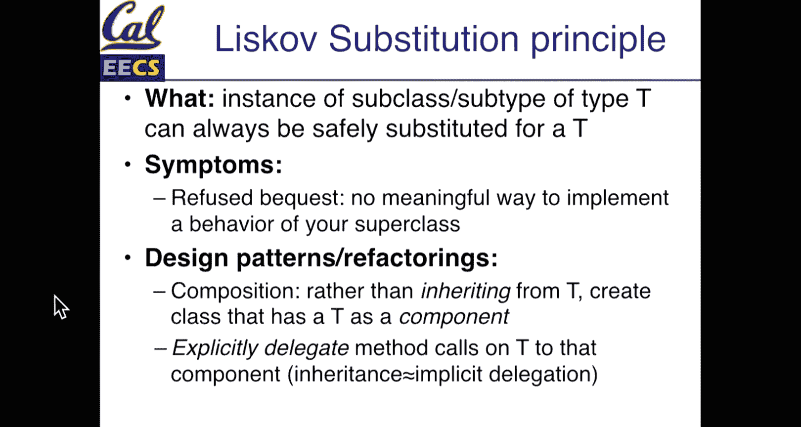
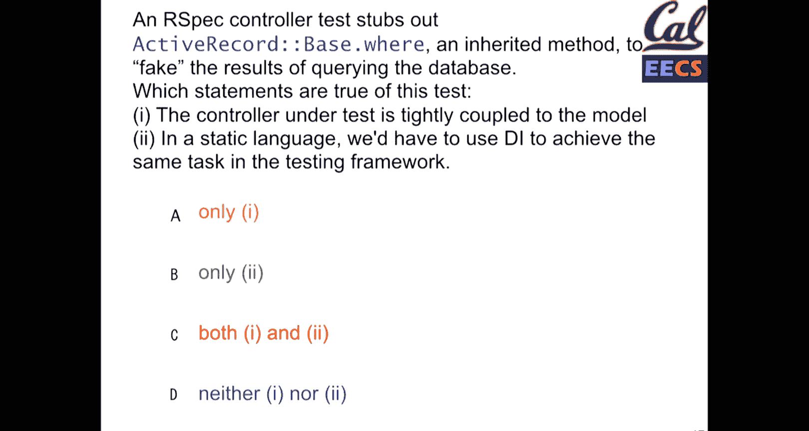
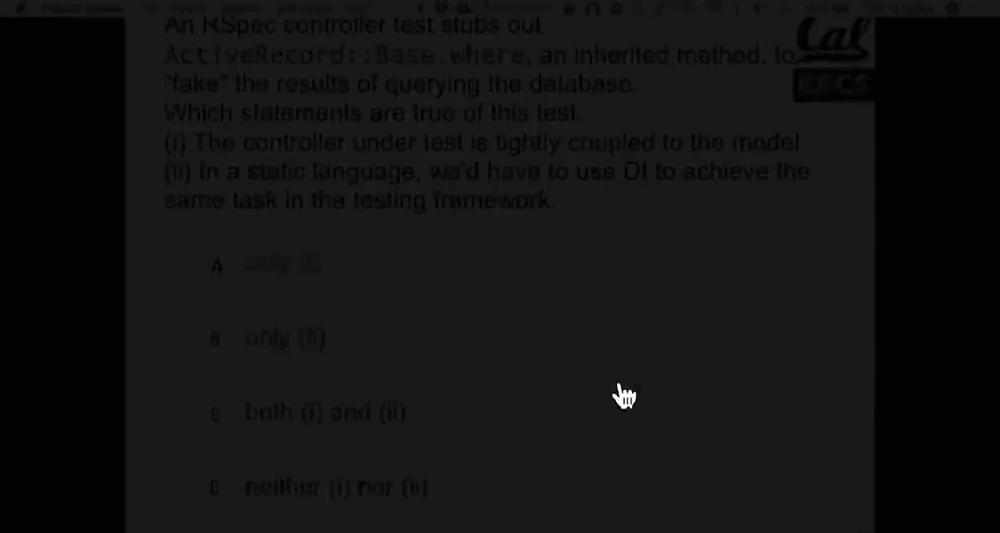
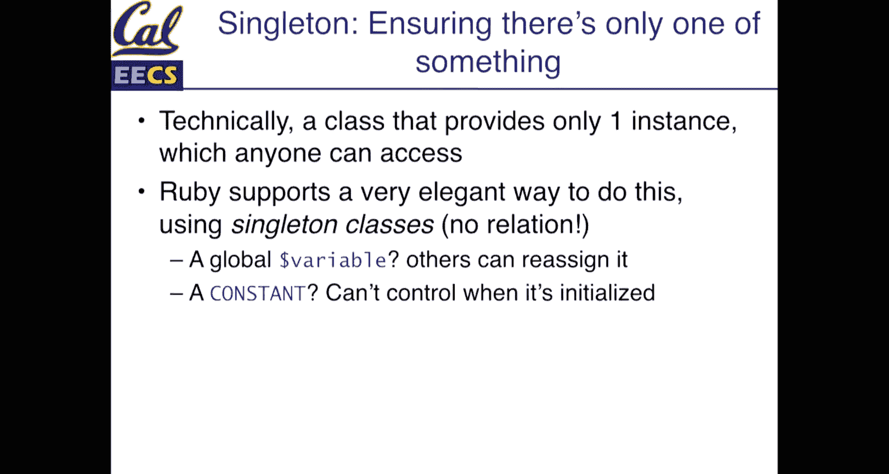
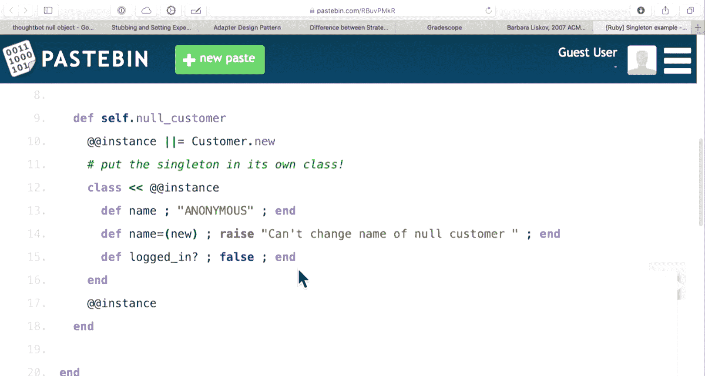
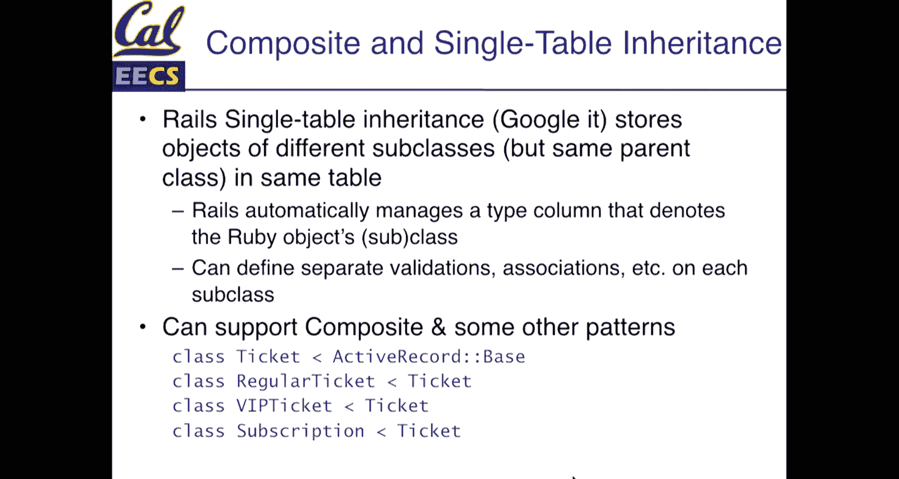
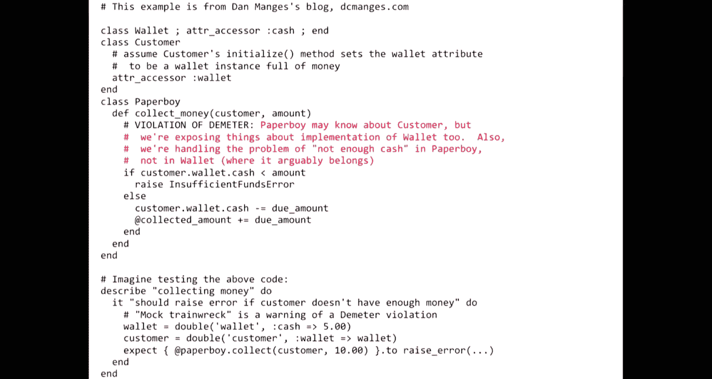
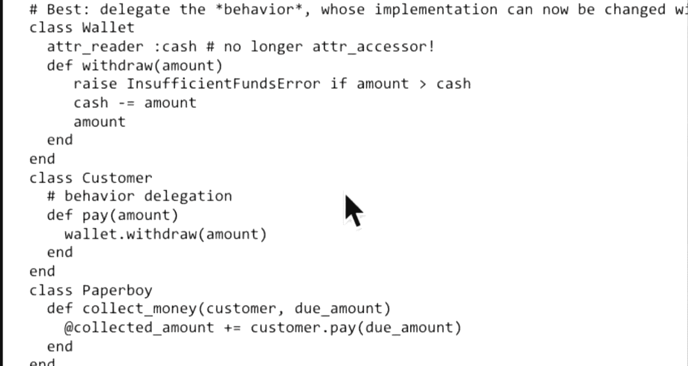
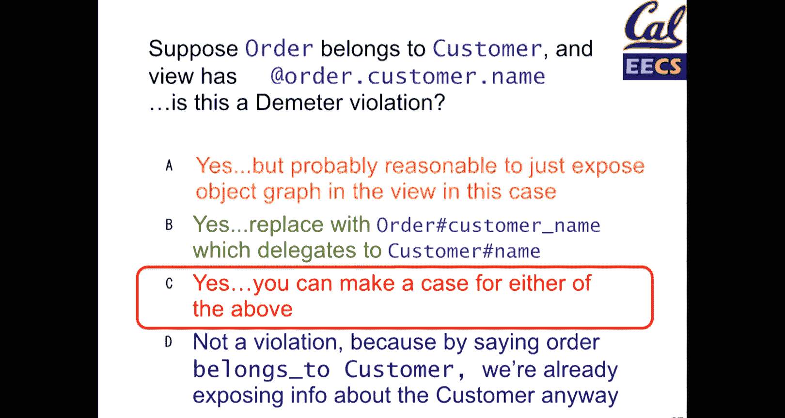

# 软件工程：019：SOLID设计原则与常用模式

在本节课中，我们将继续学习SOLID设计原则，重点探讨里氏替换原则（L）和依赖注入（I/D），并介绍几种在Rails开发中常用的设计模式，如适配器、外观、空对象、代理和组合模式。这些原则和模式旨在帮助我们编写更清晰、更易维护、耦合度更低的代码。

## 微测验与项目评分更新

上一节我们介绍了课程的基本安排，本节中我们来看看关于微测验和项目迭代评分的一些具体更新。

关于微测验，未来几周将再有五次测验。由于期中考试，原定今天的测验将推迟到下周。为了凑齐总共10次测验，其中某一周将进行两次微测验。微测验的正确性比课堂点击器问题更重要，但只要完成测验，通常就能获得大部分分数。平均正确率在一半左右即可获得满分。未来的测验题目会稍长一些，大约包含5道题。

关于项目评分，在迭代一阶段，我们对各项自动化工具的设置要求较为宽松。但从迭代二开始，以下自动化工具和部署将成为评分的必要组成部分：
*   **Travis CI**：持续集成。
*   **Code Climate**：代码质量分析。
*   **Heroku部署**：一个可访问的线上应用。

如果Heroku应用没有部署，客户将无法查看项目进展，这会是一个严重问题。Travis和Code Climate相对容易与GitHub集成，如有问题，请在Piazza或团队Slack频道中提问。

团队Slack频道中的“站立会议伙伴”机器人已更新。团队每周需要进行至少一次全员参与的站立会议，更频繁的会议记录将获得加分。由于学生日程不同步，允许某次站立会议只有部分成员参加，但必须保证至少一次会议全员参与。站立会议是记录进展、讨论挑战（如Active Record查询问题、测试不稳定性等）的好工具。

## 里氏替换原则 (Liskov Substitution Principle)

在介绍了SOLID中的“开闭原则”后，本节我们来看看“里氏替换原则”。

Barbara Liskov是一位杰出的计算机科学家，她因在数据抽象和面向对象编程方面的贡献获得了图灵奖。里氏替换原则看似简单，却意义深远。

**核心概念**：一个适用于类型T实例的方法，必须同样适用于T的任何子类型。换言之，在程序中，一个父类实例应该能够被其任何子类实例替换，而程序的行为和语义保持不变。

### 原则详解与违反示例

为什么这个原则重要？我们通过一个经典例子来说明。在几何中，正方形是一种特殊的矩形。因此，在面向对象设计中，很自然地会让`Square`类继承`Rectangle`类。

```ruby
class Rectangle
  attr_accessor :width, :height

  def make_tall_and_skinny
    self.width = 1
    self.height = 10
  end
end

class Square < Rectangle
  # 正方形无法变得“高而瘦”，因为它的宽高必须相等。
  # 如果继承了这个方法，要么它无效，要么会破坏正方形的定义。
end
```

这里，`Rectangle`有一个`make_tall_and_skinny`方法。`Square`作为子类，虽然继承了该方法，但该方法对`Square`对象没有意义（正方形不能改变为高瘦形状）。这就违反了里氏替换原则，因为子类无法完全替换父类并保持所有行为的语义一致性。

### 解决方案：使用组合替代继承

过度使用继承会导致设计混乱。里氏替换原则提示我们，有时使用组合比继承更合适。

以下是两种设计方式的UML对比：
*   **继承方式**：`Square` -> `Rectangle`。`Square`被迫拥有无意义的`make_tall_and_skinny`方法。
*   **组合方式**：`Square` 包含一个 `Rectangle` 实例作为属性，并将相关方法委托给该实例。

在Ruby中，可以使用`delegate`方法来实现组合：




```ruby
class Square
  attr_reader :rectangle

  def initialize(side_length)
    @rectangle = Rectangle.new(side_length, side_length)
  end

  # 将 area 方法委托给内部的 rectangle 对象
  delegate :area, to: :rectangle

  # 正方形特有的方法...
  def side_length
    rectangle.width
  end
end
```

这样，`Square`不再继承`Rectangle`，而是通过包含一个`Rectangle`实例来复用其逻辑，同时避免了语义上的矛盾。

### 关于静态类型语言的思考

有一个常见的误解：在静态类型语言（如Java）中，只要编译器不报错，就没有里氏替换原则的违反。**这是错误的**。

编译器检查的是语法和类型签名，而里氏替换原则关注的是**行为的语义**。即使子类用抛出错误的方式“实现”了父类的方法（例如`Square#make_tall_and_skinny`抛出`NotImplementedError`），编译器也会通过，但这明显违反了该原则，因为子类对象无法真正替代父类对象工作。

**“拒绝继承”** 是违反该原则的一个信号，即子类需要大量重写或禁用父类方法，这表明这两个类可能并不适合构成继承关系，应考虑重构。

## 依赖注入与适配器模式 (Dependency Injection & Adapter)

上一节我们探讨了通过组合来遵循里氏替换原则，本节中我们来看看另一种强大的设计技巧：依赖注入，以及与之密切相关的适配器模式。

在SOLID中，“D”通常指依赖倒置原则。在本课程中，我们将其作为“I”（注入）来讨论，因为“接口隔离原则”在Rails中应用相对较少。

### 什么是依赖注入？

**核心概念**：类A依赖类B的接口，但B的具体实现可以变化和替换。A不直接创建B的实例，而是由外部“注入”给它。

这增加了灵活性，使得在不修改A代码的情况下，就能更换A所依赖的B的实现。

### Rails中的实例：会话存储

Rails应用中的会话存储是一个典型例子。应用需要存储会话信息，但有多种后端可选：
*   `CookieStore`：将会话数据存储在客户端Cookie中。
*   `ActiveRecordStore`：使用数据库表存储会话。
*   `RedisStore`：使用Redis内存数据库存储。

Rails的会话存储机制允许你“注入”不同的存储适配器。你的应用代码（依赖于“会话存储”这个接口）无需关心底层是Cookie、数据库还是Redis。

### 适配器模式 (Adapter Pattern)

依赖注入常常通过**适配器模式**实现。适配器就像一个转换头，它让一个类的接口转换成客户端期望的另一种接口，从而使原本不兼容的类可以一起工作。





**UML示意**：
```
Client -> Target (接口)
              ^
              |
        Adapter (实现Target接口，内部包装了Adaptee)
              |
        Adaptee (需要被适配的类，如MySQL数据库驱动)
```


**Rails中的经典案例**：Active Record适配器。Active Record是一个ORM框架，它通过不同的适配器来支持MySQL、PostgreSQL、SQLite等数据库。你的业务代码使用统一的Active Record接口（如`where`, `order`），适配器负责将其翻译成特定数据库的SQL方言。更换数据库时，你只需更换适配器配置，而无需重写业务逻辑。

**其他例子**：
*   **邮件发送**：应用需要支持Mailchimp、Constant Contact等不同的邮件服务。可以定义一个`EmailList`接口，然后为每个服务创建适配器（`MailchimpListAdapter`, `ConstantContactAdapter`）。
*   **聊天机器人**：一个机器人逻辑可能需要适配Slack、Microsoft Teams、Discord等不同聊天平台。

### 外观模式 (Facade Pattern)

外观模式与适配器模式非常相似，但侧重点略有不同。

**核心区别**：适配器主要解决**接口不兼容**的问题。外观模式则旨在为复杂的子系统提供一个**简化、统一的接口**，它可能只暴露子系统功能的一个子集，隐藏不必要的复杂性。

一个对象可以同时是适配器和外观。例如，你的邮件列表外观可能只提供`subscribe`、`unsubscribe`、`send_campaign`三个简单方法，而背后复杂的邮件服务API（如管理联系人列表、设计模板、查看报告等）都被隐藏起来。

## 空对象模式与代理模式 (Null Object & Proxy)

在学习了通过适配器和外观来管理依赖之后，我们来看看另外两种用于简化逻辑和封装行为的模式。

### 空对象模式 (Null Object Pattern)

**核心概念**：提供一个行为合理的默认对象，用来替代`nil`值，从而避免代码中遍布`nil`检查。

**经典场景**：用户登录状态。许多地方需要访问`current_user`。当用户未登录时，`current_user`为`nil`，调用其方法（如`current_user.name`）会引发错误。

**解决方案**：引入一个`NullUser`或`GuestUser`类。

```ruby
class NullUser
  def logged_in?
    false
  end

  def name
    "Anonymous"
  end

  def vip?
    false
  end

  # 其他属性返回合理的默认值...
end
```

这样，在控制器或视图中，你可以安全地调用`current_user.name`，而无需事先检查`if current_user`。代码更简洁，语义更清晰。



**单例实现**：通常，整个应用只需要一个空对象实例。在Ruby中，可以使用类变量或模块来实现单例。

```ruby
class Customer
  def self.null_customer
    @null_customer ||= NullCustomer.new
  end
end

class NullCustomer < Customer
  # 重写方法，提供默认行为
  def name
    "Anonymous"
  end
  # ... 其他方法
end
```



### 代理模式 (Proxy Pattern)

**核心概念**：为另一个对象提供一个代理或占位符，以控制对这个对象的访问。代理可以在调用实际对象之前或之后插入额外逻辑。

**常见用途**：
1.  **延迟加载**：直到真正需要数据时才执行昂贵操作。
2.  **访问控制**：在访问前检查权限（如认证）。
3.  **远程代理**：代表一个存在于远程位置的对象。
4.  **日志记录**：记录方法的调用。

**Rails中的实例**：Active Record关联和查询是代理模式的绝佳例子。

```ruby
@movies = Movie.where(genre: 'Action') # 此时并未执行SQL查询
@movies = @movies.where('rating > ?', 8) # 继续构建查询，仍未执行
@movies.each { |m| puts m.title } # 直到这里，才真正执行SQL查询并获取数据
```

`@movies`在迭代之前是一个代理对象（`ActiveRecord::Relation`），它封装了查询逻辑，并延迟到最后一刻才执行。这允许我们高效地链式调用查询方法。

**测试中的应用**：使用`FakeWeb`、`VCR`或`WebMock`等gem来拦截测试中的外部HTTP请求，并返回预设的响应。**这就是一个代理模式**——它拦截了对真实网络服务的调用，代之以一个可控的、离线的响应，使测试更快、更稳定、不依赖网络。

## 组合模式与迪米特法则 (Composite Pattern & Law of Demeter)

最后，我们来看两种用于处理对象结构和对象间通信的模式与原则。

### 组合模式 (Composite Pattern)

**核心概念**：将对象组合成树形结构以表示“部分-整体”的层次结构。组合模式使得客户端对单个对象和组合对象的使用具有一致性。

**实例**：售票系统。有`RegularTicket`（普通票），`VIPTicket`（VIP票），还有`Subscription`（订阅，包含多张票）。

如何建模？让`Subscription`继承`Ticket`似乎有点奇怪，但它确实是一种可购买、有价格的“票务产品”。

**解决方案**：使用组合模式。
*   `Ticket`是组件基类。
*   `RegularTicket`和`VIPTicket`是叶子节点。
*   `Subscription`（或`MultiTicket`）是组合节点。它继承自`Ticket`，但内部维护一个`tickets`列表。

```ruby
class Subscription < Ticket
  def initialize
    @tickets = []
  end

  def add_ticket(ticket)
    @tickets << ticket
  end

  def price
    # 订阅价格可能是所含票务总价的折扣
    @tickets.sum(&:price) * 0.9
  end

  def add_to_order(order)
    @tickets.each { |t| t.add_to_order(order) }
  end
end
```

这样，`Subscription`可以像普通`Ticket`一样被处理（例如添加到购物车计算总价），同时又管理着内部的票务集合。

**Rails工具：单表继承**：Rails的STI功能非常适合实现这种模式。在`tickets`表中有一个`type`字段，其值可以是`RegularTicket`、`VIPTicket`、`Subscription`。当Rails从数据库加载记录时，会根据`type`字段自动实例化正确的类。这允许共享数据表，同时保持不同的行为。

### 迪米特法则 (Law of Demeter)




**核心概念**：又称“最少知识原则”。一个对象应该只与其“朋友”（直接关联的对象）交谈，而不与“陌生人”（朋友的朋友）交谈。简单说：**只调用属于以下范围的方法**：
1.  对象自身的方法。
2.  该对象属性（或实例变量）的方法。
3.  方法参数的方法。
4.  在方法内部创建的对象的方法。



**违反示例**：
```ruby
# 报童类需要顾客支付
class PaperBoy
  def collect_payment(customer, amount)
    # 违反迪米特法则：深入了解了customer.wallet.cash的细节
    if customer.wallet.cash >= amount
      customer.wallet.cash -= amount
      # 收钱...
    end
  end
end
```

这段代码的问题在于，`PaperBoy`不仅知道`Customer`有`wallet`，还知道`wallet`有`cash`属性，并且可以直接操作它。如果`Wallet`的内部结构改变（例如现金改为`balance`属性），`PaperBoy`类也需要修改。

**重构方案**：
1.  **委托方法**：在`Customer`上创建一个简便方法。
    ```ruby
    class Customer
      def cash
        wallet.cash
      end
    end
    # PaperBoy中使用：customer.cash
    ```
    这有所改善，但`PaperBoy`仍然在查询现金数额并自己决定如何扣款。

2.  **封装意图（最佳）**：让`Customer`自己处理支付逻辑。
    ```ruby
    class Customer
      def pay(amount)
        wallet.withdraw(amount)
      end
    end

    class PaperBoy
      def collect_payment(customer, amount)
        customer.pay(amount)
        # 记录支付成功...
      end
    end
    ```
    现在，`PaperBoy`只告诉`Customer`“请支付这个金额”，完全不知道支付如何完成。这极大地降低了耦合度，遵循了迪米特法则。

**实际考量**：像`order.customer.name`这样的调用非常常见。严格来说它违反了迪米特法则（`order.customer`返回一个对象，然后调用其`.name`）。是否一定要重构？对于像`name`这样稳定且语义清晰的属性，有时可以容忍。但为其创建一个`order.customer_name`的委托方法，是一个良好的实践，为未来的变化预留了空间。

## 总结



本节课中我们一起学习了SOLID原则中的里氏替换原则和依赖注入思想，并深入探讨了五种在实战中极其有用的设计模式：
*   **适配器模式**：转换接口，使不兼容的类能够协作。
*   **外观模式**：简化复杂子系统的接口。
*   **空对象模式**：用提供默认行为的对象替代`nil`，消除空值检查。
*   **代理模式**：控制对对象的访问，增加额外逻辑层（如延迟加载、访问控制）。
*   **组合模式**：统一处理单个对象和对象组合，构建树形结构。

同时，我们理解了**迪米特法则**，它指导我们限制对象之间的知识，减少耦合，让每个对象专注于自己的职责。




掌握这些原则和模式，并非要死记硬背，而是要在设计和重构代码时，拥有一套识别问题并应用合适解决方案的工具集，从而编写出更健壮、更灵活、更易维护的软件。