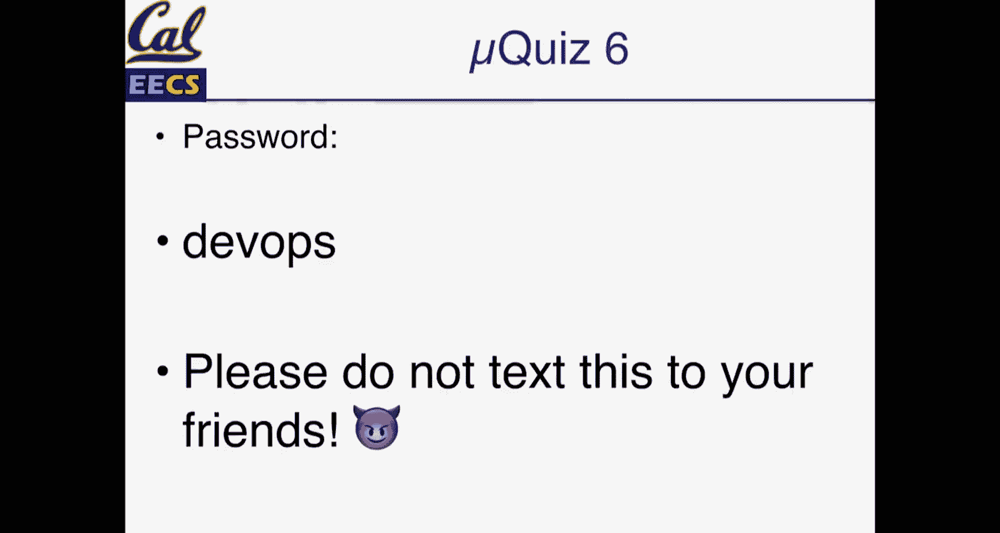
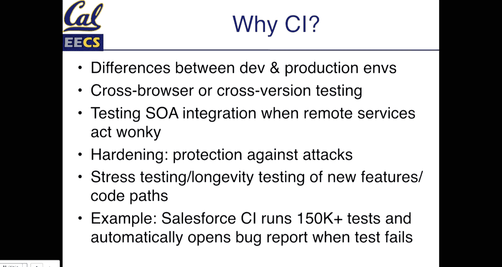

# 020：UCB《软件工程｜UCB CS169 software engineering 2019》中英字幕deepseek p20 20 CS169 20.zh_en -BV1UsB7YPEMj_p20-

All right， well， it seems like a bunch of people are still trickling in。

 The microquiz is now open on Grcope。 The password is DevOs。 If you have the 169 Sla。

 I also drop the link to it in general just so it's easy to get to， but same deal as normal。

We're just doing yeah。那我意思。嗯，对。去。嗯。The quiz closes in a minute。 So if you haven't submitted anything。

 just submit guesses and make sure you type in the password because at least you'll get credit for being here。

And then right after it closes， we'll briefly go over the answers。

I did not at all do what I wanted it to do。

All right， so microquiz。According to the open and closed principle。

A class should be open for extension but closed against modification this one is just the definition of the open and closed principle。

 we'll review that in a second。Which of the following is true about single responsibility principle？

Low cohesion is a possible indicator of an opportunity to extract a class。Again。

 something that we will mention again in a second， but this is one of the indicators that you may have violated the single responsibility principle。

 Lcom is the metric that can actually measure this。But this is。

One of the tools that we have for sort of giving us a little bit of an objective sense as to whether or not we might have violated the single responsibility principle。

 aside from just our own intuition。Question three。A customer has a subclass VIP VIP customer assuming we have well structured code that observes the list of substitution principle。

 which is true Any method that takes a customer can safely be past an instance of VIP customer so this again follows from the definition。

 which is that you should be able to replace a class with a subclass in your code and the behavior should work safely。

And。If you call a nonexistent method on VIP customer。

 that can still work if customer or one of its ancestor's response to this method。

 so essentially saying that your subclass is well they may have different behavior。

 they should have the same methods that the parent classes have。And so that again。

 is one of the options there。And finally， question4。

 if you want to create families of related objects to be used interchangeably to configure application。

 which design pattern is the most appropriate to use， and this is the abstract factory pattern so。

Again， something that we we're here today finishing up with design patterns。

 but if we look at something like active record， which is our database adapter。

 but supports things like SQL light， Postgres， MySQL， even a couple others。😊。

We have active record adapters that we can use to replace the database connection with so that by following the same set of methods。

 each database， even though they have different protocols。

 will still work with active record in the same way and the implementers of those database adapters only have to build a specific set of methods。

 So abstract factory is one design pattern there。And so with that。We will continue on the lecture。

Just some other stuff that is maybe perhaps interesting。

 There's a podcast from Thoughtbot who has many rails gems。 I've mentioned this a couple of before。

 but this week's episode， they were talking about things like。Supporting。呃。

On a team supporting Devops type work of building out or fixing up integration tests with CI and a process of doing work。

Where they're trying to get all the integration specs working。

 And it's sort of an interesting but related discussion to the types of stuff that we're doing。

 which again， quote sort of just the point that the work that you're doing on your customer projects is。

In a lot of ways， a similar version of what goes on in the real world。

 And so that's an interesting discussion there。 They also had some talk this week around pairing and people's experiences with that。

 So always an interesting thing to hear other people's perspectives。 So we'll spend the first。😊。

Bit reviewing summing up our design patterns。And then the next two lecture or this week and today and Thursday's lecture will be about Devops。

 continuous integration， some。Really fun stuff。Design pattern， single responsibility principle。Again。

 single responsibility principle is that a class should have exactly one responsibility or reason to change。

 that is the methods， a thing that your class does should have。You know， only one。One goal。

 so if it's your customer， you that sounds like a pretty broad goal。

 but the class should only concern itself with the customer and the things that are customer adjacent should be delegated to other classes or other models。

So symptoms of this， again from a quiz， a high lack of cohesion methods。

 so if you have a lot of methods in your class， in your model definition perhaps that do not use instance variables that are attributes of that class or you have a lot of methods that access a related set of concepts but those methods aren't used by something else。

 that is a place where you could extract that stuff out into its own class。😊，And this is。

 you know something where a really common scenario of this is you might have some configuration so if you have a related set of configuration methods that all belong to some user or maybe a school or a course or a customer but those configuration methods all sort of travel together。

 you could extract those into a configuration class which is smaller has a limited set of methods and that helps make things easier to test。

 it helps make things easy to adapt and so you can see that too by if you have a set of methods which have the same set of parameters that travel together so if you have a lot of methods that take in the same three or four arguments that's a suggestion that those might be their own class。

😊，And the recommendation here is that we can extract a class from those sets of methods and remember that a class in rails does not have to necessarily be backed by database model。

 you can have classes。As many as you want， you can still put them in app slash models because that's sort of the natural place for them。

 but you could have something like an address class which doesn't necessarily need to have an address table in your database。

 or a settings class that doesn't necessarily need to have a settings table in your database。

 although of course if you need to that's perfectly okay as well。So that was the S， the On solid。

 the open and closed principle。Extending functionality of a method shouldn't require modifying code。

 So if we have active record as its own package to add a new database adapter。

 we should not need to modify our main active record code base if we have a formatter class。

 the example that we used a report formatter to add a new format。

 we shouldn't need to modify our formatted class。 So symptoms case statements where we need to add new conditions to the case statement。

And again， so the design pattern so like active record， the abstract factory pattern。

 depending on the case， a template pattern or a strategy pattern where we have a series of identical steps that different use cases might adapt to。

Or a decorator pattern of work where we pass in an object but modify its behavior。

 So those were all examples that were in lecture last week。L of substitution。 So again。

 following from a cluez， an instance of a subclass of type T can be can be safely substituted for T。

 so we can replace a。😊，A customer with a VIP customer。Symptoms， again。

 this one of them is called refuse Vquest。 So if we have a method and we raise an error saying that we don't know how to respond to that method。

 that may be a symptom。 So we have a class that is trying to do something。

 but the method doesn't make sense here is a suggestion that these two classes are not necessarily。

Something that should be in a parent child subclass ancestor type relationship and what this means for these kinds of things is that instead of using inheritance。

 we should probably extract our classes out。 so composition where in our square and rectangle example a square has an instance of the rectangle class as a property。

 but is not necessarily a subclass of。Of a rectangle and then delegation as well。

 So if we have two related things， we could delegate our methods to one of those things。

So injection of dependencies， the ion solid。So rather than having a class dependent on an interface。

You could have them both if you rather than have two classes depend on some interface。

 you can have both depend on an injected common interface。

 So basically if if we another symptom is violating open and close。

 So if we see that we have two related things that sort of work in a similar way。

 we can inject a dependency。 So again， there's a lot of these principles have similar types of refactories that we could do So。

Inserting a new interface， so this could be something like an adapter in some cases would also be a pattern that satisfies this injectional dependencies looks a lot in terms of open and closed in terms of things that you might see as a violation and again。

 abstract classes here are a good pattern to follow。

Where those implementations become a dependency of whatever we're doing？And our last principle。

 the D is the law of demeterter， so only talk to your friends， don't talk to strangers。

 so when you access methods， you should only sort of grow one level deep。嗯。

So this is long chains of method calls。 So if you ever find that you're doing you。

Customer dot name dot first， for example。Orderites。1 do price。Something like that。

Where you are constantly chaining method calls。That is a symptom。

 It's important to note that we're talking about chains of method on instances。

 If you are using something like an array where you're mapping， filtering， summing up those values。

 That's not a violation of the demeter principle。 Those are sort of。

Built in operations on some array or some data types。 So you know。

 if we're talking about enumerating over some collections。

 and we're just trying to sum that data filter out some set of。Objects that we need。

 those types of things generally make sense， but they also still may be suggestions to refactor or build some methods。

So what are some ways that we can do this， we can delegate our methods so instead of doing。

If we have customer and we're calling name Go something， we could delegate methods。

 we can extract a small class。And we could also use something like the observer pattern。

 which we haven't talked about too much where our class can respond to some changes in events。

 we'll see rails as use of this later on when we talk about caching is one way of using the observer pattern。

嗯。And we can use another one is the visitor pattern which you also haven't talked about。

 but that is another way of separating out some data。All these are patterns that。

We've seen or talked about。We've talked a lot about adapters， abstract factories。

 I mentioned we'll get to the observer in a bit。Decorators。

We haven't explicitly talked about the last two of or through these so singletons。

 we mentioned runninging a single instance of a class。

 a place where this is used in rails that you may have used but not necessarily thought about is inflections so the thing in rails that turns your people table into a person model or any other proper inflection of single temporal plural or vice versa。

 there's always one instance of that class in rails app because your application should not need different kinds of inflections at different points that is a singleton class and it's also something where if rails ever does it know how to properly inflect sub noun。

 you can add your own custom adaptations to it which is pretty cool it also has things where。

You can use this for proper capitalization of methods and nouns as well。

We haven't talked about the command pattern， but active record migrations follow this where they have a series of methods。

 so there's a change method。 there's also an up method and a down method。 So the series of commands。

 if you have change then you're not going to necessarily specify a you might not always need to specify down method。

 but if you do up and down you're saying the first time I apply this migration。

 this is what should happen， a down method is a reverse method。

 So if you need to roll back a migration， the command pattern is a way。

Of structuring changes that should happen and array iterators， numerables collections。

 iterating over collection is a design pattern。 It is one of the ones that we haven't explicitly talked about because by now。

 it's apparent all across rails， but。In so many different kinds of software。

 so that one exists everywhere， but it is explicitly called that as a pattern。A caveat with solid。

 a lot of these principles were know， explicitly designed for。

Object oriented languages that were statically typed， so think Java C+ plus。

Especially where a lot of them came about in the 90s when Java was the only thing that the world could talk about pretty much in terms of languages。

 and the goal is to make refactoring statically typed code easier when you have to worry about things like a compiler when if you don't get your dependencies exactly right。

 or if you modify a type signature of a method， things will break。In rails， of course。

 we don't have that challenge if you call a method and your types don't line up， Ruby doesn't care。

 your methods might care in that if you pass in an integer and you call a string method on it。

 things might still break or more likely if you try to enumerate something that is not ennumerable。

 then things are definitely going to break， but the goal here is to make refactoring as easy as possible。

And again， use your judgment with all of these。the saying is there's no problem that can't be solved with level of the indirection。

 but with that indirection also introduces some complexity as well。

 so you know how learn that they exist， learn that you can make use of them。

 but you don't have to apply them everywhere。 The goal is not to just apply patterns because you know them。

 the goal is to you know find a place once you realize that something is not working out so。You know。

 in summary， again， these are successful solutions to a common set of challenges and problems。

And you can apply these both to the architecture of your system， you can also apply them。You know。

 two individual classes， so some are higher level than others， but they're all strategies。That。

That you can use and one of the goals here again is to figure out。

You know what when we're working on refactoring our code。

 what are the changes that I'm going to expect to happen over time versus the problem that I'm solving right now。

 If you expect that something may not change very much， then you know。

 maybe it doesn't need as much refactoring， of course。

 what you expect today may be completely untrue in a few weeks or a year。

 but that's the part of using your judgment， and again， we threw out a lot of these。

You know the goal is to make sure that you're aware of them， but learning them。

 using them really comes from practice， so just be on the lookout for that So our first clicker question for today。

See if this opens up and of course it's coveringv the question。So。

Rils's active record module defines an abstract adapter for connecting to databases。

 something that we have said quite a few times now。

 Subclasses of active record adapter or abstract adapter exist for each database type and can be added for new databases。

 when we loader app， we load a connection of databases from a config s database do Yael。

 So which of our patterns are we not is not at play here。 So we have。O L， I， N D。

So which of the patterns is not at play？Let's see if we can get up 230。Cool， we're up to almost 40。

All right， so let's pause there。Cool， so we have a pretty good range。

 lots of competition for B and C。So take a minute， talk with your peers and see if you can come to a consensus on which of these is not at play。

That case。I电。All right， take another 10 or 15 seconds and put in a vote。

Let's see if we can get back up to 45。All right， let's stop there。Alright。

 so we have decided that it is pretty much not A， pretty much not D。

 but we still have some good competition for A and B。 No， let's not do that。 Allright。

 who wants to make a case or explain why， why it's not open and closed。

 So those who didn't vote for A。 Oh， why is this not open and closed。Let's see。Oh。

That was not at all。系。嗯。So of like open and closed do you want it to be open for extension So for this case like the abstract adapter subclass allows you to add like different types of databases Yeah so you can extend that Yeah。

 perfect Yeah so you know as if we were to add a new database type， we don't need to modify rails。

 which is critically important that is great， who wants to make a case for why we're following list of substitution。

Why is this also followed by this pattern？So if no one is going to go for it。

L up substitution is also at play here because we could， if we had a more generic adapter type。

 our class would actually work if we were to replace this， if we actually called abstract adapter。

 our database methods wouldn't do anything， but the methods。

 the structure of our code would still follow it， they are still valid object oriented structures。😊。

So that leaves our last two methods depends the injection and the law of demeterter。 No， oh。

 I guess the eye clicker app is still a play。 So why。

Why demeterter and not dependency injection in this case？

It's a little bit easier to think about why the law of demeor in this case is not what's at play here than it is something about why dependency injection is。

 so we'll start there。So the law of demeteror says that we should only talk to our friends but not talk to strangers。

 so what we're talking about is not doing things like A do B do c。 D。Or even just AW do C。

 And so with this pattern， we're not necessarily。When we're talking about an instance of an active record adapter。

We're not really necessarily talking about the active record class doing any de referencing here there's in this scenario。

We're talking about loading different kinds of databases。

 It's not something that necessarily just comes up in this case。 Why。

 then is dependency injection at play。 Well， oftentimes when you have a case of the abstract factory pattern where we have。

An abstract adapter， then we must require a specific adapter to actually do the work。

 So when we require active record Postgres adapter or active record SQL light adapter。

 that is a dependency on active record that is being injected at runtime for application to work。

 So even though the pattern。The Pat abstract factory。

 accomplishing that by having a class that is an instance of this adapter is a dependency that gets injected into our app without that specific Postgres dependency without that SQL light dependency our app would not run and so that is why dependency injection is one of the patterns or principles that is at play here。

 questions on this。Cool， so。That is design patterns Now we are going to be talking about DevOs so from development to deployment。

 so how we get code from our machine to Heroku wherever we are but not just necessarily how to do that at this point hopefully of all done that because to get code from your machine to Heroku just gib push Heroku master and you're done of course is a bit more to how that works this photo is Armando with a C cucumber because cucumber。

😊，That's really just why it's there。😊，呃。So when we talk about DevOs， what we're talking about is。

All the stuff that goes into making our lives as developers。A little bit easier。

 a little bit more structured， we're talking about the things。That help us deploy code safely。

 securely， and that once code is deployed that we have an idea of what's going on in our application。

 so hopefully you' have all had a chance to deploy to Heroku。

These applications are now in the wild on the Internet， people could be using them right now。

 and that means that something could be happening to them that we don't know about they could have blown up。

 they could be humming along just fine。 Devops， a part of that is making sure that we have the tools to be confident that while our apps are out there that you know when you go to sleep at night。

 your application is not going to stop working because there are points in life where when you go to sleep at night。

 some applications do basically stop working and the goal is the goal is to not have that。

 So we're going to talk about continuous deployment。

So how to deploy often and safely upgrades in feature Fl。

 So sometimes this stuff gets really complicated。 You have a database migration that requires you to adapt code。

 How do we do that。How do we protect customer data so we're going to get a little bit into application security information security if you enjoy that stuff I highly recommend taking 161 with Nick weaver so there's a couple people taking it right now。

 but next fall he usually teaches in the fall if you'll still be around。Monitoring。

 so if you're not monitoring your application， you have no idea if it's alive or dead。

Related to that， how can we measure if our application is available。

 app DX is a specific formula and implementation of monitoring or measuring performance。

And then a couple things about performance。 So how do we keep our apps scaling kind of running as smoothly as possible。

 meeting demand without that much effort。 So there's a few things。

 databases and caching that we'll talk about that make our lives easier。

 So development versus deployment， otherwise known as your machine versus the rest of the world where it works on my machine is not an acceptable answer to customer says I find a bug so。

You know， in our deployment environment or in our development environment。

 our goal is that we're testing to make sure our application works as we've designed it， right。

 we are testing on our own browsers。We're running at on machines。

 which are all probably fairly modern， probably pretty up to date。we're one user。

 we are hopefully asking questions about， you know， does this make sense， is this UI， right？But。

When we deploy our app， we have a whole different set of conditions。

 it might be that we're developing on a Mac and Heroku is a Uuntu environment。

 which for the most part， we've learned shouldn' it really matter。

 but shouldn' it matter and doesn't matter are two very different things。

AndThe goal then is to make sure that as we deploy an application。

 we don't have any unexpected behavioral changes。Some bad news about the real world and。

 It's been said that users are a terrible thing。 If we don't have any users。

 we don't have any problems because there's no bugs to be found。

 there's no one to type bad information into a form。 There's no one to do things that are unexpected。

And so， you， when you have users in your application。

 all sorts of interesting unexpected cases happen。 Some bugs only appear under stress。

 So some of these are the hardest things to actually debug。 But if you have。Things like。

Issues related to concurrency that usually happens at the point where you reach a lot of concurrency on your development machine。

 you're probably not stress testing your app by throwing1 thousand requests per second at your development environment you could do that there are strategies for that but using deployment strategies is a way of checking for that the place where this really manifests itself oftentimes our configuration issues so making sure that you have connections to your database。

 things like that Heroku manages a lot of this for us。Just differences in our environment。

 so a different operating system， possibly different versions of dependency libraries。

 different databases， so in most of your cases， the database you're using locally is SQL light and on Heroku it's Postgres because Postgres is a much better database for running things in production。

 it's much larger， it's built for that SQL light is。

 well it's called light for a reason it's meant to be small lightweight but it's not necessarily going to handle production cases and you know 98% of the time the difference in databases doesn't matter。

 but every once in a while there will be things。That do matter in this case。

 sometimes that's features and Postgres that you want to take advantage of that SQL light doesn't support。

 sometimes that's really subtle bugs like differences in case in sensitivity which for the most part。

 if you're using standard SQL shouldn't matter， but every once in a while if the environment is different you have to take that into account and the world is full of evil forces so people who want to get your applications data。

 or people who don't really care about your applications data。

 but are interested in just wreaking havoc using an application as a platform to launch other malware。

 those kinds of things so that is where security comes into play。And through all this。

 it's easy to make lots of really simple mistakes。 I have made plenty。 I have deployed apps。

 not gradecope， thankfully。 Well actually no take that back one time。😊。

One time I broke South pretty bad on gradecope， but。You know， through all this。

 it's easy to make lots of simple mistakes where we don't recognize what's different about something that we're not testing very carefully or there's data in production that we didn't account for so。

How do we protect against that？So there's a bunch of things。

 we're going to talk about platform as a service， so Heroku。

 we're going to talk about continuous integration。And how these can help。 So in the old days。

You would get your own server， hopefully it was in the cloud。

 but probably not if we're talking more than 10 years ago。

 and then you would install and configure everything yourself。And。

It would be your responsibility to keep up with security vulnerabilities， patches。

 any of that kind of things。 Some of this is nice and that if you do this work yourself。

 you understand hopefully， everything that's on。Your own server。 But this is also a ton of effort。

 This takes hours。 I maintain an app right now， which is not on a heroaclic environment。

 and it is a pain to keep things up to date， but。And things might occasionally break。

But the thing is， if we can use a platform as a service。

 we avoid doing all of this and for the most part， for application like a rails app， you have rails。

 you have Postgres， Heroku makes it really easy to connect useful tools。

 Gitthub makes it easy to connect useful tools like Travis and so by standardizing our environment we can save our time and effort from all of this work and again。

 if you do this yourself， you have to figure out how to scale things when we talk about scaling we can show you that it's pretty darn easy on Heroku because there's like literally just a scale command and a number and so Heroku is great for that。

😊，The nice thing is that with a modern application， unless you are Google or Facebook or Twitter。

 you can simplify all this work because you can pretty much just grow with the amount of hardware that you have。

With Heroku， you can just upgrade the size of your Heroku environment that you're on。 So by default。

 everyone is using free instances。 So they are fairly limited。 They have like half a gig of Ram。

 which is not that much Ram， but plenty for most applications。

 but you can upgrade to multiple gigs of memory。😊，Faster processors。

 all those kinds of things and that will just help your application scale faster you can also have multiple instances running at once all connected to the same database。

The great thing is。When your app grows， you can basically just keep growing your hardware in the normal case。

 So pivotal， this is a few years ago， but。Their entire database for tracker。

 So for all their clients， all the tracker projects fit in one fairly large。

 but still one database that lives on one machine， the gradecope database。

 which has a few million students in it and you know。

 data about everyone's assignments still also fits on one machine。

 and it's honestly not even that big。You know， there is a couple hundred gigabytes of data there。

 but it's pretty easy to keep growing that。嗯。You know， all these systems。Generally。

 if we're following best practices， we can just keep making them bigger by getting bigger hardware and the good thing now is that hardware is pretty cheap。

嗯。This is a reminder that you are not Google， so there's a great link and another acronym called Unfat。

 which is when we're looking at DevOs， part of our challenge is how do we know what we should be building。

 what should we be using， what are the tools that help make our lives easier。

 and one of the things that helps make your life easier？Is using tools that are stable， well used。

 well debugged， well understood and not necessarily something that is new。

 And the most important step here is the U， which is understand the problem that you're solving。

 So start from the problem domain and not the solution domain， which is。

I'm trying to store some stuff， how do I store this stuff， what does my stuff actually look like。

 is it a bunch of user data， is it some logs of user actions is it files and documents。

 is it maybe some configuration data， what am I trying to do with my application。

 answer that question first， don't ask yourself should I go grab XCool new database that Facebook or Google has built because it's probably built for a specific use case？

If you do know what you're trying to solve andumerate the options。诶。Read about them。 So， again。

 most of these options have lots of cool stuff that has been written about them。 Of course。

 while you're reading about them， read the technical documentation。

 not the seductive marketing documentation， because there is a difference in what they claim to solve。

😊，Consider the historical context of the solution。So a good example and the one that's linked in the link on the previous slide is talking about Amazon's dynamo DB。

 which is a database， which Amazon built for the specific problem of making sure that they never lost data when adding to a shopping cart。

 so they wanted every single right to this database to be as fast as possible。

And to be stored as quickly as possible。 So whenever you wrote data to this database。

It was not going to lose。That it was not going to lose that data。

 which sounds like a great problem of like， you know。

 I want this right to be as fast as possible theyre Amazon。

 so of course lots of people are adding things to shopping carts。呃。But。For the most part。

 a database like Postgres， which might be slightly slower to write data to。

 is going to give you way better guarantees about when you access that data。

 how you process it and what's going on than something like a different database technology which has its own compromises。

You know， and your question is like am I Amazon Well， you're probably not Amazon or else。

 you know you would know that you have thousands of engineers and the time to work on these things。

 so that goes into advantages and disadvantages。And think about the things that would be different。

 what might change in the future。The place where this really commonly applies。

 some of the examples listed on here。A lot of these are Redis， Mongo， Hadoop， Kafka。

 Cassandra are all different database data storage data processing pipelines react gets thrown in there as well。

 which react is an awesome piece of technology there is certainly nothing wrong with using it。

 but you really do have to ask question ask yourself the question。

 like before I pull in this giant JavaScriptscript dependency of react。

 am I building an application that needs to be super fast， super responsive。

 has a really complicated user interface and sometimes the answer for that is like absolutely yes。

 Facebook built reactact because they have a massively complicated user interface。

 plenty of applications use reactact because they need that responsiveness。And so on。

 but again with each technology you know does it help as much as it might hurt so with that caveat in mind。

 what do we talk about when we're talking about performance and security。

So we're going to start with some performance， so availability and uptime。

 what does it mean for my application to be available to users when I say this application has 99。

99% of availability， how do we actually measure that for whom is it available and you know what goes into that calculation。

呃。We want our apps to be all fast and responsive， of course， but how do we measure that because？

Again， it works for me， it seems fast on my computer is not necessarily a great way of understanding what happens in the real world。

Scalability， so again， we're hopefully not going to have to worry about this too much in this course。

 but in general， the idea is as our number of customers grows。

We shouldn't have to spend that much more money per customer to still keep our application faster。

 And for the most part， this is true。 your applications right now probably have a couple dozen people who are the customers who are using that application。

😡，They could probably take a few thousand customers without too much effort。

But how do they scale over time， what do we need to do to keep things fast and efficient？Privacy。

 so how do we protect the data that we have， so not just in the security sense。

 but you know is it are we having proper access controls are restoring the minimal amount of data that we need。

Authentation， of course， so user access， passwords， those kinds of things。As part of our application。

 as part of our set of tools all matter and data integrity。

You know do we know that once we store the data it's actually safe and so we'll talk about some database tools for that The first set which we'll talk about today is around the performance side and the second set is on the security side so we'll get into that some Thursday and a little bit next week as well。

So our first question。Assume that we're trying to measure the performance of our application。

We have some variables， assume that these are all just percentages，0 to 100。

We have some availability metrics。 So we have a percentage of our apps availability。

 We have Herokus availability。 We have our Internet connection availability。

 and we have our own perception of whether this thing is available。 Can we make。😊。

Can we justify any of these relationships or do we simply not have enough information to decide that any of these is true。

 So each of these variables is a percentage from 0 to 100。All right， take another 15 or so seconds。

And then we'll definitely talk about this one as well。Can we get five more？No， we can't。 All right。

 cool， So a really good distribution of answers。So。I will open up again for voting。

 but take a minute， talk with your peers， say if you can come to agreement on some understanding of how we might be able to measure availability。

 or do we have not enough information for any of these？感。So。嗯好嘛。How much。All right。

 take another 10 or 15 seconds。See if we can get up to 40 again。10 more seconds。まし。他的。All right。Cool。

 so。We knocked A out。We have one E， so that's cool， and we have still a bunch of competition。 No no。

 don't do that。 not what I wanted to do so。We have a bunch of metrics here。 So there is in this case。

 we don't really have enough information in this scenario to define any specific relationship。

 For one thing， if something says your perception。I have no idea what you think of your application。

I have no idea， you， necessarily or。You， you don't have any idea of what I think of your application's availability。

 Per is a really hard thing to talk about with availability because。

You know you in general only access each application a fraction of the time that it could be accessed right you spend well hopefully not too many hours a day on Facebook or Reddit or Twitter or whatever。

 but you that is only a fraction of the day and so if those applications are up for that fraction of the day。

 your perception of their availability is probably good we're on the West Coast so things that are down between 3 and 6 a on the West Coast not really a problem for most of us because。

Now things that go down at 3。m， you're hopefully asleep。

Although my internet service provider does love to do maintenance at 1 am。

 which is a little too early in the night sometimes。So you know， your own perception。😊。

It is really dependent on your own usage patterns。Your own application availability。

 so Ro and potatoes itself well。What goes into there is mostly。

The if we're trying to separate that from Heroku we're talking about your own application code。

 we're talking about is it scaling well such that when it gets a new request。

 it can respond in a reasonable amount of time， you know are there no application errors that areing preventing users from accessing your application so perhaps you have a really critical bug and then it causes the application to crash？

Which generally does not happen in rails， like it's pretty hard to get rails to actually crash。

 which is one of the great things about it， but it's software so it's certainly possible in some scenarios。

Heroku's availability， so whenever you use a platform， if Heroku as its service ever goes down， well。

 that means your application is not reachable。😊，An Internet connection。

 So C is also really hard because whose Internet connection are we talking about。

 Are we talking about your own Internet connection。

 the Internet connection from Heroku to the larger portion of the Internet。

 the Internet connection between your application and its own dependencies。

 all of those things could be there。 So in general， when we measure performance。

We're going to have to define some specific metrics but。It's not necessarily guaranteed that。

 you know， any one factor will be at play。 But the point being that availability is dependent on lots of things。

 If， if Amazon ever has an outage。Particularly some of the stuff where their oldest region of AWS is hosted in Virginia。

Because it's the oldest is the most unstable by like a slight variation in percentage。

 but every once in a while there's an issue there and you'll notice that half the internet suddenly seems unreachable because Amazon has the largest colocation of web hosting of pretty much any provider。

 So sometimes your service provider does have a challenge and that affects your availability as well the good thing is if Amazon goes down。

 well， most people are also down with you so you can at least deflect the blame。😊。

So we'll revisit specifics in a bit for performance or for availability and then also for performance。

So now the next question with DevOs is， how do we deploy often and frequently and？

How do we ensure that our app is stable。 So this predates probably most of you in the room。

 but software releases were not always as frequent as they are today。

20 years ago or almost 25 years ago now。 Windows 95 when they launched it。

 they through a giant massive party at Microsoft's headquarters with like 11000 people Microsoft employees。

 fans of Windows tech press just general customers。

 They were the first company to license a rolling song for their advertising campaign where they spent like more than $3 million in 1995 to license started up for their advertising campaign And so 20 years ago。

 software releases were a big deal。 You had to get a box。

 they came on Cds because DVDs weren't even a thing。 And now today。

You get to deploy your application。As many times a day as you want for software like Windows。

 there aren't daily releases of windows that are that large thatd be pretty hard to keep up with。

 but they are still downloadable， they happen yearly sometimes more frequently than that if you use Ubuuntu they typically have major releases twice a year and of course minor updates now are more significant and happen fairly often so。

Facebook， this was now eight years ago， but they redeployed the main application， the main backend。

 their goal at the time was once a week， they deploy frontend changes UI experiments many times a day each team at Facebook has the power to make their own deploys。

Amazon deploys their main application several times a week。

 that's still pretty true Sta overflow a few years ago， they said several deploys per day。

GitHub tens of deploys per day， if you ever look him up。

 Zach Holman is now a former GitHub engineer but has done a bunch of really good talks。

 a great one is how GitHub uses GitHub to build GitHub。

 which aces the marketing aspect of getting your company title in the talk like three times。

 but is really good at going through their process of DevOs of not just CI but deployment monitoring tools that they use like Slack or other tools before Slack to make that process easy。

And the goal here with deploying multiple times is to reduce risk。

The less code that is changed since the last deploy， the less risky it will be with gradecope。

 there are days where we deploy three or four or five times and that's with a team of you know five or six people and we might have five or six deploys and some days or you know there'll be a span of a few days where we have no deploys because we're just working on bigger features and there's not something new right then and there but it's really a decision of like well is something ready。

 okay something's ready then we're confident that it can go out and the more often you deploy the easier it becomes there's a saying that if something sucks。

 do it more often which you know sounds a little masochistic but the idea is if you have a hard process and you force yourself to do it you'll force yourself to make it easier and easier so。

Deploys should be a non event， so how do we get to this state automation so。

Most of these companies have automation to do deploys。When。When you do get push Heroku master。

 Heroku does a bunch of steps on the back end。To make that deploy as easy as possible。

That's you choosing to deploy from your computer， but one command is really the goal here。

 we have one thing that says I want to deploy my application and from there I'm going to make it as easy as possible。

If you're not using Heroku， there's a bunch of automation tools。😊，Caparano puppet chef。

 there's a whole bunch of them。 Terraform is a really popular one now， but。

They help you structure your infrastructure They help you build your infrastructure in a way that makes it easy。

 And so that is automating deployment and continuous integration。

 The piece where we'll kind of leave it for today is。This is what Travis CI does。

 So Travis CI continuous integration。Every time we have a new update to our code。

 we're going to run our entire suite of tests in an environment which is as close to production as possible and。

With Travis we get a pull Que when the automation is set up， it builds it。

 ideally Travis will build it twice， it will build our pull Que。

 it will also test merging that Po Que into master。

 rerun our build to make sure that not just our current code works。

 but the merge into master will also be successful， and it reports that status back to GitHub。And so。

Why do we do this， Well， two or a few big things。 So minimizing our differences in our environments。

Crossbrowser and cross version testing， so you probably won't need this for your projects。

 but Travis gives you the ability to test in multiple versions of Ruby。

 really important if you're building a gem or a library testing are integrations with thirdparty services so in development you don't want to necessarily depend on hitting let's say Stripe or Amazon for some tests。

 but you probably want to test that those integrations still work in some form。So hardening。

 so you can test things more securely， you could run tests in CI that maybe check against password login attempts。

 anything like that， stress testing， so running multiple instances of your server and having code that stress tests your app by making a bunch of requests。

All these things kind of suck to do on your own development environment and so CI is a place where these tests can be a little bit more complicated。

 be a little bit more involved， and that's really the goal so that you have a nice set of easy things to do while you're running building your application。

 but when we put it on the internet， CI will take care of this。

 And so the final example is Salesforce。Has more than 150000 tests that run on every single build。

 It does take a couple hours， which is why if you're an engineer。

 you're not running those on your computer， but。You know。

 they have an environment set up to make sure that whenever those things happen。

 if there are any regressions， bugs get filed with the team that is responsible automatically and you basically you can take this process as far as you want and so the goal here is again。

 automation and we'll leave it there for today。So Thursday will be more DevOs， part two。

