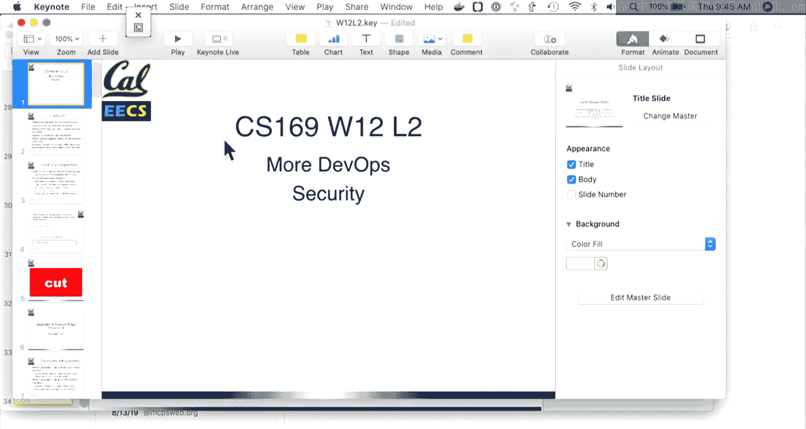
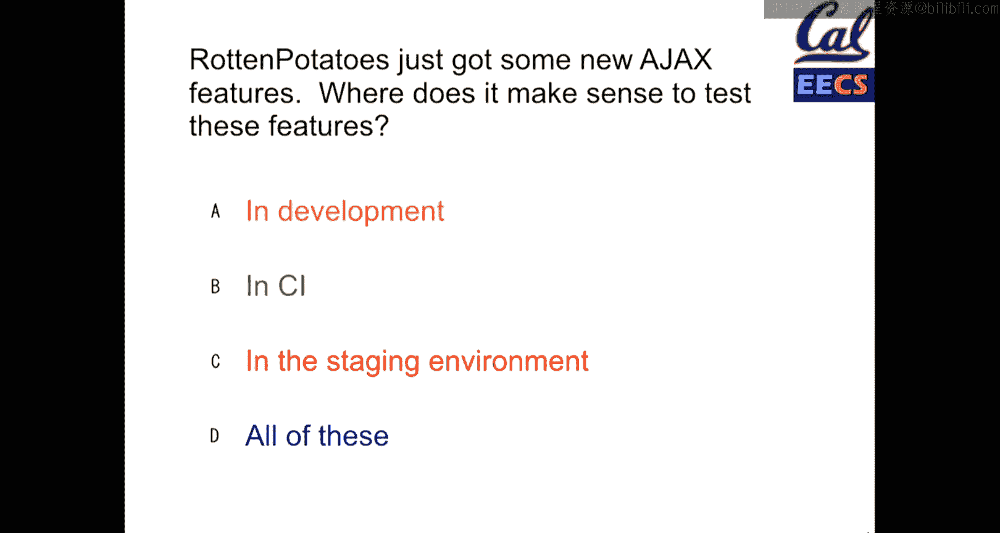
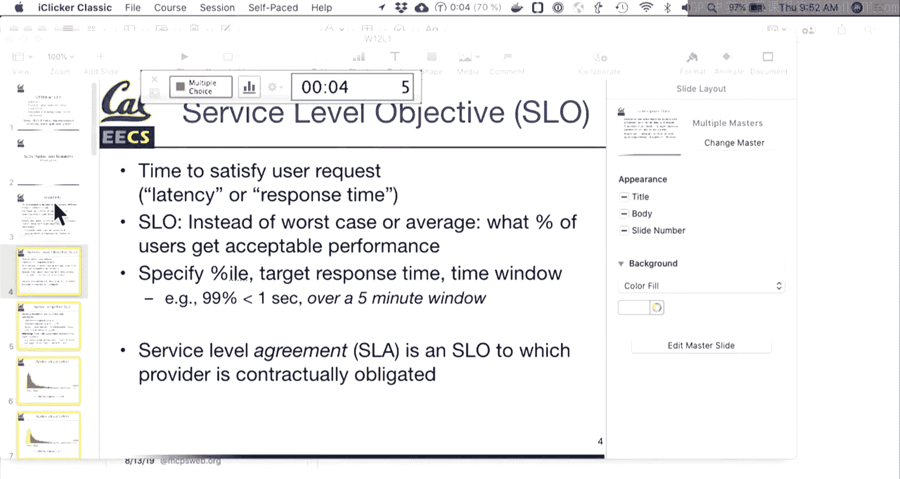
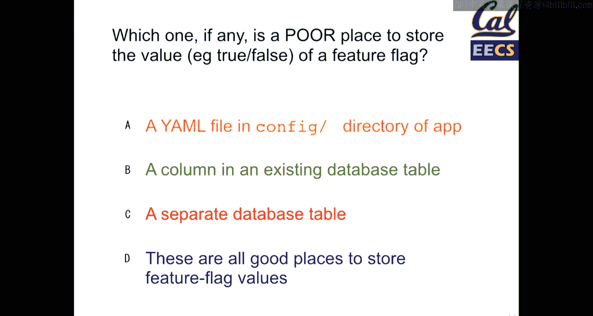
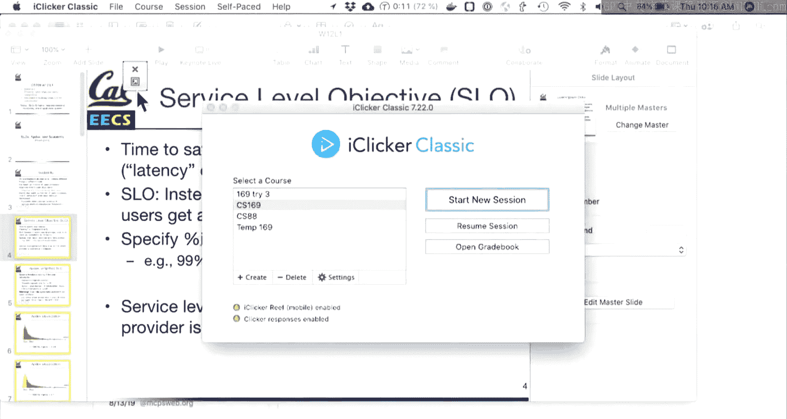
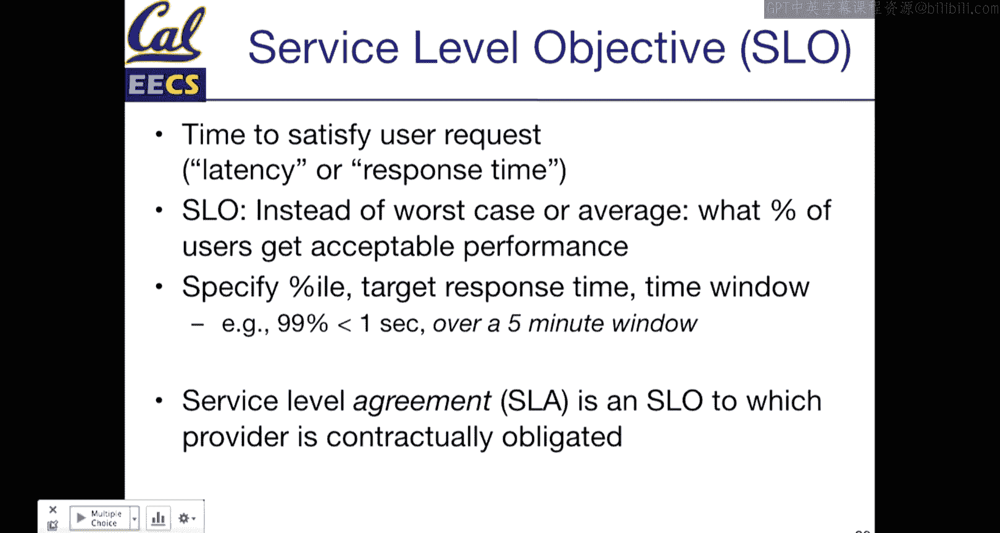

# 021：UCB《软件工程｜UCB CS169 software engineering 2019》中英字幕deepseek p21 21 CS169 21.zh_en -BV1UsB7YPEMj_p21-

I thread the eye quicker， please。

Come on。

All right， sorry that I've forgot the eyecler base， but that gave people more time to show up anyway。

To continue on with the theme for this week， DevOs， we ended Tuesday。

Getting into a little bit about continuous integration， so this is the CI in Travis CI。And。

CI solves a whole bunch of potential challenges for you。

 but the idea is that it is an environment which is hopefully hosted remotely that we can use to。

Do all sorts of useful things that would be kind of annoying。

 sometimes painful to do on our development machines。

But a lot of this is things that are testing in a way that。

You we could potentially do all these things locally， but they would be slow。

 And the nice thing about hosting something like CI。

Is all this stuff can get reported back to us automatically on GiHub so assuming that you have Travis setup。

 you make a pull request， it runs a bunch of tests that you define， those are your cucumber specs。

 your R spec tests， they are anything that you write in your Travis。 yamal file so you can。Add。

 you know， as much stuff as you really need。 And then C runs all that stuff gives you back some results。

 Maybe it connects into other automation。 So the very last example is Salesforce， which has。

This is even a couple of years old， but over 150000 test cases that they run on every single build of their application。

 The really cool thing that Salesforce does， they are also like a development platform。

 so you can build applications that sit on top of Salesforce similar to like the app store or the Google Play store when a developer submits those applications。

 they also have to include test cases with their application。

 So on every build Salesforce not only runs it's tens of thousands of internal test cases。

 but it also runs tens of thousands of external test cases submitted by customers to make sure that their customer applications don't break in unexpected ways and all this would be impractical to do on a development machine Salesforce is such a large application that even building the Java application on an individual developers machine is kind of impractical on its own。

😊，So they have a scenario where advanced tooling is certainly required， if you're interested。

 come to office hours because I internet Salesforce。

 my roommate worked on some of the build system for Salesforce and when you have millions of lines of Java。

 things kind of get insane， but developer tooling is a strategy to manage that。So。CI useful use it。

 It has saved by but more than once at Grcope。 when you learn to have it as a tool。

 you will want to set it up hopefully on every project going forward。

 So CI often closely aligns with what is called continuous deployment。

 So we have continuous integration and then the next step is continuous deployment and。😊。

If continuous integration is running our specs on every single build。

 continuous deployment would be deploying our software on every single build。

 and continuous deployment is something which。It really depends on the goals of your product。

 your tool， how your team operates as to whether or not you really want to employ a 100% continuous strategy with every single build that gets merchant to master。

 gets deployed。The idea is that if Travis is green that that master branch is ready to go， then well。

 if it's ready， if you believe that your specs are good and passing。

 then why not just deploy automatically and for the most part， if we do this， your software。

 every time you merge your pull request， everything is good。

 it goes into production and you don't have to worry about things and the question is like for SaS applications。

 you know this is kind of。And the antithesis of normal software， right， you load up a web page。

 there's no versions。 you don't know if there's updates as a user。

 you kind of just perhaps see new stuff and。In general， for a lot of applications。

 this works pretty well。 if you do things like run a library where you are providing a dependency to other developers。

 you might still need to do things like have specific release tags so that people know what version exists if you ever look at the package history。

 the release notes on GitHub for any of the gems that you pull in。

 you'll see that a lot of times these gems especially also node modules。

 just because there's so many more of them in JavaScriptland。

 they have bots that will take your Git commit messages， package them up into nice release notes。

 create a Git tag so that there's some tracker and Git in terms of when a release was made and push a version out to rubby gems。

 NPm for node， whatever it may be and so。Continuous integration is a really continuous deployment is a second level of doing things continuously。

 it doesn't always make sense for every project， if you're only merging in pull Ques every so often it's perfectly okay to say。

 well get push for Roku master is easy enough， I do that。😊，You know， once ever。Two pull Ques。

 one every through cores， whatever it is for your project。

 gradeScope follows a model that we have a web app to deploy whenever we have a few pull Ques that seem ready we'll deploy。

 sometimes that's after an individual pull Que that maybe this is just a configuration change for a school。

 maybe it's a big feature。But oftentimes sort of like， well， there's stuff ready to go。

 let's just push out now。 But so whether you go 100% continuous or sort of automated。

 but semi continuous is really up to your scenario。 So first click question。

 why we definitely have the base。So let's see， come on， clicker。Are you going to。

 did you already die because that would be？

Kind of impressive。Oh， look， it already died。Why even bother starting it if it's going to die before the first question？

嗯。Alright， okay， and。

no。So。It is open。If we're testing some AjaX feature， where might we want to test our AjaX feature？

And a couple E's， cool， so we will step back and review some stuff。Let's see if we can get up to 30。

Since there's not too many people here today。Oh， nice， we passed 30。

Let's give people like 10 more seconds。All right。Awesome。

 so most people have settled on D as the answer for this one。

 I'm not going to have people revoke since most people selected D， but in this case。The answer is。

All of these so when we are developing a new feature。

 we always want to test in our development environment if you're developing a feature and you're not testing it yourself。

 you're generally just not doing much your job as an engineer。

Although I will say there are things that are one line changes that can usually be caught by specs。

 so maybe it depends on how small the feature is whether you want to actually spin up a whole development environment。

 GitHub lets you edit files in line for copy changes。

 This is like a really useful tool but generally we're gonna want to test things in development。

 we should have a continuous integration server， So Travis running our specs。

 so we should probably have some controller specs that respond to some action。

 maybe return some JSON data。We should probably have some cucumber scenarios that make sure that whatever the frontend is doing makes that JSOM request and updates the UI accordingly。

 so maybe this is incrementing some counter updating and grade on grade scope whenever an instructor takes a grade。

 we have a spec， not cucumber， but close enough that makes sure that that counter on the website gets updated correctly so that things are there。

And in the staging environment， so。Not every application will be large enough。

To have a dedicated staging environment for the purposes of this course。

 your Heroku deployments are right now essentially staging environments because you're not。

If it's an existing application， you're not yet pushing functionality to the main application。

 If it's a new application， well， no one is。Other than your team and your customer are using it right now。

 So it's， it's sort of equivalent to the sta environment。

 But it is a staging environment that very much mirrors the setup of a production environment。

 So you would want to test in all of these。Especially for something that may be hitting remote endpoints。

 if it has complicated dependencies， then staging becomes a lot more critical。

The idea here is that CI continuous integration， these are our Travis setups that run cucumber。

 R specEC， any other tests that you might have， and if we want to take an extra step we could continuously deploy our applications when things are passing。

So that is。Some of the tooling that we have and we'll revisit tooling a little bit more later。

 but a lot of the next set of stuff is how do we develop our application in a way that makes our lives easier as developers how do we make sure that when things get complicated we have a process for making it as easy as possible and so upgrading not necessarily just like bumping ruby from 2。

3 to 2。4， although that's potentially a challenge there but adding a new feature those kinds of things。

 how do we handle this safely so if we have multiple servers in production。

 so naturally an application like Facebook， there's tens of thousands of servers running at once right now most of your applications are just running on one heroroku instance so when it's one instance at a time。

 you don't really have to worry about this but it does。

It might not take too long before you have two or three or four servers running at once。

 and so the question is， if I'm rolling out an update to multiple computers。

What happens when one of these servers has a different version than one of the other servers。

 will my app still function or will things just blow up or will they blow up you know 25% of the time and then 50% of the time and then eventually things will be consistent so how do we manage that process？

And sometimes during our upgrades， we have to do things like migrate our data right if you are changing the structure of names to go from a first name and a last name to a full name or vice versa。

 maybe you're changing your password hashing formula all sorts of things。

 maybe you're just cleaning up your data model to make it easier to develop in the future。

 how do we handle things with migrations because。You while you're adapting your data model。

 your code also has to adapt to go with it， right you pretty much have in most applications。

Code that relies on the structure of your database to function。In theory， we could say。

 it's great when it doesn't require that， when code just sort of works。

 but that's a pretty unrealistic。Expectation to have code that is totally disconnected from your database。

 So how might we do this the easy way？ So the easy way is great when you can get away with it。

 Some applications， it is perfectly acceptable to take them offline for a short period of time。

 some applications it's perfectly acceptable to take them offline for a few hours because they just don't have usage that follows those needs。

 if you have a strictly business application that people only use Monday to Friday。

 you could probably even take it offline for the whole weekend and your users because they hopefully have lives on the weekends and not are working seven days a week might not even care if it's offline Saturday and Sunday。

 So when you can get away with it absolutely take the easy path of getting away with it。

 Now the reality is。😊，Once your application gets large enough。

 you can't necessarily get away with these kinds of things right once you have users in multiple time zones。

 it becomes very clear that there is almost zero good time even during a 24 hour period that the application is not being used so。

You knowThat said， we need to think about how to do these things。

 The other thing we're talking about monitoring later。

 monitor your usage because if you monitor your usage。

 you will know when you can do updates that are more critical that might take more time if you're working on any educationally oriented application December 31s is consistently the day that literally no one is doing anything on education oriented apps like less so than even the days before Christmas somehow less so than New Year's because like the new semester or trimester picks up then but like the last like day or two days of the year。

 no one is using educational apps so if you need to break something break it then。So with that said。

 what is our naive approach， well， our naive approach involves just taking the application offline。

 applying our migrations， updating our data models， deploying the new code。

 and all of that happens sort of in a synchronous manner where。

No one is using our application and so what does it look like in code Well in code we might have a active record migration so adding new columns。

 this one is going from a single name field to a split first and last name。

So the way that this works is we tell active record to add two columns。

 then we run a script over a database that updates the attributes for every single user and if we have a lot of data this would take some time and so we would want our application not to necessarily be running during that process right in order to make this change。

 we also have to update our code。To know that there is a first name and last name field on our users。

And if we remove the name column， we have to make sure that nowhere else in our application。

 we referenced this。 So this is why we would want to do this in one step。

 And if we do it in one step that's great， it makes things easy but our application might need to be taken offline to do that this is a bit of an aside。

 But when you're migrating data， you can wrap a bunch of queries in a transaction。

 So if you've taken CS 186。😊，Which is the course on databases。 If you haven't taken it。

 it's a pretty interesting course。 It's a systems course where you learn how to build databases。

 but transactions are a tool which allow you to。In a very easy manner。

 say I'm going to do a bunch of work， this could be one query or this could be a million queries and if 999。

000 of those1 million queries fails then it will be able to roll back all previous updates so a transaction keeps the state in sync and this is great because if you somehow find an error in this process when you're migrating data you don't want or you probably don't want half your users to have a first and last name and half of them to have a full name field unless you build your application intending for that to be the case。

 so transactions are useful tool they are useful not just during migrations。

 but if you ever have multiple updates that need to happen together to be logically consistent theyre something that you can use and all you have to do is your model name dot transaction and then do so。

A block of code where everything within that block。😡，Happens within a single database transaction。

 so that's something active record provides and use it where appropriate。

 but for the most part you dont really need you don't necessarily need to use it so。

If we cant or if we can't take our application offline and then deploy it。

 how do we do incremental upgrades that require things like schema changes that require us to have different application code？

😡，This is the idea where we're going to design our application to work in multiple states at once。

 we're going to design to handle Code pathth A and Code pathth B。

 and we use feature flags to do this。And the idea is we apply a non destructive migration first。

 so we'll add our database columns。and our code， when we do this probably won't reference them yet。

 so we'll add our first name and last name， we'll deploy a second version which understands how the first and last name columns work。

😡，We'll toggle a feature flag on。😡，We will migrate all our data in a slower but safe fashion。

 and then when everything is migrated， we will deploy again removing old code。

 so this happens in a few steps， there's a bit of code here。诶。😊。

But we'll look at how this might happen。 So our first migration。

Is now going to be a little bit more complicated so instead of just adding a first name and last name field。

 what we're going to add are a column that says whether or not we have migrated this data we could technically get away with not adding this column right you could check whether the two values are nil or null in the case of database。

But。ItIt makes things a little bit clearer to have a migrated column。

 but we could certainly get away with。With doing that with without that， if we needed to。

 And so now in our movie goer model， where we're trying to migrate data from a single name to a first name and last name。

 we're going to。Write some code which understands how to handle both cases of updating a user。

 whether there is a name or not， and what we're going to do is we're going to use in this case。

 an application level feature flag so。Feature flags is a model。In our application that we built。

 so this is not a。This is not a built in feature， there's plenty of different ways to do this。

 you could just have a global variable or some setting on your model。

 we can build feature flags in dozens of ways we'll mention in gem later to do this but if we have our feature flag enabled so if we've already done the migration then。

We will find a user in this case by a first and last name。And if not， we'll find it by a full name。

 so we have a method which handles both code paths。

 so in our code we would need to know to write this and to use it。And then。That's half the battle。

 right， Half the battle is making sure that wall our data is in two states。

 We have code that knows how to handle both states。

 So this is why when we talk about things like observing the law of demeteror。

 it's important to have functions that don't delve too far deeply because that means as long as we're not。

哎。You know， making long method calls or chains of methods。

 then we can write one function that handles behavior in multiple places and we don't have to update our application code across you know every single view you can imagine that a thing that queries for username in this case might be present in many different views so having only one place to update would be ideal if we can get there。

 So assuming we've done that， we then need to migrate our data and so one way of migrating our data is having code which says well whenever I update the user for some reason。

 I'm going to make the migration happen sort of at runtime on demand。

 and so this could be a before save hook So every time a user logs in。

 maybe you update something about their last log timestamp and so the user logs in again。

 we'll update their name in the database automatically。The user won't have to do anything。

This could be a number of different ways， but what this is essentially doing is saying I'm going to migrate the schema for this user。

 I am also going to mark that they have been migrated so that you know in your code earlier on。

The vet user has been migrated to the new version and this code in this version with the feature flag that handles multiple kinds of name columns。

 this could live in your application for essentially forever if you wanted it to you could decide to never sort of remove the old column。

 but hopefully as code changes you would want to go back and clean things up so。

With a with the feature flagged the idea is that we'll have two code paths to have sort of the idea of one unique feature。

 so sometimes updates are a little bit trickier and the trickiest place to handle updates are updating your username hashing algorithm well it might not always be the trickiest。

 but it's a common tricky example。I will admit that。

This is something that I've been working on for the Snap cloud。

 and it's not a RELs application which makes it annoying for different reasons。😊。

It's tricky enough that I've been putting off doing this。 But in theory， you follow a。

And a fairly simple path， which is。We want to change our encryption scheme of passwords in our database perhaps to make them stronger。

 which is the use case that I would like to do but this could be for a whole bunch of reasons this could be migrating from custom password authentication to omnioff this could be a whole bunch of reasons that we might need to migrate password data and the challenge here is that passwords in particular our one-way hashes we can of course verify that a given password matches is hash。

 but we can't just take our encrypted password column and migrate it to a different hash without breaking everyone's passwords and naturally we don't want to break everyone's passwords because well that would suck for users if you are a business breaking all your users logins would invariably lead to users just not signing in again。

 and so that would probably not be so great。How do we employ this？We do things in multiple steps。

 so again， we start by adding only the new stuff so。

We add whatever we need to in this case for Omniath。

 we could add a new column name for password version 2， something like that。

 that could be a separate field that could be a Boolean attribute as to which version our password follows。

Anything like that？And then for passwords， when each user logs in， at that time。

 they provide their password that is about to be hashed， and so with a password。

 you can hash it twice， hash it once to make sure it verifies。That it fits the old version。

 then hash it a second time with your new scheme so that you store。

The safer newer version of the hash and then。Eventually where eventually means depending on how active your users are。

 possibly never， you will have all users migrated to the new password hashing format and at some point you get to say okay。

 it's been three years you haven't logged in， I'm just going to invalidate your password so。

Passwords are a particularly tricky case of getting everything to work。

 but they are one that you will encounter if you are interested in following news about sort of application security software breaches。

 things like that， it is not uncommon to see breaches where after a social network or something has been breached the data returned will sometimes include。

A password versioning identifier in the breach data and what's happened in the past is I don't remember the specific breaches offhand。

 but things like Adobe， Tumblr， Dropbox， LinkedIn have all had breaches。In the past and some of them。

 the data or the damage has been limited because at some point during time。

 they migrated their password hashing to a more secure version and so the breached data or the passwords that were leaked in that breach data were only the older versions that haven't been updated and so just a reminder that you know companies do get hacked and keeping your passwords secure is a really important thing。

 and so that's one way or one other use for feature flags。Feature flags have other important uses。

 So sometimes we're not talking about data migrations， but just a new big feature。

 So sometimes this is a gradual rollout of features。 This could be for performance。

 really oftentimes This is。啊。If it's a marketing site or if it's a new feature。

 this could be A B testing。 So giving users two new versions of the same feature and seeing how they work。

 this could be beta testing so。if you are rolling out a complicated feature。

 but you want a small subset of your users to have early access， feature flags are a way to do that。

Feature flagging might involve just having code paths which to make code review easier。

 you have them behind some conditional where they're just never going to execute until things are ready so this happens fairly often at gradecope especially with frontend code where you can imagine that for instructors。

 the grading page is pretty critical， like you don't want bugs in the grading page because grading data getting lost would be really terrible and so we will have feature flags that say you know if this new style of rubric item is enabled。

Then use in this case a particular react component or something like that and those deploys happen over multiple times because we want code review to be easy and so we'll deploy the code and you know two or three or maybe four stages if necessary and then we'll flip the feature flag for some limited users and then ultimately for everyone and then remove the feature flag so there's lots of ways that you can do this。

But they are a tool that happens or that occurs over time。

 So there's a really useful gem called rollout。 if you just type rollout into the Ruby Ge site or into Github。

 it'll come up， but this helps you with some data modeling it gives you some really nice utilities for checking whether feature flags are enabled。

 there's tools of doing it at an app level and also a per user level So all sorts of things like that。

😊，And so。The question is， if we have feature flags。Wow， that's good， the batteries died。

啊。Come on， I clicker。

Okay， well， that's unfortunate。嗯。So。If we have feature flags。

 where might we not want to put our feature flags？Or are these all acceptable places to put our future flags？

All right， let's take another 10 or 15 seconds。See if we can get past 30 again。All right。

 let stop right there。So we had。A pretty wide range of answers， so that's good。

 so take a minute and discuss with someone around you if there is in fact someone around you and reoke but we'll take a minute to discuss this。

Then we'll make a case for one of these。Or all of them。All right。

 take another 30 seconds or so and put in a vote。All right， can we get up to 32 again？All right。

 well， it doesn't look like we'll get up to 32。Okay， so this is interesting。

 a column on an existing database table that was what came out on top so why？

So let's talk about this。 so in this case， the argument that I'm going to make here is that a is nope。

 not that。So the argument I'm going to make here is that a is generally not the best case of these options for putting putting a feature flag in our application。

 although it is a place where being that you can access that data in your application。

 you could functionally put a feature flag there， this is code， Ruby lets you do just about anything。

 So all of these are places where。You know， we could change the behavior of application the question is。

Then why is storing feature flag information in our database a useful tool and？

Well you know in what scenarios do we want to take advantage of that so there's two options here that this is trying to talk about which is an existing column on a current database table so you could think of this as something like a password version flag on a user table。

 you could think of this as user maybe there's a column that says has beta features something like that。

or a separate database table， and you might actually have both in an existing application and you might have feature flags across multiple tables and it really depends on what those feature flags are controlling。

There's two important things here that make this useful which is a column on an existing database table so where do we use this if you have per user or per entity feature flags so this would be a user who has access to beta features potentially this could be all beta features this could be one feature flag per unique beta feature so we don't have any student facing beta features for gradecope at the moment。

 but what we do have are beta features for courses so the online quizzes that we use for micro quizzes those are a feature flag that lives on each course because right now it is technically a beta feature mostly because there's a few things that I want to add to it before it goes out publicly but that flag lives on every single course so。

It's off by default but you can turn it on for individual courses。

 I have the power to turn that on whenever so it's really handy。

 but that is a use where every single course gets to control at any point in time whether or not that feature is enabled so that is a column on an existing database table。

😊，For application level features， this might be something like whether or not you have a version of a new homepage。

 this might be a feature that you're just not sure if it's going to work out。

 you might have an application level database table for feature flags this could be something like the version of names。

And the reason that we would use a separate table is that it's a logical place to put features which affect everything in our application。

That's that's a use case for having a separate database table where this feature flag affects every single user or has really large crosscutting concerns that we wouldn't want to check in every place Now what advantage do we get from having them in a database table。

 well， if they are a feature that can be toggled on and off really quickly having them in a database means we do not need to deploy our application So for functionality where you're particularly concerned about the performance impacts where maybe this is a new feature that might risk slowing something down。

You would want to be able to toggle that on and off very quickly。

 right If you have a feature that is going to risk potentially taking something down or you're just not very confident deploying your application might be too slow of a remedy for that。

 And so a database table is useful there。 And if you ever have something which is per user。

 then having code that tracks whether or not users have access to this feature is not a great solution。

 there was a point in time where there were a couple features in great scope where。

The the functionality of controlling whether or not someone has access to that feature was not an app level config。

 but there was an array in the users model， which had just user Is。

 So every time we wanted to give someone access， we had to deploy the application。

 that works when you have few users right， you can get away with these solutions。 but。In general。

 our goal should be to have application features that work in our database so questions so far on feature flags。

 deploying things， strategies for making multiple deploys。Cool。

 so this next section is all about application security。

 so what can we do to protect the data that lives in our application？YouWhat are some strategies。

 what do we need to protect against all that kind of stuff and we'll go through a few things。嗯。

We as application developers have responsibilities in developing our application code in a manner that keeps the user's data secure。

 the infrastructure that we choose also has its own responsibilities in keeping its data secure as well so you know by choosing Heroku which is a trusted provider。

 they have large teams dedicated to security in fact they have teams that work with mitigating vulnerabilities when they arise and deploying environment safely。

 you they haveresponsibilities there as well well， and so you it's not just our own development。

 but it's the infrastructure and the tools that we use as part of that。So。

We're going to talk about some common attacks and mitigations there are more of these in the book there is also CS161 computer security。

 161 gets into a lot more than just web app security the role of cryptography and what that means there talking about operating system security。

 so memory access protecting against threads and applications corrupting each other's data on an individual machine are also important pieces of computer security overall。

 so there's more in 161 but Nick Weaver's version which is usually in the fall has a pretty big module on web app security so if you like this stuff I encourage you to take 161 if you have the chance。

What we're going to talk about today， eavesdropping and SSL。

 so how do we protect our data as it's being transferred from my computer to the server？

We're not going to spend time， but there are ways of hijacking user sessions and that is a place where you would need to protect against using the default tools and rails help with almost all of these SQL injections。

 so how do we make sure that when we run code that it is executed safely in our database cross site request forgery So this is an attack vector that we'll talk about later。

 cross site scripting again， something that we're not going to talk about today。

 but is a really common attack possibility for web applications and。

One that we're not going to talk about because it's mostly been solved。

 mass assignment of sensitive attributes。 This involves doing things like if you ever pass if attributes from a Paras object so you might have an admin flag on a user right and if you do like user to update of parameterss well then any user could potentially set Paras admin equals true and have access to some data rails now has really good protections against this starting with version 4 which everyone should be using at least version 4 in their applications but。

Versions 5 and6 you know have even more tools for the most part。

 Rails is going to warn you if you try and do something that would be insecure with respect to6 so we don't need to talk about it too much。

 but it is worth highlighting because in the early days of GitHub there were a couple places where it was possible to by understanding how rails works escalate your privileges on GitHub and luckily that was the early days of GitHub and it's been gone for a long time but it is a potential thing to be aware of so SSL SSL is the S in HttPS so。

呃。When we send a request from our computer to the server。

 the server sends back a bunch of data over HTTP。This data includes stuff that is potentially sensitive。

 so the obviously sensitive stuff， passwords， credit card information， social security numbers。

 if this data is not encrypted， then anyone on the w-fi network could or a local network could snoop and inspect that traffic there are some Firefox extensions which mostly don't work now。

 there's one called Fire sheep which would just record all w-fi traffic on the local network。

And anything that was unencrypted， it would grab the cookies that were being sent in the HP request。

 show them in a little sidebar， and then it would give you like a login button for that service。

 So if you send traffic that's unencrypted， it's open to be eavesdropped upon and if that includes a cookie or password。

 then others could steal that information。And so the goal with SSL is making sure that two parties can securely communicate without necessarily needing to agree upon some secure information firsthand right I the first time I visit Google。

 co my computer knows nothing about Google。 co， but I still want to sign up。

 put in a password and not have that be sent all over the world so。Because we don't know each other。

 the solution is what's called public key cryptography。 So if you've taken 70。

 most versions of 70 cover a brief intro to RSA， it's again mentioned in 161， but RSA is。

The original algorithm for public key cryptography。

 so winner of the 2002 Turing Award without RSA and without public key cryptography。

 we would probably not have the basis of much of the modern economy because if all this data were public things would probably not be so great so this is a really high levelvel overview。

 you don't need to know the details of RSA for this course。

 in fact because there's not really a final for this course and only microquizzes you probably don't need to know the very great details of much stuff at this point but that's beside the fact。

So with RSA， the goal here is each pair will have a public key and a private key。And the server。嗯。😊。

The server is going to handle the work of having a certificate pair that it's going to send data to the browser。

And that is going to be used to do the process of key exchange。

 So there's a public piece that because it's public， everyone knows about it。

 There is a private key which the server must keep secure。

 your browser has its own data that it keeps secure， but。

It handles this in the background automatically and the goal is right。

 if we have with my private key and another user's public key。

 I can encrypt a message that only they can decrypt and vice versa and。

When we have both keys we can establish secure communication so how SSL works in practice the critical bit for a server or a website is getting a SSL certificate that matches their domain so Bob。

com proves in some way that they are the owner of Bob。

com this is usually done via DNS or some other method Heroku provides free SSL certificates it is not enabled by default but it is an option in your application settings I encourage everyone to use it because even for simple application it's free it is fairly easy to set up it uses just the domain name of your Heroku application and you get。

A certificate that gives you SSL with fairly little effort。And。

Once your server has been proved to this certificate authority。

They will issue a private key back to the server that can be used to generate an SSL certificate which matches the domain name。

In this case， Bob。com， whatever it may be， you install the Cert on your server。

 so if you're using Heroku， this all happens automatically。

 which is great and that certificate identifies your website。As bo。com。

 it is attached to a certificate authority， so your browser will then verify that this certificate comes from that certificate authority and。

Once that browser or that website has been verified。

 SSL then does symmetric key encryption where a longer but more secure symmetric key is then exchanged and that's what's used for encryption because public key cryptography while exceptionally useful has quite a few steps and is a little bit slower。

In railils you have the force SSL option which can set at an application level。

 everything to be redirected over to SSL， this should absolutely be on with the caveat that you need to have SSL set up before you turn this on because if you force SSL and your certificates don't work。

The browser rejects the request， so push the button on Heroku that says give me some SSL certificates。

 then make a pull request that sets config。 for SSL to true， deploy to Heroku。

 everything should be good and your app is automatically way more secure。

 and it's a couple easy steps。So。That's what SSL does。

 importantly there are things that SSL does not do that are critical to understand。

 they are also critical to understand for the purposes of general information security in terms of when you visit a website as a user just because there's a padlock there doesn't necessarily mean everything is okay。

😡，So。You SSL means that the URL Bobob。 co has been verified as that site Google。

 co someone else has said that this site probably is Google do co Of course what happens in terms of things like phishing attacks。

 you know G O0 G EL instead of L。 co where someone is trying to in person at Google would probably also have an SSL certificate。

 So it's up to you to know if the site that you're visiting is the one that you intend to visit。

But there's some light amount of verification， it prevents eavesdropping on that connection。

 and it's something that the server has to set up and handle。

SSL does not give you any protections that the user is who they say they are。

They could be impersoning someone else， it is possible to transmit an imposter cookie over SSL still。

 it doesn't give you protections against that。嗯。As a user。

 SSL gives you no protections over what happens to your data when it reaches the server。

 so it is possible and this happens in some cases that you have data which is sent over HTPS encrypted to a server and then on the back end of that service。

 there's data that is now so the server can read it， it's decrypted and then。

That service makes plain insecure HTTP calls， which then down the line can be snooped upon。

 sort of mitigating half the reason of having SSL。And so as a user。

 you don't necessarily know what the application is doing behind the scenes。

 but you still at least want SSL for the part that you can send。And， you know。

 if the server is evil again， it doesn't protect your browser against there。 So most phishing sites。

 if they're doing a reasonable job attempting to fish someone， will have SSL set up， although。

You know， most people who are fishing don't do a very good job at it。

 which is why spam filtering is pretty effective。But SSL is something that every single say。

 even if you don't think there is secure content should have。

 so an important piece of SSL as well aside from the security aspect is that because the content itself is encrypted。

But it's harder for the user to or it's harder for someone to snoop on and understand always what kind of content the user is reading about。

 So if you want to or if you have some content which is particularly sensitive， maybe that is。

You know， something related to。Sensitive documents。

 maybe that's something about democracy in places where that is a sensitive discussion。

 SSL helps in all those cases as well， although it is often not sufficient on its own。

So the next bit that we have to be concerned about is database security。

So this is the Canonical XKCD comic on SQL injection。

 which is someone named their students on their births certificate certificate with a name that could be used as a SQL statement。

And the risk here is that whenever we fill in data in our application。

 this gets interpolated into a SQL query and we have to make sure that when we pass that data into the SQL query。

 we do it in a safe way， such that if you have a SQL injection attack naming yourself quote semicolon drop table students wouldn't actually drop the database table。

 most application frameworks do a good job of this。

 but it's also really easy to shoot yourself in the foot。

We have a view which has a form field called name in our application， we do something like this。

 Mogoer。ware name equals and we just take that string and drop it in to these SQL query。啊。

Never write a SQL query that just interpolates a string into the context of a raw query。

 This seems natural to do， but never never do this in an application。

 there are tools which will help monitor your application。To make and do analysis and your code。

 to make sure that you don't do this， but if you ever pass raw data into a part of a query。

 whether that's a where， whether that's order by， group by a select statement。

 you are opening up yourself to some serious， serious issues where。

If if that query is passed in raw and in a way which is not protected against。

 you have a query which turns from one select statement into two pieces of a query which selects something then immediately destroys all the data so you dropping a whole table is malicious and would be very clear immediately that your application has a problem。

 suddenly no one can log in if you are susceptible to SQL injection attacks。

 what is more likely to happen is that some user says you know update users set admin equal true where some other username exists And so you a smart person taking advantage of a SQL injection attack would just give themselves admin privileges but if you want to wak havoc you know dropping the user' table works as well for that so in rails。

The solution is to use question marks and pass in parameters that rails then securely interpolates into your query by escaping them。

 database engines have ways of doing this as well， so this is the preferred method。

 every example that you see for doing active record queries should look something like this，But。

Using a question mark in your queries is a way of having rails make sure that the data that's passed here is not going to be susceptible to SQL injection and does this by essentially I quote escaping the data so that if a user were to pass in a query here。

 it would fail。So。This has generally been assumed to be false。

 but is a pretty funny example of someone driving around。 So you have traffic light cameras。

 Obviously， if you're speeding， you don't want a ticket。 So what do you do。

 you make your license plate look like a SQL query that hopefully avoids getting a ticket。

 There are examples of people trying this。 for the most part， it seems that traffic cameras are。😊。

Not susceptible to SQL injection attacks， although there's some suggestions that people say they've gotten this to work。

 there are other database designs that have challenges。

So null is the name for the null value in most databases if you look there's a few really good articles on wirered about people who have the last name null and the havoc that this can cause in their lives because applications don't handle things like names with Nll very well。

Probably can't get yourself out of a ticket by changing a license plate， but。You know。

 you're welcome to try。All right so。The next of our vulnerabilities is what's known as a crosss request forgery。

 so the idea here is that if I am a malicious website。

 I might want to try and make a request to something like a bank website and see if I could log in as that user so acting on behalf of a user who doesn't necessarily recognize that they are logging into some site。

How would this be possible？So whenever I log in to bank。com to log in。

 the bank sets a cookie in my browser。That has to happen so that with each next request。

 the user is identified as being logged in。Then。When you visit some other website。

 So this could just be a random blog。 that website wants to impersonate your user by logging in and grabbing the cookie to。

Your bank， so how might the Evo blog site？How might they do this？

If they were to do something like embed an image that attempts to access the bank site。That would。

Request the cookie。That cookie would be sent with that request。

And it's a little bit tricky to do this， like browsers themselves make it more difficult to do this work now。

 so it's not as easy as just embedding an image。But。Essentially。

 the idea is embedding some data on your page that tries to make a request to some other website。

 and you would have the ability to then sniff the cookie of that request。

And if there were no protections for this， another domain accessing another domain's cookie would in theory give them access because that cookie is a login cookie to put that in another browser request。

 make a request to the bank's website， see your data， potentially transfer money。Naturally。

 banks are sort of the economiconal example of where you don't want money stolen。

 but there's plenty of cases where this could wreak havoc so。What are possible solutions。

 So if your website， you could check the refer header of an HP request。

 you may notice that the word refer is spelt wrong on this slide。

 it should have two R's in the middle It is intentionally spelled wrong because theres a typo in the original H TDP spec。

 and it became popular enough that the typo has stuck around。

 So H TP headers forever have a typo in them because no one is going to break the Internet。

 But you know， that checking H TP headers is some protection。

But not necessarily great because that could be spoofed。So cross origin resource。

 resource sharing or cores is a way of specifying to the browser what web。

 what domains are and are not allowed to make requests。 So by default， now。

 browsers a block requests that come from domains that are not their own。

 So Cos headers are a good tool the challenge with cores is that it is up to the client。

 In other words， the browser to enforce following those that convention。

 So if someone were to get a cookie and they were to somehow。

Get clients to use a browser that disables the core security。

 then they would have access you could violate these rules in Chrome。

 there are hidden settings which you could disable this security。

 you should never do that except for possibly development testing of something。

 but that is one possible implementation。And the strongest form are things that rails provides by default。

 so in general， this is a thing where if we are doing the right process。

 if we are taking advantage of the tools that are provided for us。

We don't really have to worry about this。The key value that Rails uses is called CSRF Metag。

 so if you ever do inspect HTML on your page and importantly on your form。

 so your user creation form， if you look at the Roten Po app on the movie form。

 there will be a hidden input field that has a special secure token which is generated for every single page。

 and every single form on that page， so they are perform tokens。

That gets sent with the request that rails internally will validate that this token has only been used once that it came from that domain。

And this gives you pretty darn good protection against a cross site request forry。

 so that token has to come from your server if a request comes from another server。

 it wouldn't have that token users could only get that token by already loading the page when they are logged in and that is。

Perform tokens， you can set this in your application controller by using protectect from forgery。

 so in Rails for and For applications， this is on by default。

 so you know if you don't have or if you have a normal application and the tokens don't align rails will throw an exception that just leads to a generic error page。

There is a note there that if you're building an API only application。

 there are better ways of handling this than throwing errors， which is that with an API。

 you might have some different authentication methods， but by default and rails。

 you have the option there to。to protect from forgeries and this is one of the things where until you work on a framework which is not rails。

 it's hard to appreciate how much built in security rails has。

 but it is there for you and it is super useful so this question。

If a site has a valid SSL certificate from a trusted certificate authority。

 which of the following are true， the site is probably not masquerading as an imposter site。

 is it true that CRSRF and SQL injections are harder to mount against the site and is it true that our data is secure once it reaches the site？

So。Is one of these true or all of these true， only some of them？

See if we can get up to 30 in the next 10 seconds。All right， it's at a minute。

 so let's see how people did awesomesome， so and even distribution pretty much。So。

Let's take about a minute and a half and vote again and then we'll discuss which of these might be true。

And while you're reviewing this， remember that the only setup in this application is the SSL certificate。

 so assume that that's all that's been done on this application。All right。

 take another 30 seconds and put in a vote。All right， let's give it another 10 or so seconds。Well。

 we're back up to 30， which is what we had before。So。A little bit more for both B and A。

 so we do seem to agree and some D that pretty much Aburn agrees that one is true。So with SS L。

 the site is probably not masquerading as an imposter website。 So this was true。

 this is the point of an SSL certificate。 If you go to Google do com and there's an SSL certificate for Google do com。

 someone has verified that。At least the website of Google do com says that it's Google dot com。

 again， importantly by。By having an SS health certificate。

 it just means that you're visiting the domain that it says you are visiting。

 that does not mean that that domain is actually valid。

So like a really common thing that happens is imposter sites buying misspellings of domains。

 UC Berkeley owns at least two or three misspellings of the word Berkeley because no one who goes to UC Berkeley can figure out where to put the Es and it would be pretty poor if you know someone left off one of the E's and you still had a nice looking CalAT form that didn't go to the actual UC Berkeley website。

So， you know， it is important still that it is possible with SSL for the site to be masquerading as an imposter。

 but the domain at least will match the certificate。

Does SSL make it harder to mount CSRF or SQL injection attacks， not really？So why is that。

 well SQL injection attacks are up to your applications code with SSL。

 a hacker would only need to connect over HPS instead of HEP。

 but because anyone can connect over HPS， we don't really get protection from those additional application attacks。

八。😊，And three， is your data more secure when it reaches a site again。

 that's entirely up to the developer of that application。

 so we don't know anything about whether or not that data is secure so in this case。

But not not that option one is the only correct answer here because。

All SSL gives us is the communication from the computer to the server is encrypted and when I say that that's all that it gives us。

 that is a huge that is all that it gives us there is no excuse in 2019 for websites to not have SSL。

 while you're developing things you're developing them， that's fine。

 but when a site is out in the world it needs to have SSL on it。

 and it is free and easy to have SSL certificates。 So Heroku does this for free。

 if you're running your own website， there is an amazing service called let's encrypt that gives you automatically renewing SSL certificates。

 they verify that you own the domain。😊，Through an open source protocol。

 they have backing from groups like the Electronic Frontier Foundation which generally supports Internet privacy and other things。

 so SSL is a must for any website， there is a great resource called HtTPS everywhere。

com which gives you other resources for setting up SSL， but it should be there by using rails。

 you are mostly protected against CSRf and SQL injectionject attacks。

And keeping the data secure once it reaches your server is up to you as the application developer。

 so that means using tools like Heroku and other platforms that we know are secure。

 that means making sure that the connection to our database is also secure that means doing things like encrypting our data when we store it on a disk。

 so Heroku does this by default with Postgres， I believe you actually have to pay extra for it。

 but there are ways of getting additional security but。Using things like Amazon S3 storage for files。

 those can be encrypted automatically， there's loads of ways of keeping data more and more secure。

But that is up to the application developer。We'll just get into。

The last topic today and we'll continue next week with some Devop stuff。

The question is then assuming we've kept our data secure， how do we scale our application？

What tools do we have to understand how our application is going to grow with users？Ideally。

 if we're building a product right， we want more users because that will make us more money。

If we support more users we have to make sure that we're still going to deliver them a good experience。

 so scalability means lots of different things importantly what we're talking about is scaling from a small number of users to reasonable number of users we're not necessarily talking about how we go from zero to Google in one step there are many steps a lot of them which involve good timing and good luck in getting from zero to Google but scalability becomes a concern long before you hit Google scale and importantly that means that there are different solutions at different levels so。

😊，One of the things that we care about is response time。

 so this is by far the most common user facing metric and this is what we're going to focus most on is how do we measure response time。

 how do we make sure that when a user hits my website that they get a response back that they see some content in a reasonable amount of time and there are ways of measuring this。

And as we increase users， we want that response time to stay short。

 we went to support more users without wasting money。

 this is a thing where you can throw money at the problem and go a long way。

 but we don't always have the advantage of money and so how do we keep costs similar while we increase our users。

And so， you know， this is sort of seen as capturing the effects of sort of throughput， right。

 as we have more users， we want to have a similar amount of costs and speed without necessarily making too many changes。

 So we measure these things through what's called a service level objective。

 This is a goal for a particular metric over a particular amount of time。 So this could be latency。

 How long does it take to get to。A website this is most commonly response time or up time。

 so response time is from a point that I hit enter on the URL bar to the point that I get content back that is and everything is loaded。

 that is the response time。Service level objectives are measured usually through percentiles。

We have you know a million requests coming in that all have different response times。

 What metric should we pick should we pick the fastest， Well。

 that's like very optimistic and probably not too great should we pick the slowest Well the slowest cases on websites are often really slow and there are lots of different reasons why we might not be able to avoid the slowest case all the time so we usually pick a window that is a percentile so 95th percentile。

99th percentile， it could be 50th percentile， so the median value and this is over a particular window of time so when we say you know 95% of requests happen within three seconds 95% of requests over when over the last hour the last week。

 the last month。 these are all time periods that need to be defined。 And without that time period。

 we can't necessarily make a judgment as to whether or not you know，95th percentile of what。

 And so we'll leave it there。 but we'll continue on Tuesday of next week with。

With more metrics and how we measure these， do make sure that if you haven't yet that all your tooling for Heroku for Travis C for code climate is set up on your repositories。

 and that will be part of your check in next week as well。 So if you haven't set things up。

 make sure that your Github is all in order。

Yeah。Yeah。你。So。Oh， I don't think you need to do the code climate to a lot So code， Well。

 so code climate should be set up， but there should be a free version where it's just the basic。

But if you post a private。No。get I like take it closer look。Okay that。

But you should be able to just use the free version。Yeah。Okay。ok我医。I see。

They may have changed things。O so。系对系 do we啊 sorry。Oh， wow， that's okay。 So itulation a default。

 So I think if you。嗯。比说。I what theyre said， so if I go to code quality okay。

 go to the code quality one and。It says， yes。 So the， the first option is for open source。

 So that should be the one。But I'll make a note to update the docs， because that's a。

Relatively recent。And sometime in the last couple months yeah。一。嗯。Yeah。明天。O不好。Okay。

 so who should you say。哪里。Could， wait。What time you your section you want to section okay。

I will so all the GSIs have like different admin rights on tracker。And actually。

 the way things were set up， I think they have more permissions than I do right now。Yeah。

 if you that one you could probably just post in Slack too for your group and we could take a look at that。

Yeah， if so like we're not requiring people to connect tracker to GitHub， but it may be helpful too。

SoO， that's。Actually， interesting if there's no class in here on Thursdays。

As may need this room for a second session later。O， yes so。Yeah， so what you should do in。

So in your gem file， you can have like there's different groups。

So you have like a group that's like development then group that's production。

 usually so in your development group， you should have this SequL light gem。系嘅。

Just move it to development。And then in your production group， you should have the P GM。

And that should make her agree。对。And if that doesn't work， post a note about that one， but yeah。

 S light development and P。啊。so yeah really。哦好近嘢， o k 嗯。Yeah， okay。Send me a private note analysis。对。

第。Okay， yeah。 So the reason is that。咗。嗯。直接对。3。咩啊。So highqui change frequency。

 there's like buttons or something that you press and swing it up。 The frequency put is AA。都嚟出佢你起我哋。

嗯。If you're using this for or using Okay， so then you can change your color sometimes by different。

First spring。对因为。不是有问题。Like a private note。Yeah。Yeah。辩。哦。给单时。嗯。

