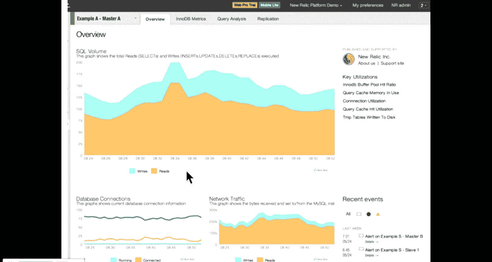
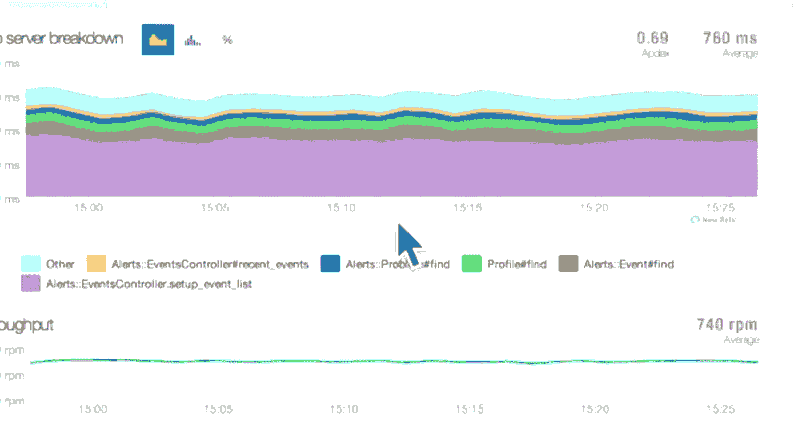
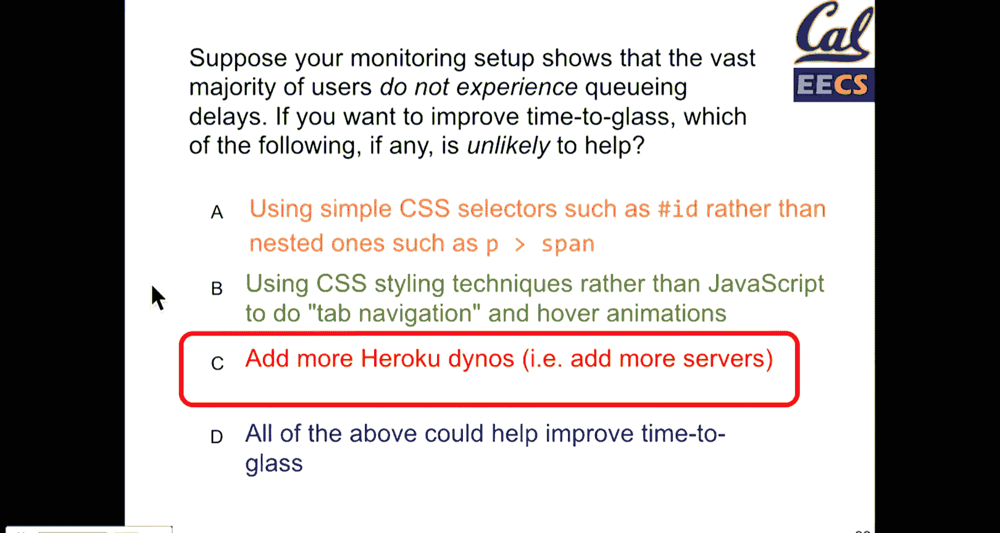
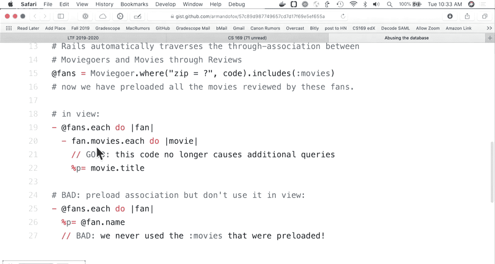
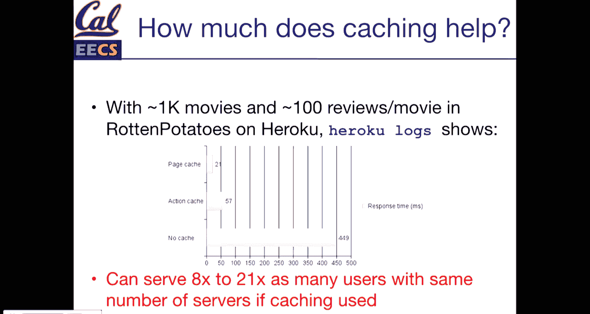

# 022：UCB《软件工程｜UCB CS169 software engineering 2019》中英字幕deepseek p22 22 CS169 22.zh_en -BV1UsB7YPEMj_p22-

嗯。All right。So。Let's get started today， we're going to finish up mostly some Devop stuff。

 we probably won't get into it， but if time， we'll start on some JavaScript things。But if not。

 we'll just continue with ja on Thursday， and then we'll have whoops。

 some related stuff next Tuesday as well。 So there are basically。Today。

 three more lectures and the final lecture will be mostly project presentations。

 we can't fit all project presentations in one lecture slot so we're trying to figure out how to best do this there'll be a piazza announcement later this week there may be just extending class time right after for project groups that can make that or we made。

Find some other time during dead week， but normally project presentations are doing deadad week since the power went out。

 literally every room on campus is booked during dead week basically。Things that happen。

 so we'll figure something out， but basically project presentations will be like a five minute demo of your project to the class。

 you do it as a group so you get to decide what to present。

 but sort of quick overview maybe talk a little bit about something interesting that you got to implement and so on。

嗯。And the other thing is this weekend or early next week。

 I'm gonna release an optional homework 8 or not 8 because oh yeah，8。 we did have seven before。

 it'll be extra credit， So it is truly optional。 But if you missed a particular homework assignment。

 if you've been missing something on a project。 This can help replace that。

 The details aren't solidified yet。 It won't be auto graded。

 but it'll be working on accessibility testing for your projects， So there'll be a series of。😊。

Steps that you're supposed to do， tools that you add to your gem file and your projects to audit and analyze your code。

 and then you will be。You'll write about what you found， how to fix some of those errors and so on。

 And so that'll be an optional homework assignment that you get to do as a group and。

Because it's a group， it is a little bit messy if it helps replace one of your individual grades。

 but it'll either be extra credit or sort of fixing a missed homework if you've done that。

And finally， Armanada Fox will be guest lecturing the last lecture before。Project demos。

 so there'll be a couple things， one will be a talk that he's given。

 which is sort of how to Fa your Way to success and his personal story which is really interesting。

 he also has some really cool coding demos that relate to some of the computer history about building games for the old Atari game consoles which are pretty exciting also just interesting like nerd coding history type stuff。

And then that lecture will also be part wrap up， but no micro quiz today。

 I did just answer that piazza question， yes， I did see it last night and I did not answer it then。

 but the next three lectures will have micro quizzes。

We left off towards the end of last week talking about DevOs with scalability。

 we went through a few basic things that when we talk about scalability。

 we're really trying to make our app support more users without spending too much more money as our service grows。

 it's natural that we need to spend more money to keep up with demand。But the thing is。

 how do we do this in a way that is stable and that doesn't break the bank so。

 There are these things that we said are called service level objectives。

 They define a rate for what is acceptable and a time period。

 So 99% of up time in the past month or 99。99% of uptime in you know a year or some period the number of nines that you have in your 99。

99， whatever percent is the total number of nines。 So usually you hear someone say like 39s49s59s So 49s would be 99。

99% and those are typically how measures for uptime。Response time， things like that get defined。

There is a formula for doing this， so again， this is one of those formulas where。

Don't memorize the formula， but do get the point of what the formula is measuring。

It's called app Dex and。When you use it it's a really simple score which is a score between zero and1。

0 is bad， one is good， pretty standard there， but the gist is of the requests to my website how many of these happen in a reasonable response time and with some accounting for the fact that some requests take longer than others。

 so if there are some slow requests those aren't so bad， but really slow requests are really bad？😊。

So we define some threshold， so this is usually something like a time that is a second。

 a second and a half。H， you get to pick that value。

We have some requests that anything that falls under this value， let's say a second is great。

 anything that is within four times that value， so one to four seconds is all right but not so great and anything over that value is bad it just won't count for your score。

😊，And when we measure this out， we get a score of。In the high 80s， lowbe 90s is good， of course。

 anything above 93 is great。And the goal here is we're looking at sort of the average request time and when we calculate this。

😊，The one thing is because we are ignoring。We're not counting really long requests。

 they just don't get counted in the summation of the score which should be on the next slide。

 so if you're not careful， there could be really long requests that don't affect your average user's performance。

 but a really long request has the ability to take down your website。At Grscope。

 there have been a couple cases where we have really heavy admin dashboards that aggregate usage statistics across all courses and all users on gradescope those requests we are okay with them taking long mostly because we're admin users although it's still frustrating for myself。

 occasionally， but every once in a while we've had particularly bad issues where like a single admin user of gradecope。

 of which there's only like 10 of us can make a request that slows other things down because processing those queries just take so long。

 So app deckex is a score for general performance， but it doesn't necessarily tell you if there might be Gremlins that could take down your website。

So you have to be aware of that。 And basically what this is going to do is we're summing the total requests that fit within this response time。

 We're waiting the longer requests for some appropriate for the medium sort of range。

 and then we're going to divide that by the total requests。

 So the particular formula is not that interesting lots of monitoring tools do this for you。

 but the idea is that we're going to divide are good requests plus a fraction of our bad requests weighted usually by half over the sum of all requests。

 So this is a graph of request time。 and what we have here。Is the t value is one second。

 so usually specified in a number of milliseconds， but 10 milliseconds， one second。

 all these are good requests。All these are that medium range and this is everything in this case beyond four seconds。

 which we're going to say are slower requests and so when we sum this formula。

The appTEC score for this is 0。49， so something that would suggest not that great。

 you would probably want to ship the performance of this application so that you have more requests under a second。

 so this is the request time and the Y access is the number of requests that have that request time。

The important thing with appdex， though， is that。You get to pick the acceptable T value for your application。

😡，So if we were to switch that t value to a second and a half。

 the app deckEC score for the same application for the same chart goes up to 0。7。😊。

This is one of those formulas where you look at the formula and you're like great。

 I can calculate this， but what values do I put in there And I'm going to tell you there's no right answer for what values you put in there。

 It's pretty clear right that like 10 seconds will give you a great score like that'd be 100% but that's not particularly useful。

 a second or second and a half are good starting values， but it depends on your application。

 So this is just an idea of。😊，We want to measure our performance over time。

 we want to understand that our app is performing well。

 and so there are some formulas that help us do that。And if you're using monitoring tools。

 which we'll talk about in a second， most of these will give you some automated calculation of the score。

 some of them let you configure what that t value is， others do not。But。They are。

 are a tool that's there。 so the question then happens， well。

I've now found out that my site is slower than I'd like。 although note that in this。

 we're not calculating like the startup time for your Heroku apps right like Heroku Dno waking from sleep that takes 20 to 30 seconds is not going to count as part of the slow time that's a particular setup of Heroku and if you're running a production website。

 you would pay the small amount of $7 a month to not have that or you would pay a lot more money for more power because you'd probably need it So the simple thing is what do you do when your site is slow。

 you just add more servers if you can afford it， this is almost always the easy thing to do。It is。

A strategy that works for most websites up to。A fairly reasonable scale， which she is。呃。You know。

 calculating views。Ring data， doing all this processing can be slow， the more service you have。

 the easier it scales， Heroku， there's other tools like R scale， Amazon has auto scaling。

 it's something that you can just basically provision automatically in some cases。

Now at the point where you get to thousands of servers or ridiculous amounts of servers running。

You kind of have to worry about the problems that happen with distributed computing。

 you also have to worry about costs a lot more if you have 1000 servers and you want to over provision by a factor of two。

 that would be having 2000 idL servers running at some point。This sucks。

 this is not something that for normal sites is sustainable incidentdentally the basis of Amazon web services and cloud computing as a platform was the idea that Amazon had to over provision their service and they had to over provision by a factor where they were wasting so much money buying machines that they decided to rent them out for the times that they didn't need them and so。

YouOne of the benefits of using a cloud provider is that you you don't have you want to over provisionvision by some factors so you can handle immediate spikes。

 but you can also scale things up and down dynamically as your performance adapts right now。

 gradecope doesn't do much auto scaling because the demand is pretty consistent but we do like before finals period。

 or if we see more requests coming in just like manually bump up the number of servers And because Edte is great in that there are consistent patterns of usage。

 it works pretty well for like the first three weeks the assembly to just be like yeah。

 everyone in the world is grading their final exams right now。

 So we'll just like bump up the server count for a few weeks and then drop it back down。

 So there are times where you can get by without implementing crazy auto scaling as well， which is。😊。

A later point in this talk。 but understand your usage patterns when you're doing all of this。

 There are lots of times where you can get away by doing the simple thing， because。

A complicated thing just isn't worth the effort。Again。

 it's worth thinking about if you're building a site that's going to grow in the long term。

 the things that you notice now that you can put off， some of those things will bite you later。But。

 you know， for a while， get away with what you can。

 So the first quick clicker question talking about up time。But。So。If we have a target up time of 99。

9%， so this is something we would refer to as3 nines， and yesterday there was a one hour outage。

 which of the following statements are true。And if you'd like。

 you can get out a calculator to figure out what that downtime would be。

And the values are stabilizing。And a couple E， all right， so let's see。嗯。So cool。

 we have a few distribution， a good distribution for B， C and D， so A， if you didn't do the math。

 we'll close that and we'll have you talk and reokete。

 but I'll tell you that if this were something that were defined for the entire year。

 a would not be correct because 99。9% would allow for 8。7 hours of downtime over the year。

 but these which of these is true。So take a minute and talk to our friends。All right。

 take another 15 or 20 seconds。Awesome， can we get back up towards 50？All right， two minutes。

 so cool。Al right so more D's， a few B's and C's as well so D is the correct answer for this one why is D correct when we what we said at the beginning was that a metric for response time for up time is a rate over a time period so without a time period we can't know whether or not。

Our rotten potatoesta app has met at school if the time period is three nines over a year。

 if we said that it's 99% 99。9% over a one year period， then B would be correct。

But we don't necessarily know that this is a one year period if it is 99。9% over a day。

 which if you're in the position of signing and defining SLs for your own applications。

 don't define periods over day because there's like virtually impossible to have three nines over a one day period。

 if something unfortunate does happen， they are usually over periods of months or a year。

With the expectation that like over longer periods of times。

 things can be a little bit lower because it smooth out。

 So B would be correct if we had defined that the period was a year， but it's not C。

There's really no way of knowing that if your application is down that users weren't affected unless they tell you。

 if your application is truly down and you're not even processing requests。

 then you don't like the absence of log data does not prove that no one tried to access your site。

 On the other hand， if you could somehow prove。You know that no and access your site。

 you might have an argument， but most cases， service level agreements are defined over a particular time range。

There are also certain applications which have different SLAs for different times of the year when usage may be more or less critical。

 C is also the equivalent of if a tree falls in the forest and no one hears it to make a sound and you perpetually get to decide that one how you want to decide it。

 but in general。We assume that no matter when the outage happens， some user tried to access our site。

That gives us the question of how do we monitor， how do we know what if things are going bad and whether we need to improve them？

And with this， like all questions of optimization， the question has to be asked how important is this。

 and I don't know why the slide text is so small here。 But anyway， how important is response time。So。

Amazon found that a response time decrease of 100 milliseconds， so 0。1 secondsconds。

 each response time that was a 1% drop in sales， so if you're Amazon and you are operating at a rate of billions of dollars per year in sales。

 then every 10 of a second increase in response time literally costs you tens of millions of dollars in revenue。

 which if you're trying to justify improving your site。

 tens of millions of dollars does fund a good amount of engineering effort。

 so you have a very good case there。Yahoo found that 400 milliseconds in response time was a 5 to 6% drop in traffic。

Google， half a second of response time delay led to 20% fewer searches。So。

the main thing here is that largescale websites， when they have lots of users have good ways of measuring this data。

 the other nice thing about the types of empirical studies that Amazon and Google and Yahoo are doing is that they can test this by artificially adding delays in request so Amazon can run an experiment for a dareity that says if I just wait a  tenth0 of a second more to process this request。

 how does this affect those users， Google can do the same thing for search results。

And so this is data that's been borne out。 there's a bunch of other studies that found similar data。

 so less than a tenth0 of a second people generally consider instantaneous。

 This holds true of whether you're on a phone or a desktop computer。And。

If in this was the last or these studies reference data that's now almost 20 years old at the time。

 seven seconds was basically an abandoned request， if the site took more than seven seconds to load。

 people would leave。Today， there's a lot less toleration for slow。

For slow tests so some people say that number is as low as three seconds， but there is some leeway。

 the other thing that is particularly important is things beyond a second。

 people start to mentally context switch the tasks that they're doing so if you have an application where the context is important for someone completing an action then if it takes too long their mind will start to drift and they may even forget why they went to your site in the first place。

And so that is something to be aware of。 Jeff Dean， who is a Google fellow。

 the inventor of Mareduce the。😊，Well， he does not create the Chuck Norris jokes。

 but if you ever Googled Jeff Dean Chuck Norris jokes， there are plenty of good ones。

 Google has a scale for engineers of one to 10。 Jeff Dean is reportedly the only level 11 engineer at Google。

He has also graciously donated plenty of money to this department because he cares about computer science education。

 which is pretty cool。He's said many times that speed is a feature and for Google this is really important。

 this is why Google's main website is particularly lightweight。 there is plenty of JavaScript there。

 it does a lot of things， but compared to most other websites。

 certainly Google search compared to Gmail or Google Maps is way faster because for Google search revenue search results mean ad revenue and so fastest there is important for them。

😊，So when we're talking about measuring performance。

 it's important to understand where the time goes， if we're trying to optimize our website。

 it makes sense that we want to hit the biggest pieces first。And so。When we make a request。

 right our phone， our computer sends an HTP request to a server。The server starts processing that。

 so this is rails。Running any before filters， running database queries， rendering views。

 proent data and starting to send it back to the server now。Importantly。

 when stuff arrives back at your computer， this happens in multiple steps。

 so an HTML document comes over as multiple packets。

And usually rails will wait to render the entire thing before it starts sending data so this。

This piece right here is our application going through a bunch of steps and it's going to wait until it's all done before it can finish rendering and delivering that page。

 but your browser will get packets one at a time well hopefully they'll come pretty quickly and the second that your browser has data it starts rendering it starts rendering what it can so as soon as that HTML first tag comes in。

 your browser starts parsing that document and doing the work that it can to render a page as quickly as possible so if you've ever seen a page loading steps。

This is why。WellThis is one of the things that browsers do to try and provide a better experience and so what we're really trying to get to is as much information displayed to the user as quickly as possible and we're not going to get into the details in this course。

But if you want to look at all the resources for optimizing websites。

 so the link on the previous one， Google's page speed test。

 they're part of automated tools in Chrome if you open the web inspector in Chrome。

 there's an audits tab， you can run automated page speed tests on your development environment and they give you plenty of recommendations about how to make this first rendering of the page as fast as possible and。

That's really the goal here， so what's going on in our app， so we have network stuff。

 we have our web app。So that would be or a web server， that would be rack processing the request。

 setting up parameterss， those kinds of things， controller and model methods， database， views。

 and then back to the network stack。At each of these levels。

 there are different things that we can optimize and some will be easier than others to optimize。

 There are also places where it'll be easier for you to shoot yourself in the foot。

 We're going to focus mostly on。App and database stuff。

 but there's plenty of opportunity at higher levels。

 larger systems to also optimize things like the network。The total response time， though。

 is from the request to the point where everything is rendered。

And that's the goal that we want to have as short as possible。

 but we can also make a lot of improvement by optimizing what's known as time to glass or time to the fact that the user sees something useful on their screen。

 so even if the document is a little bit large and it renders over some amount of time。

 if the browser can start displaying useful information to the user sooner， then。

Then users have a much higher chance of staying around this slide does not get into it too much。

 but within between time to glass and the total response time in Chrome you can measure things like time to interact。

 which is when is the web page loaded enough even if not completely loaded that users can start scrolling around maybe pinching and zooming or something like that or clicking a link if it's at the top of the page so there's plenty of different levels within here that you get to work on optimizing for the web browser。

 but we're gonna to focus right now mostly on the server side of things。

But front end web optimization is its own unique。Challenge and project。So overall response times。😊。

Most often we can think of them as being normally distributed。

 it's in practice not quite that way but。You know， the goal here again is that we have。

We're looking at hopefully for most cases， something like the 95% rule where 95% of response times are within two standard deviations of the mean and those are the metrics that we measure that means that。

We have a number of requests that are faster than our average response time when we're optimizing things we usually care about the lower bound so that 95th% of slowest requests。

 that's the value that we want to try and cut down。As much as possible。

 and so thats what we will sort of that's what you'll primarily be looking at。So again。

 this is the same set of response。Responses for an application that was there earlier。

If this is our meetingn response time somewhere between one and two seconds， so this is probably。

A little bit probably around a second and a half we have our 25th% and our 75%。

 our mean value is just above our 75th percentile， so again。

 remember that the mean is naturally affected by the long tail of response times。And so。

You know what we're really looking at we're。Trying to understand response times is the median value and our 95th percentile value and this is the 95th percentile value is a thing that we say。

 you this is the barrier in most applications for what is what is the request time that we're really trying to get down because that's the point where users really do start to leave。

The one in 20 requests that are beyond that are also not good right。

 you don't want requests that last that long but。The the understanding is that in practice。

 certain pages with the dynamic application， certain kinds of particular database queries。

 you will have pages that are just slower than others。

 but it is important to understand how that works。 And depending on the use case of your site。

 that value may be more or less important。 So for gradecope。

 one of the particular challenges is that gradecope is a tool which is optimized four large courses。

 And so the fact that courses at Berkeley， particularly CSs 61c。 I'm friends with all of them。

 so I can throw them on the bus， but they are great at breaking gradecope because they do all sorts of things which lead to tons and tons of grading data。

 And so they are at this far end of the graph。 And so because it's a core use case know。

 there's a lot of time spent getting this value down as as low as possible， but。😊，For a general site。

 aim to get the median fast and then look at where your 95th percentile time is and。

The goal here is this is all stuff that you should not be calculating manually。

 we'll show some screenshots of tools， but there are things that tools help you with here。

most important thing to get if you're not monitoring it， it's probably broken。

 which is to say if there's an issue， how will you know that an issue is occurring unless a user were to report it to you and at the point where a user reports it to you。

 it's probably happened to 10 or 20 or more other people。In your development environment。

 you can profile your application， so understanding how it performs on your computer。In production。

 we use monitoring services， New relic， scout。There's a whole bunch of them with Heroku。

 most of these have free options if you scroll through the list of Heroku add ons。

 you can usually pretty quickly sign up for a free account of one of them and test it out。

 but New Relic is a really useful service that monitors your site and there's a couple screenshots in a bit。

What are all the things that they do so if a site is down they will alert you there's lots of ways that you can do this。

 some of them simply check for HP error response codes。

 some of them check for if there's a certain text on the screen so if you have perhaps a login button and it's no longer there maybe something else is broken even if a response is returned they can detect for slow request so if too many slow requests in a row happen。

 you'll get an email a slackck alert， something like that。And。

The really useful thing about services like New Relic， Kingdomingdom is another one。

 they have servers that are globally distributed so they can measure an average response times from across the world so if you have a website which is hosted in the US but most of your users are in Europe。

 they would have a very different view of the performance of your website because at that scale latency does matter。

External monitoring tools are also really useful for just individual things once you know how to use one。

 it's really easy to monitor websites on your own for things like ticket sales or items that are out of stock that are hard to find so as a developer you can employ these to your own advantages for things other than just monitoring your own site。

😊，There are plenty of cases where that's useful， but you start with monitoring your actual projects first。

 but I have put monitoring endpoints on websites for tickets that are impossible to get。

 and it's quite effective。So。How does monitoring work？Basically， your application lives in Heroku。

 you have the setup there。And。We have a separate monitoring service。

 ideally this is something provided hosted by someone， so New Relic。Is again， free and easy to use。

Whenever your application makes a request， it will log that data on its own so you can get those logs from Heroku。

But it will also then at the end of that request in the background。

 send a little update to new relic or to whatever it is with the status of that request and then new relic on its own will log and track and monitor that data so the way you do this most often is by installing a gem you usually put in an API key so that it knows who you are and then。

At the end of each request in the background this data is sent over to whatever service you're using that's the easiest way there are all sorts of other tools that if you're managing your own server。

 you could install directly like a plugin or an app that runs on your Bountu that measures not just yourRAils application but the health of the rest of the server。

 there's plenty of different tools that can be used。

 but the idea is that at the end of each request some data goes and is sent to a server。

The really nice thing is tools like New relic because they integrate into your Ras application。

 you can also define at specific points where you manually want to send data in the middle of a request。

 maybe there's a path that you're interested in logging。

 maybe there is some endpoint where you want to just。Track response data， something like that。

 they have APIs that you can manually call。As well， what by default。Install new relic。

 adding your API token and it just starts gathering data。

 so it's a really useful setup and something that to get good data requires relatively little maintenance。

So this is the New relic interface， it's one of many tools， it happens to be free。

 they started out working on rails as a service that they support， but they support。

Almost any programming， language and environment。They do have some free plans。

 Datadog is another one that also integrates with heroroku that has。Some free plans。

 but the idea here is that you'll get an overview of your site with a few graphs。

嗯。The main graph here is this one is looking at SQL queries over time。

 so this is the total amount of SQL queries。 this one is measuring the difference between reads and writes。

 so if you're trying to understand database performance the way that this happens is every time active record makes a call to a database。

It's just going to look at that SQL query that's logged and if it's a select statement， it's a read。

 if it's an insert update， create type statement， it's a write and。

It can also monitor other things automatically。 So the amount of connections to your database。

 So how many。How many queries are happening at once。

 How many open and active connections is your app making a comm monitor network traffic and similar to the other tools。

 there are things like response time graphs and so on。 So by default。You know， you set it up。

 you get a bunch of graphs automatically， some of them require more configuration than others。

 but most are pretty lightweight。The other really awesome thing。

 this one usually requires a little bit more configuration， but in a view in rails。You get。

A graph of。Where the time is spent at different levels of your stack， so this is。

An events controller that has a method recent events， which is taking up 10% of the request time。

You have other API methods， controllers and it's showing you where the request time is being spent and what。

How long each of these methods is taking to execute And so when you go look at the graph。

 what you'll be able to see is。How much of your total request time is spent at different？

At different methods and at different levels of the application。This final this purple method here。

 setup event list is the method that over a bunch of requests is taking the most amount of time。

And what this means is if you're trying to optimize the performance of your website。

 having a tool that tells you what methods are the slowest or what methods are taking up the most processing time。

Is a good place to start optimizing your site what is particularly useful about graphs like this。

 they come in multiple forms， but you have methods that are hit relatively infrequently that are really slow so those may be admin tools those may just be complicated processing those are one place where you can optimize your data。

 the other thing that's really important are methods that may not particularly slow。

 but affect every single request， So things like finding a user from the database maybe a login action maybe just some complicated math that happens to generate some view data。

 whatever it is， but requests that happen all the time。

 even if they are only moderately fast or sort of average unoptimized methods。

 those will show up as things that take a lot of request time that are good candidates for optimizing even though they're not particularly slow but because they are requested or hit all the time。

Optimizing them will save you a bunch of processing power。These graphs。

 they do take some practice and some comfort to really get up to speed and pull data out of them。

 but the nice thing is if you start with monitoring early。

 then you start collecting that data and it's easier to go back and try and understand previous data that's already been collected then it is to start collecting data and still be guessing about the past so I encourage everyone to try and find a mess with some monitoring service because even if you don't use the graphs now。

 the fact that you're collecting data may be useful in the future so。

Suppose that we're monitoring a setup that shows the vast majority of users are not experiencing queuing delays if you want to improve the time to glass which of the following is unlikely to help so queuing delays means that a user request is waiting to be processed by the server so I make a request and there's a bunch of other people already having active request being processed so the server is just sort of or my request is sitting there waiting for the server to be processed so in that situation where I have request waiting which of these is unlikely to help our application。

All right， we're up to about 40。Let's take another 10 seconds。Alright， cool。

So a good distribution of responses， a couple ease's。嗯。See， where are we on time。

 We'll just continue along so we can get through a couple more things。In this case。

 but so I think I sort of didn't make that clear when I was explaining queuing。

 the questions asking which of these are not likely if you're not experiencing queuing。

 so if we're in a situation where most of the users are not waiting on the server itself。

 but we're trying to improve the time to a user seeing something。

 then adding more servers doesn't necessarily help the overall response time in that case。

It does say the majority of users， so there is an argument here that in。

Splitting our server load could help a little bit， but it's not as likely to help as optimizing what users will see。

 And so the idea here is that if most users are getting。

Their queries to the server answered quickly and we're trying to improve performance for the end user。

 optimizing our front end application， our CSS， optimizing JavaScript would also fall into this category。

Optimizing the order of elements in our HTML pages where we put JavaScript。

 where we put CSS in our HTML document also has a large impact here。

 optimizing those things would help more than adding more servers but。

Addtic more servers may help， it's just much less likely to do so。

嗯。And again， the Chrome dev tools are going to be a really good resource by running the automated。

Audits for pointing out where on your web pages， you can improve individual HTML and CSS performance。

So probably the biggest place of slow requests in our applications are the database。

And this is because as amazing as active record is。It's really easy to write unoptimized queries。

 but there are tools that help with that。嗯。In general。

If we can stick to a single database for as long as possible， things are so much easier。

 splitting an application across multiple databases gets really timecon if you've taken CS186 and you've learned about things like asset transactions and consistency。

 how you maintain databases do a really good job of maintaining consistency within a single database。

 when you try and maintain consistency across distributed systems。

 your life just gets more complicated so。The goal here is to scale a single database for as long as possible in a reasonable amount of money。

 you can always pay more money for larger databases。

 but it does get kind of ridiculous at a certain point and。

We have a bunch of tools at our disposal to make this possible so caching。

 we'll talk about avoiding n plus1 queries， so queries that span or that spawn multiple queries in loops and then using database indices to speed things up。

All right， why is that Github link not there， So the first thing is M plus one queries。

 So this is the idea that。If I am queering， let's say。

A a list of assignments and I want to know the names of everyone who has submitted all these assignments。

 I am likely to say for each assignment and assignments do assignment do submitters do first name or something like that in an unoptimized fashion what could happen is I query the list of assignments。

 then for each row of that assignment active record will individually make a new query。

 So instead of making one query to my database， I end up making tens of hundreds or maybe even thousands of queries individually。

 so the bullet gem is a tool that helps with this and the next slide has some code。

So the moral of the story here is you want to be careful about querying data in loops。

So in your gem file， the way you can do this is just add to development and test the gem bullet and it will log automatically in your web console when you have slow queries on your page。

mSo。what does this look like， So interview if we do something like fans dot each and then we go request movie dot title。

 So sorry， fans each for movies。And then movie。t title。

 so we request a query that gets all our fans for each of those fans。

 we request something about the movies that they have seen。

And then we display some information about that movie。 So these commonly look like nested for loops。

 and we want to avoid spawning a series of queries for。For every single fan。

 you can also imagine that if multiple people see the same movie。

 we also just don't want to query the same movie record multiple times in our database。

 that's not particularly efficient or useful and so active record provides tools for us to avoid multiple queries。

And the way that we do this is using this includes syntax。 So where we say fans are moviegoers where。

Maybe we're grouping by some zip code here and we're including the movies in this query。

 so what Act record is going to do in our database is it's going to join that data on our movies table and in one query it will include all the data that we need。

So why is this， okay？Let's go over here。

So this is。A better link that's there。 But when we have， when we have this includes parameter。

 active record then adds。And it includes the movies here， so when this query happens。

 each fan that has fan do movies， instead of active record on demand creating new query。

 this data has already been included in the previous result so when it does movie dot title that data already exists in memory and what this is useful for two things is it avoids multiple queries for the same movie。

 so if we have some nested loops that might  query the same data where no longer。

Quering for each movie multiple times， but also every time we make a request to the database that is one level of round trip to the network and one level of back with the database response so by bundling everything up into one response we reduce a lot of time just between our rails application and our database talking to each other and so。

嗯。😊，We can can use the includes that。You also have to be careful， though。

 that we can include associations and we never end up using them。

Just a reminder that if we're taking the step of saying， hey Im going to load。

 I'm going to include the movies here and then you never do that。

 well your application is not going break， but you're just wasting time at your database。

 you're wasting time in rails， processing all that data， so you want to be careful with this。😊。

If you have an instance variable like fans where you are including some data and you're using this value in multiple places。

 it probably makes sense to extract this into multiple methods for each type of display where on one page you have a query or method that has the includes data and on pages where it's not necessary you have a different method that doesn't do that preloading of additional data and this is。

One of those things， which。There aren't going to be tools。

 they're often harder for tools to tell you that you are wasting computing effort by including data that you don't need。

 and so one of the things to do is be judicious when you include additional data。

 but be on the lookout for when you have things that look like nested aqueries and most often。

It's stuff that looks like nestA queries。 Importantly， if you're using rails partials， you know。

 we could replace this fans do each equal render， you know。

 movie partial or something for some movie。 that could also be。Nested query。

 so if you're using partials， if you have lots of views spread out across your application。

You might not immediately see two for loops right next to each other。

 but you might still have nested queries， so that's something to be aware of there。

And again， bullet is the gem that you can add and just gem add bullet and that will hopefully work through that problem。

嗯。😊，There is another tool that we can do， which is called eager loading。

 you can preload data sort of manually by just making a query for yourself。嗯。

So eager loading is the other name for。For it includes。There are a couple other whoops。

There are a couple other methods in the active record documentation which are no longer listed on the slide for some reason。

 but Act record provides lots of additional options for how you control。

What kind of data gets loaded， Also useful to know here。

 if you need to include across multiple models。 So let's say you have some fans， movies。

Reviews like three kinds of things at once， you can include multiple associations in this query。

 So if you really need to join across multiple pieces of data。

 active record does give you that ability to preload data that already exists there。rightSo。

That's some active record tools， the other most useful tool， and one which is fairly easy。

 are using database indices。So an index in your database is a way of speeding up accessing data because it builds。

 if you remember CS62 and B， it typically builds a B plus tree in memory that maps the record to a tree that it can use to efficiently find that record in memory。

 so by default， if we're query things by our primary key。

 the database always has an index for things that are being queried by our primary key。

But there's often lots of other data that we might want to have an index on。

 so if we're always querying by rating， creating an index for movies。

 by rating can help us make those queries faster。And again。

 so you can think of this as similar to hash tables。In practice。

 most of them use trees Postgres as a database is really awesome in that you can pick different kinds of index algorithms for different kinds of data structures。

 So if you have a data structure of a particular format。😊。

Or data that is follows a particular format， you can choose different kinds of indexes。

 which are listed in the documentation， but for the most part。Adding an index。

We'll just do the default thing， we'll improve that query quite a bit。If you have unique values。

 then indexes are particularly effective where you're often querying by some。Particular unique value。

 this could be if you're commonly looking at users by an email address instead of a user ID。

 most applications benefit from having an index on a user's email address column because it is such a common query and a relatively large table but they exist for lots of reasons。

 so indexes are awesome so we want to add them for every column。

 except if we do that we risk overloading our database in terms of memory and write speed so。

Each of these indexes has to be stored in memory， so that means that。Typically this means RAM。

 if you ever try and host or provision your own database。

 RamM is the most common thing that leads to higher cost of hosting or buying your own database server。

 and this also means that when we write our data so when we just update a row。

 add a new row to a table， the more indices we have the slower is to make that right happen。

 so what this means is that if we have an application where we are frequently updating data。

 too many indices slows down updating that data you want to use them judiciously。

 but they are an easy option so。What are the other things that we should index。 So most often。

 our foreign keys should also have indexes。 These are particularly good because they are things that we query frequently。

 They are I values。 So they're easy to build indexes on they。

Are are often a case of loading data through multiple queries at once。Those are good cases， columns。

 which we sort data often by can be useful things to index。 It is also worth mentioning that columns。

 which are useful to sort by， don't index you're updated at and created at columns unless you really need to consistently sort that kind of data because that's a case where those values change frequently。

 or at least the updated value changes frequently， but things like names。

 ratings that are commonly there， can be good cases。For using database indexes。

The LOL DBH gem is a nice tool for showing you which columns and which queries might benefit from indexes。

 it also helps you detect over using an application。

 if you have indexes that aren't being hit so a database when you run a query it can report back whether or not that index is being used if you are interested in opening up a database console for your Heroku application。

 there are tables one of them。It's called PG stat statements。

 there's a whole bunch of other Postgres internal tables。

 they report statistics on how often these indexes are being used。There's also a really awesome gem。

 which is not listed on the slide called PG Hero， and you pretty much just gem add PG heroro to your application that will show you some interesting statistics there as well。

So。If you're interested in optimizing your application， look for those things。

So the goal here is that for large databases， indexes do help。If we have lots of records。

 indexes when we're reading a large amount of data。When we're selecting 100 records with an index。

 we can get massive performance increases。So。YouUs of multiple times of speed up。

But when we write lots of data。They do decrease performance。By a reason a not insignificant amount。

 17% in this case， if this is if this is an application that we or a column that we are creatinging often。

 this index is probably worth the trade off in this sort of just bare bones example。

 so it really depends on your use case but。They are， you know， they are a cost。

 there's no such thing as a free lunch here， so you have to be careful with which specific kinds of data。

 but generally， if it's something that you query often try adding an index。So。

Which of these columns should we add an index to？So movies has many movie goes through reviews。

 which foreign key In would most help speed up our query？Yes。All right。

 take another 10 or 15 seconds and see if we can get up to。50。All right。

 that's about where things are normally。So see。All right a nice distribution。

 so let's take a minute for this one， talk with it peer。

 and if you want to you can look up what are the rules for which columns go where for through associations since that's probably helpful for this question。

 but which of these is the best column to add a foreign key on。Maybe you talk。All right。

 take another 20 or so seconds。Let's see if we can get back up to 45。All right， cool。

 so most people are voting for。All right， no close that no don't。Oh， that's wonderful。

So most people voting for B and C。So how do we think about this one， so moviegoers？Has。

 is the thing not going to show up here because that's unfortunate。 So let's talk about this first。

 and then we'll come back to the correct answer。 Moviegoers has many。Through。

 so we have a moviegoers table with N IDD， we have a reviews table with Mogoer IDD and a reviews table also has movie ID。

 so when we query this，We have a moviegoer has many reviews and has many movies through reviews。

 a movie has many reviews， of course， and a movieer and a movie has many moviegoers through reviews so these are related associations if we're looking for fans movie do moviegoers。

So the association right here， it is。Debatable between B And C。

 which of these columns will be most effective。 It depends on the data that you have。

 So both B And C are good， acceptable answers for this one。

 It depends on where there is more data if you have of B and C， which these two is more effective。

 But either of these。Would be useful because we need both kinds of data to answer this question we would be  querying reviews。

movie ID and joining movie moviegoers on reviews。moviego ID depending on your performance you would get to decide which of these if you could only add one would be slower。

If whatever you query more often of the two would be useful。

 but in this case this is a little bit of a setup because both columns are used in our query。

Both foreign keys could benefit from having an index in this case with a Has many through。

 So sometimes you need。An index on two columns as well。The reminder here is that eventually， all。

When it comes to performance， all abstractions are somewhat leaky。

 There are details in all of these systems at the network level， at the database level。

 at the browser level， even that。At some point it becomes critical to understand exactly what's happening。

External monitoring， so this is new relic。 These are things that help you monitor the uptime and performance。

They also provide internal monitoring。 So this internal monitoring is at an individual level of your application。

 where， where should you optimize。A query of where should you optimize rendering a view？

These also help you monitor database traffic。And then in development， you have lots of tools。

 The bullet gem， L O L DBA， PG hero。 There's plenty of performance oriented gems that you can add to。

To your gem file that help you monitor and look at performance issues in your application。Again。

 like all tools that you can add to your application， start by adding them one at a time。

 It's no use to add a half a dozen gems that you never look at because they do slow things down。

 They make install and take longer。 So don't just go find everything performance related on Github and add it to your gem file。

 but do take advantage of the tools that have。Been built for you。

 and you can sum this up for performance as measure twice and cut once， which is to say。

It's no use optimizing a method until you know exactly what methods to optimize or how to optimize that method。

😡，That is querying performance。 So caching， it's worth it's been said if you haven't seen it before。

 there are two hard things in computer science， naming things Ca in validation and off by one errors。

Of which one of those is in this joke。TheThe importance of caching is avoiding using our database as much as possible。

 so if we don't need to make a query and it's already in memory。

 then we have saved ourselves some effort so。Active record provides tools that do this for us。

 and they trade off using local memory for speed， which is one of our common tradeoffs。 so cash is。😊。

YouCaching sucks， but caching sucks less than a site that's down is the summary of this。

What are the things that you can cache rails calls action caching Caching the whole page response。

 There's also fragment caching， which is when you use partials in your application。

 So if you have a form， if you have a particular view， you can cache just the result of that view。

 So if you have a database or if you have a table。Which looks like a record in a database right it has a row for each of our movies and you use this row view across multiple places in your application。

 you can cache that fragment of HTML and use that across and rails will help you reuse that data across multiple requests to save create time。

And with all caches， the hard problem is knowing when to invalidate the cash。嗯。😊。

There are links to guides in Ruan Ras about caching， we'll go through a couple of them here。So。

At each level of the stack we can choose when and where to cache things so browsers help us they cache requests as long as they get a response type that allows them to cache this request it's worth noting that oftentimes you may choose to disable browser caching for data that changes frequently。

 but if you ever refresh a page and notice that it hasn't changed。

 this is probably a result of browser caching。Web servers can cache whole pages。

This is something at a level just above rails where after that HTML response has been generated。

 you can cache the whole page。嗯。😊，Controllers can cache actions。

 so this is useful for things that require login where you want to still authenticate the user for every request if you cache a page that requires a login you need to decide how and when to serve that sort of private data to a user。

 so action caching helps by still performing some requests but saving the results of a large amount of work。

Fragments help you cache views and databases can cache career results。

 The nice thing about the database level is databases are good at doing this for you。

 So we're not going to spend time looking at there。

 but we will talk about at the server level what we can control there so。😊，Page and action Caching。

Again， basically there's a nice gem action pack action caching， which has。

Or actionction pack page caching which has been renamed。

 this used to be a core rails gem but it is now maintained by the rails team。

 It was extracted from rails a few versions ago。 This adds additional caching features to your rails application。

 so it's not built in by default， but it does integrate very nicely with your rails application。

And it gives you the ability to control when and where you cache things。 so importantly， though。

 by default， the gem does not look at query parameters when caching actions。

 so if you're determining what data to show to query based on a query parameter。

 you have to be careful that you are considering this data in your cache there's a little bit more effort。

To handle here， but by default， the gem is set to work best when all the data is based on a route so and not on the query parameters。

 So this may depend on your application and how things are structured。But。

That's something to be aware of there。And。And what we also see as a potential pitfall of caching is if you have actions that exist for both logged in and logged out users that generate different responses。

 this can also mess with caching because you might try and have a you know root web page that's different if you're logged in versus logged out and you'll want to separate those into different actions in rails。

 so how does this work Well， if we have something where we use this method cache page of index。

What railils is going to do in this case is it's going to try and cache the result of that index method。

 and it's going to then have one page value， which is stored。And well， for users。

 there's going to be a different page if they're logged in versus if they're logged out。

 And so it's not going to have an easy way of determining which view or which representation of the page to use in this case。

 because there is。No filter。 we're just not going to get a very good use of our cash out of this。

 so what we want to do is if we want to cash。Two pages。We can。Cash are pages separately。

 which is a public index and a logged in page。And we have a before filter which checks if the user is logged in for。

For the logged in index method。 So you might name these differently。

 But the idea here is that if we have a page which is consistent across all guest users。

 we can call them now or people who are not logged in， we can have one cache of that page。

 And then for each user we can run a before filter and the action caching gem will help us。

Track what's happening in this before filter and cache the page results along with the request that has that comes with the before filter so how it does this behind the scenes we don't need to worry about it it's kind of complicated when it tracks the status of filters but the idea here is that this public page should never really change for different users。

 the login page will need to be cached for each individual user because their loggedin data will be separate and so。

Using or moving code to before filters will separate stuff that changes frequently from stuff that doesn't change very often。

 Again， caching is something that it's best to add when we need it。嗯。

The last or the second type of caching that we'll just show an example for today is called fragment caching。

 this is sometimes called Russian doll caching because you could nest this caching for each level of partials and views。

And the idea here is that when we render a view， we can wrap this in a tag which says cache with some key for that cache。

😊，And。Rails will then store a cache for this query or map to the data in this query。

 and it will store the result of this view。 So next time we try and render a collection of movies we're going to look up the results of this HTML in a cache and it's going to pull out that data Now the problem with this is that we need to tell rails how to invalidate our caches。

And for this。There is a sweeper library that if we're going to talk about design patterns uses the observer patterns。

 so what does this look like， there's a nice little UML diagram。

 but we define a class which inherits from action controller caching sweeper。

And it observes a movie whenever a movie changes。We get to decide when to invalidate our caches。

This is an option for caching for improving performance， importantly。Again， with caching。

 if you mess up the invalidate method， users will potentially see stale data。

 or if you invalidate your cache too frequently， you're not taking advantage of your cache。

 so this can take some time to get right， but oftentimes this is looking at things like updated attributes if you know certain kinds of data changing triggers certain behavior。

Then you get to decide when and where to cash。Caashching helps a lot at it when you need it。

 but don't jump for it at the beginning because if you can get by without caching。

 your life is much much simpler there so again， quiz on Thursday quiz for the remaining lectures。

And we'll see you then。question what happens if theres no class on Thursday will there be other？

If there's no class on Thursday， we will figure it out。

 but we will probably just skip the quiz or do a video lecture that's recorded。

啊。好。

