# 软件工程：23：JavaScript 与 DOM 基础 🚀

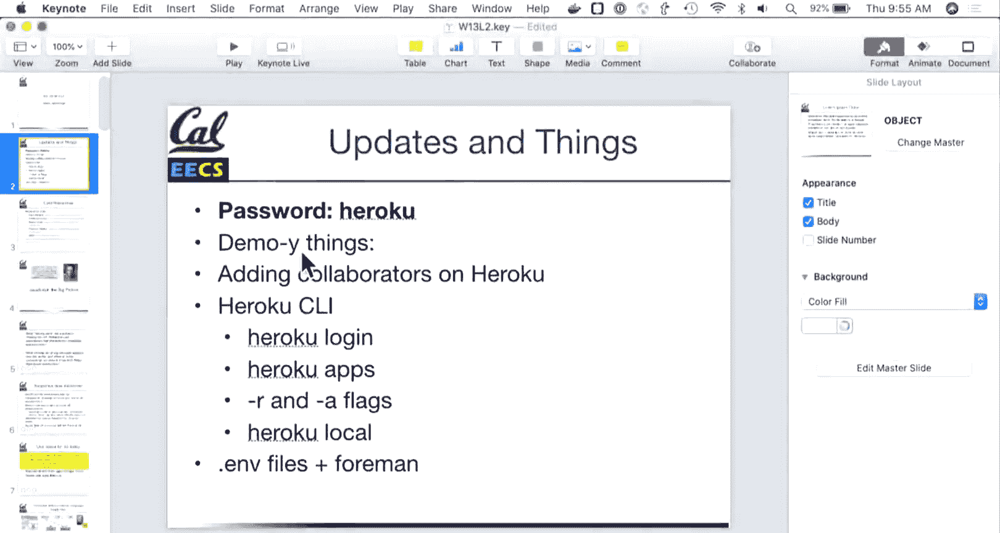


在本节课中，我们将要学习 JavaScript 的基础知识，包括其语言特性、如何与 DOM 交互，以及如何在 Rails 应用中有效地使用它来增强用户体验。我们还将介绍一些实用的 Heroku 团队协作工具。

---

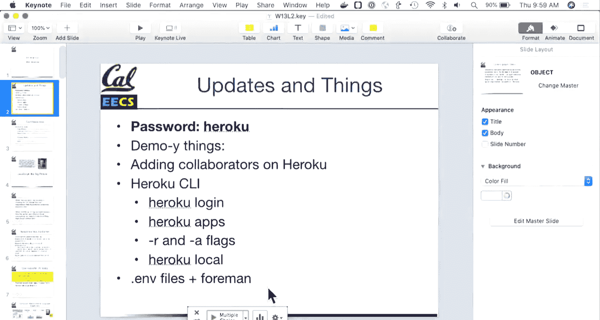

## 概述

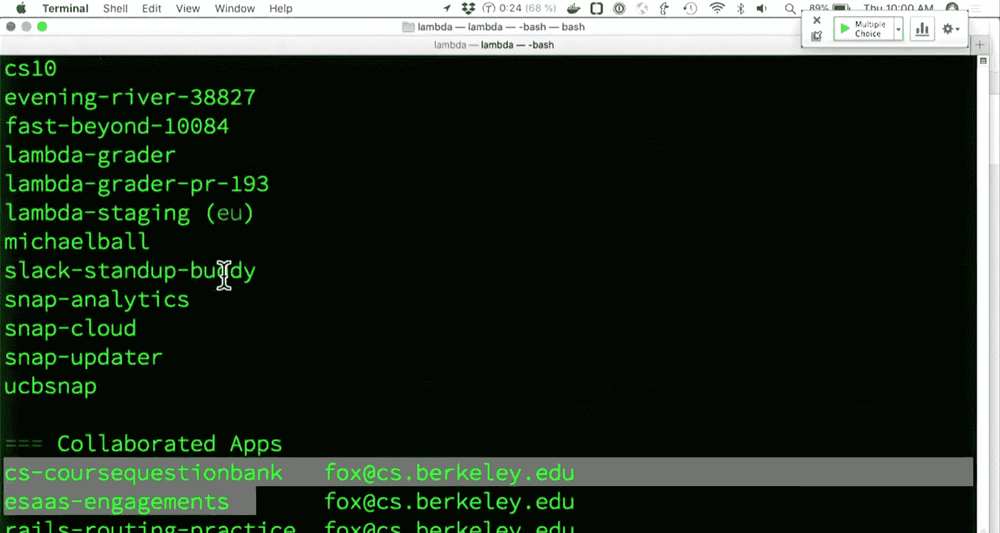

JavaScript 是唯一能在所有现代浏览器中运行的语言，它使我们能够创建动态和交互式的网页。本节课将介绍 JavaScript 的核心概念、语法，以及如何将其作为现有 Rails 应用的增强工具，而不是完全依赖它来构建应用。

---

## Heroku 团队协作工具

在深入 JavaScript 之前，我们先来看看一些对团队项目协作非常有用的 Heroku 工具。

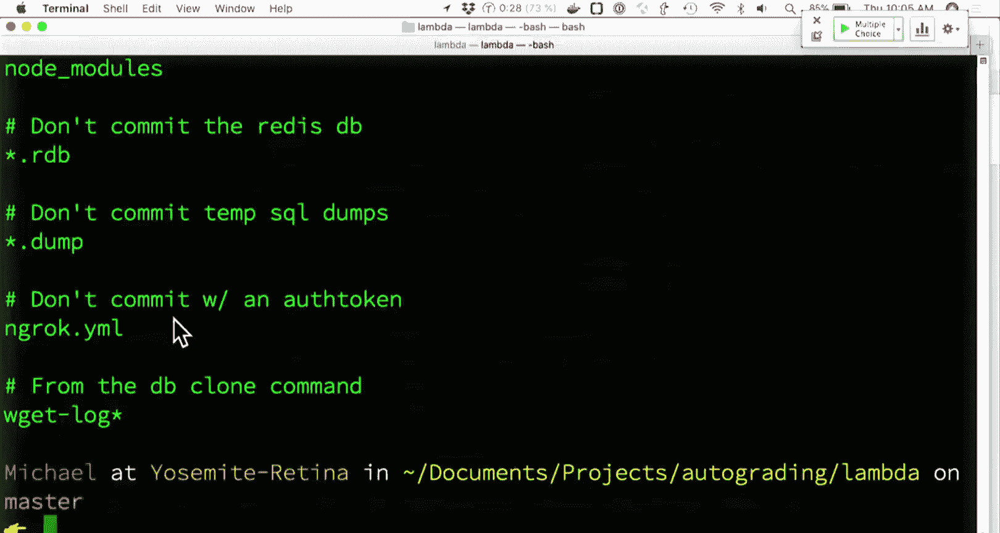

### 共享应用访问权限

所有团队成员应在同一个 GitHub 仓库中协作。然而，Heroku 的访问权限不会自动与 GitHub 同步。你需要在 Heroku 上为应用添加协作者，这样团队成员就都能推送代码、部署和访问该应用。

你可以通过 Heroku 网站或命令行工具来管理应用。命令行工具非常强大，一旦熟悉，使用起来会非常方便。

### 常用 Heroku 命令行指令

以下是几个有用的 Heroku 命令：

*   `heroku apps`：列出你有权访问的所有应用。
*   `heroku logs --tail -a <app_name>`：实时查看指定应用的日志。
*   `heroku run bash`：在 Heroku 服务器上运行一个 bash 控制台，用于调试。
*   `heroku pg:psql`：打开一个 PostgreSQL 控制台，用于直接运行 SQL 查询。
*   `heroku local`：使用 `Procfile` 中的配置在本地运行应用，模拟生产环境。
*   `heroku config`：查看应用的所有环境变量。使用 `-s` 标志可以输出便于加载的格式。

### 环境变量与 `.env` 文件

在开发中，可以使用 `.env` 文件来存储本地环境变量（如 API 密钥）。**务必确保将 `.env` 添加到 `.gitignore` 文件中**，以防止敏感信息被提交到代码仓库。Heroku Local 和 Foreman 这类工具会自动加载 `.env` 文件中的变量。

---

## 引入 JavaScript

上一节我们介绍了团队协作工具，本节中我们来看看今天课程的核心：JavaScript。

### JavaScript 的角色与定位

JavaScript 诞生于 20 世纪 90 年代，最初名为 LiveScript，后来为了蹭 Java 的热度而改名。它是一种在浏览器端运行的解释型、动态语言。

在 Rails 应用中，应尽可能将 JavaScript 用作**功能增强**，而非必需品。这意味着，即使浏览器禁用了 JavaScript，应用的核心功能（如提交表单）也应能正常工作。对于高度交互的复杂界面（如单页应用），可以考虑使用 React 这类框架，但对于简单的交互，使用原生 JavaScript 或 jQuery 就足够了。

### 客户端 JavaScript 的能力与限制

JavaScript 可以访问和操作当前页面的所有内容（DOM），例如读取输入框的值、阻止表单提交、动态更新页面内容等。

然而，有一个重要的安全原则需要牢记：**永远不要完全信任客户端验证**。因为用户完全可以修改或绕过运行在其浏览器中的 JavaScript。所有关键的业务逻辑和数据验证都必须在服务器端重复进行。

---

## JavaScript 语言基础

了解了 JavaScript 的定位后，我们来深入看看这门语言本身的一些核心特性。

### 基本语法与特性

与 Ruby 类似，JavaScript 中（几乎）一切都是对象。对象类似于 Ruby 的哈希，是键值对的集合。

```javascript
var movie = {
  title: "The Patriot",
  year: 2000,
  director: "Roland Emmerich"
};
```

JavaScript 是单线程的。在浏览器中，每个标签页或窗口都运行着独立的 JavaScript 解释器，这主要是出于安全隔离的考虑。

### 函数、`this` 与原型继承

函数是 JavaScript 中的一等公民，可以像变量一样被传递和赋值。

`this` 关键字类似于 Ruby 中的 `self`，但其指向更具动态性，取决于函数被调用的方式。在全局作用域中，`this` 指向浏览器环境下的 `window` 对象。

JavaScript 使用**原型继承**而非经典的类继承。每个对象都有一个内部链接指向它的原型对象，当访问一个属性时，如果对象自身没有，JavaScript 会沿着原型链向上查找。

在 ES6（ES2015）之前，我们使用构造函数和 `new` 关键字来模拟类：

```javascript
function Movie(title, year) {
  this.title = title;
  this.year = year;
}
Movie.prototype.logInfo = function() {
  console.log(this.title + ' (' + this.year + ')');
};
var myMovie = new Movie("Inception", 2010);
myMovie.logInfo(); // 输出: Inception (2010)
```

**注意**：如果调用构造函数时忘记了 `new` 关键字，`this` 将不会指向新创建的对象，而是指向全局对象（如 `window`），这会导致错误且难以调试。

ES6 引入了更直观的 `class` 语法，但其底层仍然是原型继承。

### 变量声明：`var`, `let`, `const`

*   `var`：传统声明方式，作用域为函数作用域。
*   `let`（ES6+）：块级作用域变量，可以被重新赋值。
*   `const`（ES6+）：块级作用域常量，声明后不能重新赋值（但对象或数组的内容可以修改）。

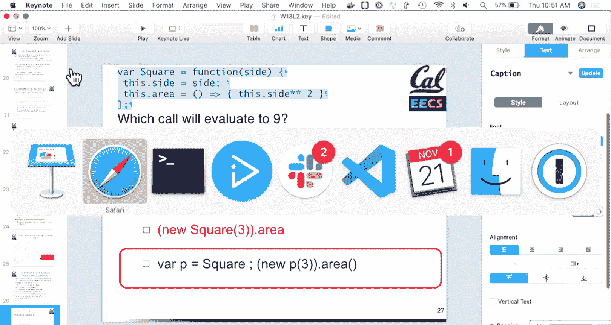

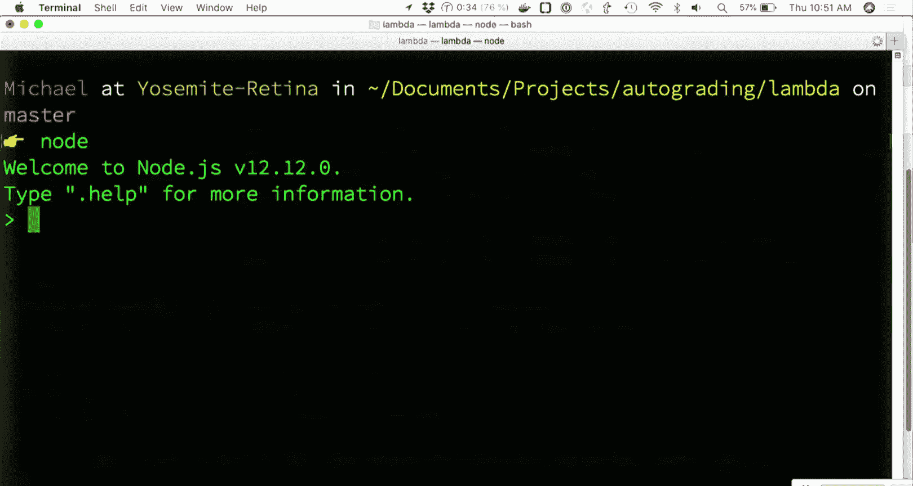

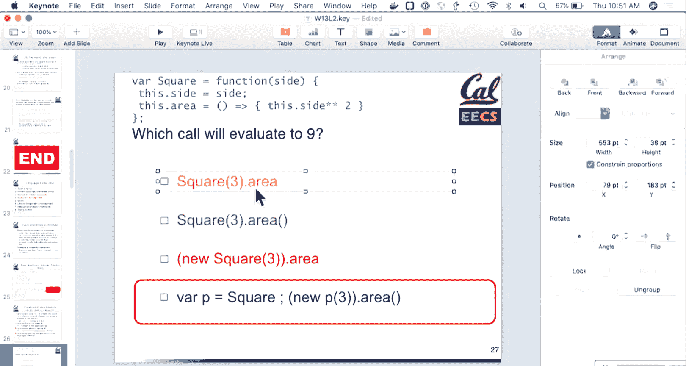

现代 JavaScript 开发中，推荐使用 `let` 和 `const` 来替代 `var`，因为它们能提供更精确的变量作用域控制，减少错误。

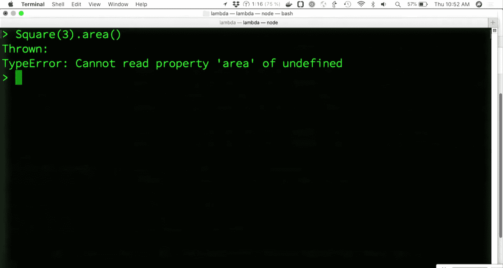

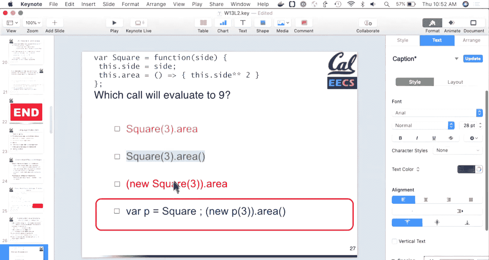

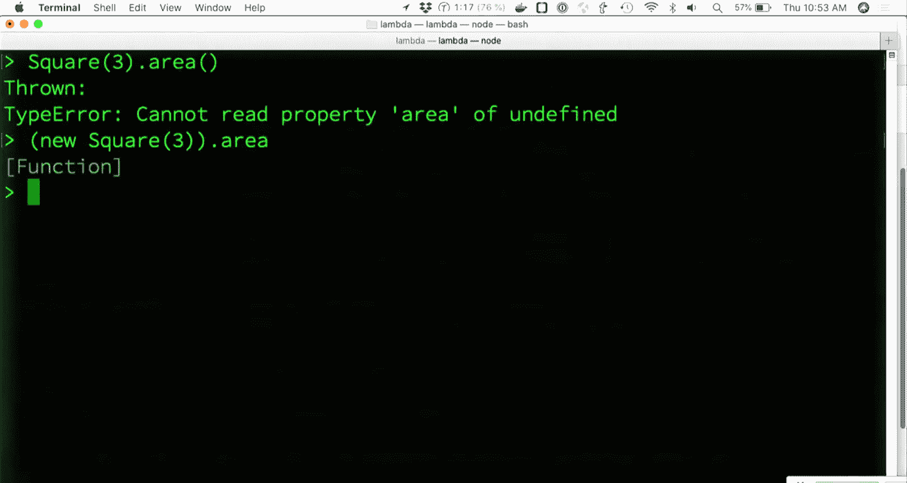

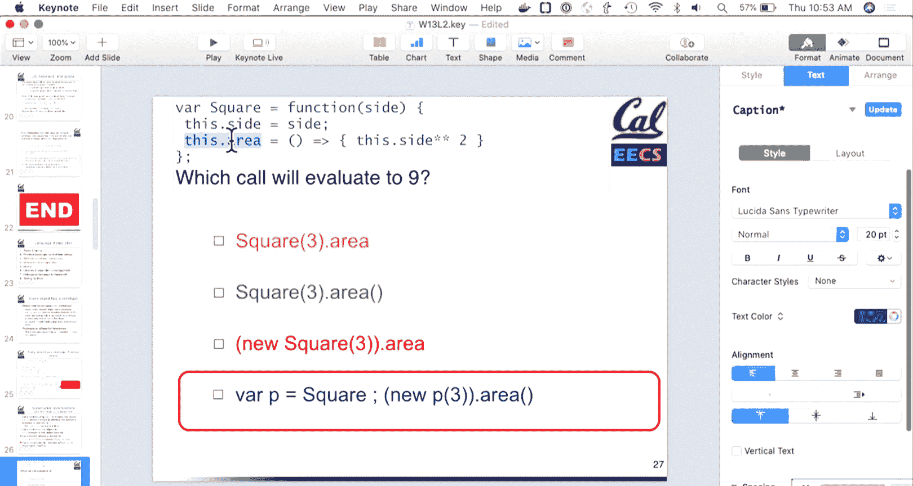

### 代码组织与模块化

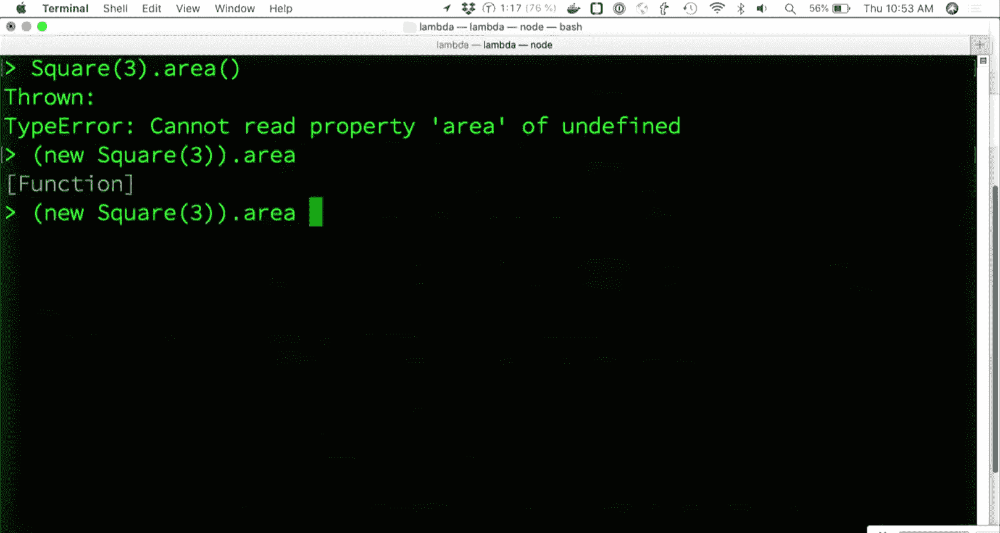

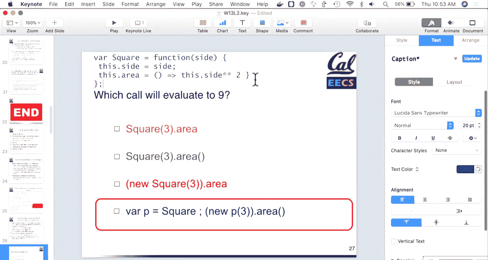

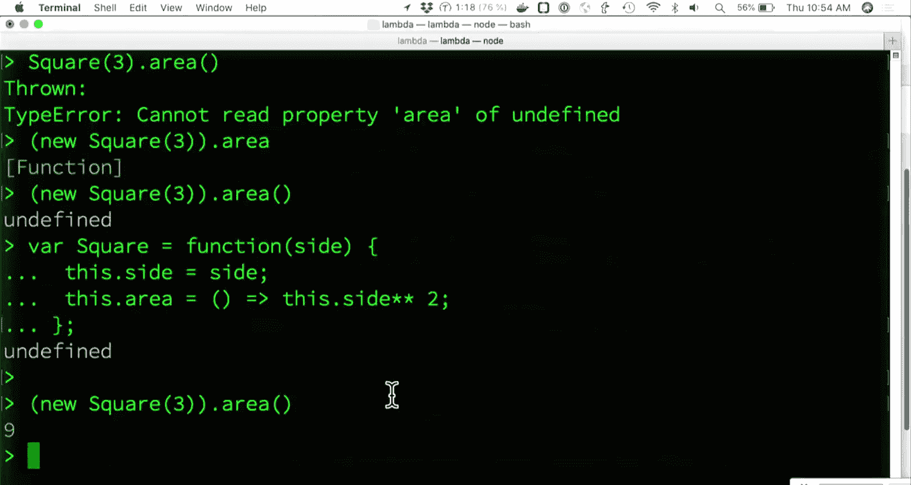

为了避免污染全局命名空间，应将代码封装在模块或函数作用域内。一种常见的模式是“立即调用函数表达式”（IIFE）：

```javascript
(function() {
  // 你的代码在这里
  var privateVariable = 'hidden';
  function privateHelper() {
    // ...
  }
  // 暴露给外部的接口
  window.myModule = {
    publicMethod: function() {
      // 可以使用 privateVariable 和 privateHelper
    }
  };
})();
```

在 Rails 中，你可以将 JavaScript 代码放在 `app/assets/javascripts` 目录下，资源管道（Asset Pipeline）会自动将它们合并、压缩并包含在应用中。

---

## 总结

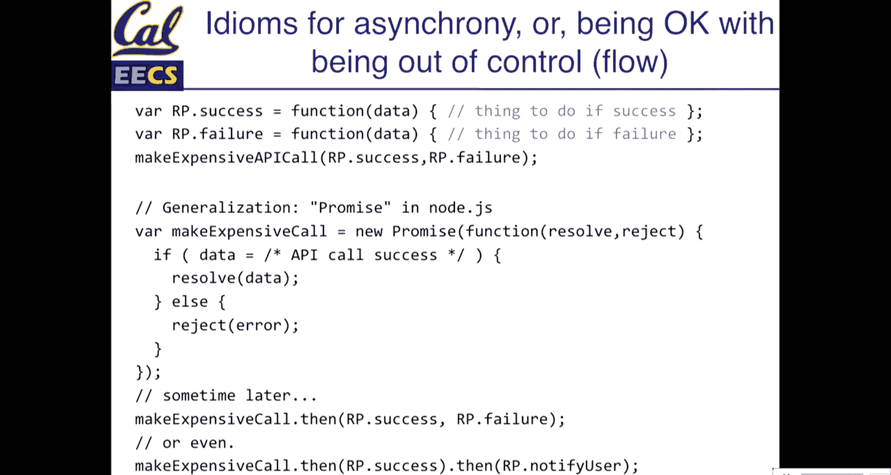


本节课中我们一起学习了 JavaScript 在 Web 开发中的核心作用。我们明确了应将其作为 Rails 应用的增强工具，并理解了客户端验证的局限性。我们探讨了 JavaScript 的基本语法、函数、`this` 关键字的特性，以及原型继承的概念。最后，我们介绍了使用 `let`/`const` 进行变量声明以及通过模块化模式来组织代码的最佳实践。在接下来的课程中，我们将学习如何使用 JavaScript 直接操作 DOM 来创建动态交互。