# 025：UCB《软件工程｜UCB CS169 software engineering 2019》中英字幕deepseek p25 25 CS169 25.zh_en -BV1UsB7YPEMj_p25-

electronic games because they weren't available in your house yet。

 So I'm going to tell you a little bit about one of the home gaming systems that really changed the industry and also show you probably the strangest version of Hello world that you have ever seen。

Before I do that， let me put up a shameless ad。 If you have generally liked 169 and you feel like you're on track to do well in it and you want to get paid to do more things like it。

 we're always looking for future UGss so you could probably just email me because some combination of Michael and me are gonna be sort of responsible for this course going forward。

 also we're evaluating some pieces of technology that might be used in Es courses for things like giving exams and stuff like that。

 And when I say evaluate， this is like we're gonna to hand you a compass and say through that forest lies a city。

 come back with a detailed map。 So if you sort of enjoy going off on your own and doing stuff like that。

 and you want to help us investigate some As and see whether some pieces of software can be like tortured into shape to fit together it'd be pretty fun。

 but it's not really well structured。 but if that sounds like it might be interesting please email me and these are all paid positions obviously and especially for the second one you could probably like start next week if you didn't have to worry about finals。

Okay， so let's go back to 1981。Let me is sound going to work， do we dare？啊。No。Yeah， to。

Let'sF with us， technical， we can do this and the game demo will be much more fun if I can get sound to work。

Let's see help you find something。 my my menu bar is a non standard， but yeah。

 system preferences and check what the sound output said。For this half。Oh， I don't really care。

 I mean， it's important sound。Have water。Where is sound。So， it's。There。Yeah， headphones。嗯。几婚。

Is there a。Okay， well， worst case I can do the hack that I did before and。

Is there like a sound thing over here， laptop volume， it should bed up most of them。mic volume。

Allright， if this didn't do， I'm just gonna hold the microphone next to the。Weird， okay。

 I'll hold the microphone next to the speaker， and that'll be， that'll be our sound。

Only Atari makes the world's most powerful。 you guys can't see it， Can you， sorry about that。ok。不作意。

A makes the world's most popular home video games。🎼The only。Only that man。And the only way you can。

Any of them is on a home video system。So I don't know how much of that you're able to hear。

 but the number of hours I've spent playing Atari at home was incalculable。

 This was really for its time kind of a revolution。 but to understand the revolution。

 we actually have to go back even further in time to 1972。

 this is a synthesized screenshot from the original Atari Pong you probably know this kind of game as something like table tennis This was the original prototype that was put into a bar in Sunny California called And caps。

 and this is like a little animated gift screenshot。

 you can see it's a totally throwing video game the one piece of the experience you're not getting is every time the ball hits and that goes。

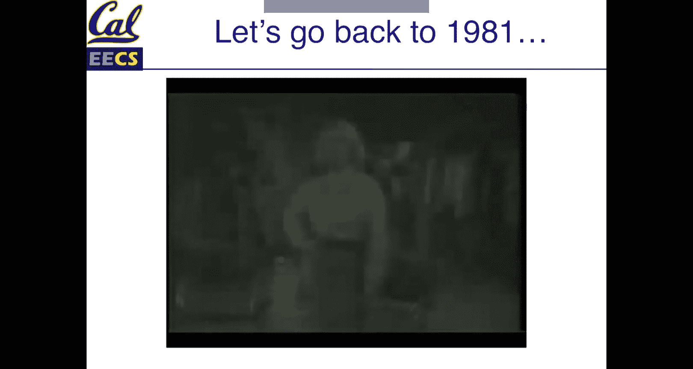

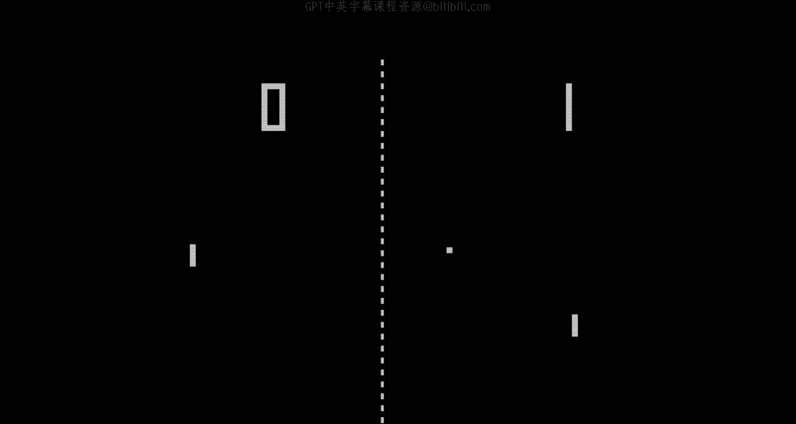

不不不。But that's it。 That's pretty much all it does。 And in 1972， this was astonishing。

 The entire game was built doing discrete TTL transistor transistor logic。 So no microprocessor。

 because in 1972， they hadn't really been invented yet。

 or at least not one that would run a video game So this was a runaway hit in the arcades。 In fact。

 there's a longstanding story that the first machine that got installed within a week。

 they got a service call saying it's broken and people can't play。

 and it's because the box was so full of quarters that there was no way like you couldn't stuff another quarter in the slot。

 So this was phenomenally successful。 And about three years later， it got to where。😊。

Atari thought that the price of electronics of discrete components had come down enough that they could actually do a home version of this by doing an application specificific integrated circuit in Asic。

 so they basically put P on a chip。 unfortunately， the side effect of that is that all their competitors figured well okay we could also put P on a chip。

 and there's a whole patent battle that I'm not going to get into here。

 but the bottom line is it was very slippery to try to defend a patent about just that table tennis game。

 So Atari needed a way to stay in the home market。 that was not something that would be easy for competitors to copy and so they started developing what was going to be the most influential。

 It was not the first home video game that had stick in a cartridge to play a new game。

 but it was by far the first one that was successful。

 So just to sort of put you kind of in the right frame。 here is 1977。 The Concorre was flying。

 the World Trade Center of New York had officially opened for the first time。

 even though the towns were top it off the St shuttle was being tested。

For the first time and people's clothing was as ugly as you have heard and somewhere。

 I think there are pictures of me dress like that。 God forbid。 But what was a technology landscape。

 Atari was targeting a retail price for this home unit of about $200。 today that'd be 700 bucks。

 So think about if you were buying a game console for about 6700 that price point has remained relatively constant。

 However， at the time， Ram cost $8 per kte。 People know what ks are。

 there' a thing that comes before mega and like ks are is nothing So if you're gonna to do the math。

 even at a really lowre consumer TV， which is basically how this game would have to be played。

 if you use some simple math and you say， well， how much memory would you need to do a memory map display that's $200 pixels by 160 pixels。

 So less than the original iPhone and let's say 8 bits per pixel。 So 2006 pretty modest。

 that's 128 just in memory cost So if you want to sell the thing。

sell for 200 you have to be able to manufacture for like 100 and we've already broken that budget just in memory。

 So we can't afford a frame buffer。 However， this thing displays graphics is not going to be able to do it by just having a memory map where each bit of memory corresponds to a pixel。

 That is too expensive。 And what's really interesting is how they solve that。

 The design is part of the Atari， something called the television interface adapter was code named Stella that was the internal name of the project。

 and basically its job was to provide a poor person's frame buffer in an environment where Ram was too expensive。

 And this is the reason that hello world is a bear to write。

For this they decided to actually use a microprocessor。

 so basically today when we think of know what's a computer game。

 it's a microprocessor and a general purpose PC and the software running line is what the game is。

 but in 1977， that was pretty novel， this was really the first home console that instantiated that concept and to power used the 6502 microprocessor which had been released just a couple of years before。

 a very young geek named Steve Wozniak had also discovered that you could buy one of those for $20 and he's like。

 oh， I could make a computer I can afford $20 and that's where Apple came from。

 the first computer that was sold like as a premade product for the public。

 the Commodore pet all following on Commodore the 64。

 the VIic20 those were all based on the 6502 it was designed to be cheap and they used a particularly cheap version of it that even though now if you've taken 61 C this is gonna to be a little more clear the 6502 can theoretically address dress up to 64K of RA。

16 address bus。 but the cheap version they used came in a plastic package that may only expose 13 of those address lines。

 so you can basically only address 8k total of memory Ram and rom combined So for 200 this they had casings。

 joysticks of power supply， some other stuff。 Here's what the memory map looks like。

 there's a few registers which I'll talk about separately there's a total of 128 by of Ram So how much Ram did the first successful home video game console come with 128 by less than a tweet of Ram So unused space more registers and then this last space up here。

 basically or 4 of address space that's the cartridge that you would plug in So I should have brought a cartridge for show until I have one in my office。

 But if you break open an at cartridge what's inside is like a little with a single rom chip on it。

 and that ro chip has four up to 4 k worth code that occupies that part of the memory map。

 So literally when you plug it in， it's like plugging a chip onto a socket。 Very primitive。

No operating system， no disk， nothing like that。So here's what it looked like internally the cartridge basically contained the wrongm。

 it got access to the registers， the CPU， the special television interface adapter which's connected to your classic consumer TV with fake wood grain paneling and to understand a little bit about how you program this thing you have to understand a little bit about how consumer TVs worked so this is a dead standard now NSC television and by the way this is a TV frame like one of the first TV programs ever broadcast anywhere in the world So we're talking about 1941。

 So what's going on here， the way that an analog TV works is that there's a beam that's a TV2 and the beam basically sweeps across and it draws one roof of the TV screen at a time。

 varying its intensity as it goes across the screen from left to right we're going to talk about the black and white version because the color version is more complicated to describe but it doesn't add anything to the abstractions we're going to talk about。

At the end of every line， the beam sweeps all the way back to the beginning so that it can do the next line and when it gets to the lower right corner。

 the beam has to sweep all the way back up to the upper left corner so that it can draw the next frame。

 so it's basically doing the 60 times a second Y60 because that's the AC line voltage carrier so you can easily synchronize your TV oscillator to that and it's actually doing two frames of 30 frames per second interlace but that's not that important。

If you do some math， the original TV standard says every TV channel has its own like dedicated part of the spectrum and that part of the spectrum is just four and a5 megaherz wide。

 So if you do some signal processing math， that means that the most pixels you can get across which is really like you within a 4。

5 meHtz bandwidth， how many times can you wiggle the signal to make it brighter or darker Like what's the effective horizontal resolution。

 it's on the order of at most 480 pixels， which is by the way。

 why 720p is 720 by 480 that's where the 480 and 720p resolution comes from we'll see that the entire actually use only 160 horizontal color pixels because of the speed that they ran their internal clock but how do you write code for this thing well。

Here's what the analog signal looks like that's going into the TV basically these squiggly parts。

 each squiggly part is a row， so the higher the voltage in the squiggly part。

 the more bright that dot would appear on that row and these sort of square shaped pulses in betweens are called horizontal blanking。

 what's happening there is that when the scan gun gets to the end of a row。

 one of these pulses triggers a circuit that makes the gun sweep rapidly back to the left。

So at the end of every row， you're going to have another one of these pulses that triggers the TV server to say。

 okay， we've reached the end of a row， reversed the direction of the scan gun。

 go back to the beginning so you can start the next row。

 So this is all this is like 100% analog electronics。 It's very st to have done this， in my opinion。

 in addition to that。When you get to the bottom of the screen and you have to get the scan and to go all the way back to the top left corner。

 and by the way， if you wonder why does the TV screen look like， why isn't the lines being drawn。

 Why aren't the lines perfectly horizontal， It was actually mounted at an angle in the TV so that the lines would be horizontal。

嗯。😊，So in addition， when you get to the bottom of the screen， these are like the vertical blanks。

 this is what you saw before。 the horizontal blanking intervals。

 Here is the little part of the signal that shows each row。 When you get to the end of the screen。

 there's a much longer pulse that triggers the mechanism that drags the scan gun way back up to the top left corner。

 So there's some empty sort of unused space here that's not part of the signal。

 And that's what we'll come back to it because now we can understand how hello world works and how this thing was able to display stuff on the screen without having a memory buffer。

What it actually had was registers that held various things。So in a typical game。

 you might have like think of the table tennis game。

 There's the two paddles representing the players。 There's like the ball that's going back and forth。

 There are some elements like the lines on the play field that are just sort of there for the background but they're static。

 So basically there's registers that let you store those different things。

 And for each scan line the registers get set up So like what's the correct background color for this line is the players part of the player's paddle or representation of their character supposed to be on this line or not is the missile or the ball or whatever moves in the game is that supposed to be on this line or not。

 So you have to load you of the programmer have to load all the registers for each row so that by the time that row starts being drawn。

 all that information is preloaded and what the custom chip does is it basically draws an entire row taking account of where all those things are。

 So for example。RightIf we are drawing。This picture。

 which is a screenshot from one of the early games。 All of this static stuff is background。

 So basically depending on which row I'm about to draw I， the programmer have to make sure。

 for example， on this row， that the background registers are loaded with background color equals gray。

 the play field color equals yellow， if I'm doing like these rows right here。

 I also have a couple of other sprites that I'm saying you know when I get to this position。

 the sprites are gonna to be like this far horizontal and you should draw them in black。

 but that's basically the level of information you have on any given line。

 you can draw the background， you can draw some part of the play field。

 you can draw one or two player sprites and you can draw like a ball or a missile or whatever the thing is that moves in the game。

 So it's pretty primitive。 It was kind of designed for playing paw。 Yeah。

 what was the logic of the collision So the collision logic is basically I have a slide which anticipates your question。

No， no， it's cool。 It's cool。 So by the way， what this means is when during the time that it's trying to draw each line。

 your game code can still be running， but you can't touch the registers Once you've loaded the registers for one of these lines。

 you got to make sure that two things are the case。 First of all。

 you don't modify the registers at the wrong time because then you'll get flicker because you're trying to modify the game field as it's being drawn。

 the second thing is remember that when the beam gets over here。

 there's gonna to be like that pulse that square thing that's going to send the beam back to draw the next line By the time that event happens。

 you have to be ready to reload the registers to draw whatever the next line is。

 So you're tracking exactly what goes on every line。 And if you miss that window。

 the lines won't get drawn correctly。 So a common technique， the way that the device was designed。

 And by the way， you have to program in an assembly language don't have other language here in assembly language。

 there was a special memory location that you could write to that would halt your program。

JustStop it in its tracks， but you would get woken up again the next time that that squaretth signal came along saying we're about to get ready to draw the next line When that signal comes and your broken gets woken up。

 what you have is the amount of time it takes for the beam to go from here。

Back to the beginning of the next line， in that time interval。

 you have to reload all the registers to get ready to draw that next line。

 So some people call this racing the beam because if you get the timing wrong。

 your game doesn't work。嗯。😊，You also if you remember when I said you get down to the bottom right corner of the screen。

 it's actually got the time that it takes to sweep all the way back up across。

 It turns out that if you do the math， that's like the equivalent of the same time it would take to draw 30 horizontal rows and because nothing is being displayed during that sweep。

 that's like free time for you to do computation。 So that's where your main game logic is going run And again。

 if you do the math at how fast the clock goes， that's like 4000 assembly instructions。

 So that's your total game logic and in terms of collisions what's going on there。holdold on。

 let me find the whoops。Collion detection。 So remember that there's the single chip that is looking at the registers for background color。

 play field color， honor of players， eta， et cetera。 And based on those。

 it's essentially generating one row of TV signal on the fly。 as it's generating the row。

 it's actually able to track whether there is more than one thing。

 basically there's two register that end up having the same value。

 So the nice thing is if you do the math。 there's the play field， there's the ball。

 there's the two player sprites and each player can also have like a missile associated with them。

 So it's basically six total things that you have to check for collisions between。

 Any two things causing a collision that's six choose two。 So there's 15 ways that you can do that。

 and that fits in two bys。 So there's actually a two byte collision register and at the end of every row or at the end of every frame if you wanted。

 you could inspect the collision register and see which bits were set。

 So like if player one and player2 collide， maybe that doesn't matter。

 But like if a player know collides with a missile than that means you die。

 That's the kind of thing that。😊，这么 football包。So the way the momentum of the ball worked is once you set up the ball。

The balls were called sprites， although they wouldn't be recognizable as sprites in today's programming world。

 But basically once you put the ball somewhere， there was a register that you could set to a few different values like if it's set to a particular value。

 then after every line is drawn， it will automatically move it。

 one to the right or two to the right or four to the right。

 Or you could set another one that would change the color of it on every line。

 But it was extremely primitive。 I mean， you're still doing everything in line at a time。

 If you wanted to do like ball physics where the balls velocity changes over time。

 you're basically doing all that by hand。 and you're calculating the position by hand and you're doing and by the way。

 the 65 by2 has no floating point math， no integer multiply， no integer divide。

 it basically has added subtract and bitwise operators。

 So everything else had to be built out of those things。

 I'll actually show you kind of a cool example of how you get around that stuff。

 The sound generators were not that exciting。 But you know， when this was released。

 it quickly became one of the hottest Christmas gifts， especially when in 1980。

 Atari got the exclusive license to face invaders。😊，It's hard to sort of， you know。

 you squt back in time when space invaders hit the arcades。 It was like a sensation。

 It was like a packman would be a few years later。 People were were putting billions of quarters into it。

 It was actually the first popular acaian that was based on a microprocessor。

 It was based on the Intel 880。 It was the first one to keep track of a high score。

 So it was like a huge phenomenon on the arcades。 And Atari had a good sense to become the temporarily exclusive home licensee。

 And we can see a comparison。 Here's the arcade version of space invaders。

 which I'm hoping if I'm just going to set this to mirror because it will be easier to see。

And， of course。I don't know if there's any sound on this， but。Yeah。

So this is the arcade version of space invaders。 I know it looks super thrilling。 but again。

 you know， in 1981， this was the hot ship。 And by the way， if anybody replace space invaders。

 as the number of invaders goes down， they start moving faster and faster。

 that actually is because on the original version， the microprocessor couldn't draw them fast enough to always make them be fast。

😊，So it was actually a bug that got turned into a feature。 And the feature is， oh。

 like as you kill more invaders， they start moving faster。 So it gets more difficult。

 But that was actually not the way the game was designed。

 The guy who designed it wanted it to just have a static speed for every wave。

 And the microprocessor wasn't fast enough to do that。 So that's the arcade version。

 This is the version that Atari did for comparison。

 And I'm gonna run this using an open source emulator called Stella， which， as you may recall。

 is the。

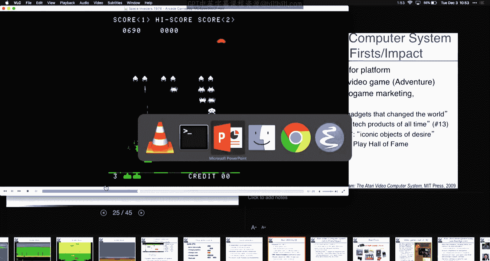

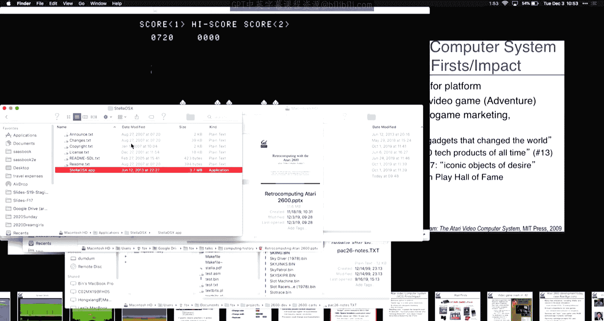

The code name internally of， and I， I really wish we had sound， but I'm going to try to get the。

Where is。Sorry， it's not the most sophisticated UI because it's actually emulating an Atari game right now。

B。Spick and v， that looks right。

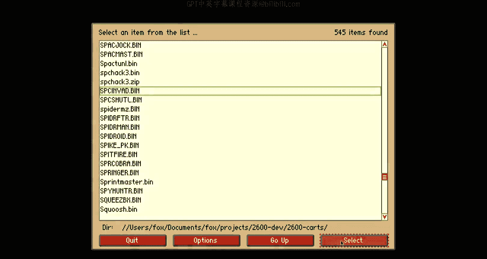

So let's， is there sound。Okay， I don't know why there isn't sound。 there certainly ought to be。

 but this isn't bad for， you know， this is the home version that came out like like a year or two after the arcade version came out。

 anybody want to guess how much code is involved in this like right now。

 how much code is running total size of the game？And there's sound too， although you can't hear it。

 I don't know why。嗯。

Anybody， your code amount。

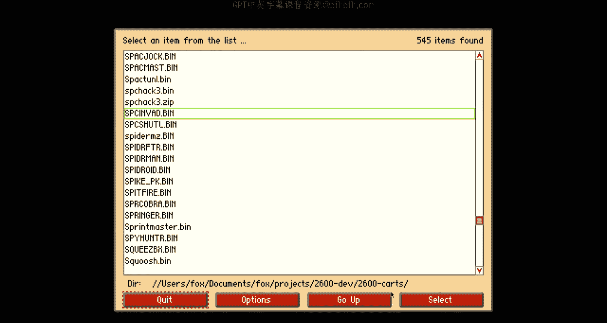

Take a guess， two kilobytes， but you're close。So that's 2 k B doing everything， right。

 Dr the invaders， drawing the tank， checking collisions， keeping the score。

 And there's also like a zillion little variations。

 like there's a variation where the missiles don't fall straight。

 There's a variation where the bunkers move around。 So it's actually a pretty impressive port。😊。

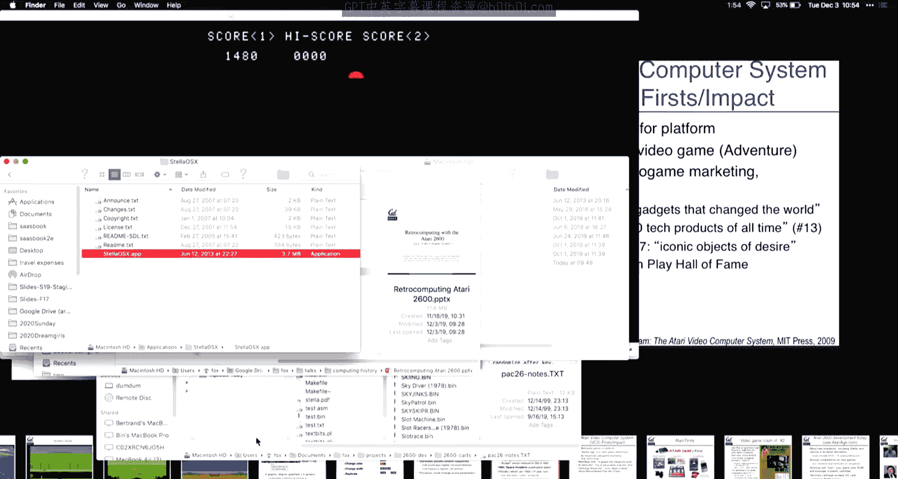

And once people realized that， you know， even though this hardware was super simple and it was a bear to program。

That's weird， now they sound。By the time this thing had been retired。 You know。

 it had a really long 14 year run。 thousandshouands of cartridge had been produced。

 nearlyar 1000 commercially， but there were also like hobbyists were starting to do them。

 There are actually still services today that you can develop for this thing。 And if you want。

 they will actually burn it onto a real legit cartridge for you。

 So I'll show you my version of hello world to give you a sense of how hairy this is。

 But the kinds of games people came up with。 I mean。

 some of these screenshots for 1981 for a 200 device I think are extremely impressive。

 And the gameplay for some of them was really， really good。

 here's like the farthest I ever got in doing you know， a 2600 game of some kind。😊。

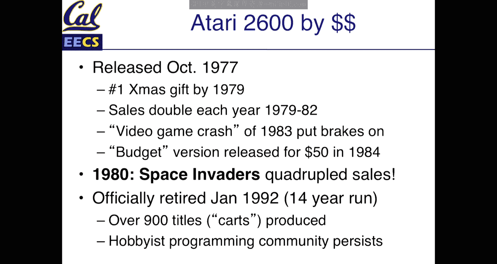

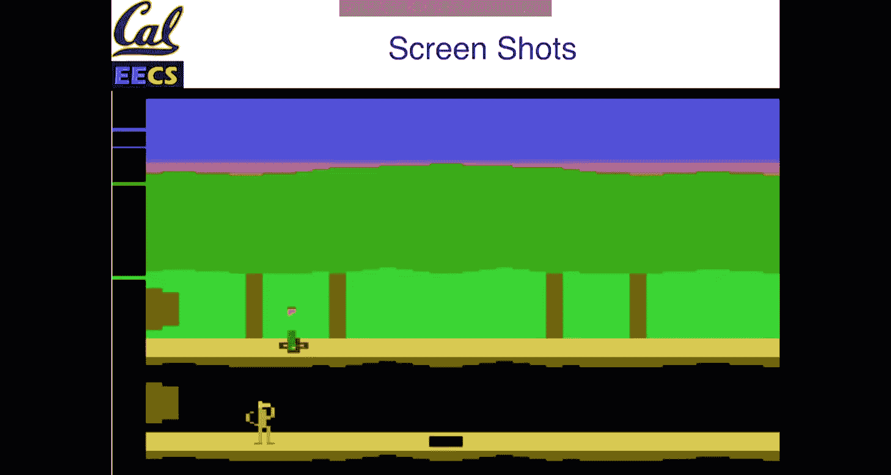

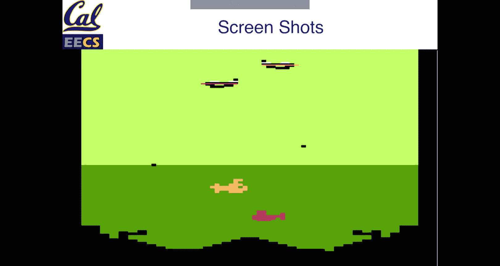

And then I'll show you kind of how the code works， and then I'll let you out of here。Where is。

Where did style go。

嗯。Oh， that's weird。Today。Sorry， that's a little ominous it just like reboot randomly。Come on。Sorry。

 this was working on Bart。I don't know why it rebooted on me， but we， we can do this。

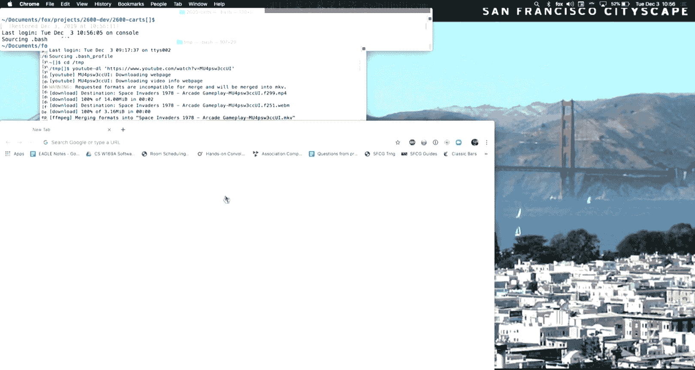

Come on。

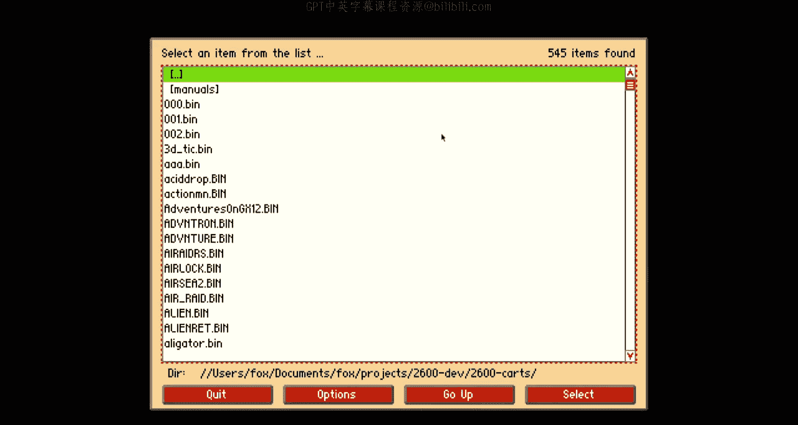

Yeahay， all right。Okay so this is my strangest hello world ever。

 you can barely read that it actually says hellello world。

 but in terms of interpret like what is this actually doing the words hellello world are part of the play field。

 the background stuff that doesn't change like the lines in the tennis game or you know the bricks in a tank battle or something like that and there's a bit of controls when you draw the play field。

 you're stor the play field in a total of 20 bytes So if you actually count from this left edge of the screen to the midway point of the screen the resolution that you're allowed to define for the play field within that is only 40 bytes or is it's 20 bytes or 20 bits from here to here And you can define whether each bit of play field is like single wide or double wide And then there's a bit that says does the play field get repeated on the other half or does it get mirror imaged on the other half。

 That's all you can do with a play field which makes it really interesting to say how do you do a game where the play field is neither symmetrical nor mirrored And the answer is you count the number of clock cycle。

From the moment the line begins to be drawn you wait until like this first you know eight bits of playfield has been drawn and you know how long that takes because you're doing the math to say how long is it taking the electron beam on the TV to move from there to there after it's there it is now safe to overwrite the play field register so that by the time it gets to the second half of the screen you can draw something different so you are literally counted clock cycle and filling an instructions and noFs to make the exact cycle count come out so that right after part of the play field is drawn you're essentially reusing it。

The nice different colors on the background， all I'm doing is increment in the background color register once per line。

 so it's totally brainless， this version doesn't have anything that moves。

 but here's the version that has something that moves and then we'll walk through the code。

Please don't reboot on me。Damn， all right。呃。Stella is maybe not super friendly with this latest version of Mac O S。

 but that that's okay。 Let me just kind of show you what the code looks like。 and then we'll be done。

 but。

Is that yeah， This is the more complicated version。 So this is the same program。

 but it's actually sweeping a ball from right to left and not moving the ball horizontally on any one of the lines。

 I know it's super exciting。 But what， here's what it takes to even do that much。😊。

Here is the actual code that was running there。Make that big enough so you can sort of read it。

 You can sort of read that， right， That's kind of。Yeah， that's unfortunate， I don't really see。呃。呃。

Okay， so that's the assembly hook for what's going on she's like。

 what's this word I don't know why it's so hard to read。

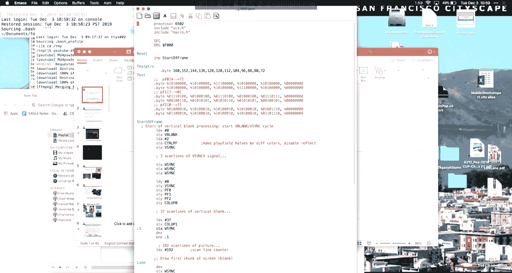

Let me see if I can。Can I make this bigger。

诶。咩啊。湖能。I'll just make the font as large as I can。There， now you can read it right sort of。Okay。

 so what's going on here in my really， really simple program。

 that's the 20 bit definition of the play field。 So it's binary1 bit equals you know the play field has a block in that position or not。

 the play field background color set separately and basically every frame has the same structure。

 Don't worry if you can't read 652 assembly It is a lot like MIPS assembly but basically the key here is that these v syncnc and W syncnc。

 those are magic memory locations that when you store to them。

 when you write to vsnc it means I'm going to sleep now。

 but wake me up when the beam gets to the bottom righthand corner and is about to start the long process of traversing back because that gives you like a couple of thousand instructions of stuff you can do and W syncnc is okay I'm done with this line I'm going go to sleep now wake me up when you get to the end of the line and it begins the process of zooming back to the left to draw the next line because that is at the time that I have to reload all of the registers and make sure everything is in the right place on the next line so basically。

What I'm doing is the top three lines are actually not visible on your TV so I'm just wasting time and in the rest of the code。

 all I'm doing is modifying the magic registers for like the color background and you know what color the play field is going to be and basically now I just start counting down for 192 lines of vertical play field。

 I set up the registers for the line， I make sure that I don't have to change any of the play field registers。

 so you know when I'm drawing hello world， that data at the top。

Each row of this is like one row of the hello world blocks。

 but it's my job to figure out which set of data corresponds to which row I'm on。 So in my case。

 it's really simple because I'm just drawing a single image from top to bottom。 and it never moves。

 But if the play field actually had obstacles that moved around。

 I would actually have to compute on each and every line where those obstacles are supposed to go。

 So basically for each line， I'm doing all the work I have to do for the line。

 I'm loading up the text， making sure that I get the right text data。 And when I'm all done。I wait。

 I go to sleep， and I wait for the beam to return to the top of the screen and I do it again。

 And this took me like two hours to figure out。 and doesn't do anything。

 So if you want to download if Google Stella， it runs on most operating systems。

 and all the roms are free now， because this stuff has been out of print for so long。

 But get an idea of what kind of craftsmanship it would take。 And some of the games are really good。

 Like even today， they hold their playing value really well。 the graphics are primitive。

 but they're super fun。 So if you want to know a challenge like writing hello world for something for me of this takes the cake。

 And I hope that wasn't too boring for the non-61 C people。 But that's like my demo。 So。😊。

Have fun and have like， good luck with projects and finals and stuff， so。😊，Okay。

 and we might need to vacate the room， but I can hang out for a little bit of We will post on Piazza later today or tomorrow with the final demo time。

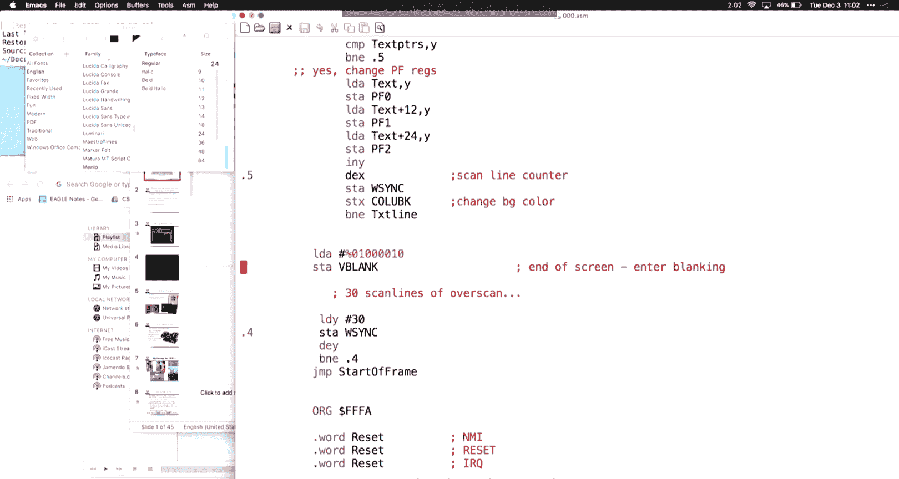

But you spacecing everyone who's still at the form， you should get your preferences for time slots。

咁系。