# 软件工程：UCB CS169 2019：第26讲 - 项目展示总结 🎓

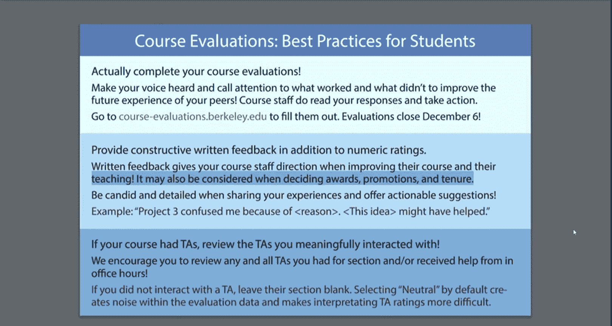

在本节课中，我们将一起回顾UCB CS169 2019课程中多个学生团队的最终项目展示。这些团队在过去一个学期里，与真实的客户合作，运用敏捷开发方法，从零开始或基于遗留代码构建了功能性的Web应用程序。我们将看到他们面临的挑战、学到的经验以及项目的核心功能。

---

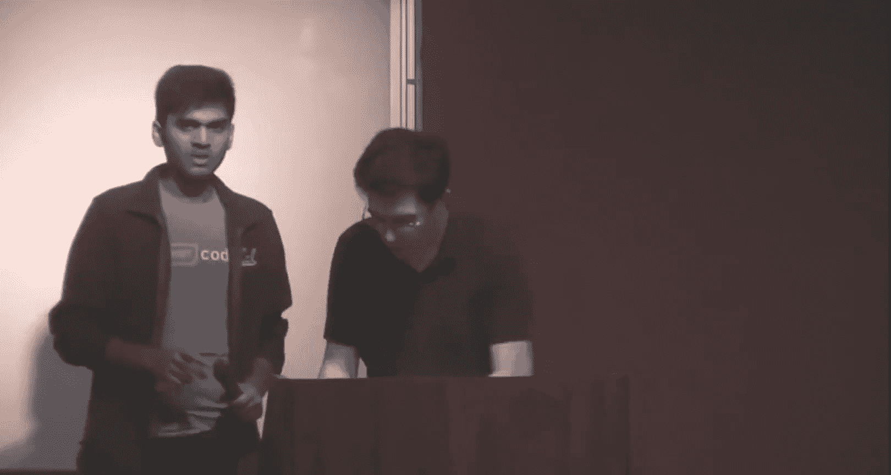

## 项目一：BJC教师追踪器 👨‍🏫

上一节我们介绍了课程背景，本节中我们来看看第一个展示的项目。

**概述**：该项目为“Beauty and Joy of Computing”课程开发了一个教师管理系统。该系统允许高中教师在线申请访问课程材料，管理员可以审批申请并查看相关统计数据。

**核心功能**：
以下是该应用的主要功能点：
1.  **教师申请表**：一个在线表单，用于收集教师及其学校的信息。
2.  **管理员仪表盘**：管理员登录后可以验证教师申请、查看课程与学校统计信息。
3.  **自动邮件通知**：当教师申请被批准后，系统自动发送包含登录凭据的欢迎邮件。
4.  **交互式地图**：在地图上用图钉标记所有参与BJC项目的学校位置。

**技术挑战与设计**：
团队遇到的主要挑战包括集成Google OAuth2和处理不同环境的数据库（开发使用SQLite，生产环境使用PostgreSQL）。他们的设计策略是先实现核心功能，再逐步完善样式和用户体验。

**客户协作与团队实践**：
客户Michael提供了清晰的目标和反馈。团队较好地遵循了敏捷实践，包括定期站会、迭代计划会议和回顾会议。他们使用Pivotal Tracker管理用户故事并尝试结对编程。不足之处是偶尔会过度承诺功能，并且很难找到一个所有成员都有空的时间开会。

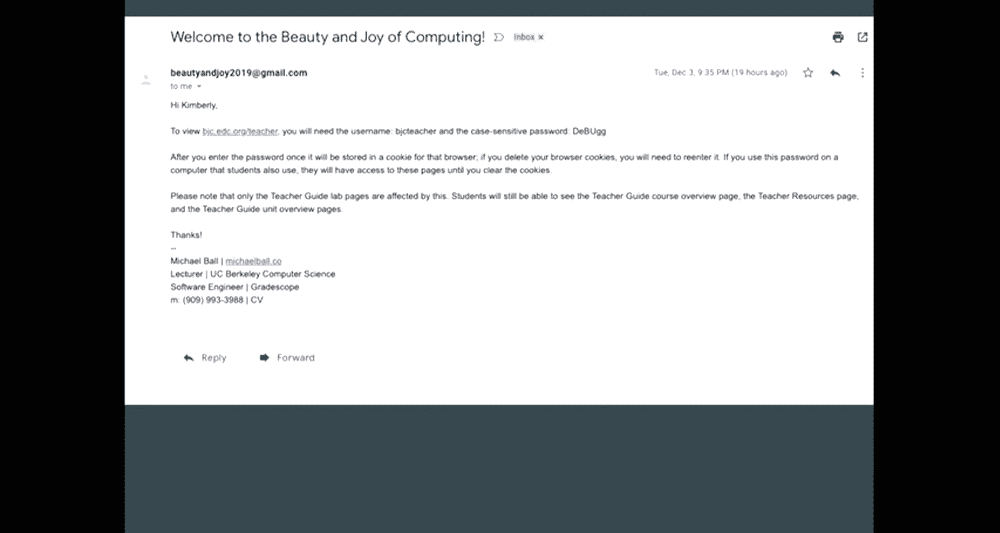

**给未来开发者的建议**：
代码模型关系应保持简单，避免过度设计。在部署到生产环境前，需充分考虑数据库兼容性问题。

---

## 项目二：Stagebridge导师签到系统 📍

在了解了教育领域的应用后，我们转向一个社区服务项目。

**概述**：该项目为Stagebridge导师计划开发了一个基于地理位置验证的Web签到应用，取代了容易出错的纸质签到系统。

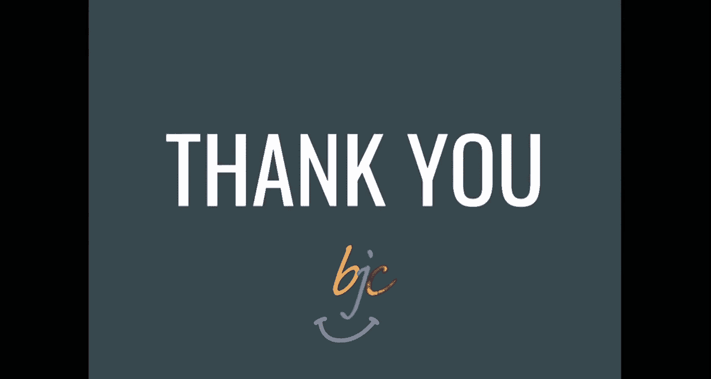

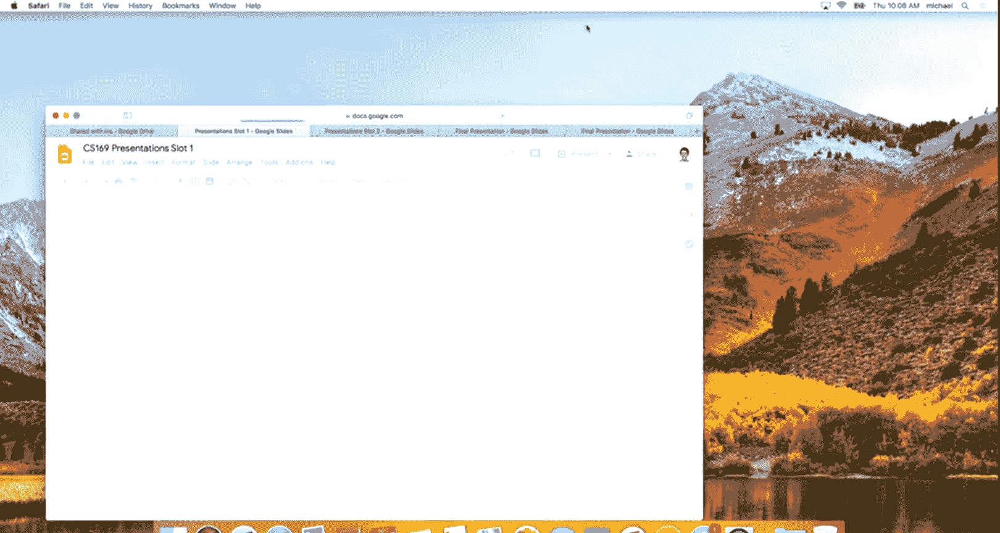

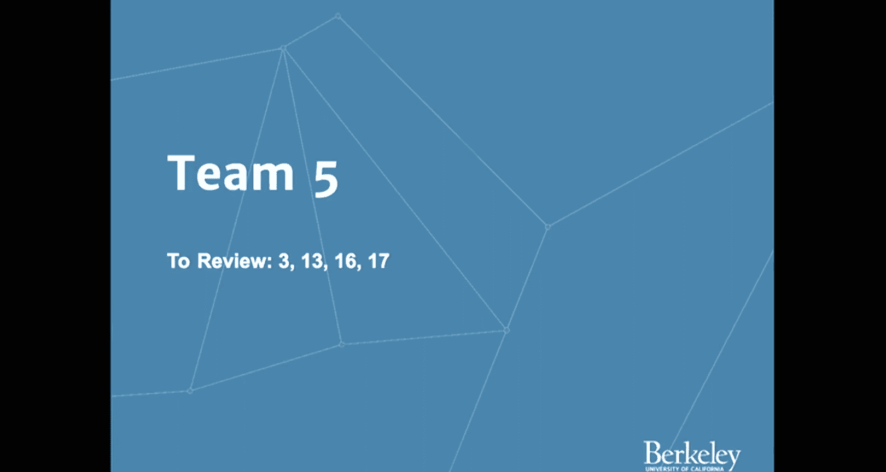

**核心功能**：
以下是该应用解决的核心问题：
1.  **CalNet认证登录**：确保只有合法的UC Berkeley学生可以签到。
2.  **地理位置验证**：通过获取用户设备的GPS位置，确保导师在实际指定的学校地点签到。
3.  **数据导出**：管理员可以将签到数据导出为Excel格式。

**技术挑战**：
最大的挑战是实现可靠且一致的地理位置获取。解决方案是放弃Rails内置服务，转而使用Google Maps API的Javascript接口。

**客户协作与团队实践**：
客户Jasmine（一名数据科学学生）给出了明确的目标和及时反馈。团队沟通良好，但偶尔会高估迭代的工作量，导致某些功能未完成。

**未来迭代计划**：
如果时间允许，团队希望增加数据加密、提升网站无障碍访问性、集成数据可视化工具以及添加未按时签出的通知系统。

---

## 项目三：Cal Nerds学生主管调度工具 🗓️

接下来，我们看一个用于校园组织内部管理的工具。

**概述**：该项目为校园组织Cal Nerds开发了一个移动友好的学生主管调度系统，用于跟踪可变和固定的工作时间，并自动计算工时总额。

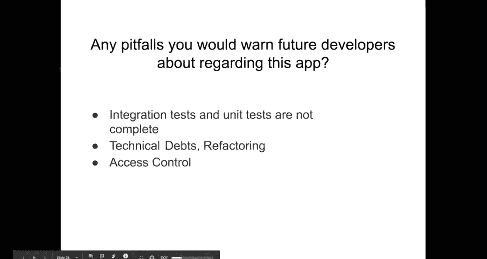

**核心功能**：
该应用的核心改进包括：
1.  **直观的日程提交界面**：模仿When2Meet的交互式表格，方便主管提交时间。
2.  **邮件提醒**：使用Action Mailer和Rufus Scheduler自动发送提交日程的提醒邮件。
3.  **响应式设计**：确保在移动设备上具有良好的使用体验。

**技术挑战**：
挑战包括处理开发与生产环境数据库的差异（SQLite vs. Postgres），以及测试会话哈希。

**敏捷实践反思**：
团队在“可工作的软件”和“响应变化”方面做得很好，但在“客户协作”上可以改进，因为客户在会议间隙较难联系。

**未来方向**：
未来需要使应用动态适应组织成员的变化，并改进UI/UX，例如开发更直观的日历界面和增加更多RSpec测试。

---

## 项目四：Hispanics in Computing交互式地图 🌎

现在，我们来看一个服务于特定社区的网络应用。

**概述**：该项目为Hispanics in Computing组织重新设计了网站，并新增了成员交互式地图功能，以促进社区内的联系。

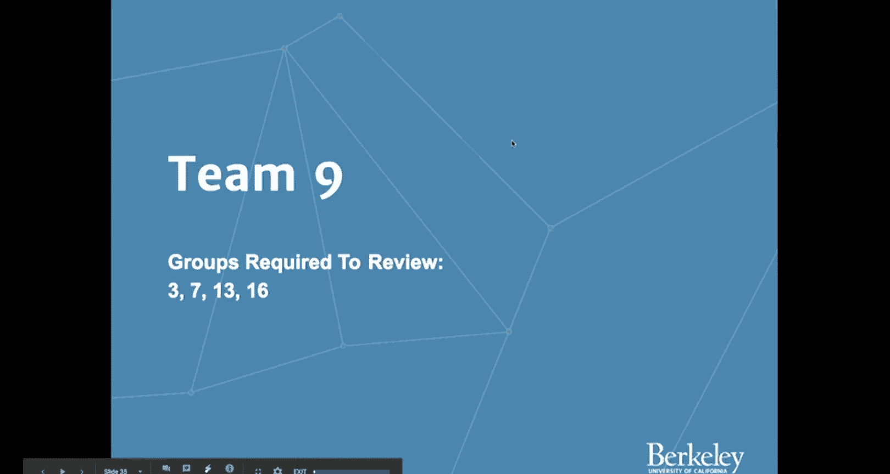

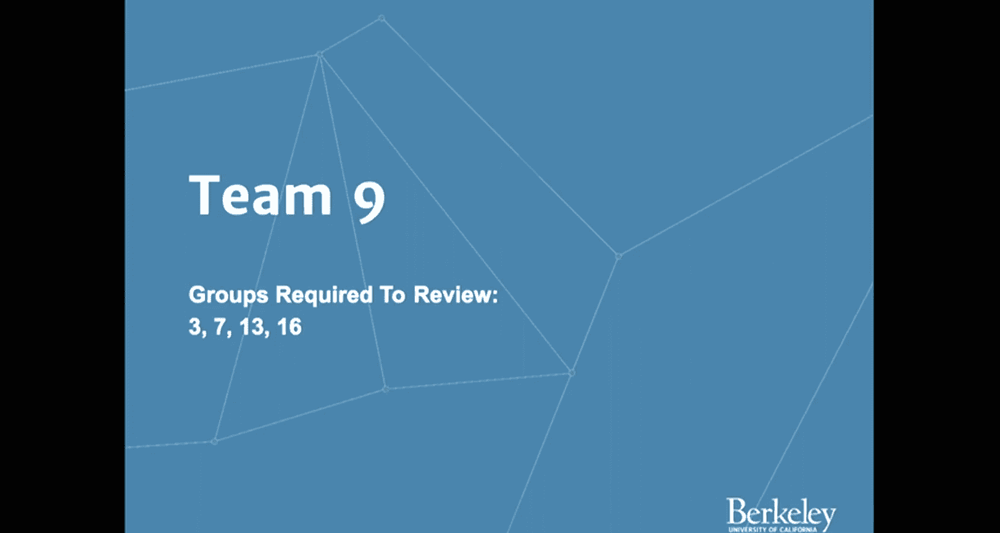

**核心功能**：
以下是实现的主要特性：
1.  **网站重构与重新设计**：改善了旧网站的信息层次和视觉布局。
2.  **成员资料页**：用户可以通过Google登录，编辑个人资料并选择是否在地图上公开显示。
3.  **交互式地图**：使用Leaflet.js库展示同意公开信息的成员位置。
4.  **Slack成员验证**：通过比对Slack工作区成员列表来验证登录用户是否为组织成员。

**技术挑战**：
主要挑战是验证用户身份。在尝试LinkedIn和Google Groups API受限制后，团队最终通过Slack API获取成员邮箱列表来实现验证。

**开发流程**：
团队遵循了标准的敏捷工作流：客户会议 -> 迭代计划会议 -> 开发 -> 回顾会议。随着迭代进行，沟通和测试覆盖度逐步改善。

**未来功能**：
希望未来能增加由管理员发布的博客功能、更多登录选项（如Slack直接登录）、更丰富的地图信息弹出窗口以及筛选过滤功能。

---

## 项目五：CS 370导师匹配平台 👥

许多项目都涉及连接不同的人群，这个项目也不例外。

**概述**：该项目基于遗留代码，为CS 370课程开发了一个连接学生与研究生导师的在线门户。

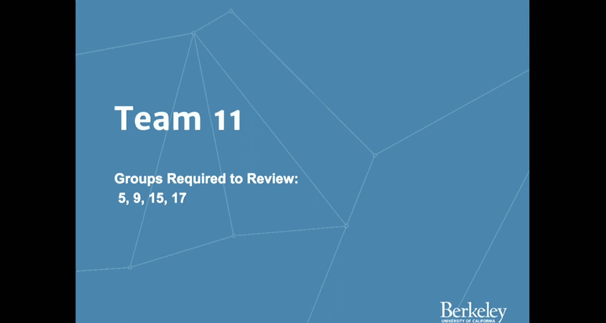

**核心功能**：
平台实现了完整的导师匹配流程：
1.  学生可以为特定课程请求导师。
2.  导师可以接受请求。
3.  双方可以协商并确定会议时间。
4.  会议结束后，学生可以提交评价。

**技术挑战**：
处理遗留代码是最大挑战，包括过时、硬编码的测试，以及中途需要引入新功能（如会议安排）导致的设计变更。团队通过大量自主研究和调试来解决跨浏览器兼容性等问题。

**客户协作**：
客户Christopher（教授）的沟通直接明了，他清晰地区分了本团队与另一平行团队的任务，避免了冲突。定期会议和详细的会议记录保证了项目方向正确。

**团队实践与建议**：
保持持续沟通和相互问责是关键。团队应避免使用多种通信工具导致信息丢失。给未来开发者的建议是：务必在充分理解遗留代码的交互逻辑后再进行修改，并加强集体代码测试。

---

## 项目六：CBVX STEM患者门户 🏥

软件工程在医疗健康领域也有重要应用。

**概述**：该项目为干细胞治疗诊所CBVX STEM开发了一个医患门户，用于管理患者表格、治疗历史和医患沟通。

**核心功能**：
门户的核心是权限管理和资源关联：
1.  **差异化权限**：医生和患者对病历、治疗方案等资源有不同的访问和操作权限。
2.  **资源关联**：将药物、文档和治疗等相互关联但独立的资源通过“用户持有者”接口进行有效组织。

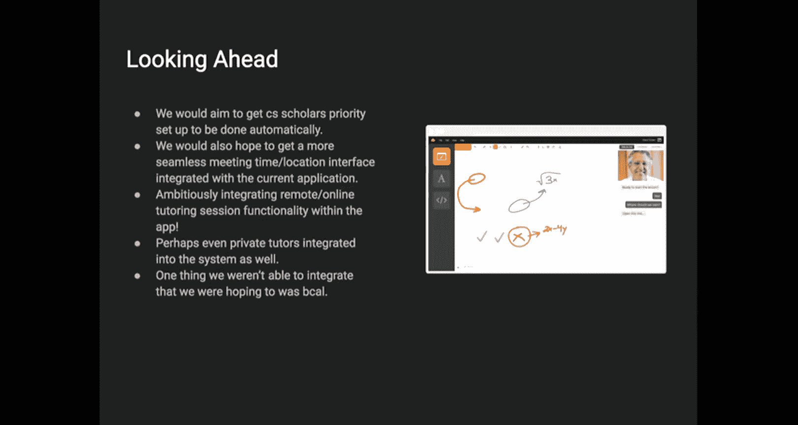

**技术实现**：
团队使用CanCanCan gem来集中管理复杂的权限控制逻辑，这比在控制器中硬编码规则更清晰、更易维护。

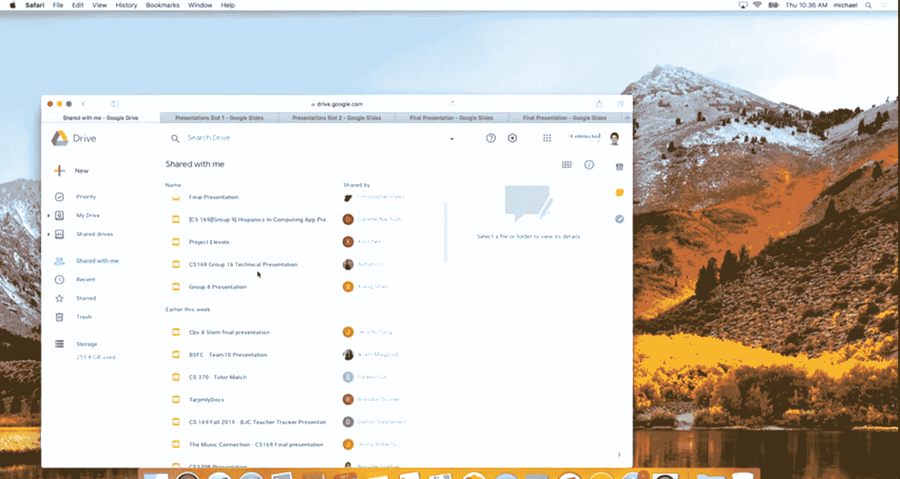

**团队实践**：
团队设定了每人每迭代完成2个故事点的目标，并通过Slack定期站会。Scrum Master在回顾会后为每人撰写评估，使同行评审更客观。不足之处是结对编程因日程冲突而实施较少。

**未来展望**：
希望未来能改进UI设计、实现平台内部的消息系统以替代外部通信。

---

## 项目七：Citris资源中心网站维护 🔧

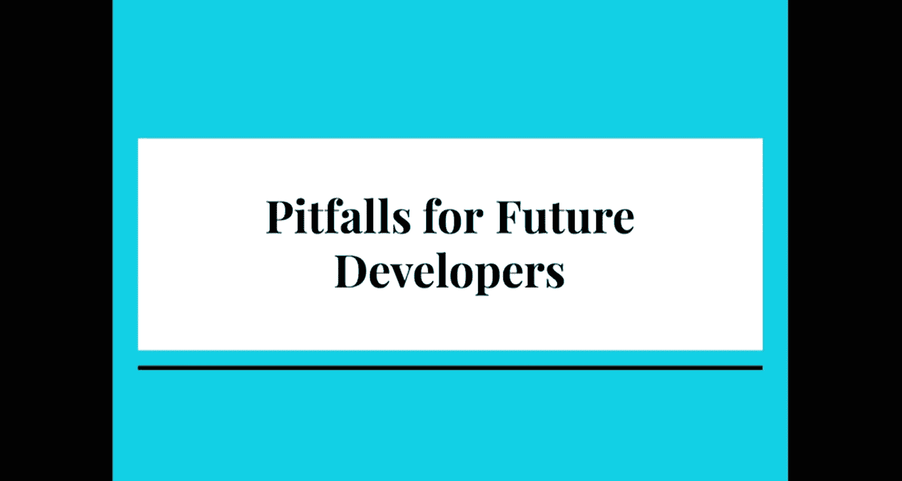

维护和更新现有网站是软件工程的常见任务。

**概述**：该项目基于遗留代码，为Citris资源中心网站添加自动化维护功能，包括资源所有者自助更新和链接健康检查。

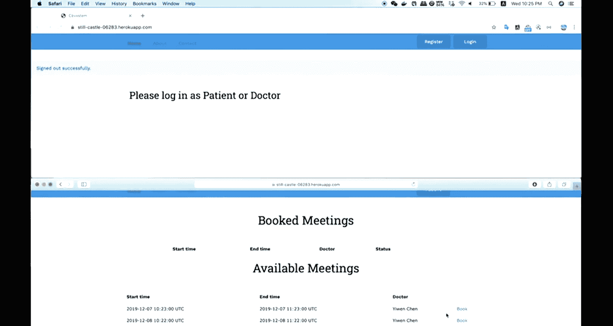

**核心功能**：
项目聚焦于自动化：
1.  **资源所有者界面**：允许资源所有者直接编辑其资源信息，无需管理员手动更新。
2.  **计划邮件**：自动发送提醒邮件（如资源信息更新提醒、失效链接通知）。
3.  **链接健康检查**：定期检查数据库中的链接是否有效。

**技术挑战**：
挑战包括理解遗留的Devise身份验证gem、实现并测试计划邮件任务（最终使用Action Mailer和Heroku Scheduler），以及在前端混合了React和ERB模板的代码库中定位功能点。

**团队经验**：
团队在分解复杂任务和使用Pivotal Tracker方面做得很好。大量结对编程有助于理解复杂的遗留代码。未来可以尝试更多角色轮换，并更早地编写测试。

**安全与性能建议**：
给未来开发者的重要提示是：需要加强安全性（某些管理员功能可能对普通用户可见），优化数据库结构以提升页面加载速度，并在测试邮件功能时格外小心，避免向真实客户发送测试邮件。

---

## 项目八：Audience First票务系统升级 🎭

最后一个项目展示了如何为长期运行的系统添加复杂的新功能。

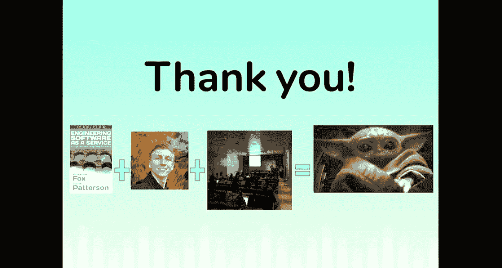

**概述**：该项目为已开发超过10年的非营利剧院票务系统“Audience First”添加新功能，主要涉及订单评论系统的重构。

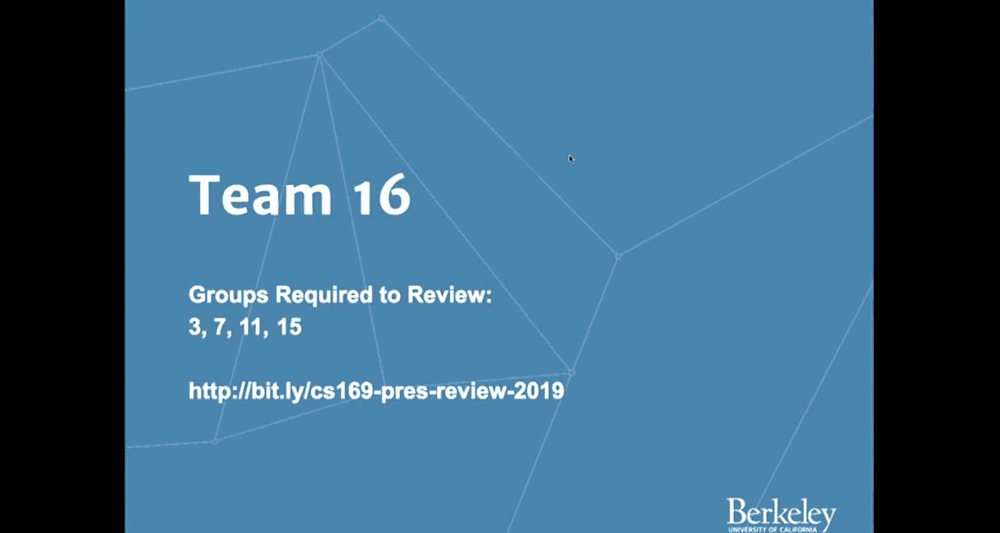

**核心功能**：
核心变更是将订单级别的评论“下放”到票务项级别：
*   **旧模式**：一个订单只有一个总体评论。
*   **新模式**：订单中的每张票或每个捐赠项都可以有独立的评论（例如，注明哪位家庭成员需要特殊照顾）。

**技术挑战**：
这是在大型生产代码库上进行的重大修改。团队必须：
1.  仔细修改涉及订单评论的控制器和模型。
2.  编写SQL迁移脚本，安全地修改生产数据库结构。
3.  删除或更新过时的遗留测试代码。
4.  在沙盒环境中充分测试数据库变更后再应用到生产环境。

**客户协作**：
客户Fox教授非常专业，他亲自创建Pivotal Tracker故事并提供详细的技术解答。团队有时可能过于依赖他的知识，而未能充分自主探索代码库。

**敏捷实践**：
团队坚持每周客户会议（而非双周）、经常进行结对编程并轮换项目经理角色。需要改进的是按时提交课程检查点。

---

## 项目九：Night Out/Night Off文化场所发现平台 🌃

我们以一个从零开始构建的社区平台结束本次回顾。

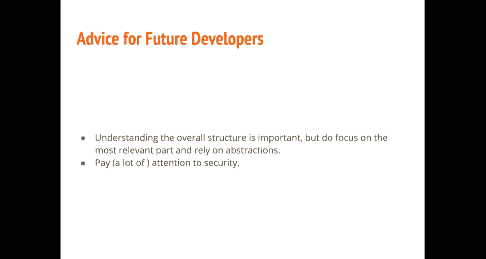

**概述**：该项目为研究生（尤其是有色人种研究生）创建了一个文化场所与活动发现平台，包含场所数据库、用户系统和评价功能。

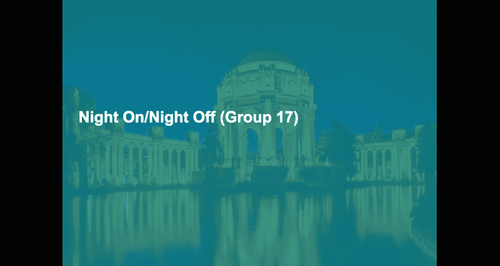

**核心功能**：
平台构建围绕以下核心：
1.  **场所数据库**：从Excel表格导入数据，可按名称、评分和亲和力群体筛选。
2.  **用户与评价系统**：使用Devise gem实现用户登录。用户可以评价场所（1-5星），并点赞/点踩他人的评价。
3.  **亲和力群体标记**：帮助少数群体学生识别对他们更友好的场所。

**技术挑战**：
挑战包括团队成员间Ruby、Gem版本不一致导致的环境问题，以及初始数据中的属性缺失或错误对评分算法造成的干扰。

**敏捷协作**：
团队积极互助，但初期在合并代码和安排会议时间上遇到困难。客户偏好使用Google Docs进行沟通，团队需要适应这种方式。

**可扩展性考虑**：
随着数据量增长（例如扩展到湾区以外），需要考虑性能优化。未来可能需要引入“超级用户”角色来协助管理内容和审核评价。

---

## 总结与课程结束语 🎉

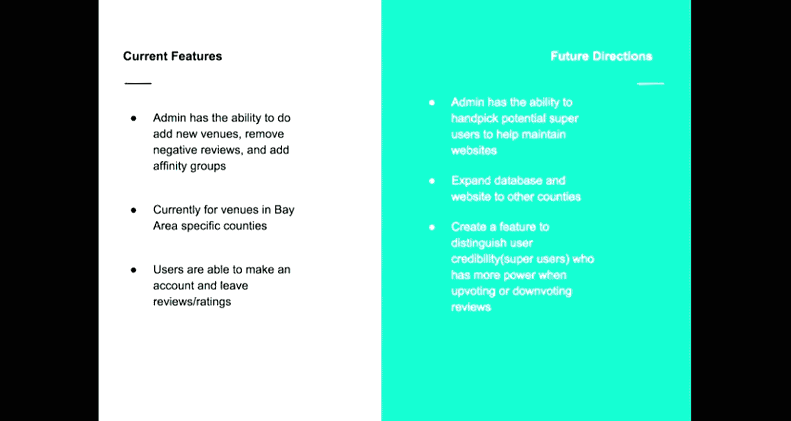

本节课中，我们一起学习了九个不同领域的学生软件工程项目。从教育管理、社区服务、医疗门户到文化平台，这些项目生动展示了软件工程如何解决真实世界的问题。每个团队都实践了敏捷开发方法，经历了需求分析、技术挑战、客户沟通和团队协作的全过程。关键收获包括：清晰沟通的重要性、对遗留代码的谨慎处理、测试先行的价值，以及在承诺交付时保持现实态度。教授最后提醒大家填写课程评价，并通知下一场展示更换了教室。

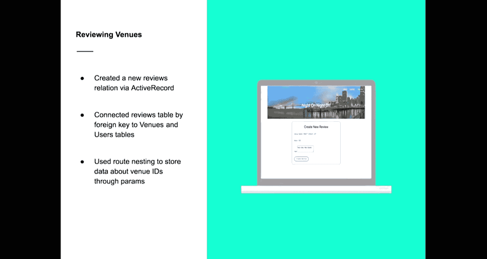

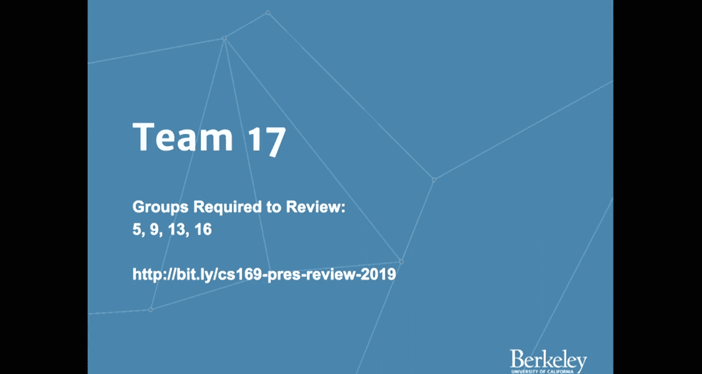

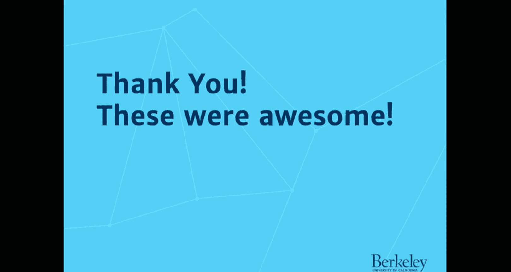

这些项目不仅是课程作业，更是学生们迈向职业软件工程师的宝贵实践。感谢所有团队的精彩展示！