# 课程 P1：Lec1 算法导论与大O表示法、算术运算 🧮

在本节课中，我们将学习算法课程的基本介绍，包括课程目标、后勤安排，并深入探讨一个看似简单却蕴含深意的问题：如何进行高效的算术运算。我们将从回顾大O表示法开始，并分析整数加法和乘法的算法效率。

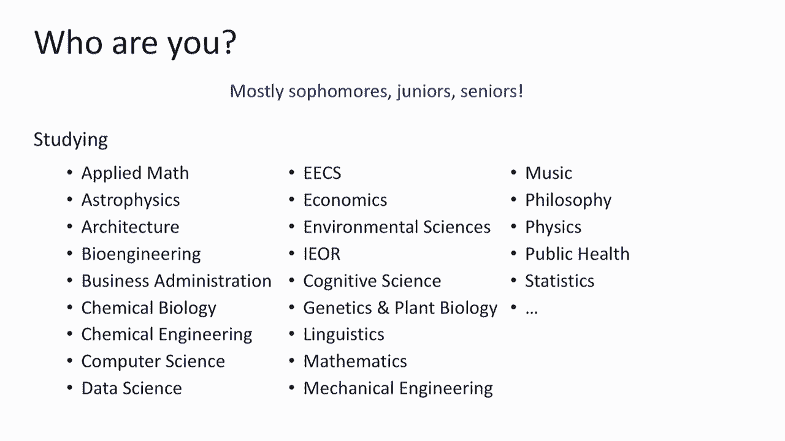

---

## 课程概述与人员介绍 👥

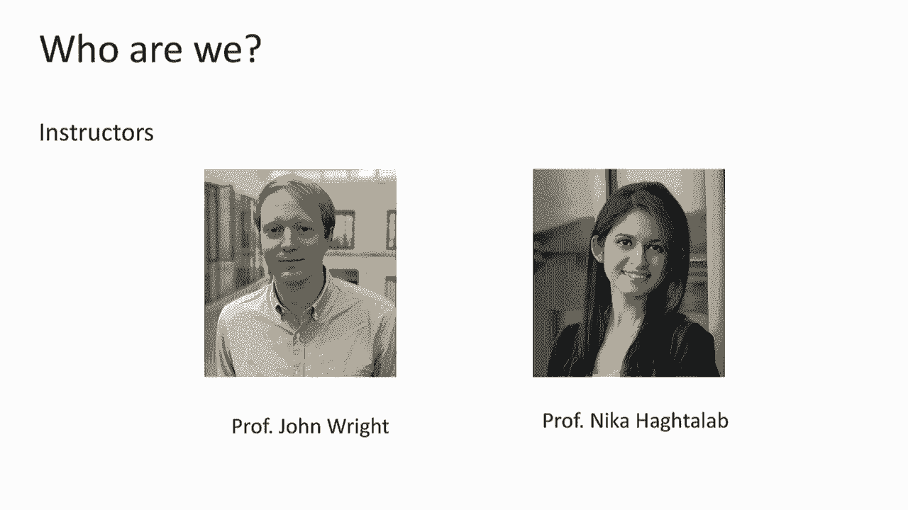

我是妮卡·哈克塔拉布，是计算机科学系的助理教授，研究方向是算法理论与机器学习的交叉领域。坐在那边的是约翰·赖特教授，他专门研究量子算法。我们认识很久了，是研究生时期的同学。

除了我们，课程还有庞大的教学团队，包括首席助教、研究生导师、本科助教以及负责评分和论坛的读者。所有课程相关的行政沟通，请通过课程专用邮箱联系我们，这将确保你的问题得到快速和保密的处理。

---

## 课程目标与核心思维 🎯

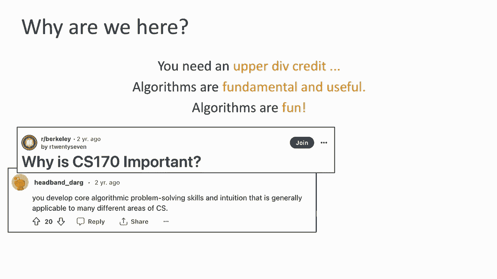

我们齐聚于此，部分原因是为了满足学分要求，但我希望更主要的原因是认识到算法的基础性、实用性和趣味性。算法提供了一种分析和理解世界的视角，它不仅仅是工具集，更是一种思维方式。

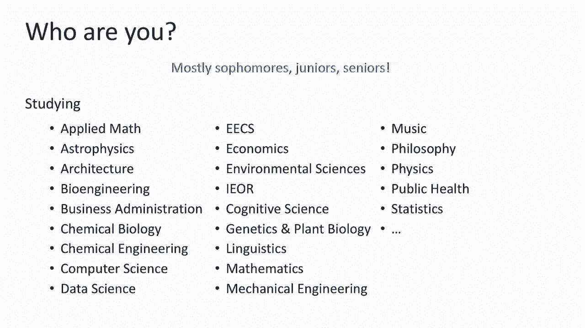

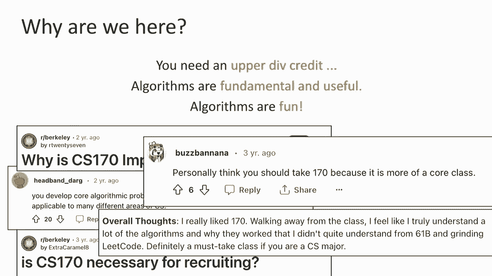

本课程的核心目标有四个：
1.  **学习设计与分析算法**：掌握一套算法工具包，并学会评估算法的优劣。
2.  **理解算法的局限性**：认识到“不能做什么”与“能做什么”同样重要，这甚至是许多计算安全性的基础。
3.  **设计高效算法**：探索如何让算法运行得更快、更好。
4.  **清晰地交流算法思想**：学会如何严谨地表述和证明算法的有效性。

在学习过程中，我们将反复追问三个基本问题：
*   它正确吗？
*   它快吗？
*   我能做得更好吗？

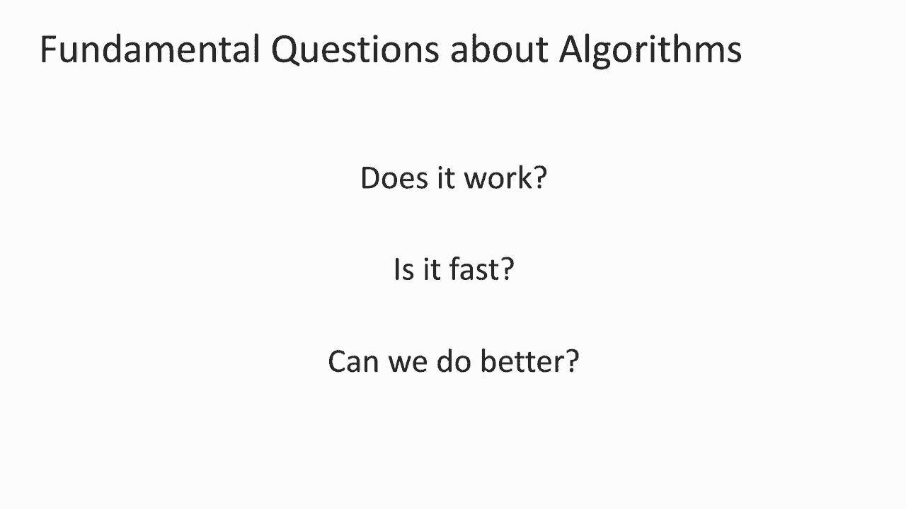

为了回答这些问题，我们需要培养两种互补的思维能力：
*   **细节导向思维**：追求精确的定义、严谨的证明，确保所有边界情况都被妥善处理。
*   **大局观思维**：建立直觉理解，把握不同问题之间的联系，形成宏观认知。

在课程中灵活切换这两种思维模式至关重要。

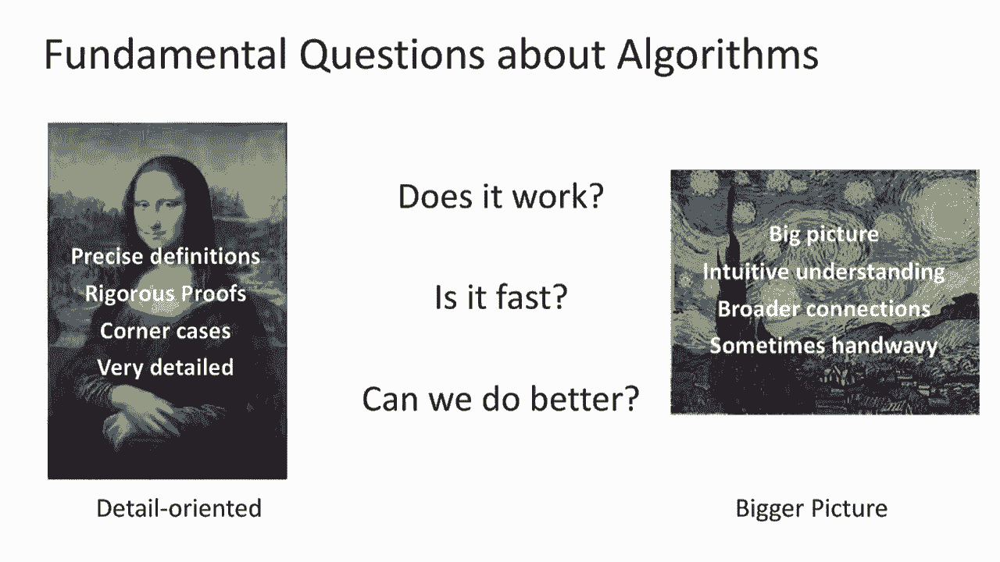

---

## 课程物流与学习建议 📚

以下是关于课程安排的重要信息：

*   **课程网站**：所有信息（课件、日程、办公时间等）均会在课程网站上发布。课件通常会在课前提供。
*   **课堂与录播**：讲座不会被直播，但会被录制并稍后发布。我们强烈建议你亲自到场参与课堂互动。
*   **作业与讨论**：每周有作业。我们设有“作业派对”和多个讨论环节。讨论环节侧重于深化对讲座内容的理解。
*   **沟通渠道**：请使用课程论坛进行公开讨论，使用课程邮箱进行私人咨询。避免直接给教授个人发送课程管理相关的邮件。
*   **考核**：共有两次期中考试和一次期末考试。期中考试没有补考安排，如有冲突需自行协调。
*   **学术诚信**：请务必阅读并严格遵守课程学术诚信政策，对此没有例外。

关于如何学好这门课，我的核心建议是：**不要落后**。积极参与课堂，课后及时复习并尝试幻灯片上的练习，在讨论前先自己思考作业，敢于尝试和“失败”。这些过程对于培养算法直觉至关重要。

---

## 算法简史与算术运算 🕰️

“算法”一词源于9世纪的波斯学者阿尔·花拉子米的名字。他引入了印度-阿拉伯数字系统，并撰写了关于如何使用该系统进行计算的著作，这些著作后来被翻译并影响了西方世界，其名称也逐渐演变为“算法”。这之所以重要，是因为它使得算术（如乘法）从只有专家才能掌握的技能，变成了普通人通过系统算法即可完成的操作。

---

## 重新审视：整数加法 ➕

让我们从最基础的加法开始。考虑一个具体问题：将两个`n`位数相加，需要多少次个位数操作？

经过与邻座讨论，你可能得到了诸如`2n`或`3n`这样的答案。这里我们引入**大O表示法**来忽略常数差异，专注于输入规模`n`很大时的增长趋势。因此，我们可以说整数加法的时间复杂度是 **`O(n)`**。

大O表示法的正式定义是：对于一个运行时为`T(n)`的算法，如果存在常数`c`和`n0`，使得对所有`n > n0`，都有`T(n) ≤ c * g(n)`，则称`T(n)`是`O(g(n))`。简单来说，它描述了运行时间的**渐进上界**。

---

## 深入探索：整数乘法 ✖️

接下来，我们分析整数乘法。使用我们小学所学的标准竖式乘法，将两个`n`位数相乘需要多少次个位数操作？

分析表明，其时间复杂度为 **`O(n²)`**。因为我们需要将第一个数的每一位与第二个数的每一位相乘，这大约产生`n²`次个位数乘法，再加上可能的进位加法操作。

那么，一个自然的问题是：我们能做得比`O(n²)`更好吗？首先，显然不能比`O(n)`更好，因为至少需要读取所有`n`位输入。但突破`O(n²)`曾是一个难题，直到20世纪60年代才被解决。

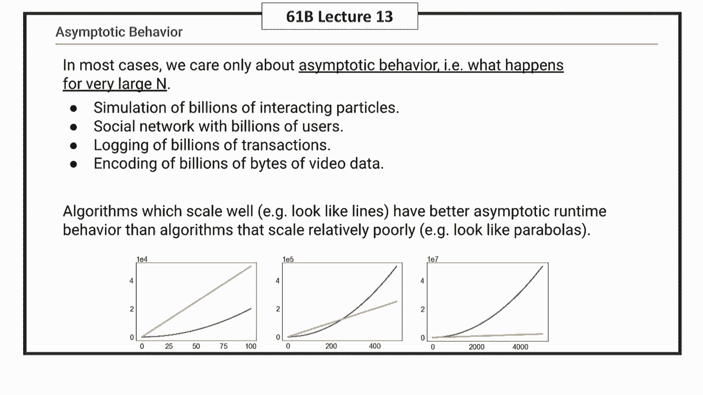

在寻找更优算法前，我们先看一个有趣的替代算法：**俄罗斯农民算法**（或称古埃及算法）。

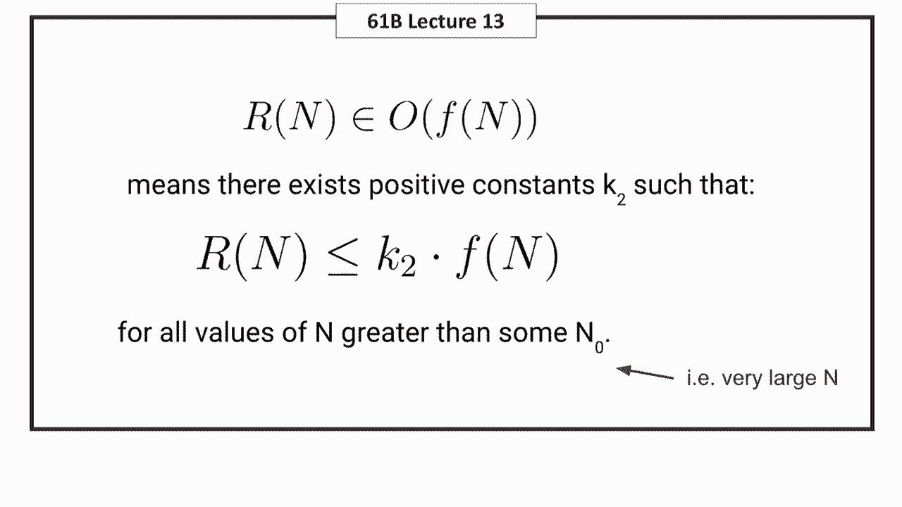

以下是该算法的步骤描述：
1.  将两个乘数写在两列的顶部。
2.  将第一列的数不断除以2（向下取整），将第二列的数不断乘以2，直到第一列变为1。
3.  划去第一列为偶数的所有行。
4.  将第二列中剩余的数相加，其和即为两数之积。

**家庭练习**：请尝试此算法（例如计算27×19），并完成以下分析：
*   证明该算法的正确性。
*   分析其时间复杂度，并说明它为何并不优于`O(n²)`。

---

## 分而治之的乘法尝试 🪓

为了寻求比`O(n²)`更好的方法，我们尝试**分而治之**策略。其核心思想是将大问题分解为更小的子问题，递归求解，再合并结果。

对于乘法，我们可以将一个`n`位数`X`拆分为两部分：`X = A * 10^(n/2) + B`，其中`A`和`B`各约有`n/2`位。对另一个数`Y`也做类似拆分：`Y = C * 10^(n/2) + D`。

那么，`X * Y = (A * 10^(n/2) + B) * (C * 10^(n/2) + D) = A*C * 10^n + (A*D + B*C) * 10^(n/2) + B*D`。

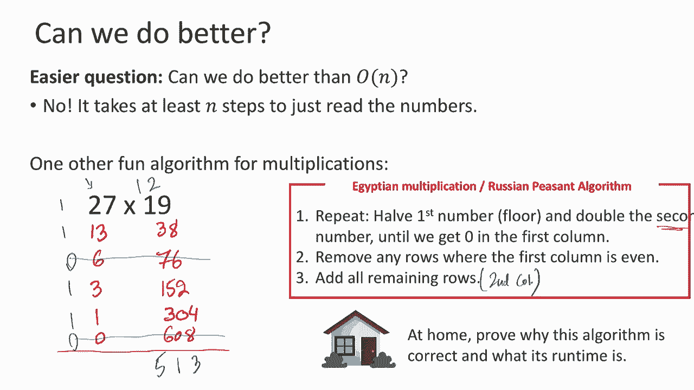

这样，一个`n`位数乘法问题被转化为4个`n/2`位数乘法问题（`A*C`, `A*D`, `B*C`, `B*D`），以及一些代价较低的加法和乘以10的幂的操作（这只需添加零）。

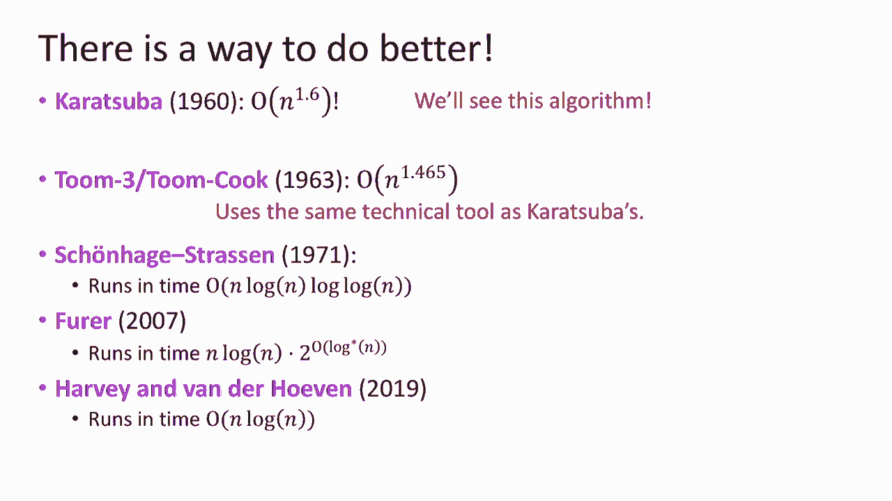

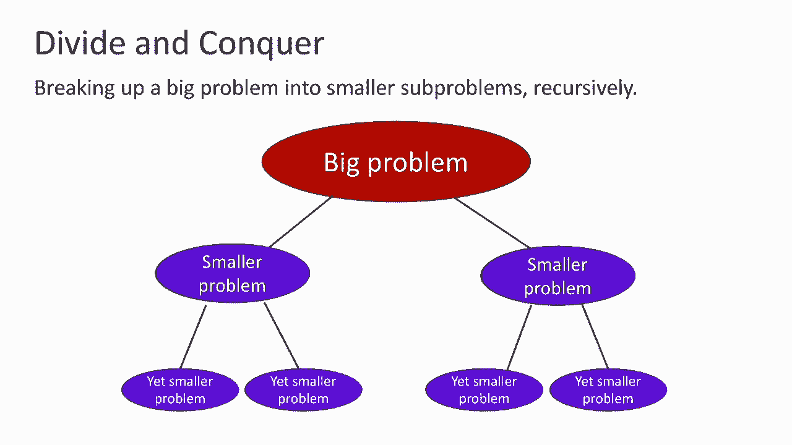

如果递归地进行这种分解，我们可以分析其时间复杂度。设`T(n)`为计算`n`位数乘法所需的时间，则有递归式：`T(n) = 4 * T(n/2) + O(n)`（`O(n)`是合并结果的时间）。

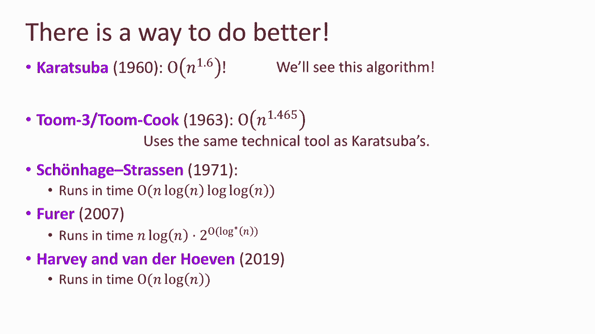

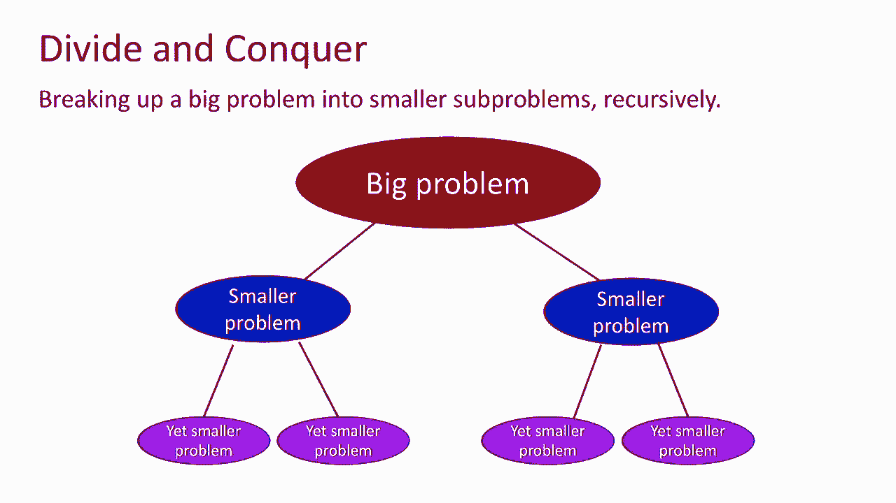

通过绘制递归树进行分析：
*   第0层：1个问题，规模为`n`。
*   第1层：4个问题，规模为`n/2`。
*   第2层：16个问题，规模为`n/4`。
*   ...
*   第`t`层：有`4^t`个问题，规模为`n / 2^t`。

当问题规模变为1，即`n / 2^t = 1`时，到达叶子节点。此时`t = log₂ n`。叶子节点数量为`4^(log₂ n) = (2^2)^(log₂ n) = 2^(2 log₂ n) = n^2`。

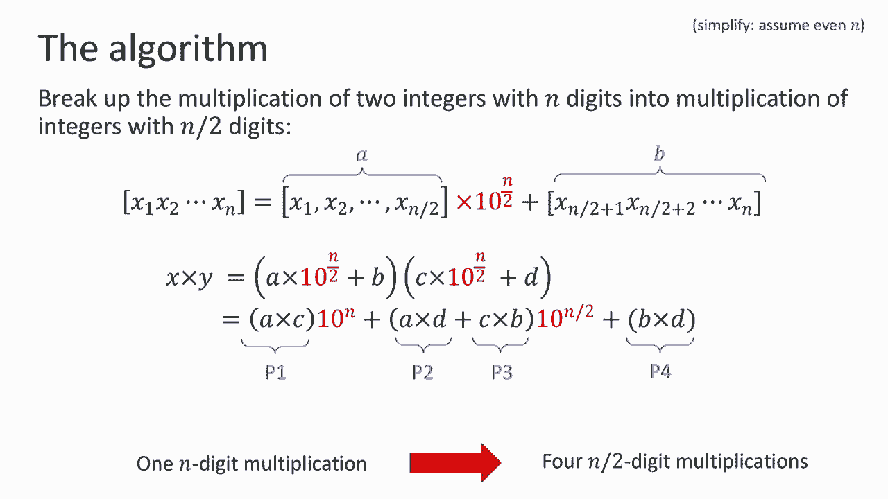

因此，仅在最底层，我们就需要进行`n^2`次个位数乘法。这似乎并没有比原始的`O(n²)`算法更好。然而，这次探索并非徒劳，它为我们指明了方向。

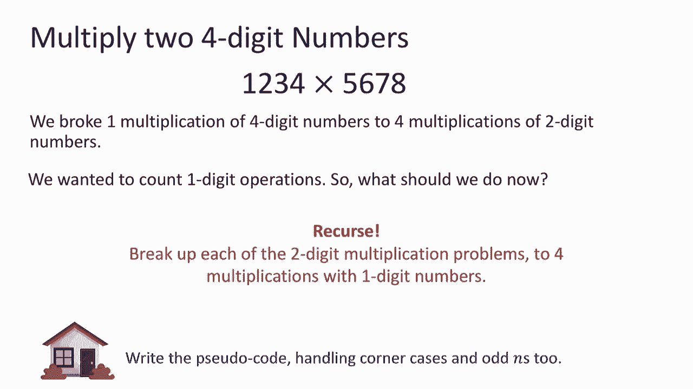

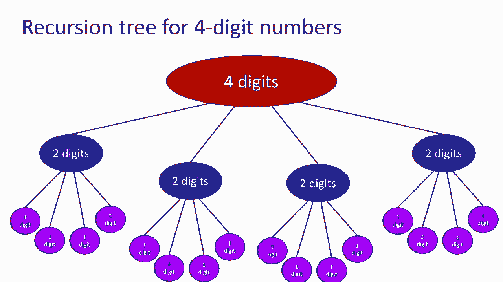

---

## 总结与预告 📝

本节课中，我们一起学习了课程的基本框架和算法分析的核心工具——大O表示法。我们重新审视了整数加法和乘法，分析其时间复杂度分别为`O(n)`和`O(n²)`。通过尝试分而治之策略进行乘法，我们虽然未能在本次得到更优解，但建立了重要的分析模型。

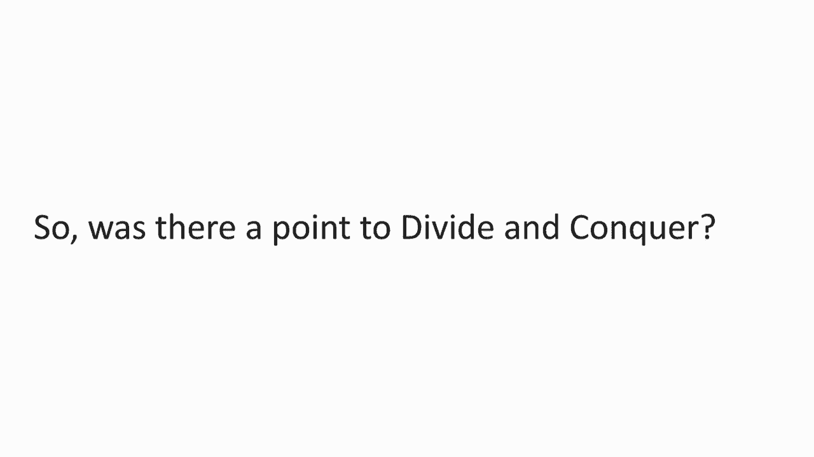

关键在于，我们发现了分治策略产生`4`个子问题导致复杂度仍为`O(n²)`。下节课，我们将介绍一个巧妙的技巧（**Karatsuba算法**），通过将`4`次乘法减少为`3`次，从而成功设计出运行时间优于`O(n²)`的乘法算法。这将是我们运用算法思维取得第一个突破的时刻。