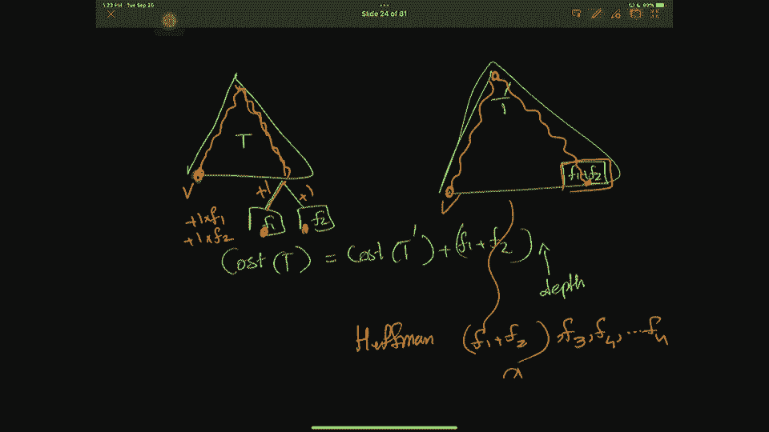
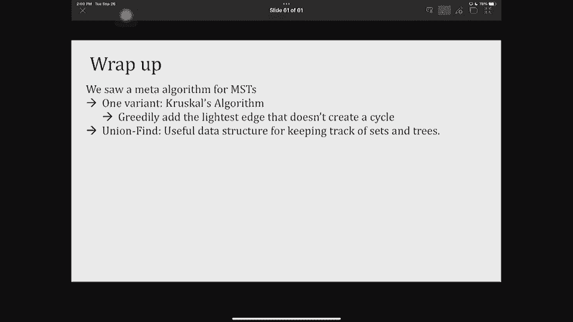

# P10：Lec10 Minimum Spanning Trees - 东风渐起UCAS - BV1o64y177K8

好啦，三十秒后开始，我觉得今天早上天气很好，如果你醒得足够早，如果你没有，然后它又变得温暖和正常了，好啦，所以说，如果你进入教室，请就位，所以我们要开始，霍夫曼码与最小生成树，但在我们谈论他们之前。

几个通知，希望你知道期中考试快到了，你一直在为此做准备，嗯，我们会有一个巨大的线程柱，你需要知道的所有后勤方面的事情，所以跟上，注意那个，但下周有些事情会改变，所以首先，嗯，请随意利用讨论，家庭作业。

家庭作业派对，所有这些都是为了谈论过去的考试，也是，考试的范围包括我们今天所做的一切，所以最小生成树和特定的晶体算法是其中的一部分，我们要在井上开一个中期审查会议，其中两个在周末，资料在幻灯片上。

这就是期中考试，现在呢，还有什么会改变，我们要做家庭作业，但这将是可选的，你不必上交，不管怎样，这都不算你的成绩，我们会把它和解决方案一起发布，所以这就是把它当成练习，因为作业五的材料是考试的一部分。

所以回顾一下解决方案，如果你还有什么问题，随便问他们，尤其是，因为我们希望你不会如此不知所措，在家庭作业聚会上做家庭作业，在办公时间，请随意使用这些东西，当然也是考试准备，作业两个等级已发布。

如果你想要一个即将到期的降级请求，最后，我的办公时间将略有不同，我们要去，所以我在课后回答了很多问题，你要做的就是把它变成正式的办公时间，再长一点，所以如果你课后有问题，我们可能会在这里花五分钟。

但之后就好了，我朝庭院走去，科里庭院，我的正式办公时间在那里，对于那些不在这里的人，你也知道，如果你想利用办公时间，当然啦，我们大概2点15分左右到达科里庭院，所以我们不会早到，这就是所有的作业。

对不起，通知，关于他们的问题，希望一切都很清楚，正如我所说，我们会有关于考试的后勤岗位，上面的一切，呃，还记得我们上几节课讲的内容吗，上一课，今天我们一直在讨论贪婪的算法，我们讨论了日程安排。

喇叭满意度，我们开始讨论最优编码，对他们所有人来说，我们讨论了一种算法设计，本质上我们称之为贪婪算法，我们正在做你期望算法做的显而易见的事情，但你很惊讶它成功地使用了这种技术，所以贪婪的算法。

我们正在一点一点地建立一个解决方案，把几乎最明显的，有时并不明显，但你能得到的最直接的奖励，设计它们并不难，事实上，他们通常速度很快，但是分析它们有点难，所以你们今天要看到的是最优编码的延续。

然后我们将看到最小生成树，有两种算法，我们今天会看到一个算法，周四会看到一个算法，周四的算法不在考试部分，但是今天我们所讲的和幻灯片上的内容都是考试的一部分，好啦，所以让我们做几个。

我有几张上次的幻灯片，回顾如何分析贪婪算法，我们说归纳法似乎是为，分析配料算法，关键是贪婪的算法，每当他们做出选择，他们没有排除这样一个事实，即他们可以匹配最优解，以后。

我们是如何通过归纳法将其形式化的，归纳假设是贪婪算法做出的前m个选择，匹配最优算法的前M个选择，对不起，最优解，或者换一种说法，在第一个m选择之后，仍然有可能将我的解扩展到最优解，然后归纳步骤。

这是最困难的部分，你会有一个基本情况，归纳步骤是你实际使用一个问题，具体的结构，以表明如果前M个选择与最优的匹配，那么M+贪婪者的首选，你可以按摩一下。

并把这个解决方案变成看起来最优甚至比最优更好的东西，这就是我们上次看到的，然后我们将再次看到这种类型的归纳证明的应用，今天我们在最后讨论了前缀代码，我们说前缀代码实际上是一一对应的代码，映射到二叉树。

结果我的代码是1 1 0，我最后在另一个代码，这些代码都不是彼此的前缀，这很好，因为我总是可以把信息解码成字母表，这是一个无损编码，所以我们想找到最优的前缀代码条目，我们谈到了最优性，从某种意义上说。

我们想要编码的一些字母比其他字母更频繁，这些频率是f1f2fn，就像，我们讨论了字母A和字母E，S和T比P和Q常见得多，因为那个，我们想把常见的字母放在树高一点的地方。

所以它们有更短的长度和最不常见的东西，稀有的字母更接近底部，我们通过定义编码的长度来定义这一点，以及树的成本的定义，所以一棵树的成本基本上，把所有这些叶子加起来，那片叶子的深度，时代，那片叶子的频率。

所以我们上次做了这些，但任何问题，任何你想要的，任何不清楚的事，好的，我们上次讲过的问题是最优无前缀码的问题，这个问题的输入是频率为f 1到fn的n个符号，输出是树或无前缀代码。

我们的目标是找到无前缀前缀的代码，或者成本最小的树，正如我们在上一张幻灯片中定义的那样，所以这就是我们要拿起的地方，我们上次讲到的地方，我们如何设计这样的树，我想让我们从思考。

最优代码或最优树看起来像什么，想象一下我有这样一棵树，即使不知道树叶的频率，这棵树可能是最好的前缀树代码吗，就像在最短的或不短的，我看没有，为什么不呢，确切地说，我有一个未使用的节点，它没有子节点。

所以为BNC做更长的树，但是没有用，所以我可以很容易地做的一件事是移除那个节点，把一切都提高一个水平，我只是得到了一个更好的代码，所以这告诉我们，即使我对频率一无所知，树需要是一个完整的二叉树。

对于那些可能忘记什么是全二叉树的人来说，它不是一棵完整的树，它是每个内部节点都有两个子节点的，所以你要么是一片没有孩子的叶子，或者你是一个内部节点，你还有两个孩子，好啦。

所以这就是最优代码应该是什么样子，你永远不应该有一个未使用的内部笔记，到目前为止还有什么问题吗，好啦，那么你问的信的频率是多少呢？嗯，我们能更多地说说频率在哪里吗，所以让我们，让我们看看。

下一个我要说的是，有一个最优的编码，哪里的，字母是彼此的兄弟姐妹，我是什么意思，我是说这两个人都是，有一棵树有一二，假设你有一个f，两个f，n或彼此的兄弟姐妹，他们有共同的父母，所以说清楚了吗。

我要为你证明这一点，这是我们今天要看到的第一个证据，忍耐一下，我们将看到一堆正式的索赔，所以如果有关于索赔的问题，我正在做，现在是问的好时机，所以你的观点，之前幻灯片上的树会满足这一点。

FB和C是最不常见的，在右手边，左手边还是会这么做，我不是说每一棵最佳树，每棵满足，好啦，让我们回到我在这里写的，这不是一个当且仅当它是一个方向，我是说存在一个最优树，好啦，最不常见的两个是兄弟姐妹。

让我们看看如何证明这一点，我将用矛盾来证明这一点，想象一下，我想我称之为一和二，现在我们称它们为x和y，假设这是我的主张，x和y应该是彼此的兄弟姐妹，用矛盾来证明，假设它们不在最佳树中。

所以让我们把另一对兄弟姐妹，事实上，让我们以最低的一个为例，最深的可能，好啦，这看起来像什么，像这棵树，我在看这棵树，我看着最底层的树叶，我只是叫他们A和B，当然啦，这样和一个，B兄弟姐妹应该存在。

因为我们已经有了一个完整的二叉树，我们说过如果它是最优的，它必须是完整的二叉树，现在我们用这个a b，因为x和y不是兄弟，据我推测，a和b中至少有一个不应该是x或y，否则我们早就完蛋了，你和我在一起。

那么发生了什么，假设x不是，现在发生了什么，如果我切换x，这比A和A的频率要低，这就是我提议的这个开关，所以你应该注意到，因为我把更频繁的节点放在更高的地方，我把它的长度缩小了，对呀。

我把稀有的结点放下，我把这个长度，但总的来说，我缩短了我的树的成本，因为最不常见的是付出代价的，而不是频率稍微高一点的，关于这一索赔的任何问题，事实上，当我切换x和a时，树的成本不会增加，是呀。

我可以重复一遍，记住，树的成本是频率乘以的总和，节点的深度，我想说的是当我取x的f和x的深度，加上a的f和a的深度，我所做的是我减少了这个深度，所以我把这个缩短了一些，比外汇大的A，我增加这个。

但是因为a比fx大，总的来说，我降低了我的树的成本，这个总和减少了，因为有可能你可以有多个最佳树，是啊，是啊，所以我可以展示一个稍微强一点的版本，但这将像许多不同类型的最佳树，这就是为什么我不想做那个。

好啦，但到目前为止我们都很好，那么我做了什么，我拿了一个最低的X，我把它降到了A和B中的一个，现在我可以用Y重复同样的事情，如果y不是b，如果y是b，我会做X和Y会是兄弟姐妹，如果他们不是。

我将一次又一次地切换y和b，我没有增加这棵树的成本，所以现在我得到的是有一种更便宜的树，或者至少没有更昂贵的树，因为x和y是彼此的兄弟姐妹，好啦，这就是粘土问题的证明，很好我们学到了两件事。

我需要一个完整的二叉树和xy，最低频率对是彼此的兄弟姐妹，所以这将向我提出一个贪婪的算法，这个想法是，如果我确定在某个最佳树中，频率最低的是兄弟姐妹，然后让我用这些最低级的东西来建立兄弟姐妹。

然后继续为二叉树从下到上构建一个完整的最优树，我是什么意思，嗯，首先，这叫做霍夫曼编码，让我给你它的伪代码，但是要形式化一个伪代码，我将使用一个叫做节点的对象，这就是你所期望的，节点有频率。

所以点频率就是，左边的点是指向另一个节点的指针，那是那个节点的左子节点，右键是指向该音符的正确子音符的指针，所以这只是为了让我可以在没有的情况下建造树木，现在呢，霍夫曼编码是什么，它需要n个字母和频率。

它建造了一个树井来建造一棵树，它首先从每个单独的字母中构建节点，我将创建一个节点，我会分配那个节点的频率，你所期望的方式，而且这个节点没有子节点，这就是我现在创作树叶的本质，好的，通常我用矩形显示叶子。

我按圆圈显示节点内部节点，但在这里，方式并不重要，我对待节点和叶子都一样，它只是没有子节点的叶子或节点，所以我先把这些叶子，然后我把这些插回优先级队列，优先级Q及其频率，原因是我想跟踪最低频率的节点。

好啦，所以我用频率作为钥匙，我现在把这些节点插入优先级，我该怎么办，只要此优先级队列中还有多个节点，我把频率最低的两个节点，这两个节点，我可以带他们去，从本质上看Q，取最低的键，让我们称它们为x和y。

我要把它们合并起来，合并看起来像什么，我会做一个节点，我叫它Z，我把那个节点的频率设置为它们的频率之和，我把这个节点的左子节点和右子节点设置为x和y，就这样了，相反，我把z添加到我的优先级que完成。

我会重复这个直到本质上，每次我都用以前的东西做一个子树，直到我只剩下一个节点，那个节点是我的树的根，所以让我们看看这是什么样子，当我为下面的示例执行此操作时，所以我把每样东西都记下来了，我所做的是。

我找了两个最不常见的数字，它们是什么，这些是最小的频率，我再做一个节点，我把频率，那是零点零九和零点零五的总和，零点一四，我插入父级并将子级从优先级队列中移除，因此。

您不再可以直接从优先级队列访问这些东西，然后我回头看了下一轮，我需要两个频率最低的节点，它们是什么，我把一个家长和他们的一些频率，我删除孩子们，我回头看，我现在有什么，嗯，最小的频率是一点四和一点六。

当然这是，我没给它起名字，但它有个名字，去一个无关紧要的地方，我有一个指向它的指针，所以这些是我最小的频率字母，从某种意义上说，或最小频率节点，我给他们找了个家长，把所有的频率加起来，一点四，一点六。

就变成了第三点，我删除下一个，谁会被合并，你能告诉我，点二点五和点二点三将合并，父母会有频率的总和，最后四点五和五点五合并，最顶端的频率总是1，因为我把它下面的所有频率加起来，就这样了。

这棵树我得把它弄得漂亮点，我要这样写，这是这是，我只是改变了节点的长度，是呀，我怎么知道在哪里放0和1，假设无论何时你向左都是零，当你合二为一，没关系，它不会改变树，这棵树是，看起来一样。

即使你像左右逢源的孩子一样改变，树的成本不会改变代码的更改，但成本不，这就是为什么有很多不同的最佳树，其实呢，我们在找一棵树，不是什么树，我们在找一棵树，我们正在努力寻找成本最小的树。

关于目标还有什么问题吗？为什么要加它们，而不是平均它们，思考这个问题的方法是节点和叶子本质上是一样的，如果我把它们平均一下，我不是，我不是这样的，我不是真的在说，事实上，他们确实多了一个优势，你知道的。

这就是为什么我把它们加在一起，因为无论父母是谁都应该是两个孩子的负责任的代表，如果你，如果你把它们平均一下，你可以在家试试，如果你把它们平均一下，你真的可以破坏正在发生的事情，事实上。

你会得到一棵非常不平衡的树，因为最小的两个，它们的平均频率将永远是最小的频率之一，所以你基本上是在建造这种不好的树，所以让我们回去，关于我们如何运行算法的任何问题，然后呢，好啦，所以你必须始终如一。

我想说的是，呃，你在树上做什么并不重要，从某种意义上说，谁在，让我们看看这里，就像z点左等于y，Z点右等于X，一样好，这就是我的主张，没关系，谁是合适的孩子，左孩子是谁，但一旦你有了它。

然后你应该在左右的东西上保持一致，意思是，这就是我们所说的，好啦，关于我们如何运行这个，所以说，我是怎么把密码弄出来的，本质上这就是我所说的，你知道那不重要，左边的孩子是谁，谁是合适的孩子，但我承诺。

你知道那个，对我来说很美丽的树，现在我有了0和1，这些是代码，1 1 1是这个1 1 0是这个，它告诉我叶子的地址，如果你写这棵树的成本，您有一个节点的长度为，深度一频率四五，你有三个节点。

这是深度3的频率，您将有一个两个节点，这些是它们在深度的频率，这就是你的树的总成本，这是我以前计算过的，我能在脑海中做到，好啦，所以这就是树，现在呢，我的主张是霍夫曼代码是最优的，运行速度很快。

让我们看看它为什么跑得快，我们怎样才能确保它跑得快跑得好，这真的是因为优先级队列，我知道我们一周前讨论过优先排队，所以让我们快速复习一下优先级队列，在那里这些线索，所有东西都有一些与之相关的键。

它给了我一堆手术，它给了我插入，删除最小，实际上还有一个更新键，但我只关心插入删除男人，如果使用二进制堆实现优先级队列，这两个操作的对数都是，就像现在的运行时。

让我们看看一开始我们在霍夫曼编码中使用它们的地方，我在做一个插入物，因为这些都是我做的，其中n个节点，每一个我都支付log n来插入，所以现在是n log n。

当我在while循环的每次迭代中输入这个while循环时，我取两个最小频率，基本上是两次删除最小，删除男人那是X，删除男人那是Y，然后i因为我去掉了x y，然后我插入我所做的父节点。

这样我就有了另一个插入，我要跑多少轮这个while循环，如果你注意到每次我拿两个节点，向后插入一个节点，所以我从N件事开始，我继续，直到我剩下一个，所以实际上就是n-n减去n或者n-1，此循环的迭代。

所以一起，为删除最小和插入付费是另一个N记录器，所以这告诉我们的是，哈夫曼编码算法，登录N个关于这个的问题很快，你的意思是，从未插入回优先级队列，这听起来不太有道理，所以我想你的意思是我有这个东西。

我把这个插回去，让我们假设我有所有这些其他的家伙，你是说我承诺利用这家伙，总是在我的下一轮，对呀，这又使一棵树看起来像这样，我们已经看到这些树不是很好，所以这其实很重要，因为发生的事情是。

你可能会合并两个最低频率的东西，一旦你把它们合并，它们的频率之和远远高于下一个最低的频率，想象一下如果所有东西的频率，我应该去一个非常平衡的，几乎完全二叉树，所以那种树会很糟糕，这正是发生的事情。

因为如果所有东西或多或少都是相同的频率，当我拿最低的两个时，他们就变成了，他们把父母，它变成了下一个最低的两个的两倍大，这就是为什么我需要继续查看优先级队列中最低的两个东西，我可以拿一个最低的和前一个。

是呀，因为有pre-any树是无前缀代码，有一个一对一的映射，如果你回到其中一张回顾幻灯片，树和无前缀代码，他们之间有一对一的映射，所以它是无损的，好啦，接下来我想证明这是件好事。

就像霍夫曼密码是最优的，我要做的是，通过回到最佳树的样子，因为我们说过最优树是一个完整的二叉树，最低频率的字母是兄弟姐妹，这些就是我要用的事实，但我会用归纳法，这就是霍夫曼编码是最佳前缀树的说法。

或最优代码，我会用归纳法，我的目的是说贪婪并不排除最优，就像我上次给你们的模板一样，我得用归纳法，这意味着我需要一个基本情况，这里有意义的基本情况是使用两个节点，对于两个节点来说是没有意义的，你想想看。

如果我有两个节点，我所能做的就是给他们中的一个赋零，一个接一个，你知道这是优化两种代码的唯一方法，其中一个是零，他们中的一个是一个，和霍夫曼代码会做同样的事情，他们两个把父母，所以其中一个是零。

或者他们中的一个是一个，所以基本情况都是好的，霍夫曼编码对任何n减1个节点都是最优的，现在我要展示的是，如果我有N个字母，而不是n减1，我的一半编码仍然是最佳的，这就是我的归纳步骤。

那么我怎么做归纳步骤，我将利用我们说过存在一个最优树的事实，两个最低的频率是彼此的兄弟姐妹，不丧失一般性，假设我对这些频率进行了排序，所以我把字母1，2重新命名为n，我能说的是嗯是的，两个最低的频率。

其中一个和两个是兄弟姐妹，因为这就是我们之前展示的，所以我要合并这两个节点，什么鬼，这看起来像什么，这是我的树，我有最低频率的字母，一个和两个是彼此的兄弟姐妹，我告诉你想想另一棵假设的树。

我要把它叫做T Prime，其中一个和两个合并，就像我在霍夫曼编码中合并一样，事实上，所以它们由一个节点表示，那个单一的节点，也许我叫它推倒一二，我给它赋值f1加f2的频率。

那么你能告诉我t和树t素数的成本是多少，你能把右手边的树的成本写下来吗，就左手边的树而言，我帮你写下来，然后让你们中的一个告诉我为什么，是这样的，我的主张是左手边的树的成本正好是，右手边树的成本。

加f1加f2，有人自愿告诉我们原因吗，是这样的，这里的深度我还有一个，F1和F2，这是F1F2，如果相反，我把这棵树砍下来说，F1和F2，我只是不会付这笔额外的钱，所以为了支付额外的长度。

我加了T Prime的成本，F1加F2是这里和这里的频率，最重要的是我只付树叶的钱，当我看着一棵树的成本，所以本质上我付出的，我在这里付的钱就像，我再付出一步，我付这个，然后这里再走一步。

我没有额外的步骤，我就走到这一步，没有额外的步骤，所以这个少了一个，这里是f的一个额外步骤，这里是f的一个额外步骤，我做的，我没有做任何假设，我告诉你想象一棵假想的树，会被合并的树T素数。

所以我构造T素数，无假设，当你能正确地构建事物，好啦，到目前为止，一切都好，好啦，我要对哈夫曼树重复同样的魔法，假设我有一棵霍夫曼树，我要打电话给霍夫曼树n个字母h，这是左手边，根据构造。

我知道我造了一棵霍夫曼树，所以f 1 f 2是最低的兄弟姐妹，对呀，那是我第一个出现的，所以肯定有兄弟姐妹，我是这样构造的，然后我告诉你把它合并起来，在这里一次又一次地看，我有完全一样的东西。

成本是左手边，树仍然是右边树的成本加上f 1 f 2，但这里还有更神奇的东西，那正在发生，如果这是最优的，嗯，这是什么？这是n减1个字母的最优树，对呀，对于n减去一个字母对于n减去一个字母。

我有三个FN和F1和F2在一起，一个频率一个字母，所以我保证选n减去1，归纳假设，因为它少了一个字母，少一个节点或叶子，现在我怎么用这个，拿这两个事实来说，我刚刚证明了T的成本和H拥有这个属性的成本。

所以让我们把它们写下来，所以我证明了对于一个最适合n个字母的条约，我有这个和我一半的编码，对于N个字母，我有这个，现在我要把所有的东西放在一起，我提出的第一个要求，即h质数的成本并不比t质数的成本大。

它们都是n减去1个字母的树，我的归纳假设告诉我霍夫曼编码是最佳的，所以h素数的成本不可能大于t素数的成本，到目前为止，一切都好，接下来我知道什么，我知道这实际上意味着h的成本，不比T的成本大。

因为它们都有相同的偏移量，一加二，如果我把它们划掉，我可以从左到右，这说明了什么，这是字面上告诉我，对于N个字母，霍夫曼最优是有代价的，这并不比最佳条约差，所以霍夫曼是n个字母的最优解。

我现在已经这样做了，我从霍夫曼对n减去一件事的最优开始，我发现霍夫曼最适合做N件事，如果你有好的，如果我们有多个最优树，他们会有同样的成本吗，根据定义，他们必须，因为我们在寻找最小的成本。

所以如果他们看起来不一样，那很好，但它们的成本需要相同，那是我的好，那么为什么会这样呢，这是归纳假设，我说过直到n减去一个字母，我已经证明了，我现在只是想证明，对于N个其他问题，为什么我们不做什么。

我们为什么不把它相乘呢？好啦，好呀，让我在这里用一个东西。

好啦，所以问题是，如果这是t，我有f，f2，我去了T质数，我刚刚有F1加F2，t质数加f1f2的成本，尤其是，你的意思是，不应该，我把它乘以一定的深度，你没有的原因是让我们看看，让我看看你能不能。

你也能看到蓝色吗，否，对于这些节点中的每一个，这是你为他们付出的代价，对吧，所以对于所有这些其他节点，成本完全一样，就像我为这个节点支付的钱是完全一样的，穿过两个，让我们看看我为这个节点付出了什么。

对于此节点，我付这个加一个，类似地，对于这个节点，我现在付了这个加一个，我在这里付了什么钱，我只付了这个，所以唯一要付出的就是，加1乘以f 2，是霍夫曼，为什么霍夫曼，因为霍夫曼进入了这个循环。

在那里它选择了一两个，它实际上是在一起做东西，所以事实上，如果我从第二步开始思考霍夫曼树，那棵树是什么，所以说，那是霍夫曼，但它是霍夫曼为非常特殊的事情，F1加F2等于一个字母，就像，把这封信叫做。

然后F3 F4到FN，因为霍夫曼本身就是一个递归过程，我实际上上升了一层，不一定要在底部，现在底部可能还有其他东西，因为当我把它们合并的时候，你看右手边有两条边，左边没有边缘出来，于是他们上去了，好啦。

所以如果你仔细想想，我想说的是，如果我让霍夫曼参加这个案子，这就是我会得到的，因为我管理霍夫曼的方式，例如，首先合并其中一个，然后再运行霍夫曼，好啦，这是霍夫曼。

我们证明它是最优的，很快就结束了，算法，贪婪，我们知道如何通过归纳法来分析它，在这一点上，这对于n-1是最优的，我把这个方程放进去，好啦，接下来我想做的是，我本打算给你三分钟休息时间，老实说。

我觉得更重要的是，如果我把这三分钟用在今天的课上，我们可以跳过休息时间吗，就这一次，是啊，是啊，好啦，谢谢你们，所以让我们跳过休息，这样我就可以告诉你更多关于重要的事情，这是最小生成树。

那么什么是最小生成树，你可能会问，是啊，是啊，如果你还需要，你知道的，去洗手间休息一下，没关系的，把你的三分钟，我只是不打算做一个预定的，生成树是连接图的所有顶点的树，所以我们非常考虑一棵树的成本。

就像一条路的代价，如果你还记得戴克斯特拉，它在增加所有的重量，所以树也有边，一棵树的成本是边成本的总和，所以对于像这样的加权图，这是一棵生成树，因为每个顶点，费用是多少？

如果你加四加八加七加十加十四加六七十一，你会付出代价的来吧，我知道是六十七，六十七的费用，不是我想出来的，我以前做过，好啦，我们接下来要讨论的问题叫做最小生成树，或者MSD，它的输入是一个加权图。

所有的权重都是非负的，所以我们不需要去想消极的事情，然后呢，我们想做的是回馈一组边缘，连接所有的图形，所以所有的顶点，我们想确保它有最小的成本，记住这些边的成本是，所以这是另一个生成树，事实上。

它碰巧是最小生成树，当然啦，三七，这就是我们要找的，好啦，现在你可能会问，我为什么要关心这样的问题，您可能需要考虑的一个非常常见的原因是，它是一个网络连接的概念，例如，当他们想把手机信号塔。

至少他们需要确保每个手机信号塔都连接着每个人，所以你需要喜欢，在每个节点之间都有这种类型的连接，或者如果你想修路，把很多城市连在一起，至少，你需要把道路是最小的跨越树行来连接城市。

所以这确实是这个东西最初出现的地方，你知道的，公路网，公用事业网络，电话线，所有这些东西实际上塔可能不是这个出现的地方，电话线是出现这个的地方，嗯，也是这种类型的算法，比如找到如何尽可能有效地连接一切。

是许多其他算法的预处理步骤，我们会看到一些家庭作业，那么我们实际上是如何做到这一点的呢，我的主张是这里还有另一种贪婪的方法，这将使我们最小生成树，我将复制我们对霍夫曼密码所做的。

你知道我一开始是怎么说的吗，最优树是什么样子的，我们将做一些非常相似的事情，讨论什么是最优生成树，或者接触所有顶点的最佳边集看起来像，那么MSDS是什么样子的呢。

第一个说法实际上是关于一棵树本身的一些事实，好啦，所以一棵树，有不同的定义方法，你们中的一些人，尤其是如果我不在乎，就像边缘的长度，所有的边都是长度1。

你们中的一些人可能会将树定义为连接所有顶点的非循环图，这是正确的，这是给你们中的许多人的定义，存在等价定义当且仅当，n个顶点上连接所有n个顶点且n减去一条边的任何图，也是一棵树，有人见过这些事实吗。

还是新的，你们中的一些人已经看到了，我不打算证明给你看，但你可以考虑一下，两个节点上的树必须有一条精确的边，所以它是n-1，每次你添加另一个节点，你只增加了一条边，所以是n减1，所以这是第一件事。

所以包括生成树在内的任何树都应该有n减去1个节点，N减去一条边，我想说的第二个事实是，边缘的最小重量集，想象一下，它不一定是一棵树，但是现在连接所有顶点的最小边集，我的主张是它必须是一棵树。

你可能会问为什么，这是一个非常简单的观察，通过一个图表，我试着不让它看起来像一只螃蟹，但它看起来还是像一只少了一条腿的螃蟹，如果我在这里的某个地方有一辆自行车，所以如果不是一棵树，它一定有一个循环。

然后我总是可以移除循环的一个边缘，保持一切连接，例如，我可以去除边缘紫外线，我仍然可以从任何一个节点到另一个节点，在我可能走这条路之前，我现在不走这条路，而是走这条路。

所以任何有循环的东西都不可能是最优的，这就是为什么我们谈论最小生成树而不是最小生成子集，因为它们必须是树，现在我们学到了一些关于最小生成树的知识，让我们更多地了解一些图论事实，有一种叫做割伤的东西。

你们中的许多人以前见过这个，切割是一种非常花哨的说法，我要把我的顶点分成两组，就像一个隔板，不相交，你要么是和S要么是V减S，好啦，那是割伤，使切口更清晰，我会喜欢落在S中的颜色节点。

所以如果这些是落在s中的节点，就好像我把他们从，没有落在我们身上的节点，那是割伤，节点的分区，这只是一个花哨的词，这里是另一个切口，我想把a b和f分开，它们不必都相邻，我只是在他们周围切。

这里是集合s，这边是集合v减去s，所以这是一个切口，关于切割的问题，割伤的目的是什么，这是个好问题，切割的目的实际上是一种方式，给了我们一种观察切口边缘的方法，顶点很重要，但割伤叫割伤。

因为它打破了一些边缘，每当我们谈论削减时，他们切割的边缘发生了重要的事情，一些重要的结构存在，所以说，事实上，这种结构帮助我们定义贪婪算法，我给你们举个例子，假设我已经发现了一些属于生成树的边，好吧。

想象一下它属于最小生成树，最优生成树，假设我把这些边缘画成蓝色，我觉得你可以，我希望你能看到这个，这些其他的边缘，你能看到它们有一点阴影吗，这些是最优生成树的其余部分，我只是还没发现，我不知道。

但我知道蓝色的，假设我已经想出了蓝色的，现在我问自己，我应该添加到这一套吗，我要做的一件事是，我去看看伤口，我如何很好地定义切口，随便拿一刀，X不，一点都不重要，好啦，所以x中没有一条边被它切割。

所以在我的集合x中没有从s到v减去s的边，这是其中一个，看，它没有切割任何蓝色的蓝色边缘，可能还有其他的，现在呢，让我们看看正在被切割的边缘，这些是正在被切割的边缘，他们有什么特别之处，似乎很特别的是。

Mswell的唯一优势，我还没有发现的MSST的边缘正在被切割，它是所有被切割的边缘中重量最低的边缘，这只是一个直观的陈述，我还没有提出任何主张或证据，但凭直觉我告诉你的是。

如果您找到了最小生成树的某些部分，你拿一个没有切割你找到的任何部分的切口，然后最轻的边缘穿过切口，属于MSD，我将在下一张幻灯片中正式说明这一点，但想想我给你看的东西，问题的定义，关于割伤的定义。

或者边缘被切割的定义，可能还有其他人，事实上，还可能有其他削减，所以我可以想出一个不同的剪裁，让我画一个不同的切口，所以这是另一个切口，我又有七个，四、二、二属于理学硕士，但碰巧四和七也属于它。

所以我不是说只有一个边缘属于MSD，我是说最轻的边缘，属于理学硕士，其他问题，我说的最轻是什么意思，我是说最小的重量，这里的数字，这些是砝码，在被削减的东西中，从s到v减去s的边是什么，我就是这么叫的。

所以从s到b减去s的边是这个和这个，没有节点被切割，有边缘被切割，所以在这种情况下，让我强调一下，这个被抓了，这个被抓了，这是被抓到的，我说的是体重最低的那个，四分之二，七分之一属于MSD，我擦一下。

因为我觉得这会混淆很多事情，让我们回到另一件事，我画的其他切口，这是割伤，那是切B，图的其余部分的h和g，将顶点向右，被突出显示的边缘，是从切口的一边到另一边的边缘，边缘重量是穿过切口的最小重量边缘。

我会正式确定这一点，所以如果你对形式化有疑问，我将在下一张幻灯片中正式确定它，但如果你机械地有问题，我现在就问，的，为什么我必须假设MSC的一些边缘已经被很好地发现了，我这么做的原因是因为。

我想做一些贪婪的事，如果你还记得贪婪是一个非常迭代的过程，一个接一个地建立最优解，所以我说，想象一下，我已经建立到现在，接下来我应该添加什么，你总是可以从没有发现任何优势开始，然后从那里开始。

使用正式化之前的其他问题，是呀，我将把下一张幻灯片正式化，切割仅由切割中的顶点定义，因为其他顶点都在切口之外，我们在最后一张幻灯片里，我们再看一遍，切只是顶点到s和v减去s的分区。

从一个到另一个的边是穿过切口的边，没错，你可以把你最喜欢的切，不管是哪一刀，你走最轻的边缘，那个切口必须属于MSC，这就是形式化，因为你们很多人都在问形式化，现在让我正式说明我所说的话。

这在形式上称为图的切性质，它首先说假设我有一组边，这个x又是图g的msc的一部分，一些MSD，因为有可能有最低限度，类似于相同代价的多个最小生成树，现在考虑一些切s和v减去s。

这个切口需要有一个特殊的属性，第一个性质是它实际上并不切割x中的任何边，所以x有形式上的东西，X没有顶点，对不起，X没有边，一端是s，另一端是v减去s，好啦，所以这就是我所说的，这就是我一直在叫的。

这就是我口头上所说的，但我将正式使用这个符号，这是第一个x没有边的性质，穿过切口，第二部分是索赔的一部分，说让我定义一下现在穿过婴儿床的边缘，就像一端是S一样，另一端是v减去s好的，所以这就是边e。

特别是我选择了最轻的一个，成本最便宜，那是我的E，我的主张是，如果我把e加到x上，x加e，图的某个最小生成树的子集，这是COD属性的正式定义，没有边缘，不喜欢，它的意思正是我在那里写的，X是一组边。

意思是x没有边，从s到v减去s，所以如果我把每一个紫外线，这是一个X，要么都是紫外线，R和S或者两者都在V减去S中，不可能有一个在s中，一个和v减去s，一个一个，是啊，是啊，那很好，马马虎虎。

如果这是S，这是v减去s可能有这样的边，它唯一没有的就是这个，这就是它的意思，从s到b减去s没有边，关于这份声明还有其他问题吗，好啦，让我们证明这个说法，嗯，我要证明这一点，嗯。

这是满足以下条件的最小生成树，什么叫满足条件，意思是x，好啦，因为我说过，假设我已经发现了它的一些边缘，所以我要把，让我给你看看这是什么样子，我割伤了，S对V减去S，这是我顶点的分区。

蓝色的边缘就是边缘，理学硕士X，我已经发现，树是蓝色的边缘，加上一些红色的边缘，好啦，现在我说看看这个，剪掉最便宜的边缘，叫它E，我的主张是把所有这些蓝色的边缘，红边和E井，取蓝色边缘。

e是某个最小生成树的一部分，所以有两个案子，一种情况是，它本身是同一个最小生成树的一部分，如果是这样的话，从定义上来说我们就完了，因为x是t的子集，E是t x的子集，加e到目前为止是t good的子集。

这是个简单的案子，好啦，到底是什么情况需要考虑一下，我们不能保证E不是，在同一棵树上，我们基本上被告知实际上有一个不同的边缘，我们称它为e素数，e素数是t的一部分，好的，好的。

因为我知道我的紫色E是体重最低的，我也知道e质数的权重并不比e质数的权重好，那么我下一步该怎么办，有什么问题吗，好啦，你们中的一些人可能想知道为什么，为什么需要一个边缘来交叉。

因为我们需要把这条虚线的两边，需要有优势，这就是为什么，如果E不是，还有一些其他的，E素数，让我们考虑一下我们正在处理的同一棵树，我要把边缘去掉，它的质数，我要把e加进去，我的主张是。

这是一个最小生成树，这个t素数是一个最小生成树，我怎样才能先证明这一点呢？让我们证明它是一棵树，它是一棵树，因为它把一切都联系在一起，很像我给你们画的螃蟹，如果你以前像这样去，它仍然是非常一样的。

从任何节点到另一个节点，而不是像那样去，现在你要通过E，因为这是一个循环，我们说过如果你删除一个循环的任何边，您不会影响连接，所以我只是不走这座桥，我需要走这座桥，所以我把图的所有顶点。

但是T素数的成本也是一个更好的成本，因为我们说哎呀，我们说过e是穿过切口的最低成本边，所以它实际上比e Prime便宜，所以如果我加上它，把e素数去掉，我实际上提高了成本，所以我刚刚做的是。

我发现了一棵横跨连接所有顶点的树，不比这更糟，所以我找到了另一个最小生成树，对于这个最小生成树，x加e是它的子集，所以我现在完蛋了，我刚找到一棵树，x加e是生成树的子集，那么我如何在算法设计中使用它呢。

我使用这个的方式实际上是，它为许多可能工作的算法打开了大门，其实呢，它说考虑下一步的任何算法，打扰一下，请你关上门好吗？上课还剩十五分钟，好啦，我们有这样的东西，人们不断出现，好的，好的。

那么我如何贪婪地构建一棵生成树，我白手起家，我一直在挑一些切口，有我想要的财产，所以x中没有一条边从它的一边交叉到另一边，然后我用最轻的边缘穿过它，我加了e，我重复一遍，我们所说的，那就是。

任何符合这里要求的算法实际上都会给我们一个最小生成树，原因是通过归纳法我可以证明，我可以一直涂下去，每次都是白手起家，我在添加一些保证会扩展的东西，从我所拥有的到下一步保持我在最优解，我再说一句。

因为你可能会问我是如何实现这个算法的，我叫它元算法而不是算法的原因，因为你怎么剪很重要，我不是在定义如何选择它，我接下来要给你们的算法将告诉你们如何选择这个s，它符合MSD的元算法，嗯，哪些边是连接的。

我需要确保我没有切割x中的任何边缘，否，我不需要这样，例如，看这里，我的集合X不是完全连接的，因为x只是蓝色的边，所以如果我找到一些边缘，这并不意味着我只在算法的末尾涵盖了所有内容，当我完成时。

一切都连接起来了，但不是在我还在努力的时候，好的，好的，所以让我们看看是的，如果我定义s，然后我可以看到所有的边缘交叉，然后我可以找到最低的重量，但让我给你另一个算法，所以这个算法叫做kris算法。

其实运行起来很简单，事实上，它确实定义了s和v减去s，但在某种程度上是含蓄的而不是明确的，事实上，它首先定义了e，然后确保e有对应的s和v减去s，那么这个算法是如何进行的呢，这个算法，每轮最轻的边缘。

这不会造成循环，我来告诉你那是什么意思，所以克鲁斯卡画了一张图，它从没有边缘开始，然后它通过所有的边缘，按照它们的重量和检查的顺序增加，如果将e加到x会产生一个循环，它没有添加它，如果它不创造一个循环。

它添加它，然后继续这样做，一旦完成，它返回整套，现在你可能会问s和b减去s发生了什么，伤口在哪里，这个切口其实挺狡猾的，切s与v减去s的关系是，事实上，连接的组件指的是这个的一端，E，这个想法是。

添加一条边不会在我的X中创建一个循环，这是因为它的两端是两个不同的连接部件的一部分，说出其中一个s，让其他的都是d减去s，我拿给你看，但首先让我机械地向你展示如何运行克里斯·科尔的算法，机械地看这个图。

我们所做的是我们总是先看最便宜的边缘，检查循环，那么什么是最便宜的边缘是H到G的重量1，没有循环，所以我把它加进去，让我强调一下，这确实是最轻的边缘，从片场传过来的，在虚线上的s与v减去s。

反正这是最便宜的边缘，形成一个切口，现在下一步是什么，我有两个两个两个重量的边缘，我先选按字母顺序排列的，这边缘没关系，我查了一下，它创造了一个循环吗不，所以我加了它，但如果我想想想连接的组件在哪里。

我可以把i作为集合s，其他的都是v-s，所以再一次，这确实是最轻的边缘，下一个穿过这张婴儿床，我也有另一个体重边缘，我检查它是否创造了一个循环不，所以我加了，你可能会问切口在哪里，我说好。

看看它的一个N G，我把所有g的连通分量，我会把它叫做割伤，这是下一个穿过这个切口的最便宜的边，我有，我没有长度为3的边，我有两条长4的边，我来选按字母顺序排在第一位的，我查了一下有没有加循环号。

我又把它添加到我的集合中，井的切割是什么，碰巧这个4号切口将是最便宜的边缘，穿过它，我有另一条长度为4的边，我检查，它是否创造了一个循环，它没有，它没有，这不是一个循环，这是一条正确的路。

所以我会把它加进去，但又一次，我问自己，口井在哪里，我把连接组件的一端，下一个很有趣，四个之后最便宜的边是六个，但我不添加它，因为它创造了一个循环，从另一个角度来看。

因为它的两端是同一个连接部件的一部分，就像这七个一样，它增加了一个循环，它的两端是同一个连接部件的一部分，这就是为什么我不加六和七，下一次，我有另外七个，没有增加一个循环，所以我加了它，下次我有两个八。

我按字母顺序看第一个，它不是在创造一个循环，所以我加了它，再一次，你知道这种伤口越来越大，我还有八个，但如果我加上这个就会产生一个循环，所以我不打算加上这个，所以下一个是九，它不是在创造一个循环。

所以我加了它，我问自己，伤口在哪里，嗯，我拿起它的一端，它是连接的组件，现在我完蛋了，我有一个最小生成树，这是克鲁斯克的算法，关于如何运行它的问题，不，我会在今天下课前谈这个，所以首先，显而易见的是。

kruskal正在计算最小生成树，那是我想让你带走的，它正确的原因，因为x加上这条新的边没有一个循环，这意味着u和v属于x的不同连通分量，我基本上可以把其中一个连接的组件，假设取U的连通分量。

把它写成s，其他的都写成v减去s，因为你走的是最轻的边缘，反正没有循环了，那是最轻的边缘，穿过这个，Krul符合金属算法，金属算法总是正确的，我们在两张幻灯片前证明了。

不清楚的是kruskal的运行时是什么，为了做到这一点，我们实际上使用了一种非常特殊的数据结构，称为Union Find，工会，查找，是一种数据结构，允许我们计算，x加上这条新的边是否有一个循环。

或者两个相连的组件，那么，联合查找数据结构，有时被称为不相交集合结构，允许我们这样做，给了我们三个原语，make set取一个元素并使其成为一个集合，它在恒定的时间内运行，find接受一个元素。

然后找到该元素所属的集合，这需要log n的时间，联合需要两个元素，查找它们所属的集合并合并这两个集合，这也需要n的对数，我们不会教你如何执行工会罚款，我们只想让您知道这样的数据结构是存在的，好的。

这给了你这三件事，现在让我用这些原语来写krusal，Fast Krusal基本上是从每个元素开始的，然后每次它把所有的边缘，上面写着，如果u所属的工具集和v所属的工具集相同。

然后它们连接的组件是相同的，然后我会有一个循环，如果他们不一样，我要把他们联合起来，我怎样才能把他们结合得很好，一开始，我会把这条边加到我的解决方案中，然后我应用Union将这两个连接的组件合并在一起。

所以本质上我一直在构建连接的组件，这很快，Krusco，它的运行时非常简单，因为我得先对m边排序，需要m的对数，因为m最多是n的平方，这本质上和说它需要m，log，n的其他一切是一样的，让我们看看。

我打了N个电话来做布景，每次都是一个常数，所以这只是n，我接了两个电话，因为每一条边，我曾经在这里找到它的尽头，在这里找到它的尽头，所以这是两个m，我也称n减去一个并，因为我只合并n-1次。

所以加在一起，这就得到了一个o的m加n，log，n或者m，log，n，现在我故意留下了一堆幻灯片，我不是，我今天没打算过，但我认为它们对你考虑工会是有用的，查找数据结构，因为它们显示了联合查找数据结构。

所以如果你想回家看看。

