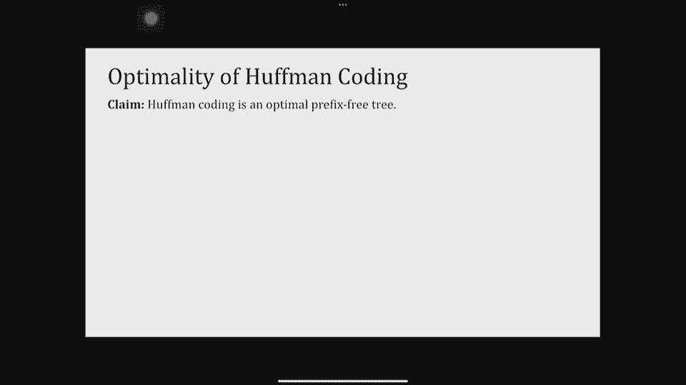
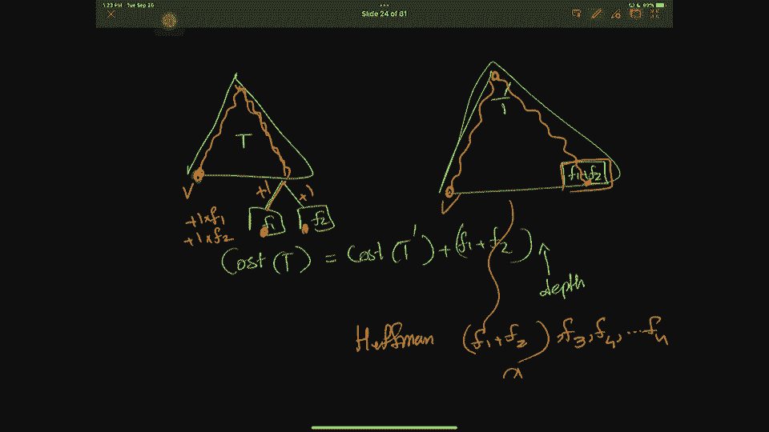
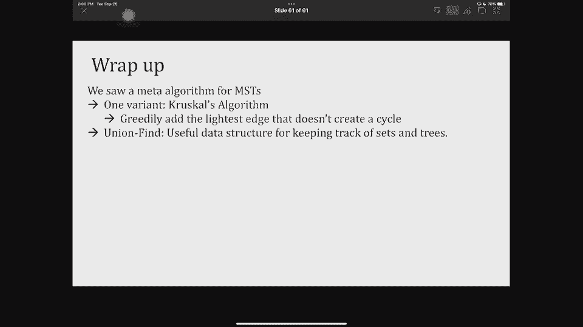

# 课程 P10：最小生成树 (Lec10) 🌳


在本节课中，我们将要学习**最小生成树**问题及其经典算法。我们将从回顾**霍夫曼编码**的贪心算法开始，然后深入探讨最小生成树的概念、性质以及**克鲁斯卡尔算法**。课程内容将涵盖算法的设计思路、正确性证明以及运行效率分析。

---

## 回顾：霍夫曼编码与贪心算法分析 🧠

上一课我们讨论了贪心算法，包括调度、喇叭满意度问题，并开始讨论最优编码。贪心算法通过逐步构建解决方案，每一步都做出看似最直接的选择，但分析其正确性往往更具挑战性。

我们通过**归纳法**来分析贪心算法。归纳假设是：贪心算法做出的前 `m` 个选择，与某个最优解的前 `m` 个选择相匹配。归纳步骤则需要利用问题的具体结构来证明，如果前 `m` 步匹配，那么第 `m+1` 步的贪心选择仍然可以导向一个最优解。

### 最优前缀码问题

问题的输入是 `n` 个符号及其频率 `f1, f2, ..., fn`。输出是一棵二叉树（即前缀码），目标是找到**成本最小**的树。树的成本定义为所有叶子节点的 `（深度 × 频率）` 之和。

**公式**：`Cost(T) = Σ (depth(leaf_i) * freq(leaf_i))`

我们首先观察了最优树的结构：
1.  最优树必须是一棵**满二叉树**（每个内部节点都有两个子节点）。
2.  存在一个最优树，其中**频率最低的两个符号是兄弟节点**。

基于以上观察，我们设计了**霍夫曼编码算法**。

以下是霍夫曼算法的伪代码描述：

```python
function Huffman(frequencies):
    # 为每个符号创建叶子节点
    priority_queue = MinPriorityQueue()
    for freq in frequencies:
        node = Node(freq)
        priority_queue.insert(node)

    # 当队列中不止一个节点时
    while priority_queue.size() > 1:
        # 取出频率最低的两个节点
        x = priority_queue.delete_min()
        y = priority_queue.delete_min()

        # 创建新节点z，其频率为x和y之和
        z = Node(freq = x.freq + y.freq)
        z.left = x
        z.right = y

        # 将新节点z插入优先队列
        priority_queue.insert(z)

    # 队列中剩下的节点就是树的根节点
    return priority_queue.delete_min()
```

算法使用优先队列（如二叉堆）来高效获取最小频率节点。初始插入 `n` 个节点耗时 `O(n log n)`，后续 `n-1` 次合并操作，每次涉及两次删除和一次插入，总时间复杂度为 `O(n log n)`。

我们通过归纳法证明了霍夫曼算法能产生最优前缀码。归纳基础是当只有两个符号时，算法显然最优。归纳步骤利用了“频率最低的两个符号在某个最优树中是兄弟”这一性质，将 `n` 个符号的问题规约到 `n-1` 个符号的问题，从而证明了正确性。

---

## 最小生成树问题 🌐

上一节我们介绍了用于数据压缩的霍夫曼编码。本节中我们来看看另一个经典的贪心算法应用——**最小生成树**。

### 问题定义

给定一个连通无向图 `G=(V, E)`，每条边 `e` 有一个非负的权重 `w(e)`。一棵**生成树**是连接图中所有顶点的一个无环子图。生成树的**成本**是其所有边权重之和。

**最小生成树**问题要求我们找到成本最小的生成树。

**公式**：`Cost(T) = Σ w(e) for e in T`

### 为什么关心最小生成树？

最小生成树有广泛的应用，例如：
*   设计通信网络（电话线、光纤），以最低成本连接所有站点。
*   规划交通网络，用最短的道路连接所有城市。
*   作为其他图算法的预处理步骤。

### 图论基础回顾

首先，我们明确几个关于树和生成树的事实：
*   一棵连接 `n` 个顶点的树恰好有 `n-1` 条边。
*   连接所有顶点的最小边集必然是一棵树（若有环，则可去掉环中一条边而保持连通，从而得到更优解）。

接下来，我们引入一个关键概念：**割**。



**定义**：图 `G=(V, E)` 的一个**割**是将顶点集 `V` 划分成两个非空子集 `S` 和 `V \ S`。
一条边**横跨**割 `(S, V\S)`，如果它的一个端点在 `S` 中，另一个端点在 `V\S` 中。

---



## 最小生成树的割性质 🔪

割性质是设计最小生成树贪心算法的核心。它描述了最小生成树中边与割的关系。

**割性质**：令 `X` 是某棵最小生成树 `T` 的边集的一个子集。考虑任意一个割 `(S, V\S)`，使得 `X` 中**没有**边横跨该割。令 `e` 是横跨该割的所有边中权重最小的边。那么，边集 `X ∪ {e}` 也包含于某棵最小生成树中。

**直观理解**：如果你已经找到了最小生成树的一部分边（`X`），并且找到了一个不切割这些边的割，那么这个割上“最轻”的那条边，一定可以安全地加入到你的解中，并最终扩展成完整的最小生成树。

**证明概要**：
1.  设 `T` 是包含 `X` 的一棵最小生成树。
2.  如果 `e` 已经在 `T` 中，结论显然成立。
3.  如果 `e` 不在 `T` 中，则将 `e` 加入 `T` 会形成一个环。这个环上必然存在另一条横跨割 `(S, V\S)` 的边 `e‘`（因为环必须从 `S` 的一侧穿到另一侧再穿回来）。
4.  由于 `e` 是该割上最轻的边，有 `w(e) ≤ w(e‘)`。
5.  从 `T` 中移除 `e‘` 并加入 `e`，得到一棵新树 `T‘`。`T‘` 仍然连通，且成本 `Cost(T‘) = Cost(T) - w(e‘) + w(e) ≤ Cost(T)`。
6.  因此 `T‘` 也是一棵最小生成树，且包含 `X ∪ {e}`。

这个性质催生了一个构建最小生成树的**元算法**：
1.  初始边集 `X` 为空。
2.  只要 `X` 还未构成生成树：
    *   找到一个割 `(S, V\S)`，使得 `X` 中没有边横跨该割。
    *   选择横跨该割的最轻边 `e`。
    *   将 `e` 加入 `X` (`X = X ∪ {e}`)。
3.  返回 `X`。

不同的最小生成树算法（如克鲁斯卡尔算法、普里姆算法）本质上是选择了不同的寻找“安全割”的策略。

---

## 克鲁斯卡尔算法 ⚙️

本节我们来看看如何具体实现上述元算法，这就是**克鲁斯卡尔算法**。

克鲁斯卡尔算法隐式地利用了割性质。它的策略非常直接：
1.  将所有边按权重从小到大排序。
2.  初始化边集 `X` 为空。
3.  按顺序检查每条边，如果将其加入 `X` **不会形成环**，则加入；否则跳过。
4.  当 `X` 中包含 `n-1` 条边时停止。

**为什么这符合元算法？**
当考虑边 `e = (u, v)` 时，如果 `u` 和 `v` 当前在 `X` 的不同连通分量中，那么我们可以构造一个割：令 `S` 为 `u` 所在的连通分量，`V\S` 为其他所有顶点。此时 `X` 中显然没有边横跨此割（否则 `u` 和 `v` 就在同一分量了），而 `e` 是横跨此割的边。由于我们按权重递增顺序检查，`e` 就是当前横跨此割的**最轻边**（因为更轻的边已被检查过，若不会成环则已加入，这意味着它们连接的是当时不同的分量，但不会影响当前 `u` 和 `v` 分属不同分量这一事实）。因此，加入 `e` 符合割性质。

### 算法效率与并查集

算法的瓶颈在于如何高效判断加入一条边是否会形成环，即判断两个顶点是否在同一个连通分量中。这可以通过**并查集**数据结构来实现。

并查集支持三种操作：
*   `MakeSet(v)`: 创建一个只包含元素 `v` 的集合。时间复杂度 `O(1)`。
*   `Find(v)`: 返回 `v` 所属集合的代表元。时间复杂度接近 `O(α(n))`，其中 `α` 是增长极慢的反阿克曼函数，可视为常数。
*   `Union(u, v)`: 合并 `u` 和 `v` 所属的集合。时间复杂度接近 `O(α(n))`。

利用并查集，克鲁斯卡尔算法可以高效实现：

```python
function Kruskal(Graph G):
    X = empty set
    # 为每个顶点创建独立的集合
    for each vertex v in G.V:
        MakeSet(v)

    # 将边按权重升序排序
    sort G.E by weight

    for each edge (u, v) in sorted_edges:
        if Find(u) != Find(v): # u和v不在同一集合/连通分量
            X = X ∪ {(u, v)}
            Union(u, v) # 合并两个集合
            if |X| == |V| - 1:
                break
    return X
```

**时间复杂度分析**：
*   排序所有边：`O(m log m)`，其中 `m` 是边数。由于 `m = O(n^2)`，`log m = O(log n)`，所以也可写为 `O(m log n)`。
*   `n` 次 `MakeSet` 操作：`O(n)`。
*   最多 `2m` 次 `Find` 操作：`O(m α(n))`，近似 `O(m)`。
*   最多 `n-1` 次 `Union` 操作：`O(n α(n))`，近似 `O(n)`。
*   总时间复杂度为 `O(m log n)`，主要由排序步骤决定。

---

## 总结 📚

本节课中我们一起学习了两个重要的贪心算法及其分析。

首先，我们完成了对**霍夫曼编码**的讨论，了解了如何通过合并频率最低的节点来构建最优前缀码，并证明了其正确性。

然后，我们重点学习了**最小生成树**问题。我们引入了**割**的概念，并证明了关键的**割性质**。该性质指出，对于不切割当前已选边集的任意一个割，横跨该割的最轻边可以安全加入当前解。基于此，我们介绍了一个构建最小生成树的元算法。

最后，我们详细探讨了**克鲁斯卡尔算法**，它是该元算法的一个具体实现。克鲁斯卡尔算法通过按权重排序所有边，并利用**并查集**来高效判断和合并连通分量，从而以 `O(m log n)` 的时间复杂度找到最小生成树。



理解割性质是掌握最小生成树各类算法的钥匙，而克鲁斯卡尔算法因其简单直观和高效，成为解决该问题的经典方法之一。