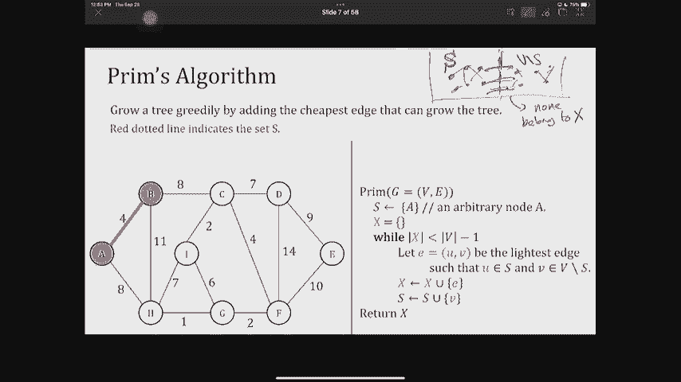
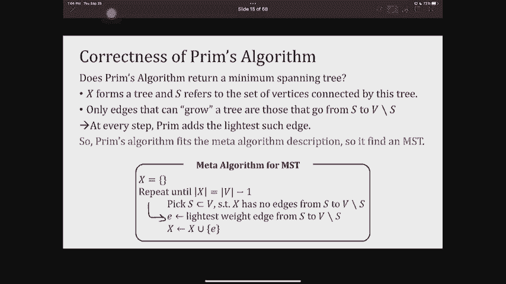
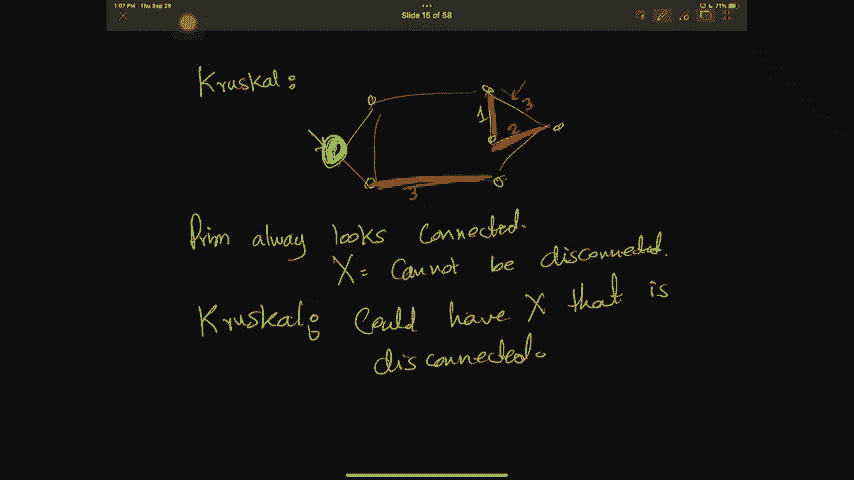
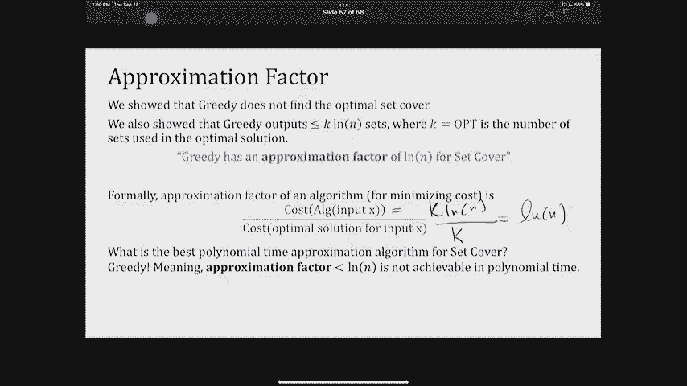

# 课程 P11：最小生成树与集合覆盖进阶 🧩


在本节课中，我们将深入学习最小生成树（MST）的另一种经典算法——Prim算法，并探讨一个经典的组合优化问题——集合覆盖问题。我们将看到贪婪策略如何应用于这两个问题，并分析其性能。

---

## 1. 回顾：最小生成树问题与切割性质 🌲

上一节我们介绍了最小生成树问题的定义以及一个基于“切割性质”的元算法框架。本节中，我们来看看如何利用这个框架实现一个具体的、高效的算法。

最小生成树问题的输入是一个带权无向图 `G=(V, E)`，其中每条边 `e` 有一个非负权重 `w(e)`。目标是找到一个边的子集 `T ⊆ E`，使得 `T` 连接所有顶点，并且其总权重 `Σ_{e∈T} w(e)` 最小。这样的子集必然构成一棵树。

我们之前证明了一个关键性质——**切割性质**：
> 对于图的任意一个切割 `(S, V\S)`，如果边集 `X` 是某个最小生成树的一部分，且 `X` 中没有边横跨该切割，那么横跨此切割的**权重最小**的边 `e`，一定可以安全地加入到 `X` 中，并仍然是某个最小生成树的一部分。




基于此性质，我们得到了一个构建最小生成树的元算法：
1.  初始化边集 `X` 为空。
2.  只要 `X` 尚未构成生成树：
    *   找到一个切割 `(S, V\S)`，使得 `X` 中没有边横跨它。
    *   选择横跨该切割的权重最小的边 `e`。
    *   将 `e` 加入 `X`。
3.  返回 `X`。

任何符合此模式的算法都能正确找到最小生成树。Kruskal 算法是此模式的一个实例。

---

## 2. Prim 算法：贪婪地“生长”一棵树 🌱

现在，我们来看元算法的另一个著名实例——Prim算法。其核心思想是：始终维持一个连通的子树，并贪婪地添加连接该子树与外部顶点的最便宜边，从而让树“生长”起来。

在Prim算法中，我们维护的集合 `S` 是当前已被树连接的顶点集合。初始时，`S` 包含任意一个起始顶点（例如 `a`）。每一步，我们寻找连接 `S` 与 `V\S` 的最轻边，将其加入树中，并将其在 `V\S` 中的端点加入 `S`。



以下是Prim算法的基础（较慢）伪代码描述：



```
Prim(G, w):
    从顶点集 V 中任选一个起始点 a
    S = {a}          // 已连通顶点集合
    X = {}           // 最小生成树的边集合
    while |X| < |V| - 1:
        找到边 e = (u, v)，其中 u ∈ S, v ∈ V\S，且 w(e) 最小
        将边 e 加入 X
        将顶点 v 加入 S
    return X
```

**算法正确性**：由于算法每一步都选择了一个切割 `(S, V\S)` 下的最轻边，完全符合前述元算法的模式，因此它总能找到一个最小生成树。

**与Kruskal算法的区别**：
*   **Kruskal**：按权重排序所有边，依次添加不构成环的边。过程中可能维护多个连通分量（森林）。
*   **Prim**：始终维护一个连通分量（树），每次添加连接该树与外部顶点的最轻边。

---

## 3. 高效实现 Prim 算法 ⚡

上述基础实现的效率较低，因为每轮都需要扫描所有边来寻找最小横跨边。我们可以借鉴 Dijkstra 最短路径算法的思想，使用优先队列进行高效实现。

我们需要为每个顶点 `v` 维护两个信息：
*   `dist[v]`：顶点 `v` 到当前树集 `S` 的“距离”，即连接 `v` 到 `S` 中某顶点的最小边权重。初始为无穷大 (`∞`)。
*   `prev[v]`：记录提供上述最小边的 `S` 中的那个顶点。

**算法步骤**：
1.  初始化所有 `dist[v] = ∞`, `prev[v] = None`。任选根节点 `r`，设置 `dist[r] = 0`。
2.  将所有顶点按其 `dist` 值插入最小优先队列 `Q`。
3.  `while Q 非空`:
    a.  `u = ExtractMin(Q)` // 取出 `dist` 最小的顶点
    b.  若 `u` 不是根节点，则将边 `(prev[u], u)` 加入生成树边集 `X`。
    c.  遍历 `u` 的每个邻居 `v`：
        *   若 `v` 仍在 `Q` 中 **且** `w(u, v) < dist[v]`：
            *   `dist[v] = w(u, v)`
            *   `prev[v] = u`
            *   `DecreaseKey(Q, v, dist[v])` // 更新 `v` 在优先队列中的优先级

**与 Dijkstra 的区别**：Dijkstra 算法中的 `dist` 是从源点到该点的**路径总长度**，更新规则是 `dist[u] + w(u, v) < dist[v]`。而 Prim 算法的 `dist` 仅代表连接到当前树集的**单条边**的最小权重，更新规则是 `w(u, v) < dist[v]`。

**时间复杂度**：取决于优先队列的实现。
*   使用二叉堆：`O((|V| + |E|) log |V|)`
*   使用更复杂的斐波那契堆：`O(|E| + |V| log |V|)`

对于边数非常多的稠密图，Prim 算法（尤其是斐波那契堆实现）通常比 Kruskal 算法更高效。

---

## 4. 集合覆盖问题与近似贪婪算法 📦

现在，我们转向一个不同的问题——集合覆盖。这是一个经典的 NP-Hard 问题，贪婪算法可以为其提供一个高效的近似解。

**问题定义**：
*   **输入**：一个全集 `U`（包含 `n` 个元素），以及一系列 `U` 的子集 `S1, S2, ..., Sm`。这些子集的并集等于 `U`。
*   **输出**：一个最小的子集索引集合 `C`，使得 `∪_{i∈C} Si = U`。即用最少的子集覆盖所有元素。

**贪婪算法策略**：
重复以下步骤，直到所有元素被覆盖：
> 选择那个能覆盖**最多尚未被覆盖元素**的子集 `Si`。

以下是一个简单的例子，说明贪婪策略并非总是最优：
*   全集 `U = {1,2,3,4,5,6,7}`
*   子集：`S1={1,2,3}, S2={4,5}, S3={6,7}, S4={1,2,3,4}`
*   **贪婪选择**：先选 `S4`（覆盖4个），然后需要再选 `S2` 和 `S3`，共 **3** 个子集。
*   **最优解**：选择 `S1, S2, S3`，共 **3** 个子集。（此例中贪婪达到最优，但可以构造更坏的例子）

可以构造反例，使得贪婪算法的解远差于最优解。然而，贪婪算法有一个可证明的、较好的**近似比**。

---

## 5. 贪婪算法近似比分析 📊

虽然贪婪算法不是最优的，但我们可以证明它的解不会“太差”。

**定理**：设最优解需要 `k` 个子集。那么贪婪算法找到的解，其大小不超过 `k * H(n) ≤ k * (ln n + 1)`，其中 `n = |U|`，`H(n)` 是第 `n` 个调和数，`ln` 是自然对数。

**证明思路（归纳法）**：
1.  设 `N_t` 为贪婪算法进行 `t` 步后，剩余未被覆盖的元素数量。`N_0 = n`。
2.  **关键引理**：在最优解使用的 `k` 个子集中，必然存在至少一个子集，能覆盖当前剩余未覆盖元素中至少 `N_t / k` 个。（根据鸽巢原理，平均每个最优子集覆盖 `N_t / k` 个，最大者至少覆盖这么多。）
3.  贪婪算法选择的是能覆盖**最多**未覆盖元素的子集，因此它每一步至少能覆盖 `N_t / k` 个新元素。
4.  由此可得递推式：`N_{t+1} ≤ N_t - N_t / k = N_t (1 - 1/k)`。
5.  递推展开：`N_t ≤ n * (1 - 1/k)^t`。
6.  利用不等式 `(1 - 1/k)^k < 1/e`，可以证明当 `t = k * ln n` 时，`N_t < 1`。这意味着在 `k * ln n` 步后，未覆盖元素数将少于1（即为0）。因此，贪婪算法选择的子集数不超过 `k * ln n`。

这个 `ln n` 的近似比是理论上可证明的、对任意输入实例都成立的**最坏情况**保证。在实际应用中，贪婪算法的表现通常比这个理论界要好。

---

## 总结 🎯

本节课中我们一起学习了：
1.  **Prim算法**：作为最小生成树元算法的另一个实例，它通过始终扩展一个连通子树来构建MST。我们探讨了其正确性、与Kruskal算法的区别，以及如何使用优先队列实现高效版本。
2.  **集合覆盖问题**：这是一个NP-Hard的组合优化问题。我们介绍了一个直观的贪婪算法：反复选择覆盖未覆盖元素最多的子集。
3.  **近似算法分析**：虽然贪婪算法不能保证找到集合覆盖的最优解，但我们证明了其解的大小最多是最优解的 `ln n` 倍。这为处理难解问题提供了一种有效的近似思路。



通过这两个例子，我们看到了贪婪策略在解决最优化问题时的强大与灵活，同时也了解了如何严谨地分析其性能界限。