# P12：Lec12 Dynamic Programming (Part I) - 东风渐起UCAS - BV1o64y177K8

好的，我们开始吧，我的第一学期怎么样，大众的看法是，除了很好，我什么也说不出来，让我们试着把另一个做得比期中考试好，我猜，谁考得好，如果不好的话，我就怪别人，这是一个集体的努力，但是，策划了这次考试。

以确保它是在考验你，和家庭作业很接近的事情，以及关于我们在课堂上看到的东西的讨论，嗯，不过没关系，你还没看到你的成绩呢，也许下周你会感觉好些，但如果你不确定来和我们谈谈，我们非常乐意，我帮你辨认。

也许就像你缺乏更多的基础，或者你需要改变，你在为期中考试而学习，或者只是有一些算法设计的范例，你需要多了解一点，所以不要坐在家里感到抱歉，如果成绩不是什么，你想来和我们谈谈，利用你可用的资源，好啦。

所以让我们从一些公告开始，我本来想说，耶，期中考试结束了，但你们似乎没有心情，也可能是刚做完，我们将在下周初评分，这样你就可以很快得到关于你做得有多好的反馈，关于这一点，还有一些其他的事情。

讨论六已经发布了，昨天谁参加了讨论，很高兴你们中的一些人做到了，如果你还没有去，请今天去或者明天一定去，或者一定要看视频，因为事实上今天我们是建立在你昨天看到的材料上的，你们中的一些人昨天看到了。

并建立在我们在过去讨论中看到的材料上，所以这里是我们开始连接点的地方，你在讨论中看到的一些事情，也许你当时认为他们是武断的或先进的，现在你会看到他们的疯狂是有方法的，作业六也发布。

我们知道你知道你把自己逼得太紧了，比如备考，所以这个作业比其他作业要小很多，我想就像三个问题，或许对我们来说，但这并不意味着你应该把它留到最后一刻，所以我们下周三如期发行，很不寻常。

我们通常星期一有东西要交，这意味着如果你想参加家庭作业派对或办公时间，我们没有，我们还没有改变那些，所以家庭作业聚会仍然是周五和周一，我们大部分的办公时间，你知道在本周末和周一。

我们通常有有限的办公时间，星期二没有家庭作业聚会，星期三，所以不要拖到最后一刻，恳求你去参加早些时候的家庭作业派对和办公时间，好啦，那么我们今天要做什么呢，如果我们真的要开始一个新的话题。

我们上次讲了很多贪婪算法，这一次我们将看到所谓的动态编程，我们将通过例子来了解它，你在讨论中看到的，尤其是斐波纳契数贝尔曼福特，我们在课堂上谈论它的方式，你在讨论中谈论这件事的方式，事实上。

甚至一些家庭作业问题，然后我们讨论什么是dp或者动态规划，然后我们今天会讲很多不同的例子，在接下来的两节课中，关于如何在动态编程范式中设计算法，所以让我们从一些事情开始，如果你去讨论，你应该已经看到了。

如果你还没有，我还是会更快地通过这个，因为它会在讨论中涉及到，所以你应该去讨论，所以我们将从如何不很好地计算斐波那契数开始，如果你回顾你所学的课程，这就是讨论的六种材料，你被告知你可以写一个代码。

像这样计算斐波纳契数的伪代码，对于n的每一个斐波那契，你只需递归调用两个斐波那契，以及n减去1和n减去2的斐波那契，任何参加过讨论或想告诉我这个代码有什么问题的人，或者不是超级优化，它以指数时间运行。

这里有什么问题，它实际上是一个相当慢的算法，如果你去讨论，你将要看到的是，你要计算这个斐波纳契数的运行时，就像你每次看到的，你将要得到的递归函数，等于t减去1加t减去2，然后讨论会告诉你如何降低这个。

并显示如果这真的是您拥有的运行时，您的运行时将是指数级的，至少T是n/2的次方，这太可怕了，这就像一个可怕的可怕的运行时，您不应该希望有这样的运行时，那么这里出了什么问题，有人能告诉我更多关于。

也许出了什么问题，是啊，是啊，似乎我们可能会计算，我们从零开始计算了很多次，让我们来看看，假设我将成为，嗯计算八的斐波那契，所以这里的每个节点都是一个递归调用，所以我叫八号谎和八号谎。

它本身会叫6的fib和7的fib，因为它想把它们，现在让我们看看其中一个分支，就像会发生什么而不是六个，嗯，六个中的两个会叫四个和五个，三四会叫二三吗，然后如果我看着这棵树，把它填满。

看起来有一大堆计算，在不同的分支中重复，我只是一遍又一遍地打电话给他们，我不会保存它们，也不会把它们存放在任何地方，但我一次又一次地打电话给他们，所以在某种意义上，如果我看这里。

希望你能从你坐的远处看到这些阴影，感觉这棵树在指数级增长，当然啦，但这是有规律的，我叫六号谎，几次，我数到五，几次四的谎言，三个谎言，为什么不把这个存起来，每当我计算5的fib时，把它放在桌子上。

不要再计算了，这就是动态编程背后的思想，或者修复斐波那契数背后的想法，以及如何计算它们，这个想法是，我们将记住我们在其他地方做过的计算，这叫做记忆，听起来像是记忆，但你可以把它看作是离开你自己。

未来备忘录，那么这看起来像什么，如果我考虑子问题，我有八个中的五个，七六四三，五个，废话废话，另一种思考他们的方式，如果我不想重新计算，让我把边放在这些边真正属于的地方，只用一个子问题，不要重复子问题。

从伪代码的角度来看，这是什么样子的，我要保持一个数组，这个数组将是我的备忘录，对我自己，对我未来的自己，每当某个子问题的计算发生时，就像五的Fib被计算出来，我要把这个值记到备忘录里，那看起来像什么。

让我们看看我们以前的伪代码，每次我调用时都是递归调用，现在我要做一个小小的改变，我会有这个全局数组备忘录，我会把零的斐波那契，以斐波纳契为基例，但其他一切我只是说它像没有，却空空如也。

现在我定义了一个名为Fib备忘录的函数，我叫它自上而下在几分钟内，就会明白为什么我们把它称为自上而下，你要做的第一件事就是看你的备忘录，如果你有一个关于n的fib值的备忘录，那就别计算了，把它写下来。

所以这是第一步，我查了一下，如果我有关于BU的备忘录，现在呢，如果我没有备忘录，那是我唯一一次真正递归，那么我如何递归，嗯，我对memo的fib做了另一个递归调用。

我确保这个备忘录正在写入我的备忘录数组，所以在某种意义上，我们要做的是确保，对这第五个备忘录的递归调用的次数永远不会超过，n的O，因为每次我递归，每次我到了这个点，递归调用被调用，我的备忘录里有些东西。

这就是修复斐波那契数计算的方法，对此有什么问题吗，又到目前为止，我们开得有点快，但你会在讨论中看到这一点，也是，这就是动态编程背后的思想，动态规划有不同的元素，让我们来谈谈是什么使动态编程。

这是以例子来证明或以例子来定义，嗯，关于动态规划的第一件事是，它适合于计算类型，有很多子问题的地方，好啦，有时这被称为最优子结构，但你可以把它看作是有很多子问题，例如斐波那契数，事实上。

我们可以打破更多的斐波那契，就较小数字的斐波那契而言，是我们正在讨论的解决问题，这里的想法是，我们总是可以写出大问题的解决方案，关于斐波那契这个小问题的解决方案，这正是我们讨论子问题的方式。

所以到目前为止，这些谎言中的每一个都是一个子问题，这可能看起来并不新鲜，我们一直在讨论子问题，对吧，我们说过分而治之什么是分而治之，如果不使用子问题，那么动态编程有什么新的呢，这使得它不同于。

分而治之就是这些子问题一般都有一个结构，有很多重叠的子问题，我是什么意思，我的意思是很多子问题在某种程度上是重叠的，那个，如果我可以保存或存储其中一个的值或计算，子问题，这个子问题将被大量使用。

在某个时候解决许多其他更大的问题，所以它们重叠的事实，这意味着我实际上可以节省大量的资源和计算，把一切都记起来，通过保存和存储在表或数组中，我研究过的每个子问题，那么什么是一个例子。

为什么斐波那契很好地证明了这一点，如果我看i加1和i加2的斐波那契，他们两个都在直接给i的波纳奇打电话，事实上是对的，这就是他们所说的子问题之间的重叠，更一般的是i加3的斐波那契，四五十亿。

间接调用i的斐波那契，所以这就是重叠使斐波那契问题成为一个非常合适的问题，用动态规划中的动态规划求解，这个想法是有一个解决方案表，或者这些较小的子问题的备忘录，并使用解决方案，然后解决更大的子问题。

为什么叫动态规划，给我几分钟，我会说的，那里有一点历史，有两种方法可以进行动态编程，叫自上而下，自下而上，自上而下，我给你们展示的斐波那契方法，所以自上而下的想法，动态编程是从最大的问题开始。

并递归地尝试向最小的子问题移动，这就是为什么它被称为自上而下，因为我们认为顶部是最重的，嗯，我们试图解决的最重要的问题，然后我们递归，这意味着它本质上看起来就像一个递归算法，好啦，唯一特别的是。

在递归过程中保存在一个步骤中，中间值此备忘录，好啦，所以我有一个全局数组，备忘录，你需要它，您需要该数组是全局的，其实呢，如果你在做递归，然后，每当您递归调用时，您要确保数组被填满。

嗯所以这又是顶部向下，我有一个全局数组，看起来我在做递归，但是我保存了递归的值，这叫做自上而下，另一种方法是自下而上，所以往相反的方向走，意思是你还在背，嗯，但这次你直接把桌子填满。

从最简单的问题到最难的问题，好啦，通常没有递归，因为不是递归地从上到下，你只是从底部开始填满，制造更大的问题，从较小的问题中，那么自下而上的斐波那契，看起来实际上不再需要数组是全局的了。

因为没有递归调用，嗯，我会做的是，我仍然有一个备忘录，我仍然从0和1开始我的基本情况，但我从最简单的问题开始，两个中的下一个斐波那契，我说我已经能计算了，因为我们想要0，1在我的备忘录里，然后我上去。

好啦，所以这是自下而上的方法，两个都有效，你可以做你最喜欢的，我可以告诉你我最喜欢的是自下而上，因为几个不同的原因，我发现递归是不必要的，即使你自上而下调用递归算法，备忘录实际上以。

桌子最后从下往上填满了，因为你得把这堆东西的底部，在你开始知道如何计算之前，我喜欢自下而上的另一个原因，众所周知递归算法有更多的问题，处理内存，通常，因此，当您实现自下而上的方法时，它们通常会更快。

但如果你喜欢自上而下，你可以自上而下，它看起来像这个全局表的递归，你存放东西的地方，问题本质上不像是一个必要的，P喜欢，例如，对于此变量，他们不喜欢这张桌子，这仍然被认为是一个DP，所以这里的问题是。

如果我知道我在一天结束时，只要一个n do的谎言，我需要存储所有这些值，或者我可以把最后两个，好啦，你当然可以把最后两个排序，有办法节省这个空间，更好，如果你在做动态编程，我不打算详述它们的细节。

也许我会突出另一个地方，你可以说，你可以喜欢，存储最后几个值或最后几个数组，它仍然被称为记忆，即使你在重写一些东西，它们都是相同的运行时吗，是呀，通常事实上，我的意思是，如果你做对了，事实上。

他们每个人都像你一样，对于每一个自上而下，有一种自下而上的方法，每从下往上，有一种自上而下的方法，所以如果你，如果真正的数学运行时不同，因为你犯了一个错误，实际考虑不一样，动态编程的特别之处。

计算的顺序实际上看起来很多，就像一个有向无环图，如果你没记错的话，所以一个没有循环的图，一种思考的方式是，我可以把每个子问题看作是这个元图中的一个节点，那么这个金属图是什么呢，我装不下8个斐波那契。

所以我从六个波尼开始，这一次想想六的斐波那契，哦，5应该比4，5，4，3，2，1，0高，让我纠正一下，这是五号，这是四号，好吧嗯，把这看作是我必须解决的子问题的代表，现在我要把边放在这个图中。

这些是有向边，我把一条边从i到j，如果子问题j大于某个问题，在j直接为自己的目的使用i的计算的意义上，那么这看起来像什么，例如，例如，二的斐波那契直接使用一和零的斐波那契，所以我把有向的边，像这样。

三的斐波那契直接使用二和一的斐波那契，它间接地使用了零，但我不在乎，我只想写直接的边，所以我把这些直接的边缘等等，所以有一个有向无环图，原因是非循环的，因为有一个大问题的概念，那是我的同步节点。

你知道我的拓扑排序的结尾，那是最后要解决的问题，然后有一个源问题的概念，这些都是基本情况，这有助于我们思考动态规划的计算顺序，在某种程度上与拓扑排序相同，我们真正想说的是如果我考虑这个隐式图。

这代表了我解决问题之间的关系，我认为它是拓扑排序的，这都是隐含的，它在我的脑海里，又不是没给过我，它在我的脑海里，那么我能做的就是自下而上，告诉我直接从水槽开始解决，源到汇，按拓扑排序顺序一个接一个。

事实上，自上而下，即使它从顶部开始递归，仍然充满了，自下而上的值，所以思考一下，当您在动态编程范式中思考一个问题时，这些节点是什么，这些边是什么，那么计算的顺序是什么呢，我们会举一些例子。

到目前为止我们看到了什么，这只是对动态编程的一个非常简短的介绍，我们看到算法设计的一个范例是，它的重要因素是它们是，还有子问题，这些子问题是重叠的，我们可以做自下而上或自上而下，现在有一个问题。

关于什么是见鬼的动态编程，什么这么有活力，我个人可以告诉你，当我几十年前听到这个词时，我不会透露我的年龄很久以前，我以为，哎呦，你知道的，我有这棵树，而不是在树枝间跳来跳去。

我用一种非常动态的方式保存这个，我也是这么想的，如果你想把它看作是动态程序的灵感，你可以用它，不是它被命名的原因，所以说，他实际上把动态编程命名为well，理查德·贝尔曼，非常著名的科学家。

贝尔曼福特的同一个行李员也用过这个词，当时你需要知道的是他在兰德公司工作，作为智库，在当时基本上是美国的一个分支，S，政府，主要为空军工作，它的预算在很大程度上由国会控制。

他说动态编程本质上是一个很酷的名字，他想给它起一个，因为即使是国会议员也不会反对，那么为什么它被称为动态规划呢？听起来很酷，这就是为什么它被称为动态规划，从这个词的发明者嘴里说出来，好的，好的，关于。

嗯，高级别概述，接下来我们要做的是看一些例子，好啦，到目前为止，一个要点是，如果你想获得资金，你需要很酷的名字，现在依然如此，好啦，所以我说，行李员，是贝尔曼福特的同一个行李员，其实呢。

下节课你们将看到的，是建立在最短路径问题上的一系列问题，如果你还记得贝尔曼福特是最短路径问题，它指示了一分钟，对不起，然后当你有负边的时候，但不是负循环，这恰好是动态规划的一个例子。

我们给出了一个非常简短的证据来证明它为什么有效，你知道在讲座结束后的5-10分钟，我们今天要更深入地研究这个问题，你已经在这次讨论中看到了，我们会看到很多其他的动态规划的例子。

所以让我们从DAG上的最短路径开始，好啦，这是与贝尔曼福特非常相似的问题，但在某种意义上，我们被赋予了一个图表，边缘可以是正的，也可以是负的，没有负循环，其实根本没有循环，这是一个达格。

所以这是一个非常简单的最短路径的例子，我想计算的是，因为我给出了一个来源，我想知道你的每一个顶点，最短路径的距离是多少？从S到你，好啦，关于这个问题有什么问题吗？让我告诉你，已经出现在伪装和家庭作业。

四问三材料，这是一些，它是作为一个，你想送一些小雕像，独角兽，玻璃和盒子，是啊，是啊，好啦，是啊，是啊，问题就在这里，所以你实际上已经这么做了，但我们要再去看看，所以我们能做的就是。

我们可以在这里经营贝尔曼福特，它没有任何负循环，我当然可以经营贝尔曼福特，但是贝尔曼福特，如果你记得有一个非常糟糕的运行时间，它的运行时是，边数乘以，顶点数，那不是我们想要花的，我们想做得更好，事实上。

我想用n加m来做，而不是n乘以m，有一点要记住的是，任何有向无环图都有拓扑排序，你是如何计算拓扑排序的，我们是DFS，正因为如此，它只需要n加m，好的，好的，那么这对我们有什么帮助呢，它帮助我们说。

如果我的目标是n加m，我不妨一开始就做一个拓扑排序，把我给的图线性化，这样我就知道这个图中顶点的顺序，现在我想用动态规划来解决这个问题，动态规划的第一个要素是我有子问题。

那么让我们来看看这些子问题是什么，所以这里的子问题是，其实呢，每个节点一个，所以这很自然，你知道我只想知道从S到任何U的距离，所以我们把这个子问题叫做，那是计算从s到u的距离，子问题。

他们有一个非常自然的秩序，因为我已经对它们进行了拓扑排序，所以现在我有点知道，计算s到自身的距离是我遇到的最简单的问题，然后计算从s到c的距离可能是下一个，计算s到a的距离是b和b之后的距离，就是那个。

所以这些是我解决的问题，已经有些秩序了，事实上，我说的是每一个动态编程，想出一些含蓄的DAG，隐含的DAG，这是明确的DAG，我真的画了好吧酷，现在让我们看看如何解决这个问题。

接下来我要做的就是思考如何，这些子问题相互关联，他们之间有一些重叠，他们之间有些关系，本质上看起来像一个递归关系，那么这里看起来像什么，如果我本质上想建立递推关系，我必须回答以下问题。

如果我找到了其中一些节点的最短路径，尤其是早期的节点，如何计算到后面注释的最短路径，例如，让我们假设我已经计算出了最短路径，从s到s，从s到c，所以这总是零，这是长度为2的路径。

我可以把我的问题看作是一个解决了的和未解决的，好吧，我想好好想想这个最简单的问题，在未解决的那个，如何计算罐头的距离，谁来告诉我从s到a的距离，根据之前我在绿色中计算的东西，你能告诉我怎么算吗？好啦。

还有谁想告诉我更多关于这件事的情况吗，也是，啊，好啦，好呀，所以两者都是正确的，一个是更程序性的，另一个更多的是数字，所以这个想法是，如果我想知道怎么去，我得看看，如何到达它所有的邻居，所以我可以先说。

我怎么能看到，然后再加四个，所以它是c加4的距离的最小值，这四个就像c的长度，或者我想知道我是怎么到S的，所以s的距离，加上我从S到A在一个单一的，这就变成了一个，那么我写下的节点的顺序是什么。

是最短的吗，的长度，最短路径，或者别的什么，拓扑排序右，这里的拓扑排序，就像你不能在c c来之前带a，它实际上不是关于负边，好啦，是呀，我不跑额外的，我本可以让戴克斯特拉，那倒是真的。

Dijkstra会花更多的时间，反正我也在努力不付那日志钱，但我现在用的是完全不同的算法，首先进行拓扑排序的算法，然后按照拓扑排序的顺序，好啦，所以更一般地说，正如鲁贾所说，对于尚未计算的任何节点。

你可以把它们的距离写成一系列东西中的最小值，对于每一个进入的边缘，你把进入边缘的长度，再加上邻居的距离，其中最小的将是，正确的计算方法，这就是递推关系，现在我们要做的第三件事是在动态编程中计算出。

如何记忆这种递推关系，所以在这种情况下，它实际上很简单，我要记住的方式，它是把所有的子问题放入一个数组中，这个数组是什么，我有一个长度为n的磁盘数组，我将把一切都设置为无限，除了s到s的距离。

因为从S到S总是零，然后我要做的是，我将按照拓扑排序的顺序来查看我的顶点，我再也不用走回头路了，因为每次我碰到顶点，五，它所有的入射边都已经计算过了，v i的距离已经计算过了，我从最简单的子问题开始。

我只是做这个更新，然后当我做完，我只是返回整个数组，或者如果我想知道一个非常特定的节点，我返回那个位置，现在这个简单算法的运行时是什么，我必须做一个拓扑排序，去掉m加n，然后让我们看看子问题的数量。

我在这个数组中有一个子问题对点，所以它是N个子问题，然后如果我看这四个循环中的每一个，当我看顶点u的时候，我在看它所有的边缘，这就是每个节点的u度，当我处理完所有的顶点时，就好像我做的计算次数加起来。

所有这些N度，这就是边数，所以加在一起会告诉我这个算法的运行时是m+，你还记得我们在做的时候有一个SP吗，BFS、戴克斯特劳和贝尔曼福特，好啦，所以有两种方法来回答这个问题。

一种方法是说你的图是否有唯一的拓扑排序，你在考试的人身上看到了这个，如果它有唯一的拓扑排序，那就得从源头开始，反正，如果没有，您可能仍然无法跳过它，因为这很重要，沿着这条路走下去，就像看。

让我们来看看斐波那契，这不是唯一的，这不是唯一的权利，零和一，我可以做一个，然后是零，它不会改变我的拓扑排序，但因为它确实有向外的边缘，我还得计算一下，更快的方法来解决这个问题，好啦。

所以我们研究了如何在它们上进行最短路径计算，在我们结束之前，我想让你从我们的所作所为中吸取更大的教训，因为我们实际上遵循了一个非常具体的食谱，但这个配方是它有三个步骤和任何动态编程，当你想设计它的时候。

你应该遵循这三个步骤，有时就像一个额外的步骤，但现在只有三个，第一步是识别子问题，我们看了我们想计算的东西，我们决定子问题是什么，这些是DA中的节点，第二步是不要陷入动态编程，然而。

只要尝试用递归来解决这个问题，在定义一个递归关系的意义上，你所解决的问题，第三步是尝试设计动态编程，那是什么意思呢？意思是取递推关系，不要只做自上而下的复发，也许你想做自下而上。

你要做的就是设计一个数组，一张桌子，某种储藏室，再从最小的问题解决到最大的问题，这是我们要遵循的食谱，现在我们将沿着这个寻找更短的路径，讲座其余部分的问题，但在那之前你有三分钟的休息时间。

当我们回来的时候，我们会看到更多，所以是一十九，一二二见，如果你能关闭礼堂，我将不胜感激，好啦，我们回来吧，伙计们。

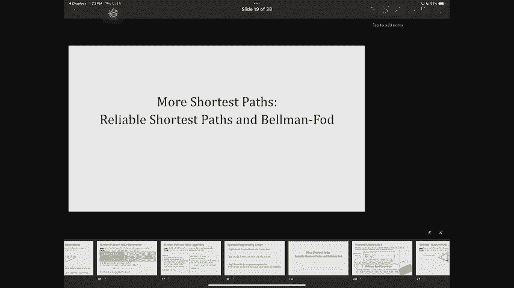

好啦，所以我们将要看到的下一个问题是另一个版本的最短路径，你实际上把它看作是两个中的两个两个不同的名字，第一课在第八课，我们讨论过贝尔曼·福特解决单一来源，最短的路径是SSSP，嗯负重，但没有负循环。

这是我们给你的算法，我知道你们很多人都很纠结，感觉很神奇，我们要看看为什么它不神奇，你在讨论中已经看到了，事实上，嗯，我们在讨论5和讨论5中看到了一个关于最短路径的相关问题，有一个问题，物业行李员。

你必须计算的一件事是，你被赋予一个值，你想求最短路径的代价，从s到每个顶点，但是您不希望路径使用超过k条边，所以如果你不参加讨论，回去再看一遍材料，我所说的是你们已经讨论过的东西。

这两个问题都是变相的动态规划，我们和他们两个一起工作的原因是因为贝尔曼·福特，这里k等于n减去一，因为没有图表，任何最短路径都不应该有超过n减去一条边，如果没有负循环，现在呢，版本。

我给你的第二个版本叫可靠，最短路径，那么这个问题是什么呢，这是给你一个图表的问题，消息来源，成本可能是负的，也可能是正的，只要没有负循环，和一个参数k，你被告知有一个输出，对于每个顶点u。

您要计算从s到u的最短路径的距离，但在最多只使用k条边的路径中，它之所以被称为可靠的原因是，如果你的边缘，可能会失败，也许这些是路，你知道的，道路可能会因为一些建设而关闭，你要取的边越多。

这条路失败的风险就越高，所以这就是为什么这个问题在书中也被称为可靠的最短路径，好啦，所以我们想解决这个问题，这和最短路径有什么不同，嗯，这是。

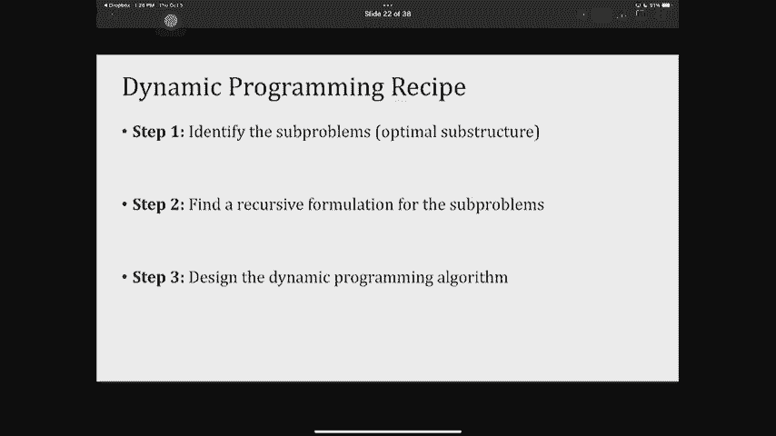

对不起，发生了什么事。

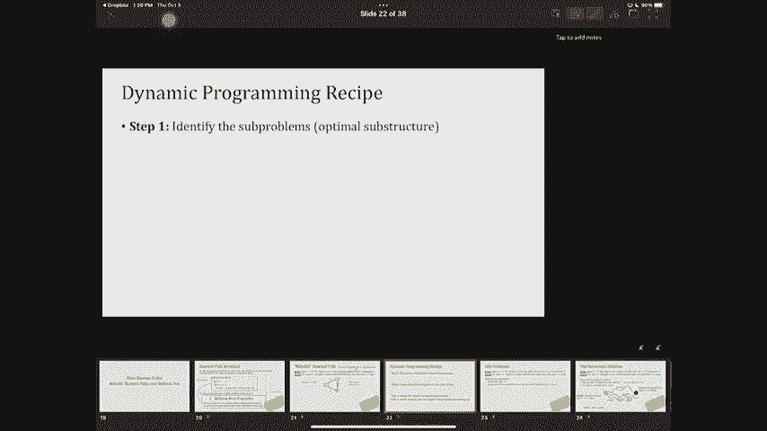

好啦，所以这是从s到a的最短路径，只使用一条边，所以如果k等于1，用s 2 a的距离来解应该是3，但是如果我允许自己用k等于2或者只是，你知道的，K等于，一条路径的最短s是使用两条边。

但它的长度或成本会更短，也会太，好啦，这就是它与最短路径的区别，现在呢，我们怎么解决这个问题，我们将研究动态编程的配方，第一步，第二步，第三步，我们从第一步开始，我们想确定子问题。

所以这里对子问题的任何建议，我想计算s到a的距离，给定k作为边数最多应为k，这个问题有没有更简单的版本是解决问题，好呀，你实际上是在给我递归关系，你这么做，那是那是，是的完美，所以不只是你叫我解决问题。

但你告诉我递归，所以让我一个一个去，先给，你有子问题，你得到了，你叫什么名字？梅恩，好啦，那么思想问题是什么呢，这里的建议是，我将为你们所有人谈谈I U的距离，我想我所做的，从1到K，这些是我的子问题。

其实呢，我从零开始，为什么我关心较小的子问题，所以我看着我比K好，这里的想法是你建造更长的路径或更多的边缘，出边数较小的路径，所以让我们跟踪使用较少边的子问题，所以我们真正想说的是。

每个子问题都在跟踪最短su路径的代价，使用小于i的边数，你还告诉了我一些复发的关系，所以让我表达一下建议，这里的递归关系，假设我计算了每个节点s到u的距离，你和对于边数，我那是零一二二对一些。

我现在可以计算i加1的距离了，回想一下这东西试图计算什么，这是…的成本，是最多使用i加一条边的最短路径吗，所以这里的建议是从其他路径上建造路径，那么我该怎么做呢，假设我有一个几乎像漫画一样的图表。

它有一堆边缘，作为B A U和我想知道S和你的距离，我最多加一条边，有很多不同的选择我可以采取，我应该拿最少的，所以第一个选择是第一种情况，当最短路径实际上指的是这个，这里最短的路径，不会有i加一条边。

它只是有i边，也许这已经是最优的了，我找到的路，为什么我需要强迫自己变得更大，所以如果本质上是这样，但是，我在上一个子问题中从S到U，因为我本身就是一个我应该考虑的解决方案，所以说，至少。

我应该取一些最小值，其中一个案子，到目前为止还有什么问题吗，我的左手边总是比我刚才写的小，这清楚吗，如果我允许自己使用更多的边缘，问题应该变得均匀，就像最短的路径应该变得更短一样，就成本而言不再，好啦。

你有一个问题，我想说的是，为什么是，这个东西总是比你的这个小，我要说的是，如果我允许自己在我最便宜的道路上多使用一个优势，我只是让自己更容易找到一条捷径，所以最短路径的成本总是会降低。

当我允许自己使用更多的边缘，是说也许我真的需要用i加一条边，所以如果我必须用i加一条边，然后我还可以做的一件事是查看其他节点，到目前为止，我已经在我的边缘，或者最多i边，然后看看我是否从节点a到节点u。

我在最短路径的成本上又增加了多少，好啦，所以这是一个i加一条边的有效路径，另一个有效的路径是通过B，然后看看我从B到B再到你需要多少时间，所以我在这里建议的是，我会再看看你所有的边缘。

我会说我在我的边缘内穿越了多少距离才能到达那里，再加上这条边的长度，从邻居到你，这就是我声称解决这个问题的递归关系，让我们花几秒钟来确定我们理解这一点，我们对此没意见，这看起来很像戴克斯特拉。

那倒是真的，正是这样本质上，我把这个放在最低限度的原因是我在这里遇到的所有这些情况，我基本上是在列举创建i加一的所有可能的方法，嗯，最多i加一条边的路径，这是一条最短的路径，然后我取最小的，为什么什么。

为什么我需要案例一，呃，我需要第一个案子。

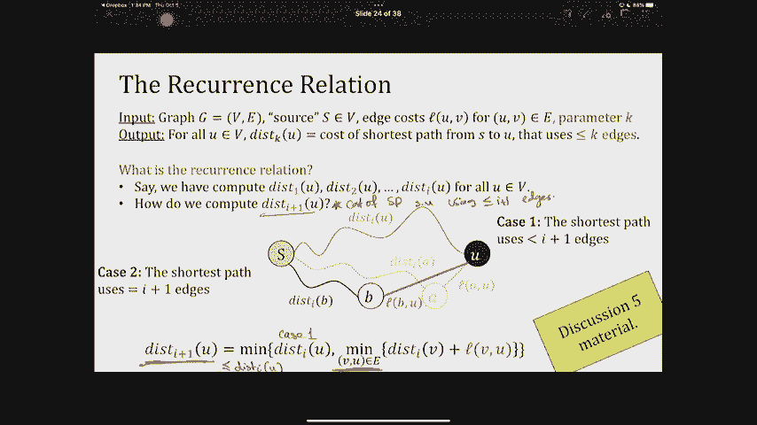

因为有时候，你能做的最好的事情就是在这里写呈现给你的东西，例如，从某种意义上说，因为我不认为需要一个，因为我没有产生幻觉，从每个节点到自身都存在一个权重为零的边，例如，假设我到了一个不远的地方，好啦。

所以这其中的一个就像一个，对不起，我换个颜色，我知道这对你来说不太好，就像，假设现在我在寻找一个，刚好这里还有一个，如果我不认为这是一个中的一个，这是一个，只考虑b加1，这东西会是两个。

就好像我在强迫自己穿过这里，不一定让我们，让我们，让我们回到我们在这里所拥有的。

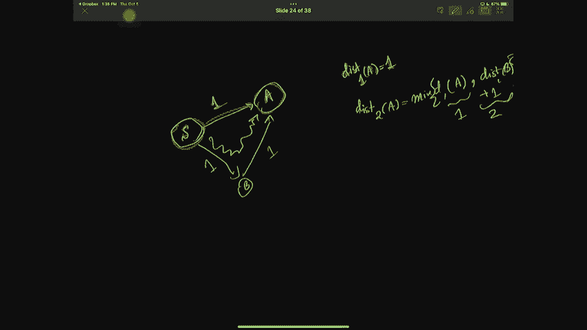

所以这两个都是为了少一条边，所以这应该是，喜欢好，让我们看看这里，所以我在这里定义磁盘是很重要的，最多使用k条边，不完全是k边。

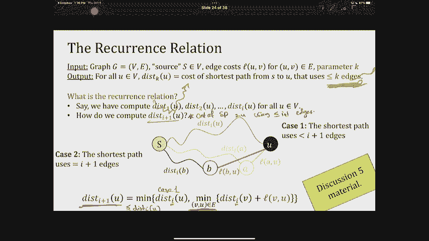

现在呢，让我们回到这里，其实呢。

我想如果我加一个。

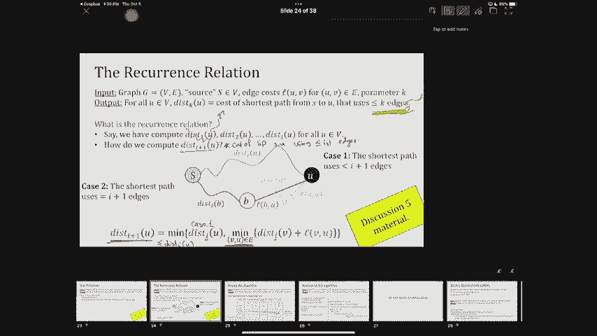

我们到这里来，所以这是我画的，所以你是在问，我为什么要写这个，好啦，你同意你在问，我为什么要写这个，好啦，所以我这么说是因为有时我们已经发现了更便宜的东西，所以我现在已经发现了其中一个存在的值距离。

如果我想计算a的两个的距离，如果我不把这个包括在内，如果我不把这个包括在内，把它写成b的距离加l，我在强迫自己经历B，而较短的路径已经存在，这就是为什么基本情况在那里，另一种说法是你包括了案例一。

这是因为你本质上是在说存在一个权重为零的边，从应有尽有到应有尽有，一切都是自己的，但这是最便宜的方法。

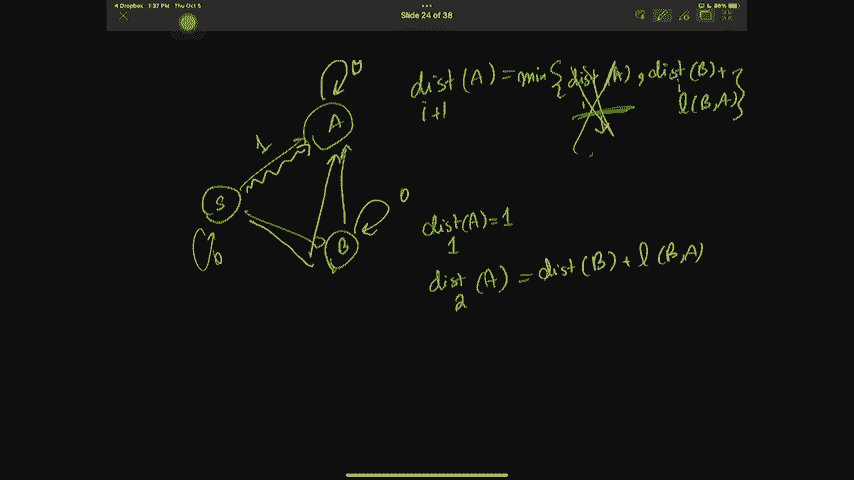

好啦，所以关于这次复发的其他问题，现在酷了，做动态编程的第三步是什么，所以第一步找到解决问题的方法，第二步发现复发，第三步，把它像记忆一样写在表格里，那么我们如何，我们如何记住这种递归关系。

我们刚刚在上一页写的，嗯，这次我要一张桌子，因为，考虑这个表的方法是，行是长度，就使用的边数而言，所以1，0，1，2，3到n或2，k，列对你来说是节点s a b，我试图找到喜欢，把这张表填好。

那我怎么填呢，我从第一排开始，我会把一个零，因为从节点S到节点本身，我不用穿越任何东西就能到达，所以那是零，然后我把其他的东西都放在无限上，这是我一直以来使用的最短路径的诀窍，然后我开始填满这张桌子。

当我填写它的时候，它看起来怎么样，假设这就是你，哎呀哎呀，这就是我的，加上你中的一个，所以我通过给你看传入的边缘来填写它，把他们的价值观，所以说，其实呢，如果我想知道这些是有向边，如果不清楚。

所以这些是邻居，进入的边缘，这些是边缘集合中的V，这也告诉你元图的DAG，它代表了我的动态编程，其实呢，思考这一点的方法是，这是最简单的节点，这是最小的，然后每一行都只取决于它之前的角色。

以及它所依赖的方式的数量，所有这些边本质上都是由我的顶点的传入边表示的，U，所以这就是我会记住的，我会开始填满这张桌子，像这样，我把这个装满，然后我把这个装满，以此类推，等等，你已经在考虑，包含从。

让我们说，直接对你，所以有向边，你在重复关于基本情况的问题吗？你在重复的是，所以我很困惑，为什么在迭代时还没有包括它，因为这仍然是一个即将到来的优势，我是说，根据定义。

因为我们不认为每个节点都有来自自身的传入边，所以嗯，让我看看这里东西太多了，我擦一下，尤其抱歉，这里有点乱，好啦，因为我不，这就是我所说的，我们没有自我循环，因为我没有长度为零的子循环。

我必须把基本情况放在本质上，然后这些，指的是这个，好啦，所以让我把这个算法写成一个实际的算法，所以我们可以分析它，但也请注意，我已经证明了为什么贝尔曼福特是工作的顺便说一句。

因为这张桌子的最后一排是贝尔曼福特，你试图用最多n减去一条边计算最短路径，好啦，那么这个算法是什么，这个运行时是什么，我叫它可靠，Ssp，请记住，福特是这款车的一个版本，我从许多数组开始。

因为我有一个表数组，这个零这个到这个k，它们的长度都是n，它们都被设置为无穷大，除了这个东西，s的零被设置为零，那是我的第一排，然后对于i从1到k，所以这些都是我的专栏，一个接一个，对不起。

我的排是一个接一个，我要填写每一行，我怎么填，我把每个顶点，我看着那个顶点的边缘，我计算这个递归公式，然后我就这么做了，这是表格的算法，我画了最后一张幻灯片，好啦，现在它的运行时间是什么。

这实际上比以前的案件更微妙一点，所以让我们注意这里，首先让我们看看，当我遍历每一行时，我在做什么，所以在每一行中，我一个顶点接一个顶点，我看着它进来的边缘，就像我们在DAG里做的那样，因为我一直在观察。

然后我把所有进来的边，我得到的总数是m是边数，总体情况，它基本上是穿过我布景中的每一条边缘，每行仅限一次，我有K行，所以填表的计算量是k乘以m，这是以k次重复的部分，现在呢，子问题的数量是多少。

我创建的子问题的数量是k乘以n，那是我的桌子，所以我不得不花那么多时间，因为我正在填写这张表格，就像我在分配空间，所以总的来说是kn加km，现在呢，刚才有个问题，我真的需要拯救这一切，否。

您可以返回并删除前面的行，只保留最后一行，这将把它改进为n，但这没什么大不了的，因为你不必节省那么多空间，所以这是可靠的最短路径，我们看到这是一个动态编程，我们按照三个步骤识别子问题，第二步是写递归。

第三步是根据反复出现的情况记忆，有问题吗？你的意思是，我应该抱歉，你是说事实上我说，你不需要节省空间，否，我还得计算一下，K，你是说，我不用计算，K倍，因为如果你看这里，我至少带了一堆东西。

这个最小值一直在变化，所以这就是循环的地方，这个嵌套的for循环，是公里的来源，是呀，空间复杂性，但我写的方式是，你仍然在分配这个空间，原来你是，这就是为什么我在运行时计算这个。

我还在写这张桌子的每一个单元格，因为我至少摸过每个细胞一次，我在数，这是复发，我把i的距离写成i减去1的距离，这正是复发的地方，我是贝尔曼福特，其实呢，如果我把k设为n减1，这是字面上的贝尔曼福特。

呃取决于你想要什么，如果我要你回来，嗯一个4K，你返回刚刚k的距离，原因是，是啊，是啊，所以您不需要返回所有中间内容，好啦，酷，所以我今天想讲的最后一件事，如果我们不完全覆盖它，没关系的，我们继续吧。

下节课是另一种形式的最短路径问题，它被称为所有最短路径问题，这和单一来源的区别，最短路径问题是，我想知道任意两对节点之间的最短路径，不是从一个非常特殊的源节点到其他一切，这是动态规划的另一个例子。

那么让我们写出实际的问题是什么，我想解决，我又得到了一个输入，这是一张图表，有些成本不一定是正的，但没有一个循环是负的，我想输出的是，对于任何一对顶点，我想知道这张UV光盘。

这是u和v之间最短路径的代价，我可以运行一个简单的算法，事实上，我可以给贝尔曼·福特打很多次电话，从贝尔曼福特是单一来源，我可以从每个节点调用它，但请记住，贝尔曼福特本身是关闭n倍m，如果我这样做N次。

我在看n的平方乘以m的运行时，它可以大到n到4，当我的图是稠密的，好吧，我不想付那么多，我的目标是一个算法运行，从n到3，我将向你展示如何使用动态编程的原理来得到这个，让我们来看看动态编程的三个步骤。

第一步是确定子问题，通常我会给你一些机会告诉我一个问题，我现在也想这么做，但不要灰心丧气，如果你不能弄清楚这里的子问题是什么，有点奇怪伙计们，我知道我要求计算，u和v之间的最短路径。

但不是非常特定的长度或数量的边，我想要通过一些顶点的最短路径，特别是前k个顶点，只是，这是子问题，我给你任何直觉，呃，灵感，至于为什么，也许这是一个很好的解题，你想和我分享，好呀，所以这就是。

这是一个非常详细的回答，其实呢，它告诉我即使是复发关系，但让我告诉你，它的摘要是，总结是，如果我跟踪其内部边缘的路径，内部顶点通过一个集合，现在让我们假设我想把这个集合扩展一点，本质上。

我找到的最短路径可以分成两条最短路径，他们两个都经过片场，但在不同的地方停了下来，让我们看看这是什么样子，但原因是这些是我们正在研究的子问题，首先注意，子问题n是真正的所有路径，我想解决的所有最短路径。

一种方法是，这是一个图表的漫画，我还没有把所有的边都画完，假设这是k意义的子问题，意思是我在找u到v的最短路径，所有的内部顶点最多要经过1，2，3，2，k，除了这一套之外，什么都没有，现在呢。

我想知道的是，所以这是一个子问题，下一步是什么是递归，递归公式，告诉我从子问题k到子问题k，加一个，这意味着我如何展开这个集合，到k加1，好吧，现在我该如何从已经找到的最短路径。

它的内部顶点只是集合1到k到集合1，二k加一，嗯，又有两个病例，第一种情况是当最短的紫外线路径，完全不经过节点k加1，也许我很幸运，我不必用节点k加1，因为我不用k加1，最短路径的距离。

从u到v只用一个，To k将保持不变，好啦，所以这是一个简单的案例，我扩展了我的布景，我考虑了通过k加1的路径，但我的最短路径就是不想用，这很清楚为什么案例一我们有k加1的dist，紫外是K紫外的分布。

现在情况很简单，下一个案子是什么，下一个案例是我真正想通过的案例，K加1有一个问题，好啦，对不起，假设最短的紫外线路径，红集确实经过k加一，好像是这样的，我从你开始，我做了一些步骤得到k加1。

然后我再做一些k加1的步骤，我注意到我已经划分了我的道路，到两条路的最短路径，已经，紫色和橙色的小路，紫色路径是最短的u到k加一条路径，这条路径上的所有内部顶点仍在通过，只有蓝色组一二K。

橙色的小路是我路径的第二部分，我最短的路，从1到v，所以所有k加1到v的路径，它的内部顶点只穿过蓝色集合，所以节点，内部节点只是一个二k，这意味着我可能在想最短的路径，从u到v穿过红色集合，作为最小值。

所有这些其他的道歉方式，不是作为一个最低限度，就像两条最短路径之和，从u到k加1，然后从k加1到v，这是递归公式，我给出了关于这个递归公式的任何问题，这里边数不重要，因为子问题k不是边数，它是。

它被定义为，通过特定的集合，子问题是找到最短路径，其内部顶点只使用节点1-2-k，不是长度的问题，这和我们之前的问题略有不同，所以我做了两个案子，那两种情况是什么呢第一种情况我从不经过k加1节点。

所以我的优势，我的距离，红色溶液的距离与蓝色溶液的距离相同，经过k加1，所以我最终得到了蓝色集合中的两个解决方案中的一些，如果我再把它们放在一起，我可以有案件一或案件二，我应该取他们两个中最小的一个。

所以递归公式是两者中的最小值，第一个例子就是我把这K的紫外线，因为我没有用k加1节点，第二个我要把你带到K，加1加k加1和v，它们都有参数k，关于这个递归公式有什么问题吗，是啊，是啊，所以让我们。

也许我们应该，我们应该回去。

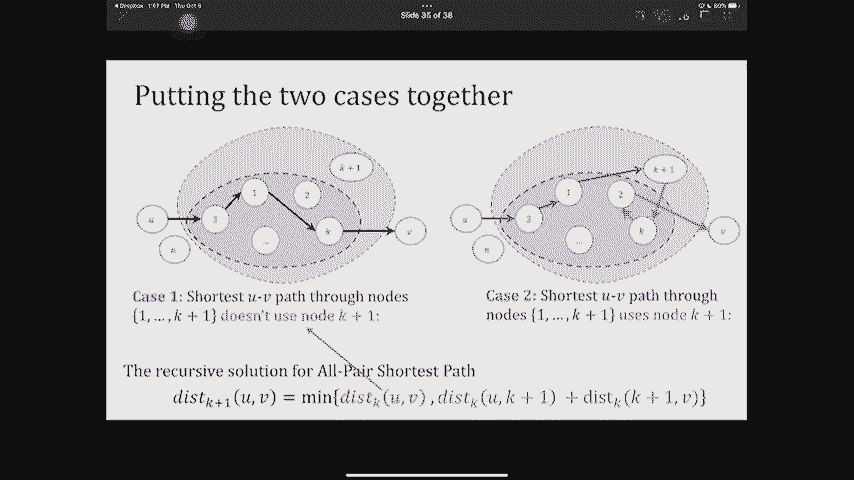

因为我们只讨论内部边缘，让我们看看子问题的表述，在这里我们定义子问题，我在哪里写的。

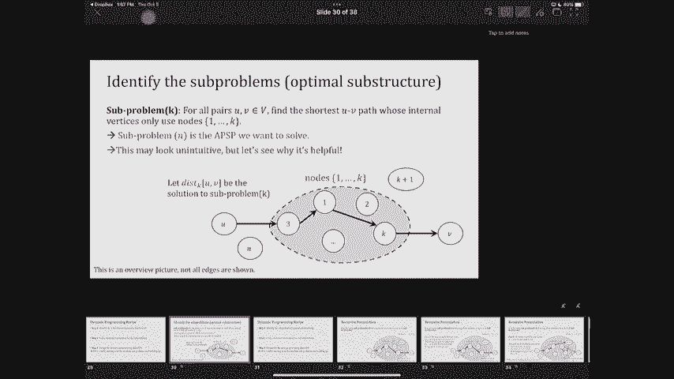

是呀，这里，子问题k是关于u和v，顶点只使用一二k，所以u和v实际上不需要在集合中，内部路径必须穿过蓝色的集合，只有当我现在前进的时候。

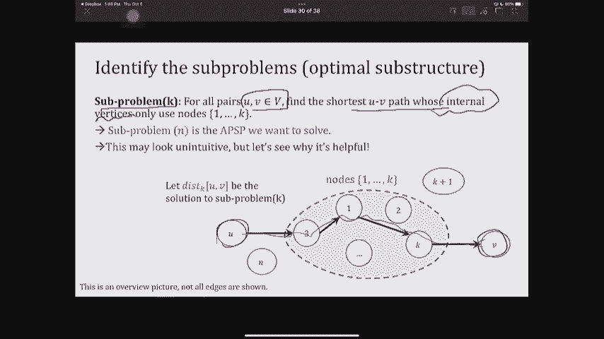

我注意到所有这些解决方案。

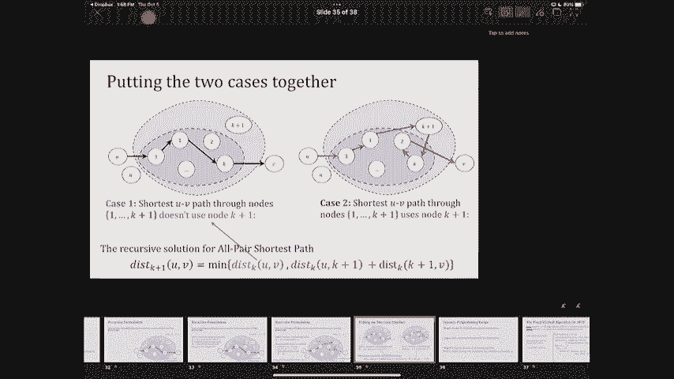

U和k加上1和v，他们不在较小的一组是可以的，只是内部节点必须在蓝色集合中，好啦，其他问题，哎呦，那就更容易了，如果我这样走，然后进入这里和这里，然后我得到的是，U，K，加一个。

因为没有内边而通过集合K，从技术上讲，这是一条只穿过蓝色集合的路径，好啦，我们还有几分钟，让我给你看看这个算法是什么样子的，因为我想我们可以结束这一切，这叫做弗洛伊德马歇尔算法，它从一个n乘n的表开始。

因为它省去了所有的子问题，零到n的距离，一切初始化为零，除了每一个边缘紫外线，你把UV的圆盘看作是零，就像把UV的圆盘看作是零一样，因为那是一条没有内缘的路，所以它的内边属于集合零，好啦。

然后从1到n的k，你拿任意一对这样的uv，你要做的就是写出我特别写的递归关系，这是紫外线的K，把它写成k减去uv的最小值，那是第一个案子，然后K二，也就是这个k减去一个u到k，然后k为，这就是递归关系。

然后这个算法运行得很快，因为每一次更新，每一个都只差一个，因为有两件事情我必须看一下并采取最低限度，我在循环这个，这是n，这是n的平方，所以总共n次，这就是为什么弗洛伊德·马歇尔的运行时，好的，好的。

今天的课就到这里，我们所看到的和我想让你带走的，不要忘记。

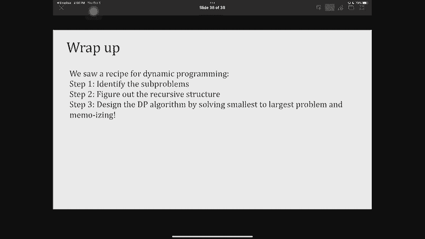