# 课程 P12：动态规划 (第一部分) 🚀


在本节课中，我们将学习一种强大的算法设计范式——动态规划。我们将通过具体的例子，理解其核心思想、设计步骤以及如何应用它来解决复杂问题。

---

## 概述

动态规划适用于解决那些可以分解为许多**重叠子问题**的复杂问题。其核心思想是**记忆化**——存储已解决的子问题的答案，避免重复计算，从而显著提升效率。本节课我们将通过斐波那契数列、DAG最短路径、可靠最短路径和所有点对最短路径等经典问题，来掌握动态规划的设计方法。

---

## 1. 从斐波那契数列认识动态规划

我们从一个简单的问题开始：计算第 `n` 个斐波那契数。最直观的递归方法效率很低。

### 1.1 低效的递归方法
以下是计算斐波那契数的朴素递归伪代码：
```python
def fib(n):
    if n <= 1:
        return n
    return fib(n-1) + fib(n-2)
```
这个方法的问题是存在大量重复计算，其运行时间是指数级的 `O(2^n)`。

### 1.2 引入记忆化（Memoization）
为了避免重复计算，我们可以使用一个数组（备忘录）来存储已经计算过的结果。这被称为**记忆化**，是动态规划的一种实现方式（自顶向下）。

以下是改进后的伪代码：
```python
memo = [None] * (n+1)  # 全局备忘录数组

def fib_memo(n):
    if memo[n] is not None:  # 如果已经计算过，直接返回
        return memo[n]
    if n <= 1:
        result = n
    else:
        result = fib_memo(n-1) + fib_memo(n-2)
    memo[n] = result  # 将结果存入备忘录
    return result
```
这种方法将运行时间降低到了 `O(n)`。

### 1.3 自底向上方法
另一种实现动态规划的方式是**自底向上**。我们从最小的子问题开始，逐步构建出大问题的解。

以下是自底向上的伪代码：
```python
def fib_bottom_up(n):
    if n <= 1:
        return n
    memo = [0] * (n+1)
    memo[0] = 0
    memo[1] = 1
    for i in range(2, n+1):
        memo[i] = memo[i-1] + memo[i-2]
    return memo[n]
```
自底向上方法通常更高效，因为它避免了递归调用的开销。

**过渡**：上一节我们通过斐波那契数列了解了动态规划的基本思想。接下来，我们来看看如何将这种思想应用到图算法中。

---

## 2. DAG上的最短路径问题

给定一个有向无环图（DAG），边权可正可负（无负环），以及一个源点 `s`，我们希望计算从 `s` 到图中每个其他顶点 `u` 的最短路径距离。

### 2.1 动态规划三步法
解决任何动态规划问题，我们都可以遵循以下三个步骤：
1.  **识别子问题**：确定需要解决的较小问题。
2.  **建立递推关系**：找出子问题与大问题之间的关系式。
3.  **实现与记忆化**：设计数据结构（通常是表格）来存储子问题的解，并按顺序填充。

### 2.2 应用于DAG最短路径
以下是解决DAG最短路径问题的动态规划方法：

1.  **子问题**：定义 `dist[u]` 为从源点 `s` 到顶点 `u` 的最短路径距离。
2.  **递推关系**：对于DAG，我们可以先进行拓扑排序，得到一个顶点线性序列 `v1, v2, ..., vn`（其中 `v1 = s`）。那么，到某个顶点 `u` 的最短距离可以通过其所有**前驱节点** `p` 来计算：
    `dist[u] = min(dist[p] + weight(p, u))`，其中 `p` 是 `u` 的所有入边邻居。对于源点 `s`，`dist[s] = 0`。
3.  **实现**：按照拓扑排序的顺序遍历顶点，利用上述递推关系更新 `dist` 数组。

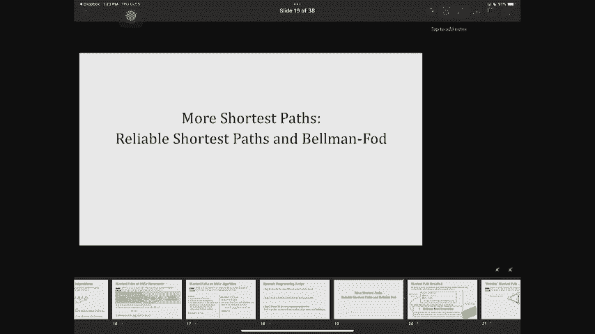

算法伪代码如下：
```python
def shortest_path_dag(graph, source):
    topo_order = topological_sort(graph)  # 获取拓扑排序
    dist = [inf] * n
    dist[source] = 0

    for u in topo_order:
        for v, weight in graph.neighbors(u):
            if dist[v] > dist[u] + weight:
                dist[v] = dist[u] + weight
    return dist
```
该算法的时间复杂度为 `O(V + E)`，其中 `V` 是顶点数，`E` 是边数。

**过渡**：我们学会了在无环图上高效计算最短路径。现在，考虑一个更一般的情况：图中允许有环，但我们对路径增加了一个新的约束——边数限制。

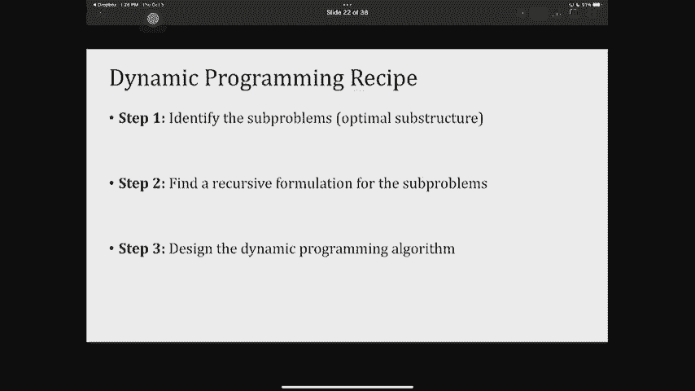

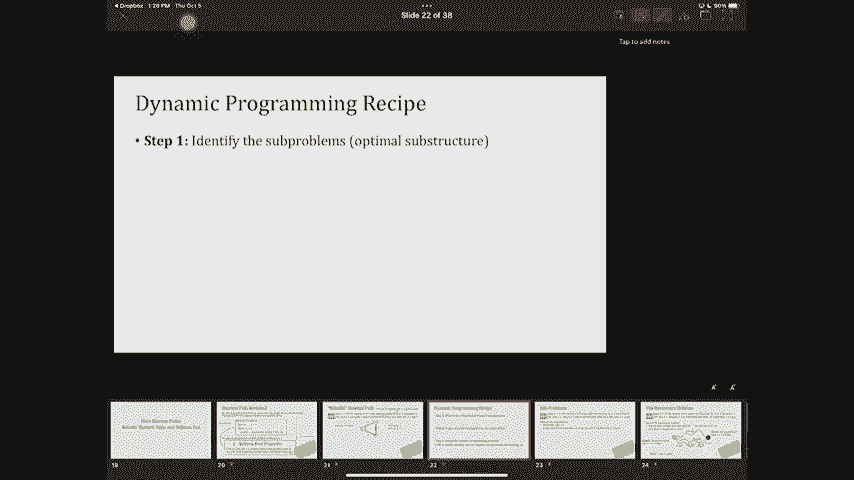

---

## 3. 可靠最短路径问题

给定一个图（边权可正可负，无负环）、一个源点 `s` 和一个参数 `k`，我们希望计算从 `s` 到每个顶点 `u` 的、**最多使用 `k` 条边**的最短路径距离。这个问题也称为“边数受限最短路径”。

### 3.1 应用动态规划三步法

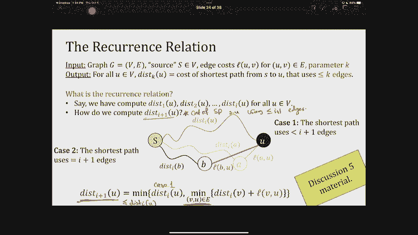

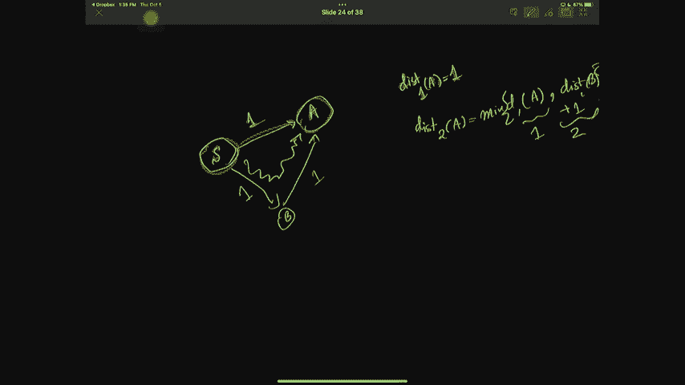

1.  **子问题**：定义 `dist[i][u]` 为从 `s` 到 `u`、最多使用 `i` 条边的最短路径距离。
2.  **递推关系**：如何利用 `i-1` 条边的结果来求 `i` 条边的结果？有两种可能：
    *   最短路径就用了 `i-1` 条边或更少：`dist[i][u] = dist[i-1][u]`。
    *   最短路径恰好用了 `i` 条边：那么它必然由一条 `i-1` 条边到某个邻居 `v` 的路径，再加上边 `(v, u)` 构成。因此：
        `dist[i][u] = min( dist[i-1][v] + weight(v, u) )`，其中 `v` 是 `u` 的入边邻居。
    综合两者，递推式为：
    `dist[i][u] = min( dist[i-1][u], min_{v->u}(dist[i-1][v] + weight(v, u)) )`
3.  **实现**：我们用一个二维表格 `dist[0..k][1..n]` 来存储结果。初始化 `dist[0][s] = 0`，其他为无穷大。然后按 `i` 从 1 到 `k` 的顺序填充表格。

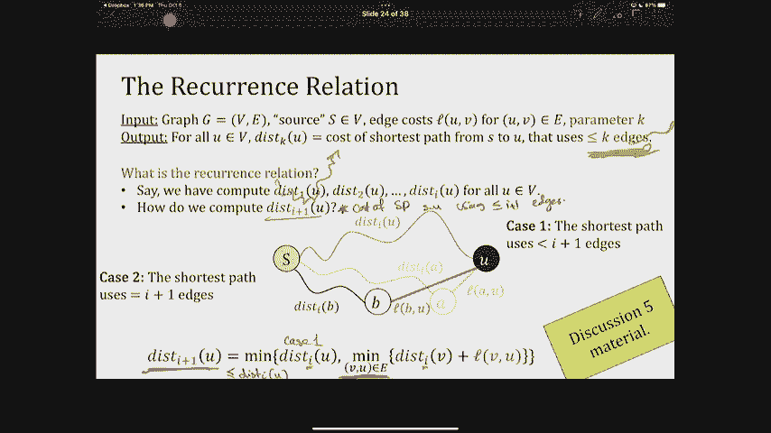


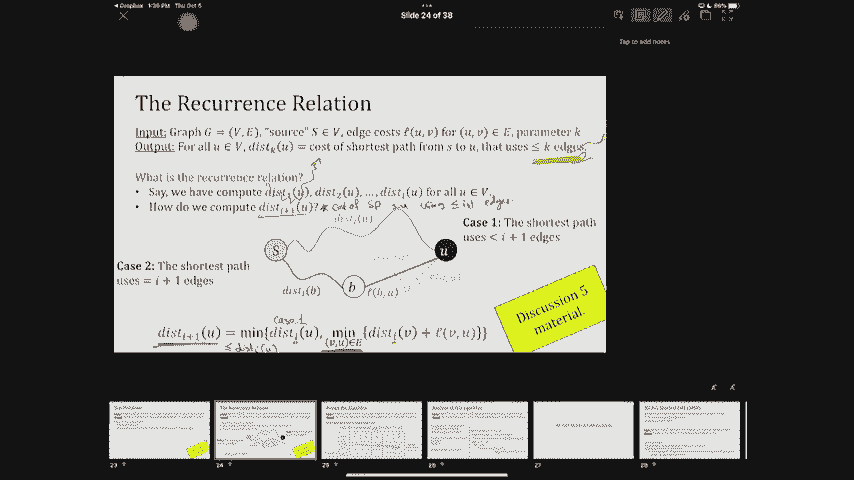

算法伪代码如下：
```python
def reliable_shortest_path(graph, source, k):
    n = number_of_vertices(graph)
    dist = [[inf] * n for _ in range(k+1)]
    dist[0][source] = 0

    for i in range(1, k+1):
        # 首先，可能的最优解是不使用第i条边
        dist[i] = dist[i-1].copy()
        for u in range(n):
            for v, weight in graph.incoming_edges(u): # 遍历u的所有入边(v, u)
                if dist[i][u] > dist[i-1][v] + weight:
                    dist[i][u] = dist[i-1][v] + weight
    return dist[k]
```
该算法的时间复杂度为 `O(k * E)`，空间复杂度为 `O(k * n)`。实际上，我们可以优化空间，只保留当前行和上一行，将空间降至 `O(n)`。

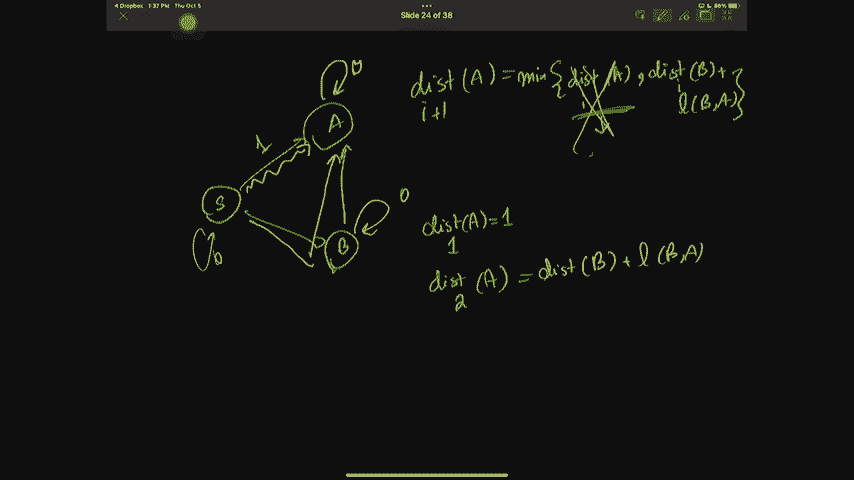

**有趣的事实**：当 `k = V-1`（V为顶点数）时，这个算法就变成了著名的 **Bellman-Ford** 最短路径算法。因此，Bellman-Ford 本质上是动态规划的一个应用。

**过渡**：我们解决了单源点、边数受限的最短路径问题。动态规划的威力远不止于此，它甚至可以高效地解决所有顶点对之间的最短路径问题。

---

## 4. 所有点对最短路径问题（Floyd-Warshall算法）

给定一个图（边权可正可负，无负环），我们希望计算**任意两个顶点 `u` 和 `v` 之间**的最短路径距离。

### 4.1 动态规划思路
一个朴素的想法是对每个顶点运行一次 Bellman-Ford 算法，但这样时间复杂度高达 `O(V^2 * E)`。Floyd-Warshall 算法提供了一个更优雅的动态规划解决方案。

1.  **子问题**：定义 `dist[k][u][v]` 为从 `u` 到 `v` 的、所有**内部顶点**（即路径上除起点和终点外的顶点）编号均不超过 `k` 的最短路径距离。
    *   “内部顶点编号不超过 `k`” 意味着路径只能使用顶点 `1, 2, ..., k` 作为中转站。
2.  **递推关系**：考虑如何从 `dist[k-1]` 推导出 `dist[k]`。对于从 `u` 到 `v` 的路径，顶点 `k` 有两种可能：
    *   **情况一**：最短路径不经过顶点 `k`。那么 `dist[k][u][v] = dist[k-1][u][v]`。
    *   **情况二**：最短路径经过顶点 `k`。那么这条路径可以分解为：从 `u` 到 `k` 的最短路径（内部顶点不超过 `k-1`），加上从 `k` 到 `v` 的最短路径（内部顶点不超过 `k-1`）。即 `dist[k][u][v] = dist[k-1][u][k] + dist[k-1][k][v]`。
    我们需要取两者中的最小值：
    `dist[k][u][v] = min( dist[k-1][u][v], dist[k-1][u][k] + dist[k-1][k][v] )`
3.  **实现**：我们可以使用一个三维数组，但可以优化空间，只用二维数组 `dist[u][v]` 进行滚动更新。初始化 `dist[u][v]` 为边 `(u,v)` 的权重（若无边则为无穷大，`dist[u][u]=0`）。然后，将顶点 `1` 到 `n` 依次作为可能的中转站 `k` 进行更新。

Floyd-Warshall 算法伪代码如下：
```python
def floyd_warshall(graph):
    n = number_of_vertices(graph)
    dist = [[inf] * n for _ in range(n)]

    # 初始化：直接相连的边
    for u in range(n):
        dist[u][u] = 0
        for v, weight in graph.neighbors(u):
            dist[u][v] = weight

    # 动态规划核心
    for k in range(n): # 考虑将顶点k作为中转站
        for u in range(n):
            for v in range(n):
                if dist[u][v] > dist[u][k] + dist[k][v]:
                    dist[u][v] = dist[u][k] + dist[k][v]
    return dist
```
该算法的时间复杂度为 `O(V^3)`，空间复杂度为 `O(V^2)`。对于稠密图来说，这比运行 `V` 次单源最短路径算法要高效。

---

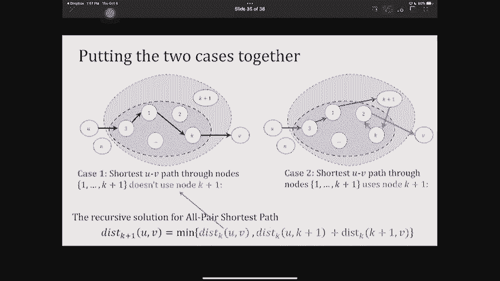

## 总结 🎯

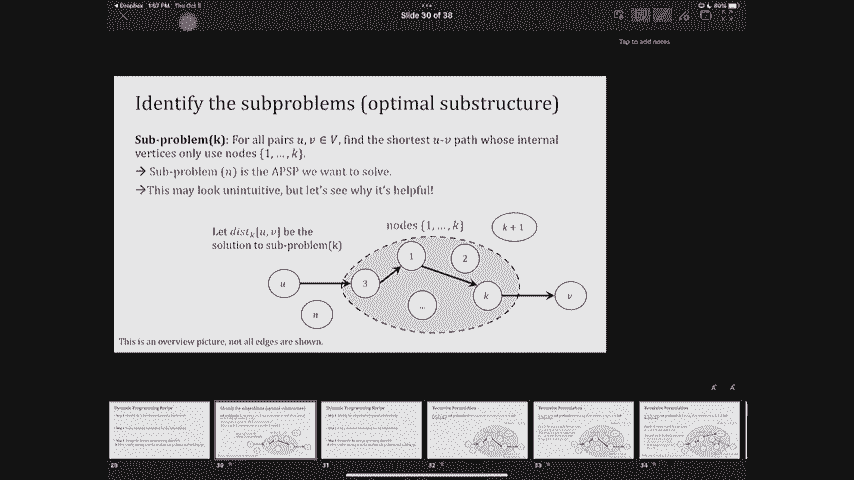

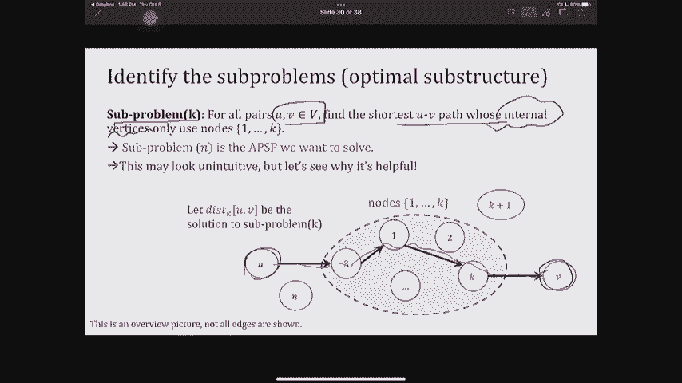

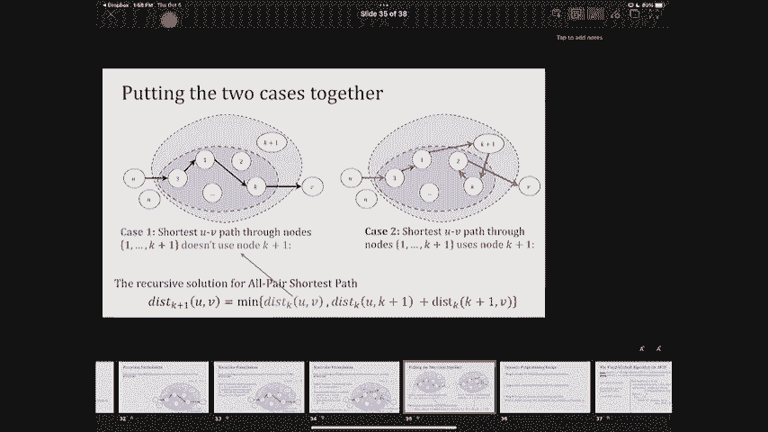

本节课我们一起学习了动态规划的核心思想与应用：
1.  **核心思想**：通过**记忆化**存储重叠子问题的解，避免重复计算，用空间换时间。
2.  **设计步骤**：遵循“识别子问题 -> 建立递推关系 -> 实现与记忆化”的三步法。
3.  **应用实例**：
    *   **斐波那契数列**：展示了自顶向下（记忆化搜索）和自底向上两种实现。
    *   **DAG最短路径**：利用拓扑排序的自然顺序进行动态规划。
    *   **可靠最短路径**：引入“边数”维度，其特例即 Bellman-Ford 算法。
    *   **所有点对最短路径**：Floyd-Warshall 算法通过逐步增加允许的中转顶点来解决问题。

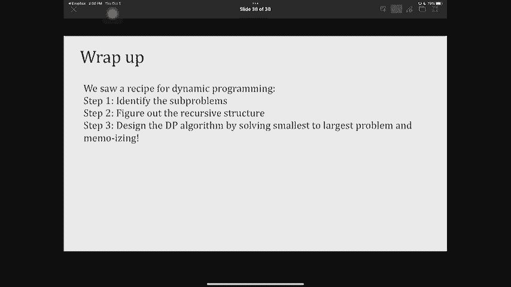

动态规划是一种非常强大的工具，理解其本质并熟练运用三步法，是解决许多复杂算法问题的关键。下节课我们将继续探索更多动态规划的经典问题。