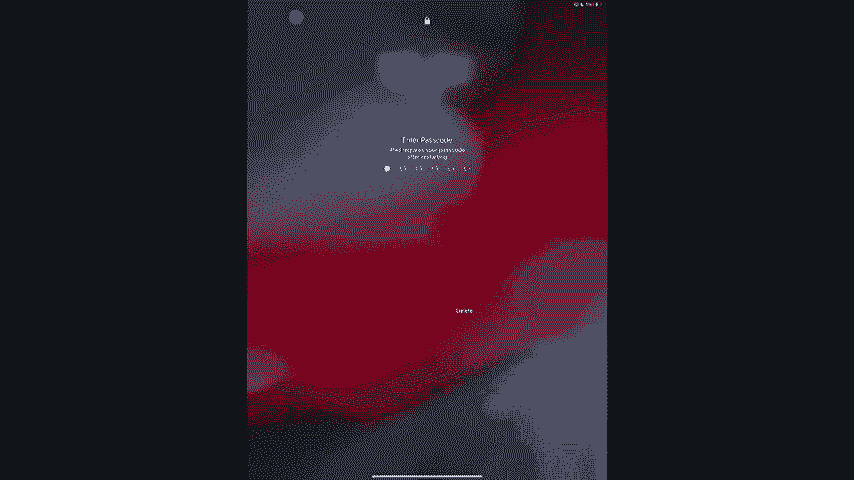
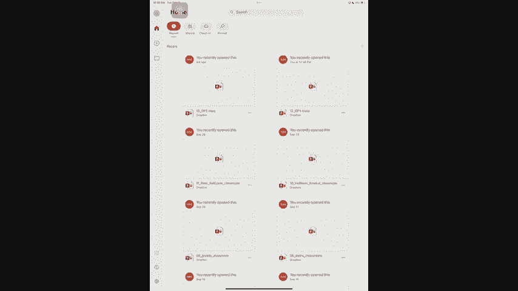
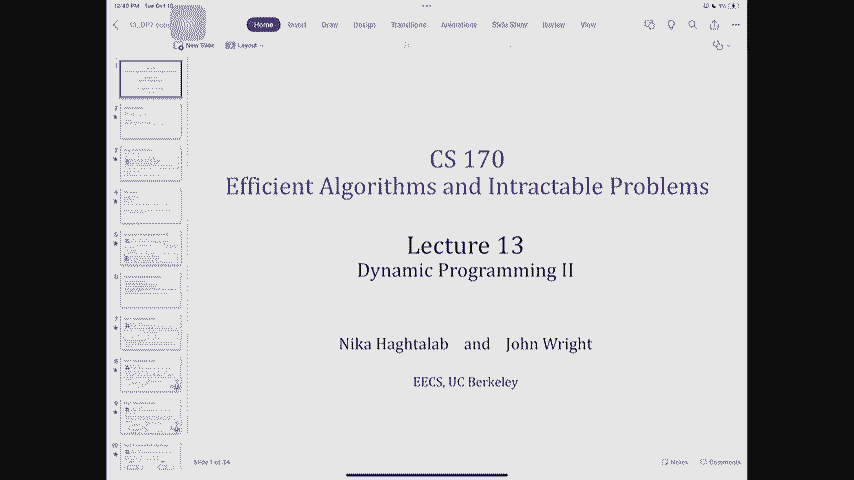
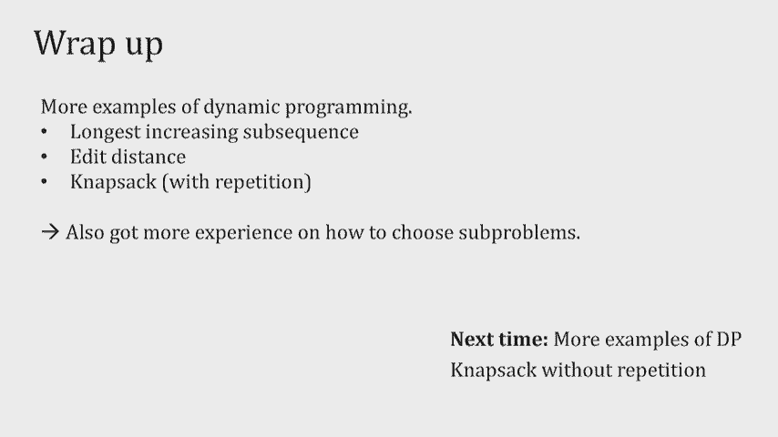

# 课程 P13：动态规划 (第二部分) 🚀

在本节课中，我们将继续学习动态规划，并通过三个经典问题——最长递增子序列、编辑距离和背包问题（有重复）——来深入实践动态规划的“三步法”解题思路。我们将重点关注如何设计子问题、建立递推关系以及实现记忆化。

---

## 概述 📋

上一节我们介绍了动态规划的基本概念和解题“食谱”。本节中，我们将运用这个“食谱”来解决三个不同类型的问题。通过分析每个问题的子问题设计、递推关系和实现细节，你将能更深刻地理解动态规划的核心思想，并学会如何将其应用于实际问题。

---

## 最长递增子序列 📈

最长递增子序列问题要求在一个整数序列中，找到一个最长的子序列，使得这个子序列中的元素严格递增。子序列不要求连续。

### 子问题设计

解决此问题的关键在于设计合适的子问题。我们考虑两种方案：
1.  `L(j)`：表示数组前 `j` 个元素中最长递增子序列的长度。
2.  `L(j)`：表示**以第 `j` 个元素 `A[j]` 结尾**的最长递增子序列的长度。

第二种方案更优，因为它存储了子序列的最后一个元素信息 `A[j]`。这使我们能判断能否将新的元素附加到现有子序列之后，从而更容易地建立递推关系。

### 递推关系

对于以 `A[j]` 结尾的最长子序列，我们需要检查所有在 `j` 之前的索引 `i`（`i < j`）。如果 `A[i] < A[j]`，那么我们可以将 `A[j]` 附加到以 `A[i]` 结尾的子序列之后，形成一个新的更长的子序列。

因此，递推关系为：
`L(j) = 1 + max{ L(i) }`，其中 `i < j` 且 `A[i] < A[j]`。
如果不存在这样的 `i`，则 `L(j) = 1`（即子序列只包含 `A[j]` 自身）。

### 算法实现与复杂度

我们使用一个数组 `L` 来存储子问题的解，并自底向上计算。

以下是算法步骤：
1.  初始化数组 `L`，长度与输入数组 `A` 相同。
2.  对于 `j` 从 1 到 `n`：
    *   设置 `L[j] = 1`（基本情况）。
    *   对于所有 `i < j`，如果 `A[i] < A[j]`，则更新 `L[j] = max(L[j], L[i] + 1)`。
3.  最终答案并非 `L[n]`，而是数组 `L` 中的最大值，因为最长子序列不一定以最后一个元素结尾。

**时间复杂度**：共有 `n` 个子问题，每个子问题需要 `O(n)` 的时间来检查所有更小的 `i`，因此总时间复杂度为 **O(n²)**。

---

## 编辑距离 ✏️

编辑距离衡量的是将一个字符串 `S`（长度为 `m`）转换为另一个字符串 `T`（长度为 `n`）所需的最少单字符编辑操作次数。允许的操作包括：插入、删除、替换。

### 子问题设计

我们定义子问题 `E(i, j)` 为：字符串 `S` 的前 `i` 个字符与字符串 `T` 的前 `j` 个字符之间的最小编辑距离。

这样，我们共有 `(m+1) * (n+1)` 个子问题，存储在一个二维表中。

### 递推关系

考虑如何通过更小的子问题求解 `E(i, j)`。在对齐 `S[1..i]` 和 `T[1..j]` 时，最后一步操作只有三种可能：
1.  **删除** `S` 的第 `i` 个字符：成本为 `1 + E(i-1, j)`。
2.  **插入** `T` 的第 `j` 个字符：成本为 `1 + E(i, j-1)`。
3.  **匹配或替换**：
    *   如果 `S[i] == T[j]`，则最后一个字符匹配，无需额外成本，总成本为 `E(i-1, j-1)`。
    *   如果 `S[i] != T[j]`，则需要将 `S[i]` 替换为 `T[j]`，成本为 `1 + E(i-1, j-1)`。

我们可以用一个指示函数 `δ` 来统一表示替换成本：`δ(S[i] != T[j])` 在两者不等时为1，相等时为0。

因此，递推关系为：
`E(i, j) = min( 1 + E(i-1, j), 1 + E(i, j-1), δ(S[i] != T[j]) + E(i-1, j-1) )`

**基本情况**：
*   `E(0, j) = j`：将空串转换为 `T` 的前 `j` 个字符，需要 `j` 次插入。
*   `E(i, 0) = i`：将 `S` 的前 `i` 个字符转换为空串，需要 `i` 次删除。

### 算法实现与复杂度

我们使用一个 `(m+1) x (n+1)` 的二维数组 `E` 进行记忆化。

以下是算法步骤：
1.  初始化数组 `E`，并设置基本情况 `E[0][j] = j` 和 `E[i][0] = i`。
2.  按行或按列顺序填充表格。对于每个 `i` 从 1 到 `m`，每个 `j` 从 1 到 `n`：
    *   根据上述递推公式计算 `E[i][j]`。
3.  最终答案存储在 `E[m][n]` 中。

**时间复杂度**：共有 `O(m*n)` 个子问题，每个子问题的计算是常数时间（比较三个值），因此总时间复杂度为 **O(m*n)**。

---

## 背包问题（有重复）🎒

在“有重复”的背包问题中，给定一个容量为 `W` 的背包，和 `n` 种物品，每种物品有重量 `w_i` 和价值 `v_i`，且每种物品数量无限。目标是选择物品装入背包，使得总重量不超过 `W`，且总价值最大。

### 子问题设计

我们定义子问题 `K(c)`：对于容量为 `c`（`0 ≤ c ≤ W`）的背包，所能获得的最大价值。

### 递推关系

要计算 `K(c)`，我们考虑最后放入背包的一份物品。假设我们放入了一份物品 `i`（其重量 `w_i ≤ c`），那么剩余背包容量为 `c - w_i`，并且我们已经获得了价值 `v_i`。剩余容量的最优解是 `K(c - w_i)`。

由于我们不知道最后放入的是哪件物品，因此需要尝试所有可能的物品 `i`（满足 `w_i ≤ c`），并选择价值最大的方案。

递推关系为：
`K(c) = max { v_i + K(c - w_i) }`，其中 `i` 满足 `w_i ≤ c`。

**基本情况**：`K(0) = 0`（容量为0的背包价值为0）。

### 算法实现与复杂度

我们使用一个长度为 `W+1` 的数组 `K` 来存储子问题的解。

以下是算法步骤：
1.  初始化数组 `K`，令 `K[0] = 0`。
2.  对于容量 `c` 从 1 到 `W`：
    *   遍历所有物品 `i`（`1 ≤ i ≤ n`）。
    *   如果 `w_i ≤ c`，则计算候选价值 `v_i + K[c - w_i]`。
    *   `K[c]` 等于所有候选价值中的最大值。
3.  最终答案存储在 `K[W]` 中。

**时间复杂度**：共有 `O(W)` 个子问题。对于每个子问题，我们需要检查所有 `n` 件物品，因此每个子问题的工作量为 `O(n)`。总时间复杂度为 **O(n*W)**。

**关于复杂度的讨论**：需要注意的是，`W` 是输入中的一个**数值**，而非其二进制表示的**长度**。输入规模实际上与 `log W` 相关。因此，`O(n*W)` 是输入数值的多项式时间，但不是输入规模（比特长度）的多项式时间。这类算法被称为**伪多项式时间算法**。对于合理的 `W` 值，该算法是有效的。

---

## 总结 🎯

本节课我们一起学习了三个动态规划的经典应用：
1.  **最长递增子序列**：我们设计了以特定元素结尾的子问题，建立了 `O(n²)` 的递推解法。
2.  **编辑距离**：我们通过定义前缀子串的编辑距离作为子问题，利用二维表格进行记忆化，实现了 `O(m*n)` 的高效算法。
3.  **背包问题（有重复）**：我们以背包容量定义子问题，得到了一个伪多项式时间 `O(n*W)` 的算法。

通过这些问题，我们巩固了动态规划的解题“三步法”：定义子问题、建立递推关系、实现记忆化。特别需要注意的是，子问题的设计需要**数量可控**且**信息充分**，以便能够建立有效的递推。动态规划的精髓在于通过存储重叠子问题的解来避免重复计算，从而将指数级复杂度的暴力搜索优化为多项式时间（或伪多项式时间）的高效算法。

下节课我们将探讨背包问题的另一个变体——0/1背包问题（无重复），届时你将看到子问题设计如何因问题约束的不同而发生变化。请务必通过作业和练习来巩固对这些概念的理解。