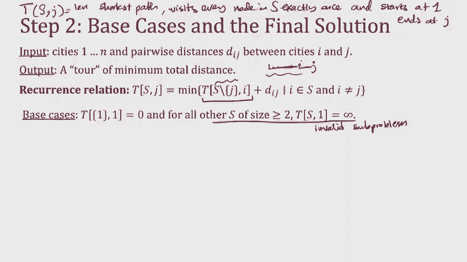
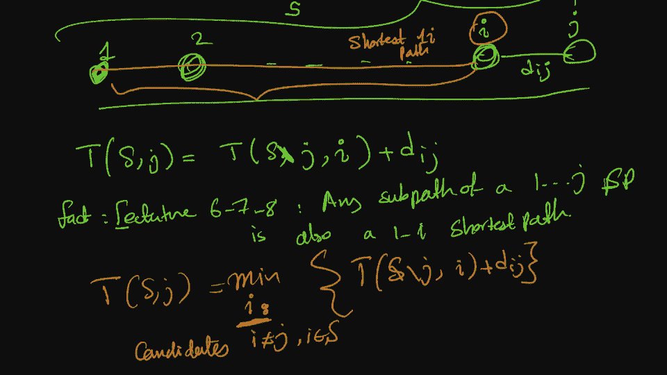
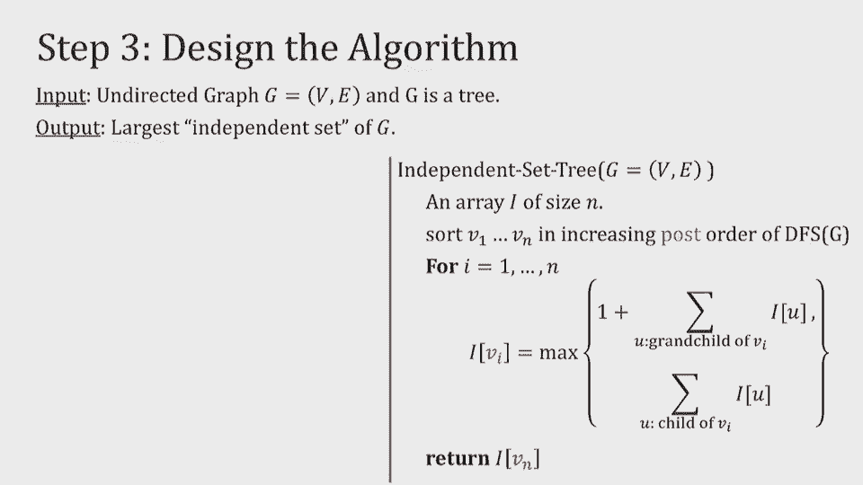

# 课程14：动态规划（第三部分）🚀

在本节课中，我们将继续深入学习动态规划，重点探讨几个经典且具有挑战性的问题。我们将从**0-1背包问题**开始，接着研究著名的**旅行商问题**，最后探讨**树上的最大独立集问题**。通过本课，你将掌握如何为更复杂的问题设计动态规划解决方案。

---

## 0-1背包问题 🎒

上一节我们介绍了允许物品重复的背包问题。本节中，我们来看看一个更常见的变体：**0-1背包问题**，即每种物品最多只能选择一次。

### 问题定义
我们有一个最大承重为 `W` 的背包，以及 `n` 件物品。每件物品 `i` 有重量 `w_i` 和价值 `v_i`。目标是选择物品的一个子集，使得总重量不超过 `W`，且总价值最大。

### 设计子问题
与允许重复的背包不同，我们需要额外跟踪“已经考虑过哪些物品”。因此，子问题需要两个维度：
*   剩余背包容量 `c`（`0 ≤ c ≤ W`）。
*   允许使用的前 `j` 件物品（`1 ≤ j ≤ n`）。

我们定义 `K[j][c]` 为：**仅使用前 `j` 件物品，在容量为 `c` 的背包中能获得的最大价值**。

### 建立递推关系
对于子问题 `K[j][c]`，我们考虑是否选择第 `j` 件物品：
1.  **不选第 j 件物品**：最优解等同于仅使用前 `j-1` 件物品且容量仍为 `c` 的情况。即 `K[j-1][c]`。
2.  **选择第 j 件物品**：首先获得价值 `v_j`，然后背包剩余容量变为 `c - w_j`。我们需要在前 `j-1` 件物品中寻找最优解来填充剩余容量。即 `v_j + K[j-1][c - w_j]`（此情况仅在 `w_j ≤ c` 时成立）。

最优解是这两种情况中的最大值。递推公式如下：

```
K[j][c] = max(K[j-1][c], v_j + K[j-1][c - w_j])   // 如果 w_j ≤ c
K[j][c] = K[j-1][c]                                 // 如果 w_j > c
```

以下是基本情况：
*   `K[0][c] = 0`：没有物品可选，价值为0。
*   `K[j][0] = 0`：背包容量为0，价值为0。

### 算法实现与优化
我们可以用一个二维数组 `K[0..n][0..W]` 来存储子问题的解，并按行（或按列）从小到大地填充。

以下是伪代码实现：
```python
def knapsack_01(W, weights, values):
    n = len(values)
    # 初始化二维数组，全部为0
    K = [[0 for _ in range(W+1)] for _ in range(n+1)]

    for j in range(1, n+1):          # 遍历物品
        for c in range(1, W+1):      # 遍历容量
            if weights[j-1] <= c:
                K[j][c] = max(K[j-1][c], values[j-1] + K[j-1][c - weights[j-1]])
            else:
                K[j][c] = K[j-1][c]
    return K[n][W]
```

**空间优化**：观察递推式可知，计算第 `j` 行时，只依赖于第 `j-1` 行。因此，我们可以将空间复杂度从 `O(nW)` 优化到 `O(W)`，只使用一个一维数组并从右向左更新（避免覆盖本轮需要使用的数据）。

**时间复杂度**：子问题数量为 `O(nW)`，每个子问题计算需要 `O(1)` 时间，因此总时间复杂度为 `O(nW)`。注意，这仍然是**伪多项式时间**，因为运行时间与输入数值 `W` 相关。

---

## 旅行商问题 ✈️

接下来，我们来看一个在计算机科学中非常著名的问题——**旅行商问题**。虽然它是NP难问题，但动态规划能提供比暴力搜索（`O(n!)`）好得多的解决方案（`O(n²·2ⁿ)`）。

### 问题定义
给定 `n` 个城市（编号 `1` 到 `n`）以及它们两两之间的距离 `d(i, j)`。旅行商需要从城市 `1` 出发，**恰好访问每个城市一次**，最后回到城市 `1`。目标是找到总距离最短的访问路线（一个哈密顿回路）。

### 设计子问题
核心思想是记录**部分路径**。我们定义子问题：
`T(S, j)` 表示：**从城市 `1` 出发，访问集合 `S` 中所有城市恰好一次，最终在城市 `j` 结束的最短路径长度**。其中，集合 `S` 必须包含起点 `1` 和终点 `j`。

### 建立递推关系
考虑如何到达终点 `j`。在最优路径中，到达 `j` 之前，我们一定是从某个城市 `i` 直接过来的，且 `i` 属于集合 `S` 但不等于 `j`。那么，从 `1` 到 `i` 的这部分路径，必然也是访问集合 `S\{j}` 并以 `i` 为终点的最短路径。

因此，递推关系为：
```
T(S, j) = min_{i ∈ S, i ≠ j} [ T(S\{j}, i) + d(i, j) ]
```
我们需要遍历所有可能的“上一个城市” `i`，并选择总距离最小的那个。

**基本情况**：
*   `T({1}, 1) = 0`：从城市1出发，只访问城市1，路径长度为0。
*   对于其他不包含1，或不包含j，或大小小于2的集合 `S`，`T(S, j) = ∞`（表示无效状态）。

**最终答案**：最短的完整回路长度是：
```
min_{j=2 to n} [ T({1,2,...,n}, j) + d(j, 1) ]
```
即，考虑所有以某个城市 `j` 为倒数第二个城市，并最后返回城市1的路径中的最小值。



### 算法实现与分析
我们需要存储所有子问题 `T(S, j)`。集合 `S` 可以用位掩码表示，共有 `2ⁿ` 个子集。对于每个子集和每个可能的终点 `j`，我们进行计算。



以下是算法要点：
1.  初始化一个大小为 `(2ⁿ) × n` 的数组 `dp`，所有值设为无穷大，并设置基本情况 `dp[1<<0][0] = 0`（假设城市索引从0开始，城市0是起点）。
2.  按集合大小从小到大的顺序遍历所有集合 `mask`。
3.  对于每个集合 `mask` 和其中的每个终点 `j`，遍历所有可能的“上一个城市” `i` 来更新 `dp[mask][j]`。
4.  最后，在所有城市都访问过的状态（`mask = (1<<n)-1`）下，计算加上返回起点的边后的最小值。

**时间复杂度**：状态数为 `O(n·2ⁿ)`。对于每个状态 `(S, j)`，我们需要遍历 `S` 中所有可能的 `i`，最多 `n` 个。因此总时间复杂度为 `O(n²·2ⁿ)`。虽然仍是指数级，但远优于阶乘级的暴力搜索。

---

## 树上的最大独立集 🌳

最后，我们探讨一个在特定结构（树）上可以用动态规划高效解决的问题：**最大独立集**。在一般图上这是NP难问题，但在树上我们可以在线性时间内解决。

### 问题定义
给定一棵无根树。一个**独立集**是顶点的子集，其中任意两个顶点之间都没有边直接相连。**最大独立集**是包含顶点数最多的独立集。

### 设计子问题
利用树的无环特性，我们可以任选一个根节点（例如节点 `r`），将树转化为有根树。对于以节点 `v` 为根的子树，我们定义子问题：
`I(v)` 表示：**在以 `v` 为根的子树中，能选出的最大独立集的大小**。

### 建立递推关系
对于根节点 `v`，我们有两种选择：
1.  **选择 v**：那么它的所有**子节点**都不能被选中。此时，最大独立集大小等于 `1`（v本身）加上所有**孙节点**为根的子树的最大独立集大小之和。
2.  **不选择 v**：那么它的所有**子节点**可以自由选择（选或不选）。此时，最大独立集大小等于所有**子节点**为根的子树的最大独立集大小之和。

因此，递推公式为：
```
I(v) = max( 1 + Σ_{u ∈ grandchildren(v)} I(u),  Σ_{u ∈ children(v)} I(u) )
```

### 算法实现
我们可以通过一次深度优先搜索（DFS）来自底向上地计算所有 `I(v)`。
*   DFS的递归过程自然地形成了从叶子节点到根节点的计算顺序。
*   对于每个节点 `v`，在计算完其所有子节点（和孙节点，通过子节点获取）的 `I` 值后，即可根据递推公式计算 `I(v)`。

**时间复杂度**：每个节点和每条边只被访问常数次，因此总时间复杂度为 `O(n)`，其中 `n` 是树的节点数。

---

## 总结 📚

本节课我们一起学习了动态规划在三个经典问题中的应用：
1.  **0-1背包问题**：通过定义二维子问题（物品和容量），我们成功处理了物品不可重复的限制，得到了 `O(nW)` 的算法。
2.  **旅行商问题**：面对NP难问题，我们利用状态压缩（用位掩码表示城市集合）设计了 `O(n²·2ⁿ)` 的动态规划算法，这比暴力搜索有了巨大改进。
3.  **树上的最大独立集**：我们利用树的结构特性，定义了以节点为根的子问题，并通过一次DFS在线性时间内解决了问题。



动态规划的核心在于**定义合适的子问题**、**找到正确的递推关系**以及**确定高效的计算顺序**。掌握这些技巧需要大量的练习，希望你们能通过作业和讨论进一步巩固。下节课，我们将开启新的算法设计范式——线性规划。