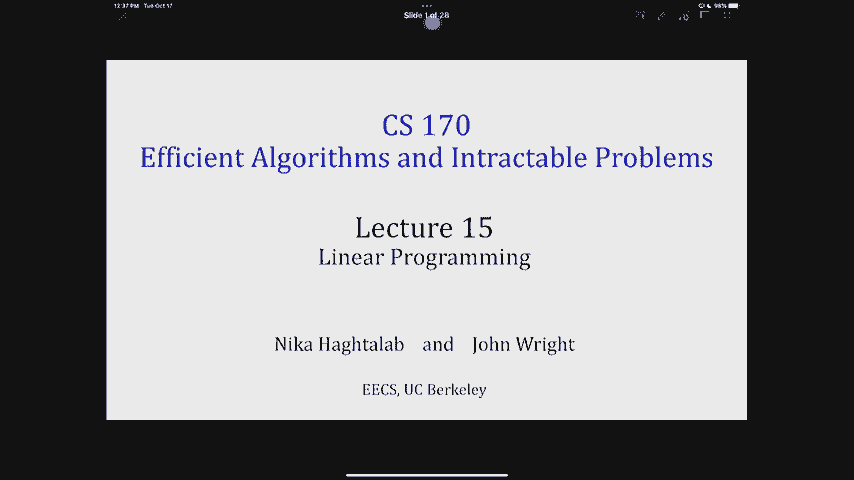
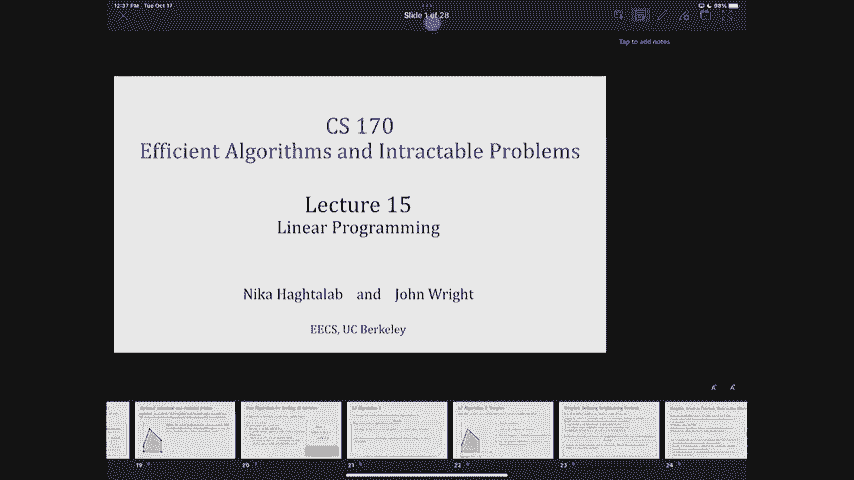
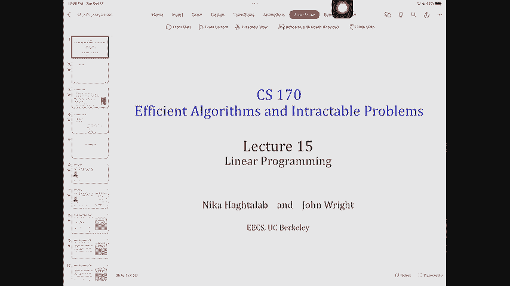
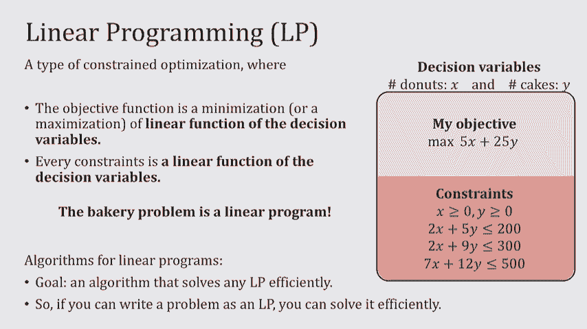
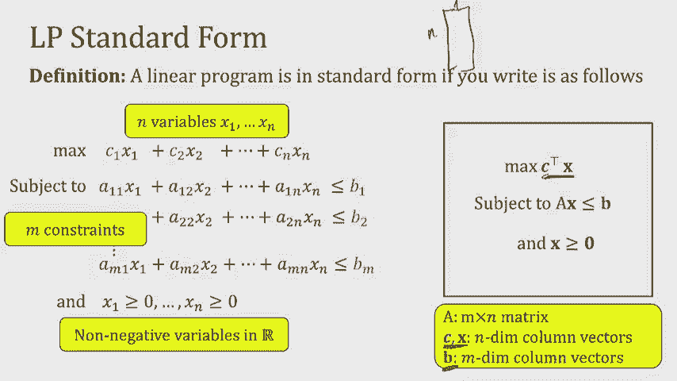
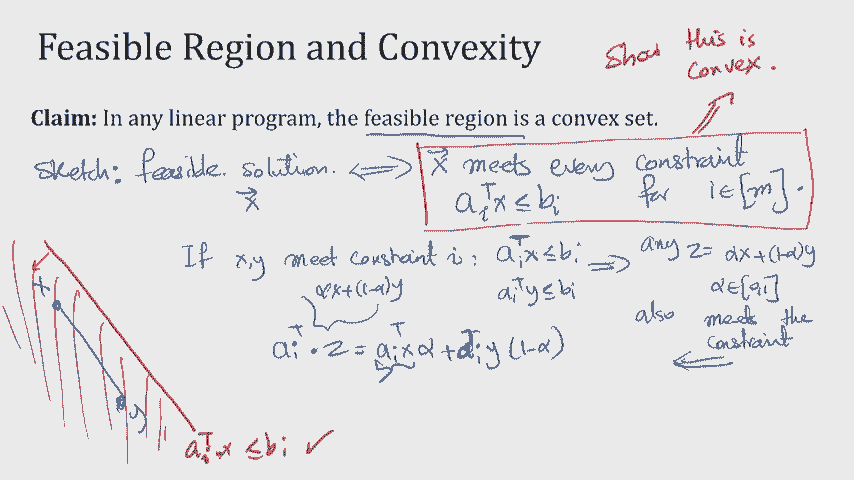
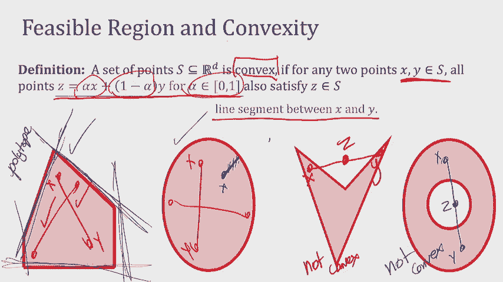
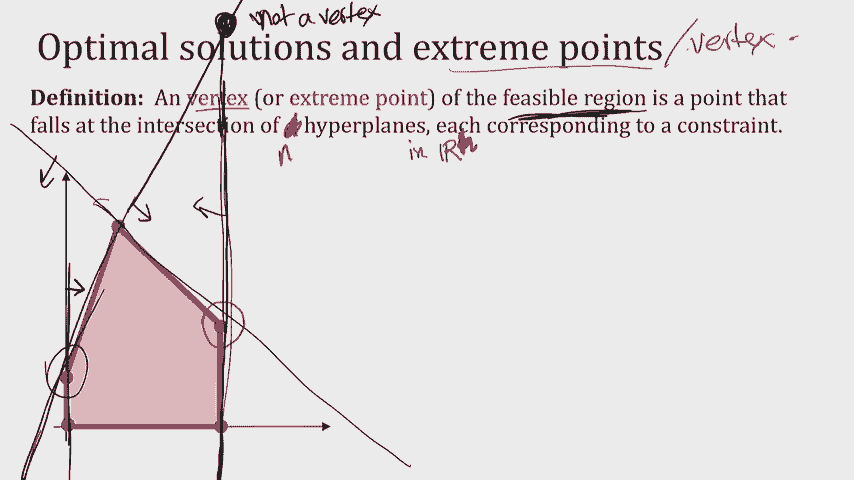
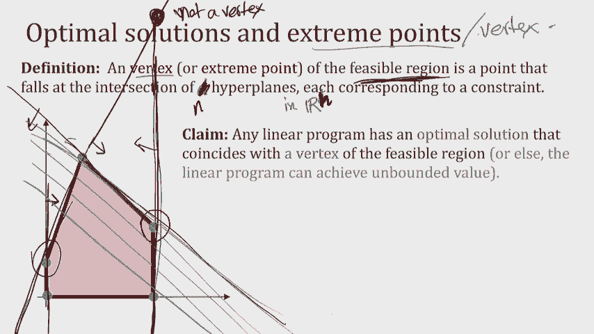
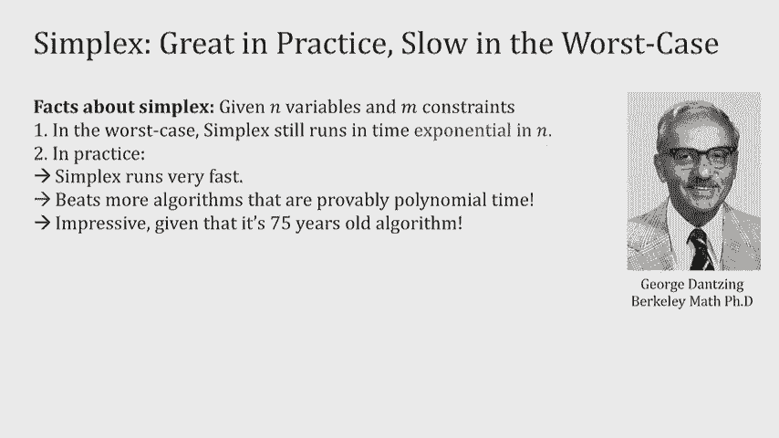

# P15：Lec15 Linear Programming - 东风渐起UCAS - BV1o64y177K8

开始吧，一分钟后就开始了，听起来很奇怪，大家都好吗？很高兴再见到你，现在你看了你的成绩，你感觉怎么样？但还有什么比上周四更好或更坏的呢，呃，嗯，对你们中的一些人来说，也许吧，有人感觉好点了吗，嗯。

别担心，期中考试快到了，你可以利用这个机会来证明你自己，好啦，嗯，我们将多等一会儿，等待入场的人，我们今天会有另一个有趣的出来，嗯，让我们看看这两个中哪一个更难，但如果你真的花时间在这个作业上。

它实际上会在下一个支付股息，因为我们会有一些相关的问题，好啦，我想我们可以开始，等一下等一下，我把我的，你是在问下课后你会不会来看我，这是公告的一部分，是呀，今天是我最后一堂课，但我会说的。

让我从其他公告开始，你可能会更多地投资于，家庭作业，所以我很高兴你说家庭作业7很有趣，今天提醒大家，所以希望你能玩得更开心，今晚上交，然后另一个有趣的作业出来了，家庭作业八，如果你注意到。

即使它今天出来，星期三到期，你可能会问为什么，因为我们把乐趣加倍了，所以我们希望你有更多的时间来真正使用这个，这个面糊真的不行，我们很有趣，也可能意味着可能具有挑战性，这是什么意思。

意思是不要等到最后一分钟，我知道每次我告诉你这些，我敢肯定你们中的一些人每次都不理我，不要不理我，这是我最后一次演讲，听我的劝告，和往常一样，家庭作业聚会只在星期五和星期一举行，所以不要等到最后一分钟。

因为我们周三没有额外的支持，如果你开始晚了，好啦，什么其他的东西，嗯，你已经看到你的期中考试成绩了，希望，我希望你们中的许多人对此感到高兴，就像我们在前哨说的，即使直方图的中位数看起来很低。

意思是这实际上是这门课的标准，事实上，这学期比以前高了一点，与前几个学期相比，这意味着我们将在学期结束时弯曲，为了一些中等的中位数，那看起来就像一个高b+，想想你相对于班上其他人的地位。

但也以此为契机学习，所以说，回去看看，你缺少了什么基本的东西，你知道的，为什么你可能没有得到一个完整的分数，不仅仅是因为标题，但是因为有些事，也许你只是犯了个错误。

但也许有一些更基本的东西你需要更多的练习，所以那是为了那个，好啦，最后一个公告，呃遗憾的是，呃，请求开放，实际上他们星期一关门，所以请随时提交请求，如果我们犯了一个错误，我们来看看。

最后宣布今天是我的最后一堂课，你们大多数人可能已经注意到我怀孕了，孩子很快就要出生了，希望不是在教室里，所以今天是教学的最后一堂课，这对你意味着什么，希望你还记得那个，呃，他告诉你你最喜欢的话题。

FT是对的，最简单的，所以呃，他会回来教你，我相信你会玩得很开心，向约翰学习，他的名字叫约翰，如果你忘了这对老师的办公时间意味着什么，今天我的办公时间和往常一样，也就是说我们在教室外见面。

然后我们走到采石场，然后我们会一直到3点，但是从下周开始约翰的办公时间到了，他可能会找到不同的安排，所以要留意教练办公时间的时间表，这样你就能赶上时间，我不会因为同一个孩子而占用办公时间。

但我希望在学期结束时能回来，在期末考试前有几个办公时间，或者试着在非正式的办公时间见你们中的一些人，即使它可能与课程无关，可能只是更了解你，看看你在课程中的表现，而不是你需要问我在讲座中涉及的具体事情。

所以这就是公告，好吧那么，但是技术上的东西呢，这学期我们在做什么？我们基本上就像一两节课，过了学期中期，所以我想现在是喜欢的好时机，总结一下我们的立场和我们迄今为止所走过的旅程，因为你们学到了很多。

事实上，你已经学到了很多不同的算法设计范例，我们从分而治之开始，然后我们谈到了，然后我们看到实际上他们中的许多人看起来像这样，就像贪婪的算法和贪婪的算法是如此容易使用，但他们更难证明他们是正确的。

他们做了正确的事情，然后从那里我们看到了动态编程，三堂相当充实的课，把分而治之提升到了一个完全不同的水平，和递归到一个完全不同的层次，试图以更有效的方式使用所有这些重叠的子问题。

就像我们有一个叫做动态规划的术语，我们说编程并不意味着编码，但它更像是一个数学规划，用数学的方法写东西，所以你可以解决它，还有其他算法设计的范例，也被称为，一些事情，编程的东西。

我们接下来要做的实际上是看看这些，一些事情，一些事情，编程的东西，所以今天和接下来的几节课，我们将研究所谓的线性规划，你们中有多少人在以前的课程中学过线性规划，比我预期的要少，其实很好很好。

所以这将是新的东西，你们将看到线性规划，它是一个非常强大的算法设计范例，有大量的应用，有很多影响，以至于高级研究，比如研究，即使在我现在的机器学习小组中，也在试图解决其中的一些问题。

并试图从这些事情中吸取教训，所以这是一个非常相关的研究领域，其实是为了今天的世界为了今天，我们要做的是把重点放在定义上，用例，实例，然后简单介绍线性规划中的算法，那么什么是线性规划。

让我们从一个线性规划的例子开始定义它们，假设有一家面包店可以生产两种不同类型的商品，甜甜圈和蛋糕甜甜圈和蛋糕，你知道的，他们每个人都给面包店带来一定的利润，但它们也需要一定量的配料。

我们的问题是面包店应该生产哪一种，假设我有甜甜圈和蛋糕，我从甜甜圈里得到的利润，一个甜甜圈五块钱，我从蛋糕上得到的利润是两块五，但是每一个都需要面粉，糖，牛奶，其他事情，每天作为面包店。

我只有两百单位面粉，三百个单位的糖和五百单位的牛奶，让我们看看这些项目中的每一个也需要不同的食谱，就在这里，例如，我们是说甜甜圈需要两个单位的面粉，两个单位的糖和七个单位的牛奶。

蛋糕可能需要五个单位的面粉，九个单位的糖和十二个单位的牛奶，这些不是真正的食谱，别跟着他们，你的要求是，如果我想最大化我作为面包店的利润，我每天应该烤多少甜甜圈和多少蛋糕，所以我想最大化我的。

用一个数学程序来写并不难吗，我怎么写好，我可以考虑一些决策参数，假设我认为甜甜圈的数量，Y是蛋糕的数量，我想解x和y，我有一些限制，我的限制和一些目标，那么我的限制是什么，我的目标是什么。

我的目标是使我的利润最大化，因为我每卖一个甜甜圈就能赚五块钱，每块蛋糕两块五，我的利润真的只有5倍，再加上两个5年，这就是我试图最大化的权利，我也有约束，这些制约因素是什么，嗯，第一个是我应该烘焙。

甜甜圈和蛋糕的正数或非负数，我不能烤负数，但我也必须确保所有这些加起来，每种成分有多少，我有，所以甜甜圈数量的两倍，加上五倍的蛋糕数量，应该不需要超过两百单位的面粉，糖也是如此。

两次甜甜圈加九次蛋糕不能超过三百，还有牛奶，这就是我要做的是最大限度地实现我的目标，考虑到这些限制，这些x和y是什么给我一点时间，我会说的，从技术上讲，我不想卖半个甜甜圈，我是说半个蛋糕我可以卖。

但半个甜甜圈，没人愿意接受，所以x和y是否是实变量，有布尔值，有整数是需要注意的，我希望你现在就好好想想，作为可以取小数的值，所以我可以烤半个蛋糕或半个甜甜圈，然后我们再详细讨论这个问题，好啦。

我刚在幻灯片上写的，属于一种叫做约束优化的范式，这不是什么新鲜事，我们在这门课上做的大部分事情，是某种形式的约束优化，其实呢，到目前为止，我们研究了许多算法设计范例，有这些约束。

其中解决方案必须满足这里的一个非常特定的约束，我把约束看起来很数学，但总的来说，在算法设计中，我确实有其他地方的限制，例如，我们讨论了MS的最小生成树，嗯，这里的一个约束是边的集合。

你的算法输出应该是一个生成树，对呀，这意味着它应该是一组边缘在收集，图的所有顶点，那是一种约束，即使我不把它写在一些变量中，以获得最长的递增子序列，一样的，约束是，无论我输出什么。

都应该是我输入的子序列，它应该会再次增加，也许我没有写一些变量，但这是一个限制，在间隔调度和贪婪算法中也是如此，再次，我输出的间隔应该没有冲突或重叠，所以约束是我们一直在研究的东西。

这件事的第二部分是目标，目标也是我们一直在努力做的事情，其实呢，在满足这些限制的前提下，我们一直在努力优化事情，类似于最小生成树，我们想最小化边缘权重之和，最长递增子序列，我们想最大化子序列的大小。

在间隔调度中，我们希望最大化间隔的数量，所以我们一直在研究有约束的问题，然后在这些限制下，我们试图优化一个解决方案，那么线性程序和我刚才用数学写的程序有什么不同呢，让我们来看看。

这是我们从最后一张幻灯片中得到的，线性程序和我写的那些东西的主要区别，是一个线性规划，约束和目标都是线性函数，我是什么意思，我的意思是目标函数，这个东西不是最小化就是最大化，决定变量的线性函数。

所以我不能得到5 x的3次方，必须是五x，好吧，同样的，我有限制，这里的约束也是决策变量的线性函数，无多项式，没有十或三的幂，无指数，只是线性函数，所以这就是线性程序。

所以我写的面包店问题是一个线性程序，把一些东西写成线性程序的好处是，我稍后会告诉你，我将向你们展示一点，有一些算法可以解决任何线性规划，所以我们的目标，如果是为一个非常具体的问题设计一个算法。

如果我能把这个问题写成线性程序，我可以用一个解决线性规划的通用算法来解决这个问题，并被处理，所以如果我能把一些东西写成线性程序，工作完成了，这就是为什么线性程序如此强大，让我们回到斯蒂芬问的问题上来。

我在这里看到的，我说的是x和y，我谈到了线性，但我没有具体说明，x和y是什么？0一个变量是像整数一样的吗？它们会是实数吗，它们是什么。

对于线性规划，您不能有这种类型的约束，它表示它们的整数，所以事实上x和y总是属于实值，现在这有点进退两难，因为很多时候当我们想解决这些问题时，我们确实在寻找整数解，就像蛋糕的数量，甜甜圈的数量。

不是一部分甜甜圈和一部分蛋糕，但我想让你记住的是，永远不要在线性规划中添加整数约束，事实上，如果你真的添加它，你不再有线性程序了，你还有一个叫做整数线性程序的东西，也是一个非常强大的求解算法范例。

但问题是，首先，它不像一种LP，只是不是线性规划，是别的东西，在一般情况下，没有算法能有效地解决整数线性规划，通用方式，有时整数线性规划确实有我们可以找到的解，但它们不是通用的算法。

而决策变量为实数的线性规划，总是有一个通用的算法，我们可以使用，尽管在许多应用中，我们认为x和y是整数，这叫做放松这些约束，允许它们是分数的，实值数，我们将更多地讨论为什么这在许多应用程序中都是可以的。

因为，正如在许多应用和许多类型的线性规划中所证明的那样，即使允许这些变量为分数解，您最终得到的解决方案是整数，所以他们相遇了，就像你仍然可以用有意义的方式使用他们一样，关于有限合伙人定义的问题。

我可以用许多不同的方法编写线性程序，就像我说的，重要的是目标是线性函数的最小值或最大值，每个约束都是一个线性函数，但是有一种叫做线性规划的标准形式，考虑标准形式是很好的原因，有很多不同的原因，一个是。

如果您在代码中调用一个包，你想解一个线性规划，你必须用标准的形式来写，但其他原因是，我们可以给你一些关于如何解线性规划的食谱，适用于标准表格，所以说，如果你得到一个线性规划，这看起来不像是标准格式。

你可能会从稍微改变它中受益，所以它确实遵循标准形式，现在呢，标准形式是什么，嗯，线性程序是标准形式，如果我能这样写，所以我要做的第一件事就是确保，我把它作为一个最大化问题而不是最小化问题来写，这不难。

你知道的，如果原始问题是最小化，我刚刚放了一张底片，乘以我的目标，现在我有一个最大化，然后我的限制，我还把它们写成小于或等于某个常数b的约束，大于或等于，好的又来了，我可以用负数乘东西。

所以这最终会解决，然后最后，而这是最不重要的部分，但我仍然使用正的变量，如果他们不是，你可以随时转移他们，所以他们是积极的，再乘以负数，如果你想让他们在这条线上翻转，所以这被称为线性规划的标准形式。

这里要注意的是我们讲的线性规划，从变量的数量和约束的数量来看，所以n是变量的个数，每当我们谈到LP，作为问题的维度，是约束的数量，每个约束是一行，决策参数为非负变量，再次实值，所以它们不是整数。

如果你是这么想的，我们也可以把这整件事写成矩阵形式，以矩阵形式，看起来简洁多了，所以我有一个矩阵形式，约束写在这个m乘n矩阵中，我把它乘以我的x，并说它将小于b，什么B，X和CR，这些都是列向量。

所以列向量，列向量是向量，像这样，一个接一个，例如，矩阵是列向量，而CNX的维数正好是n，变量数，因为，就像你在这里看到的，我基本上是用点积，b的维数是m，因为我有一个B，这就是线性规划的矩阵形式。

所以如果你经常解线性规划，你只需要输入矩阵，还有关于标准表格的问题吗？现在我们已经看到了一个LP，它的一个例子，标准表格。

让我们看另一个例子，我想让你们从这次演讲中学到一件事，你在现实生活中遇到了一些问题，你也许可以把它写成一个线性程序，好吧，考虑到有时你必须放松那些整数要求，你必须满足分数要求。

但是试着写出你想从生活中得到的东西仍然是很好的练习，就线性规划而言，那么，大学可能想从生活中得到什么呢？他们确实有教室分配的问题，他们每学期都要做，看起来你知道有很多课程，有很多可能的教室。

不是每个课程都适合每个教室，但是每门课程都需要分配一些教室，那么他们是怎么做的呢，嗯，我们可以在这里考虑图表，一边是课程，一六十二，一七十一，七十二，随便啦，在右手边，我有同样容量的教室，像惠勒，父母。

所以三个十，你知道它们可以适合不同大小的班级，然后我把一个班级之间的优势，一门课程和一间教室，如果这门课真的能适合那个教室，好啦，我想知道一件事，这是我能分配给教室的最大课程数量吗，这本质上是我想做的。

将尽可能多的课程分配到教室，事实上，我想把这个分配公布在日历上，所以让我们一起努力，我们要做的第一件事就是提出一些决策变量，你认为我们的决策变量应该是什么，他们应该代表什么，给它几秒钟。

如果你有任何建议就告诉我，有什么建议吗，所以说，我们想要最大化的是分配教室的课程数量，我应该有一个变量吗，那就告诉我这让我，至少计算一门课程是否被分配到教室，那会有帮助的，好啦，所以有一点是。

我肯定希望能够计算出，课程是否已分配到教室，所以我可以做的一件事就是让我的决策变量，理想情况下，我想这是一个布尔值0-1，你知道的，如果教室是，如果课程被分配到教室，那个变量是1，如果不是，是零。

但正如我所说，当我们处理线性规划时，我们必须放松一点，看，这是一个课程，每个R是一个房间，我只为实际允许使用的c r定义这些，所以这些是我的图表中实际存在的，所以这是我的变量，现在我将有一些约束。

所以如果这些是我的变量，有人能告诉我最小约束是什么吗，我应该把这个X CR，对不起，我有点，变量所代表的是混淆它在这里的意思，什么是，好呀，那么x是什么意思，所以让我们回到这里，为什么我们称它为变量。

因为它可以取一个值变量，这个值将是我们的解决方案，所以理想情况下，我是说x{\displaystyle x}可以取0或1，如果它需要一个，意思是那个课程，如果是零，意思是课程。

这就是我想解释x cr的方式，这里的一件事是，即使我希望它是零一，也许我不该在LP里放零一，所以我的第一个限制是，我真希望我能这么说，但它会变成一个整数线性程序，所以我把它改成cr的x在0和1之间。

这是什么意思，这就是我所说的，有时分数解仍然帮助我们，为什么没问题，一种解释方式，这是说，想象我可以同时在惠勒容纳两个教室，所以我会把教室的一半，这里一块六十二，那里一块七十二的一半。

这在实践中是一个可怕的想法，这永远不会发生，但是这种类型的线性规划可能会得出这些解，我们要这样写，因为在这个特定的程序中，你实际上会看到，今天不行，但是你会看到对于这个特定的程序。

解决方案最终是一个整数，即使我写它是为了让解决方案不确定，但让我们假设出于某种原因，注册者认为那些奇怪的解决方案，即一半的教室被分配给一些东西，一半给别人是可以接受的，现在我有了我的X。

我说它们应该在0-1之间，不应该超过一个权利，如果是两个，肯定很奇怪，因为这就像我不能把一个教室分配给一门课两次，或者两次去同一个教室的课程，那根本说不通，我还想要什么。

教室里一次不应该有一门以上的课程，对吗，我该怎么写呢，是呀，是呀，因为所有房间都是，我总结了所有的课程，我基本上把x cr赋给了一个，我说这不应该超过一个，好啦，好极了，所以这是一个约束，说。

如果我看着皮托·女性，只分配到一个课程，也许是两个半菜，但它不能同时分配给一个六十二和一个七十二，我想要另一个约束，也是，对呀，我也希望这门课不要分在两个教室，完全喜欢，我不想告诉你们，哎呦。

有一百六十二的增量，惠勒有一百六十二，那么我该怎么写呢，嗯哼，同样的事情，但我颠覆了逻辑，所以与其写房间，我写的是课程，所以对于所有的课程，C我想要，当我把他们分配的房间相加时。

因为它不会增加一个以上的好处，所以这些是限制，最后，我要一个目标，让我们回到客观价值，对CR的X的解释，当教室被分配时，cr的x是1，当它被分配对的时候是零，这是一种解释，我的目标功能是什么。

我正试图最大限度地增加有教室的课程数量，你能用数学告诉我这些变量，我应该写下来的，是呀，所以目标是很好地总结，最大化所有x cr的和，原因是当我看到这个，这是当我分配了一个教室和一个零，否则。

如果我最大化它们的总和，从本质上说，我正在最大化分配的课程数量，所以这是一个线性规划，当然，我希望我能把它写成一个整数程序，因为在生活中，整数程序会让我的生活轻松得多，但我把它写成了分数解。

所以我可以把它写成线性程序，所以这是一个例子，是呀，好极了，那么，所有的房间和所有的课程都做什么呢，让我们看看所有的房间，它确保房间不会同时分配给一个以上的课程，从分数上讲，但至少它不会，就像。

我不能完全分配，一个六十二和一个七十二到同一个房间，因为所有的课程都在做相反的事情，它在看一个航向，它说在任何给定的时间，最多只能分配一个房间，其实一个房间，好啦，不可能是两个房间的标志。

就像不能把惠勒和伊门托都带走一样，这就是图两边的约束条件，很好那这看起来像什么，我来告诉你，这看起来就像，如果解决方案，您可以保证它确实是一个整数解决方案，它看起来就像一种叫做匹配的东西。

有多少人在图表中看到过匹配，好啦，那么什么是匹配，配对是一套，最大匹配就是告诉你，嗯，图的哪边应该连接到哪边，如果cr的x是1，c r的x是1，所有其他CRS的x是零，这是要我给惠勒分配一个62。

还有一百七十二房，现在有不同类型的匹配，例如，这是另一个匹配，这是一个更大的匹配，好的，好的，所以一个六十二到一个七十二轮的车，另一件事是一七十二，所以实际上我在这里写的线性程序叫做匹配线性程序。

我现在不打算详述，我们可能会在几节课中回到它，这是线性规划的另一个例子，哦是的，你什么意思，哪些域，只是CNR不一样，你对其中一个的求和是c，因为另一个是r，我是说你可以做一个数学把戏。

所以你可以这样做，但这只是在一天结束的时候，只是一个矩阵，反正，选择这个作为决策变量的直觉是什么，嗯，当我想到这个，我在想在一天结束的时候，什么事？我试图输出，我正试图输出一个分配正确。

所以如果我的变量告诉我关于分配的信息，比如教室是分配给一门课还是不分配给一门课，如果是哪条路，所以x{\displaystyle x}是正确的，它告诉我c是否分配给r，所以总的来说。

如果你考虑输出是多少，你想要的是什么，告诉你很多关于什么变量，你应该定义，好啦，所以cr的x是一个变量，我在定义每一个c和每一个r，好啦，它是一个变量意味着什么，意思是我没有给它一个值。

线性规划的工作是为它找到一个值，这就是为什么它被称为变量，现在我已经为每一门课程定义了，所有可能匹配的房间，就像课程可以放在房间里一样，至少我定义了这个变量，如果变量最终是1。

那就意味着那个教室被分配了那门课，如果结果是零，意思是他们没有被分配给对方，这就是你如何解释cr的x，并不总是这样，是一个非常特殊的线性程序，我不打算谈这个，但是下节课，约翰会教你。

一类具有非常有趣结构的线性程序，您是否应该期望它是整数，这是我们的希望和梦想，事实上，我告诉你作为一个整数是一个神奇的发生超越，我今天可以教你，既然我们知道了如何把一些东西写成线性程序。

我想得到一个几何直觉，关于这些线性程序实际上是什么样子，这里又是线性程序，这些都是真正的价值，我想从它的约束来写这篇文章，不是写，我想用几何学来展示它的约束，而且在客观价值上，所以让我们从约束开始。

看约束的一种方法，这里是这些约束线中的每一条，告诉我一些可能的解决方案在这里存在的地方，好啦，所以如果我只是喜欢，你知不知道，这是我的X，这是我的Y，而我正在寻找的是，我在哪里可以把点放在这里。

实际上满足我的约束，第一个约束是x必须小于3，所以这是说，本质上我的解决方案必须属于红色区域，它不可能在红色区域之外，事实上，线性约束的每一行看起来都与直线或平面完全相同，空间中的超平面，它的一边。

我是什么意思，让我们看看下一个约束，x加y小于5的约束，x加y 5等于5条线，蓝色的一面又是，告诉我任何满足x加y小于5的解，必须属于蓝方，我们可以使用下一个约束继续此操作，有绿色约束。

减去3 x加上y必须再次小于1，我可以写出-3 x加y等于1，然后小于1的部分是绿色的一面，所以我刚才所做的，事实上，我也可以写x和y大于零，就这两条线，所以我所做的就是展示我的约束的每一行。

把半空间或超平面放在一边，所以这是两个专业术语，我通常会把这种类型的线和它的一边称为半空格，满足线性不等式约束的所有点的集合，所以任何看起来像这样的东西都被称为半空间，嗯这条线本身。

我们通常称之为超平面，所以超平面是，如果你把这种不平等换成完全平等，变成了一个超平面，所以基本上我刚才给你看的是，我正在优化的这个区域，我在哪里见面，所有的限制，让我们看看那个区域在哪里。

那个地区在这里，我所有的约束条件都满足的地方是半空间的交集，好啦，这就是几何直觉，我正式说的是什么，我正式地说，有一种叫做可行区域的东西，可行区域是可以分配变量值的所有可能方法的集合。

我们本质上都是你的rn空间中的点，满足您所拥有的所有约束，好啦，我要说的是，是所有这些半空间的交集，到目前为止对此有什么问题吗，关于可行区域的定义，所以这些真的很好，超平面、半空间和可行区域。

一个可行区域是凸的，你们中有多少人听说过凸集，所以我们知道凸集很好，因为我们可以给他们做一些漂亮的手术，那么什么是凸集，正式，凸集是，每当我在片场的任何地方拿两分时，我在这两点之间画一条线。

这条线完全在布景里面，好啦，我所说的正式的一行是什么意思，其实呢，嗯，你可以讨论x和y之间的线段，把它们和α和1-α结合起来，在0和0之间，一个有点像说，我能得到多少，我能得到多少。

然后我在中间做了多少混合，所以这是一个凸集，因为无论我把X和Y放在哪里，整条线都在里面，整条线都在里面，同样地，每当我拿x和y，整条线都在里面，但这不是凸集，因为我可以用x和y，然后这里有一个z。

那不在我的布景里，所以这不是凸的，同样，这也不是凸的，因为我可以用x和y，然后这里有一个z，x和y之间不在集合中的线的某些部分，所以这个也不是凸的，所以我想说的是线性规划。

他们的可行区域看起来更像这两个，其实呢，真的是这样的直边，当你有一个线性程序，这叫做多面体。

我要为你证明这一点，但我会证明它只是一个凸集，我会证明，我再给你一张草图，不一定要非常正式，其实很简单，但我只是觉得喜欢练习很好，它的一点点凸起，所以我要告诉你的是，如果你有任何线性程序。

再看看这个可行的区域，它将是一个凸集，所以这是证明的草图，我要说的第一件事是，我不打算证明这部分，根据定义，这是，可行的解决方案，所以一个可行的x本质上是可行的，如果，在我的约束集中。

让我们把这些约束称为i，X，小于b，I，因为我有他们的权利，M制约因素，所以我要做的就是专注于展示这个，因为如果这是我的可行区域，我只需要展示，那个节目，为什么这个凸起，原因是凸的。

因为我可以把我的每个约束，假设这是我的点x小于i，所以我是认真的，因为这是我的超平面，我所遮蔽的部分实际上是，这个约束保持一个点x或转置，x小于b，到目前为止，大家跟我一起，好啦，如果我在这里取两点。

整条线也会在里面，这就是我要证明的，那么我要证明什么，我说如果x和y相遇，在a上转置，小于b，I和Y相似，那么我的主张是任何z是α乘以x 1，零一之间的α减去α乘以y也满足约束，现在这并不难看到。

因为让我们来看看什么是转置，因为z是α乘以x+1减去α乘以y，这本质上是一个转置x乘以alpha加，让我们看看这里，这东西比眼睛还小。

这个东西小于b，根据我所做的假设，所以说，如果我有两个数字，我取了他们的加权平均数，他们的阿尔法加权平均数，它们都比我小，那么加权平均值也会小于i，我接受的平均方式，因为这就是阿尔法的意义。

如果α正好是，我拿的是平均数，正好是x和y之间的中间点，x的一半，Y的一半在中间，如果α是第一点，我拿x点1和y点9，所以这是一个加权平均数，我更倾向于，阿尔法较大的那个，所以我刚才展示的，不过。

我得确保大家意见一致，我刚才展示的是，如果我采取任何约束，我提出了两点来满足这个限制，它们之间的线也满足约束，因为可行区域是所有这些的交集，我遇到了每一个限制，所以如果我取两个满足每个约束的点。

然后它们之间的线也满足每一个约束，这就是为什么我有凸起，我可以，但这并不能说明凸性，让我们回顾一下凸性的定义，凸性的定义是，对于同一组中的x和y，所以我说集合S是凸的，如果我在里面取两个点。

然后看这条线，所以如果我拿一个点在里面，一个点在外面，那我就不保证他们之间的界限了，总是在里面，这就是为什么，所以我脱离了凸性的定义。

因为我想证明凸性，我怎么证明，通过专注于假设两个点确实在集合内，然后显示它们之间的整条线也在集合内，其他问题，好啦，所以现在是休息三分钟的好时机，是一三一，一、三、四再见，如果你回来的时候能把门关上。

我将不胜感激，所以一三四，如果你刚回来，让我们坐下来继续，好啦，所以我们得到了一个几何直觉，可行区域是什么样子的，但可行区域只是关于约束，在一天结束的时候，我有一个约束优化，从某种意义上说，我有限制。

然后在这些限制下，我试图优化一个目标，所以现在让我们看看目标在哪里，我们如何思考目标，所以现在我们的重点是客观部分，以及思考客观的方式，以及目标的几何直觉，至少是考虑函数的水平集，水平集是一个花哨的词。

我将一个函数设置为等于某个值，有哪些解决方案会给我这种价值，好啦，那么我是什么意思，我的意思是x加2y是我试图优化的，假设它等于c，如1，2，3，4，它只是告诉我解决方案空间的级别集。

让我们看看那是什么样子，所以我可以画x加2y的线，我们把它等同于，这些都是解决方案，尤其是在可行集合中落入约束的解，这些都是值为2的解，任何落在虚线蓝线上的解决方案，现在两个没什么特别的。

我可以画出x加2y等于3-4-5-6-7-8，看看这些线在哪里，问题是这条线的斜率是不变的，还是x加2 y，唯一改变的是拦截，所以当我从x加2，y等于2比x加上2 y等于5，我不改变坡度。

我只是把线往上推一点，好啦，为什么我知道这是一个五，嗯，我作弊了，因为我刚才说x是3，y是1，值是5，我只是划清界限，但我是说有很多不同的方法可以做到这一点，正如你所看到的。

所有发生的事情就是我在画这些平行线，五不特别，我可以画7个也可以画9个，在某个时候，我画的下一条线将在约束集之外，那里没有解决办法，所以这告诉我有一个解决方案，这个角，事实上，它刚刚得到了9的客观值。

任何超过9的事情都是不可能实现的，因为每当我为9以上的事情画这条线时，它甚至不再与我的可行区域相交，这就是我们的直觉，直觉是我们可以画出这些水平集，当我们增加水平设置，就好像我没有改变坡度。

我只是把线移得越来越高，它经过我的可行区域，在某个时候，它穿过了我可行区域的一个角落，它一出来就出来了，你知道的，第二个是触及我可行区域的一端，蓝色的是我的最优解，好啦，可行域是否凸有关系。

因为如果它不是凸起的，它不一定会穿过尖头，所以这些尖头其实是，帮助我们找到最优解的东西，难道这不是一个点吗，嗯，有时这不一定是一个点，其实呢，假设我的目标值是dev，这条线是什么，它是。

与其改变我的目标价值，让我改变我的一个约束，如果这里的约束实际上更像这样，所以如果这是我的整个区域，会发生什么，不仅这一点是一个解决方案，但这整张脸会是一个最佳的解决方案，所以这正是微妙的点。

我要解释并写信，在下一张幻灯片中，总有一个最优解，这一点，但有时有很多，事实上是无限的最优解，不一定是点，在这种情况下，通常会有我息肉的脸，好啦，那么我的主张是什么，我提出的索赔。

存在一个叫做极点或顶点的东西，我说，这里的极点，但是你的书和很多人把这些称为顶点，所以让我也用顶点，这个可行区域有一个顶点，这将是最优解，为了形式化我所说的顶点或极点，让我把它定义为，或者去D，事实上。

这是令人困惑的，我把这个叫做n，因为我有n n个变量，我在r到n的空间里，所以我想说的是当我看着这个顶点，我把顶点叫做，因为这是我的两个约束的交集，这个，这个这个家伙也是我的两个约束的交集，这个。

如果我有n个变量，每n个约束，我拿着看他们的交集，他们给了我一些点，那个点，尤其是在可行区域，将是一个可行区域的角落，不是每个十字路口都会是拐角处，例如，如果我走这条线，在这一行，它们在这里有交集。

这不是顶点，因为它不是可行区域的一部分，好啦，所以顶点确实是交点，但不是每个交点都是顶点。

所以我的主张是。

任何线性规划都有一个最优解，与可行区域的一个顶点重合，如果不按我说的做，这是一个非常特殊的情况，它通常意味着线性规划是无界的，就像它的一张脸不存在，所以你不喜欢，你没有任何有限解，我不会证明这一点。

但本质上，证据正是我们以前所做的，这是因为如果我有一个多面体，我把这些线，对于任何凸集，最终我会退出的，我马上就要退学了，要么我在一个有两个顶点的面上，或多个顶点，多个顶点而不仅仅是两个，嗯。

或者我只是通过一个顶点，这是最优解，关于这个直觉有什么问题吗，目标函数的几何理解，这不是平行的问题，这意味着最优区域实际上在目标方向上是无界的，所以这意味着，假设我只是画一些东西，也许这是你的限制。

好啦，也许这就是你的目标函数，没有什么能阻止你在这里，所以你可以一直走到无限，哎呦，是呀，是呀，它是，这是一个堕落的情况，你是真的，就像我们，嗯，如果你有无限多。

好啦，所以说，有一件事这种顶点的想法，至少有一个最优解属于顶点帮助我们，是至少有有限个这样的顶点，所以如果我能列出所有的，然后也许我可以把它们都看一遍，决定哪一个价值更高，这将是一个求解线性规划的算法。

那是我们第一次尝试，这是寻找所有顶点的简单算法，把它转化为求解线性规划，这个想法是，我们要做的是找到所有这些顶点，回想一下，每个顶点都必须是n个约束的交集，所以我要做的是给我约束条件，我穿过它们。

对于这些大小为n的约束的任意子集，我解决他们，我试着把他们的交集，嗯，做，有人记得怎么解决，对于一组线性约束的交集，你从哪里学到的算法，只是在日托期间炫耀一下，那是他们教我们的，但不管怎样。

你要做的就是，你想在这些约束的交点处解x星，这实际上是一个线性系统，你做这件事的方式是记住，我说过超平面是等式的，带不等式的半空间，所以你把等式放进去，你有一个线性系统，你做你的高斯消去法，给你X星。

那是在十字路口，所以我得到了X星，我仍然需要确保它实际上是可行区域的一部分，因为我向你展示了一些十字路口不会落在这个地区，所以我将添加一个步骤，通过剩余的m减去n约束。

并确保这些限制一个接一个地得到满足，只是确保他们得到满足，如果他们是，然后将x星添加到极点或顶点列表中，所以这是一个算法，现在通过并做到这一点，我想让你告诉我的是，我会在此基础上设计一个线性程序。

所以线性规划，基于此的第一个算法是找到所有的顶点一个接一个地穿过它们，看哪一个客观价值最高，我想让你们讨论一下，为什么这是个糟糕的算法，从某种意义上说，为什么这如此缓慢，我想让你讨论两件事。

一个顶点的数目可能有多大，如果我有m个约束和n个变量，事实上，而不是只想着，哎呦，它可以像大的，你能给我一个可行的区域，它使用了大约n乘以n的约束，它有2到n个顶点，你能想想这样的事吗。

所以如果可以的话，那你为什么不谈谈，然后我们一起回来看看你的答案是什么，所以和坐在你旁边的人讨论一下，我们等一下再谈，它在更高的维度上仍然是如此的顶点，如果我有n维，我取n个约束条件，取它们的交集。

尺寸是，是啊，是啊，所以我取n个约束条件或n个超平面，它们的交点是一个顶点，好啦，所以你越来越安静了，希望，这意味着你带着解决方案过来了，不是说你放弃了，所以说，让我看看，第一个问题有人自愿吗。

它能有多大，我选择我是的，所以如果我有m个约束和n个变量，记住顶点是相交的，所以它永远不会超过从m约束中选n，所以，但它可能是相当接近，所以我选n这个很大，因为这是关于，这大约是M到N的右边。

所以这个很大，这是相当缓慢的，问题的第二部分呢，你能想到一个建筑吗，因为，第一部分只是说它可以大到m到m，选择n，但也许它要小得多，你能想出一个结构，在这个结构中，你有2到n个极点，有点难，好的，好的。

我会好好给你的，超立方体，所以如果我有n维超立方体，我可以把它看作是有2倍n个约束，我希望我的x在0和1之间，为了我所做的一切，这是两个n的约束，它看起来像什么，看起来好像。

实际上是定义为x在坐标中是否为零，或者坐标系中的一个，我有n个坐标，它们中的每一个都可以取两个值，所以顶点的数目是两个，所以n个约束，两个到n个顶点，所以这对算法来说是个坏消息，我提议。

所以这个算法不是一个好算法，但已经够近了，从这个意义上说，这些顶点实际上仍然有意义，还有第二种算法叫做单纯形，有人听说过单纯形吗，否，哎呦，好啦，你们中的一些人单纯形是一种从一个顶点开始的算法。

假设从这里开始，然后贪婪地搬到更好的邻居那里，我说的邻居好是什么意思，我是说，所以它的作用是从一个顶点开始，然后看它所有相邻的顶点，取客观值最优的邻居，不断重复直到没有更好的邻居，所以简单将从。

假设在这里，它看到值是零，然后它看两个选项，这里的值，如果我有x加两个y，这个值将是2，这个值将是三，所以我的单纯形算法，那我把这个擦一下，我的单纯形算法，然后移动到这个顶点，然后看着邻居。

然后其他邻居，这里的值是x加两个y，所以这是价值七，这是零，然后它移动到七，然后看着七个的邻居，此邻居的值，九x加二y，然后在这一点上，它移动到九，我去邻居家看看，我看到这个值是2，所以我不去那里。

我停下来，我说这是我的最佳解决方案，这很简单，从一个顶点开始，贪婪地对邻里关系采取行动，唯一有点难以启齿的是，当我们谈论单纯形时，是在二维中，很清楚我所说的邻居是什么意思，你知道，就像你向左或向右。

你有两个选择吗，但在更高的维度上，谈论它就有点难了，如此正式，当我们谈论邻居时，更高维，我们定义它的方式，通过谈论约束，它们聚集在一起给了我一个顶点，假设我有三个变量，和m五个约束。

就像这些约束是一二二五，然后将每个顶点定义为三个约束的交集，假设我取顶点，一二三，所以这是一个顶点，我把前三个约束，穿过他们的十字路口，我发现了一个顶点，现在呢，这个顶点的邻域正好是。

仅引用一个约束被更改或交换的顶点，所以n减去一个约束不变，其中一个变化，所以如果我想列出这个的所有邻居，我会看着所有这些布景，对于它们中的每一个，我将取顶点，一个，两个，四，那是邻居，约束。

约束为1的顶点，两个，三个，算法理论好，所以从算法上来说，这里的希望是，因为单纯是贪婪的，它不必检查所有的顶点，也许它找到了一条更好的路，因为simplex的运行时，贪婪路径的运行时，而不是天真地走。

好吧，我还没有证明这一点，因为凸起，这也是凸性确保，你永远不能下去然后又上来，好啦，上去的最好方法就是上去，永不沉浮，这些都是直观的，我今天什么也证明不了，好啦，但本质上我想说的是假设我有。

N个变量和M个约束，这种单纯形的好处，我会帮你回答这个问题，或者我们可以一起回答，即使顶点的数量很大，每个顶点的邻居数很少，这个号码是多少，所以我有n个约束，我只能换出其中的一个。

那么我可以用多少种方法来交换其中一个，我选择一个约束，所以那是n，每一个都可以取m减去n的值，所以顶点的数量，邻居的数量，一个顶点小于m乘以n，所以即使很可能单纯形需要很长时间，至少每一步。

它不是在看一个巨大的布景，不管是不是神奇的算法，我来告诉你，在过去的三十年里，单纯形一直是最有趣的算法之一，因为，有几个事实我们无法证明，但我觉得知道他们很有趣，不幸的是。

单纯形仍然在最坏的情况下需要指数级的时间，它实际上可以穿过所有的顶点，所以当丹妮尔问喜欢，不清楚它是否会比天真的算法做得更好，事实上，在最坏的情况下，它没有，但在实践中。

这是我们今天仍然拥有的最好的算法之一，令人印象深刻，因为它胜过了所有有可证明保证的算法，一点点乐趣，事实上，今年是单纯形作为一种算法的75岁生日，它是由乔治东发明的，他是伯克利的数学博士生。

有点传奇色彩，很明显他一出现在课堂上，黑板上的一堆问题，以为是作业问题，它们是该领域最大的公开问题之一，不管怎样，他还是把它们解决了，作为他的家庭作业，总之他是个超级聪明的家伙。

他提出了线性规划和单纯形。

但是，在过去的二十年里，最近对线性规划的研究也非常有趣，因为有一种叫做平滑分析的范式，这是研究的前沿，本质上讲理论与实践的落差，它以一种可证明的方式表明，如果你扰动线性规划的约束。

Simplex在数学上运行得很快。