# 课程 P15：线性规划 🧮

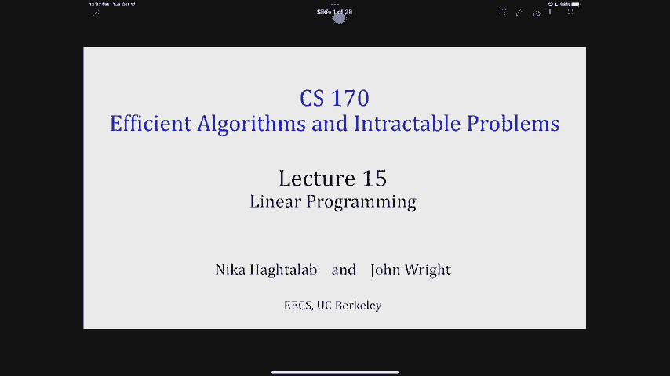

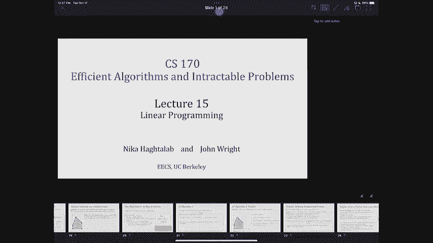

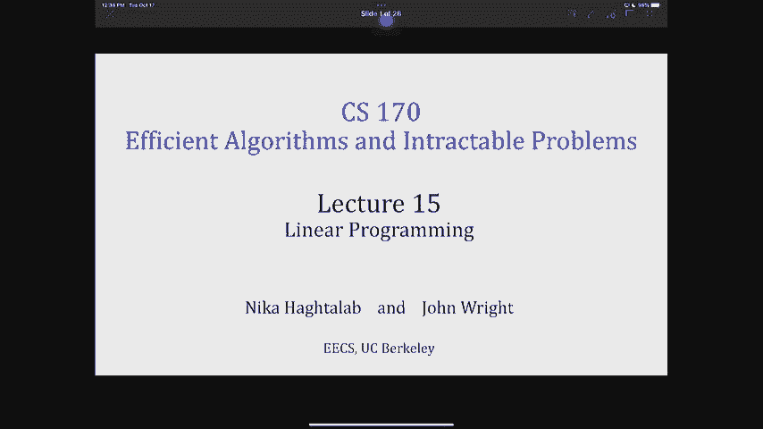

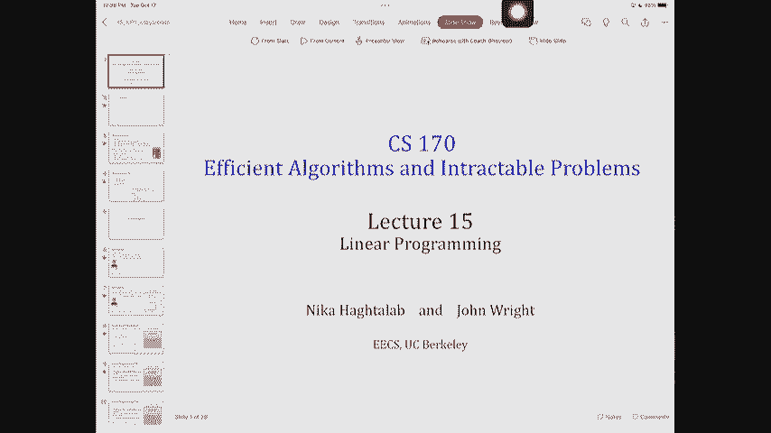

在本节课中，我们将学习线性规划的基本概念。线性规划是一种强大的算法设计范式，用于在满足一系列线性约束的条件下，最大化或最小化一个线性目标函数。我们将从定义、几何直观到求解算法，逐步了解线性规划。

---

## 什么是线性规划？📐

线性规划是一种约束优化问题。其特点是目标函数和所有约束条件都是决策变量的线性函数。

### 一个例子：面包店问题

假设一家面包店生产甜甜圈和蛋糕。
*   每个甜甜圈利润为5元。
*   每个蛋糕利润为2.5元。
*   每日原料限量：面粉200单位，糖300单位，牛奶500单位。
*   每个甜甜圈消耗：面粉2单位，糖2单位，牛奶7单位。
*   每个蛋糕消耗：面粉5单位，糖9单位，牛奶12单位。

目标是决定每天生产多少甜甜圈（`x`）和蛋糕（`y`），以最大化总利润。

我们可以将其表述为以下数学问题：

**目标**：最大化利润 `5x + 2.5y`
**约束**：
1.  `2x + 5y ≤ 200` （面粉限制）
2.  `2x + 9y ≤ 300` （糖限制）
3.  `7x + 12y ≤ 500` （牛奶限制）
4.  `x ≥ 0, y ≥ 0` （非负性）

在这个表述中，我们允许 `x` 和 `y` 取实数值（即可以是分数）。如果要求必须是整数，则问题变为**整数线性规划**，这通常更难求解。

---

## 线性规划的标准形式 📏

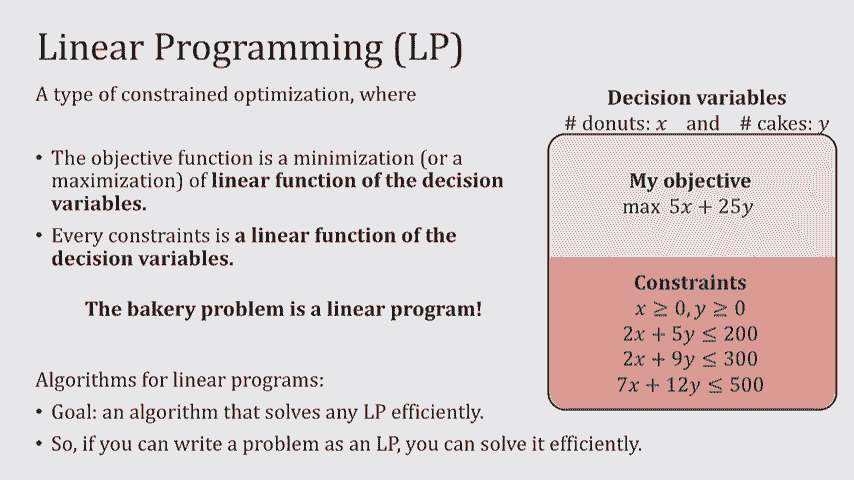

为了使分析和求解更统一，我们通常将线性规划转化为标准形式。标准形式要求：

1.  目标函数为**最大化**。
2.  所有约束都是 **`≤`** 形式。
3.  所有决策变量**非负**。

任何线性规划都可以通过以下方式转化为标准形式：
*   若原目标为最小化 `cᵀx`，可转化为最大化 `-cᵀx`。
*   若约束为 `≥`，可乘以 -1 转化为 `≤`。
*   若变量无约束，可将其分解为两个非负变量之差。

标准形式的矩阵表示非常简洁：
*   **最大化**： `cᵀx`
*   **约束**： `Ax ≤ b`
*   **变量**： `x ≥ 0`

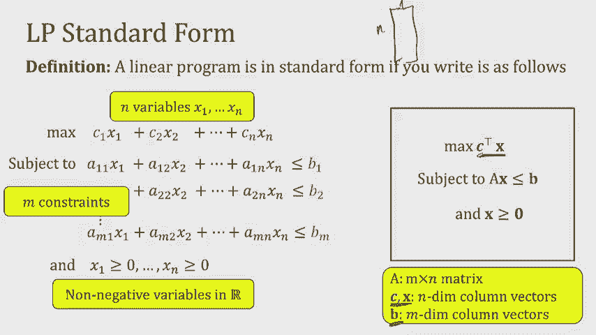

其中，`c` 和 `x` 是 n 维列向量（n 为变量数），`A` 是 m×n 矩阵（m 为约束数），`b` 是 m 维列向量。

---

## 另一个例子：教室分配问题 🏫

上一节我们介绍了线性规划的基本形式，本节我们来看一个实际应用：将课程分配到教室。

假设我们有一组课程和一组教室，只有容量合适的教室才能分配给课程。我们希望最大化成功分配的课程数量。

**决策变量**：为每门课程 `c` 和每个可用教室 `r` 定义一个变量 `x_cr`。
*   理想中，`x_cr = 1` 表示课程 `c` 分配给教室 `r`，`x_cr = 0` 表示不分配。
*   在线性规划中，我们**松弛**整数约束，允许 `0 ≤ x_cr ≤ 1`。

**约束**：
1.  每门课程最多分配一个教室：对每门课程 `c`，`∑_r x_cr ≤ 1`。
2.  每个教室最多分配一门课程：对每个教室 `r`，`∑_c x_cr ≤ 1`。

**目标**：最大化总分配数，即 `Maximize ∑_c ∑_r x_cr`。

这个线性程序实际上描述了一个**二分图匹配**问题。有趣的是，对于此类特殊问题，即使我们允许分数解，最终得到的最优解也往往是整数解。

---

## 几何直观：可行域与顶点 🔷

理解线性规划的几何直观有助于我们把握其本质。每个线性约束（如 `aᵀx ≤ b`）在空间中定义了一个**半空间**。所有约束半空间的交集构成了**可行域**。

可行域是一个**凸集**。凸集意味着集合内任意两点连线上的所有点，也都在集合内。

**证明可行域是凸集的思路**：
假设 `x` 和 `y` 是可行域内任意两点，均满足所有约束 `A x ≤ b` 和 `A y ≤ b`。对于任意 `α ∈ [0, 1]`，考虑点 `z = αx + (1-α)y`。由于 `A z = α A x + (1-α) A y ≤ α b + (1-α) b = b`，因此 `z` 也满足所有约束，故 `z` 也在可行域内。所以可行域是凸的。

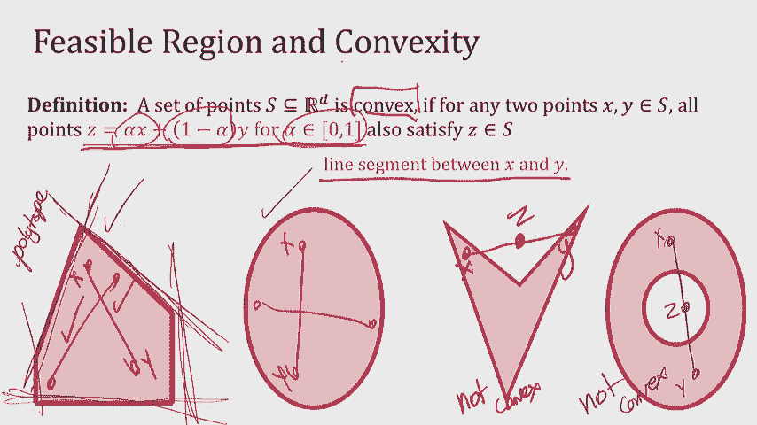

在线性规划中，这种凸的可行域被称为**多面体**。

---

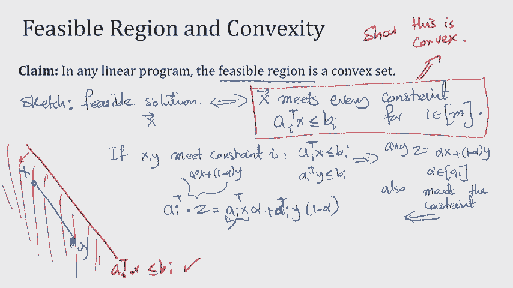

## 目标函数与最优解 🎯

上一节我们了解了约束构成的可行域，本节我们来看看目标函数如何引导我们找到最优解。

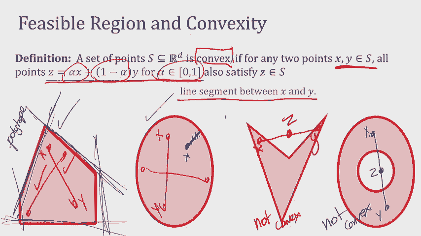

考虑目标函数 `f(x) = cᵀx`。我们可以画出它的**等值线**（或水平集），即所有使得 `cᵀx = k` 的点构成的集合。对于不同的 `k`，我们得到一系列平行的直线（或超平面）。

求解线性规划，相当于在可行域内寻找一个点，使其所在的等值线对应的 `k` 值最大（对于最大化问题）。几何上，这就像将这条等值线沿着其法向量方向（即目标函数梯度方向）不断平移，直到它即将离开可行域。最后接触到的可行域的点（或边界）就是最优解。

一个关键结论是：**对于有最优解的线性规划，至少有一个最优解出现在可行域多面体的某个顶点上**。顶点是多个约束超平面的交点。

---

## 求解算法初探 ⚙️

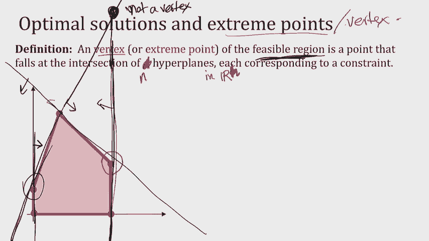

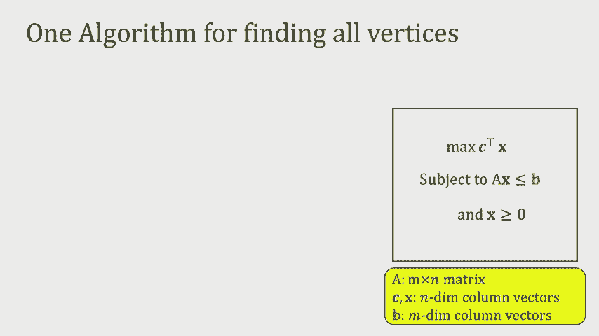

既然最优解出现在顶点，一个最直接的算法就是：枚举所有顶点，计算目标函数值，然后取最大值。

**朴素顶点枚举算法**：
1.  从 `m` 个约束中，选出所有大小为 `n`（变量个数）的子集。
2.  对于每个子集，将对应的不等式取等号，求解这个线性方程组，得到一个候选点 `x*`。
3.  检查 `x*` 是否满足所有其他 `m-n` 个约束。如果满足，则 `x*` 是一个顶点。
4.  计算所有顶点的目标函数值，并取最优者。

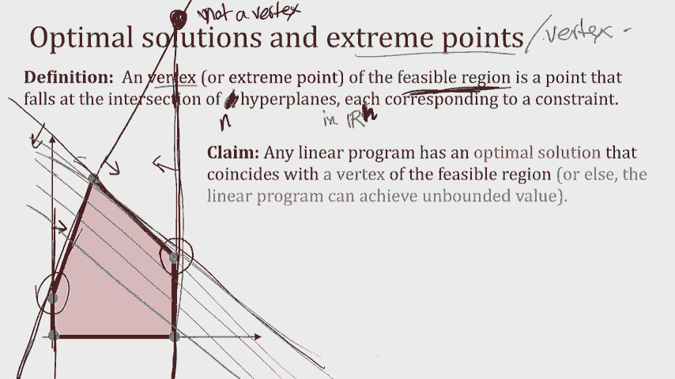

然而，这个算法效率很低。因为顶点数量可能非常多，最多可达 `C(m, n)` 个组合。例如，在一个 `n` 维超立方体（由 `2n` 个约束定义）中，顶点数高达 `2^n` 个。因此，我们需要更聪明的算法。

---

## 单纯形法简介 🔄

单纯形法是一种更实用的算法。它从一个顶点出发，沿着可行域的边，迭代地移动到相邻的、目标函数值更优的顶点，直到找不到更优的邻居为止。

**算法思路**：
1.  找到一个初始顶点。
2.  检查当前顶点的所有**邻居顶点**（即仅改变一个“活跃”约束所到达的顶点）。
3.  如果存在目标函数值更高的邻居，则移动到那个邻居顶点。
4.  重复步骤2-3，直到所有邻居的目标值都不高于当前顶点。

由于可行域是凸的，这个贪婪过程可以保证找到全局最优解（尽管路径可能不是最短的）。单纯形法在实践中非常高效，尽管其最坏情况时间复杂度是指数级的。今年（2022年）恰逢单纯形法被乔治·丹齐格提出75周年，它至今仍是解决线性规划问题最常用的算法之一。近年来，通过**平滑分析**等理论工具，研究者们正在更好地解释单纯形法为何在实际应用中如此有效。

---

## 总结 📝

本节课我们一起学习了线性规划的基础知识。
*   我们首先通过**面包店问题**和**教室分配问题**，学习了如何将实际问题建模为线性规划，并理解了**松弛**整数约束的概念。
*   接着，我们引入了线性规划的**标准形式**及其矩阵表示。
*   我们从几何角度理解了**可行域**（凸多面体）、**半空间**和**顶点**，并知道了最优解至少存在于一个顶点上。
*   最后，我们探讨了求解线性规划的两种思路：低效的**顶点枚举法**和实践中广泛使用的**单纯形法**，后者通过在山脊上贪婪行走来寻找最优顶点。

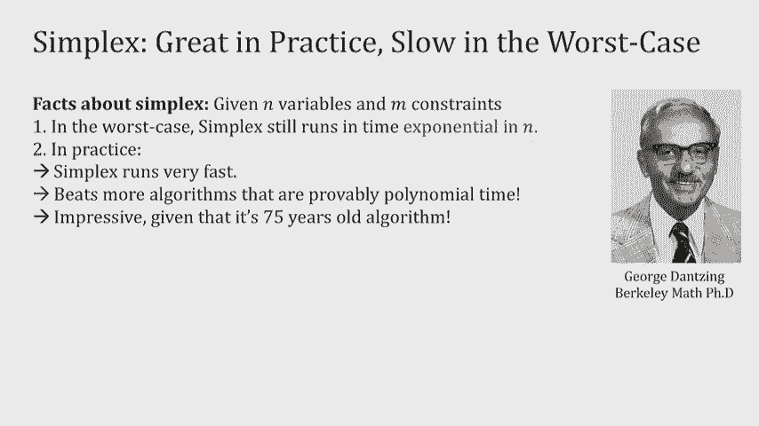

线性规划是一个强大而优美的工具，在运筹学、经济学、机器学习等众多领域有着广泛应用。理解其基本原理是运用这一工具的第一步。