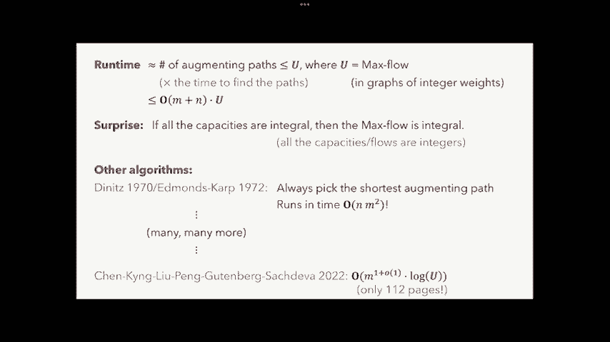

# 课程 P16：最大流问题 (Part I) 🚂

在本节课中，我们将学习网络流问题中的核心概念——最大流问题。我们将了解其历史背景、数学定义，并学习一个解决该问题的经典算法：Ford-Fulkerson算法。

---

## 概述

最大流问题旨在计算从一个源点（source）到一个汇点（sink），在给定容量限制的网络中，能够传输的最大流量。本节课我们将从历史案例引入，形式化定义问题，并探讨一个初步的贪心算法及其局限性，最终引出正确的Ford-Fulkerson算法。

---

## 历史背景与问题引入

上一节我们概述了课程内容，本节我们来看看一个有趣的历史案例，它直接催生了最大流算法的研究。

1955年，兰德公司的数学家T. Harris和退役将军F. Ross撰写了一份机密报告《评估铁路网容量的方法基础》。该报告旨在评估前苏联铁路网从东部地区向西部地区运输物资的最大能力。他们将铁路网建模为一个有容量限制的网络，源点是东部的物资点，汇点是西部的目的地。

他们最初使用了一种称为“洪水法”的贪心算法，但发现该算法有时无法找到最优解。于是，他们向同事L. Ford和D. Fulkerson求助，后者随后提出了著名的**Ford-Fulkerson算法**，并在1956年发表了论文《网络最大流》。

---

## 最大流问题的形式化定义

上一节我们看到了问题的实际背景，本节中我们来看看如何用数学语言精确地描述最大流问题。

最大流问题的输入包含四个部分：
1.  一个有向图 **G**。
2.  一个被称为**源点**的顶点 **s**。
3. 一个被称为**汇点**的顶点 **t**。
4. 对于图中的每条有向边 **e**，都有一个**容量 c(e) ∈ Z⁺**（正整数）。

**流（Flow）** 是一个给每条边 **e** 分配一个非负值 **f(e)** 的函数，它必须满足以下三个约束：

1.  **容量约束**：对于每条边 **e**，有 `0 ≤ f(e) ≤ c(e)`。
2.  **流量守恒**：对于除 **s** 和 **t** 外的任何顶点 **v**，流入 **v** 的总流量等于流出 **v** 的总流量。即：
    `∑_{(u,v)∈E} f(u,v) = ∑_{(v,w)∈E} f(v,w)`
3.  **源点与汇点**：源点 **s** 只有流出，汇点 **t** 只有流入。

一个流 **f** 的**值（value）** 定义为从源点 **s** 流出的总流量，也等于流入汇点 **t** 的总流量：
`|f| = ∑_{(s,v)∈E} f(s,v) = ∑_{(v,t)∈E} f(v,t)`

**最大流问题**的目标就是找到一个满足上述所有约束的流 **f**，使得其值 **|f|** 最大化。

---

## 一个失败的尝试：朴素贪心算法

在正式介绍有效算法之前，我们先看看一个直观但可能失败的贪心策略，这能帮助我们理解问题的难点。

以下是该算法的步骤：
1.  在图中找到一条从 **s** 到 **t** 的路径 **P**，且路径上的每条边都未饱和（即当前流量 `<` 容量）。
2.  沿着这条路径 **P** 推送尽可能多的流量（即路径上剩余容量的最小值）。
3.  重复步骤1和2，直到图中不再存在这样的路径。

**这个算法为何会失败？**
考虑一个简单的图：`s -> a -> t`， `s -> b -> t`， 并额外增加一条边 `a -> b`，所有边容量均为1。
-   如果算法第一步选择了路径 `s -> a -> b -> t`，并推送1单位流量。
-   此后，边 `s->a` 和 `b->t` 已饱和，无法再找到任何从 **s** 到 **t** 的未饱和路径。
-   算法终止，得到流值为1。但实际上，最优解是2（例如，同时走 `s->a->t` 和 `s->b->t`）。

这个例子说明，贪心地选择路径可能会“阻塞”未来更优的流。

---

## Ford-Fulkerson 算法与残差图

上一节我们看到朴素贪心算法会因过早占用边而失败。本节我们引入**残差图（Residual Graph）** 的概念，它允许算法“反悔”，从而得到正确的Ford-Fulkerson算法。

给定一个图 **G** 和一个流 **f**，其**残差图 G_f** 定义如下：
-   **G_f** 与 **G** 有相同的顶点集。
-   对于 **G** 中的每条边 `(u, v)`：
    -   如果 `f(e) < c(e)`，则在 **G_f** 中添加一条有向边 `(u, v)`，其**残差容量**为 `c(e) - f(e)`。这代表还能沿此方向推送的流量。
    -   如果 `f(e) > 0`，则在 **G_f** 中添加一条有向边 `(v, u)`，其**残差容量**为 `f(e)`。这代表可以沿相反方向“退回”的流量，用于抵消原有的流。

**Ford-Fulkerson 算法** 步骤如下：
1.  初始化流 **f** 为0（即所有边 `f(e)=0`）。
2.  **While** 在残差图 **G_f** 中存在一条从 **s** 到 **t** 的路径 **P**（称为**增广路径**）：
    -   令 **δ** 为路径 **P** 上所有边残差容量的最小值。
    -   沿着路径 **P** 在残差图中推送 **δ** 单位的流量。
        -   对于 **P** 中的正向边，这意味着增加原图中该边的流量。
        -   对于 **P** 中的反向边，这意味着减少原图中对应正向边的流量。
    -   更新残差图 **G_f**。
3.  输出当前的流 **f**。

**算法演示**
以之前失败的图为例：
1.  初始流为0，残差图即原图。选择路径 `s-a-b-t`，推送1单位流量。
2.  更新残差图：`s->a`, `a->b`, `b->t` 容量减为0，并添加反向边 `a->s`, `b->a`, `t->b`，容量均为1。
3.  在新的残差图中，存在路径 `s->b->a->t`（其中 `b->a` 是反向边）。沿此路径推送1单位流量。
4.  最终，原图中的有效流为：`s->a->t` 和 `s->b->t` 各1单位，`a->b` 边上的净流量为0。总流值为2，即最大流。

---

## 最大流最小割定理

Ford-Fulkerson算法为什么正确？其理论基础是**最大流最小割定理**，这是网络流理论中最核心的结论之一。

**定义：s-t 割**
一个 **s-t 割 (s-t Cut)** 将顶点集 **V** 分成两个不相交的子集 **L** 和 **R**，其中 `s ∈ L`， `t ∈ R`。
该割的**容量**定义为所有从 **L** 指向 **R** 的边的容量之和：
`cap(L, R) = ∑_{u∈L, v∈R, (u,v)∈E} c(u,v)`

**定理：最大流最小割定理**
在任何网络中，从 **s** 到 **t** 的**最大流的值**，等于所有 **s-t 割**中的**最小容量**。
即：`max |f| = min cap(L, R)`

**定理的证明思路（也是算法正确性证明）**
1.  **弱对偶性**：任何流的流量不可能超过任何割的容量。因为所有从 **s** 到 **t** 的流量都必须穿过割的边。
    `|f| ≤ cap(L, R)` 对于任意流 **f** 和任意割 **(L,R)** 成立。因此，`max |f| ≤ min cap(L, R)`。
2.  **强对偶性/算法构造**：当Ford-Fulkerson算法终止时，残差图 **G_f** 中不存在 **s-t** 路径。定义 **L** 为在 **G_f** 中从 **s** 出发能到达的所有顶点集合，**R** 为其余顶点。
    -   由于没有 **s-t** 路径，必有 `t ∈ R`，所以 **(L, R)** 是一个合法的 **s-t** 割。
    -   在残差图中，所有从 **L** 到 **R** 的边容量为0。根据残差图的定义，这意味着在原图中：
        -   所有从 **L** 到 **R** 的边都已饱和（流量 = 容量）。
        -   所有从 **R** 到 **L** 的边流量为0。
    -   因此，当前流 **f** 的流量值正好等于该割 **(L, R)** 的容量：`|f| = cap(L, R)`。
3.  结合1和2，我们找到了一个流 **f** 和一个割 **(L, R)**，使得 `|f| = cap(L, R)`。由于流的值不可能超过最小割容量，所以这个 **f** 就是最大流，而这个割就是最小割。

---

## 算法运行时间与改进

最后，我们来分析一下Ford-Fulkerson算法的效率，并了解其改进版本。

**基本Ford-Fulkerson的运行时间**
-   每次找到一条增广路径并推送流量。
-   如果所有容量都是整数，则每次增广至少增加1单位流量。
-   因此，增广次数不超过最大流的值 **U**。
-   每次寻找路径（如使用DFS/BFS）需要 **O(m)** 时间（m为边数）。
-   总运行时间为 **O(U * m)**。

**问题**：当最大流值 **U** 非常大时（例如，容量本身很大），该算法是**伪多项式时间**的，即运行时间与输入数值的大小相关，而非输入长度（二进制编码长度）的多项式。

**改进：Edmonds-Karp 算法**
这是Ford-Fulkerson算法的一个特例，规定**每次总是选择边数最少的增广路径**（通过BFS寻找）。
-   该算法能保证增广次数不超过 **O(n * m)** 次（n为顶点数）。
-   因此，总运行时间为 **O(n * m²)**，这是一个真正的多项式时间算法，不依赖于容量值的大小。

**现代发展**
最大流算法研究活跃，目前已知的最快算法运行时间接近 **O(m)**，是过去二十年理论计算机科学的重大突破之一。

**一个重要性质：整性定理**
如果网络中所有边的容量都是整数，那么Ford-Fulkerson算法（及其许多变种）一定会找到一个**整数值的最大流**（即所有边上的流量都是整数）。这个性质在许多组合应用中至关重要。

---

## 总结

本节课中我们一起学习了最大流问题。
1.  我们从历史案例出发，理解了问题的实际意义。
2.  我们形式化定义了流、流量值以及最大流问题。
3.  我们分析了一个朴素贪心算法失败的原因。
4.  我们引入了**残差图**这一关键概念，并学习了经典的**Ford-Fulkerson算法**，该算法通过允许“撤销”流来找到最优解。
5.  我们探讨了算法正确性的基石——**最大流最小割定理**，并理解了其证明。
6.  最后，我们讨论了算法的时间复杂度及其改进方向。

下节课我们将继续探讨最大流问题的应用及其相关算法。