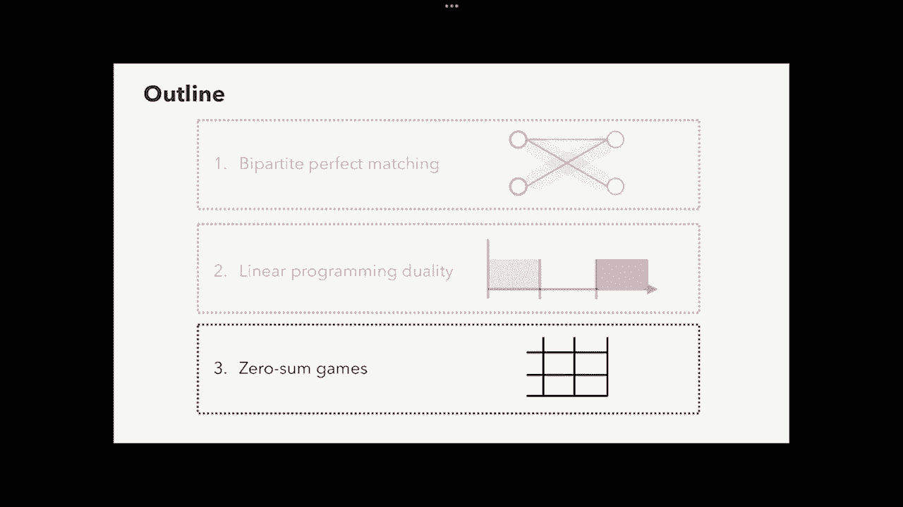
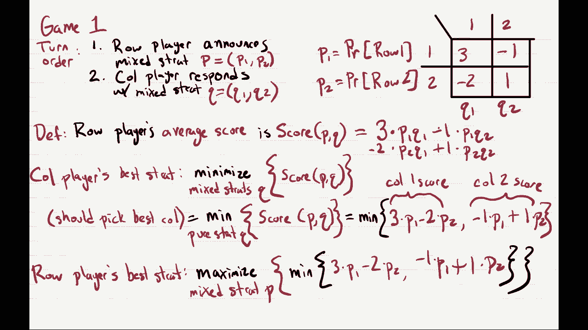

# P17：Lec17 Network Flow (Part II) - 东风渐起UCAS - BV1o64y177K8

好啦，现在是12点40分，那么让我们开始今天的课，嗯，今天我们继续探索线性规划，我们将讨论一个很酷的话题，叫做线性规划，二元性，一如既往的第一，去做些行政工作，所以嗯。

我要做这个实验或者继续我上次提到的这个实验，我不确定，如果你们更喜欢，如果我做了幻灯片或没有幻灯片，上一节课我们看了幻灯片，第二堂课我们还将看到前半部分的幻灯片，然后我要切换到手写，后半段注意事项。

下节课我会手写，然后我会进行民意调查，无论哪一个占多数，呃好吧，我们看看会发生什么，然后呢，好啦，上次有人让我提前贴幻灯片，嗯，我以为他们发布在网上，但我刚检查过，他们不是。

我五个小时前就要求把它们发布在网上了，我现在就去看看，嗯是的，我又一次匆匆忙忙地给我们的课程工作人员打了电话，如果有人能把它们发到网上，所以希望，不是现在就是讲座进行到一半，他们会突然出现，但是是的。

我目前没有看到他们在上面，所以我为此道歉，但是是的，休息到一半我再告诉你，如果他们起来了，万一你需要他们跟着，关于期中考试的两件事，所以阅读成绩申请的截止日期被延长了，我想从一天到星期二晚上。

尽快得到你的降级，很快就要期中考试了，两周后的11月7号，很明显我们会有复习会议，很快细节就敲定了，当我们有，嗯，很快就会有更多的想法，然后好好做作业，作业九今晚发布，然后作业十接下来就发布了，星期一。

对呀，那么今天这堂课的提纲，它有点像各种线性规划相关主题的抓斗袋，他们都不够大，不能自己讲课，所以我们将从这个问题的简短讨论开始，二部完全匹配，然后我们将讨论今天讲座的主题，即线性规划对偶性。

然后我们要完成，不管我们还有多少时间玩零和游戏，我们可能会完成它，这节课我们可能要进入下节课，所以事不宜迟，让我从我们今天要讨论的第一个问题开始，就是这个二部完美匹配的问题，所以在二部完美匹配中。

你的输入将是一个二分图，所以它的顶点集被分成两部分，左边一组l和右边一组是，我们假设两个集合有相同数量的顶点，我们将调用顶点数，图就是无向的，所以一个例子，这样的图就是这个，在这里我们在左边有四个顶点。

右边四个顶点，一些边缘，他们都没有导演，而这个问题的输出，我们的目标是找到顶点的完美匹配，那么左顶点和右顶点之间的完美匹配是什么呢，嗯，这只是左顶点和右顶点的配对，所以你把他们配对，所以说，所以说。

左边的每个顶点都与右边的一个顶点匹配，右边的每个顶点都和左边的一个顶点匹配，所以我在这个例子中强调了一个例子，啊，它总是和它的邻居之一相配，所以你只能考虑在两个顶点相邻的情况下匹配配对。

所以你在图中指定完美匹配的方式，只是边缘的一个子集，它有一个属性，在匹配中，每个顶点u都与一条边相邻，r中的每个顶点v都与匹配的一条边相邻，好啦，所以这就是我们要解决的问题，让我给你们举一个例子。

您可能想应用这样的问题，那其实是，一个类似于猪高球教授前面描述的例子，嗯，在上一节课中，当激励线性规划时，所以在这个例子中，这将是一个将课程与教室相匹配的例子，这是伯克利在每个学期开始时都要做的事情。

所以我们可以对这个问题建模，可能左边的顶点，你在伯克利的每门课程都有一个顶点，所以这些顶点中的一个对应于，伯克利的每个教室都有一个右顶点，然后你就在课程和教室之间有了优势，如果那门课能在那个教室里教授。

所以你知道，有各种各样的限制告诉你，当你有一门可以在教室里教授的课程，例如，这门课我们需要一个大教室，它必须有一个投影仪我们需要能够有录音，这就施加了某种限制，哪些教室允许我们使用，现在你可以说。

给定这个图，其中规定了哪些课程可以在哪些教室，你想知道是否有完美的匹配，如果有一个完美的匹配，我想说的是，我们能把每节课分配到一个房间吗，这意味着每节课都可以在某个地方教授，而且每个房间都有一个班。

所以这意味着我们没有多余的房间闲置，所以说，当然啦，只有当你在教室里有完全相同数量的课程时，这才会奏效，所以这又是一个玩具问题，但这正是伯克利需要解决的问题，每学期一次，关于设置有什么问题吗。

所以如果不是，2。我们将研究如何解决这个问题，我们将看看如何解决它，通过将其转换为最大流的实例，上一节课我们已经看到了如何解决最大流问题，所以如果我们能把它转换成一个最大流的实例。

那么我们也可以解决这个问题，所以我们要做的是，我们要把这个图G，我们要把它修改成一个流动网络，我们称之为g质数，我们把它修改成这个流网络的方法如下，嗯首先，我们只取g，我们要重写所有相同的顶点。

所有相同的边缘，然后呢，我们要做的第一件事是修改所有这些边缘，使他们有方向，因为如果你还记得最大流量问题，你需要定向边缘，所以我们要把所有这些边缘，所以他们指向右边，下一个是最大流量。

我们需要一个源顶点和一个同步顶点，所以我们要引入一个新的顶点，我们称之为s，这是我们的源顶点感觉我很大声，所以让我，好啦，也许那样更好，嗯，所以我们要引入一个源顶点，然后我们从源顶点加一条边。

到l中的每个顶点，边缘会从左到右，然后呢，嗯，我们还将在右边引入一个同步顶点，称为T，我们将从r中的每个顶点加一条边，指向T，最后对于一个最大流问题，我们必须指出每个边缘的容量，所以。

我们要做的是在每个边缘增加一个容量，在g素数中，如果你还记得，我们称之为单位容量情况，单位意味着一，这指定了我们的流量网络，如果g有一个完美的匹配，那么g素数的最大流量为n，如果g素数的最大流量是n。

那么g有一个，好啦，所以现在我要向你证明这一点，如果这是真的，这就意味着我们总能判断出我们是否有完美的匹配，通过在这个图上运行一个最大流算法，看看我们是否得到一个大小为n的流，好啦。

这就是我们的图G素数，我只是再写一遍，在右边，这和我们在上一张幻灯片中看到的一样，再一次，我们的目标是证明g有一个完美的匹配，当且仅当g素数的最大流等于n，为了证明这一点，我们要把它分成两箱。

右蕴涵与左蕴涵，所以第一种情况是正确的暗示，它指出如果g有一个完美的匹配，那么g素数的最大流量等于n，好啦，所以让我们假设G有一个完美的匹配，让我成为完美的匹配，所以这种完美的匹配，只是会是。

我用蓝色画的边缘的一些子集，嗯，l中的每个顶点都与r中的一个顶点匹配，反之亦然，而现在，我将用它在图中构造一个大小为n的流，我要做的方法如下，我将沿着匹配m的每个边放置一个单位的流量。

所以所有这些蓝色的边缘，现在有一个单位的流量从左到右，我还要加一个流量单元，从S出来的每一条边，所以左边的这些边现在都有一个单位的流量，最后我要在每个边缘加入一个单位的流量。

所以右边的所有边缘都有一个单位的流量进入它们，我声称这只是一个大小N的流，那么你如何检查它是一个大小为n的流，它必须满足几个限制，其中之一是流量值总是非负的，但我所有的流量不是零就是一。

我的一些边缘有一个单位的流量，我的一些边缘没有任何流动，我还要检查流量是否超过容量，但我所有的流量都有价值一，我在上一张幻灯片上的容量都设置为一个，最后你要检查的是，对于L中的每一个顶点，流入等于流出。

但是这个顶点，你知道它是一元流，它有一条边来自S，然后它也有一个流出来的，因为它有一条边在匹配中与之匹配，所以对于l中的每个顶点，它的流入等于流出，R也是一样，最后一件事是，我们只需要检查流的大小是n。

但是我们可以看到仅仅因为s有n个单位的流量，这就是我们如何计算，好啦，所以这证明了案例一，关于第一个案子有什么问题吗，在l中的任何顶点都会有一个值1的传入流，以及随之而来的价值流，好吧。

还是提醒我你的名字丹尼尔酷，谢谢其他问题，对于案例一，是啊，是啊，所以你是说，我们如何构造这个图，好呀，是啊，是啊，嗯，是这里的源顶点，它对l中的每个顶点都有一条出边。

我们在每一个流出的边缘放一个单位的流量，所以每一个从s出来的边都有一个流量单位，对于汇顶点t也是类似的，每一个进入t的边都有一个单位的流量，这有道理吗，你叫什么名字？所以玛雅，谢谢其他关于这个的问题。

最大流量，如果我运行一个最大流算法，它将指定输出，将指定每个边缘上的流，所以在这种情况下，如果这是最大流量，它是什么，它会告诉你每一个边缘，它的流量要么为零，要么为一，考虑到所有这些值。

您可以通过查看从s流出的总流量来计算最大流量，你叫什么名字？所以现在是案例一，让我们看看相反的方向，好啦，所以第二种情况是相反的暗示，它指出如果我们在g素数中有一个大小为n的最大流。

那就意味着我们有一个完美的匹配，这个更有趣一点，因为，嗯，你知道的，完美的匹配，就像一件非常离散的事情，每条边要么完全匹配，要么不完全匹配，但是最大流量，流量值可以是小数，所以在最大流量下。

你可以有价值的流量，任何边缘上的一半或四分之一或任何数字，它们不一定是0或1，那么我们如何将这样的流转化为，匹配，它只是一个零或一个值，为了这个，我们将利用我们在上一节课上看到的这种令人惊讶的事实。

上面说如果图表上的容量是积分的，意味着它们总是整数值，然后最大流量，在最大流中获得的流值，也可以被认为是积分的，原因是，在所有容量都是整数的情况下，然后福特富尔克森算法，我们证明了输出最大流量。

总是输出一个积分的最大流量，所以这意味着对于这个问题，如果有大小为n的最大流，那么我们甚至可以假设最大流量是积分的，所以我们要做的是，我们将设f为这个图中的一个积分最大流，大小n的G素数。

现在如果它是一个积分最大流量，这意味着它只能为每个边缘分配整数量的流，但每条边都有一个容量，这意味着您的流只能分配，每条边都是零或一，所以你的流只是选择边缘的子集，所以我要画，是啊，是啊。

所以f中的所有流值都是0或1，所以说，我把边的子集，流选择蓝色，嗯，因为它的尺寸是n，从s出来的每一条边都必须在流中，每一个进入T的边缘都必须在流动中，然后我们还将在中间选择一些边缘。

然后可能有些边缘不是，我声称如果我们看任何顶点，左边的U，所以也许这个顶点，它必须在一个出口边缘有一个单位的流量，嗯，这是因为它有一个单位的流来自s，因为流入等于流出，它必须有一个单位的流量出去。

所以这个东西把一个单位的流发送到r中的某个顶点，同样地，r中的每个顶点都有一个输入流的单位，流入等于流出这个顶点，例如，它有一个单位的流量，所以它必须有一个单位的流量从某个地方进来，所以，就是说。

l中的每个顶点都有一个流单元被发送到另一个顶点，In r，r{\displaystyle r}中的每个顶点都有一个来自于一个顶点的流量单位，在L，所以如果我们删除所有的边缘，除了中间的那些。

这意味着这些实际上必须指定一个匹配的，l中的每个顶点都必须与r中的一个顶点正好配对，匹配的大小必须是n，那是第二种情况，关于第二个案子有什么问题吗，是啊，是啊，所以r中任意顶点的出边。

我们知道向外的边缘必须有一个，所以进入的总流量也必须是1，因为流动是积分的，这意味着正好有一条边进来了，那是1的流值，所有其他进入的边缘都有一个零的流量值，你叫什么名字？陪审团，谢谢，更多问题。

你是说可能会有，你在想为什么，是啊，是啊，你叫什么名字，Julian，好啦，所以朱利安问，为什么我们没有一些小量的流量，也许从L到R，在最大流量下绝对是可能的，你可以有少量的流量，但是嗯，我们又用了。

上节课讲到如果能力是整体的，然后我们总是可以假设我们在每个边缘上都有一个整数量的流量，那只是因为福特，Fulkerson总是构造这种类型的流，所以如果我在这张图上运行福特焦点和算法。

我总是会得到积分容量或积分流量，这回答了你更多的问题吗，穿过，或者你是说也许这个，我们怎么知道它显示了流量，这种流动而不是像这边缘的一个单元，是啊，是啊，想做吗就像一个去正确的一个，是啊，是啊，所以说。

很抱歉，嗯，我们不一定知道这只是为了这个图，但是嗯，你这样做的方式是，你运行一个最大流算法，我们在上一堂课上看到了如何构造一个正确的最大流算法，所以它会知道如何做到这一点。

它将遵循这些步骤来寻找增强路径，真的不明显，为什么耶，就像，我想用那个算法，但没有什么超级清楚的，否则，我会说，你叫什么名字？你叫什么名字，Akuna，所以是的，问题是怎么办，我们也要做同样的过程。

既然我们已经把它从右到左引导了，我们是不是也要从，还是对不起，既然我们已经从左到右做了，我们也要从右到左做吗，做一次就够了，因为，嗯，我们刚刚构建了匹配所需的边缘，所以从左到右。

我的流必须穿过一个匹配从l到r，我们可以从右到左二，但无论我们选择哪种方式，我们只需要做一次，还有一个问题，是啊，是啊，问得好，你叫什么名字？哦耶，所以问题是，如果总是存在一个积分最大流。

还是每个最大流都有积分值，至少假设能力是不可或缺的，答案是，它只是表明存在一个最大流，所以说，例如，如果你回顾一下上一节课的幻灯片，嗯，我们从第一张幻灯片开始，我们谈到了最大流量，我有两次相同的图表。

我在图中给出了两个不同的最大流量，其中一个是积分，另一个是小数，它们都是最大流量，好啦，这就是证据，然后嗯，所以说，是呀，得出了这个定理，所以这意味着，如果我们要解决完美匹配，我们可以跑，嗯。

此图上的最大流算法，在计算机科学中，语言与理论语言，我们把这叫做我们刚才所做的，从完全匹配问题到最大流量问题的归约，降价只是一种幻想，计算机科学，说话的意思是，我们给出了一种技术。

将完美匹配的实例转换为最大流的实例，所以我们会在几节课中看到更多的减少，他们是一种面包和黄油，计算机科学中有很多非常有趣的算法，嗯，但只是是的，就像把别针放进去一样，一周左右你会看到更多这样的东西。

好啦，所以这就解决了完美匹配，现在让我们进入今天演讲的主题，即线性规划对偶性的主题，激励它，让我们记住我们在上一堂课上看到的这个定理，即最大流量最小割定理，上面说如果我有一个图表。

图中的最大流量总是等于图中的最小切口，这很好，因为它总是让我们证明，如果我们真的找到了一个最佳流程，所以如果我有一个流程，我声称它是最佳的，你不必相信我，我可以证明给你看只要展示一个同样价值的切口。

如果我有一个与流量相同的切口，那么这意味着流量是图中的最大流量，所以嗯，你可能会问，为什么会这样，我是说，我们只是运气好，答案是否定的，它实际上是线性规划的一个非常普遍的性质，嗯。

上次我们也看到最大流问题可以重述为线性规划，这是一个一般性质，不仅仅是被称为线性规划对偶性的最大流线性规划，所以我们将在这节课中看到这一点，嗯，这本书对二元性做了很大的阐述，它称之为魔术，是啊，是啊。

我不太确定我称之为神奇，但是好吧，我让你们决定，也许在最后，我拉你们，看看你们有多少人认为这很神奇，它其实是非常，非常酷，这有点令人惊讶，好啦，所以为了激励它，让我们只是我要写下。

就像一个非常简单的线性程序，我们将用它作为一个运行的例子，所以这个线性规划有一个目标函数，它将有两个变量，x1和x2，它的目标功能是要求我们最大化，五x一加四x二，受三大约束。

第一个约束是2 x 1加x 2最多等于100，第二个约束是x 1最多是30，第三个约束条件是x2小于60，然后我们还将有另外两个约束，所以实际上，总共有五个限制，这些对我们来说会稍微不那么有趣。

但这些都是默认情况下的约束，即x 1和x 2总是非负的，所以它们比零大，所以嗯，假设我把这个线性程序输入一个线性程序求解器，然后它会做的是，它将输出以下解决方案，所以x1等于20，x2等于六十。

它声称解的值等于340，所以首先让我们检查一下这是否是这个线性规划的有效解，它的价值是三百四十，x1和x2，都不是阴性，所以这很好，嗯，这口井，x 1肯定小于或等于30，因为它是20，然后x2等于60。

一定小于等于六十，然后2 x 1加x 2正好等于100，所以它也满足了这个约束，所以这绝对是一个可行的解决方案，那么它的客观价值只是20的5倍，一百加四乘以六十，四乘六等于二百四十。

所以是一百加二百四十，三点四十，所以这就是解决办法，我把它给你，我声称实际上，这是线性规划的最优解，问题是也许你没有线性规划求解器，或者我们甚至不相信线性规划求解器，所以有没有办法让我们证明给自己看。

这个解实际上是最优解，好啦，这样做的一种方法如下，嗯，或许我们应该，好啦，这里就像一个建议的方法做这件事，嗯，让我们来看看我们的一些约束，并将它们结合起来，看看我们能不能用有趣的方式把它们结合起来。

得到目标函数的边界，所以说，例如，这里的约束x小于等于30，让我们假设我把它乘以五，然后我去第二个约束，我把它乘以4，然后我把这两个加起来，好啦，我康复了什么，如果我加上它们。

我得到5 x 1加4 x 2的上界是5乘以30，加4乘以60，“这口井是什么？”，你知道5乘以30等于150，四乘以六十等于二百四十，你把这些加起来，你得三百九十，所以这给了我们一个上限。

也就是说5x1加4x2至多等于3，三百九十，5x1加4x2等于我们的目标函数，所以这实际上告诉我们，只要我们满足我们的约束，我们永远不会做得比三百九十更好，那很好。

但这还不足以证明我们的解决方案是最优的，所以也许我们可以做得更好，好啦，让我再举一个例子，也许我们采取第一个约束，乘以三，第二个乘以零，第三个乘以一，我们把它们加在一起，我们得了什么病。

我们得到2 x 1乘以3，六乘一，然后x2会乘以3再乘以1，所以我们得到4 x 2，然后我们得到一个3乘以100+60乘以1的上界，加起来只有三百六十，所以我们找到了一个更好的方法来结合它们，哦耶。

也就是说6x1加4x2最多是360，六乘一加四乘二肯定比，五x一加四x二，因为x 1是非负的，好的，好的，所以增加更多的x 1不会伤害我，这告诉我们，我们的目标函数。

5 x 1加4 x 2的上界是360，这几乎证明了我们的解决方案是最优的，好啦，所以你可以花一整天的时间来寻找不同的方法来添加这些，嗯不同的行，最终你可能会偶然发现最好的方法。

最好的办法是把第一行乘以五，为什么是五个半，不太明显，第二行乘以零，然后第三行乘以三半，如果你把这三个不等式加在一起，你得到的是那么好，你得到2 x 1乘以5，那是五乘一，然后嗯x2。

它被乘以五个半和三个半，所以五个半加上三个半就是四个，那最多就是，五减半乘以一百加三减半乘以六十，好啦，五的一半乘以一百等于多少？我猜是二百五十三的一半乘以六十是九十，所以250加90等于340。

这证明了5 x加4，五x一加四x二，我们的目标是，总是以340为界，从而证明了这个解实际上是最优解，有人质疑我刚才所做的，是啊，是啊，好问题，你叫什么名字？亨利，于是亨利问，你允许使用负系数吗。

在这种情况下没有，我们只会使用正系数，原因是就像，如果我把这个乘以一个负数，就会扭转不等式的方向，它就像一个大于或等于，你不能加，大于等于，小于或等于，是啊，是啊，你叫什么名字？雷，是啊，是啊。

我们只是尝试了很多下一张幻灯片，我们走着瞧，我们如何系统地做到这一点，并设计一个算法来找到最佳的组合，这里有问题吗，啊，我们会看到它实际上是多项式时间，你已经问过了，你叫什么名字？Js。

或者是有人在这里问了一个问题，我去问问，我们怎么知道那是最优的，但是，嗯，有一个系统的方法来做这件事，我们也知道这是最优的，因为它与我们的解决方案相匹配，所以我们买不到比340更好的了。

因为我们已经有了一个价值340的解决方案，好啦，所以是的，我们如何使这个算法，我们如何将此系统化，所以让我试着抽象一下，我们刚才做了什么，这又是完全相同的线性规划，右边的两个约束。

如果我们想把这个系统化，我们要做的是，我们会说，嗯，我们从第一个方程不等式开始，我们把它乘以一个非负的数，叫做y1，然后第二个不等式，我们把它乘以不同的数字y2，然后第三个不等式。

我们把它乘以一个不同的数字y3，然后我们就把那些，我们把它们加在一起，现在呢，当你把这些加在一起时会发生什么，你在左手边会看到这样的表情，所以x 1乘以2 y 1，然后也被你们两个。

所以我们得到2y1加y2x1，然后x2，它会乘以y1和y3，所以我们得到y1加y3乘以x2，上界是100乘以y1加30乘以y2，再加上六十乘以三，我们的目标是用它来推导出目标函数的上界。

所以我们要做的是，我们要确保，左手边的这个数字比我们的目标函数大，或者这个这个，不管这个的左手边是什么，我们希望它比目标更大，所以无论我们设置什么，你知道你们两个，我们希望它比5X1加4X2大。

如果我们这样做，前提是它大于目标函数，嗯，我们希望右手边尽可能小，这将给我们最好的范围，所以让我用数学符号写下我刚才说的话，这将告诉我们这些y变量的约束，首先我们要最小化100倍y。

再加上30乘以y 2，再加上六十乘以三，越小的，我们得到的更好的约束，这个不等式的手边大于我们的目标函数，嗯，啊，我们也希望所有的y i都是非负的，这是我们的第一个约束，我们有三个限制。

三个y变量是非负的，现在我们希望左手边比目标函数大，所以我们肯定需要x 1前面的值，也就是5，它应该小于等于2y1加y2，也就是x 1的系数，我们还需要x 2上的系数，4小于等于x2上的系数。

如果这两个条件都得到满足，那就意味着我们的目标函数小于，或者等于这个的左手边，因此我们的上界是，它的右手边，所以换句话说，按建筑，嗯，这告诉我们5 x 1加4 x 2，总是小于等于一百倍y 1。

再加上30乘以y 2，再加上六十乘以三，只要我们的y满足这五个不等式，现在呢，有谁能告诉我，在最下面的东西上优化了y，嗯很好，你叫什么名字？麦克斯，好的，所以麦克斯说，这不只是另一个线性规划吗。

答案是肯定的，这是另一个线性规划，所以这只是最小化y的线性函数，受Y的五个不平等限制，所以这只是一个线性规划，所以每当你有一个线性程序，最大化线性规划，它总是有一个相应的最小化线性规划。

它将给出一个上限，嗯，你只要遵循同样的食谱，当你有这对线性程序，最大值和比它大的最小值，第一个叫做原线性规划，第二个叫做对偶线性规划，这告诉我们对于原线性规划的每一个解，值小于。

或等于程序中对偶的任何解的值，所以特别是，原线性规划中的最佳值总是小于，或等于对偶线性规划中的最佳值，换句话说，原始LP选择小于或等于对偶LP T，这就是魔术，我们可以重写的事实。

我们可以把线性程序转换成不同的程序，嗯，得出一个好的上界的方法来自，另一个线性规划非常令人惊讶，这完全不是你所期望的，关于这个的问题，是啊，是啊，你能再加一层吗，双重LP大问题，你叫什么名字？

Ozone，所以臭氧说得很好，我们取一个线性程序和它的对偶程序，我们能不能把对偶线性规划，答案是肯定的，原来，对偶的对偶正好等于原始的，这就是线性规划对偶性的惊人效果，其他问题，啊，伟大的伟大的问题。

你叫什么名字，Rhan，所以我们现在只知道原线性规划，是啊，是啊，如涵问，我们知道他们总是平等的吗，嗯，我们看看会发生什么，在几张幻灯片中，我们对此了解多少，目前我们所知道的是原数小于或等于对偶。

我们现在只知道这些，很好让我想起了是的，那么为什么我们需要这两个约束，嗯，我们需要目标函数，5x1加4x2小于，或者等于这个不等式的左手边，如果它小于不等式的左手边，然后它也小于不等式的右手边。

右手边是我们要绑定的，这有道理吗，这里好像多了一只手，一个很好的问题，你叫什么名字？阿尔纳夫，所以是的，这正是嗯，如果我们想要原始的上界，我们去双，如果我们想在对偶上有一个下限，我们去原始。

还有一个问题，是啊，是啊，答案是，我想不是不，是啊，是啊，不幸的是，我们没有，嗯，所以再一次，对偶，如果我们取对偶的对偶，我们会得到原始值和原始值，可能会小于或等于对偶，我们只知道，你知道的。

其中一个比另一个大，我可以把右手边尽量缩小，因为右手边是目标函数的上界，我们试图尽可能地得到目标函数的最佳范围，因为如果我给你一个原始线性规划的解，我怎么知道这是最优的，嗯，嗯，我必须找到一些约束。

告诉我，我不能做得更好，这有道理吗，好啦，所以这是一个线性规划对偶，你只需要记住这些，在整个课程中你如何知道，我们会给你线性程序，让你计算对偶，所以你得习惯这样做，有另一种方法涉及矩阵，这样更紧凑。

更容易计算，虽然在我看来，这有点不太容易理解，但它很光滑，所以我要给你看，虽然当你实际做线性规划时，您可能会发现上一张幻灯片上的方法更好，让我用标准形式写出原线性规划，所以霍格塔拉布教授。

几节课之前介绍了一种涉及矩阵的标准形式，原始线性规划只是，目标函数是目标向量c和变量的点积，在向量x中，然后我们所有的限制，我们可以把它们写成一个大的矩阵向量乘积。

所以我们把所有的约束放入一个单一的A矩阵中，然后我们计算这个矩阵和x变量的乘积，然后它小于或等于某个b向量，然后我们还有一个额外的约束，x变量大于，或等于零，所以这就像是最大化线性规划的标准形式。

任何线性程序都可以转换成这种形式，我只想告诉你食谱，如果我把这个给你，你如何构造对偶，我不会向你证明这就是你所做的，但你所要做的就是按照上一张幻灯片上的步骤，并将证明我将要告诉你的。

所以给出原始的对偶线性规划如下所示，我在这里写了max，我是说小敏，我忘了纠正这个，所以对偶将是一个最小化，不是最大值，它是，它将是一组叫做y的新变量的最小化，所以这个Y是新的，乘以b向量。

它曾经是约束的右手边，它受到很好的影响，它所受到的限制是，现在我们把它转置，我们把它乘以y，它大于或等于c向量，C矢量曾经在我们的目标中，现在是我们不平等的右手边，最后我们有了那个Y，y变量是非负的。

这正是我们在上一张幻灯片中看到的矩阵形式，这是值得的，我想在家里验证一下，我们已经看到的定理叫做弱对偶性，它声明如下，如果我有原线性规划的可行解x，所以任何左手边线性规划的解，那么它的价值将小于。

或等于对偶线性规划的任何可行解y的值，尤其是，最佳x的值小于或等于最佳y的值，我们在上一张幻灯片中再次看到了这一点的证明，用一个小例子，同样的证据在这里也有效，但现在我要向你展示终极的光滑证据，好啦。

所以说，我们想要任何可行解的值的上限，原始线性规划，让我写出可行解的值，嗯，值只是目标函数，就是c转置乘以x，现在我们要给这个值上界，现在我们要应用我们的不等式和上界。

我们要做的第一件事就是注意这里的c，我们知道在对偶线性规划中，你总是可以取c，上界是转置乘以y，现在在左边，你知道我们有c转置，所以我们必须，你知道的，用转置应用不等式，如果我们这么做了。

它只是说c转置最多是y转置乘以a，所以如果我把一个，a转置乘以y，我得到y转置乘以a，这就给出了y转置x的上界，现在从原始线性规划，我们知道x最多等于b，所以我们可以用y转置乘以b来确定它的上界。

现在y转置b，那只是Y的点积，等于转置乘以y，b转置乘以y是多少，嗯，不是别人，正是对偶线性规划的目标函数，所以我们看到目标函数，这个x解的值是y解的值的上界，现在你可以凭直觉说出刚刚发生了什么。

如果你想要直觉，转到上一张很有意义的幻灯片，如果你想要只在一条线上工作的东西，你用幻灯片，作为我们所看到的推论，这告诉我们原始的LP选择是上的，受双LP约束，对此有疑问吗，是啊，是啊，是啊，是啊，达伦。

对呀，所以达伦问，是啊，是啊，我们如何做这第一步，嗯，我们只是来这里，我们要做的是上界c转置，我们要用那个，在对偶线性规划中，它告诉我们c最多总是一个转置乘以y，这意味着c转置是y转置乘以a的上界。

这就像转置规则，就像c转置乘以x正好是y的上界，换乘x有意义吗，所以让我把我们刚才看到的画出来，我们已经两次证明了弱对偶性，所以从图片上看，弱对偶性看起来像什么，如果我们画出这些线性规划的目标值。

我把它画在这个轴上，所以越大的客观价值就越大，如果你解原始线性规划，它会有一个最佳值，可能是由这条线给出的，任何可行的解，都小于，或等于此最佳值，所以也许在这个灰色地带。

这是你能在原始中得到的所有客观值，然后对偶会有更大的客观值，因为它的上界和对偶，也许你可以，你知道这是一个，这是一个最小化，所以无论最优是什么，您可能会得到比它更大的值。

所以让我把这些值的整个区域用红色画出来，这正是弱对偶性所说的对偶性比原始对偶性大，客观价值之间有差距，这就是所谓的对偶差距，我们希望对偶差距为零，我们得到了一个更好的约束，对偶差距越小。

所以实际上有一个定理叫做强对偶性，其中声明如下，如果原始LP选择是有界的，这意味着原始的LP选择是由一个数限定的，所以它不像无穷大，那么原始的lp-opt实际上等于对偶的lp-opt，换句话说。

在这种情况下，对偶差距为零，所以对于大多数有趣的线性程序，你写下来的都是有界的，得到无穷远的值是不可能的，在每一个这样的情况下，那么原始值和对偶值具有完全相同的客观值，我觉得这真的很神奇。

证明比我们在本课程中所涵盖的要困难得多，不幸的是，让我举一个强二重性的例子，所以我们之前看到最大流量等于图中的最小切口，它是上界的，但实际上，你知道的，我们花了一些时间，通过向前聚焦来证明他们是平等的。

最大流量，我们也看到它可以写成线性程序，现在呢，我们没有看到的是，最小割也可以写成线性程序，事实证明，如果我很好地，这两个线性规划是什么关系，他们只是彼此的对偶，和最大流量线性规划，它总是有界的。

因为我永远不可能通过一个图发送无限数量的流，只要所有的容量都是有限的，所以这个定理直接告诉我们最大流量等于最小切口，所以这只是一个非常，强对偶性的非常特殊的情况，你们会在背诵课上看到。

所以您将看到如何转换，你会明白为什么最大流量对偶等于最小切割对偶，所以我建议去参加朗诵会，我认为这是一个很酷的事实，关于这个的问题，嗯如果不是，然后我想说几句关于二元性的历史。

我不知道你以前是否见过这个角色，但我不知道我们在以前的讲座中是否提到过他，但是研究线性规划的核心人物之一，这个叫乔治但泽的家伙，所以他是线性规划的共同发明者之一，所以实际上在20世纪上半叶。

在美国很多地方都有人，乔治但泽也在俄罗斯或苏联，思考线性规划的人，他也是发明单纯形法的人，所以你知道这仍然是目前许多人在实践中使用的方法，我今天发现了这个，我不知道这个，但他实际上是伯克利的研究生。

有一个故事与单纯形和LP对偶性无关，我会告诉你哪个是，嗯，你可能以前听过这个，听起来像是都市传说，但其实这家伙是真的，嗯，所以他我想，当他在伯克利的时候，他就像上了一堂统计学课，有一天在讲课。

教授去董事会写了两个最著名的，未解决的问题和板子上的统计数据，但是乔治但泽上课迟到了，当他到了那里，好像他没看到教授一样，问题出现了，他刚到那儿，他看到黑板上有两个问题，我们带他们去做家庭作业，所以。

嗯，是啊，是啊，他带他们回家，他研究了几天，他以为最后期限已经过了，所以有点压力，但最终他解决了这些问题，他告发了他们，你要说的就是，他们似乎比平时更难一点，嗯好吧，所以就像一个无关的事实。

但显然是个聪明人，是啊，是啊，所以乔治但泽，他发明了lps，就像他在空军工作一样，在他发明Simpleplex的时候，它们就像是一种秘密，他想知道还有什么比单纯更好的，嗯，所以他所做的是。

他决定咨询右边的这个人约翰·冯·诺依曼，他是有史以来最伟大的数学家之一，你可能在冯·诺依曼建筑公司认识他，你可能在，就像一堂介绍课，实际上这里有多少人知道这家伙听说过邦德这个名字，否，所以很多人。

所以是的，他一直是伟大的数学家，他的手指几乎参与了20世纪数学的每一个馅饼，所以乔治说，好啦，我要告诉约翰我刚刚发明的很酷的问题，所以他说，让我告诉你我的最新发明，线性规划，几分钟后他告诉约翰。

一个诺曼，约翰·诺曼就像，哦那个，然后他给但泽讲了一个半小时的线性规划，所以告诉他理论的数学基础，乔治但泽认为他发明了自己，在这个讲座的过程中，约翰，没有一个人是当场想出来的，他发明了LP对偶。

证明了弱与强，然后他还说，啊，顺便说一句，这相当于零和博弈，这也是我自己最近发明的，所以是的，乔治但泽，就像，我的天啊，是啊，是啊，有点像，完全震惊，就像这家伙的才华，而现在，嗯是的，约翰·冯·诺依曼。

他基本上被认为是LP对偶性的发现者，是线性规划史上一个非常重要的人物，但泽接受了一个很好的采访，关于线性规划起源的回忆，我建议调查一下，它让你对算法研究有了很多有趣的了解，在二十世纪中期，好啦。

这就是线性规划的全部内容，我给你们三分钟休息时间，然后我们就从零和游戏开始，约翰·博内曼发明的东西，是啊，是啊，所以三分钟，如果有人能关上后面的门，那太好了。

让我们把，对不起，我在布置，所以我会一直盯着这个，你还记得吗，我们做了完整的证明，我们得知道怎么做，我们需要麦克斯的证明吗，是啊，是啊，我想我们需要知道，你觉得我的直觉是什么因为我不明白，是啊，是啊。

这是一个复杂的证据，我是说你并不是唯一一个被它迷惑的人，对不起，我去拿笔记本电脑，嗯，我的意思是，我们看到的最大的事情是我们用了啊，在图中定义切口的算法中的Ford Focus，然后我们展示了流动。

福特福克斯和输出充满了切割的每一个边缘，所以这意味着它尽可能多地使用切口，所以对于那个伤口，就像你永远不能，是啊，是啊，是啊，是啊，所以它将利用它发送的流，那个切口肯定会，至少在最小切口上的流量。

有道理，是呀，我的意思是，这可能是什么，如果你下课后想问，它需要更长的解释，我有喜欢，我可以回答一个问题，在科里庭院里思考，但我不确定我们能不能，好啦，嗯对不起，已经三分钟了，那么。

让我们开始这节课的下一部分吧，如果有人能成为英雄，今天的英雄。

啊，谢谢你，好啦，我们确实有个英雄，现在我们要讲的是两个人的零和博弈。

我要试着把我的笔记本电脑和这里都放进去，有可能好吧，很合身，所以嗯，两人零和博弈，所以说，什么是零和博弈，嗯，我是一个零和游戏，它将像输入一样被指定，我想这将是一个回报矩阵，我们称之为收益矩阵，M。

在两人零和博弈中，会有两个球员，其中一个被称为行玩家，另一个被称为纵队球员，我们要想象他们得到了这个矩阵，这个矩阵要做的是，指定行玩家赢得的金额，所以我们要想象一下，划船的人可以玩划船。

专栏玩家可以在游戏中扮演专栏，以及行和列相交的单元格，是划船选手赢了多少钱，所以让我举一个例子，有史以来最经典的零和游戏是石头、纸、剪刀，我们将要想象的方式，排舞选手会从三排中挑一个，不管是石头剪刀布。

然后纵队球员也要玩三排中的一排，假设行的玩家选石头，列的玩家选石头，然后他们打成平手，所以两个玩家都赢不了，所以我们要加上零收益，所以两个玩家都没有得到回报，如果选手用第一排的石头。

和专栏球员的纸打得很好，纸打石头，所以专栏玩家赢了，行玩家输了，因为收益矩阵有行参与者的收益，然后行玩家的分数是负1，表明他们已经输了，如果行玩家玩石头，列玩家玩剪刀，然后划船的人赢了。

因为石头打败了剪刀，然后他们得到一个回报，意思是他们赢了比赛，所以考虑到这些规则，我们可以指定整个矩阵，我们有一个零减一，减去1 1 0，告诉我们分数，石头对不起，行玩家每行得分，他们演奏的。

一般的收益矩阵，M行玩家将能够选择一行，然后列播放器将能够选择一个列，鉴于这两部剧，我们给他们的分数如下，所以划船选手的得分是，我们进入收益矩阵，他们得到收益矩阵中的值。

那么m r c让我在这里写一个加号，然后纵队球员将赢得负，好啦，所以这叫做零和博弈，因为两个收益之和永远为零，这对每个游戏的建模都不好，但对于一个玩家获胜的游戏建模来说，它绝对是好的，另一个输了。

但你也可以用它来建模其他游戏，在那里有某种回报，一个玩家得到的金额，对方总是输，现在呢，嗯，给定一个零和博弈，我们会设想两种策略，允许球员上场，所以第一种策略，嗯，第一类策略，就像两者中更简单的一个。

这被称为纯粹的策略，在同伴策略中，我们允许行播放器或列播放器只选择一行或一列，这只是他们的策略，他们播放那列或行，所以说，例如，在石头、纸、剪刀中，纯策略的一个例子是如果行玩家总是选择岩石，你知道的。

这不是一个很好的策略，因为如果划手总是去捡石头，如果写专栏的人总是挑纸，他们就会被打败，所以总的来说，总的来说，同伴策略似乎不是最伟大的策略，嗯，你不应该出现在石头剪刀布锦标赛上。

总是计划一遍又一遍地玩一件事，那么你应该做好什么呢，你应该在你的戏剧中引入一些不确定性，这样其他玩家就不知道你要做什么了，我们要做模特的方式，你游戏中的不确定性是由概率分布决定的。

所以我们将允许你出现并抽签，你从发行版中播放，这种策略被称为混合策略，然后嗯，你知道的，我们可以把它看作是行或列上的概率分布，和等价物，我们就把它看作是概率分布，超越纯策略，好的，好的，所以说，例如。

如果我在玩石头剪刀布，我会试着玩混合策略用概率玩摇滚，三分之一，我玩纸牌的概率是三分之一，我以三分之一的概率玩剪刀，如果两个玩家玩混合策略，然后游戏如下，他们都有自己的混合策略，然后。

他们都从该行的混合策略中取样一个对等策略，玩家会有一场争吵，对于列，玩家会有一个专栏，然后他们玩同伴策略，关于石头、纸、剪刀的混合策略，我想指出一点，你有点直觉，使用正确的方法是最好的策略。

值得注意的是，如果我玩这个混合策略，值，我的平均得分，如果说我是排球员总是零，实际上总是零，不管纵队队员做什么，所以也许纵队球员总是自己玩摇滚，如果他们那样做，然后嗯用这个混合策略，我的平均分还是0分。

也许他们用同样的混合策略，我的平均分总是零分，这就是这个策略的一般性质，事实证明，对于其他两名球员来说，零和小游戏，有类似的策略，一旦你演奏它，这是最好的办法，然后不管对方怎么做。

在这一节课和下一节课中，我们将发展这种策略的理论，关于零和游戏的设置有问题吗，是啊，是啊，在后面，我们是取每行还是每列的平均分问题是，嗯，我想如果双方都有混合策略，我想我们将看看如何计算。

就像游戏的价值，下一张幻灯片中给出的策略，但我们会取平均值，行玩家的选择和列玩家的选择，这回答了你的问题吗，你叫什么名字？杰森其他问题，是啊，是啊，嗯很好，是啊，是啊，如果零和游戏中的行玩家玩第R行。

列播放器播放C列，然后你就像矩阵的RC条目一样，就像这样，在矩阵中指定一些条目，行玩家将赢得矩阵中的值，列玩家将赢得矩阵的负值，所以列播放器实际上是试图在矩阵中得到尽可能多的负值，因为这给了他们高分。

行玩家只是试图得到尽可能大的正值，有道理吗？你叫什么名字？好的，好的，所以，嗯，我猜，今天我们将有时间来考虑玩这个游戏的一种方法，就像这个游戏的一个小变体，然后嗯，我就把这个游戏叫做第一。

然后我们看第二场比赛，下节课，所以在第一场比赛中，我实际上要在这个游戏中指定一个回合顺序，让我写下我要在这里使用的游戏，所以我要用这个作为一个运行的例子，一个非常简单的游戏，两个玩家只有两个选择。

你在这里看到的收益，是啊，是啊，所以他们想，他们想最大化负矩阵值，这和最小化有意义的矩阵值是一样的，所以嗯，在这个游戏中，我要让划船的人先宣布他们的策略，然后专栏玩家会宣布他们的策略。

所以他们会有一个顺序来宣布他们的策略，现在呢，如果划船者总是被迫宣布一个纯粹的策略，那将是不公平的，就像石头剪刀布，如果他们必须先宣布我要玩摇滚，然后纵队球员总是知道他们要做什么，因此。

要求他们先宣布同行战略是不公平的，所以我们将允许角色扮演者，宣布的灵活性和力量，只有混合策略，所以在这种情况下，是啊，是啊，所以划船者开始宣布一个混合策略，如果你还记得，混合策略只是对行的分布。

所以我们这里有两排，所以行上的分布就是p1和p2，这里的p 1是他们采样第一行的概率，P2是他们对一行进行采样的概率，现在纵队球员第二，他们可以宣布自己的策略，所以他们会宣布他们会做出回应。

看到了划船者的策略和他们自己的混合策略，再一次，他们的混合策略将被称为Q，只是一个逗号，Q2，这是两个选项的概率分布，Q1是他们玩第一列的概率，Q2是他们玩第二列的概率，又是专栏选手，他们得到回应。

所以他们看到了划手的策略，他们可以为自己选择最好的策略，所以考虑到他们宣布的这两种策略，我们可以确定比赛的比分，这将是行玩家看到的平均分，所以角色扮演者，平均分，我们要把它写成分数p q。

因为它是由两个分布定义的，他们使用的混合策略，我们要思考的方式如下，所以这将是，你知道的，他们得到的期望值，与概率，让我们说，嗯啊，P one，行玩家样本行1和概率q 1，专栏玩家取样专栏一。

如果行玩家得到第一行，列玩家得到第一列，然后他们降落在这个牢房里，他们得了三分，所以在这种情况下，分数是三，它的概率是p乘以q，类似于我们在这个单元格中得到负1分的概率，是p 1乘以q 2。

所以这是加号，还是对不起，减去1乘以1，Q2，然后我们可以填写其他条目，这是-2乘以p2，一加一乘以二，这就是平均分，你知道划船运动员他们想做什么，他们想选择一个最大化这一点的p。

列播放器希望选择一个队列来最小化这一点，好啦，所以让我们把自己想象成一个专栏玩家，所以行家先走，他们宣布了一个P，这将是他们的行策略，现在列玩家将为自己选择最好的队列，所以纵队球员，你知道的。

如果他们玩得很聪明，他们会做的是，他们只会挑最好的球杆，给定行播放器选择的p，如果他们这么做，那么游戏的价值，排球员的平均得分将是最小化，专栏玩家可以选择分数p，Q，对呀，这就是专栏玩家要做的。

但让我们把专栏作者的选择更像，在本例中，列播放器，他们有两个选择，对呀，他们可以选一个专栏，第二栏，或者两者的混合，但既然他们知道兄弟玩家的策略，他们很清楚如果他们玩第一列会得到什么价值。

如果他们玩第二栏，他们会得到什么价值，实际上这对他们最有利，只要从两个中挑一个最好的，如果它们在两者之间平均，对他们来说只会更糟，他们应该选择最好的专栏，这一列将使它们的值最小化，所以是的，专栏玩家。

我是说，如果他们愿意，他们可以采取混合策略，但实际上，他们应该总是采取同伴策略，因为他们排在第二位，如果他们这么做了，那么游戏的价值不仅仅是最小化混合策略，这相当于最小化对等策略，在这种情况下。

他们得到了分数p，这是一个混合策略，在Q中，哪一个是他们的同伴策略，好啦，所以让我们再考虑一下，所以让我们实际计算，在这个游戏中，列玩家为每列获得的值是多少，所以再一次，专栏播放器。

他们只是要去两个专栏，所以让我们看看他们是否玩了第一栏，这场比赛的比分是多少？如果他们玩第一栏，然后行玩家，你知道的，概率为1，排球员要打第一排，然后他们会得到3分，概率为p2，排球员要玩第二排。

他们会得到负2分，所以，如果列播放器播放第1列，分数是3乘以1，减去2乘以p2，所以这里是柱子，一分，如果他们选择第二栏呢，嗯，如果列玩家玩第二列，嗯，概率为1，他们会得到负1的值。

在概率为p2的情况下，分数将是加1所以如果纵队球员玩第二纵队，分数是负1乘以p1加1乘以p2，这是第二栏的分数，好啦，这就是纵队球员要做的，他们只会从这两个数字中选择对他们最好的一个，现在行玩家先走。

行玩家知道我是否，我将选一个p，并给出我选择的行，列播放器将完全这样做，他们会选择对他们更好的专栏，他们会得到这两个数字的最小值，但排球员想让比赛得分最大化，所以赛手最好的策略是选择。

无论哪种混合策略都能使这个数量最大化，所以是的，行玩家最佳策略，嗯，他们会最大化他们能做的所有可能的混合策略，他们想做的是最大化他们将得到的价值，他们得到的价值就在这里，这就是专栏玩家。

如果纵队球员发挥最佳，这将是游戏的价值，所以他们想最大化两个数字中最小的p，三乘一，减去2乘以p2，然后负1乘以p 1加1，所以这就像是行玩家可以实现的最佳值，如果他们先走。

如果他们被迫先宣布他们的战略，现在呢，下节课我们会看到这个数字，他们可以用线性规划计算出他们的最佳策略，列播放器也可以计算它们的值，他们用线性规划的最佳策略，这两个线性规划是相互对偶的。

那么我们下期再见。

