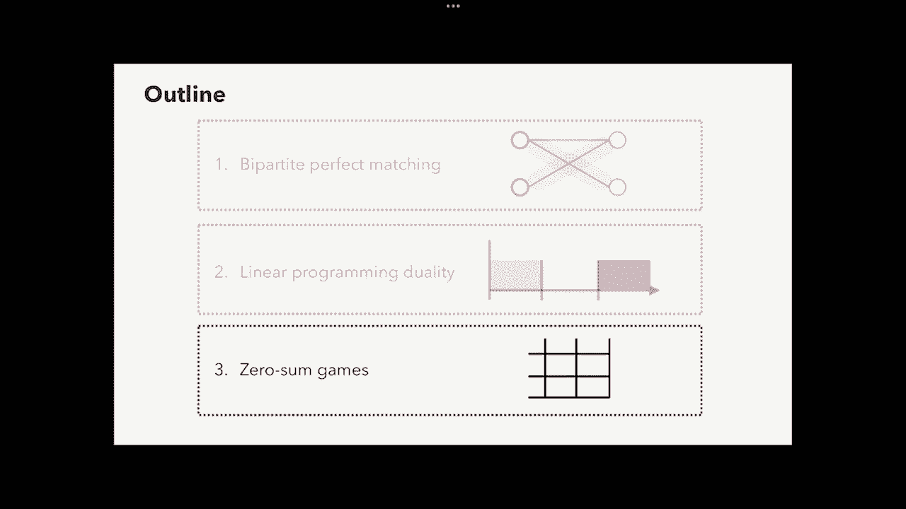
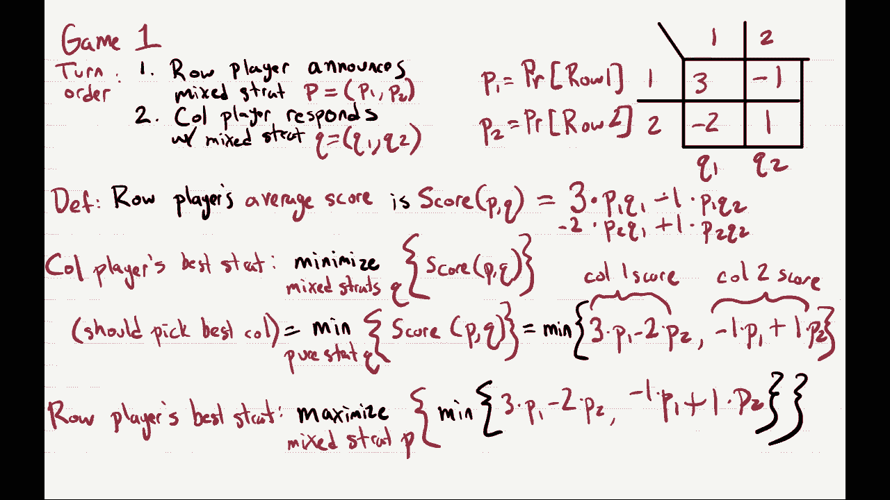

# 课程 P17：网络流（第二部分）与线性规划对偶性 🧮

在本节课中，我们将继续探索线性规划，并学习一个被称为“线性规划对偶性”的核心概念。我们将从一个具体问题——二分图完美匹配——开始，然后深入探讨对偶性理论，最后初步了解两人零和博弈。

***

## 二分图完美匹配问题

上一节我们介绍了最大流问题及其算法。本节中，我们来看看如何利用最大流算法来解决另一个经典问题：二分图完美匹配。

### 问题定义

给定一个二分图 `G`，其顶点集被划分为两个大小相等的部分：左集合 `L` 和右集合 `R`。图是无向的。目标是找到一个“完美匹配”，即一个边的子集 `M`，使得 `L` 中的每个顶点都与 `M` 中的一条边相连，`R` 中的每个顶点也与 `M` 中的一条边相连。

**应用示例**：将课程与教室匹配。`L` 中的顶点代表课程，`R` 中的顶点代表教室。如果某门课程可以在某个教室授课，则在它们之间连一条边。完美匹配意味着每门课都能被分配到一个教室，且每个教室都有一门课。

### 转化为最大流问题

我们可以通过构造一个流网络 `G'` 来将完美匹配问题转化为最大流问题。

以下是构造步骤：
1.  保留原图 `G` 的所有顶点。
2.  将 `G` 中所有连接 `L` 和 `R` 的无向边改为从 `L` 指向 `R` 的有向边。
3.  引入一个源点 `s`，并添加从 `s` 到 `L` 中每个顶点的有向边。
4.  引入一个汇点 `t`，并添加从 `R` 中每个顶点到 `t` 的有向边。
5.  将 `G'` 中所有边的容量都设为 `1`。

**核心定理**：图 `G` 存在完美匹配，当且仅当流网络 `G'` 的最大流值为 `n`（`n = |L| = |R|`）。

### 定理证明

证明分为两个方向。

**情况一：如果 `G` 有完美匹配 `M`，则 `G'` 的最大流为 `n`。**
*   **构造流**：沿着匹配 `M` 中的每条边，从 `L` 到 `R` 发送 `1` 个单位的流量。同时，从源点 `s` 到 `L` 中每个顶点发送 `1` 个单位流量，从 `R` 中每个顶点到汇点 `t` 发送 `1` 个单位流量。
*   **验证**：该构造满足容量约束（所有边容量为 `1`）和流量守恒。从 `s` 流出的总流量为 `n`，因此这是一个大小为 `n` 的流。

**情况二：如果 `G'` 中存在大小为 `n` 的最大流 `f`，则 `G` 有完美匹配。**
*   **关键性质**：由于 `G'` 中所有容量均为整数（`1`），根据 Ford-Fulkerson 算法，存在一个**整数值**的最大流 `f`。这意味着每条边上的流量非 `0` 即 `1`。
*   **构造匹配**：考虑所有从 `L` 指向 `R` 且流量为 `1` 的边，这些边构成了一个边集 `M`。
*   **验证**：因为流值为 `n`，所以从 `s` 出发的 `n` 条边流量均为 `1`，这意味着 `L` 中每个顶点都有一条出边流量为 `1`。根据流量守恒，`R` 中每个顶点也恰好有一条入边流量为 `1`。因此，`M` 构成了 `L` 与 `R` 之间的完美匹配。

这种将一个问题（完美匹配）转化为另一个已解决问题（最大流）实例的技术，在计算机科学中称为“归约”。

***

## 线性规划对偶性 ✨

上一节我们通过最大流最小割定理，看到了最优值相等的一个例子。本节中我们来看看其背后更普遍的原理——线性规划对偶性。

### 动机：验证最优解

考虑一个简单的线性规划（原问题）：
*   最大化：`5x1 + 4x2`
*   约束：
    1.  `2x1 + x2 <= 100`
    2.  `x1 <= 30`
    3.  `x2 <= 60`
    4.  `x1, x2 >= 0`

假设求解器给出解 `(x1, x2) = (20, 60)`，目标值 `340`。如何验证这是最优解？
我们可以尝试组合约束来得到目标函数的上界。例如：
*   将约束1乘以 `2.5`，约束3乘以 `1.5`，然后相加：
    `(2.5*2x1 + 2.5*x2) + (1.5*x2) <= 2.5*100 + 1.5*60`
    化简得：`5x1 + 4x2 <= 250 + 90 = 340`
这证明了目标值不可能超过 `340`，结合我们已有的解 `340`，便证明了其最优性。

### 系统化方法：构造对偶问题

我们将上述“组合约束”的方法系统化。引入三个非负变量 `y1, y2, y3`，分别乘以原问题的三个约束：
`y1*(2x1 + x2) + y2*(x1) + y3*(x2) <= 100y1 + 30y2 + 60y3`
左边整理为：`(2y1 + y2)x1 + (y1 + y3)x2`

为了让左边成为 `5x1 + 4x2` 的上界，我们需要：
1.  `2y1 + y2 >= 5`  (对应 `x1` 的系数)
2.  `y1 + y3 >= 4`    (对应 `x2` 的系数)

为了得到最紧的上界，我们希望右边 `100y1 + 30y2 + 60y3` 尽可能小。
于是，我们得到了一个新的线性规划——**对偶问题**：
*   最小化：`100y1 + 30y2 + 60y3`
*   约束：
    1.  `2y1 + y2 >= 5`
    2.  `y1 + y3 >= 4`
    3.  `y1, y2, y3 >= 0`

### 形式化定义与弱对偶性

一般地，原问题（最大化）的标准形式为：
*   最大化 `c^T x`
*   满足 `A x <= b` 且 `x >= 0`

其对偶问题（最小化）为：
*   最小化 `b^T y`
*   满足 `A^T y >= c` 且 `y >= 0`

**弱对偶性定理**：对于原问题的任何可行解 `x` 和对偶问题的任何可行解 `y`，都有 `c^T x <= b^T y`。
**推论**：原问题的最优值 `<=` 对偶问题的最优值。

**证明概要**：
`c^T x <= (A^T y)^T x = y^T (A x) <= y^T b = b^T y`
第一步用了对偶约束 `A^T y >= c`，第二步用了原约束 `A x <= b`。

### 强对偶性与意义

**强对偶性定理**：如果原问题有有限的最优值（即不是无穷大），那么原问题的最优值**等于**对偶问题的最优值。

这是线性规划中一个深刻而优美的结论。它意味着，对于一大类优化问题，最大化问题和最小化问题通过这种方式耦合在一起，它们的最优值相同。**最大流最小割定理就是强对偶性的一个特例**（最大流和最小割线性规划互为对偶）。

***

## 两人零和博弈初探 ♟️

线性规划对偶性有一个著名的应用场景：分析两人零和博弈。本节我们先介绍基本概念。

### 问题设定

一个两人零和博弈由一个**收益矩阵** `M` 定义。
*   **行玩家**选择一行 `i`。
*   **列玩家**选择一列 `j`。
*   行玩家获得收益 `M[i][j]`，列玩家获得 `-M[i][j]`。收益之和恒为零。

**例子：石头剪刀布**
收益矩阵（行玩家视角）：
|       | 石头 | 剪刀 | 布   |
|-------|------|------|------|
| 石头  | 0    | 1    | -1   |
| 剪刀  | -1   | 0    | 1    |
| 布    | 1    | -1   | 0    |

### 纯策略与混合策略

*   **纯策略**：玩家确定性地选择一个行（或列）。这很容易被对手针对。
*   **混合策略**：玩家按照一个概率分布来选择行（或列）。例如，在石头剪刀布中以各 `1/3` 的概率随机出拳。

### 行玩家先手的博弈

考虑一个简单博弈，收益矩阵如下：
|     | C1 | C2 |
|-----|----|----|
| R1  | 3  | -1 |
| R2  | -2 | 1  |

假设行玩家必须先公布其混合策略 `p = (p1, p2)`（`p1 + p2 = 1, p1, p2 >= 0`），然后列玩家再选择策略应对。
*   行玩家的期望收益为：`E = 3*p1*q1 + (-1)*p1*q2 + (-2)*p2*q1 + 1*p2*q2`
*   列玩家后手，看到 `p` 后，会选择使其自身收益最大（即行玩家收益最小）的列。实际上，列玩家只需比较两个纯策略（选C1或C2）哪个更好，而无需使用混合策略。
    *   若列玩家选C1，行玩家收益为：`3*p1 + (-2)*p2`
    *   若列玩家选C2，行玩家收益为：`(-1)*p1 + 1*p2`
*   因此，对于给定的 `p`，行玩家最终能获得的收益将是上述两个值中的**最小值**：`V(p) = min(3p1 - 2p2, -p1 + p2)`
*   行玩家先手，目标是选择一个 `p` 来**最大化**这个最小值：`max_p V(p)`

这个“最大化最小值”的问题，可以通过线性规划来求解。有趣的是，列玩家在另一种情境下（列玩家先手）的最优策略问题，会形成一个与之对偶的线性规划。我们将在下节课深入探讨。

***

## 总结

本节课我们一起学习了三个主要内容：
1.  **二分图完美匹配**：我们学习了如何通过构造一个单位容量的流网络，将完美匹配问题归约到最大流问题，从而利用已有算法解决它。
2.  **线性规划对偶性**：这是本节课的核心。我们了解了如何为任何最大化线性规划构造一个最小化对偶规划，并理解了弱对偶性（原问题最优值 ≤ 对偶问题最优值）和强对偶性（在有界情况下，两者相等）这一强大而优美的理论。
3.  **两人零和博弈**：我们初步接触了博弈论的基本模型，看到了在行玩家先手的设定下，其最优策略问题可以形式化为一个线性规划，这为下节课用对偶性分析博弈奠定了基础。

线性规划对偶性揭示了优化问题中最大化与最小化之间的深刻联系，是算法与优化理论中一个不可或缺的工具。