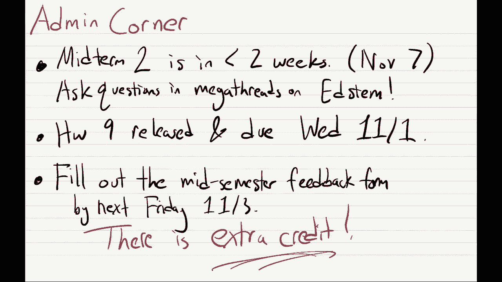
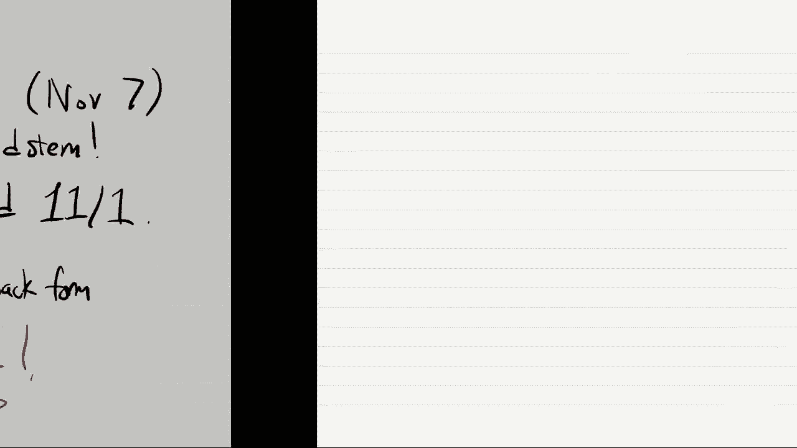
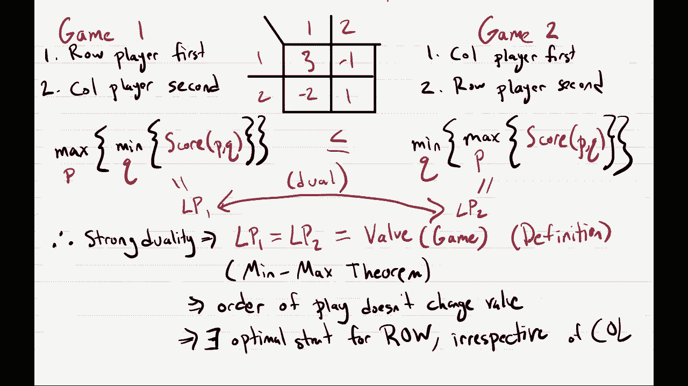
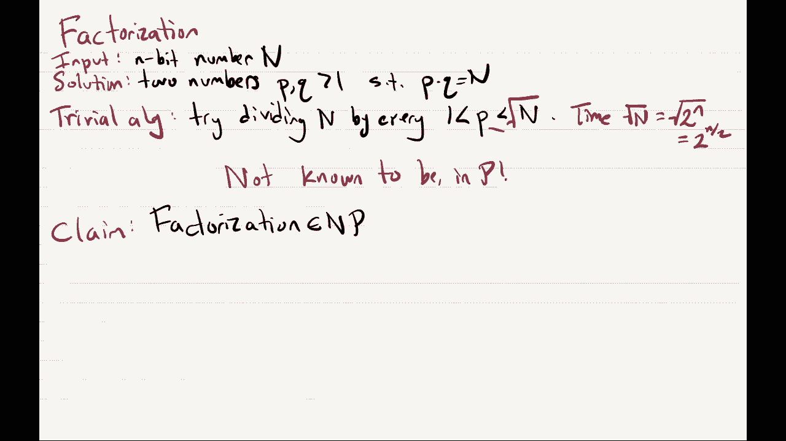

# 课程 P18：Lec18 零和博弈 🎮

在本节课中，我们将要学习两个玩家的零和博弈。我们将首先回顾上一节课的核心概念，然后探讨不同行动顺序下的博弈策略，并展示如何用线性规划来计算最优策略。最后，我们将引入计算复杂性理论中的P和NP类，为后续学习奠定基础。

## 课程管理与回顾 📝

上一节我们介绍了两个玩家的零和博弈。本节中我们来看看课程的一些行政安排，并回顾上一节课的核心内容。

首先，期中考试将在11月7日举行。作业九已经发布，下周三截止。此外，我们发布了期中反馈表，用于收集大家的意见以改进课程。例如，根据已有反馈，我们可能会调整作业量。

现在，让我们从回顾上一节课的最后一张幻灯片开始。

## 零和博弈基础 🧮

我们研究的是两个玩家的零和博弈。这类博弈由一个矩阵指定，矩阵中的条目代表收益。游戏中有两个玩家：行玩家和列玩家。行玩家选择一行，列玩家选择一列。行列交汇处的单元格数值表示行玩家的收益，而列玩家的收益是该数值的相反数。因此，行玩家试图找到数值最大的单元格，列玩家则试图找到数值最小的单元格（因为其收益是单元格数值的负值）。

上节课我们定义了两种策略。一种称为纯策略，即玩家固定选择某一行或某一列。但我们看到，纯策略通常效果不佳，因为对手可以轻易预测并做出最佳应对。因此，玩家应该在策略中引入不确定性。

这种带有不确定性的策略称为混合策略。混合策略是在纯策略集合上的一个概率分布。对于行玩家，是行上的分布；对于列玩家，是列上的分布。在游戏中，双方各自选定其混合策略，然后根据该分布采样出最终的行动。

## 行动顺序的影响：行玩家先动 🔄

上一节我们介绍了纯策略和混合策略。本节中我们来看看当博弈有行动顺序时会发生什么。

我们首先考虑第一种情况：行玩家先行动。行玩家首先选择并公布其混合策略。这可以表示为一个分布 `(p1, p2)`，其中 `p1` 是选择第一行的概率，`p2` 是选择第二行的概率，且 `p1 + p2 = 1`。

行玩家公布策略后，列玩家可以观察到该策略，并据此选择自己的（混合）策略作为回应。列玩家的策略是列上的分布 `(q1, q2)`。

然而，对于后行动的列玩家来说，实际上不需要使用混合策略。他们只需计算针对行玩家策略 `(p1, p2)` 下，选择每一列所能获得的平均收益，然后总是选择平均收益最低的那一列（因为列玩家希望最小化行玩家的收益）。因此，列玩家的最佳反应是纯策略。

给定行玩家的策略 `(p1, p2)`，如果列玩家总是选择第一列，行玩家的平均收益为 `3*p1 + (-2)*p2`。如果列玩家总是选择第二列，行玩家的平均收益为 `(-1)*p1 + 1*p2`。列玩家会选择使行玩家收益最小化的那一列，因此，最终行玩家的收益将是这两个数值中的最小值：`min(3p1 - 2p2, -p1 + p2)`。

行玩家预见到列玩家的这种最优反应，因此会在所有可能的混合策略 `(p1, p2)` 中，选择能使上述最小值最大化的策略。即，行玩家的目标是求解：
`max over p ( min(3p1 - 2p2, -p1 + p2) )`
其中 `p1, p2 >= 0` 且 `p1 + p2 = 1`。

## 用线性规划求解最优策略 📈

上一节我们推导了行玩家先动时的优化问题。本节中我们来看看如何将其表述为一个线性规划问题。

我们可以将行玩家的问题构造成如下线性规划（称为 LP1）：
*   **目标**：最大化 `z`
*   **约束条件**：
    1.  `z <= 3*p1 - 2*p2`
    2.  `z <= -p1 + p2`
    3.  `p1 + p2 = 1`
    4.  `p1 >= 0`, `p2 >= 0`

在这个线性规划中，`p1` 和 `p2` 对应混合策略。变量 `z` 受到两个线性不等式的约束，并且我们试图最大化 `z`。这意味着，在最优解中，`z` 将等于 `min(3p1 - 2p2, -p1 + p2)`。因此，这个线性规划正好计算了行玩家在先动情况下能获得的最大化最小收益。

## 行动顺序的影响：列玩家先动 🔄

现在让我们考虑第二种情况：列玩家先行动。这与第一种情况对称。

列玩家首先公布其混合策略 `(q1, q2)`。然后行玩家观察到该策略并做出最优反应。对于后行动的行玩家，同样不需要使用混合策略，只需选择平均收益最高的那一行。

给定列玩家的策略 `(q1, q2)`，如果行玩家选择第一行，其平均收益为 `3*q1 + (-1)*q2`。如果选择第二行，平均收益为 `(-2)*q1 + 1*q2`。行玩家会选择使收益最大化的那一行，因此，最终行玩家的收益将是这两个数值中的最大值：`max(3q1 - q2, -2q1 + q2)`。

列玩家预见到行玩家的这种最优反应，因此会在所有可能的混合策略 `(q1, q2)` 中，选择能使上述最大值最小化的策略。即，列玩家的目标是求解：
`min over q ( max(3q1 - q2, -2q1 + q2) )`
其中 `q1, q2 >= 0` 且 `q1 + q2 = 1`。

同样，这可以表述为一个线性规划（称为 LP2）：
*   **目标**：最小化 `z`
*   **约束条件**：
    1.  `z >= 3*q1 - q2`
    2.  `z >= -2*q1 + q2`
    3.  `q1 + q2 = 1`
    4.  `q1 >= 0`, `q2 >= 0`

在这个线性规划中，`z` 将等于 `max(3q1 - q2, -2q1 + q2)`。因此，它计算了列玩家在先动情况下，行玩家能获得的最小化最大收益。

## 极小极大定理与博弈价值 ⚖️

我们得到了两个线性规划 LP1 和 LP2。一个自然的问题是它们之间有什么关系。

回顾一下，在第一种顺序（行先动）下，博弈值 `V1 = max_p min_q f(p, q)`。在第二种顺序（列先动）下，博弈值 `V2 = min_q max_p f(p, q)`。这里 `f(p, q)` 是行玩家在策略对 `(p, q)` 下的期望收益。

根据定义，总有 `V1 <= V2`。直观理解是，后行动者拥有信息优势，可以针对先行动者的策略做出最优反应，因此其收益不会更差。

有趣的是，LP1 和 LP2 恰好互为线性规划的对偶问题。根据线性规划强对偶定理，如果原问题和对偶问题都是可行且有界的，那么它们的最优值相等。在我们的博弈问题中，收益是有界的，因此强对偶定理适用。这意味着 `V1 = V2`。

这个结果就是**极小极大定理**（或冯·诺依曼定理）。它表明，在两人零和博弈中，无论行动顺序如何，博弈的“价值”是相同的。也就是说，存在一个最优的博弈值 `V`，使得：
`max_p min_q f(p, q) = V = min_q max_p f(p, q)`

特别地，这意味着对于行玩家而言，存在一个最优混合策略，无论列玩家如何行动，也无论行玩家是先动还是后动，采用这个策略都能保证获得至少 `V` 的期望收益。列玩家同样存在一个最优混合策略。这一对最优策略构成了该博弈的一个**纳什均衡**：在对方不改变策略的情况下，任何一方单独改变自己的策略都无法获得更优的结果。

## 从算法到复杂性：P 与 NP 类引入 🧠

以上我们完成了一个关于线性规划和博弈论的单元。现在，我们将转向一个全新的主题：计算复杂性理论，特别是 P 和 NP 类。这是算法理论中统一看待各类计算问题的重要框架。

到目前为止，本课程已经介绍了很多算法，例如：
*   多项式乘法（基于FFT，`O(n log n)` 时间）
*   最小生成树（Kruskal或Prim算法，近乎线性时间）
*   所有点对最短路径（Floyd-Warshall算法，`O(n^3)` 时间）

在理论计算机科学中，如果一个问题的解决算法其运行时间是输入规模 `n` 的多项式函数（即 `O(n^k)`，`k` 为常数），则我们认为该问题是**高效可解**的。所有这类问题的集合被称为复杂度类 **P**（Polynomial Time）。

然而，存在许多问题，我们尚未发现其多项式时间算法，但有一个有趣的性质：虽然找到解可能很难，但**验证**一个给定的解是否正确却可以高效完成。这类问题的集合被称为复杂度类 **NP**。

以下是 NP 类问题的两个例子：

**1. 三染色问题**
*   **输入**：一个图 `G`。
*   **解**：给每个顶点涂上红、绿、蓝三种颜色之一，使得任意一条边两端的颜色不同。
*   **求解**：最简单的算法是尝试所有 `3^n` 种可能的着色方案，这是指数时间。我们不知道是否存在多项式时间算法。
*   **验证**：如果给定一个具体的着色方案，我们只需检查图中的每条边，看两端颜色是否不同。这可以在多项式时间（`O(m)`，`m` 为边数）内完成。因此，三染色问题属于 NP。

**2. 整数分解问题**
*   **输入**：一个 `n` 位的大整数 `N`。
*   **解**：找出两个大于1的整数 `p` 和 `q`，使得 `p * q = N`。
*   **求解**：最简单的算法是尝试从 `2` 到 `√N` 的每个整数看是否能整除 `N`。由于 `N` 约为 `2^n`，`√N` 约为 `2^(n/2)`，这仍然是指数时间。我们不知道是否存在多项式时间算法。
*   **验证**：如果给定 `p` 和 `q`，只需验证 `p > 1`, `q > 1` 且 `p * q = N`。这可以在多项式时间内完成。因此，整数分解问题也属于 NP。

P 类问题显然是 NP 类问题的子集，因为如果能高效求解，自然能高效验证。但一个核心的未解问题是：**P 是否等于 NP？** 即，所有易于验证解的问题，是否也都易于求解？这是计算机科学中最著名的开放问题之一。

## 总结 📚

本节课中我们一起学习了以下内容：
1.  回顾了两人零和博弈的基本模型，包括纯策略和混合策略。
2.  分析了行动顺序对博弈的影响，分别推导了行玩家先动和列玩家先动时的最优策略规划问题。
3.  展示了如何将博弈策略求解问题形式化为线性规划（LP1 和 LP2）。
4.  通过线性规划的对偶性，引出了**极小极大定理**，证明了零和博弈存在确定的“价值”和最优混合策略，与行动顺序无关。
5.  开启了新的计算复杂性理论单元，定义了高效算法对应的复杂度类 **P**，以及“解易于验证”的复杂度类 **NP**，并举例说明。

下一节课，我们将继续深入探讨 NP 完全性等概念。