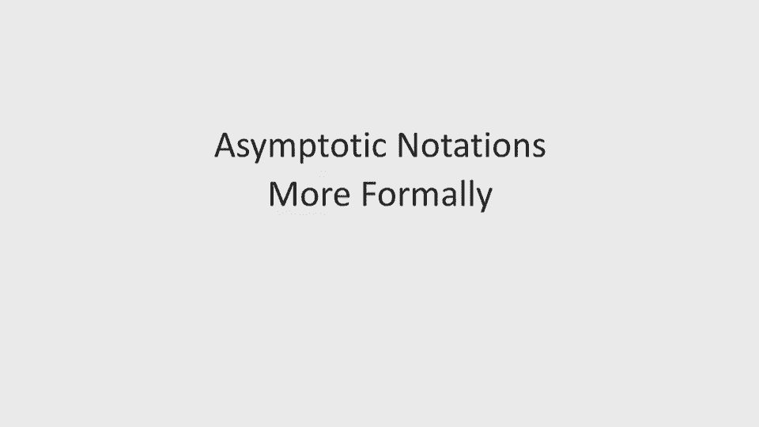
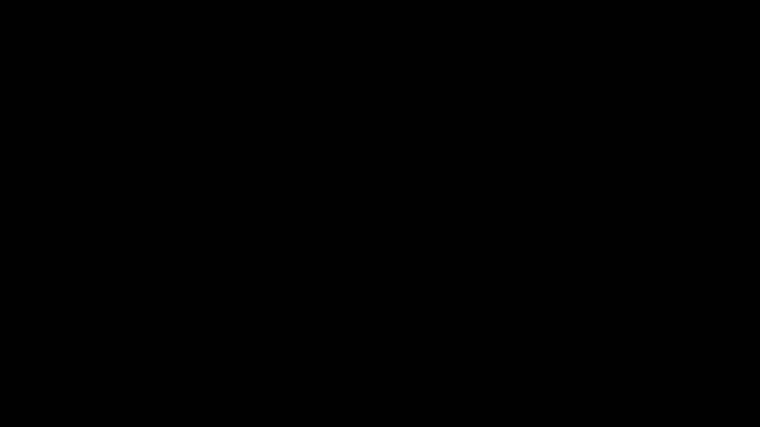
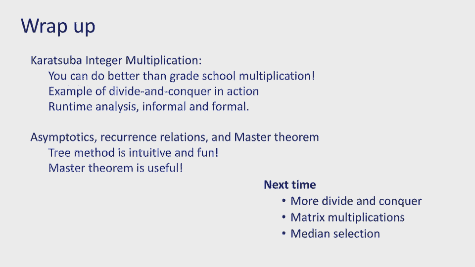

# P2：Lec2 Divide-and-Conquer (Part I) - 东风渐起UCAS - BV1o64y177K8

好啦，你们听得见吗，好啦，谢谢你，有一点回声，好啦，我们还有不到两分钟就要开始了，所以请坐，有一吨的空间，十二点三十八分，我们再等两分钟，对不起，你们在做什么，而我们等待，我怎么样，我很好，有点温暖。

这房间暖和吗？现在有点暖和，我很高兴我们度过了前半个星期的课程，现在我们从第二个完整的星期开始，现在是第一个完整的星期，所以回来真好，很高兴这学期恢复正常，夏天已经过去了，无论如何，我很好，好啦。

如果你站在门边，该坐下了，真的吗，我知道，上次我们真的有一些GSI坐在房间里，你有我没看到的GI吗，所以我只知道，好啦，我们没有，好啦，我们要开始了，让我看看，这是第二课，我们将继续分而治之。

如果你进入房间，请快点入座，空间很大，尤其是在角落里，在前面，好啦，那么我们上次的成果是什么呢，让我看看，我想我们确定我叫妮卡·哈克塔拉，有约翰，赖特，坐在那里，他今天不在，但他是另一个教练。

下周你将看到他的演讲，实际上，让我们从几个公告开始，所以首先要宣布的是，讨论部分从今天开始，所以你应该超级兴奋，他们今晚开始，其实呢，所以我想第一个大概有六七个，可能七到八年。

查看网站时间表选项卡上的时间表，然后明天一整天我们都有讨论部分，然后在周五我们有一个特定的慢节奏的叫做迷失，那么你该怎么办呢，你应该先拿到讨论表，看一看，最好是在你进入讨论区之前，你知道的。

试着解决几个问题，对你更有用，如果你看过并尝试过一些东西，而不是仅仅出现，然后不知道讨论的是什么，嗯，为协调目的，因为有很多讨论区，你们中的一些人可能对你想去哪一个有非常具体的偏好。

但其他人你可能更乐意去任何地方，所以我们知道你的需求是什么，你可以协调我们要求你报名，这是一份非正式的报名表，如果你忘了报名，没关系，在你想讨论的任何讨论中炫耀，虽然只是我们要展示。

对于其他报名的人来说，讨论会有多拥挤，所以如果你想去一个，你知道会议不是，然后如果你觉得你想要更多的时间，也许周五会对材料进行更慢的处理，我们有两个小时而不是一个小时的讨论部分，它的节奏较慢。

更专注于对事物的更深入的理解，你还可以和RTA一对一，今天发布的另一件事是家庭作业一，通常我们在周二发布家庭作业，然后让他们在接下来的时间里做，星期一，下星期一是劳动节，所以我们想让你玩得开心。

所以我们星期一没有预产期，我们星期二到期，但有一点要记住，我们也有很好的乐趣，周五和周一的家庭作业聚会，因为今天是劳动节，我们也希望我们的助教玩得开心，所以我们星期一不开家庭作业聚会。

如果你想参加家庭作业聚会，这个星期五去，好的，作业星期二交，只是下周一没有额外的办公时间或家庭作业聚会，然后我们就会回到星期二的正常发帖时间表，星期一有事情要做，其他几项通知，上次我说过我们有这门课。

在伯克利大学发电子邮件CS 170，只有我们四个人，我和约翰，有两个助教会看到的，这个班现在比我们计划的还要大，甚至会更大，所以我们需要更多的人关注它，我们也请了两名总工程师担任管理员。

所以他们也会看那封电子邮件，如果这和你有关，这需要四到六个，如果这和你有关，让我们知道，你仍然可以私下给我们发电子邮件，当然啦，但我们希望这与您无关，因为只有六个人，非常值得信赖的人看着这个，其他问题。

所以我很高兴你们引起了我们的注意，上次有几期，所以一个问题是，我们是否可以在讲座中间有一个很短的休息时间，嗯，有多少人觉得这对他们来说是一个有价值的补充，好的，好的，所以这已经足够重要了。

某个常数的分数或1的分数，所以这意味着我们要尝试做一个实验，看看这是否有效，另一个问题是，我们注意到讲座结束时有很多噪音，因为下节课开始排队，那些门一直开着，当然因为我们想让你们进来坐下。

所以我们今天要做一个实验，看看它是否有效，如果效果很好，我们会继续下去，如果没有，我们会改变主意的，所以我想我们能做的就是，我们上课的时间不多，所以我们中途休息三分钟，好吧，我要问你们的是。

至少你们中的一些人帮我关上入口处的门，嗯，这将有望实现什么，下节课他们排好队，门关着，你不会听到他们那么多，你唯一需要小心的是当你离开的时候，你当然知道开门，确保门闩正确或从其他门出去。

以便其他班级有更大的活动空间，这听起来像是今天尝试的一个好实验吗，好啦，谢谢你，所以说，我会请你们中的一些人帮我开门，因为我不会上去关上它们，如果出现任何其他问题，来找我或约翰，或者在Ed上告诉我们。

有些事情我们可能没有注意到，你想引起我们的注意，好了今天的节目就到这里，等等，还有一个，退房ED，我的助教告诉我他们已经安排了一个演讲的职位，具体问题，所以你们都可以有组织地发布关于讲座的问题。

在一个员额下，所以看看这个，这样我们就可以协调起来，确保我们理解每一节课，好啦，所以，让我们快速回顾一下上次我们做了什么，嗯，我们到处做介绍，你是谁，我们是谁，我们为什么在这里。

然后我们讨论了算法课程中的激励问题，即我们研究一个算法或设计一个算法，有用吗，快吗，我能做得更好吗，然后在技术含量上，我们所做的是，我们回到了小学，我们修正了对算术的理解，我们研究了n位数的加法。

n位数的乘法，我们做了一个分而治之的介绍，把一个大问题分解成一堆小问题，我们真正想做的是，我们看到小学的乘法算法是n的平方，我们想战胜这一切，我们认为分而治之似乎很有趣，很有希望，但这并不完全奏效。

这就是我们的分而治之，所以你记得这是一张幻灯片，从上次开始我们决定把每个整数分成两部分，上面和下面，然后我们看到每一个n位数的乘法变成4，N除以两次乘法，然后我们做了这个递归树，其实我上次是用手做的。

但这次我把它放下了，这样你就可以用更好的字体了，所以你可以更容易地看到它，我们看到至少底部的问题数量是n的平方，顺便说一下，上次有个关于零索引的问题，我们总是零索引树，那倒是真的。

所以我就把图层放在这里，这样就更清楚了，因为这边有一个问题，我记得这些是从零开始的图层，反正，我们的第一次尝试失败了，我们得到的n平方并不比n平方好，今天我们要打败n的平方，我们将用同样的技术打败它。

但稍微聪明一点的使用，到目前为止还有什么问题吗，这都是关于最后的，好吧，让我们看看我们如何做到这一点，今天的计划是我们要打败它，我们会得到一个n到1点6的算法，这就是所谓的汽车算法。

然后我们将更正式地复习一下，大O符号，大欧米茄符号，然后我们会更多地讨论复发，递推关系定理，然后是一个对递归非常有用的定理，所以让我们有一个好的开始，我们将从我们停止的地方开始，上次。

我们正在研究解决一个大问题，将两个n位数的问题相乘，上次我们把它一分为二，四位数及两位数以上的问题，没有用，但是Katsummer的想法是它不起作用，但也许我能让它起作用。

它不起作用的原因是因为我创建了四个子问题，如果我创建了一个子问题，两个子问题，三个子问题，它会帮助我，所以我能制造比预期更少的问题吗，真的在这里，主要的想法是是的，我有问题，P一P二P三P四。

这些都是我需要计算的东西，但是有n个超过2位数的乘法，也许我可以换掉中间的这个，是两个乘积的总和，作为p1p4和其他乘法的函数，所以与其制造四个子问题，我想创建三个子问题，好啦，这是高层的想法。

所以一旦你有了这个想法，您将如何实际实现这一点，有一个聪明的把戏，它实际上归功于高斯，我不记得很久以前他在哪个国家了，但是Attuba把它带到了整数乘法的算法设计中，这里的想法是实际上。

如果你想把这些数字相乘，你只需要三次乘法，这些乘法是什么，我们要把它们写成q 1，1是a乘以c，2是b乘以d，这是我们以前吃的，但这次Q3看起来不一样，是a加b乘以c加d，为什么这个好。

因为如果我把第三个q3写成乘法，减去q1和q2，我实际上得到了我在分解过程中得到的东西，这看起来像什么，我想要这个乘以d加c，也就是质数3减去质数1减去质数2，所以现在我真的只有三个问题，一，二，三。

每一个，其中只有一个是n除以二的乘法，而不是一个n位数的乘法，对此有什么问题吗，所以让我们看看，有三个已解决的问题而不是四个子问题的含义是什么，这真的会改变这个算法的大O符号吗，或者不是。

我们实际上应该查看运行时，但我还是想在这节课稍微不那么正式的部分，也就是说，与其查看所有的运行时，告诉我你认识多少人，我创建了多少个一位数乘法，这就是我要问的和上次一样的方法，但我想请你们多做一点。

这一次，好啦，所以我有一个n位数，你知道的，根，那是主要的问题，每次我把它分成3个子问题，直到我在这棵树的底部只剩下一个数字的问题，我想问的是，这些一位数的问题我还剩下多少。

所以我要求你们在六十秒内填好表格，第一个是层，所以你得弄清楚，这棵树的深度是多少？你知道最后一层是多少，然后你要计算出尺寸，每个问题在T层的位数，然后告诉我你制造了多少问题，尤其是最后，让我们花六十秒。

和你的隔壁邻居谈谈，给坐在你旁边的人填这张桌子，然后我们一起回来，好啦，再过十秒，好啦，谢谢你，所以也许我们可以一起去，我数到三，也许我们会从一些层开始，一个，二三，这棵树有多深，好啦。

我听到了N的日志，什么依据二，谢谢你有任何关于这个伟大的问题，那么T层的位数是多少，一个，两个，三个，超过两个到T，这是因为我从n开始，每一毛钱，每次我除以2，这里有问题吗？数到三。

第一层和第二层有多少问题？三个，三到T很好，最后一个盒子还剩三二一，答案是什么，好啦，好啦，嗯，我听到两种不同的写法，你是你是对的，有两条路，所以你们中的一些人说3对n的对数2，谁同意这个，是呀。

好的很好，你们中的一些人对这个说，谁说的好，你想说为什么吗，你可以把它简化，如何简化，你可以，嗯哼，然后交换完美，所以每次你有记录的东西，您可以切换，假设我有3除以n的对数2，把基地留在那里。

开关和N 3，它是平等的，你在讨论或家庭作业中也会做这样的事情，所以你会看到这个工作，这是3的对数，实际上大约是1。6，所以我们有n到1点6，完善任何问题，好啦，那么它需要多少层。

所以每一层我都把n到n的大小除以2，到n超过四，所以你能把一个数除以多少次并保持在1以上，那正是日志，好啦，这就是日志的定义，将一个数除以1的次数，还有其他问题吗？所以这给了我们。

Carrosia的算法是如此简单，我们得到了一个点的结束，上次六个，我告诉过你有更多的进展，而且是的，古墓三号或古墓厨师算法实际上使用了同样的技巧，但更聪明的，而不是从四个到三个。

它实际上是从九点到五点，所以它所做的是，并产生n/3大小的问题，而不是n超过两个大小的问题，如果我天真地做，他们会有九个人，我做得很聪明，他们只有五个人，你可以在家试试，当然在你的能力范围内。

它是先进的，从某种意义上说，把9降到5真的很烦人，其余的想法，有更好的算法，最好的是上次N登录，你们中的一个问，这也是下限和登录吗，我说我在报纸上看到的，但我不确定，我又检查了一遍，让我告诉你，这不是。

这只是一个推测的下限，好啦，这个n log n，它是n log n的下界，在某些计算模型中，这些模型远远超出了这一类，但是一般来说，我们是否知道你可以下去登录不是什么，我们知道不可能。

所以这是这个领域的一个公开问题，这是个好问题，你叫什么名字？罗翰，好啦，所以露哈说，嗯，看起来更复杂，我在这里所做的，所以在你做乘法之前，但现在我在做乘法，然后这里有一些负号，我怎么样。

我怎么能确定这实际上没有炸毁运行时，这是个很好的问题，这其实就是为什么，我们所做的不太正式，我问的是运行时是多少，但我的回答不是关于运行时，大约是一位数，子问题对，我十分钟内回来。

把同样的事情做得更正式一点，我会在高层谈论这些事情，这些成为低阶术语，我们可以证明它们对我们来说没有问题，但我要你等一下，大概十分钟才能正式看到，好啦，其他问题，二三，Q3不是，我们想弄清楚的是，否。

因为如果我看q3仍然是n除以2位数，乘法可能是n除以二加一，所以我有A和B，它们都是n除以2位数，如果我把它们加起来，我不做一个N位数，我做一个n/2，也许用一个，所以q3的大小仍然不是n乘n。

它更接近于n/2，可能加1乘以n/2，所以它仍然比x乘以y的意义要简单得多，你叫什么名字？我们已经做了，好啦，所以让我们来谈谈这里的一些小案子，我在十垒做了所有的事情，因为我们有十个手指，比较容易。

如果你想在一台没有十个手指的电脑上做呢，有两根手指，第二阶段，我们在那里做什么呢？所以我计算了一些一位数的操作，如果你想思考二进制，你应该考虑的是一位数操作，好啦，数字映射到位。

我们真正应该考虑的另一件事是，更一般地说，你如何用二进制编写这样的伪代码，这实际上是你最终必须在家庭作业中做的事情，一个是编程和一点推理，所以你要注意我接下来要说的话，因为我要让你好好用我的手。

如果我有一个整数乘法，想法还是很简单，我还是想把它分成两部分，但这次我实际上是用二进制表示的数字，好啦，所以我咬了b一b二b亿，我负责前半部分和后半部分，因为它是二进制表示的，我不打算乘以十。

n的2次方，我要把它乘以2，到二以上的幂，那么这意味着什么呢，我有左半边和右半边，让我们把它叫做左边和右边的BL和B R，不过，乘法和我之前写的一模一样，除了在二垒，所以我还在乘以左边。

把他们两个带到最后，把左右手和右手相乘，把它们乘以2得到n/2，然后乘以右手边然后哒哒哒，我会继续这样，虽然这不是在家庭作业中，再来一个，主要在编程方面，我要你做的是在家里练习，只是在数学方面。

试着做Karatsubba算法在二进制中所做的事情，这一次，看看你能不能把1点6的幂拿回来，这是一个简单的练习，你应该能做到，让我强调一下这里的想法是，这里的想法是，在基数上，取n的10次方非常容易。

因为我只写了一个然后写了一堆零，对，那是五的十倍，然后一堆零，我不需要在脑子里重复很多事情，同样在二垒，很容易想到把二乘以某物的幂，事实上，表示形式实际上与1位1相同，然后一堆零。

这就是为什么这是最简单的部分，我们实际上不需要太多的乘法或表示，然后剩下的就完全正确了，Tuous，所以这是你必须在家里和家庭作业中做的事情，一个，我们跳过的其他事情是什么，这又回到了那些问题上。

也就是，从技术上讲，我们只计算了树底部一位数操作的数量，我做了很多其他的工作，好处，缺点，所有这些，嗯，我们为什么不对此作出解释呢？我们不应该对此负责吗？答案是绝对的，我们绝对应该解释的。

我们是非正式的，我们将纠正这一点，下次做得更正式，在很高的水平上，我们将表明，所有其他额外的东西并不重要，我们可以忽略，但我们会正式证明的，好吧在那之前，我想复习一下大O符号和大Omega符号。

我想现在是我们休息三分钟的好时机，所以让我们看看是时候了，哦，几点了。

1O7会在十分之一的时候回来，如果你能站在教室后面，有人自愿关门，我听说地板上有个门闩，你得把它拉起来关上门，我可以请你们，请帮帮我，谢谢你。

你和那个，好啦，我们三十秒后回来，好啦，嗯，我们回来吧，伙计们，希望你享受了三分钟的休息时间，如果是小睡，是时候醒来了，如果不是小睡，是时候回来关注，我们现在要做一点，上次我复习了一下大o符号。

但这不是真正的复习，更像是，啊，这是你在61中学到的，我们要挖得比61英尺深一点，但我们还是要讨论一些毒性测试并对其进行更正式的审查，这次好，我们对算法的运行时感兴趣，不仅仅是一些问题。

大O符号和你们已经学到的是，如果我跑，假设n的t表示算法的运行时，论一个大小n的问题，好啦，如果是5又大于n的平方，加上20和log n加上7微秒什么的，你知道的，时钟时间，你要告诉我的是。

这是一个n平方的大算法，顺便说一下，你可以用以下两种方式之一来写，你可以说它在n的平方或等于，数学上正确的方法是在，这通常是我所想的，但我会接受平等，实际上你的大多数老师可能会写得一样，嗯。

但这到底说明了什么，我们为什么要这么做，我们谈了一些很好的理由，上次是因为你知道这些常数5 2 7，他们非常依赖平台，就像如果我有一台电脑，你知道有一个版本比你的更先进。

也许就像我在处理器已经改进的第二年买的一样，它已经跑得快了两倍，所以也许这些常数是什么并不重要，因为两年后情况会改变，它也使我们更容易实际比较算法的性能，特别是对于非常大的问题，这些是问题的大小。

是瓶颈，通常用于算法和系统，所以能够比较，我们在这些大问题上做得有多好，它使算法分析更容易，它还说，我会把你带到你需要的地方，就像，百分之九十九的路，还有一个就像，啊，我需要改进，嗯，常数。

有时聪明的把戏可以做到这一点，但我们不会把时间浪费在聪明的把戏上，当然没问题，嗯，这些聪明的把戏实际上是重要的，其实呢，就像部署这些问题，如果你不必要地服用五倍于，嗯，实习时的计算能力。

你的主人会有点生你的气，所以至少你应该确保这些常数很小，但它们也不是不必要的，那么这些大o符号告诉我们什么，让我们正式地记住他们，我们说n的t和n的g，我想把TFN看作是一个算法的运行时。

以g of n为序，因为这是关于问题的大小，我们把它们看作是正整数的函数，没关系，你可以想想实数，这就是为什么，但它们是积极的，通常你可以认为它在增加，虽然它不一定是在问题状态的定义中。

在大o符号的定义中，但为了检查理智，通常在增加，我们说的是n的t是n的g的o，当且仅当对于一些足够大的，n的n t有一些常数的上界，n的g，这是说存在一个常数c，存在一个常数n-0。

常数表示不存在n的函数，好啦，好像有五个，七，二十，对于那些常数，对于任何大于n-0的n，我的n的t不超过c，n的g倍，这就是大目标符号的正式定义，对此有什么问题吗，你以前见过这个，但很高兴能记住。

是呀，没有基地根本不重要，其实呢，我从来不认为它是在二垒，这是一个问题的大小，好啦，让我来，也许你问的是一个稍微不同的问题，你让我想起了你的名字，问题的规模有多大，这取决于你如何参数化它。

在我设置位数之前，好的，数字基本上是，实际，一些整数，基地，二或基，10或基础什么的，但是还有其他方法来谈论问题的大小，矩阵的大小是多少，你知道的，可能是它的条目数。

所以问题本身的大小取决于你如何表示它，但这更像是一种抽象，当我们回到具体的问题，我们会回来说，到目前为止谈论它的大小意味着什么，是位数，好啦，你叫什么名字？安迪嗯，那么g of n在这里代表什么。

G of n是顺序中的东西，所以如果我说我的运行时是n的3次方，n的g是n的3次方，是O内部的函数，你叫什么名字托尼托尼在问，这个符号是独一无二的吗？或者可以是许多不同的GFS，可能是很多不同的。

而且有些比其他的好，所以如果我有一个很大的n平方的算法，也是他们离开并立方，技术上是正确的，你可以用它们中的任何一个，通常我们会要求最好的，就像，如果我们把这个放在作业或考试上。

我们将问你n的最佳g函数，另一件事是，如果它是n的平方，也是2乘以n的平方，我们再次要求您不要包括所有这些其他，像常量之类的，只要想出最简单的形式，因为重点是简单，其他问题，这就是，只是引语，是啊。

是啊，没关系，这是我的航空密码，好的很好，好啦，让我们来看一个例子，我想证明n的2乘以n的平方，加2等于n的平方，你知道这是因为我知道你可以摆脱常数，想象一下n的平方，但我想让你证明，你怎么证明。

让我们先试着把这东西拍下来，好吧，拍张照片，这不是证据，只是为了帮助我们，我要画出这两个函数，我画n的t和n的g，然后呢，我真正想说的是，n的T会小于一些常数，在某个n零后n的g不多不少。

那么我该怎么做呢，事实上，这很棘手，也许是因为tfn总是大于g，现在它只是看起来更大，事实上，如果我继续画这些函数，它会更大，直到无限的尽头，但这对我们来说并不构成挑战，因为即使tf n大于g。

仍有不变的大海，我可以来一点，这样会让它变小，那么这个常数是什么呢，我认为常数c等于4，如果我把它画出来，我现在画一个函数，4乘以n的平方，所以在某一点上，g是n的四倍，变得比tn大。

在什么时候我会把n，尤其是1的n，所以这张照片说明了什么，你确定GFN不够大吗，但是一些恒定的时间，n的g最终成为tfn的上界，我怎样才能证明那是事实呢？我需要证明的是这是N的T，这是n的四倍g。

我需要证明这个不等式对任何大于1的数n都成立，你怎么能证明这种事，这是一个问题还是一个建议，好吧，你如何证明这个导数，谢谢你，提醒我，你的名字，史蒂文，所以史蒂芬，那口井说。

证明这一点的一个方法是证明他们实际上是平等的，可能在n/1和0等于1时，或者不等式在n 0等于1时成立，然后证明它将继续保持，你怎么证明，这在数学上是正确的，让我快乐，但肯定。

一个简单的方法是说这个家伙比这个家伙大，在n零，然后右手边的导数会比左手边的导数大，因为导数是增长的速度，所以如果你起步比别人好，成长也比他们快，那你就永远比他们强，好的好的，另一种方法是你将它减去。

然后证明在n-0等于1之后，抛物线本身总是正的，你怎么证明，你可能会求导，减法导数通常是有帮助的，但只要你能从数学上证明这一点，我就很高兴，它只需要更大，所以过了那个点，右方导数大于左方导数大于或等于。

帮我们提醒一下你的名字，好啦，你能使用限制吗，嗯，答案是转到本节中的部分，我们将向你展示一种在这些证明中使用极限的方法，为了获得更好的直觉，极限本身就会起作用，我们将向你展示如何写大O符号的技巧。

在限制方面，好的，好的，最后一个问题，如果还有一个，一旦你读到寓言，你叫什么名字？Samia，萨米娅说，一旦我得到寓言，把它画出来就够了吗，你知道，从数学上来说，把它画出来是足够的。

如果你也证明它确实是一个抛物线，就像这是个最低点，从技术上讲，这是一种证明技术，但我确实希望你非常小心图片和图表，你为什么要担心图片和图表，嗯，因为他们可能会误导，尤其是因为他们从不向你展示无限。

我可以选择一些空间，那里的东西看起来真的很好，所以从某种意义上说，这张图片试图说，采取一个运行时，也就是第一点n的平方，这张照片说明了，看起来和log n是这个函数的上限，这个顺序和log n也是。

因为你知道它看起来像n log n，绿色的东西比点1 n的平方大，这就是这幅画的问题所在，是啊，是啊，是啊，是啊，你叫什么名字来着？Mihir，好啦，星核说，是啊，是啊，你知道的。

因为你没有向我展示无限，所以事实上，如果你在某个时候给我看无限，订单正在切换，然后就一直这样，所以光靠图片来证明是不够的，它必须伴随着一些数学，但是数学的程度，当然取决于一个很好的问题，答得好，嗯。

很棒的回答，是呀，所以这就是为什么我们想让你做数学，这是什么意思，我们想让你计算出常数C，我们想让你得到一个常数和零，然后我们想让你证明n中的t小于c中的c，大于n的n的n的g，那是你应该做的，非常大。

没关系，但它有无限的，它已经，我的新名字，丹妮尔，丹妮尔说，我可以选择n 0是任何我喜欢的，把它弄得很大，像十亿，从技术上讲，你可以让CNN零变得巨大，你想要多大就有多大，但仍有常数。

重点就是丹妮尔说的如果我赚了十亿美元，我仍然要证明n大于十亿，这个等式这个不等式，这是千真万确的，好啦，那你怎么证明n的平方，不是像N一样，如果我有一个点n的平方，它不应该关闭，你怎么证明这一点。

这实际上是一个稍微复杂的证明，因为在某种程度上，你必须排除所有可能的常数c，以及所有可能的常数，所以典型的方法是通过证明，通过矛盾，你认为这是正确的，所以我假设n，对不起，这里应该有一个点五。

我想这是一点，第一点我忘了放在那里，应该有一个点，1乘n的平方是n的内，如果是这样的话，因为有人告诉你这是一种冒犯，得有人给你一个常数，Cn常数n零，所以有一些正常数，他们声称当n大于n时。

这种关系现在保持不变，你要做的，你得证明他们是错的，那么你如何通过想出一些N来证明他们是错的，因为这是不正确的，我该怎么做，通常你首先要尽量简化这个方程，这里我只除以n，尽可能地简化它。

所以如果我把它除以n，他们真的声称点1 n小于c，对于任何大于n零的n，现在我可以回去说你撒谎了，因为对n来说，那是n-0，再加上10乘以c，记住n，0和c都是正的，我可以肯定地知道第1点会比这更多。

十抵消这一点一，所以我刚刚证明了有人骗了我，因为他们骗了我，我遇到了一个矛盾，所以我在高层的假设肯定是错的，这就是你如何证明某件事并不经常，所以总结一下，我们有两种证明技术因为我们有两种索赔。

第一个说证明有些东西不对劲，为了证明你所需要做的就是得到一个常数c，和一些常数n-0，然后用数学证明你想要的关系成立，这的另一端是证明某件事不是一个大O，在数学上，有很多方法可以做到这一点，但本质上。

你试图排除所有可能的n，0和c，一个很好的方法是用矛盾来证明，你假设有像CNN零这样的存在，你得出了一个矛盾，通常你做的方法是你想出一个足够大的n，作为CNN零点的函数，证明这一说法是错误的。

这就是你的矛盾，关于我们到目前为止讨论的关于大O和一般证明技术的任何问题，这个方向的反面，大O是大欧米茄，如果我们把大o看作是一个上限，现在我们要把大欧米茄看作是一个下界。

所以我想说的是n的t是n的g的大欧米茄，当且仅当足够大，n的n t大于某个常数乘以n的g，在数学上，我仍然找到n，0和c，我仍然希望所有n大于n的关系都保持不变，但我想保持的关系是与上一个相反的。

所以n的t必须大于c乘以n的g，好啦，那是大欧米茄，我想让你们在家练习，你知道的，希望，下课后不久就是为了证明这一点，一和平方，加二确实是大欧米茄log n，这就是你认识的那个，这幅画有误导性。

现在你要证明它是真正的N个大欧米茄登录，粗略地说，N个登录是，点1的下界n的平方，所以这是在家里做的事情，关于欧米茄的问题，好啦，啊，有个问题，是呀，我刚把这两个，大人物来了，C的C乘以G N在这里。

我把两个蓝色的部分，这有道理吗，好啦，还有一个问题，嗯，是啊，是啊，你是不是在相反的方向做大O，嗯，那倒是真的，如果某件事是其他事情的大欧米茄，就好像这个东西很大，或者是这个非常相似的证据。

因为唯一改变的是，这仍然是正确的原因是c必须是正的，所以你可以在数学上，你叫什么名字？安雅OK，这里有问题吗，你叫什么名字来着？你的帐单是多少？所以比尔在问另一个问题，也是在这里问的，极限的作用是什么。

我的回答是去部门，有一种方法可以用极限来证明这些事情，对于那些对限制很满意的人来说，它们是非常好的，因为这两个极限都在讨论渐近，就像发生了什么，当n变得足够大时，好问题，答案在讨论中，好啦。

所以我们谈到了大老大，哦等等，大ω和大θ都是渐近相等的，如果你是某样东西的大O和它的大Omega，你真是个大傻瓜，这就是我们的回顾，现在呢，让我们再举一个例子，我们会做得不那么正式。

我想让这成为你家里的一个练习，但我基本上会告诉你如何解决它，所以几何理论真的很重要，好啦，什么是几何理论，有一些理论你从一个开始，然后你不断地把它乘以某个比率，R r r平方R等等等等。

然后你把它们加起来，所以我想让你回家证明以下是真的，R大于一，这笔钱的大土豆本质上是，它的最后一个是它的最后一个，如果r小于1，它的大泰特本质上只是一个，就像第一个学期，会被绑起来。

实际上其中一个很简单，因为所有这些都是为了每个学期，你有N个，所以这很容易证明，但是是的，我们有一个案子很简单，但另外两个案子很有趣，几何级数的结论应该是，哎呦，真的很酷。

如果我一直用大于1的东西乘以某物，它走得太快了，我基本上可以忽略整个系列，注意最后一个元素，我一直用小于1的r乘以某物，它收缩得如此之快，以至于我可以忽略一切，专注于它的第一个元素，这就是我要说的。

你如何在家里正式证明这一点，嗯，你想出C和N个零就证明了这一点，但在你到达那里之前，你想把事情简单化，有用的简化是记住在本科或高中的某个时候，你学会了如何总结这些事情，几何级数和有闭形式。

闭形式是r的n加1的次方，减去1/r减去1，有时你见过这个，分子和分母都乘以-1，尤其是当r小于1时，所以在某种程度上，我们是一种直觉，因为你的证明应该是这样的，如果r大于一，这个数字是巨大的。

它长得太快了，我，如果我从中扣除一个，这并不重要，它会变成类似这样的东西，所以大约r的次方，另一方面，如果r很小，这个r和n加1的关系，本质上是非常小的，几乎为零，所以我可以忽略它，得到1/1减去r。

这是一个常数，好啦，但这只是高水平，你可以用的和，当然啦，但这个东西很有手感，所以你应该证明这一点，使用你将要得到的c和n个零，记住这个定理，非常有用，其实呢，我们很快就会看到它出现的，这里的问题。

既然我们是，我们有所有的力量，我们提升了对大O和大欧米茄的理解，让我们回到汽车管理员的算法，这一次我想正确地分析这个运行时，好吧，不是子问题的数量，那么我该怎么做呢，Carto算法的运行时是多少。

我只是把它放在那里，所以你记得在一层中卡拉在做什么，就像我们在那棵树的每一层所说的，我创建了三个大小的子问题，超过两个，但正如罗哈所说，我也做了很多其他的事情，这些其他的东西是什么，嗯，有很多。

我甚至不确定，如果这一切都是我造成的，但首先我需要提取a和b和c和d，这些是半整数，对呀，所以提取它本身需要一些时间，事实依据，它需要大约N个数字，因为这就像我有一个数组，我想知道上半场和下半场的对比。

所以我可以把它们，所以这是我必须做的一些工作，还有哪些其他作品，嗯对，在我乘东西之前肯定是Q3，我必须计算a加b和c加d，这些是n在两位数上的一些加法，所以我必须做那些。

一旦我得到q 3和q 1 q 2，我还得从Q3中减去这些家伙，然后我得把这些都加起来，你知道这是一个很好的数字，这些蓝色的东西中的每一个q都是n位数，我把它移到另一个n或n/2，所以这又是。

我正在做的工作量是n的倍数，如果我看到这一切，所有这些加在一起是一个很大的n个运算数，好吧，老实说，我不知道这里的正确常数是什么，我要假装最多二十分钟，我真的不认为比这更重要，好啦，到目前为止。

一切都好，我们从哪里得到这里的，你在问，好啦，我们从哪里弄来的，还记得我们说过x是b，x是n位数字吗，所以A和B是半尺寸，所以这就是为什么我们有n比2，好啦，所以这里发生的是。

我实际上只是写了一个递归关系，好啦，我是说，无论n位数的正确运行时间是3倍，n大于2的运行时，因为我制造了子问题，大小n大于2的每一个，再加上二十个，因为我得做一些工作来做到这一点。

我所做的叫做建立递推关系，递推关系是我把n中的t描述为函数的关系，比n小的东西，希望是更小的东西，通常你也想要一个基本情况，因为你想知道到底发生了什么，那么什么是一个中的一个中的一个。

你可以假设它是任意常数五十分，它必须是一个常数，因为里面没有写n，所以它是一些常数，所以给定一个递推关系，我们真正要求的是有动机的人，主要问题是，我能为n的t想出一个封闭的解吗，而不是把它写成重现。

如果我能，它帮助我，因为我现在可以知道运行时，然后呢，希望我想看到的是我写的这个东西的运行时，因为它的卡巴斯仍然是一点六的幂，所以让我们看看如何证明这一点，我们要解决卡特的递归关系。

现在我刚刚写了这个树的抽象，而不是把所有的边缘和所有的东西都写出来，这种抽象是什么，说它是说我从一个大小为n的问题开始，转到三道n的问题，超过这个的两个9，我想做的是想想总的贡献。

那么我所说的总贡献是什么意思，我是说在我下树之前，我得付出代价，我得付20倍的费用，那么成本是多少呢，在这种情况下，每一层，所以在第一层，是对的二十倍，我有一个问题，所以20倍n，第二层呢。

我有三个问题，两个以上的，所以我得把20乘以n乘以2，这有道理吗，下一个我有九个问题，他们每个人都有四个以上的体型，二十不变，只是我在N中替换的东西在改变，所以在这一层，你能考虑一下。

告诉我什么应该放在那里吗，给它十秒钟，然后我会问你，好啦，有人想告诉我，志愿者，是呀，为什么这是问题的数量，这就是这个函数，我们在那个阶段所面临的问题的规模，好啦，最后一步是3乘以log n。

因为那是我们已经计算过的树的深度，尺寸1的意思是我实际上要使用基本情况，这很棒，因为这只是20，这是一个的T，对此有什么问题吗，好啦，这基本上是我们之前做的数学，刚刚，我在计算每一步的n。

那么n的t的运行时，是最后一列的总和，所有的工作都对，因为一旦我跌到谷底，我没有更多的工作要做，“嗯，这看起来像什么？”，我在总结，我在总结，本质上这个术语，T到三到T，超过两个到T，如果我想简化这个。

这是二十块，三除以二的T的次方你知道吗，告诉你从哪里到哪里对我来说很重要，当然，我从第0层开始，我要把n的对数，基地二，会很忙的，如果我继续写顶部和底部的总和，那么计数是一样的，好吧，每笔钱。

所以这告诉我什么，它告诉我我有一个几何级数，我的几何理论，三比二，所以我们说用比1大的几何理论，什么是θ符号，我变得多大，第一学期或最后学期，上学期，好的，有个问题，如果什么，我没有忽视它，好的。

让我们回到这里，问题是你为什么只在，啊，我不想，好啦，让我来吧，否则幻灯片会很难看，问题是，为什么我只计算这20个N，右边的三个会怎么样，这三个其实是下一排，所以每一轮我都说明了与之直接相关的事情。

是n的20倍，推迟关于下一站的部分，下一层的问题，这就是为什么我把一切都加起来，而不是只拿最后一个，好啦，因为一旦我把它们加起来，就好像我解释了一切，我只是推迟了一些账目，好啦，所以让我们。

让我们回到什么，我写了二十遍，n倍几何级数，我们说这是最大t的次方，因为比率大于1的几何级数，刚好是三比二，n的对数的次方，到目前为止你和我在一起吗，好啦，现在这个看起来有点丑，但修复它并不难。

我写了这个θ符号，这里有人是史蒂芬，也许是你告诉我我可以把N和3换2，任何时候我想，所以我要这么做，所以这就变成了n的3/2的对数的次方，事实上，另一种写法是3/2的对数是3的对数，减去2的对数。

两个都是基础2，而这东西只是一个，所以我在这里有一个n，我刚刚写了n到1的幂，减一，所以我得到了确切的，对不起，只是这只是三到二的基础的幂变丑了，好消息是我有一个更好的，用更好的字体，好啦。

这就是我们真正做的，我只是想问一些更清晰的问题，现在呢，完美的，再坚持五分钟，好的其他问题，是呀，这里，递归关系必须是递归的吗，好啦，我可以肯定地说n的t等于1，这是一种非常奇怪的复发关系，根据定义。

它们的重点是它们是递归的，是啊，是啊，那我为什么要那样做，我把塔塔带来了，我有点手，宝贝，我本可以把正确的雪松，但既然我知道我要拿塔塔，所有的海水都会消失，我变得懒惰数学上可以证明，好啦，去做那件事。

好啦，让我再往前说一点，因为我确实想完成，我们只有12分钟，我想说到我想说的重点，所以我们向你展示了如何使用这个东西，一般称为解决递推关系的树法，你要怎么做，你要跟踪每一步中问题的数量和大小。

您计算每层的总工作贡献，你写写正确的公式，然后你把它们加起来，得到一些几何级数，你解出那个几何级数，这是一个非常普遍的，非常有用的方法，它适用于大多数复发关系，您将在这门课或它的某些版本中看到。

但继续这样做也会让人有点沮丧，所以我也想给你们一个一般定理，既然你知道了树的方法，你就可以证明，然后你就可以记住，如果你喜欢你这种喜欢记忆的人，我得告诉你，我从来不记得定理，所以我得从零开始证明。

但是这个定理告诉我们什么，上面说这叫做主定理，因为它很一般，很多不同类型的复发关系，上面写着，想象一下你的复发关系是T是N是一次，n/b的T加上一些n的大o的d的次方，好啦，所以如果是这样的话。

那么n的t在三种情况中的一种情况下下降，这三种情况看起来很像几何级数，但不是一个比例，它是关于a对b对d a比b对d小，n的T等于d的次方，如果a比b对d大，它是n对a基b的对数，如果它完全相等。

它将变成n的d乘以n的对数，这就是主定理，重要的是要考虑什么是，B和D代表，A是子问题的数量，是减少子问题的因子，所以你从n到n超过2，或n到n除以5，D是它的样子，每层要做多少工作的标志，规模越大。

你要做的工作就越多，好啦，关于这个声明有什么问题吗，为什么是什么，哦好吧，好的好的，你叫什么名字？Ozone um，B对D的意义是什么将在A的证明中出现，我会给你和D，是啊，是啊，哦，我明白了，好啦。

这有什么意义，这是你每层所做的工作量，但你问了另一个问题，我想我有一张幻灯片，这就是为什么这是一个多项式，比如如果这是n log n，如果它不是n到d，我该怎么办，主要要记住的是，虽然主定理是有用的。

这并不适用于每一种情况，它只适用于，当每层所做的工作量是多项式时，好的，好的，所以我可以写其他递归，不幸的是，主定理并不适用，所以重要的是，当你能记住主定理的时候，对于不属于此范围的情况。

您仍然必须使用树方法，好啦，你可能会问的另一个问题是，我们不是需要一个基本情况吗，你说过我需要一个常数，你说得太对了，我们确实需要一个基本情况，但它是什么并不重要，所以你可以替换任何基本情况。

1的T是任意e常数，证明一切都一样，最后一个是一个刚刚出现的问题，如果n/b不是整数，比如如果我把东西分开，它不是一个整数，我要告诉你的是，主定理实际上是成立的，如果我把天花板也放上去，一般来说。

我们会忽略地板和天花板，如果你想知道为什么，从数学上来说，我们可以做到这一点，我就发帖，所以说，我会让助教在ed上发布一些东西，在那里有实际的证据证明为什么你可以在地板上使用天花板，但从现在开始。

我们要假装这并不重要，现在我们如何证明主定理，我们实际上要用树形方法来证明它，实际的证据在书的第二节，所以继续读吧，但我会给你一个概述，有什么问题吗，哎呦，他们彼此很不一样，让我看看我这里有没有。

所以我需要让这些树中的一棵出现，这样你就能看得更清楚，好啦，a和b有什么区别？嗯，这是A，这是B，记住嗯，这里的区别是3是a是子问题的数量，但是请记住，子问题的大小是完全不同的，就像我们有两种方法。

其中一个产生了四个n大于2的问题，每个尺寸，另一个向两边各生产了三个，所以A和B当然是相关的，这取决于你想出什么样的算法，但是一旦你写了，复发关系千差万别，右边的一个是下一层问题的大小。

另一个是这些问题的数量，根据算法，这两个可能完全不同，我们会看到一些其他的算法，它们彼此之间有很大的不同，我要正式做的是，我要去证明而不是为证明道歉，我要替换这里的一个常数。

我这么做的原因是当我想到复发时，因为在递归关系中的大小，尺寸在缩小，大到现在输入的n，那个大O一直在变化，那是粗略的，你应该小心，所以形式上正确的方法是用常数c代替它，从技术上讲，有一个n-0常数。

但它实际上在数学上也没有问题，我们可以向你证明，只要你用一些C代替它，这才是最重要的，我还需要想出一个基本情况，出于你所看到的原因，如果使用相同的c作为基本情况，总是更容易，只要用这个做树形方法。

这是什么意思，这就是我想要的，这是我的树，这就是我需要做的，我需要把这一层，这就是必须发生的工作量，好啦，所以我要做的是，我知道，我们时间不多了，我们还有五分钟，花六十秒，把右手边的表格填好。

你可以和你的邻居谈谈，记住，这是每层的工作量，好啦，再过十秒，好啦，因为我们时间不够，我要给你看这个，在告诉你这些事情之后，所以这里的图层是n乘以d，因为我的问题的大小在时间t，它是子问题的数量。

我有c乘以任何东西，我的问题大小是d的次方，以此类推，以此类推，所以如果我这样写，这是填满的树，我真正想说的是，总的计算量是这一列的和，这就是树法，我刚刚写了树的方法，我拿到了这笔钱。

现在这笔钱应该很眼熟，因为这部分是我简化的部分，我刚把它拿出来，另一部分是带有一些r的几何级数，R是多少，字面上a/b的d的次方，这就是为什么我最终有三个案例来证明主定理，取决于R是否是1。

是大于一还是小于一，简单的情况是r等于1，这里每个项都只有一个，我有这些子问题的日志，所以这很容易做到，如果r小于1，我回到第一学期，整件事合二为一，剩下n是d的次方，如果r大于一。

这正是我之前做的计算，好啦，这是我请你离开前在家检查一下的计算结果，让我用这张直观的幻灯片来结束，这是关于a对b的d，当r很大时，a比b对d大，这意味着分支因子是如此之大，我的树又宽又肥。

很多工作都要在最后一层进行，当分支因子较小时，a比b对d小，我的树很瘦但很高，所以很多工作实际上发生在树的顶部，当一切都完美平衡，我有一个圆柱体，因为我每层做的功都是一样的，各层的贡献是一样的。

主定理是这么说的，检查证明，下节课我们将看到主定理是如何让我们做其他事情的，更简单，如果你有问题，我在这里，星期四见，意见，所以我知道就像上一节课一样。

