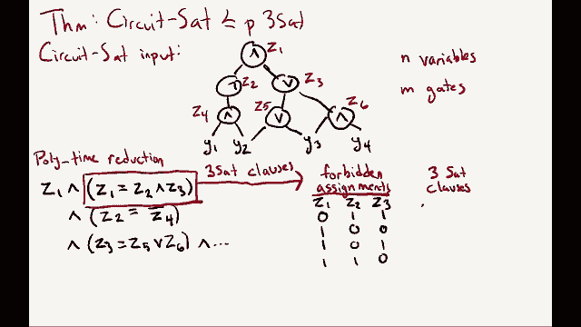

# 课程 P20：搜索问题与NP完全性 🧩

在本节课中，我们将深入学习计算问题之间的“归约”概念，并探讨NP完全性这一核心理论。我们将了解如何通过归约来比较问题的计算难度，并认识一类被称为“NP完全”的、计算上等价且极其困难的问题。

---

## 回顾：归约的概念

上一节我们介绍了归约的基本思想。本节中，我们来看看关于归约的一些有用事实和常见误区。

归约的核心是：如果问题A能在多项式时间内归约到问题B（记作 **A ≤ₚ B**），那么只要能高效解决B，就能高效解决A。这通过一对算法实现：
*   **归约算法**：将A的实例 `I_A` 转换为B的实例 `I_B`。该算法必须是多项式时间的。
*   **恢复算法**：将B实例 `I_B` 的解 `S_B` 转换回A实例 `I_A` 的解 `S_A`。该算法也必须是多项式时间的。

如果存在解决B的多项式时间算法，那么结合归约与恢复算法，就能得到解决A的多项式时间算法。

以下是关于归约的几个关键点：
*   **传递性**：如果 **A ≤ₚ B** 且 **B ≤ₚ C**，那么 **A ≤ₚ C**。
*   **独立于可解性**：证明 **A ≤ₚ B** 时，并不需要知道A或B本身是否能在多项式时间内解决。这通常是研究未知复杂度问题时的情况。
*   **方向性**：短语“A归约到B”意味着 **A ≤ₚ B**。最常见的错误是错误地设计了归约方向，即试图将B的实例转换为A的实例，这实际上证明的是 **B ≤ₚ A**。

---

## 问题全景与NP完全性

现在，让我们将归约的概念应用到我们见过的一系列问题上，看看它们之间的难度关系。

我们已知P类包含如最小生成树等问题，NP类包含如三着色、哈密顿回路等问题。此外，还有像因式分解和旅行商问题（TSP）这样的问题。

一个惊人的事实是：**NP类中的每一个问题**，都可以在多项式时间内归约到某些特定的NP问题，例如三着色问题或哈密顿回路问题。这意味着，如果你能高效解决（例如）三着色问题，你就能高效解决NP类中的所有问题。这类“最难”的NP问题被称为 **NP完全** 问题。

更精确的定义如下：
*   一个问题A是 **NP难** 的，如果NP中的每一个问题都能在多项式时间内归约到A（即 ∀ B ∈ NP, **B ≤ₚ A**）。
*   一个问题A是 **NP完全** 的，如果它既是NP难的，又同时属于NP类。

例如，搜索TSP（判定是否存在小于某值的路线）是NP完全的。最小TSP（寻找最短路线）是NP难的，但我们尚不确定它是否属于NP。

---

## NP完全性的意义与证明方法

NP完全性理论有两个深刻的推论：
1.  **等价性**：所有NP完全问题在多项式时间归约的意义下是“等价”的。它们本质上是同一个核心计算难题的不同表现形式。
2.  **P与NP问题**：只要为**任何一个**NP完全问题找到多项式时间算法，就证明了 **P = NP**。反之，如果证明某个NP完全问题不存在多项式时间算法，则证明了 **P ≠ NP**。这是计算机科学中最著名的开放问题。

那么，如何证明一个新问题是NP完全的呢？我们不需要对NP中的每个问题都进行归约。得益于库克-莱文定理，我们有一个“起点”：**电路可满足性问题（Circuit SAT）** 被证明是NP完全的。

因此，证明问题A是NP完全的通用步骤如下：
1.  证明 **A ∈ NP**。这通常通过给出一个能在多项式时间内验证其解的正确性的算法（验证算法）来完成。
2.  选择一个已知的NP完全问题B（如3-SAT、哈密顿回路等）。
3.  证明 **B ≤ₚ A**（即，将B归约到A）。由于B是NP完全的，NP中所有问题都可归约到B，再根据归约的传递性，NP中所有问题都可归约到A，从而证明A是NP难的。
4.  结合1和3，得出结论：A是NP完全的。

选择从哪个已知的NP完全问题开始归约，是一门艺术，通常取决于目标问题A与哪个已知问题在结构上更相似。

---

## 实例分析：从Circuit SAT到3-SAT的归约

为了具体说明，我们将展示如何将电路可满足性问题（Circuit SAT）归约到三元可满足性问题（3-SAT）。由于Circuit SAT是NP完全的，这也就证明了3-SAT是NP完全的。

**第一步：定义问题**
*   **Circuit SAT**：
    *   **输入**：一个布尔电路（由与门、或门、非门构成的有向无环图）。
    *   **输出**：是否存在一组对输入变量的赋值（0或1），使得整个电路输出为1。
*   **3-SAT**：
    *   **输入**：一个由多个子句构成的布尔公式，每个子句是至多三个变量的逻辑或（析取）。
    *   **输出**：是否存在一组对变量的赋值，使得整个公式为真（所有子句同时被满足）。

**第二步：归约算法**
我们需要将任意Circuit SAT实例 `C` 转换为一个等价的3-SAT实例 `φ`。
1.  为电路 `C` 中的每一个输入变量 `x_i` 和每一个逻辑门输出 `g_j` 都创建一个3-SAT变量。
2.  对于每个逻辑门，添加一组3-SAT子句来“模拟”其功能，确保在 `φ` 的任何满足赋值中，代表门输出的变量值必须等于其输入变量值经过该门运算后的结果。
    *   *例如*：对于一个与门 `g_k = g_a ∧ g_b`，我们需要子句来保证 `g_k` 为真当且仅当 `g_a` 和 `g_b` 同时为真。这可以通过一组子句来实现：`(¬g_a ∨ ¬g_b ∨ g_k)`, `(g_a ∨ ¬g_k)`, `(g_b ∨ ¬g_k)`。这些子句共同排除了 `g_k` 值与输入值不符的所有情况。
3.  为电路的最终输出门 `g_out` 添加一个单变量子句 `(g_out)`，要求输出必须为1。
4.  将所有为每个门生成的子句取合取（逻辑与），得到最终的3-SAT公式 `φ`。

这个转换过程显然是多项式时间的。

**第三步：恢复算法**
给定3-SAT公式 `φ` 的一个满足赋值，我们只需提取该赋值中对原Circuit SAT实例输入变量 `x_i` 的赋值部分。根据构造，这部分赋值必然使原电路 `C` 输出1。

通过这个归约，我们证明了 **Circuit SAT ≤ₚ 3-SAT**。由于Circuit SAT是NP完全的，因此3-SAT也是NP完全的。

---

## 总结

本节课中我们一起学习了：
1.  **归约**是衡量问题计算难度的关键工具，它表明若能高效解决一个问题，就能高效解决所有可归约到它的问题。
2.  **NP完全**问题是NP类中最困难的问题，它们彼此在多项式时间内可以相互归约，因此计算难度等价。
3.  证明一个问题是NP完全的标准方法：先证明它属于NP，再将一个已知的NP完全问题归约到它。
4.  通过分析从 **Circuit SAT 到 3-SAT 的归约**，我们实际演练了如何构造这种归约，并理解了3-SAT为何是NP完全的。

理解NP完全性理论，能帮助我们认识到许多实际问题的内在计算难度，并指导我们在面对NP完全问题时，去寻求近似算法、启发式方法等实用解决方案，而非执着于寻找完美的精确高效算法。