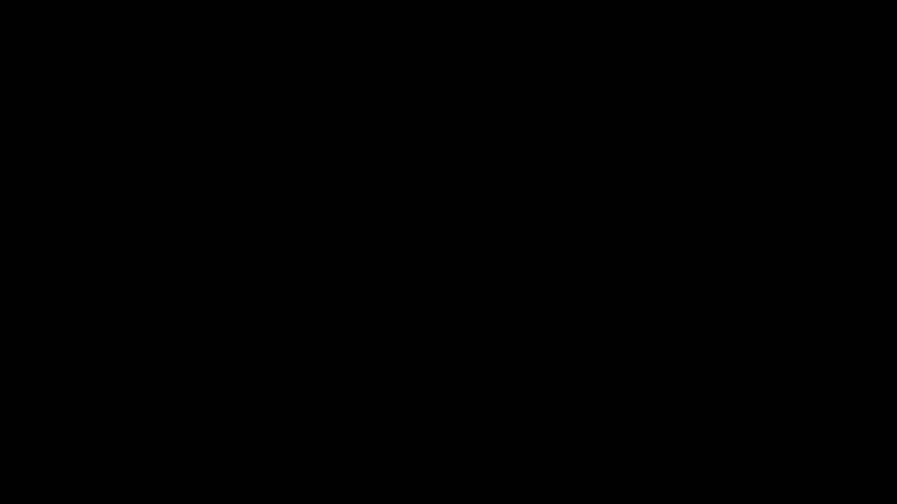
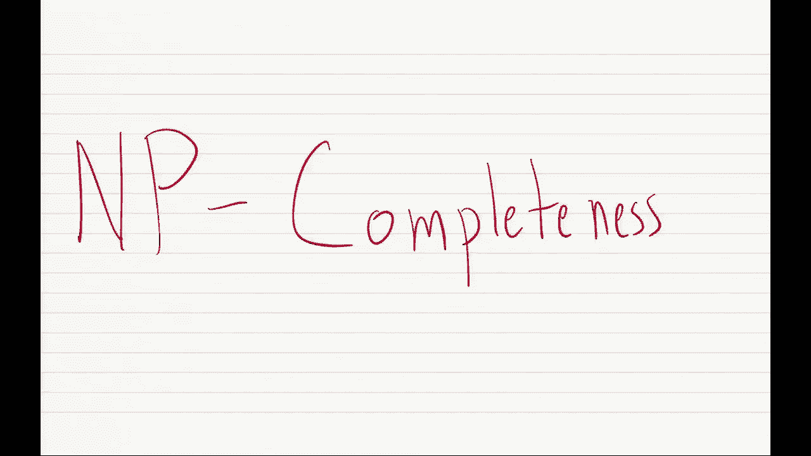
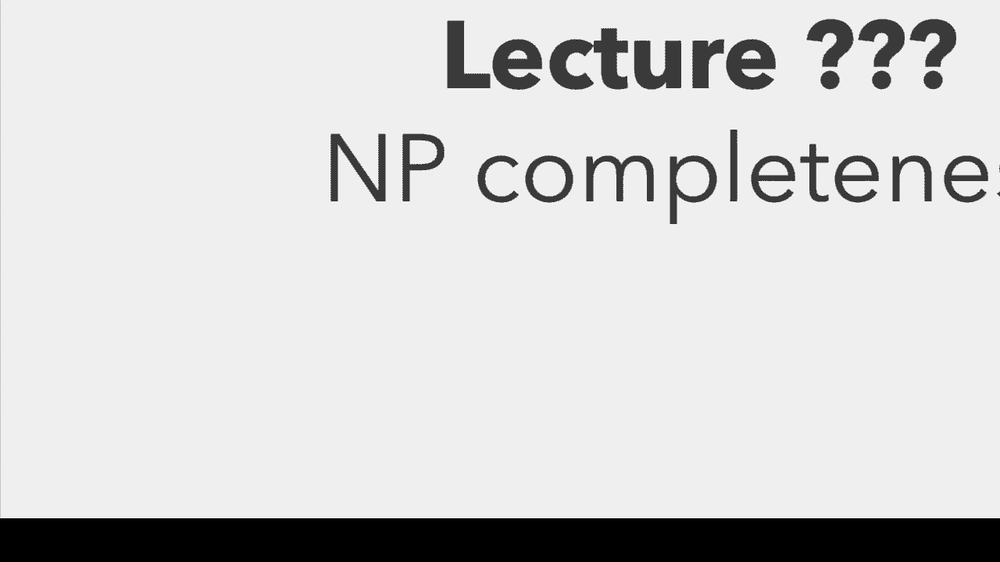
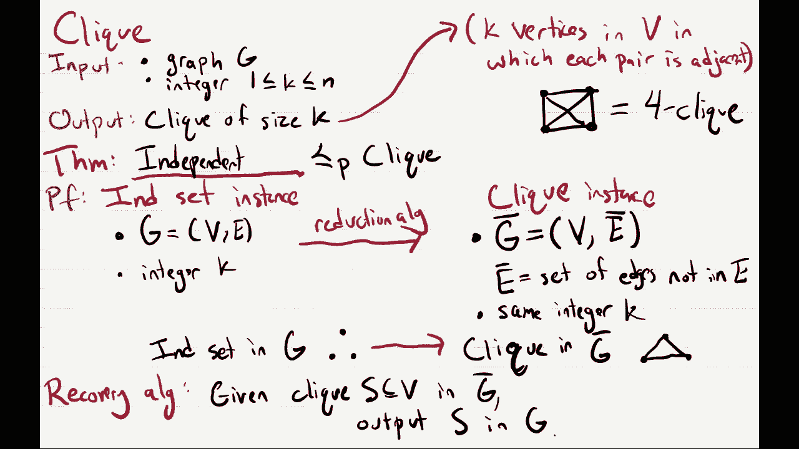
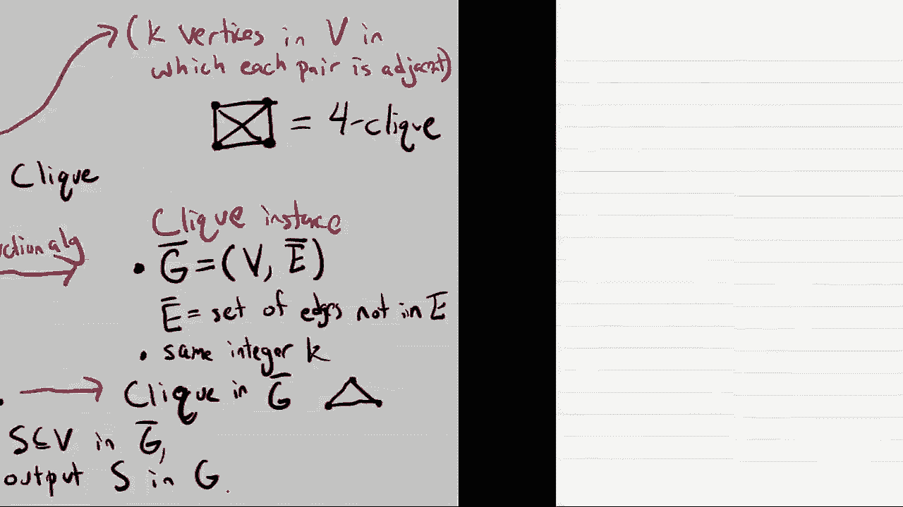
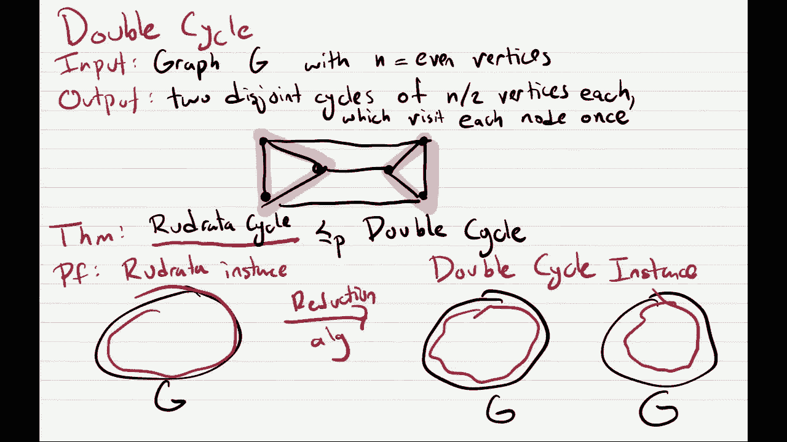

# P21：Lec21 NP-Completeness - 东风渐起UCAS - BV1o64y177K8

好啦，酷，我把声音关小一点，所以是的，很抱歉稍微耽搁了一下，我不知道今天是哪一节课，我想这不是很重要，但我们会继续，NP完备性，嗯但是是的，在我开始之前，让我像往常一样谈谈管理方面的事情，嗯。

首先明天是退伍军人节，所以今天是假日，所以你有一整天的假期，所以明天不会有家庭作业聚会，嗯第二呃，我们有期中考试，你们只是好奇，我的意思是，你们觉得这很容易吗，竖起大拇指，拇指中号，好啦。

在后面竖起大拇指，好啦，很酷的混合好的，嗯是的，所以成绩，希望我们能在星期二晚上把他们弄出来，不是百分之百确定，不过，我们走着瞧，嗯最后一件事是，我们收到了你的期中反馈，我们收到了500多人的反馈。

太神奇了，所以我们正在经历这一切，试图看看我们做得很好，我们可以改进的地方，我得到的反馈最多，人们似乎喜欢我，哪个好，但我一直得到的最负面的反馈，人们觉得我的声音无聊单调。

所以我想在这节课里用更激动人心的声音，希望它能帮助你们中的一些人保持清醒，嗯，我想宣布的另一件事，在课程中我们有一个小小的人员变动，所以稍微换一下员工，我们已经，我们雇了一个新助教。

他们将负责写作业和给作业打分，从现在开始，我只是说说而已，你可能会在校园里看到他们，有时这就是他们，他们的名字叫里海猪塔拉布，他们才一周大，我想是的，一周大，所以妮卡，她十一月生了一个孩子，一圣。

就是这样，这是另一张他看起来有点暴躁的照片，是啊，是啊，所以从现在开始他会给我们写家庭作业，所以是的，请随时送上你的祝贺，好啦，就是这样，我刚做了幻灯片，所以你可以看到这个非常可爱的婴儿的照片，现在呢。

让我说说今天真正的肉。

好啦，希望不会太久，哦嘟。

杜，好了好了，所以np完备性，这是我们关于p和np的三部分系列的第三部分，所有这些好东西，所以让我从，就像我们在这节课中会经常看到的一个问题，嗯，这是一个独立集的问题，所以这就像，中央的那种，不是中央。

但这就像是计算机科学中一个非常常见的问题，很多问题都与此有关，我们最近在动态编程单元中看到了它，我们看到了如何计算树上的独立集，让我来提醒你们什么是独立集问题，所以你的输入分为两部分，这将是一个图表。

G，一如既往，我们用n表示顶点数，M表示边数，然后在独立集问题中，您还可以将其作为输入，整数k，在1和n之间，而这个问题的解决方案，所以这将是一个搜索问题，解是图g中一个独立的，大小为k的集合。

为了提醒你什么是独立的集合，嗯，只是顶点之间没有边的子集，好的，好的，所以一些大小为k且没有两个顶点的子集是邻居，好的，好的，所以我们首先要考虑的是什么是最好的算法，或者这个问题的算法是什么。

所以谁能给我建议一个自然的算法，你可以试着解决独立集，也许我给你们10秒钟考虑一下，好啦，有什么建议吗，这个问题我应该怎么解决呢？是啊，是啊，在前面这里，嗯很好，所以建议的算法只是一个平凡的算法。

这很好，你在找一组k个顶点，有些没有边，所以只要尝试每一组k个顶点，对于每一个，检查它是否是一个独立的集合，如果是的话，你很好，只要输出，如果不是，就继续下一个，最终，如果你用完了可以尝试的套件。

你知道在你的图表中没有独立的集合，所以说，嗯，算法的运行时，这真的要看你要试多少套，我们在看大小K的子集，所以要看的可能集合的数量是n选择k，只是非常粗略的启发式地，这是多少套，嗯，嗯，这大致等于n。

n，k，不完全是，但就像当k相当小时，这意味着你大致上是在尝试K集的末尾，这就意味着，这个微不足道的蛮力算法及时运行，这是n到k的大欧米茄，你知道，就像它不会在时间上运行一样，正好是K的结尾。

因为你还得花时间检查，您的集合是否是独立的集合，这将需要你额外的少量时间，但至少像运行时间更低，只限于你必须尝试的套数，好啦，嗯，这是一个很好的算法吗，这是一个糟糕的算法吗，嗯，这取决于K，所以嗯。

如果k是一阶，如果k是一个常数，也许你想知道，我有独立的3号的吗，然后这将在n个立方时间内运行，那很好，那是一个多项式时间，但你知道，总的来说，这是输入的一部分，它可以在1到n之间的任何地方。

如果它大于常数，嗯，例如，如果k像n/2，那么你就不会在多项式时间内运行，你将在指数时间内运行，所以如果k等于ω1就不好了，所以在这种情况下，这不是一个有效的算法，这就像一个低效的算法。

而且有独立的集合，你知道你可以这就像一个算法，但是，你可以尝试我们在本课程中看到的所有不同类型的算法，看看你能不能改进这个算法，就像我们在这个单元看到的许多问题一样，据我们所知，2。这个问题似乎很难。

所以我们不知道如何为它设计一个有效的算法，事实上，我们不相信有一个有效的算法，但是你知道，在这一点上，在你尝试了每一种算法技术之后，你想说服自己这确实是个难题，一旦你说服自己这是个难题。

你不必花更多的时间为它设计算法，你可以说这很难，你做不到的，你知道这很可悲，所以嗯好吧，问题是，我们如何展示，嗯，我们如何证明这个问题至少足够难，我们应该停止寻找解决办法，在现实世界中你应该做的是。

如果你遇到这样的问题，你不知道怎么解决，你花了几个星期的时间来解决，你应该试着证明这很难，所以这是一个定理，我们将在这堂课开始展示，这很难，我们看到了，呃，为什么这个为什么这个，凭什么让你相信。

你可能找不到独立集的好算法，嗯，如果独立报说这很难，找到一个多项式时间算法，然后它给出了NP中每个问题的多项式时间算法，因为我们不相信，NP对其中的每个问题都有多项式时间算法，这告诉我们。

可能独立的集合也不会有一个，现在呢，当然啦，让我通过证明它是NP难的来指出这个问题，它还表明它是NP完全的，嗯，因为独立设置，它肯定是一个NP因为，是啊，是啊，如果有一个独立的集合，我可以给你解决方案。

而且很容易检查溶液，所以很容易检查，如果一个声称独立的集合在多项式时间内实际上是一个独立的集合，好啦，所以我们想证明这个东西是NP难的，那么我们如何做到这一点呢，这是我们上一堂课看到的。

你应该证明一个问题是NP难的方法是，您应该选择一些其他的NP完全问题，并显示它减少，A在多项式时间内归结为独立集问题，如果这是一般的食谱，如果我能证明一个NP完全问题归结为你的问题。

那么这意味着你的问题是NP难的，因为它可以用来解决NP完全问题，和往常一样，NP完全问题，嗯，我们会看看当你证明减少，通常，您希望从一些众所周知的NP完全问题开始，这门课的大部分内容。

或者这些讲座的大部分内容，都将集中在，就像大多数著名的，所以你应该一直想着，我做了什么，我怎么才能把它关掉，好啦，所以这就是我们要做的，我们将选择一些著名的NP完全问题，并显示它现在简化为独立集。

我提醒你一下，关于np完备性的概念，上一节课我们看到有这样一张减少的网，这允许我们证明各种问题是NP完全的，所以这个减少的网络，它从NP中的任何问题开始，而这是别人展示的。

你不需要知道如何在这门课上做到这一点，但是有一个问题叫做电路集，它是由库克和莱文展示的，NP中的每一个问题都归结为电路集，上一节课我们展示了减少到三组的电路，今天我们要讲的是三集归约为独立集。

这就是我们将要使用的还原度，一旦你知道独立集是np完全的，您可以使用它来显示许多其他问题也是NP完全的，所以单击是NP完成，顶点覆盖，以及整数规划，而且三套也可以用来还原成其他问题，像重画，循环。

和许多其他人，所以嗯，我们知道有成千上万的问题是不完整的，在这个减少的网络中的某个地方，他们来自不同的领域，比如化学，生物学，有些人喜欢证明电子游戏是P完整的，所以众所周知，像超级马里奥兄弟是NP难。

嗯，这告诉你的是，对于所有这些来自不同学科的问题，其实很难解决，所以让我再提醒你一次，我们如何证明一个问题，A，NP完成了吗，第一，你必须证明a在np中，这是用验证算法显示的，然后呢。

就像我在最后一张幻灯片上说的，你证明了一些NP完全，啊，第二个只会告诉你这是NP难的，所以这意味着你可以用它来解决NP中的问题，但它并没有告诉你它实际上是NP中的自己，这就像最小茶匙问题的例子。

或者是NP困难的TSP的优化版本，但就我们所知，这实际上不是一个NP有意义吗，它告诉我们，如果你有一个多项式时间算法，这意味着一个多项式时间算法，对于整个NP，我们认为不太可能。

我们查看NP中的大多数问题或这些NP完全问题中的大多数，我们认为没有有效的算法，好啦，所以说，这提醒了我们上一节课是怎么做的，关于这个大纲还有什么问题吗？好啦，如果没有，让我们去，啊，你知道的。

让我们稍微了解一下历史，所以是的，所有这些空洞的完备性，然后嗯，证明事情真的，这里的第一篇论文是库克·莱文，所以他们来了，他们证明了电路集问题是NP完全的，嗯，所以莱文，当时，他在苏联，库克在。

你很了解西部，库克当时在美国，他们独立地证明了这一点，就在他们都证明了这一点的几年后，做了，他们意识到彼此都同意了，由于铁幕，我认为库克现在是多伦多的教授，然后嗯，他其实是伯克利数学系的教授。

后来他被剥夺了终身教职，如果你知道这意味着什么，这基本上意味着大学就像，你被解雇了，一年后他证明了这个结果，就像图灵奖的获奖结果，所以我想这就像，可能是伯克利有史以来做出的最愚蠢的决定之一，做饭嗯。

所以很不幸我们失去了库克一年后他证明，你知道这个有史以来最伟大的理论计算机科学成果，所有这些结果呢，虽然，他证明了所有这些削减，嗯，另一个叫理查德卡普的人证明了这一点，在一九七二年。

所以库克定理最初是在1970年提出的，然后他看到电路组是MP完成的，他说等等，我可以证明许多其他组合问题是NP，顺便说一句，完成了，当时他在伯克利，现在还在伯克利，所以我经常听说，如果你到处讲理论。

你可能会遇到理查德卡普，我本人从未有幸见过他，但我知道有些人，这是他在1972年的论文，可满足性问题，这基本上就像电路SAT问题，然后他展示了这张还原网，好吧，你可以把这个归结为团。

把那个归结为节点覆盖，到定向汉密尔顿电路，汉密尔顿赛道等等，这里有三套，它是满足于，每个子句最多三个字，所以他做的这件事是一篇论文，它基本上为np完备性的整个理论提供了基础，嗯和好。

这正是你在这些讲座中学到的，所以像许多这些问题一样，我们现在正在证明，NP完成，好吧那么好，让我们继续讨论我们想展示的定理，我们想证明独立集，所以我们要做的是，我们将展示一些著名的NP完全问题归结为它。

这就像艺术的一部分来自哪里，所以当你做这些减少的时候，他们就像两个非常困难的部分，第一只是想知道，最好的问题是什么，对不起，减少，第二，你如何设计减少，还有一些问题，好像很清楚，我应该减少什么问题。

其他问题，不太清楚，所以对于独立集，我只想告诉你什么是正确的问题，也就是三个SAT问题，这就是我们上节课看到的问题，在这样做的过程中，这再次证明了独立集是np，而不仅仅是np难，但NP完成，好啦。

那么我们如何再次很好地显示还原，我们需要一个约简算法，然后是一个恢复算法，一个约简算法将从一个三集的实例开始，它将把它转换成一个独立集合的实例，好啦，让我以一个三集的例子开始。

所以为了提醒大家三套是什么样子的，我们有一套条款，每一个都是一个或，最多三个变量或其否定，然后所有的子句都加在一起，好啦，所以这里有一个三集的例子，我们有三个条款，嗯四变量x，Y，Z，和W。

我们想知道任务是真的还是假的，给我的变量赋值0或1，同时满足三个分句，只是为了给你添乱，我是说答案其实是，在这种情况下，是呀，有一个令人满意的任务，如果x和y都等于1，z和w都等于零。

那么我声称这满足了这三个条款，所以为了理解为什么让我们把这些值插入，所以第一个子句我们得到1-1-0，这样就满足了，因为我们至少有一个，第二个分句我们没有z也没有w，所以这两者是一体的，然后x是1。

第三个分句i是一个z，我们有一个不是Z，所以这是一个，然后w为零，所以我们确实满足了所有三个条款，好啦，所以现在我们必须设计一个在多项式时间内运行的约简算法，并将其转换为一个独立的集合实例。

实际上是一个独立的集合实例，会有两件事，这将是一个图G，然后是一个整数k，它指定了我要找多大的独立集，让我先告诉你图表是什么，然后我们会考虑独立集的大小，我们在找，所以我们要设计这个图的方法是。

我们将讨论每个条款，它由三个变量组成，我们要画一个很小的子图，让我们看看第一个子句是x，Y和Z，我们要放下三个顶点，我要给这些变量命名，这些顶点是x吗，Y和Z，好啦，所以这只是顶点的名字。

我要在这三个顶点上画一个完整的图，好啦，所以他们现在是连在一起的，这告诉我们，在任何独立的集合中，你最多只能拿这三个中的一个，好啦，同样地，我的下一个条款，我要再加三个顶点。

我将用从句中的三个字母来命名它们，所以z巴，W巴和X，然后我要在这些之间加上边，最后是最后一个从句，我也会这么做，所以我们把一个y顶点，一个z条顶点和一个w顶点，然后在这里加上边，好吧，所以这是。

那是一张图表，这如何对应于你的三个集合实例，嗯，我想说的是，如果我的三句话，这意味着每个子句中都有一些变量，就像一个令人满意的任务，为每个子句分配至少一个变量，第一个子句中的值1，令人满意的作业。

我们让x等于1，它还使y等于1，但我只关心我自己，其中至少一个变量设置为1，所以我只想说，它将x设置为1，所以在我的独立片场，我希望我的独立集包含x，同样的，我的下一个子句，它把z条设为1，从z到0。

它将z条设置为1，所以我的独立集，我希望它包含z条，最后是我的第三个条款，呃，哎呦，我是不是画错了，也许我做得很好，那很好，它将y设置为1，所以我要把y包括在我的独立集合中，嗯所以嗯，因为每个条款。

如果可以满足，应该至少有一个变量设置为1，然后直觉上，我应该能够在我的三元组中的每一个中选择至少一个顶点，嗯，我的独立布景，因为我有三个，在我的三个集合实例中，每个子句一个，然后我想把K设置为。

这就是我要找的独立性的大小，我想让它等于m，条款数，到目前为止对此有疑问吗，是啊，是啊，嗯，K，我把它和我的相等，也就是条款的数量，和K，这是我在图中寻找的独立集的大小，所以在独立集问题中。

你用图指定它，然后k是独立集的大小，我想说的是，嗯，是啊，是啊，对于这个图，你应该找一套独立的M号，这有道理吗，好啦，所以再一次，我想让这张图与我的三组实例相对应，所以我希望。

如果在我的三集实例中有一个赋值，然后我应该可以把它转换成一个独立的大小K的集合，但我也希望，如果没有对我的三集实例的赋值，那么他们应该找不到一个独立的大小为k的集合，有谁能告诉我，我刚写的图表有点可疑。

是啊，是啊，啊，你的意思是，如果我在图中将y设置为1，或者是的，我想就像那样，我知道为什么了，啊，我会说，啊，也许这让人困惑，这个Y和这个不一样，为什么耶，所以所以嗯，这个C将是一个不同的，这个Z条。

它们将是不同的顶点，嗯，上面有相同的标签，但它们出现在不同的小条款中，是啊，是啊，伟大的问题或伟大的答案，是啊，是啊，在后面，好呀，为什么我必须把图的三个部分连接起来，等一下等一下，对不起。

你能说大声点吗，好呀，你的意思是，嗯，基本上你现在说的是，如果这是我的图表，我总能找到一套独立的K号，不管我原来的三集实例是什么，为什么这口井在图中，我总是可以把这些条款中的每一个，取一个顶点。

没有什么能阻止我做那件事，所以独立集，这个图中独立集的大小总是k，或者最大的总是K嗯，不管我最初的情况是否令人满意，所以也许我会给你们20秒钟，您将如何修改此图以防止这种情况，如果你愿意。

现在可以和你的邻居讨论，好的想法，是啊，是啊，在背面，好呀，你是说每一个变态，对于每个变量，我们将为每个变量标记一些顶点，例如Z井，一些顶点标记为z的顶点和一些标记为z bar的顶点。

你想把所有的z和所有的z条连接起来，所以他的意思是，我们应该在这里加上这条边，我们应该在这里再加一条边，这意味着，在我的独立集合中，我只能选择z条，或者Z我永远不能同时选择Z和Z条，同样的。

在这里我们有一个w和一个w条，我们应该把这两者联系起来，这又意味着什么，我的独立集总是选择w或w条，也可能两者都不是，但它永远不能同时选择W和W巴，直觉上，这应该符合这样一个事实，在我的三个例子中。

我永远不能将变量设置为true和false，所以我们要把这个边，在独立的世界里，表示变量总是赋值一个值的事实，不是零就是一，好啦，我声称这实际上是正确的减少，现在我们有了这个正确的还原。

然后它甚至给出了一个很好的多项式时间恢复算法，所以或者至少我认为这表明，就像一个很好的恢复算法，所以再一次，我们的恢复算法，它要做的是把一个独立集合的解，它必须输出三个SAT问题的解决方案。

所以独立集问题的解决方案是，你知道的，独立集，所以它是顶点的子集，我们必须想出如何把它转换回三套解决方案，嗯，恢复算法的工作方式是让我，让我说说它对x的作用，所以首先它必须弄清楚x等于什么，嗯。

它将通过独立集合中的所有顶点，它看到独立集合包含x但不包含x条，所以它应该做的是让x等于1，嗯，好吧，Y也在独立片场，而且y条不在独立集，所以我们应该让y等于1。

它想知道设置什么来找到z bar而不是z，Z条在独立集合中，所以我们把z设为零，最后它会四处寻找W，并看到独立集合中的w和w条，所以独立集，它似乎没有指定将w等于什么，所以恢复算法就是让w等于零或者。

它不会在乎的，所以在这种情况下你知道，恢复算法总是可以将w设为零，如果它想，嗯，也可以设置为1，如果它想，这不重要，我要说的是，如果是这样，蓝色顶点是图的正确独立集。

然后这个恢复算法会给我们一个满意的任务给三个七个儿子，是啊，是啊，啊，你的意思是，我们怎么知道，每三胞胎就有一个，哦很好很好，每三胞胎最多可以生一个，你不能在每三胞胎中拥有一个以上，因为每一个三胞胎。

所以我只能从这家伙身上挑一个，我从来没有从这个家伙身上挑过一个以上，等等，这意味着如果我在自己的独立集合中有m个顶点，我要从三胞胎中挑一个，好啦，所以我要像正式的，数学证明为什么这在下一张幻灯片上有效。

但是是的，直觉上有什么问题吗，是啊，是啊，是啊，是啊，你想让我再说一遍，所以对于每个变量，我们想知道给x赋值什么，例如，所以我们要在独立的集合中看看，独立集合要么包含一个名为x的顶点。

或者一个名为x bar的顶点，如果它包含一个名为x的顶点，就像这里一样，然后恢复算法将x设置为1，如果它包含x条，一个名为x bar的顶点，它将x等于零，例如，我们包含Z巴，所以我们让z等于零。

如果它不包含标有x或x条的顶点，恢复算法就可以为所欲为，我把这个写下来，然后抹去，但是独立集合也可以选择这个x而不是z条，这也会起作用，但我想就像，如果你只得到这个独立的集合，你想做恢复算法。

你不一定会知道Z并不重要，是啊，是啊，我是说，我们不一定在乎，如果我们需要，我们关心的是我们最终输出的东西，是一个真正令人满意的任务，对我们来说也不那么重要，是否喜欢它是最好的，不管是什么。

就像我们想要的，明确地将一个独立的集合转换为一个令人满意的赋值的东西，这里有问题吗，啊，是啊，是啊，是啊，是啊，你当你说你想要，嗯，如果是四盘，我想我们的三人组会变成四人组，不是为了，我是说。

如果我能做到这一点，我会做的是，我想把四个变量加起来，所以每个子句现在都对应于四个顶点，然后我会在这四个顶点上加一个完整的图，这就告诉你，你仍然只能选择一个，是啊，是啊，那完全有可能。

所以我们什么都没有，这限制了我们在这两个方面都选择纳粹，那完全没问题，我们只是想说，我们不能把纳粹和纳粹混为一谈，好啦，现在让我希望我们已经看到了这种减少是如何工作的，希望我们有一些直觉。

我只想给你看一次，而且只有这一次，写下np完备性证明或这种归约的证明的完全形式的方法，那是因为当涉及到你的家庭作业时，你必须遵循这个严格的公式，嗯，但至少在这些讲座中，你知道我会试着把它保持得更高水平。

但当我们证明这种减少有效时，所以这就是我现在要做的，我要告诉你这种还原是有效的，你的证明总是有两部分，所以第一部分展示了约简算法的工作原理，第二部分展示了恢复算法的工作原理，为了证明约简算法有效。

我们想证明如果最初的三个集合实例，圆周率有一个令人满意的任务，让我把令人满意的作业称为A，它将把n个变量中的每一个映射为零，一个，如果有满意的任务，然后我们要证明图G，有一套独立的，我叫它，I。

我有尺寸，记住k等于m，所以再一次，任何时候你写你的NP完整性证明，它总是要从一个看起来一模一样的步骤开始，所以让我证明给你看，考虑到我们的削减，是啊，是啊，所以让我们假设我们有一个令人满意的任务。

“好”是什么意思，这意味着对于三个集合实例中的in中的每个子句，或者让我们说不是，x j或x l，然后一个，将其中一个变量设置为1，所以它要么设x i 1，x j条一，或者X K对不起，Xl one。

所以这就是对每个子句都是令人满意的赋值的含义，至少有一个东西被设置为一个，所以我们想用这个来构造我们的独立集，所以让我们从这三个变量中选择一个，假设x i，我们要加上，嗯，我们将讨论与此相对应的从句。

我们要看看，让我写得更好，维特，在这个小子句小工具中标记为x i um的顶点，X，Xl，我们要把这个x i加到独立集合中，所以我们把图中的每个子句，每一个小三倍的东西，我们取了一个顶点，嗯。

因为我们有这些小三人组，这告诉我们独立集，我是大块头，m等于k，所以我们确实有一个独立的正确大小的集合，但你得检查一下，你得证明它是独立的，也就是说没有，您选择的顶点对没有连接。

因为我们只根据满意的任务，所以我们只会选择x i个顶点或x i个条形顶点，我们永远不会两者兼得，因此两者之间没有边，我们的任何顶点，所以我们有一个独立的集合，所以我们在这些三元组的顶点之间没有边。

因为我们总是只从三个顶点中选择一个，在x i和x i条之间没有边，因为我们总是只挑x眼或者xi条，这就是所有的顶点，还有对不起，这就是我们图中的所有边，好啦，那是第一步，关于第一步有什么问题吗，证据的。

那么这表明，如果我们有一个三集的实例，那么我们的图有一个独立的大小m的集，所以这表明约简算法是有效的，现在是证明的第二部分，我们要做的是，我们必须证明恢复算法是有效的。

所以我们要展示的是如果i是一个独立的集合，在图G中，它的大小是正确的，所以它的尺寸是K，那么恢复算法应该能够输出，再一次，让我提醒你恢复算法是做什么的，所以对于变量x i，它将按以下方式设置它。

如果有一些，它就会把它设置为1，在独立集中的x i，如果独立集中有x i条，它将把它设置为零，然后它就会任意设置，否则，好啦，所以让我来证明这在这里的一个小盒子里是有效的，所以首先你要展示两件事。

我的意思是，你必须证明这个恢复算法实际上是定义得很好的，嗯，我说那口井是什么意思，这种指定它的方式就像，这取决于这个事实，我只想说这是什么意思，所以嗯，我们知道每一个我。

在独立集合中只有一个x i或一个xi条，所以恢复算法确实定义得很好，我的意思是如果x i和x i bar在独立的集合中，恢复算法不知道是做1还是0，但因为这是一个独立的场景，你只有两个中的一个。

所以恢复算法肯定知道是输出0还是1，让我们说，对于这三个中的每一个，连接到连接到x k的x j的x i，然后我们有一个额外的边连接这两个，嗯，我们确定x i等于1，或者xj等于1，或者x k等于1。

为什么因为这三个变量中的一个会在我们的独立集合中，所以恢复算法将把这个变量设置为1，这意味着我们要满足这个条款，所以在图中的每一个三元组中，它们对应于某些条款。

恢复算法将把该子句中的三个变量中的一个设置为1，所以所有的条款都满足了，因此，三个集合的实例是满足的，所以我们输出的东西确实是一个正确的解决方案，好啦，对此有疑问吗，是啊，是啊，在后面，哦很好，嗯是的。

所以问题是，如果我们没有令人满意的独立，对不起，如果三集实例没有令人满意的赋值，我们是否也必须证明没有独立的集合，其实呢，我声称我们已经做到了，即使这并不明显，原因是假设存在一个独立的大小集合，K。

然后呢，我们的证明第二部分表明，我们的恢复算法将把它转换成一个令人满意的赋值，因此，三个集合的实例一开始是可以满足的，所以事实上，我们证明的第二部分显示了这个陈述的反义词，还有其他问题吗？好啦。

所以在剩下的课程中，我们只是要做一些小一点的，我觉得，更容易削减，但让我休息三分钟，人，你知道的，站起来伸伸懒腰，把后面的门关上，我们绝对可以，那就会有两个案子，是啊，是啊，是啊，是啊。

所以如果我们选择x而不是z，然后是的，我们会有一个不同的，但我的意思是，给定这个独立的集合，这就是复苏的原因，好啦，嗯酷，有人能把后面的门关上吗，后面有人，也许谢谢，好啦，所以嗯，在接下来的演讲中。

我只想问你几个问题，我们将看看我们是否能设计出它们之间的减少，所以我要把这些做得有点乱，嗯，也许我会先做这个，所以这里有另一个在计算机科学中非常著名的问题，叫做集团，会是一个图表，我们就叫它G吧。

和一个整数，在1和n之间，您的目标是在图中输出一个集团，让我提醒你什么是小集团，嗯，它将是k个顶点，和V，其中每对相邻，好啦，所以说，例如，就在这里，是一个叉子集团，好啦，所以你可能会试着解决这个问题。

发现它真的很难，你想让自己相信这实际上是一个困难的问题，那么你应该做好什么呢，你应该证明这是一个NP难题，我们如何证明这是一个NP难题，好吧，我们要做的是选择一些问题，和一些著名的NP完全问题。

并证明它在多项式时间内减少到团，好啦，所以现在我只想请你们考虑一下，一分钟，咨询你的邻居，第一名，你会减少什么问题，第二，试着想想减少会是什么样子，好了时间到了，有什么想法吗，也许是还没说过话的人。

如果有人先来，是呀，我们应该减少什么，哦很好，你什么意思，倒置图形，完美，所以你是说你的减薪，你拿着图表，然后你把所有的边缘，所以这是正确的，所以让我再写一遍，你知道的，我们需要一个约简算法。

它采用一个独立的集合实例，这将是一个图表，G等于V，E，和一个整数k，我们想要一个约简算法，嗯，它将我们转换为一个集团实例，我们的建议是，我们只要把你的图表，把所有的边倒置，所以还原会把我们映射到g巴。

它有相同的顶点集，但现在有边缘设置E条，在这里，e条只是边缘的集合，不是在E，你想用什么K，好啦，嗯，我就告诉你，假设他想的K是同一个整数，K，好啦，这里的直觉是什么，嗯，假设我们有一个g中的独立集。

它将是一些顶点的集合，它们之间没有边，如果我们看看约简算法，g形中的同一组顶点将形成一个团，因为我们把过去没有边的地方，现在我们把所有的边，我们把这些边，所以每次，左手边和左手边的每一个独立的集合。

对应右手边的一个小集团，反之亦然，所以我的还原算法可以，嗯啊，倒置图形，嗯是的，这很管用，恢复算法是什么，嗯，超级简单，如果有人给你一个解决小团体的方法，嗯，你得到了一些小集团。

只需输出同一组顶点s和g，关于这个的正确问题，所以是的，希望，好像很清楚这里发生了什么，这是一个像，还原比许多其他还原要简单得多，因为集团和独立集合基本上是同一个问题，只是用两种不同的方式写的，好啦。

哦耶，哦嗯是的，是这样的，哎呦，我写了这个叮当，让我把它写对，所以如果我看一组顶点，在我的原始图表中形成一个独立的集合，这意味着没有优势，在我的新图形中的任何顶点之间，G巴，我把所有的边都反转过来。

所以以前没有优势的地方，我现在把一个边缘，曾经有优势的地方，我不把边缘，所以这意味着如果我有一个独立的原始图和g条的集合，我们要把每对顶点之间的每条边，形成了一个小集团，所以就像小集团的定义有意义吗。

是啊，是啊，是啊，是啊，因为我们这里没有边，我们会把那里的每一个边缘，反之亦然，你知道这张图中的任何小集团，所以它是一组顶点，你有每一对边缘，然后在我原来的图表中，我将没有边缘。

这样它们就形成了一个独立的集合，有道理，更多问题。

好啦，现在很酷，让我们看看下一个问题，我们要减少嗯。

这将被称为redrada st路径问题，它只是非常，与雷达循环问题非常相似，所以你的输入将是一个图表，G等于V，但除此之外，我们将有一个源顶点，嗯和一个目标顶点，输出是，你只需要一条从s到t的路径。

访问每个顶点一次，好啦，我们现在要看的是什么定理，嗯，嗯，我们要把事情做得有点倒退，不是显示一个np完全问题，而是将其还原为重新绘制sd路径，我们将展示重画的ST路径，减少到另一个NP完全问题，特别是。

这里要展示的明显问题是什么，让我们证明它缩小以重画循环，这意味着什么，这意味着什么，这告诉我们，我们可以用绘制一个循环，如果我们有一个重画循环的算法，我们可以用它来解决雷德拉达街的问题，嗯。

这也意味着如果我们知道redrada st路径是NP完全的，那么Rudra的循环也将是NP完全的，但这本身，不会告诉我们画一条圣路是容易还是难，或任何东西，但这只是我们在做的事，只是看一个减少的例子。

所以让我从减少开始，你记得你的减刑，它总是作为输入，在还原的左手边的一个例子，所以它举了一个雷德拉达圣路径的例子，然后嗯，这个实例只是一个图，G等于V，E，它有两个特殊的顶点，叫做s和t。

然后这里的其他一些顶点，我们想要的是一个约简算法，将其转换为重绘的实例，循环，你记得我们画了一个循环，你没有来源和目的地，你只有一个大周期，所以再一次，我给你们一点时间，只是为了喜欢，想想这个。

你如何设计这种减少，好啦，一分钟过去了，有什么想法吗，是啊，是啊，哦有趣，所以你想把所有的边缘，会进入T，然后你删除T，把他们和我们联系起来，你希望的是，如果我做一个循环，通过其中一个新的边缘。

那么这意味着你会在最初的图中遍历T，我想什么在那里行不通，不过是如果嗯什么，如果有人给你一个新的Rudrada循环实例的解决方案，它进入S并离开S，但从来不用那些新的边缘，啊，嗯，他说的是什么，呃，嗯。

啊，我想说的是，您希望能够将解决方案转换为重绘循环实例，以及st path实例的解决方案，所以你把他的东西转化为解决方案的自然方式，你骑着鲁德拉自行车，在某个时候，你希望它把这些曾经连接在一起的边缘。

曾经经历过的，如果它这样做了，那你就可以像现在这样，做从s开始的循环，然后一直走，把边缘变成T，这有道理吗，但如果你的周期从来没有穿过这些边缘呢，那么不清楚如何将其转换为以t结束的循环。

因为它没有使用来自T的任何边缘，是啊，是啊，不一定像你，不知道，只是不清楚如何将解决方案转换为这个，这个东西，不清楚放在哪里，是啊，是啊，这里有一个想法吗，哦默特，当你把它们合并在一起时，你会做什么。

我看这么像啊，我看到了每一个曾经有S和T边的顶点，S或T现在对S和T都有优势，让我们好好想想，那不是我的本意，我在想的解决办法，所以让我们看看它是否有效，或者不是。

我想我担心的是当你把它们合并在一起的时候，很明显你会保持所有的鲁德拉达循环，好啦，可能有用，是啊，是啊，我得再考虑一下，让我们在这里多说一个想法，好呀，所以这就是，是啊，是啊，这是我想要的解决方案。

这个可能也得起作用，我得考虑一下，但是嗯，这个主意很好，把这张图，我抄一下，我能复制吗，我该怎么做，所以只要拿原始图表，G，完全复制整个图表，你能做到的，这很容易，现在只需在x之外添加一个新的顶点。

只连接到s只连接到t，你将看到的是，如果我们在这个图中有一些鲁德拉达循环解，也许看起来是那样，重画一个循环，它必须输入x，离开x，在某个时候，它输入x的唯一方法是从s或t。

你离开X的唯一方法是走出另一个，所以它必须看起来像这样，你要做的就是，如果我想解决这个循环，我现在要做的就是删除进入x的两条边，这给了我一个解决方案，我最初重新绘制的路径，所以换句话说。

我想到的恢复算法，我们得到了一个循环，在g素数中，你现在要做的就是重新绘制，再一次，展示这个作品，你需要证明如果g有一个解，那么g素数也是，但是你知道，如果g有解，这将是一条以s开始，以t结束的路径。

因此，在这个图中肯定有一个循环，你知道的，经过X，然后你还需要证明恢复算法是有效的，但我的意思是，希望情况很清楚，像恢复算法肯定会拿这个解来重画周期，然后将其转换回ST路径，所以你是说。

去掉所有向外的边缘，啊，所以首先，我会说，在这种情况下，我们考虑一个无向图，所以你是说，只要把T上的所有边缘都去掉，让它孤立起来，然后把t直接连接到s，这就是你想要的，原来如此，原来如此，那倒是真的。

但你是说当我们把它转换成重画一个循环，比如我们如何将其转换为重画循环的实例，我想我说的就像重画一个循环，就像你通常用短语或画一个循环，它是用于无向图的，所以这个东西必须输出一个下，是啊，是啊。

我应该指定这两个图都是无向的，是啊，是啊，我得多考虑一下，好啦，让我再做一个快速的例子，再送你们回家，这是一个双循环问题，而输入，这将是一个图表，别让我用，顶点，我们假设顶点的数目是偶数。

输出我给你这个图，我想让你计算的是，我要你计算两个不相交的循环，所以图中两个不相交的循环，每个循环正好有一半的顶点，对不起，每个节点只有一次，好啦，所以你想把图一分为二，你想找两个基本上重画的。

图形的一半的循环，如图所示，你知道的，如果你的图形是这样的，所以我们有六个顶点，这里有一个解决办法，两个不相交的循环，所以他们没有使用任何共同的顶点，它们都在两个顶点上使用n，三个顶点，我认为双循环。

为了证明它是NP完全的，我们必须在左边想出一些NP完全问题，并显示它简化为双循环，好啦，我再给你们一分钟考虑一下，和你的邻居讨论，安静地思考，无论你想要什么，所以是的，首先我们应该从什么开始，其次。

应该减少多少呢？好啦，一分钟到了，所以是的，有人能告诉我我们应该从哪里开始吗？那么我们应该从什么开始呢，降价幅度是多少？是啊，是啊，在背面，你是说你有一个需要重新提取以循环的降价。

你想要的是让我把你说的话画出来，所以我们需要一个约简算法，以鲁德拉达为例，啊，我们这里有一个图g，然后我们的还原算法，它输出一个双循环实例，你只需要两个相同的图G的副本，它们之间只有一条边。

等一下等一下，我能问一下吗，你为什么想让它们之间的边缘，好啦，你不需要边缘，所以是的，解决办法是，我们将把同一个图输出两次，你也知道，如果我有一个双循环井，任何双循环都必须是一个副本中的循环。

然后另一个循环和另一个副本，所以我可以只我的，我的恢复算法会查看这些副本中的一个，骑自行车，这将是一次重新抽签，我原始图表的一个循环，你知道的，它们之间没有边，所以我没办法重画。

在一个副本和另一个副本之间的循环，所有的循环都必须在两个副本内，是啊，是啊，就像我说的，我是说，有大量的创造力在起作用，与其说是科学，不如说是艺术，嗯，但是是的，去背诵，做作业，你最终会有一种感觉。

你如何设计这些削减，好啦。

