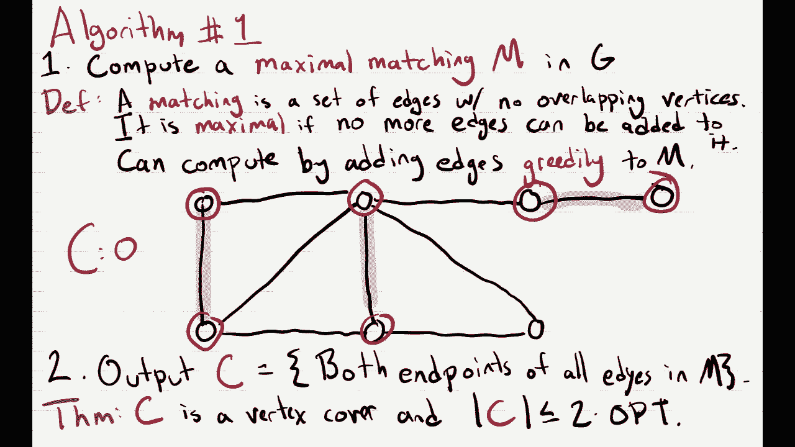
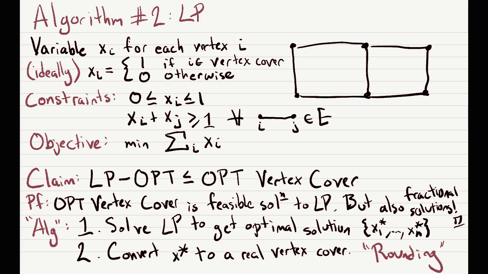
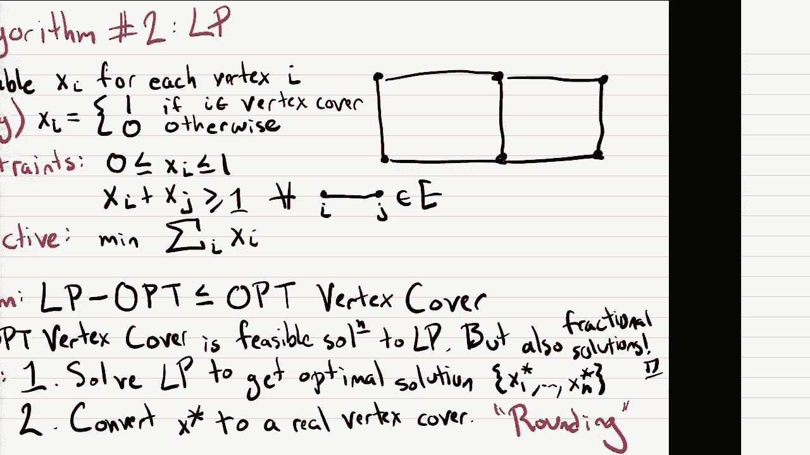
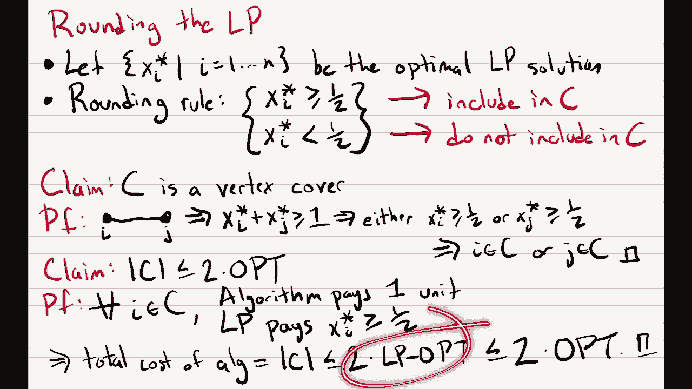
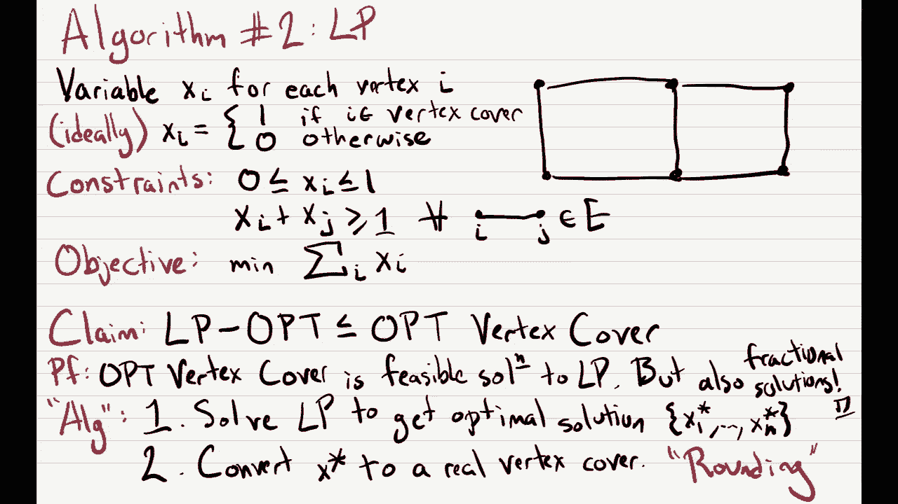
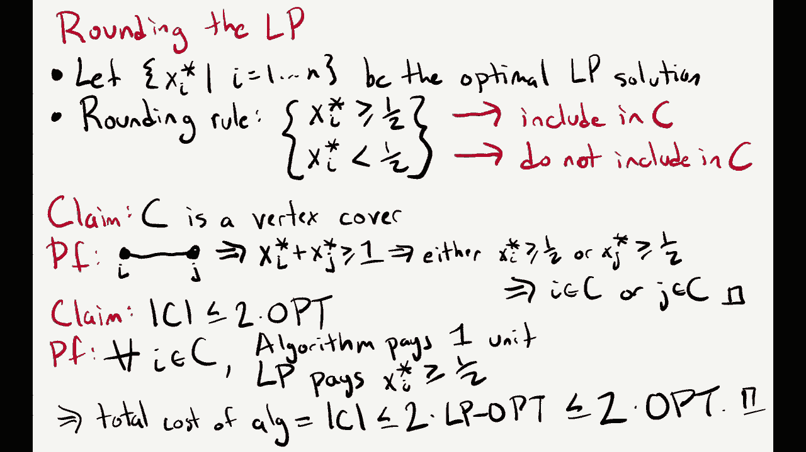
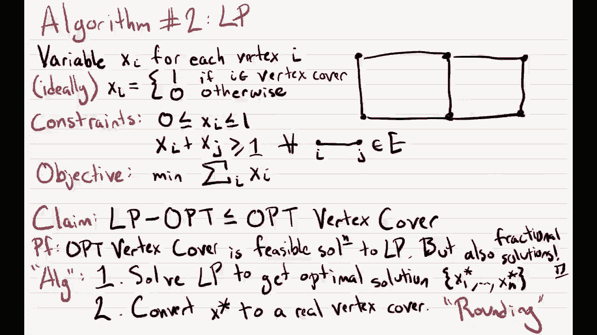
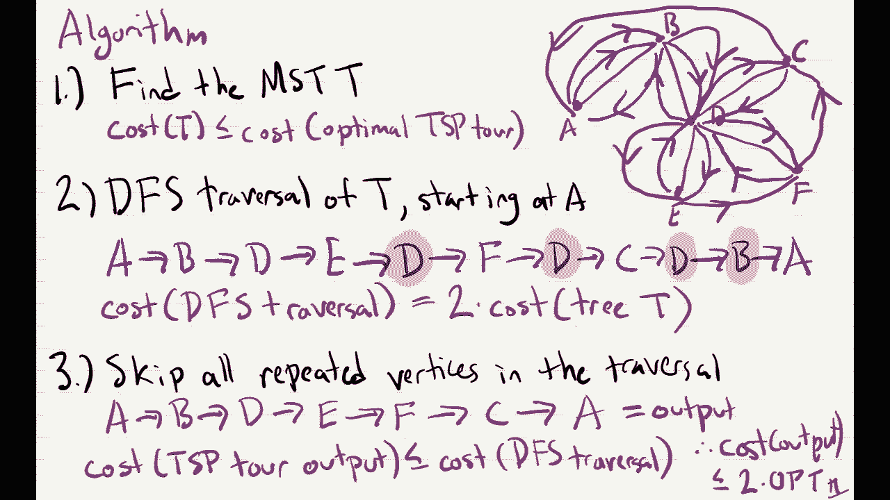
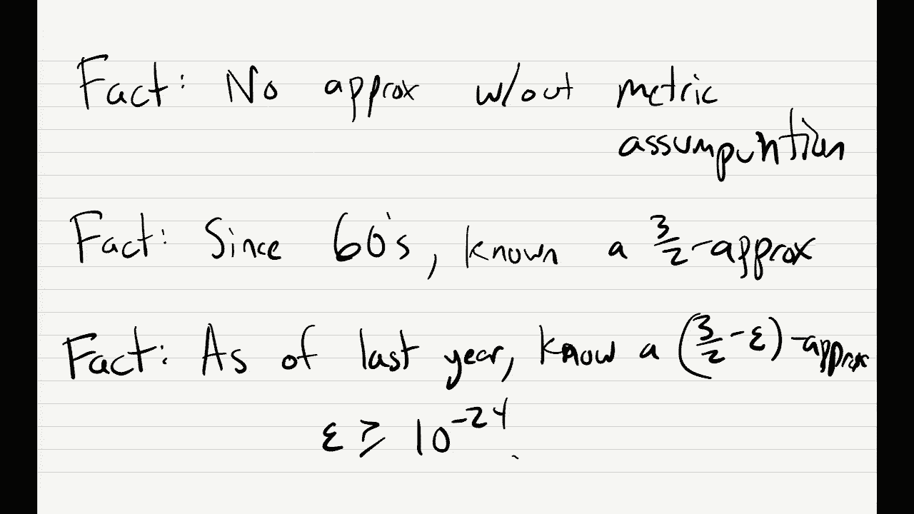

# P22：Lec22 Approximation Algorithm - 东风渐起UCAS - BV1o64y177K8

好啦，嗯，所以让我们得到，我们开始吧，向下一点，酷，今天我们要从np完备性，和np硬度和还原度，所有这些，嗯，我们要谈谈我们的下一个话题，也就是近似算法，和往常一样，在我们这样做之前，让我来谈谈。

你知道的，相关管理人员，所以第一个家庭作业12将在今晚晚些时候发布，下星期一要交，基本上是大量的降价，所以是的，我会让你非常熟悉削减，然后我们在为期中考试评分，还没做完，但应该在周三晚上完成，最晚。

所以明晚，好啦，那么让我们开始今天的讲座，然后呢，所以我们花了这么多时间，哦等等，所有的东西都消失了，我怎么把这个拿回来，我们花了这么多时间研究NP难的问题，证明一个问题是NP难的，假设你在现实世界中。

你真的想解决一个问题，你已经试了一段时间，但你做不到，所以最终你会意识到，也许它是空的，很难，你真的展示了它，你的问题是空难，嗯，那是什么意思，这意味着您可能无法为您的问题找到多项式时间算法。

因为这样做将为np中的每个问题提供一个多项式时间算法，我们不相信这是真的，嗯，但你知道你，你在现实世界里，你想解决这个问题，仅仅因为它不是NP，就因为它是NP难，不代表你不想解决。

所以你无论如何都要想办法在你的问题上取得进展，所以问题就像，你是怎么做到的，现在怎么办，有多种方法可以解决这两个问题，前两个，我将简短地谈谈它们，他们在课本上，我建议你读一下这一章，我是说这很有趣。

但这节课我们就不讨论这个问题了，但你能做的第一件事就是说好，也许你正在处理的是现实世界中的问题，也许在现实世界中，你得到的输入实际上不是问题的一般硬实例，但也许它们是更容易的输入。

所以你可以做的一件事是尝试了解更多关于输入的信息，你在现实世界中经历的问题，也许你能意识到，这些输入有一些很好的结构，使问题更容易解决，让我举一个编译器的例子，所以在编译器中有一个叫做寄存器分配的问题。

你已经有了，你知道代码中的变量，当你把它们编译成机器代码时，您想知道在任何给定的时间每个变量应该分配给哪个寄存器，事实证明，你可以把它描述为一个图形着色问题，嗯，所以如果你能解决，你知道图形着色。

比如三次着色或四次着色，它将允许您解决寄存器分配，但就我们所知，我们当然解不出三种颜色，但事实证明，如果你多花点时间看图表，寄存器分配问题，它们实际上是一类图，你可以在多项式时间内解决着色问题，事实上。

对这些图有一个线性时间算法，在现实世界中很多次，就像你处理的例子，它们不会是一般的案例，它们将是你实际上能够解决的例子，好啦，但也许你了解了你的例子，你仍然看不到任何可以利用的好模式。

所以接下来你可以尝试的是一种叫做启发式的方法，启发式就像算法的名称，那是没有可证明的保证的，所以你实际上不知道它是否会很好地工作，你不能证明，但尽管如此，当你在实践中运行它们时，有许多启发式，做得很好。

很多时候他们只是解决问题，很多时候他们比最好的解决得更快，理论上有保证的算法，嗯，所以这本书有几个这些算法的例子，像回溯或模拟退火，这些都是很好的启发式算法，人们每天在实践中运行，而且效果很好，例如。

Simplex是启发式算法的一个例子，嗯，它没有在多项式时间内运行的可证明的保证，事实上，我们知道，总的来说，它不是，然而，在现实世界中，人们一直在运行它，因为它实际上比椭球和内点方法运行得更快，好啦。

你可以尝试的另一件事是设计一种叫做近似算法的东西，以及一个近似算法，嗯，这将是一个算法，它不会为你关心的问题找到最好的解决方案，但也许你还是会找到一个很好的解决办法，希望有一个足够好的让你使用。

所以近似算法是我们今天要学习的，有很多关于近似算法的理论，人们设计了很多超酷的近似算法，这真的是目前研究的前沿课题，那么我们如何定义什么是近似算法呢，让我先为最小化问题定义它，就像小敏一样，例如。

是最小化问题的一个例子，对于最小化问题，Q，一种近似算法，所以一个算法a，据说Um是一种α近似算法，如果有任何问题，所以对于所有的情况，I，算法在实例上输出的解，所以我就把它写成。

小于或等于真正最优解的成本，好啦，所以当我说一个例子，我是说茶匙的问题，这个问题的一个例子只是一个图，你试图在上面解tsp，这表明，也许有一个最低茶匙，它的总成本等于，你在这张图上的算法，好吧。

也许它不会得到选择，但它会得到一些不比选择大多少的东西，所以不管它输出什么，这是茶匙旅游，例如，总是在最多的阿尔法时间，真正的最优，所以在这里，α是一个大于或等于1的数。

比如如果你输出的TSP巡演最多只能输出10次，比最好的茶匙坏十倍，你的α等于十，一般来说，你的阿尔法越小越好，你也知道，黄金标准是阿尔法等于1的算法，这就是最小化问题。

但是你也可以为最大化问题定义近似算法，对于最大化问题，您只需要求算法在实例上的输出，我很好，你想让它尽可能大，你想要的保证，它的值至少是最佳值的α倍，你在试图得到尽可能大的解决方案。

这将说明至少你总是得到最优解的alpha倍，既然现在是最大化，α是一个介于0和1之间的数字，所以你不能做得比最佳更好，所以你的阿尔法不能大于1，但总的来说，你希望阿尔法变得尽可能大。

关于这些定义的其他问题，我想写Q，谢谢，所以p应该是q，不管是最大化还是最小化问题，你在试图解决其他问题，是啊，是啊，是啊，是啊，所以贪婪的解决方案设置覆盖，1比e是什么感觉，或者一个log n。

或者类似的近似值，所以是的，这是一个近似算法的例子，好啦，所以在这门课上，我们将在前两个中看到三种近似算法，我们要去看他们，或者一个被称为顶点覆盖的问题，那么什么是顶点覆盖好嗯，这是一个问题。

你的输入只是一个图表，无向图，G，嗯，这个问题的解决方案，嗯，它只是一个顶点覆盖，我将用字母c作为顶点盖，嗯，顶点覆盖将是子集，顶点的一些子集，我马上给你下定义。

你的目标是找到一个最小尺寸的图的顶点覆盖，好啦，所以你能找到的最小的顶点覆盖，所以问题是，什么是顶点覆盖，顶点覆盖就是，让我这么说吧，然后我会写一个顶点封面，它将是顶点的子集，以至于。

图形中的每条边都与封面中的至少一个顶点相邻，所以它是一组顶点，使每一条边，到集合中的一个顶点，所以重点是你的顶点覆盖了图中的所有边，让我举一个例子，如果这是你的图表。

有人能告诉我这个图的最小顶点覆盖的大小吗，三为什么，是一个顶点覆盖，为什么那口井，我们只需要检查图中的每一条边，这条边肯定是紧邻红色顶点的，这条边与红色顶点相邻，这与中间的红色顶点相邻。

这个也和中间那个相邻，这个也是，然后这两条边与右上角的顶点相邻，所以这三个红色顶点覆盖了图中的每一条边，事实证明，这个问题，就像我们在这门课上讨论过的许多问题一样，NP真的很难吗，我不会证明这一点。

这是你知道的事情，这是你可以在家做的练习，但是嗯，有人想猜猜，我是说，为了证明这很难，我们必须从一些NP完全问题中减少，那是什么感觉，你认为我们应该减少什么，你可以做三种颜色，这是一个更好的减少，是啊。

是啊，独立集，所以如果你坐下来想想顶点覆盖要求什么，它与独立集问题密切相关，所以这意味着，从独立集合到顶点覆盖有一个非常容易的简化，所以顶点覆盖是NP难的，所以现在让我们尝试为这个设计一个近似算法。

然后再一次，因为这很难，我们不认为会有一个完美的解决方案，但也许我们可以找到一个尽可能好的解决方案，是啊，是啊，至少可以是一个，是啊，是啊，所以说，例如，就像这个图中的六个顶点一样。

它们形成了一个大小为6的顶点覆盖，只是不是最小的顶点覆盖，问得好，有关此定义的更多问题，啊，像什么，减持效果如何，是啊，是啊，它从独立集开始，然后从独立集还原到顶点覆盖，我想课本上也有。

但在家思考就像一个有用的练习，好啦，让我告诉你们这个问题的第一近似算法，我来说明，然后我们会花一两张幻灯片来证明它为什么有效，为什么它得到一个很好的近似值，嗯，所以这将是第一个算法，我只想说，首先。

设计近似算法的一般哲学，你如何为一个你不能很好地计算的问题设计一个算法，你应该做的是，你应该为不同的问题设计一个算法，你可以计算出，然后呢，希望这个不同的问题与，你真正想解决的问题。

所以如果你能计算出另一个问题的解，然后你也许可以把它转换成你关心的问题的解决方案，这种转换往往会有一点点损失，这就是你要得到近似值的地方，但通常你知道第一步总是像这样思考。

我能计算出的最简单的问题是什么，这实际上就像我想计算的问题，所以对于一个顶点，盖上，像这样的事情，我们实际上可以计算出一个叫做最大匹配的东西，所以我们算法的第一步是计算，所谓的最大匹配，我们称它为m。

这将是一个g中的匹配，好啦，那么什么是最大匹配，嗯，我们已经在二部图中看到了匹配，这只是将这个定义扩展到非二分图，所以如果你记得在二分图中的匹配，它就像边的一个子集，其中成对的顶点。

所以每个顶点都与另一个顶点配对，一般图中的匹配是一样的，它只是将顶点配对的边的子集，所以你知道没有顶点是两对不同的，让我正式说明这一点，图中的匹配，它将是一组边缘，没有重叠的顶点。

所以这意味着每条边将配对两个顶点，唯一的是没有顶点会与两个顶点配对，每个顶点最多只能与一个顶点配对，然后可能有一些顶点在匹配中没有边，所以有些顶点根本不会配对。

它是一个极大极大匹配意味着什么呢它是极大的，嗯，如果你不能在匹配中添加更多的边缘，那是什么意思呢？嗯，我有一套边缘，我不能在匹配中添加更多的边缘是什么意思，好吧，只是意味着任何不在我匹配中的优势。

这是我图表中剩下的，在我的匹配中，两个顶点中的一个已经配对，让我向你们展示如何计算图的最大匹配，嗯其实谁能建议像，如果我想计算一个最大值，让我强调不是一个最大值，我不在乎，如果这是最大的匹配。

我可以找到我只想要任何匹配的，哪里，我不能再给它加边了，有人想建议，也许我可以运行什么样的算法来做到这一点，让我等几秒钟，看看有没有人，好极了，是啊，是啊，所以答案是做一个贪婪的算法，所以这是正确的。

我马上用图表来运行它，但我们可以计算任何最大匹配或最大匹配，只需贪婪地在匹配中添加边缘，你先开始，也许你的匹配，因为里面什么都没有，然后你只要挑一个边缘，将其添加到您的匹配中。

然后删除所有与这条边相邻的边，现在你只需贪婪地选择另一条边，并将其添加到匹配中，你就一直这样做直到你不能再这样做了，例如，假设一个图形是这样的，我将在这个图中计算一个最大匹配，好了，这是一个图表。

所以我要贪婪地添加一个边缘，或者贪婪地在我的匹配中添加边缘，所以我可能会加上这条边，这是第一条边，我刚刚捡的，现在我要，那是我匹配的第一条边，现在我要在我的匹配中添加更多的边缘。

但现在我不能加上这条边或这条边或这条边，因为它们都在边缘附近，我已经加了，所以我会贪婪地把它们扔掉，我不会再看他们了，也许下一步我会把这条边，嗯，一旦我把这个边缘添加到我的匹配中，我也不能用这些边。

因为它们都与这两个顶点中的一个相邻，然后我会添加唯一剩下的边缘，我可以贪婪地添加，哪个是这个，而现在，图中剩下的每条边都与这些顶点中的一个相邻，已经在匹配中了，所以我不能在匹配中添加任何其他内容。

所以这是一个匹配的，因为没有一条边是重叠的，而且是最大的，所以这是第一步，我们计算了一些我们实际上可以在多项式时间内计算的东西，在这种情况下，只需使用贪婪算法，但你记得我们要计算的不是匹配。

我们要计算一个顶点覆盖，第二步，我们必须把这个最大匹配转换为顶点覆盖，那么我们要做好什么呢，我们将输出c的复盖，其定义如下，我们只输出c将包含每一个，嗯，每个顶点，在匹配中的一个边缘，所以换句话说。

你要穿过匹配中的每一条边，你只要把两个端点，所以这意味着如果c是，我们要画一个红圈，这意味着我们把这个顶点，这个顶点，这个顶点，这个顶点，这个顶点和这个顶点，但是我们不把右下角的顶点。

因为它不与任何匹配的边缘相邻，好啦，现在我们要在下一张幻灯片上证明的定理是双重的，第一个C是顶点覆盖，以及c的大小，C中的顶点数最多是两倍，最优，所以它不仅是一个顶点覆盖，这是一个很好的顶点覆盖。

关于这个的问题，顺便说一下，让我指出，我是说你可以从这张图表中看到，这个匹配确实是我们的文本封面，图中的每条边都与这些红色顶点中的一个相邻，这个这个，它们都与其中一个红色顶点相邻。

所以它确实是这个图的顶点覆盖，好啦，所以让我们证明这一点。

嗯，所以第一个说法是c是一个顶点覆盖，我如何证明这一点，证明这一点最简单的方法就是假设，为了矛盾起见，它不是顶点覆盖，为了避免矛盾，让我们从这个假设开始，它不是顶点覆盖意味着什么。

这意味着在图中有一些边，其中两个端点都不在C中，所以存在，嗯，顶点u和顶点v之间的边，在我的边缘里，使得两个顶点都不在我的集合覆盖或顶点覆盖中，但如果这是个案子。

然后我声称我可以把这条边添加到我的最大匹配中，因为这个边缘，它和我匹配的任何边缘都不冲突，我已经开始，所以我可以把这条边添加到我的最大匹配中，但这与我的匹配度最高的事实相矛盾，所以让我写下来。

我们可以加上，这个边缘UV到匹配的M，但是你知道，M是最大值，最大值意味着没有更多的边可以加到m上，因为我们已经把所有的边都加了进去，所以这是一个矛盾，所以是的，没有露出的边缘，因为图中的每条边。

你知道的，它必须与匹配中的至少一个边缘相邻，好啦，所以让我们证明索赔的另一部分，上面说你的顶点覆盖的大小，C最多是最佳顶点覆盖的两倍，再次选择这里，它只是最小顶点的大小，所以让我证明这一点，好啦，嗯。

嗯，因为它是一个顶点覆盖，让我们来考虑这个最小顶点覆盖，嗯好吧，任何顶点覆盖，真的吗，它覆盖了每一个边缘，尤其是，它会覆盖每一个边缘，在我的配对中，M，好啦，所以每个顶点覆盖必须覆盖匹配m中的每条边。

把边缘盖住是什么意思，这意味着顶点覆盖必须包括，这两个顶点中的一个，所以它必须包括u或v，或者可能两者兼而有之，所以这告诉我们最佳顶点覆盖，最佳顶点覆盖的大小，它必须在匹配的每条边中至少包括一个顶点。

所以它必须包括至少m大小的边，这是因为匹配中的每条边都是不相交的，所以我得从，每条边，我得挑一个顶点，这对我掩盖任何边缘都没有帮助，匹配中的任何其他边缘，所以我真的必须从匹配的每条边中选择一个顶点。

所以嗯好吧，你知道的，我们的顶点盖，我们输出，只是会是，它的大小等于m的两倍，因为m的大小最多可以选择，这告诉我们它最多有两次选择，这就完成了证明，所以这是一个二近似值，关于这个的问题，哎呦。

因为我们选择顶点覆盖的方法，嗯顶盖是，你在匹配中占据了每一个优势，你把两个端点都放在顶点盖上，所以我匹配的尺寸，你知道的，我的顶点盖有两倍的大小，M，嗯，我想这是因为它不会是一个顶点，盖上C。

让我想想为什么会这样，是啊，是啊，我是说，它是，是为了这个，C是顶点覆盖的说法，所以如果我们有布景，E，这不是在嗯，这是一个优势，但它不在，它没有被顶点覆盖，对不起，我写错了吗，这应该是紫外线不在C中。

是啊，是啊，所以嗯，你想要吗，这样两边都有，匹配中每个边的两个端点，因为如果你没有，然后你可能有一个像这样的边，两个顶点都不在你的封面上，但也许你不在封面上，也许它实际上在一个匹配的边缘。

但你只是没有把它加到封面上，这意味着你不能在我的匹配中添加紫外线，因为它实际上与已经存在的优势相冲突，所以我们要把两边，因为这意味着任何未覆盖的边缘都会与，还是对不起，我们必须添加两个端点。

因为这意味着任何未覆盖的边缘，两个顶点都不会，嗯，与匹配中的任何东西冲突有意义吗，更多问题，是啊，是啊，我是说，在这种情况下，是啊，是啊，这不会很好用的，如果图中的顶点覆盖与至少一半的顶点相似，例如。

因为也许这个算法会输出所有的顶点，但有些图的顶点覆盖实际上很小，所以我的意思是，把它想象成星图，就像中间的一个顶点，然后很多像这样的边缘，最小的顶点覆盖只是中间的顶点，而这个算法会。

它保证会找到一个大小为2的顶点覆盖，而且总的来说，就像找到最小顶点覆盖，这是一件非常困难的事情，嗯，但是如果你有一个很小的，你希望能找到一个相对较小的，而这个将达到两倍，这真的取决于你。

喜欢两个是一个大因素还是一个小因素，是啊，是啊，我会说实际上两个是最好的因素，也是，所以我们知道模就像一个小猜想，很难找到比2近似值更好的方法，所以如果你能得到顶点覆盖的1。99近似值。

你证明了p等于np，好啦，还有一个问题，有一个猜想基本上每个人都相信是真的，如果这是真的，那么这个问题确实是，在这两个方面很难进步，我们可以下课再谈，是啊，是啊，但是是的，只是一种猜测，这似乎是真的。

并暗示这是最好的算法，好啦，所以这是算法算法，让我给你第二个顶点覆盖的算法，这个算法将使用我们已经看到的另一个算法范式，所以不贪心，但是线性规划，好吧实际上，对于许多近似算法。

我们最好的算法就是用线性规划，再一次，你知道这里的哲学是，我们不知道如何解决顶点覆盖，所以让我们来解决另一个似乎与顶点覆盖有关的问题，我们将在这里看到的是，有一种方法可以建立一个线性程序，看起来很像。

所以让我在这里画一个图表，虽然我不是真的要用它，嗯，所以也许这是你的图表，你想在里面解顶点覆盖，所以让我们写下一个自然的线性规划，计算这个图中的顶点覆盖，嗯，嗯，我们有六个顶点，你想知道每个顶点。

是在顶盖里还是不在顶盖里，所以我要做的是引入一个变量，对于每个顶点i，我们称它为x i，理想情况下我希望线性程序为我计算的，嗯是X，我希望它等于1，我就像在最佳顶点覆盖，然后我希望线性规划为零。

如果i不在最佳顶点覆盖中，好啦，所以现在，我们有一组变量，我们对图中的每个顶点都有一个，现在让我们写下一组约束，告诉我们，这使得这些变量实际上看起来像一个顶点覆盖，所以我们的限制首先是。

我是说你永远不可能在线性规划中，告诉它每个变量不是0就是1，你只能告诉线性规划，变量在0和1之间，所以对于每一个变量，至少是零，最多是一，然后我们希望它与顶点覆盖相对应，这意味着对于每一条边。

您从两个端点中选择一个，所以我们要用这些变量来写这个，对于所有边，x i加x j至少是1，I，J，在图中，所以如果我们知道x i和x j都是0和1，然后呢，我们满足这个约束的唯一方法是。

通过将两者中的至少一个设置为等于一，然后我们还需要一个目标函数，我们的目标函数，我们只是想最小化顶点覆盖的大小，顶点覆盖的大小就是，x的I，I，好啦，这是我们的线性规划，然后呢，嗯。

我们要做的是运行这个线性程序，但是嗯，首先我想宣布一个关于线性规划的事实，事实如下，如果我们运行这个线性程序，它计算的最佳值将小于，或等于最佳顶点覆盖的大小，为什么那口井，我们所有的顶点覆盖，尤其是。

最佳顶点覆盖，实际上是这个线性规划的可行解，所以我可以取最优线性规划，还是对不起，最优顶点覆盖，把它作为线性规划的可行解，我得到的客观值是opt的大小，但是你知道。

线性程序--它们不会只有总是对应于顶点覆盖的解，它们也总是可以有分数解，那些分数解，就像他们甚至可能得到比最小顶点更小的值，是啊，是啊，所以证明就完成了，我是说，因为每个顶点覆盖都是可行的。

这立即告诉我们LP选择小于，或等于最佳顶点覆盖，事实上，可能会有额外的，分数解，告诉我们lpp可能真的，严格小于最佳顶点覆盖，所以我们的算法将如下工作，我要用引号写算法，因为这还不是算法的完整规范。

第一步，它将解决LP问题，它会得到一个最优解，LP的最优解，而这个最优解，我把它写成x 1星到x n，所以你得到的每一个顶点，你知道的，对于顶点，我得到一个数字x i星，保证在零到一之间，然后在第二步。

你知道第一步的问题是，一如既往，我们可以在多项式时间内完成它，所以这是一个我们可以在多项式时间内解决的问题，但解决方案不一定是一个真正的顶点覆盖，因为它可能给我们一个分数线性规划的解，所以在第二步。

我们必须把它给我们的x星转换成一个真正的顶点覆盖，我会在下一张幻灯片上告诉你怎么做，但我只想说总的来说，当你设计这样的算法时，第一步，你设计一个线性程序，然后第二步，您将其转换为一个真正的解决方案。

步骤二总是称为舍入，它被称为四舍五入的原因是，你知道你在取一个小数值，你把它转换成一个整数值，而且通常，你要取你的分数值。

并将其转换为附近的整数值。

好啦，那么让我们看看如何绕过这个LP，假设我们有一个LP的最优解，在1和n之间的每一个i都有一个x i星，然后我要定义一个规则告诉我们，我们如何将x i星转换为顶点覆盖，所以这就是四舍五入的规则。

规则是这样规定的，我们要以以下条件为条件，如果x i星是大是小，所以它会大于或等于，还是会严格地少于一半，你记得一个意味着你在顶点盖上，最理想的情况是，所以我们希望我们的运行算法是这样的。

也许即使你不是，但你就像非常接近一个，你还在顶盖里，所以我们的具体规则是，如果你至少有一半，我们要把你包括在顶点封面上，如果你不到一半，我们将不包括，在顶点覆盖中。

所以这真的就像把你四舍五入到最近的整数，然后你在一半时打破平局，总是四舍五入，好啦，所以现在我们要证明关于第一个的两件事，我们必须证明这个c确实是顶点覆盖，然后第二个。

我们必须证明它并不比最优顶点覆盖差多少，再一次，我们将看到它最多是两倍的糟糕，是啊，是啊，对不起，你能说大声点吗，对不起，别人能吗，打破了其中一个约束，哎呦，你的意思是，打破约束意味着什么。

所以这意味着当我们输出顶点覆盖，其中一个边缘没有覆盖，哎呦，那很好，是啊，是啊，我是说，好吧，首先，我是啊，我想你应该这样想，就像我们有线性规划解一样，我们要把它转换成顶点覆盖。

一旦我们有了固定的线性规划解，我们不会想更新它，求新的线性规划解，只是我们有X星，我们要把它转换成c所以x星，就像一个固定的东西，就像你的电脑给你这个X星，这是一个数字列表，都在零到一之间。

使用这个数字列表，你只需要用这个规则构造c，我们将看到这个c最多确实是一个大小的顶点覆盖，两次，选择，好啦，所以让我先证明这个说法，我们在这里得到的C确实是我们文本封面的。

那么作为一个顶点覆盖井意味着什么，我们得看看每一个边缘，I和J，检查这条边缘是否覆盖，嗯这个边呢，因为x星是一个可行的解，它必须满足线性规划中的每一个约束，其中一个约束说x，我星加上x j星至少是一个。

但如果他们两个，当你总结它们的时候，你得到的数字至少是1，这意味着其中一个必须至少是一半，如果其中一个至少有一半，你肯定在你的顶点封面上包括了其中一个，由于我们的四舍五入规则，所以这意味着i在c中。

或者j在c中，或者两者都在C中，所以这正好证明了我们图中的每一条边，我们在顶点中至少包括两个端点中的一个，好啦，嗯，现在让我认领这个的另一部分，它是一个小的顶点覆盖，特别是它的大小最多是选择的两倍。

所以嗯，让我们考虑一下，嗯，让我们考虑放在顶点盖内的每一个顶点i，所以对于我们放入顶点覆盖中的每一个顶点，算法将支付一个成本，因为每个顶点，你知道的，它在你的顶点覆盖中算作一个，但是对于c中的每个顶点。

LP也要付出一些成本，所以对于C中的每一个顶点，在你的顶点覆盖LP的值，因为至少有一半，嗯，所以特别是，这意味着你的顶点覆盖的大小将是啊，让我看看，LP值将至少为1，顶点覆盖大小的一半。

所以让我用另一种方式来写，这意味着算法的总成本，它等于顶点覆盖的大小，最多两次，线性规划最佳值，因为再一次，每次算法支付一个，有限合伙人至少付一半，所以你的成绩永远不会比lp的两倍差。

但正如我们已经看到的，LP选择比真正的选择小，所以这最多是真正选择的两倍，这就完成了证据，好啦，所以再一次，1。第一项索赔，你知道的，给我们一个顶点掩护，这个只是说，由于我们的四舍五入算法，嗯。

我们在顶点覆盖中放置的唯一顶点，是那些LP已经给了很大价值的，所以如果LP有一个很大的，我们能有一个大顶点覆盖的唯一方法，是为了让有限合伙人也有很大的价值，关于这个的问题，我不确定我是说。

贪婪的那个肯定更好，就像运行时方法，它就像一个贪婪的算法，这是命令，而LP，你知道你可能得像椭球一样跑，或者这些非常复杂的算法中的一个，现在你可能会问哪一个的近似比更好，我猜他们大多数时候都很糟糕。

但是是的，我其实不知道哪一个更好，这一个那么为什么像两次LP选择最多。

两次选择，所以这实际上来自上一张幻灯片，在那里我们证明了这一说法，LP选项小于，或等于最佳顶点覆盖，然后呢，这是，因为任何最优顶点覆盖都是可行的，LP的解决方案，嗯，所以。

如果您使用最佳顶点覆盖作为LP的解决方案，你的目标值就是顶点覆盖的大小，它是一个最小化的，所以它实际上可能有一个比这个大小更小的值，所以这就是为什么我们知道LP选择小于，或等于最优，好吗？

啊，就像，为什么解决LP多聚时间，我想这就是我们在，就像猪教授的LP讲座，塔拉布嗯给了这么喜欢，我们有两种算法，一个叫椭球，另一个叫内点，保证在多项式时间内解线性规划。

是啊，是啊，你绝对可以我是说，如果您在这里添加了一个附加规则，也就是说x i要么是零要么是一要么是整数，那么这将精确地计算出最小顶点覆盖，这就是为什么他们称之为整数线性规划的原因之一，这是一个NP难题。

实际上你会在讨论中看到这一点，就像线性规划一样，你可以在多项式时间内解决，但是如果您添加额外的约束，即变量是整数，它变得np硬了，是啊，是啊，我是说，这个想法是我们不能完美地解顶点覆盖。

但如果我们让自己差两倍，然后我们可以在多项式时间内完成，哦很好，你在说为什么，为什么我们得到这个2的因子。

是啊，是啊，让我来展示一下，是啊，是啊，这里有一个图的例子，它具有这个性质，我们有三个顶点，如果我们写下与这个图相关的线性程序，它将是最小x 1加x 2加x 3，好吧，每一个边缘。

我们需要两者之和至少是一，所以1加2至少等于1，二加三至少等于一，那么x1加x3至少等于，所有这些都在0到1之间，那是我们的x，x2 x3，在零到一之间，所以首先问题是，LP在这张图上做什么，结果是。

如果你用你的LP求解器运行这个，你会发现它会让x1等于x2，等于x3，等于二分之一，所以就像你说的，每个变量都设为，因此，LP选择将等于，你知道的，等于这三者之和，等于三个半。

但是谁能告诉我这个图的最佳顶点覆盖是什么，也是，是啊，是啊，就像在这个图中，你知道如果我，如果我在我的顶点覆盖上加一个，然后我被迫加两个或三个来覆盖两个三个边缘，所以最优顶点覆盖，等于一二，它有二号。

和算法什么会输出很好，它会输出，它只是看每一个变量，他们都是一半，它会把他们围捕起来，所以它将输出包含每个顶点的顶点覆盖，也就是三个，好啦，所以你知道这个算法，这是两倍的糟糕，不像原来的顶点覆盖。

但实际上作为LP，但你还可以编造其他图表，算法实际上比真正的顶点覆盖糟糕两倍，但这至少是一个例子，你知道它做得不好的地方，那不是半个出口吗，啊，LP被允许，如果它想将事情设置为非整数值。

如果它是如果它被限制总是返回0和1，然后它必须返回一个真正的顶点覆盖，所以能得到的最小lp值是2，但是LP，你知道的，它只是尽力做到最好，获取这些约束的最小值，它不知道这些约束来自顶点覆盖，为了它。

它实际上可以做得比2更好，通过使用这些半的分数值，你也知道，LP，就像它不在乎，它只是想尽一切办法得到一个尽可能小的值，这可能包括给你小数，有限合伙人的选择将是三个一半，是啊，是啊，正确答案是二。

然后算法会输出三个，所以当三个数字都不同时，好啦，让我们做吧，而不是休息三分钟，休息两分钟，如果有人能，你知道的，把后面的门关上，那就太好了，你介意吗，如果我问一个问题，是啊，是啊，一个，是啊，是啊。

哦耶，那些人可以你们能把后面的门关上吗，谢谢好的，嗯好吧，所以现在，我们要继续前进，到我们今天要讨论的最后一个问题，这就是茶匙问题，我们要为这个设计一个近似算法，所以让我提醒你，我们要看的版本如下。

我们的投入将是N个城市，然后我们要看版本，在那里你可以拿任何一双，你可以从任何城市去任何其他城市，好啦，所以我们不会有这个案子，我们不打算看这个案子，在那里有一个图表告诉你哪些边你可以采取，你将有。

你将被允许从任何城市到任何城市，会有一段距离，这告诉你对于所有i不等于j，它有多远，从I城到J城的距离是多少？就像我们要用的图片一样，你知道的，你只是有一些城市坐在那里，嗯，在太空中，每一对这样的。

就像有人告诉你从一个到另一个需要多远，一如既往，解决这个问题的办法将是最小距离旅游，访问每个节点，好啦，所以这就像标准的旅行销售人员问题，正如我们所知，这就像是一个NP难题，据我们所知，这并不完全。

因为你怎么知道你是在最低限度的旅行，但至少很难，所以你可能会问，我们能为这个问题设计一个近似算法吗，基本上答案是否定的，所以你可以证明这一点，这就像是对汉密尔顿循环问题的一种简化，没有。

只是没有近似因子，你可以为一个旅行的销售人员买到，所以你不能把最优解近似到一百万，你不可能把它近似到十亿，你不能把它近似于任何数字，所以是的，那件事值得考虑，我想课本上也有，但这就像一个很好的锻炼。

比如你怎么证明这一点，我们将从汉密尔顿循环开始，但事实证明，你可以对这个问题做出合理的限制，这被称为度量限制，如果你把这个限制放在问题上，然后你就可以得到一个很好的近似算法，那么度量假设是什么。

这是一个非常合理的假设，叫做三角不等式，让我先把它用数学写出来，上面说所有的城市，I，J，和K，如果我看从i到j的距离，再加上从j到k的距离，至少从i到k的距离，所以让我们看看图片，它是这样说的。

如果我看从i到j的距离，然后j到k比距离大，如果我直接从i到k，换句话说，它只是说直达的路线总是最短的，这似乎是一件合理的事情，你知道的，如果我想从一个地方到另一个地方，它几乎从来没有帮助我经历。

先去别的地方，所以我们假设它总是，直接去你想去的地方从来没有坏处，而不是通过一些其他的顶点，我们将证明一旦你有了这个度量条件，你实际上可以设计一个近似算法，他们是阳性的吗，是啊，是啊。

让我们把它扔在那里，也是，是啊，是啊，我想这也是公制条件的一部分，那么好，让我们为这个问题设计我们的算法，对于这个算法，让我让我看看，尝试复制此图，这里我们有一个节点，节点，B节点，C，D会在中间。

E好吧，看看行不行，好啦，所以第一步你记得，我们正在为一个问题设计一个近似算法，我们实际上不知道如何解决，所以第一步你应该永远喜欢，试着解决一个你实际上可以在多项式时间内解决的相关问题，嗯。

看起来你真正想解决的问题，所以你记得在旅行销售人员问题中，你想去看你，你想找到一个循环，访问每个顶点一次，这让你想起了其他问题吗，就像访问每个顶点一次只需很少的成本。

这是否让你想起了我们已经解决的其他问题，实际上在这个类的多项式时间里，是啊，是啊，很好耶，山，所以第一步是，我们只是去找MSST，图的最小生成树，所以你记得最小生成树，就像一棵树，它连接了所有的顶点。

嗯，它有最小的成本可能，就像，你知道的，就像旅行推销员，只不过你给的是一棵树而不是一个循环，所以我不知道这个问题，也许或者为了这个图，也许我们想出的树就像连接A到B到B到D。

让我们看看d到c d e和d f，啊，好了现在，为什么找一棵树很有趣，我声称这个最小生成树的代价，实际上会少于，或等于最佳TSP旅游的费用，为什么那口井，嗯，你知道的，最小生成树。

就像不只是连接所有顶点的最小成本树，嗯，正如我们所看到的，就像在最小生成树讲座中，它实际上是连接所有顶点的最小成本子图，所以任何连接所有顶点的子图，如果你想让它是最低成本，就像一棵树，嗯。

但是一茶匙的旅行，你知道的，它就像连接所有顶点的子图，它甚至这样做就像轻微的，有效地利用比实际需要更多的边缘，如果它想连接所有的顶点，所以就像TSP之旅一样，它的总成本将是，至少MST的成本。

所以我们就这么做了，那是聚变时间，现在我们必须把这个MST转换回TSP旅游，所以我们要做的是，我们只是沿着这棵树的边缘，我们将用它们来给我们展示一下图表，我们要怎么沿着这棵树的边缘，嗯。

一个很自然的事情就是先做一个深度搜索遍历树，所以让我们用dfs来探索这个图，而且是的，当我说探索图表时，我是说，让我们来探索这棵树，所以我们只把树的边缘，只是为了好玩，让我们从一个，所以让我画一个茶匙。

对不起，dfs对此的遍历可能看起来像，也许你从一个，然后你去B，然后从B你知道，接下来你去d，然后从D开始，让我们看看你去找一个邻居，也许E，从井里什么都没有，它没有额外的邻居，所以e要回到d。

我也把这些都写下来，就像我们目前正在做的订单一样，是A去B，B去D去E，然后我们现在回到D，啊，让我看看，D，也许下一个会变成f，然后如果我们要回到D，最后我们回到c然后回到d，好啦。

那么我们在这里做什么，我们去了F回了D，然后我们去C，回到D，最后深度搜索会回到b，最后回到一个，好了，我们已经对这个最小生成树进行了深度搜索，我们参观了所有的顶点，这有点像一次旅行。

除了你知道我们已经访问了一些顶点两次，这是个问题，但让我们忽略这一点，就目前而言，这似乎很好，我声称通过做这个深度优先搜索遍历，我们接受的所有边缘的成本，这种深度优先搜索遍历实际上很小。

我说这正好是成本的两倍，这棵树的成本，T，为什么井深优先搜索，你知道它会从一个顶点开始，它会取下这些边缘中的一个，然后最终它会回到另一个方向的边缘，所以当我们进行深度搜索时。

我们总是取一条边然后去那个顶点，在某个时候，我们会回到那个边缘，所以我们利用每一个优势，两次，所以，这次深度搜索遍历的总成本是，最小生成树的代价，好啦，但现在我们有一个不同的问题，它访问了所有的顶点。

但这不是茶匙之旅，为什么因为它不止一次地访问一些顶点，我们应该做的就是参观一下，我们应该跳过我们重复的顶点，这将是第三步，我们要把这个遍历，我们将跳过所有重复的顶点，在遍历中，所以让我强调一下。

你知道的，这个遍历我们从a开始，然后到b d e，然后我们打这个D，我们已经去过了，让我们把它从遍历中删除，不要去那里，我们直接从e到f，为什么这个罚款，嗯，你还记得吗，我们有度量假设。

它说直接从e到f总是更好，嗯，直接从e到f对我们没有坏处，然后先去d再去f，既然我们已经去过了，我们就不需要再去那里了，所以就像我们在这里再次访问D一样，所以我们可以删除我们又访问了这里。

然后我们又在这里访问了B，然后在最后你知道你访问了一个，但那个A就像它绕着圈，所以那很好，就像开头和结尾应该是一样的，但其他地方你只能去一次，所以让我写我们新的TSP遍历，所以我们从a现在到b d e。

到c，最后回到a，所以从图像上看，让我们看看我能不能从a到b做到这一点，B到D哦，这看起来不太好，然后D到E，现在它直接到f，所以它不再去d了，现在f直接到c，所以它不会回到d，然后c会一直循环到。

所以现在我们没有重复的顶点，这确实是一个茶匙之旅，所以这将是我们算法的输出，好啦，所以让我们看看我们输出的这个TSP旅行的成本，嗯，我声称它少于，或等于dfs遍历的成本，嗯为什么那么好啊，你知道的。

dfs遍历，我们所做的只是用三角形不等式跳过一些顶点，所以这就像我说的，如果我们在这里，我们从e到d再到f，但是如果你删除d，直接从e到f，它只会降低你的成本，所以茶点之旅永远不会有成本。

这比dfs遍历要大，我们有，哦很好，所以这是问题中假设的一部分，我们假设每对顶点都是连通的，好啦，所以现在让我写这个很小的，所以我们现在有三件事，这里有三个声明，我们有T的成本是。

最多最优茶匙旅游的费用，我们有这个，我们有这个，所以说，让我们把他们三个放在一起，它说，因此我们在这里的产出成本，让我试着把输出的成本写得很好，所以输出的成本，它小于或等于dfs遍历的成本。

dfs遍历的开销是树开销的两倍，而且树的成本最多就是最优TSP游览的成本，所以把所有这些放在一起，输出的成本最多是选择的两倍，这告诉我们有一个TSP的因子近似算法，哦耶，所以嗯，如果我们没有三角不等式。

那么我们就不会有这个可以删除的属性，例如D，然后直接从e到f，我们就不会有不伤害我们的财产，如果没有三角不等式，可能是从e到f的边，只是它的成本比边缘高得多，E到D，然后D到F，这就像我之前说的。

我把它写在下一张幻灯片上，我猜，但是嗯，如果没有度量假设，对于TSP没有近似比，你不可能有十亿，你不能有N，你不能有两个到N，你不能有任何数字近似比，所以你真的需要这个度量假设，啊，是啊，是啊。

那么这两者从何而来呢，两者出现，是啊，是啊，所以你的茶匙之旅，最多就是dfs遍历和dfs遍历，它的成本是，树T的成本，因为你把每条边都取了两次，这就是因子2的来源，其他问题，有什么财产，你的意思是。

我们怎么可能在最后回到一个，哎呦，我们怎么把这些都放在一起才能得到我们的期末考试，好啦，所以我们想，我们关心产出的成本，这就是茶匙在我们产量中所占的成本，这小于或等于dfs遍历的成本，因为三角不等式。

那么dfs遍历的成本在这里正好等于两倍，树T的成本，所以这意味着我们的生产成本低于，或等于树T成本的两倍，然后从这里，树T的成本最多是最优TSP旅游的成本，所以这是有道理的，其他问题，啊好吧。

你可能需要一个更好的近似值，我猜，嗯，是啊，是啊，就像你知道的，也许你是啊，做这些事可能要花很多钱，所以你只是想尽可能多地存钱，否则需要时间，就像你知道的，我宁愿去每个城市，一半的时间比用两倍的时间。

但第二因素很好，这真的取决于你的应用程序，这对你有多重要，我想就像在现实世界里一样，当然，现实世界总是有点像三角不等式，令人满意的事，就像我从一个地方到另一个地方的距离，就像道歉从来没有坏处。

我总是可以从一个地方到另一个地方，就像，至少和从一个地方到另一个地方一样快，中间还有一个地方，就像现实世界确实满足三角不等式，和许多情况一样，许多情况确实满足三角形不等式，所以这是一个相当普遍的事情。

你只是看到它到处出现，这是个好问题，虽然，我其实不确定，如果有TSP应用程序，不满足三角不等式，我觉得这很自然，你为什么不满足这一点，是的，是的，我不能肯定答案，哦耶，但就像我们说从这里到这里。

我得走下山谷，但我可以去另一个地方跳过价值，从这里到这里最好的方法就是沿着这条路走，你知道的，嗯，就像你一样，别把那算作拜访，你知道这个城市，我猜，是呀，哦耶，那就有问题了，我是说。

这就是为什么我们需要，嗯，是啊，是啊。

这就是为什么我们需要假设所有的边都存在，让我做最后一张幻灯片让你们先回家，我只想说这个事实，嗯，没有近似值，如果没有度量假设，所以我已经说过好几次了，假设，我不知道这样对不对，A好的，别人。

帮我检查一下拼写，其实呢，嗯，从六十年代开始，我们知道另一种算法，一种叫做保持Karp LP松弛的三二近似算法，和理查德卡普一样的鲤鱼，他是伯克利的教授，所以你实际上可以做得比两个更好。

你可以用线性规划做三个半，好啦，但你可能会问，这是最优的吗，在很长一段时间里，人们认为三个一半是最佳的，但现在，截至去年，我们知道一个，嗯，三个半减去Epsilon，近似算法，所以你可能会问。

这里的ε是什么，嗯，这是一个很好的常数，它是一个大于10的负24的常数，好啦，所以实际上一点用都没有，但是它告诉我们啊，我们可以做得更好，现在的问题是，答案是我们不知道好吧，是啊，是啊，我猜。

