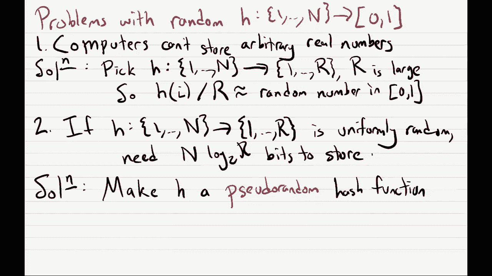

# 课程 P23：采样与流算法 🎯

在本节课中，我们将学习两种重要的算法范式：**采样算法**和**流算法**。我们将了解如何通过少量样本来估计大规模数据的整体性质，以及如何在内存极其有限的情况下处理海量数据流。

---

## 采样算法 📊

采样算法在生活中很常见。例如，当你想了解美国人对国会的看法时，询问所有3.3亿人（算法一）能获得100%准确的答案，但效率极低。更实际的做法是随机抽取一部分人（样本）进行询问，并根据样本结果来估计整体比例。

### 采样问题定义

假设总人口中同意某项观点的真实比例为 `p`。我们随机抽取 `k` 个人作为样本，记录他们的回答 `x_1, x_2, ..., x_k`，其中 `x_i` 为 1（同意）或 0（不同意）。我们的目标是输出一个估计值 `p̂`，使其接近真实值 `p`。

**估计量公式**：
`p̂ = (1/k) * Σ_{i=1}^{k} x_i`

我们希望以高概率保证估计的准确性。具体来说，我们希望：
`概率为 1 - δ，满足 |p̂ - p| ≤ ε`
其中 `ε` 是误差容忍度，`δ` 是失败概率。

### 切诺夫界与样本量

切诺夫界是一个重要的概率定理，它告诉我们需要多大的样本量 `k` 才能达到所需的精度 `(ε, δ)`。

**切诺夫界公式**：
对于独立的0-1随机变量 `x_i`（`P(x_i=1) = p`），有：
`P(|p̂ - p| ≥ ε) ≤ 2 * e^{-2ε²k}`

为了确保错误概率不超过 `δ`，我们令不等式右边等于 `δ` 并求解 `k`：
`2 * e^{-2ε²k} ≤ δ`
`e^{-2ε²k} ≤ δ/2`
`-2ε²k ≤ ln(δ/2)`
`k ≥ (1/(2ε²)) * ln(2/δ)`

**样本量公式**：
`k = ⌈ (1/(2ε²)) * ln(2/δ) ⌉`

关键点在于，所需的样本量 `k` 仅依赖于误差参数 `ε` 和 `δ`，而与总人口规模 `N` 无关。这意味着我们可以在恒定时间内（相对于输入大小）解决问题。

---

## 流算法 🌊

上一节我们介绍了如何通过采样来高效估计总体参数。本节中，我们来看看一种处理海量数据的新模型——**流算法**。在这种模型中，数据像水流一样依次到达，我们只能访问一次，且内存非常有限。

### 流模型场景

想象你坐在一条小溪边，观察游过的鱼。鱼的数量可能非常庞大，而你只有有限的记忆能力（比如没有笔记本）。你需要统计诸如“有多少种不同的鱼”或“红鱼的比例”等信息，但无法存储所有见过的鱼。

在现实中，流算法应用于网络路由器监控等场景。路由器需要分析海量数据包，但内存有限，无法记录每个数据包的全部信息。

### 问题一：从流中均匀采样 🎣

**输入**：一个数据流 `s_1, s_2, ..., s_L`，每个 `s_i` 是 `1` 到 `n` 之间的整数。`L` 是流的长度，但算法事先不知道。
**目标**：在流结束后，输出流中一个**均匀随机**的元素（即每个元素被选中的概率均为 `1/L`）。

**算法对比**：
1.  **记录整个流**：存储所有 `L` 个元素。空间复杂度为 `O(L * log n)`，过高。
2.  **已知长度 `L` 的采样**：提前生成一个随机索引 `i ∈ [1, L]`，然后等待并输出第 `i` 个元素。空间复杂度仅为 `O(log n)`，但需要提前知道 `L`，不符合模型。
3.  **水库抽样算法**：这是我们需要的算法，它不需要提前知道 `L`，且空间复杂度仅为 `O(log n)`。

#### 水库抽样算法

算法维护一个“水库”变量 `r`，用于存储当前候选的样本元素。

**算法步骤**：
1.  初始化：看到第一个元素 `s_1` 时，令 `r = s_1`。
2.  对于第 `i` 个到达的元素 `s_i`（`i ≥ 2`）：
    *   以概率 `1/i` 将水库 `r` 更新为 `s_i`。
    *   以概率 `1 - 1/i` 保持 `r` 不变（即忽略 `s_i`）。
3.  当流结束时，输出 `r`。

**正确性证明**：
我们需要证明，对于任意位置 `j`（`1 ≤ j ≤ L`），最终输出 `s_j` 的概率恰好是 `1/L`。
*   输出 `s_j` 的唯一方式是：在第 `j` 步我们决定替换水库（概率为 `1/j`），并且在之后的所有步骤 `j+1, j+2, ..., L` 中，我们都决定不替换水库。
*   因此，输出 `s_j` 的概率为：
    `(1/j) * (1 - 1/(j+1)) * (1 - 1/(j+2)) * ... * (1 - 1/L)`
    `= (1/j) * (j/(j+1)) * ((j+1)/(j+2)) * ... * ((L-1)/L)`
    `= 1/L`

该算法可以轻松扩展为从流中抽取 `k` 个独立样本，只需维护 `k` 个独立的水库即可。

---

### 问题二：估计流中不同元素的数量 🔢

**输入**：同上，一个由 `1` 到 `n` 之间整数组成的数据流。
**目标**：估计流中**不同元素**的数量 `k`。例如，流 `[1, 2, 1, 3, 2]` 的不同元素数量是3。

#### 理想化算法（Flajolet-Martin 草图思想）

这个算法思路巧妙，但有一个理想化的版本存在缺陷，我们将在下节课修复它。

**算法思路**：
1.  选择一个随机哈希函数 `h`，它将每个 `1` 到 `n` 之间的整数映射到 `[0, 1)` 区间上的一个均匀随机实数。
2.  当流中元素 `s_i` 到达时，计算其哈希值 `h(s_i)`。
3.  在整个过程中，只记录所有看到的哈希值中的**最小值**，记为 `α`。
4.  流结束后，输出 `1/α` 作为不同元素数量 `k` 的估计。

**直觉解释**：
假设流中实际有 `k` 个不同元素。哈希函数 `h` 为这 `k` 个元素生成了 `k` 个独立的、均匀分布在 `[0,1)` 的随机数。我们期望这 `k` 个数将区间 `[0,1)` 大致均匀地分成 `k+1` 段。因此，最小的那个数（即 `α`）的期望值大约在 `1/(k+1)` 附近。取倒数后，`1/α` 就大约在 `k+1` 附近，从而可以估计 `k`。

**数学事实**：
可以证明，`α` 的期望值 `E[α]` 确实等于 `1/(k+1)`。

#### 当前算法的问题

这个理想化算法存在两个主要问题，使其无法在实际计算机上直接实现：
1.  **存储实数**：计算机无法无限精确地存储 `[0,1)` 区间上的实数。
2.  **存储哈希函数**：一个完全随机的哈希函数 `h` 需要为 `1` 到 `n` 的每一个可能输入指定一个随机值，这需要 `O(n)` 的空间来存储，对于大的 `n` 来说代价太高。

**解决方案思路**：
1.  对于问题一，我们可以将哈希函数的输出离散化，例如映射到一个很大的整数范围 `{1, 2, ..., R}`，然后用 `h(i)/R` 来近似 `[0,1)` 的随机数。
2.  对于问题二，关键是不使用完全随机的哈希函数，而是使用**伪随机哈希函数**。这种函数可以用很少的空间（例如，一个种子）来描述，并且行为“看起来”足够随机，能满足我们的算法需求。我们将在下节课详细探讨如何实现这一点。

---

## 总结 📝

本节课我们一起学习了：
1.  **采样算法**：通过切诺夫界，我们了解到只需一个与总体规模无关的恒定样本量，就能以高概率准确估计总体比例。
2.  **流算法**：我们进入了数据流模型，在这个内存受限、数据只能单次访问的场景下解决问题。
3.  **水库抽样**：这是一个优雅的算法，允许我们在不知道流长度的情况下，从中均匀随机采样。
4.  **不同元素计数**：我们探讨了使用哈希函数最小值来估计流中不同元素数量的核心思想，并指出了理想化版本在实际实现中面临的挑战（存储问题），这为下节课学习完整的、可实现的算法（如 HyperLogLog 的思想基础）做好了铺垫。

这些算法展示了如何在资源受限的情况下，通过巧妙的概率方法和数据结构，对大规模数据集进行有效的分析和计算。