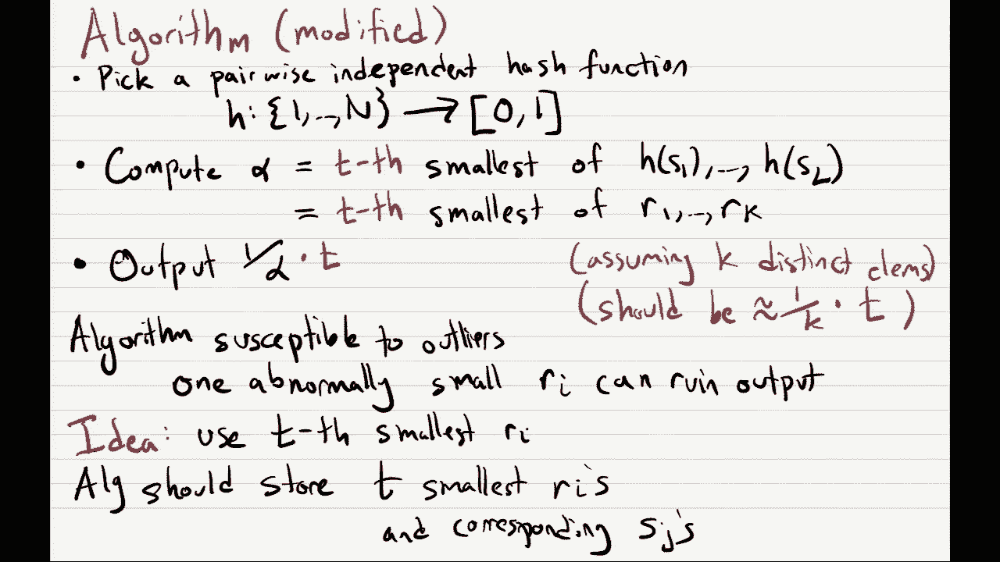
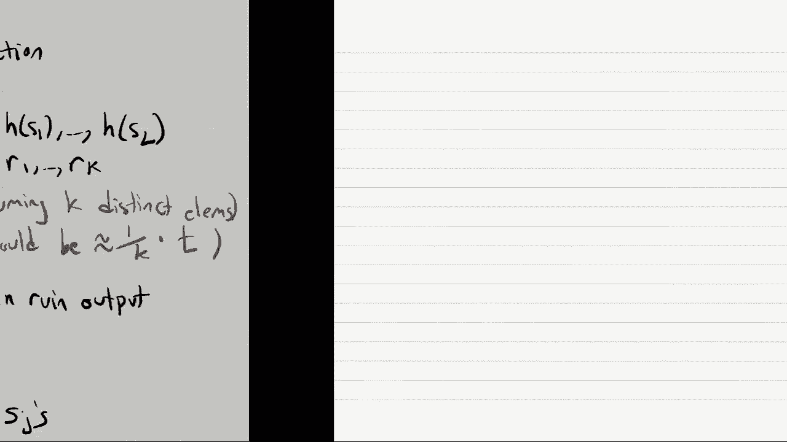
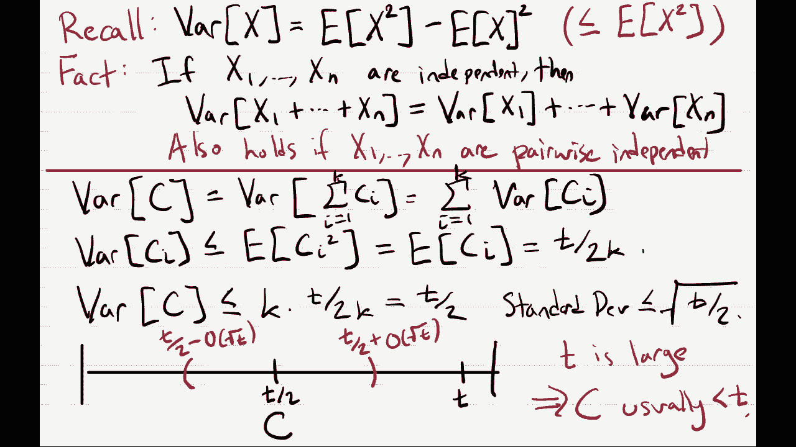

# 课程 P24：流式算法与草图技术 (第二部分) 🚀

在本节课中，我们将继续学习流式算法，特别是针对“不同元素计数”问题的解决方案。我们将深入探讨如何利用成对独立的哈希函数来设计一个高效且节省内存的算法，并分析其性能。

---

## 概述

流式算法用于处理无法一次性加载到内存中的海量数据集。算法只能顺序地、逐项地访问数据，并且必须使用极少的内存来估算数据集的某些属性。本节课，我们将聚焦于“不同元素计数”问题，即估算数据流中不同元素的数量。

---

## 回顾：基于哈希的启发式算法

上一节我们介绍了基于随机哈希函数的启发式算法。其核心思想是：选择一个将元素映射到 [0, 1] 区间的随机哈希函数 `h`，并记录流中所有元素哈希值的最小值 `α`。直觉上，如果流中有 `k` 个不同元素，那么 `α` 大约为 `1/(k+1)`，因此输出 `1/α` 可以近似 `k`。

然而，这个简单方法存在两个技术问题：
1.  计算机无法存储真正的任意实数。
2.  存储一个完全随机的哈希函数需要 `O(n log r)` 位空间，这对于流式算法来说过大。

---

## 解决方案：伪随机哈希函数与哈希族

为了解决存储问题，我们引入“伪随机”哈希函数的概念。具体来说，我们不再使用完全随机的函数，而是从一个精心设计的、大小 `M` 较小的“哈希族” `H` 中随机选择一个函数。这样，存储哈希函数只需要 `log M` 位。

### 成对独立性

我们的算法需要哈希函数具备特定的随机性质量，称为“成对独立性”。

**定义**：一个哈希族 `H`（包含 `M` 个从 `{1,...,n}` 映射到 `{1,...,r}` 的函数）是成对独立的，如果对于任意两个不同的输入 `x, y` 和任意两个输出 `i, j`，以下等式成立：
`Pr_{h <- H}[ h(x)=i ∧ h(y)=j ] = 1 / r^2`
这意味着，任何一对输入的哈希值看起来就像两个独立且均匀随机的输出。

**重要性质**：成对独立意味着单个输入 `x` 的哈希值 `h(x)` 本身也是均匀随机的，即 `Pr_{h <- H}[ h(x)=i ] = 1 / r`。

---

## 构造成对独立的哈希族

我们可以基于模运算构造一个高效的成对独立哈希族。

**构造方法**：
选择一个质数 `p`。对于整数模 `p` 域 `Z_p` 中的每一对 `(a, b)`，定义一个哈希函数：
`h_{a,b}(x) = (a * x + b) mod p`
哈希族 `H` 就是所有这样的 `h_{a,b}` 的集合。

**分析**：
*   该族包含 `M = p^2` 个函数。
*   存储一个函数只需要存储 `(a, b)`，即 `2 log p` 位。
*   可以证明该哈希族是成对独立的（证明略，可作为练习）。
*   **注意**：此构造是成对独立的，但不是三向独立的。

---

## 算法的改进：处理异常值

原始的“取最小哈希值”算法容易受到异常值（即一个特别小的哈希值）的影响，导致估计值严重偏高。

**改进策略**：
我们不再记录最小的哈希值，而是记录第 `t` 小的哈希值 `α_t`。直觉上，如果最小的哈希值大约为 `1/k`，那么第 `t` 小的哈希值大约为 `t/k`。因此，算法的输出应修正为 `t / α_t`。

**算法步骤**：
1.  从成对独立哈希族 `H` 中随机选择一个哈希函数 `h`。
2.  维护一个列表，记录流中元素哈希值中最小的 `t` 个值。
3.  处理完流后，取列表中第 `t` 小的值作为 `α_t`。
4.  输出估计值 `t / α_t`。

---

## 算法性能分析

我们分析算法输出值超过真实不同元素数 `k` 两倍的概率。

**定义**：
令 `C` 为哈希值小于等于 `t/(2k)` 的个数。坏事件（输出 ≥ 2k）发生当且仅当 `C ≥ t`。

**计算期望**：
每个哈希值 `r_i` 小于等于 `t/(2k)` 的概率是 `t/(2k)`。由于有 `k` 个不同的哈希值，且它们是成对独立的，根据期望的线性性质：
`E[C] = k * (t/(2k)) = t/2`

**计算方差**：
由于 `C` 是 `k` 个成对独立指示器变量之和，其方差等于各变量方差之和。每个指示器变量的方差至多是其期望值 `t/(2k)`。因此：
`Var(C) ≤ k * (t/(2k)) = t/2`
标准差 `σ(C) ≤ sqrt(t/2)`。

**结论**：
`C` 的期望值是 `t/2`，标准差约为 `sqrt(t)`。当 `t` 足够大时（例如，取一个较大的常数），`C` 的值极大概率会远小于 `t`。这意味着坏事件（输出过大）发生的概率非常小。通过切比雪夫不等式可以形式化地证明，算法能以高概率给出一个接近真实值 `k` 的估计。

**空间复杂度**：算法需要存储 `t` 个哈希值以及哈希函数的索引。通过选择合适的常数 `t`，总空间消耗是常数级别的，与流大小 `n` 无关。

---

## 总结

本节课我们一起学习了如何为“不同元素计数”问题设计一个实用的流式算法。我们首先引入了成对独立哈希族的概念，以解决完全随机哈希函数存储开销大的问题。接着，我们通过记录第 `t` 小的哈希值而非最小值，使算法对异常值具有鲁棒性。最后，我们分析了算法的性能，证明了通过选择合适的参数 `t`，算法能以高概率在常数空间内给出准确的估计。这展示了流式算法在有限资源下处理大数据问题的强大能力。