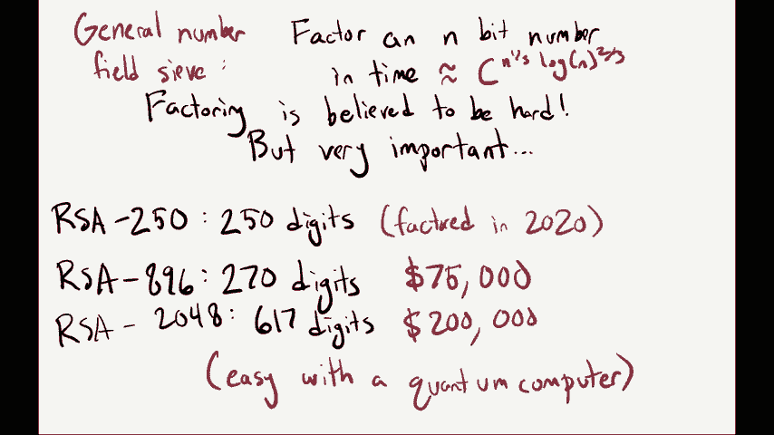
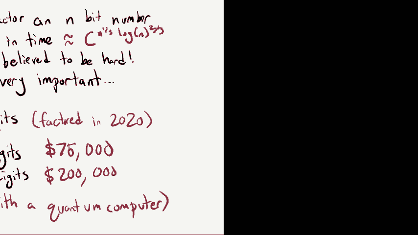
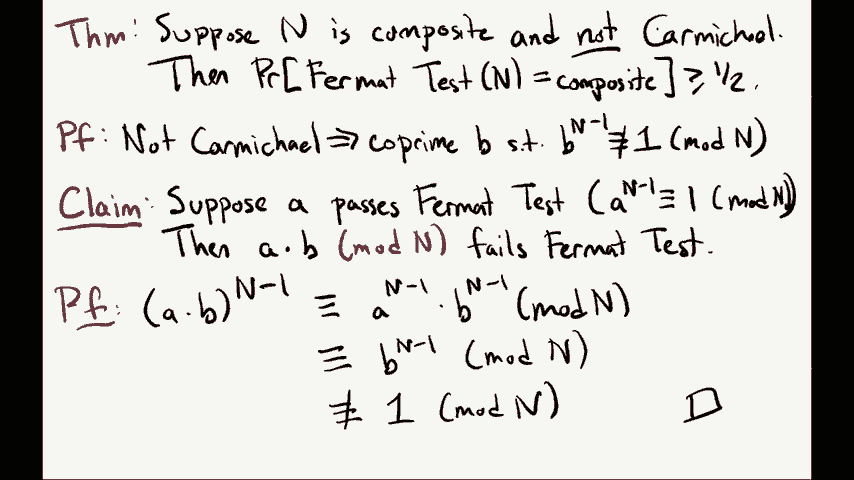
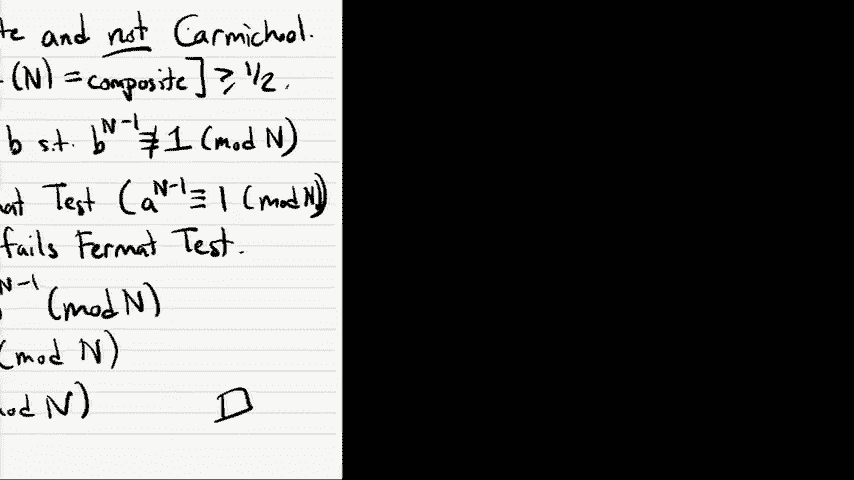
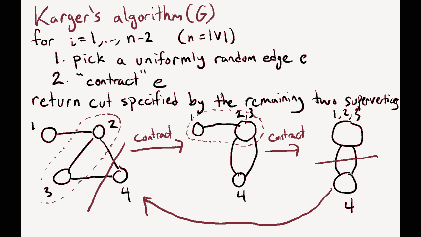
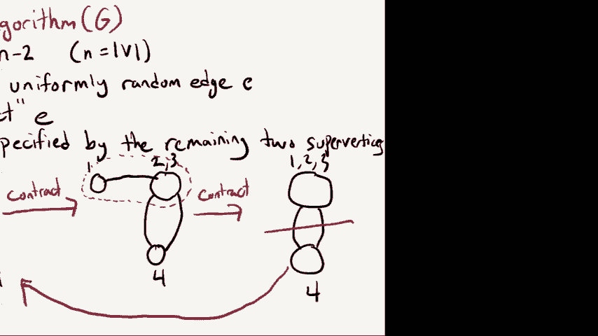
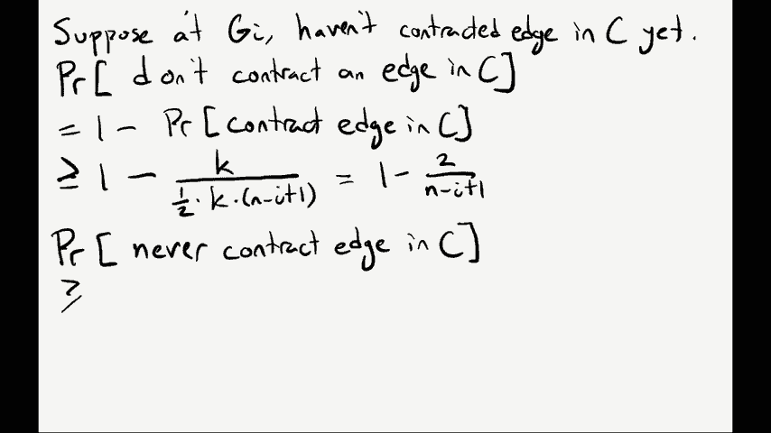

# P25：Lec25 Randomized Algorithm - 东风渐起UCAS - BV1o64y177K8

欢迎来到这节课的最后一周，最后一周的讲座，这节课我们还有两节课，会有几天和周四，今天我们要讲的是随机算法，然后周四，嗯，我希望你星期四出席，这是一个近在咫尺的话题，和亲爱的我的心，这是我的工作。

哪些是量子算法的主题，所以这就是使用，就像量子力学定律设计更快的算法，这有点像一个令人兴奋的概念，但事实证明这是可能的，这就是我们下节课将要讨论的，但今天的随机算法也非常酷，我想是的，希望你喜欢。

嗯首先，你知道的，让我们做些管理工作，让我把我的演讲放低一点，好啦，所以我们有两件事要做，周五晚上午夜，其中一个是期中考试，两次降级，所以你的期中考试，到那时两次降级，然后我们还有家庭作业十三。

上次批改的作业，星期五午夜，还将布置14个家庭作业，我认为那个完全是可选的，只是在那里帮你准备决赛，我们也来参加这个RRR周，我实话实说，我不知道它代表什么，但我希望你能，但我想是下周。

我们会有不同的时间表，像办公时间和期末考试之类的，这些会被贴在edstone上，所以事不宜迟，让我进入今天演讲的主题，也就是，啊，我的铅笔怎么了，我们走吧，随机算法，好啦，什么是随机算法，嗯。

这有点在名字里，它只是一种使用随机比特来解决问题的算法，也可能只是随机数，所以嗯，当我们对随机算法建模时，至少在这堂课上，我们可以想象他们可以使用一种叫做随机的方法，可以指定范围A到B。

这将以一个真正随机的整数作为回应，在这个范围内，好啦，你知道的，很多，又名几乎所有的编程语言都给你调用随机数的选项，它们通常有一个叫做随机n到随机整数的东西，在实践中。

当你设计一个算法并在它调用随机数时实际部署它时，这个数字通常是伪随机的，所以对于应用程序来说，它可能看起来很随机，但在这门课上，当我们对随机算法进行数学建模时，我们总是假设它们的随机性来源是真的。

很准确，它是一个真正的随机数，所以这些算法将使用随机性来帮助他们解决问题，这些算法中的许多会发生的是，当他们选择他们的随机数，这些随机数将帮助他们解决问题，但有时当他们选择随机数时。

他们会得到一个随机的数字，这对他们来说真的很糟糕，实际上，我们稍后会看到一些这方面的例子，在这种情况下，我们将允许算法经常失败，因为也许你知道，当它对这个随机数进行采样时，99%的时间。

它得到了一个很好的，但百分之一的时间它得到了一个糟糕的，这将是我们将看到的随机化算法所固有的，所以让我设置一个阈值，我们可以作为经验法则，也许这些算法被允许失败，让我们说，小于或等于5%，嗯。

我们已经在流媒体世界看到了一些随机算法的例子，在这些算法中，如果你还记得的话，就像失败的可能性一样，但在这节课中，我们将研究不在流模型中的算法，但是在我们通常设计算法的完全正常的模型中。

那么你为什么要设计一个随机算法，目的是什么，嗯，嗯，它们有时会优雅得多，那么最佳确定性算法，我们会在这堂课中看到两个例子算法，在我看来，随机算法真的很美，嗯，但是，我们最好的确定性算法是。

有点像一个奇怪的科学怪人算法，但也许比这更令人惊讶的是，或者同样令人惊讶的是，它们有时似乎可以快得多，所以我们会看到一些问题的例子，今天至少有一个问题，我们知道如何用随机算法有效地解决它。

并得到最佳确定性算法，据我们所知，它需要指数级的时间，哎呦，是呀，战斗，哦耶，百分之五有什么特别之处，没什么特别的，所以有了所有这些算法，你就可以把它设置为，你想要多少百分比。

然后你可以设计算法成功或只失败，就凭那一点点，所以百分之五，就像一个很小的数字，I，嗯酷，所以嗯，在真正解决问题之前，我来布置一下，做一点设置，并提醒你一个我们以前见过的问题，也就是整数因式分解问题。

这不是一个我们知道如何用随机化来解决的问题，所以这就像我说的，这将是背景，但这是一个问题，你被给予，就像，假设一个500位数的数字，叫它n，你的目标是找到素因式分解，n等于p1，P二圆点圆点，好啦。

这是个问题，我们在NP完全性讲座和NP讲座中看到了这一点，这在NP中是一个问题，我总是可以告诉你一个质数因式分解，你可以检查它，但我们不知道任何有效的算法，所以让我回想一下。

素数因式分解的最新技术是什么，或者你尝试的最基本的算法是什么，你要尝试的最基本的事情就是尝试每一个小于n的数字，看它能不能除n，如果有的话，如果n有素因子，那么实际上不是一到n，但也许两到N，嗯。

那么你最终会在这次搜索中找到一个，然后我们也看到了，实际上你不必一直到n，你知道的，如果你有一个非平凡的质因数，你总是有一个等于根n或更小的，所以你可以停止搜索，所以你可能会问，这个算法的运行时是多少。

我是说，这是一个好的算法吗，只是嗯，让我们假设我们的n是500位数字，所以你可以假设如果你是一个500位数的数字，你大概是十之八九，那么当你做得很好的时候，你要检查多少个数字，嗯，那么根n将是。

你知道的，大约是10的500平方根，等于10的250，你也许会说，10到250有多大，那是一个很大的数字，一小部分，一个很自然的比较是宇宙中原子的数量，然后嗯，人们喜欢，出于某种原因估计这些事情。

宇宙中原子的数量，事实证明，就像我们认为的那样，就像在十点，所以实际上，如果你运行这个简单的素因式分解算法，你得检查一下，检查比宇宙中原子数更多的数字，几乎不可能，这是完全无法解决的，嗯，更普遍的是。

如果n有n位数字，小n位数，然后呢，你需要做的是用这个算法在10到n/2的时间内运行，你知道我们以前见过这种情况，这是非常低效的，好啦，所以那是嗯，这个算法，但这就像一个非常简单的算法，嗯。

整数因式分解的最新算法是什么，嗯，这是另一种被称为通用数域sib的算法，这个算法允许你把一个n位的数字，一些常数到三分之一的末尾，n到三分之二的对数，所以基本上就像嗯或者像c到三分之一的末尾。

这比C到N要好，我是说，这就是最后一张幻灯片中的简单算法得到的结果，但它仍然是一个非常糟糕的算法，好啦，效率还是很低，结果呢，你知道的，经过几十年的努力，我们真的相信保理是很难的，嗯但是。

这仍然是一个非常重要的问题，由于它在RSA加密系统中的使用，就像一个加密系统，当您与Internet上的其他实体通信时，您使用了很多，你可以看到这种硬度就像在实践中一样。

因为RSA公司实际上刚刚在互联网上发布了带有现金奖励的数字，如果你考虑到他们，所以这些数字有像rsa这样的名字，二百五十和二百五十，这里，意味着这个数字只是一个由250位数字组成的整数。

这就像很多很多年前一样被扑灭了，最后考虑到，在二○二○，所以就像，你知道的，研究人员，他们聚在一起，他们花了所有的时间试图为这些RSA数字设计因式分解算法，只是想看看他们能不能做到。

如果他们能设计得越来越好，好啦，所以有RSA 250，有rsa，八百九十六，八等于几？九十六井，这意味着它有二百七十位数字，这些数字中有一半是以它们的数字命名的，其中一半是以二进制中的位数命名的。

所以如果你有八百九十六位二进制数字，这意味着你有270位正常数字，然后这个呢，嗯，仍未解决，所以外面的人，就像RSA的人知道这个数字的主要因素是什么，考虑到这个数字会有七万五千美元的奖金。

所以如果你能做到这一点，你赢了七万五千元，或者至少你曾经，我想他们过了一段时间就停止了挑战，所以我想它不再，付钱，但就像十年前你可以用它大赚一笔，另一个例子，我们有RSA 248，它有617位数字。

所以二千四十八比特来描述它，这一次他们提供了20万美元的现金奖励，好啦，所以你知道，如果你提交了一个因式分解算法，你会赚很多钱的，这样做有很大的金钱动机，但就我们所知，2。这个问题很难回答。

原来这个问题用量子计算机很容易，所以如果你能建造一台量子计算机，你可以考虑所有这些数字当所有这些钱，下节课我们会学到很多。

好啦，但是嗯，这堂课我们要关注的是相关的问题。

不是素因式分解，但是一个主要的测试，素性检验问题，哪一个是更简单的问题，当你得到一个n位数字n，目标只是确定，如果是素数或复合数，如果它是合成的，我是说你不在乎素因式分解是什么，你只想知道这个答案。

素数或复数，这也是一个重要的算法，我可以晚点再说，如果你好奇，但让我们看看如何解决这个问题，嗯，它看起来很像素因式分解问题，所以最自然的做法可能是，你的第一个想法是把n和因子。

如果你能很好地考虑到这一点，那你就知道它是合成的，或者如果你能找到素数因式分解，你可以分辨出它是素数还是复合数，但不幸的是，你知道我们最好的素因式分解算法是一个通用的数域筛。

我们刚刚看到它在时间c中运行到1-3的末尾，登录到三分之二，所以这不是一个有效的算法，但是我们今天要看到的，在今天的讲座中，你可以利用随机性的力量有效地解决这个问题，那会很好的，这个想法，也是。

我们将在这节课中探讨，然后嗯，既然保理似乎不起作用，我们得想点别的办法，这将使我们能够区分素数和合数，所以我想，如果你试图设计这个算法，其基本思想就是想象，就像我对质数的了解。

我所知道的质数的一个有趣的性质是什么，也许我可以用来区分它和复合数字，啊，一个问题或，啊，呃，当然可以，我来问这个问题，质数有什么有趣的地方，它们不可分解，那很好，是呀，是呀，这将给我们一个想法，我猜。

但是是的，我去问问大家，是呀，关于质数，你最喜欢的事实是什么，除了不是事实，我们已经有了，好啦，所以你的是一个小定理，你知道的，如果我是质数，如果我看一个数字，把它提高到质数减去一，我拿回一个。

这里有人有一个，啊，他们甚至都不是，是啊，是啊，那是一个，是啊，是啊，不可被二整除，就像我们经常用这些算法做的第一件事，啊，是啊，是啊，素数密度，是啊，是啊，随着你的体型越来越大，它们就越来越少了。

另一个伟大的答案，也许其他人有最喜欢的，呃，等一下等一下，那就是至少有两个质数，我是说关于质数的一个经典事实，是啊，是啊，我的最爱之一，好吧好吧，事实证明，这里使用的正确事实确实是马的小定理。

费马小定理说如果n是素数，那么a到n减去1等于1 mod n，这是为了所有人，一进二n减一，你知道的，如果我插入一个等于零的，然后我就会在左手边得到零，这绝对不等同于一个，但是费马小定理说。

对于每一个其他数，在1到n减去1之间，当你把它代入这个方程时，你确实得到了一个，所以这给出了一个合理的想法，你可以如何测试，如果一个数是素数，你知道的，只要挑一个数字，把它插入这个方程并测试。

我到底能不能拿回一个，哦问题，我想是的，是啊，是啊，是啊，是啊，嗯是的，所以这是一个合理的测试，你知道的，嗯，给了，挑一个插头，把它插进去，我到底有没有，问题是你应该选择什么。

你可以很努力地思考聪明地尝试找到最好的，A什么的，但你还记得我们在一个随机算法中，随机算法的概念就像，别想太多，随便做就行了，这是一个正式的测试，所以输入n它要做什么，它会选择一个数字a，1到n减去1。

均匀随机，然后把它插入费马小定理，再检查一下，如果它满足，就像它要检查，把a和n减去1，它实际上等于一个，如果是的话，我们将输出质数，如果不是，我们要输出，复合材料，让我们看看，那是什么。

所以这是我们的算法问题是它做得有多好，所以我们已经看到的一个事实是，如果n是素数，那么费马测试总是输出素数，所以这个随机算法实际上是，事实上，当输入是素数时总是正确的，所以我们要弄清楚的是。

当输入是com时，会发生什么，哦耶，如果我们想，我们可以插上两个，还是对不起，只看2到n减去1，我想这并不重要，虽然，就像算法仍然能正常工作一样，即使我们做了一个，但我同意。

就像检查一个总是像是浪费资源，但你也知道，如果n很大，就像得到一个的概率，是1比N，会很小，好啦，让我们用一个复合数的具体例子来考虑这个问题，看看，费马检验对这个复合数有什么作用，让我们看十二。

我们都知道是三乘以四，并查看各种，他们通过了测试，或者他们没有通过格式测试，所以让我从一个很好的A的例子开始，等于2，然后嗯，问题是2到11，相当于一个mod十二，有人知道吗，很好耶，不会奇怪的。

为什么好，两点到十一点，你知道那是偶数，然后如果我把它mod 12，把一个数字改成12是什么意思，意思是你一直从这个数字中减去12，直到你把它降到0到11之间，所以如果我，你知道一个偶数，我一直在减去。

嗯12，这也是偶数，我只会得到偶数，所以二到十一确实不等于一mod十二，所以算法实际上，当它在这个上运行时，A将正确地输出复合，好啦，下面是另一个例子，A等于三，所以你可能会问，三的十一等于一。

一种可能更难看到，但结果基本上是一样的，我们可以看到三到十一不等于一，为什么那口井，三对十一，这是一个，是三的倍数，如果我们把它改成12，你还记得吗，这意味着我们减去了很多12，但十二也是三的倍数。

所以三到十一，但1不是3的倍数，所以事实上n是3和3的倍数，三是三的倍数告诉我们这个东西不会是一，一个一个，所以对于这些数字，其实很容易看到，我们通过费马测试了吗？但是这个数字呢，A等于五。

我们想知道是5到11，相当于一个小伙子，十二，这个更难分辨，因为呃五个，你知道它是五的倍数，但是12不是5的倍数，所以即使5到11是5的倍数，当我减去12，当我修改十二个，谁知道我会得到什么。

所以这是你无法发现的地方，检查一下，很容易判断它是否等价于一个，现在我可以向你保证，我喜欢把这个插入Wolfram Alpha，你得到的实际上是5英镑一个mod 12英镑，所以它不等于一个。

但这只是你看着它真的看不出来的东西，你得去计算器，那么五、二、三的区别是什么呢，嗯，区别是五与n是余素数，这意味着它不与n共享任何素因子，但是嗯，三是共质数，或者对不起不是共主。

这意味着它确实与n共享一个质因数3，而2也不是共质因数，因为它与n共享一个2的质因数，所以当我们的数字是余质数或抱歉，与n不相等，很容易看出他们不会通过费马测试，但是当一个数与n为余数时，不清楚。

是通过还是失败，所以说，嗯，你可能希望，也许当我有一个复合数字，可能我大部分的优等生，当他们不是共质数时，然后我知道算法将输出复合，但这根本不是真的，其实呢，所以让我给你们举个例子。

让我们看看等于p的平方的数n，大素数，因为它是p的平方，它是合成的，所以它不是质数，然后嗯，那么哪些数是n的余数呢，嗯，只有p的倍数，所以如果我们看看1到n减去1之间的所有a，唯一的倍数。

带n的质数是p，两次p，三倍p，4乘以p以此类推，所以这意味着只有a的1/p分数，与n不相等，所以对于a的p分式，当它们不与n，你知道费马测试将输出复合，但是对于剩下的与n同质的a。

你不知道佛蒙特测试的结果，或者至少事先不清楚，所以这个测试只是好的，A除以n减去1等于1 log n，为了很多很多的椰菜，所以你不能只让这个测试起作用，它不可能只在数字上得到正确的答案，不是共质数。

它还必须在数字应对时得到正确的答案，对此有疑问吗，嗯，我想重点是，我是说，费马定理是，费马小定理是正确的，我的意思是，当你有一个质数时，它总是成立的，但我们希望看到的是，它被侵犯了很多，当n不是素数时。

嗯等等，这有道理吗，就像我们的测试就像，如果我们在这里插入一个，我们得到一个不等于1的东西，我们就知道我们的数不可能是质数，这回答了你的问题还是，啊，是啊，是啊，我是说，会有这样的情况，你插入一个数字。

嗯，在某些情况下，a是co-prime，但它满足了我们这种平等，所以实际上有一些案例，我们将在下一张幻灯片上看到这一点，有些情况下，就像你有一个复合数字，但它会有一定的可能性通过，费马试验，其他问题。

啊，是啊，是啊，我是说，测试会给出，所以你说像，如果n是复合的，但是我们做了一个co prime n的测试，我们给它，它满足了它，在这种情况下，我们将在它应该是复合的时候输出素数，所以这将会发生。

我们想证明的是你还记得，一种随机算法，它允许失败的可能性，所以我们想证明的是，它错误地输出质数的概率，当数字实际上是复合的时候是小的，有道理，啊，你是说这个，你想那样吗，是啊，是啊，好呀，谢谢，对不起。

测试只是好的，如果a到n减去一，不等于一个mod n，因为有很多co素数，这意味着费马测试将正确地捕捉到算法是，或者，很抱歉这个数字不是素数，更多问题，当你随机选择的a不是共质数时，测试会正确的，是啊。

是啊，重点是，你要选择的大多数数字可能都是co-prime，所以我们必须以某种方式确保测试对这些也是正确的，又是那样，整个，我猜，嗯，你可以一直喜欢，你知道的，在你的电脑上计算并检查它，就像。

在电脑上查询并不难，但我想我们作为算法设计者，我们只是不知道，呃，我们不知道，目前，一个很好的理由，为什么这应该是正确的大多数共同的艾滋病，例如，也许事实证明，实际上这对a是不成立的。

这意味着对于你选择的大多数数字，他们将通过费马测试，即使在他们应该失败的时候，如果你选一个这样的a到n，减一等于一mod n，然后你的算法将输出素数，即使数字是合成的，所以你的算法会出错，那样的话。

所以我们需要确保对于我们看到的任何数n，即使我们看的是共质数，他们往往会通过这项测试，并输出复合，是啊，是啊，所以如果我们选一个，问题是我们的算法多久能正确地输出复合，当它不是共质数时。

你总是会得到正确的答案，对呀，只有当它是共质数时，我们才还不确定，我是说，我们稍后会讲到，但现在，从十三个月开始，我们不确定，哎呦，这只是一个例子，好啦，所以我想另一个问题是，我们知道当我们选择。

你知道的，这不可能，我们大部分的优等生，我们知道在我们合作的大部分时间里，因为我们将无法通过佛蒙特州的测试，这就是我们想要的，所以我们要从A到N，减一不等于一n，然后我们就知道它是一个复合数。

但答案其实是否定的，所以有这些数字叫做卡迈克尔数，卡迈克尔数是复合数，使得a对n减去1等于1 mod n，对于所有为共质数的a，致N，所以换句话说，嗯这些嗯，所有人都将通过费马测试，对于所有共同主a。

当你选了一个非质数的a，那你的费马测验就会不及格，算法将输出复合，但是对于这些数字，对于任何一个a是co素数，你要在这些上输出质数，那不是你想要的，所以你可能会问，我是说，有没有像这样的数字。

拥有卡迈克尔的特质，就像维基百科上的一个页面，你可以去那里读出卡迈克尔的数字，我们知道的最小的卡迈克尔数是n，等于五百六十一，它的质因数是3乘以11乘以17，所以这是一个复合数。

但是当你把它插入费马测试，大多数时候，费马测试会错误地输出素数，所以他们给出的卡迈克尔数，对这个费马测试来说是一个巨大的烦恼，曾经有一段时间，人们相信只有有限数量的卡迈克尔数，如果是这样的话。

现在那就太好了，就像如果只有十个卡迈克尔数，你就是你就是，嗯，素数测试算法可以从检查开始，n等于这十个卡迈克尔数中的一个，如果不是呢，然后你只需要写一个算法，适用于不是卡迈克尔的数字，但不幸的是。

在九十年代，它实际上证明了存在无限多个卡迈克尔数，所以你真的必须设计一个算法，以某种方式，了解如何测试这些卡迈克尔数和非卡迈克尔数，但这次演讲，让我们假装这些都不存在，他们很讨厌。

所以让我们假装他们不存在，哦不，这些只是五百六十一的主要因素，是啊，是啊，所以我们关心的是没有这些的，作为这个素数，就像任何一个不是倍数的A，三个，十一七岁，会满足费马测试，好啦，嗯酷，所以说。

让我向你证明我们的算法是有效的，只要n不是卡迈克尔数，这就是这里的定理，假设n，那么费马测试得到正确答案的概率，意味着它正确的输出会导致，我要证明的是至少有一半，好啦，那不是很好。

只有一半的时间答案是正确的，但我们稍后会看到，你可以只运行几次费马测试，如果它输出合成，你知道你的数字是合成的，这将使你比我更有可能是正确的，但就目前而言，让我们证明这个定理，是啊，是啊，让我们。

让我们深入研究证据，我们有这个数n是复合的，不是卡迈克尔意味着什么，不是的，卡迈克尔只是暗示存在一个共素数b，使得b对n减去1不等于1 mod n，所以我很抱歉，这就是不做卡迈克尔的意义。

但至少有一个B，以至于这是真的，也就是共质数，这意味着存在一个单独的b会失败，正式测试，现在这个证明将表明，一个b的存在，嗯，没有通过费马测试，实际上暗示了存在许多没有通过费马测试的蜜蜂。

至少有一半的蜜蜂不会通过Phila测试，所以嗯，为了证明这一点，我将从证明一个小的子索赔开始，我的副攀登者会说，假设我们有一个数字a，它通过了模型试验，我的意思是a到n减去1等于1 mod n。

那么我声称a乘以b至少mod n，未通过费马t检验，所以任何时候你有一个号码通过它的办公室，这是不好的，这个说法告诉我们，还有另一个数字肯定会失败，一次测试，也就是，这就是我们要得到的。

至少有一半的数字必须通过，啊，很抱歉，当我说没有通过费马测试时就失败了，或者当我说通过费马测试，我是说它满足了这个，当你满足了这一点，费马测试输出你的素数，没有通过费马测试意味着你满足了这一点。

当你输出，当你满足了这一点，然后算法输出复合，因为我们的数字是合成的，我们希望我们的数字不能通过测试，当他们失败的时候是好的，他们经过的时候很糟糕，但这至少说明了每次有一个人经过，这是不好的。

还有一个失败了，哪个好，好的，好的，让我们看看这个说法的证据，好吧，让我们看看a到a乘以b，它通过还是不通过费马测试，好吧，检查一下，我们要看b乘以n减去1和mod n，这等价于a除以n减去1。

乘以b到n减去1，但是a到n减去1，因为a通过了等于1的费马测试，所以这整个过程等价于b和n减去1，不是n，但根据假设，因为b没有通过佛蒙特测试，这不等于一个地段n，因此a乘以b不能通过费马测试。

这就是我们想要的，这就完成了，好啦，现在让我完成上面定理的证明。

嗯，通过使用这个索赔，我给它画个图。

所以对于这张照片，我要画两个圆圈，在这个圈子里，第一个我们要把所有的A，通过了费马测试，我的意思是a到n减去1等于1 mod n，在这个圆圈里，我们要把所有没通过测试的优等生。

我的意思是a到n减去一不等于一个批号，N，所以你知道，在第一圈，也许我们有一个，我们有一个二，我们有一个A三，我们只有这些优等生，我们刚刚证明的说法表明，对于每一个这样的，假设我们有一个。

如果我们取1乘以b，我们在这里得到一个点，它没有通过测试a乘以b，同样地，当我们取一个2乘以b，我们得到另一个点a乘以b，它没有通过费马测试，然后我们得到a乘以b，无法通过费马测试，所以你知道。

这就意味着左边的每一个点，右边有一个点，所以我们应该有更多的分数没有通过费马测试，比被动测试，这就是我们要找的，啊，因为嗯，呃，这只是说在这里的每一点，你知道你可以，右边可能有一些点不等于这些点之一。

乘以b，哦，再说一遍，哎呦，我猜，对于所有这些，我的意思是，喜欢产品，莫登，是呀，让我把那个现代的，啊，这是一个两次，B莫，啊，完美问题，所以我们需要准确地检查，我们需要检查a乘以b是否等于aj乘以b。

莫登，因为i不等于j，就像你说的，我是说，可能是通过一些奇怪的数学特性，就像所有这些AI乘以B的映射到完全相同的数字，就像那个大圆圈，虽然看起来很大，其实很小，就像一个数字。

所以你必须确保左边的所有东西都映射到一个唯一的数字，在右边，能够说，右边的东西比左边的大，好啦，那么我们如何才能很好地证明这一点呢，我们将使用一个关于或B的事实，还记得我们对B的了解吗。

让我继续上一张幻灯片，是共质数，所以它和n是共质数，所以b是余质数，这意味着什么呢，因为我们不是，当你有一个数是n的余数时，存在一个逆，莫德姆，这个逆函数有一个性质，如果i乘以b逆，我得到一个。

所以现在让我们用这个事实来检查我们要检查的东西，也就是说，这两个数字总是不同的，让我们看看a i乘以b和aj乘以b mod n，检查它们是否不同，我要做的是，我要把两个数字相乘，通过这个保证存在的逆。

因为b是余素数，我要得到的是左边的一个人工智能，右边是阿杰，而不是N，但这两者绝对不是等价的，因为嗯，我和我，他们只是不同的数字，但如果这两个数不是等价模型，那么这两个数也不一定是等价模型，你知道的。

如果我取两个相同的数，我把它们都乘以b逆，我必须再次得到相同的号码，因为我乘以逆数后得到的数字不同，这两个也得不一样，所以这确实告诉我们，事实上，对于这里的每一个点，我们都被映射到右边的一个唯一的点。

所以如果我们看看通过的集合的大小，这最多是失败的数字集的大小，所以我们确实发现了一个失败的数字，哪个好，A问这些有的概率是失败的，是啊，是啊，啊，因为我们只证明了不是卡迈克尔的数字。

所以要成为一个不是卡迈克尔的数字，这意味着存在一个余素b使得它持有一个carmichael，数目，是每个Co素数b有b到n减去1等于1，所以不是卡迈克尔，只是意味着必须有一个B不能满足这一点，啊。

嗯是的，你可以有mod，呃，你知道什么是，有什么好的例子，嗯，是啊，是啊，我是说mod n，如果你在做mod n，你可以有数字，是啊，是啊，就像逆行，当我把它们相乘时，然后拿mod n，我拿回一个。

但这不会是，就像另一个数字，就像，例如，这里有一个我认为正确的例子，二是它自己的逆模组三，所以如果我拿两个，我把它乘以2，我有四个，其中一个模组3是有意义的，啊，这里的浣熊我们用它来得到相反的。

我想我们不是，我们没有得到素数因式分解或类似的东西，我们只是利用b是余素数的事实，我是说，我们利用b是余素数的事实，为了显示失败点的数量大于，啊，它不一定能告诉我们什么，就像我们随机选择一个。

我们希望a能告诉我们这个数是素数还是复合数，我们知道当a不是余素数时，我们总是会检测到当数字是复合的，当n是复合的，我们选一个非质数的数，然后我们就会得到正确的答案。

但是我们必须弄清楚当我们选择一个质数a时会发生什么，对不起，那就是共质数，只是因为大多数人，所以大多数时候当你选择你的A，这将是共同的，所以我们得弄清楚在这种情况下会发生什么，好啦。

所以这证明了我们的定理，当我们是合成的而不是卡迈克尔，那么费马测试将以至少一半的概率输出复合，但你知道我没答应给你一半，我向你保证百分之九十五，所以你有可能在一段时间内测试，等于复合，嗯。

那将是平等的或抱歉的，如果n是复合的，至少是一半，好吧好吧，如果你想做得比一半好，你应该做的是重复这个算法，K倍，如果你这么做了，嗯，如果你的号码是合成的，如果你重复k次，嗯，你应该等到你看到一个合成。

如果你在你的k次尝试中看到一个合成物，然后你知道你的数字必须是合成的，因为如果它是质数，你只会看到擎天柱，所以如果你重复这个k次，你唯一犯错的时候是每次你重复它的时候，上面写着质数，即使它是合成的。

但我们知道每一种情况都只会说质数，几率至少有一半，所以说质数的概率，因为所有的k次方最多就是k的1/2，换句话说，如果我们重复k次，我们会检测到它的合成物，几率至少是1-1/2。

所以我们要做的就是把k设为，假设我们做了一百次，不是很多，我是说，你的计算机可以很快地进行这些计算，如果我们把k设为100，那么你就会非常有信心你的答案是正确的，在这个算法中，所以你知道。

如果给你一个质数，你总能给出正确的答案，如果你得到一个复合数，你要回答，你会输出正确的答案，只有百分之一的概率，太小了，只是永远不会发生，是啊，是啊，啊，我想卡迈克尔数不会是你选择的a。

但这个N所以问题就像，你可以问，我是说，在野外多久会有人让你检查一次，会是卡迈克尔，我们甚至不会考虑这个算法，因为这个算法只适用于非卡迈克尔数，我们将在下一张幻灯片中看到，嗯，我就写在这里吧。

您可以添加另一个检查，所以有一些方法可以修改这个算法，所以如果n是因果报应，它甚至也有效，但这太烦人了，不能说，所以这节课我就不讲了，但在课本上，所以如果你想读一读，你可以在那里看，但如果你这么做。

你做费马测试，你让它甚至可以在卡迈克尔数上工作，这给出了一个被称为米勒乌鸦的素性测试，从1976年开始，所以这是一个非常，非常古老的算法，它一直被在实践中使用到今天，当人们想测试数字是否是素数时。

这是他们使用的算法，你也知道，这是一个随机算法，从那以后，人们开发了越来越多的形式测试算法，但他们都是随机的，以至于你可能会怀疑，你知道的，这是一个我们只能用随机化来解决的问题吗，至少在嗯之前是这样。

干得好，所以让我告诉你作者阿格拉墙，他们做了一个质数测试，在2002年，这个优先级测试实际上是确定性的，给出了一个确定性的，它很酷，这就像数学论文的编年史，就像最负盛名的数学杂志，这个也是，嗯是的。

非常非常棒的工作好奇心，有人知道当时凯尔和撒克逊人有什么特别之处吗，哦耶，啊，就像呃，如果你得到的数字是n位，然后他们的算法在十二次结束时工作，这不是一个快速多项式，但这是有效的，是啊，是啊，一个问题。

是啊，是啊，有人知道当时凯尔和撒克逊人有什么特别之处吗，我会为你破坏它，这两个是本科生，所以这就像他们的本科论文，是啊，是啊，所以这可能是有史以来最酷的本科论文。

它只是向你展示了你甚至可以做一些非常酷的算法研究，即使是本科生，好啦，我来总结一下质数测试的情况，历史上有一种高效的随机算法，随机算法，先来后到基本上是三十年后，经过大量的努力。

人们发现了一种高效的确定性算法，还有其他问题，我们只知道有效的随机算法，我们不知道有效的确定性算法，其中一个问题，我就用语言说出来，它是什么，我不写了，这叫做多项式身份测试，就像这些中最著名的。

而这个问题，让我们看看身份，这个问题就像一个多项式作为输入，有人把你描述成一个多项式，比如x一加x两次，你知道的，三加四到十，他们想知道的是每个输入的多项式零，所以是不是就像，不管我插什么。

我总是得零分还是不得零分，而对于这个问题，我们知道一个解决办法，它只是选择一些随机输入，并将它们插入多项式，如果它是非零多项式，你会很快找到一个输出也不为零的输入，嗯，但我们不知道一个确定性的算法。

尽管，你知道的，几十年的研究，所以这意味着有两个可能的世界，我们生活在这个世界上，一切看起来都像是素数测试，每次你有一个有效的随机算法，为什么我现在一直用D有效的随机写，嗯有一个相应的确定性。

就像在素数测试用例中，每当你有一个有效的随机算法，是否存在另一种高效但确定性的算法，另一种可能是一些问题，这看起来更像是多项式身份测试世界，我们有一个很好的随机算法，但是我们没有任何好的确定性算法。

所以在复杂性理论语言中，人们把这个问题称为p与bpp问题，又是P，你知道的，这些是我们有效率的问题，bpp是一类问题，我们有有效的随机化，这个问题是p等于bpp，意味着每个算法。

每个具有有效随机解的问题也都有一个有效确定性解，或者p不等于bp，那么是否有一些问题需要随机算法，嗯，这不是结束，你的意思是像，I，啊，但那是那是NP，是啊，是啊，那就去吧，哎呦，呃，是啊，是啊。

我是说，非确定性意味着你不是确定性的，我猜，但就像有很多方法不是不确定的，在NP中，好的，查看NP的一种方法是，就像一类随机的东西，你可以用随机算法来解决，它有可能成功，让我看看。

我该怎么说呢也许大于零，很难进入，但是bpp代表有界，嗯，哎呀，我忘了另一个p有界多项式，错误，但是错误不是从P开始的，啊，但是关于概率，谢谢你，多项式，是呀，所以概率意味着随机。

嗯和有界误差只是意味着像，基本上，它成功了，就像错误是有界的一样，所以你可以说误差很小，像百分之五，好啦，所以你知道，每个人都应该为自己着想，就像你知道的，p是否等于bpp，你有什么感觉。

随机化能帮助你不幸地喜欢，为了节省时间，我跑得有点慢，所以我不会进行民意调查，但我只想告诉你，人们相信，即p应该等于bpp，所以随机性实际上永远不会真正帮助你，嗯，有些事情，一些复杂性，理论证据，嗯。

这实际上表明，P等于bpp，但这是一个主要的公开问题，它是关于p对np的水平，所以是的，这是一个很酷的问题，嗯但是嗯是的，让我在结束这节课的时候说，即使p等于bpp，这并不意味着我们不应该研究随机算法。

因为再一次，会有一些问题，你的解决方案要漂亮得多，如果你有一个随机算法，我想告诉你们一个问题，在最后的17分钟里，它的随机算法就像一个真正美丽的解决方案，这是一个最小切割的问题。

一个我们以前基本上已经看到的问题，所以你的输入将是一个未加权的，G等于V，所以让我给你们举个例子，我们已经看到了一个切口，我是说，我们以前见过这种情况，什么是割伤，就像，嗯，你把顶点分成两组。

切口的大小是从一组到另一组的边数，所以这是一个一号的切口，因为有一条边穿过切口，这是三号的剪裁，因为有三条边穿过这个切口，嗯让我说在这里，嗯，我如何解决最小切割问题，嗯。

我们已经看到了如何解决最小切割问题，所以在最大流量讲座中，我们看到如果你有一个最大流斜线，我们看到了如何给出一个求解最大流的算法，也解决了最小切割问题，所以它在图中找到一个最小切口，使S在切口的一侧。

T在切口的另一边，在这个版本的问题中，我们没有一个s和t，我们不在乎我们把两个顶点分开，我们只是想找到一些切口，我们不在乎哪个顶点在哪边，但是你可以把最小割问题简化为最小ST割问题，嗯。

因为你知道对于图中的任何顶点，你可以假设它在伤口的左边，然后在切口的右侧必须有一些其他的顶点，所以只要把第一个顶点设置为你的s，然后考虑T的所有顶点，嗯，你可以考虑一下。

有一种方法可以使用最大流和切割算法来解决这个问题，但我要告诉你们一个解决这个问题的不同算法，我觉得很美，嗯，称为卡特算法，所以这是以大卫·卡特的名字命名的，他是麻省理工的教授，他以前是做理论研究的。

但现在他在另一个叫HCI的领域工作，也就是人机交互，如果你知道他的算法是随机算法，它的工作方式如下，当i等于1到n减去2时，它将循环，其中n是图中的顶点数，它要做的是，它只是在图中选择一个均匀随机的边。

然后它会在边缘做一个叫做收缩的操作，好啦，收缩边缘意味着什么，E井，我一会儿就告诉你，但在它这样做之后，它会一个接一个地收缩边缘，最后，它会得到一些东西，会给它一个削减，所以它只是要把切口还给。

这个切口将由剩余的，好啦，这是什么意思，好啦，让我举一个这个算法的例子，我希望能让你明白，收缩是什么意思？我所说的超级顶点是什么意思，让我们从上一张幻灯片的图表开始，顶点一，两个，三个，四。

所以它将从在图中随机选择一条边开始，所以让我们想象一下它选择了这里的这条边缘，二到三的边缘，它要做的是收缩这条边缘，收缩的意思是它将把顶点组合在一起，2和3进入一个新的超级顶点称为2和3，二逗号三。

然后它将保持图中的所有边，所以嗯，一个还在那里，老四还在这里，我们在1到2之间有优势，所以现在我们在1和2之间有一个优势，第三，我们也有2到4之间的优势，然后我们在3到4之间也有优势。

所以我们要在可以尝试之后保持两边的边缘，现在我们选择另一条随机的边，可能这个边，我们要把它感染，再来一次，我们将得到两个超级顶点，一个，两个，三个，还有四个，和一个之间的边缘，二加三没了。

但是我们还是把这两条边，三和四，现在我们完成了for循环的末尾，我们只有两个超级顶点，其中一个是一二三，另一个是四个，所以这就像图表中的一个超自然的切口，只要把所有的顶点放在切口的一边。

这些顶点在一二中，三个和切口另一边的所有顶点，这件事真正好的地方是，如果我们现在回到我们最初的图表，这与原始图中的这个切口相对应，你可以看到，右边伤口的大小，手侧正好等于左手边切口的大小。

所以我们从来没有在切口上收缩过任何边缘，结果呢，我们就可以数出这里的边数，它和这里的边数一样，哎呦，就像在，是呀，任何时候你签约，哎呦，问得好，你的意思是，如果我能追踪到，我想你没有把那个边缘包括在内。

我不太清楚事态的发展，但是是的，我想你没有把那个边缘包括在内，是啊，是啊，让我们耶，一个问题，它是，是啊，是啊，所以这不会总是返回最小切口，但我们将看到的是，它将以很好的概率返回最小切口，嗯。

你只需要运行这个循环n-2次，每次你收缩一个边缘，当你完成n-2次后，你只剩下两个顶点了，那是它终止的时候。

好啦，所以让我给你一点直觉。

就像潜入分析，让我给你一个特定图表的直觉，让我们想象一下我们有一个有很多顶点的图，就像一个完整的图表，所以我们在这个图中有所有的边，然后我们在这里有另一个顶点，因为寂寞，只有一条边，好啦。

你可以检查这个图中的最小切口，就在这里，它只是把一个顶点和所有这些顶点分开，所以问题是卡特的算法会找到这个最小切口吗，而且会，嗯，如果它从来没有收缩这条边缘，但是嗯，好好想想，每次卡特的算法。

卡特算法的每次迭代，只是选择一个均匀随机的边缘来收缩，左边有更多的边缘，然后是一条红色的边，所以嗯，卡特的算法通常会选择其中的一个，我们会选择左边的边缘收缩，而不是一般的红色边缘，我是说。

如果你想一下它的最小切口，因为这是最低限度的削减，它在切口上会有很少的边缘，所以你希望有更多的边缘在最小切口之外，所以如果你只是随机选择一个边缘在每一步收缩，卡特算法倾向于在切口之外执行边缘。

这就是直觉，好啦，嗯，嗯，现在让我证明我们将要看到的关于卡特算法的主要结果，以下是，设C为图中的一个切口，所以它把顶点分成两组，S和S补语，那么我声称的是卡特的算法实际上会输出这个精确的最小切割。

概率至少为n的1，选两个，其中n是顶点数，好啦，什么是n选两个好，是n乘以n减去1除以2，所以是2/n乘以n减去1，所以大概是n的平方之一的概率，你得到了这个最低限度的削减，那不是很好。

但这只是意味着你必须采用卡特的算法，重复n次平方，以恒定的概率看到这个切口，好啦，所以让我向你证明这个说法，你也知道，这将是一个归纳证明，所以每走一步，我们要记录下第一步的曲线图，把它叫做g i。

所以这是在第i次迭代的开始，所以这是一个在你收缩第i条边之前的图，所以特别是g 1，它是在你收缩任何边缘之前的最开始，所以这只是你的起始图，好啦，让我告诉你第一个事实，事实一，这是我们已经看到的。

如果你看看最小的削减，盖伊，原始图中的最小切口是k，第一个事实是最小切割，在我们做了一些收缩之后，总是至少K，所以这是你可以自己检查的东西，任何切入，G i将对应于我原始图中的一个切口。

切割的边缘数量相同，因为我的原始图有一个大小为k的最小切口，是啊，是啊，所以GI中的任何切口都对应于G中的切口，因为g的最小切分是k，GI中的最小切口至少是大小，第二个事实，我将计算g i中的顶点数。

每走一步我就收缩两个顶点，所以我把两个顶点合二为一，G i是i减去一个收缩后的步骤，每一次收缩都使顶点数减少一个，所以顶点的个数是n-，收缩次数i减1，等于n减i加1，另外两个事实，然后我们就完成证明。

事实三，我声称在GI中每个顶点的度，至少是k，为什么那口井，如果度小于k，然后在图中得到一个小于k的切口，你只要把那个顶点和图的其余部分分开，切割的边数就是顶点的度数。

但我们已经看到这个图中的最小切口是k或更大，所以每个顶点的度数必须是k或更大，好吧事实上，四个最后的事实，我们现在计算g i中的顶点数，g i中的边数是多少，嗯，嗯，边数，你知道的。

计算边数的一种方法是去所有的顶点，把他们的学位加起来，g中所有顶点的和，I，分贝的，但是你记得，当你这么做的时候，你不能重复计算，所以你得把这个乘以一半，现在我们知道每个度都至少是k。

所以这至少是所有顶点和的一半，和k的g i，这等于g i中顶点数的半k倍，然后在最后一张幻灯片上，我们计算出g i中的顶点数是n减去i，加一个，这就是现在的第四个事实，让我们完成证明，所以我们要这么做。

你知道的，有点像在一个几乎是归纳的，所以我们要想象我们有我们的切C，我们想知道在我们的切割中，我们永远不会收缩边缘的概率是多少，所以我们假设我们在GI，我们在C中还没有收缩边，如果我们有他们。

我们已经完蛋了，你不能输出C，所以现在让我们计算概率，考虑到我们在C中没有收缩优势，我们不签约的可能性有多大？我们的下一个优势，我们可以也不是NC，这只是1减去我们在c中收缩一条边的概率，和好。

这等于什么？是一减，好的，好的，所以我们在图中选择一条随机的边并收缩它，所以我们选择一条边，看到并收缩它的概率是k，也就是C中的边数除以图中的边数总数，我们在上一张幻灯片中计算过，我们至少要计算0。

5乘以k乘以n减去i加1，所以如果你解决了，我们实际展示的是，我们不收缩的概率，一条边至少是1-k的一半，K乘n减i加1，等于1-2除以n-i加1，好啦，所以现在我们要做的就是计算。

我们永远不会收缩边缘的概率是多少，顺便说一下，如何解读好这一点，就像我越大，当我真的很小的时候，上面说你不太可能，合同、优势和代理，然后当我变得越来越大，你更有可能与一家代理公司签约，那是。

上面是这么写的，好啦，所以嗯好吧，我们和代理商签好合同的可能性有多大？我们很可能不会在第一轮就与代理商签订合同，我们在第二轮没有取得优势的可能性，以第一轮不感染一个为条件，以此类推。

我们在第一轮没有签约的可能性。

