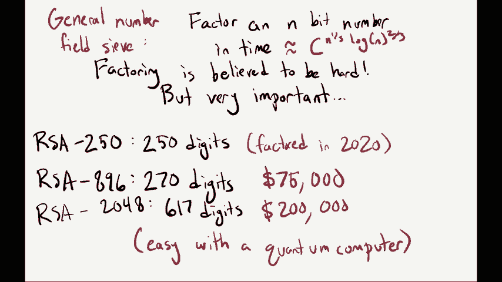
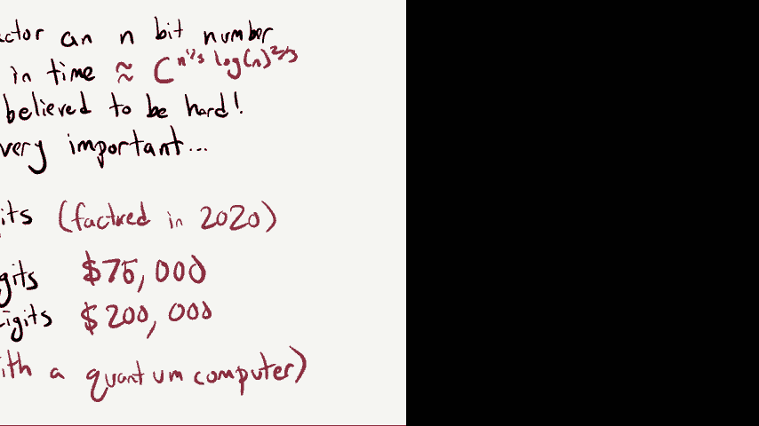
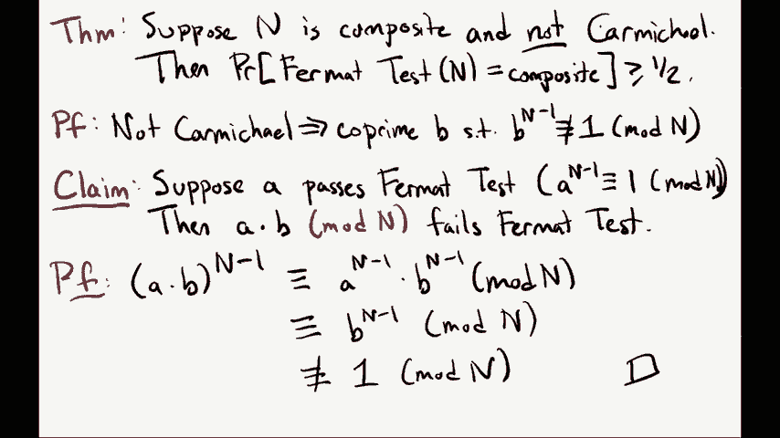
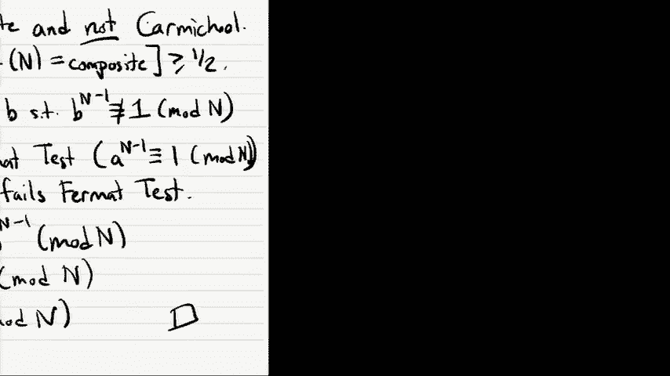
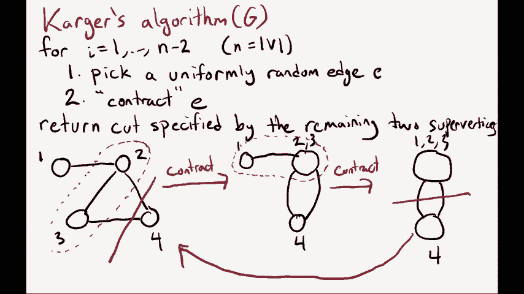
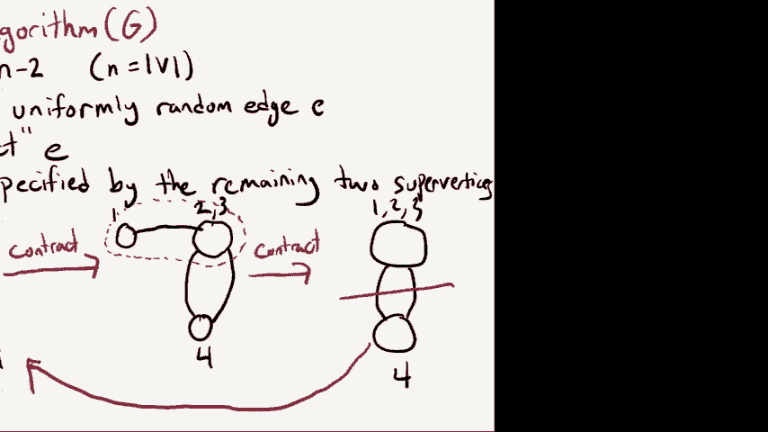
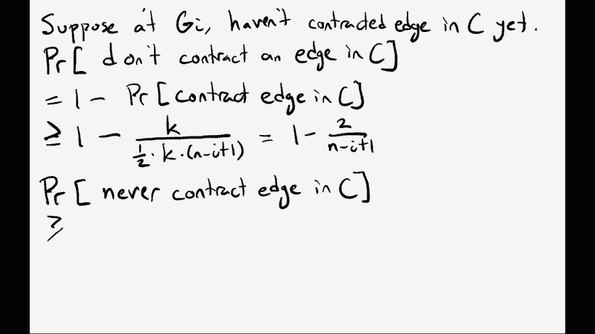

# 课程 P25：随机算法 🎲


在本节课中，我们将学习随机算法的基本概念，并通过两个经典例子——素数测试和最小割问题——来理解随机性如何帮助设计出优雅且高效的算法。

---

## 概述

随机算法是一种在计算过程中使用随机比特（随机数）来辅助决策的算法。在本课程中，我们假设算法可以调用一个真正的随机源 `random(A, B)`，它返回一个在范围 `[A, B]` 内均匀随机的整数。这类算法有时会失败，但我们可以将失败概率控制在很小的范围内（例如 ≤5%）。随机算法有时比已知的最佳确定性算法更简洁、更快速，甚至能解决一些确定性算法难以高效解决的问题。

---

## 1. 背景：整数分解问题

在深入随机算法之前，我们先回顾一个相关但更困难的问题：整数分解。





**问题描述**：给定一个 n 位数 N，目标是找到其素数分解形式 `N = p1 * p2 * ... * pk`。

这是一个 NP 问题，但已知的确定性算法效率很低。最基础的试除法需要检查最多 `√N` 个数。对于一个 500 位的数字（约 `10^500`），`√N` 约为 `10^250`，这比宇宙中的原子总数（约 `10^80`）还要大得多，因此完全不现实。

目前最好的通用数域筛法，其运行时间约为 `exp(c * n^(1/3) * (log n)^(2/3))`，其中 n 是位数。这仍然是指数级复杂度，因此我们认为分解大整数是困难的。这也是 RSA 加密系统安全性的基础。

---

## 2. 素数测试问题

现在，我们来看一个更简单但密切相关的问题：素数测试。

**问题描述**：给定一个 n 位数 N，目标是确定它是素数还是合数。注意，我们不需要找出其因子，只需判断其性质。

### 2.1 费马小定理与初步想法

一个关于素数的著名性质是费马小定理：
> 如果 `p` 是素数，那么对于任意整数 `a`（`1 ≤ a ≤ p-1`），都有 `a^(p-1) ≡ 1 (mod p)`。

这启发我们设计一个测试：随机选择一个 `a`，计算 `a^(N-1) mod N`，如果结果不等于 1，则 `N` 一定是合数。

### 2.2 费马测试算法

以下是基于此的随机算法（费马测试）：
1.  输入：整数 `N`。
2.  均匀随机地选择一个整数 `a`，其中 `1 < a < N-1`。
3.  计算 `x = a^(N-1) mod N`。
4.  如果 `x ≠ 1`，则输出“合数”。
5.  如果 `x = 1`，则输出“素数”。

**算法分析**：
*   如果 `N` 确实是素数，根据费马小定理，对于任何 `a`，都有 `x = 1`，因此算法总是输出“素数”，正确率为 100%。
*   如果 `N` 是合数，算法可能错误地输出“素数”。这发生在 `a^(N-1) ≡ 1 (mod N)` 时。

### 2.3 卡迈克尔数与算法改进

存在一类特殊的合数，称为**卡迈克尔数**。对于这类数，几乎所有与 `N` 互质的 `a` 都满足 `a^(N-1) ≡ 1 (mod N)`，导致费马测试几乎总是错误地判断其为素数。





**定理**：如果 `N` 是合数且**不是**卡迈克尔数，那么费马测试输出“合数”的概率至少为 `1/2`。

**证明思路**：
1.  因为 `N` 不是卡迈克尔数，所以存在至少一个与 `N` 互质的数 `b`，使得 `b^(N-1) ≠ 1 mod N`。
2.  可以证明，所有满足 `a^(N-1) ≡ 1 mod N` 的 `a`（“坏”的 `a`）与 `b` 的乘积 `(a*b) mod N`，必然不满足该等式（是“好”的 `a`）。
3.  由于 `b` 与 `N` 互质，乘法 `a -> a*b mod N` 是一个一一映射。因此，“好”的 `a` 的数量至少和“坏”的 `a` 一样多。所以，随机选到“好”的 `a`（从而正确输出“合数”）的概率至少是 `1/2`。

**提升正确率**：我们可以通过重复运行费马测试来降低错误概率。重复 `k` 次，只有当所有 `k` 次测试都（错误地）输出“素数”时，算法才会最终出错。因此，错误概率降至 `≤ (1/2)^k`。例如，取 `k=100`，错误概率将低于 `2^{-100}`，这是一个极小的数字。

**最终方案**：在实际中，人们使用更复杂的 **Miller-Rabin 素性测试**（1976年），它通过额外的检查，使得算法对卡迈克尔数也有效。这是一个至今仍在广泛使用的高效随机算法。

### 2.4 历史注记与 P vs BPP

一个有趣的问题是：随机性对解决问题是否是必需的？
*   2002年，Agrawal, Kayal, Saxena 提出了第一个确定性的多项式时间素性测试算法（AKS算法），证明了对于素数测试问题，随机性并非必需。
*   然而，对于其他问题，如**多项式恒等式测试**，我们只有高效的随机算法，尚未找到高效的确定性算法。
*   在计算复杂性理论中，这引出了 **P vs BPP** 问题。P 类包含所有有高效确定性算法的问题。BPP 类包含所有有高效随机算法（错误概率有界）的问题。大多数研究者相信 **P = BPP**，即随机性并不能从根本上提供更强的计算能力，但这仍是一个未解决的重大开放问题。

---

## 3. 最小割问题

上一节我们介绍了利用随机性进行素数测试。本节中，我们来看看随机性如何为图论中的一个经典问题——最小割——提供一个极其简洁优美的解决方案。

**问题描述**：给定一个无向无权图 `G=(V, E)`，找到一个割（将顶点集 `V` 划分为两个非空子集），使得连接这两个子集的边的数量最少。

### 3.1 Karger 算法

Karger 算法是一个简单的随机算法，其核心操作是**边收缩**：
*   **收缩边 (u, v)**：将两个顶点 `u` 和 `v` 合并为一个新的“超顶点”，所有原本与 `u` 或 `v` 相连的边都改为与这个新顶点相连。注意，删除新顶点内部（即原 `u` 和 `v` 之间）的边。

**算法描述**：
```
Karger‘s Algorithm:
当图中的顶点数大于 2 时：
    1. 在当前的图中，均匀随机地选择一条边 e。
    2. 收缩边 e。
最终，图中只剩下两个超顶点。连接这两个超顶点的边对应原图中的一个割，输出这个割。
```

### 3.2 算法直观与正确性分析

算法的关键在于：**最小割中的边数量很少**。在随机选择边进行收缩时，选中最小割中边的概率相对较低。只要算法从未收缩过最小割中的任何一条边，那么最终得到的割就是原图的最小割。





**定理**：设图 `G` 有 `n` 个顶点，最小割的大小为 `k`。Karger 算法输出某个特定最小割 `C` 的概率至少为 `1 / C(n, 2) ≈ 2/n^2`。

**证明要点（归纳法）**：
设算法在第 `i` 步开始时的图为 `G_i`。
1.  `G_i` 的最小割大小仍至少为 `k`（因为收缩操作不会减小割的大小）。
2.  `G_i` 的顶点数为 `n - i + 1`。
3.  由于最小割大小为 `k`，`G_i` 中每个顶点的度数至少为 `k`（否则将该顶点单独分开就得到一个更小的割）。因此，`G_i` 的边数 `|E_i| ≥ (k * (n-i+1)) / 2`。
4.  在 `G_i` 中，给定尚未收缩过割 `C` 中的边，那么下一步**不**收缩 `C` 中边的概率为：
    `P_i ≥ 1 - (k / |E_i|) ≥ 1 - (2 / (n-i+1))`。
5.  算法始终不收缩 `C` 中任何边的概率，就是所有步骤 `P_i` 的乘积：
    `P(success) ≥ Π_{i=1}^{n-2} [1 - 2/(n-i+1)] = 2/(n*(n-1)) = 1/C(n,2)`。

虽然单次运行成功找到特定最小割的概率 `≈ 2/n^2` 不高，但我们可以**重复运行算法**。运行 `O(n^2 log n)` 次，并以所有运行结果中**最小的割**作为输出，那么以极高概率（如 `1 - 1/n`）我们能得到全局最小割。总时间复杂度约为 `O(n^4 log n)`，通过更高效的实现（Karger-Stein算法）可优化至 `O(n^2 log^2 n)`。

---

## 总结



本节课中我们一起学习了随机算法的核心思想。我们首先以**素数测试**为例，看到了如何利用费马小定理和随机抽样，设计出比朴素分解法快得多的算法，并理解了通过重复实验可以指数级降低错误率。接着，我们探讨了**最小割问题**，Karger 算法展示了随机性如何通过简单的边收缩操作，优雅地解决一个原本需要复杂网络流技术的问题。这两个例子充分体现了随机算法在简洁性、美观性和有时在效率上的独特优势。最后，我们提到了 **P vs BPP** 这一理论计算机科学的核心开放问题，它关乎随机性计算能力的根本极限。