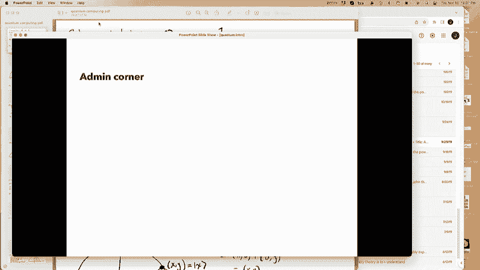
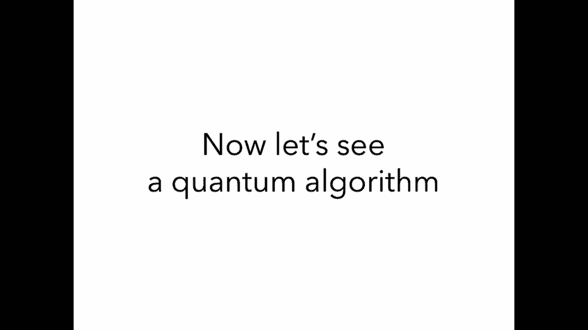
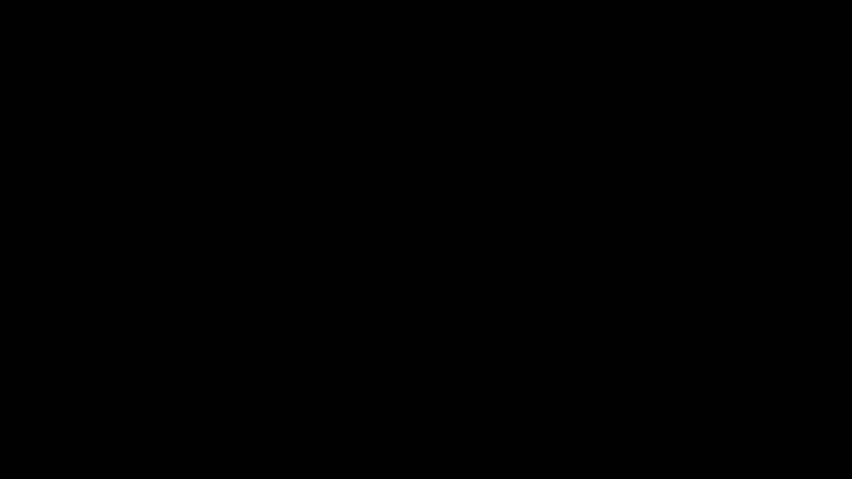
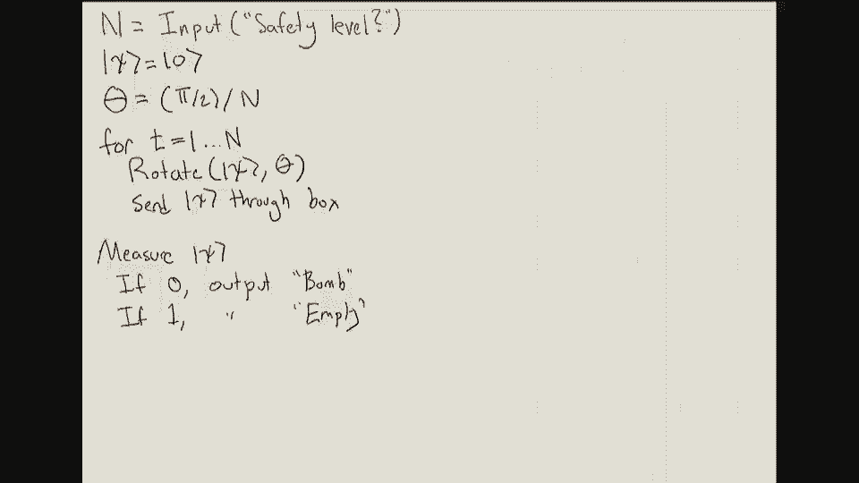

# P26：Lec26 Special Topic (Quantum Algorithm) - 东风渐起UCAS - BV1o64y177K8

嗯，现在是12点40分，欢迎来到CS一17的最后一课，让我从管理的事情开始，一路得到，很快的，所以，嗯，期中考试两次重新评分是由于明天结束，晚上11点59分，作业13明天交，这是本学期最后一次评分作业。

还有一个作业，家庭作业十四，我想明天可能会出去，它没有分级，但它只是装满了对学习期末考试有用的东西，所以我建议你尽量完成它，有一个RRR周，我认为这是，呃，下周，嗯，那一周会有不同的办公时间。

就要宣布了，我想明天在埃德斯通，他们还将在那一周举行最后的审查会议，也将公布，可能明天在艾德·斯特恩，最后一件事是，今天的讲座不在范围内，所以只要坐下来享受，实际上，还有一件我没想到的管理事情。

整晚都在给我的iPad充电，它没有启动，所以这节课讲到一半，我要从幻灯片换成iPad，我想问的是，可能是在那个时候，如果观众席上有英雄，谁会介意自愿使用他们的ipad呢？好啦，但当我们到了那里。

我去问问，但我们今天讨论的是什么，嗯，这是量子计算，我喜欢的地区，我从事量子计算，我觉得这很神奇，我会在这节课的前半部分告诉你们，我只是在回顾量子计算的故事，是什么让它如此神奇，所以为了给故事做背景。

让我们回到1981年，1981年发生了什么，嗯，呃，夺宝奇兵刚上映，年度最佳大片，超人2是今年的另一部大电影，IBM刚刚发布了这款新的个人电脑，五十一五个人电脑，它有16千字节的内存。

它卖了一千五百美元，以今天的货币计算，大约是5000美元，很显然，这也是IBM与微软接洽的同一年，并要求他们为他们的电脑编写一个操作系统，就在那时，微软开发了ms dos。

有一种新的游戏正在烧毁所有的拱廊，叫做大金刚，你扮演了一个叫马里奥的水管工，你从金刚手中救出桃公主，在这中间，所以这就是现实世界中发生的事情，但是在物理学家的世界里发生了什么。

他们有一个问题那是什么问题，他们无法模拟量子系统，所以这是他们真正想做的事情，他们真的很努力，但是没有，不管他们怎么努力，他们就是做不到，好啦，那么模拟量子系统意味着什么呢，假设你有n个电子。

我把它们画在这里，一个电子，它有一种叫做自旋的性质，电子的自旋可以是向上的，也可以是向下的，所以也许在系统里，你知道的，可能这些电子都在自旋，可能这些电子都在自旋，你可以数数，如果我有n个电子。

每个电子有两种可能的自旋之一，这意味着我有2到n种可能的自旋构型，好啦，那么量子模拟的问题是什么呢，好吧，你得到了，可能这n个电子的初始构型，所以有人指定哪些是向上的，有人指定哪些坏了。

然后你想做的是进化系统，根据自然世界的规则，所以根据物理定律，嗯，在给定的时间t，你想知道在那之后系统会是什么样子，这是一个很大的问题，因为这就像一个现实世界的问题，你可以从一个物理系统开始。

你只想知道它是如何在时间上进化的，但不幸的是，对这些物理学家来说，他们最好的算法实际上需要2到n的时间，所以它是指数级的，效率很低，原因很简单，算法必须跟踪所有可能的自旋结构。

因为有2到N种可能的自旋构型，算法将在时间上运行到最后，所以那是非常令人不安的，所以在1981年，一群物理学家，数学家，计算机科学家们聚集在一个会议上讨论这个问题，看他们怎么解决。

这次会议以一个非常著名的，理查德费曼的全体演讲，在那里他讨论了这个问题的可能解决方案，所以这篇演讲真的很值得一读，这是一次开创性的演讲，它为未来的许多事情奠定了基础，演讲中最著名的台词之一。

理查德·费曼，他说，大自然不是古典的，该死的，如果你想模拟自然，你最好把它做成量子力学，天哪，这是个很好的问题，因为这看起来并不容易，他刚才说的是，自然是量子力学的，所以要模拟它。

你必须能够模拟量子力学，据我们所知，这真的真的很难，但他接着提出了解决这个问题的办法，他问，你能用一种新电脑做吗？一台量子计算机，然后他说，现在事实证明，据我所知，你可以模拟这个。

这种用量子计算机元素组成量子系统的计算机，这不是图灵机，但是另一种机器，好啦，那么他用通俗易懂的英语是什么意思呢？他对量子计算机的设想是这样的，他想做的是用电子造一台电脑，所以这是你的电脑。

你的计算机实际上是由非常小的电子组成的，你试图模拟的东西，他想让这台电脑可编程，这意味着你可以找到每个电子并告诉它，它的旋转应该是上下，然后你应该让这台计算机进行计算。

他想做的是观察电子就像观察自然本身一样，对电子进行计算，那个计算井是什么，大自然对这些电子所做的自然的事情，换句话说，如果你想，如果你有一台这样的电脑，你基本上可以让电子根据自然规律模拟自己。

这实际上会进行你想要的精确计算，这就是他对量子计算机的想法，造一台计算机，一台由你想要模拟的小量子粒子组成的计算机，这在当时是一个开创性的想法，在它被引入后，人们开始想知道量子计算机有多强大。

他们能做什么，也许我们在这个时候做不到，嗯所以，例如，从它们的构造来看，它们可以很容易地模拟量子物理，但他们还能做什么，所以嗯，在量子计算机的早期，有五种算法一个接一个地出来。

向我们展示了量子计算机可以做的越来越强的事情，在这节课中，我要告诉你前两个和后两个，我们将跳过西蒙的算法，西蒙算法也是一个非常重要的算法，但不幸的是我们没有时间，在这次讲座中。

让我告诉你这些算法中的第一个，第一个暗示了量子计算的力量，它被称为deutsch josa算法，它解决了德国的霍萨问题，那么什么是德国乔萨问题，你在这个问题上的投入，这将是一个函数，如果它接受n位。

它输出一位，这个函数有它承诺在三种情况中的一种，对于每个输入x，它总是输出零，或者对于每个输入x，它总是输出一个，或者对于一半的x，它输出为零，一半的x，它输出一个。

但是你不知道哪个x的输出是零还是提前一个，现在在这个问题中，您可以访问这个函数，所以你可以插上电源，你想拿什么就拿什么，将其插入函数并获得答案，你的目标是确定我们在这三个案子中的哪一个，它是恒定的吗。

还是平衡了，所以他们首先注意到的是任何确定性算法，求解该问题的经典确定性算法，必须检查至少一半的输入，实际上超过一半的输入，在这种情况下是n的2-1加上f的1个输入，而这样做的原因是。

假设你是一个确定性算法，那你打算怎么办，你只是想，你知道的，固定一些，Um输入，然后在所有输入上检查f，假设你检查所有输入的f，你就会看到很多零，嗯，如果你在不到一半的输入上看f，你只看到零，你不知道。

我是不是在一个全是零的情况下，或者我在第三种情况下，它的一半是零，我只是很不走运，看着那一半，所以当你看到所有的零，告诉他们你不在第三个案子里，你必须查看所有输入的一半以上，他们展示的，虽然。

有一种量子算法可以更快地解决这个问题，所以经典算法需要指数时间，但这种量子算法实际上可以在线性时间内做到这一点，订单结束时间，好啦，所以这很酷，但有一点让人不满意，你想做的是证明量子计算机可以做一些。

经典计算机不能这样几乎做到了，但不完全是，有谁知道这让人不满意的原因吗，是啊，是啊，哎呦，完美，是呀，关键是正如我们在上一节课中所看到的，我们允许经典计算机在解决计算问题时随机掷硬币。

有一个非常简单的随机算法，你只需在随机测试中选择一小群多余的东西，在所有这些上，如果f是平衡的，所以一半是零一半是一，你很快就会发现，另一方面，如果你看不到，你知道0和1的混合，如果你看到所有的零。

然后你很有信心地知道，这只是全零函数，所以尽管这给了量子比确定性更快的速度，它没有给出量子比随机的速度，哦，是的，让我播放这个片段，呃有人吗，希望人们看过这部电影，就像复仇者联盟，结束游戏。

几年前出版的，可能是小计，我觉得，你能听到这个吗，你看到什么了吗，他说，量子涨落扰乱普朗克尺度，从而触发了德意志的提议，我们能同意吗，所以是的，有趣的是，他们所说的多伊奇提议指的是大卫·多伊奇这个人。

他是量子计算的创始人之一，另一个有趣的事实是，据任何人所知，其实没有多伊奇提议这回事，所以他们只是为了电影《托尼》而编造的，下一个算法，下一个重大突破是伯恩斯坦海拉尼，嗯，伯恩斯坦奥尼问题。

它解决了伯恩斯坦·瓦里罗尼算法，不幸的是，我不能选择，我找不到伊森·伯恩斯坦的真实照片，所以我用一张伯恩斯坦熊的照片，但他是伯克利的研究生，所以他经常在这些大厅里闲逛，他们解决的问题有点相似。

所以你的输入是一个函数f，它接受一个n位并输出一个位，承诺f以以下形式出现，它所做的是在输入中需要一些位，所以这只是它得到的n个输入位的子集，它会添加那些那些位，换句话说，它只会查看比特的特定子集。

计算这些位上的奇偶校验，你的目标只是确定你想要的和中的比特，您要输出，你知道的，x 2 x 5，x n减去一，或者在总和中，所以有一个很好的确定性经典算法来解决这个问题，嗯，它在以下几点上查询f，首先。

您应该在所有零输入上计算f，然后你应该在第一个坐标中有1的输入上计算f，现在其他地方都是零，如果你仔细想想，你只是翻转了第一部分，所以这只会翻转f的输出，如果第一位在和中，如果第一位不在和中。

那么f的输出在这两个中相同，做这两个求和会得到x 1，然后你可以对x2做同样的事情，所以在位置上放一个1，在其他地方放两个0，它会告诉你x 2是否在阳光下，在你对所有n个坐标这样做之后。

这样就可以解决问题了，这只需要n加1看f，所以你只需要插入n加一个值，实际上这不仅仅是最好的经典算法，当我说古典的时候，这也是最好的，这是最好的确定性，但也是随机的，所以随机化实际上对这个问题没有帮助。

但他们展示的是，实际上有一种量子算法可以解决这个问题，通过以量子的方式只看f中的单个输入，好吧即使传统上你需要秩序和时间来进行量子盟友，你基本上可以瞬间做到，所以恒定的时间。

所以这就像是量子比经典量子的惊人速度，在当时，他们正在解决的问题并不是一个明显有用的问题，但这确实是我们掌握的第一个具体证据，量子计算机可以做一些很酷的事情，经典计算机做不到的，好啦，这家伙是谁，虽然。

Umesh，瓦萨尼井，他是加州大学伯克利分校的教授，他是作者，我们教科书的合著者，他也偶尔教华语一百七十，所以你可能会时不时地看到他在计算机科学大楼里走来走去。

但是量子计算的重大突破最终出现在1994年，利用肖尔的算法，彼得·肖尔嗯，为这个算法奠定基础，我来提醒你一下我们上节课看到了什么，如果你想解决整数分解问题，所以有人给你一个n位整数。

对此最好的经典算法是什么，我们看到的是这个问题叫做一般数域筛，这需要时间，大致，你知道的，到三分之一末尾的常数，所以这是一个低效的运行时，到目前为止，我们认为经典计算机不能解决因式分解。

他展示了一种叫做肖尔算法的量子算法，在n平方时间内量子计算机上的哪些因子是整数，好啦，所以这是一个二次算法，这个算法，它还解决了另一个叫做离散对数问题的问题，如果你听说过，为什么它会，为什么这如此神奇。

它证明了如果你有一台量子计算机，你可以用它来破解RSA密码系统，它仍然是世界上最常用的加密系统之一，现在，这立即把量子计算从一种有趣的东西，你知道的，计算机科学家的思想实验。

在现实世界中有着巨大的重要性，从那以后，这个领域就完全被炸毁了，世界上每个政府都想要一台量子计算机，现在就像是比赛看谁能先到，你可以在彼得·肖尔看到一个非常好的谈话，或彼得肖尔，几年前出版的。

在YouTube上，他只是说他从这个时候开始的回忆，他是怎么想出这个算法的，以某种方式利用量子力学的奇怪定律来因子数，所以我建议看那个，嗯决赛。

就像1996年Love Grover在算法上的重大突破一样，为这个算法奠定基础，让我提醒你们一些我们在上一节课中看到的东西，所以我们在那里看到，这个问题叫做电路集，这是一个你被作为输入的问题，布尔电路。

你想找到一个输入，使电路输出成为我们看到的，然后那个电路是一个NP完全问题，最佳经典算法的运行时间是n的2次方，所以指数运行时，格罗弗算法，所以格罗弗给出了一个解决这个问题的算法。

不只是在两个到最后的时间，但是2到n次的平方根，所以它得到了一个平方根加速，就像一个点，四，在量子计算机上一四到结束时间，这不像肖尔的算法那么酷，因为肖尔的算法得到了真正的指数加速，这只是一个二次加速。

但格罗弗算法的优点不是，这种二次加速实际上不仅仅适用于电路SAT，但是对于各种各样的经典问题，所以如果你把他的算法中的技术，嗯，你发现对许多人来说，我们在这门课上研究过的许多算法或问题，嗯。

量子计算机可以得到这样的东西，那些就像大算法，直到今天，它们仍然是量子计算中最大的算法，所以二十年后，最大的是格罗弗和短裤算法，结果呢，现在有三种类型的通用量子加速，我们看到，在做量子算法的时候。

所以第一种提速是岸式提速，它是一种看起来像肖尔算法的算法，这些算法的优点是它们往往以指数级的速度，比最好的经典算法，所以这是非常令人兴奋的，缺点是，这些问题往往只适用于某些受限制的问题，如保理。

它们来自数论，所以它们是非常专门的算法，嗯，但它们的速度是指数级的，第二种加速称为Grover型加速，这样做的好处是它们解决了很多很多问题，但缺点是它们往往只是多项式地快，比最好的经典算法。

所以就像二次加速一样，也许最后是来自物理模拟的算法，你也倾向于比最好的经典算法得到指数级的速度提升，但问题是，它们只适用于一类非常有限的问题，I，E，那些来自物理学的，好啦，所以你可能会问。

这些提速背后是什么，量子有什么秘制酱料，这使得我们能够比经典的更快地计算因式分解，嗯，为什么，为什么所有这些算法，嗯，比他们的古典同行更好，其实答案很简单，量子计算机可以做快得离谱的傅里叶变换，嗯。

所以量子计算机被允许，或者在某些情况下比经典计算机更快地进行傅里叶变换，你可能会问，傅里叶变换和这些有什么关系，它和解决电路集有什么关系，它和解决保理有什么关系，而且很难进入，所以我不打算说为什么。

但让我在第四讲提醒你们，我们看到了古典背景下的傅里叶变换，可以帮助我们加快多项式的乘法，这又是一个问题，它看起来一点也不像傅里叶变换，嗯，但不知何故，傅里叶变换的魔力也可以让你加快速度。

其他问题也是如此，就像傅里叶变换，他们上来了，它们是有用的、有趣的和意想不到的方法，现在你可以用复杂性语言理论来讨论这个问题，所以在这节课中，你们知道我们已经看到了p和np，上一节课我们看到了bpp。

你可以用随机算法解决的事情的复杂性，但如果你研究量子计算机，那么你所关心的复杂度类是bq，p，q代表量子，这只是所有问题的集合，在量子计算机上可以有效地解决，所以如果你在这个领域工作。

你会经常看到的图表，如果p是这个气泡，那么正如我们所看到的，啊，然后bq p是这样的，所以你在量子计算机上能解决的一切，对不起，你在经典计算机上能解决的一切，也可以在量子计算机上高效解题，结果。

Bq p包含p，不过，据我们所知，Bq p也比p大，它包含因子分解等问题，然后np，嗯，我们相信是这样的，它包含p，但它并不完全包含BQ P，它也不完全包含在英国石油公司内部，例如，保理在这里。

就我们所知，它是以bq p为单位的，它在NP中，但就我们所知，它不在P中，物理模拟在这里，它是用bq p表示的，不在P中，据我们所知，没有简单的方法来检查你是否正确地进行了物理模拟，所以结果。

我们不知道这是一个NP，我们不相信这是一个NPP，最后电路集是NP，但它不被认为是在P或BQ P中，所以你记得，格罗弗算法只得到二次速度，所以它仍然是一个指数时间算法，如果你从这堂课中只学到一件事。

只记得一件事，结论应该是，量子计算机不被认为能有效地解决NP完全问题，所以你经常会在大众媒体上看到这一点，如果我们有一台量子计算机，我们可以用它来解决旅行推销员的问题，据我们所知那不是真的。

我们相信这不会是真的，好啦，所以嗯，这就是理论，嗯，不如，你实际上是如何建造量子计算机的，嗯，嗯，事实证明这真的真的真的很难，现在全世界都有人在努力，但这是个很难的问题，为什么这么难，关键挑战是噪音。

所以当我说噪音，我是什么意思，嗯，就像，假设你有你的量子计算机，你有所有这些电子，你在对它们进行计算，有时候你可能，例如，有一个杂散电子来自你的量子计算机之外，撞上你的一个电子，就像改变它的价值。

如果发生这种情况，即使它发生在你的一个电子上，可以彻底改变你的量子计算，完全毁掉你的量子计算，现在我们能建造的最好的量子计算机仍然噪音很大，所以有一个解决方案叫做纠错，嗯。

在那里你可以把一台嘈杂的量子计算机，把它转换成一个无噪音的，那么你是如何做好这件事的呢，你要做的是从你的量子计算机开始，它有很多嘈杂的量子比特，所以每一个可能都会经常出错，你能做的就是把它们都捆在一起。

变成一大批，这一批实际上将能够模拟一个完美的免费，无噪声量子比特，所以如果你能使用纠错，你可以用它把嘈杂的量子比特捆绑在一起，模拟一个无噪量子比特，那么问题是你需要模拟多少噪声量子比特。

完美无噪量子比特，这是人们一直在努力改进的事情，我所能说的是我最后一次和别人谈论这件事，他们告诉我最先进的技术说你需要大约一万，也许嘈杂的量子比特来模拟一个完美的无噪声曲好吧，所以有很多嘈杂的肘。

当我第一次进入量子计算，大约是在2014年，在这一点上，真正建造量子计算机的领域的状态是，嗯，所以到目前为止，任何人所做的最大的事情之一，在2011年他们建造了一台只有两个量子比特的小型量子计算机，嗯。

他们用它来运行一个非常小版本的海岸因数分解算法，他们把它作为输入，数n等于二一，量子计算机最后能说的是2 1因子到3点，对不起三七，很有可能就像，呃，你知道的，当时是个笑话，就像这有多可悲。

我们只能这样了，但从那以后，技术状态发生了翻天覆地的变化，我想说现在是量子计算的激动人心的时刻，因为我们正在经历的实际革命，现在呢，我们拥有的是这个，基本上每个专业，乌姆科技公司拥有自己的量子计算机。

所以谷歌有一个，IBM有一个，里盖蒂有一个，英特尔有一个等等，微软有一个，我觉得有人想建一个，但他们想用一种还不知道存在的粒子来建造它，但也许有一天它会存在，然后他们还会有一台量子计算机，嗯好吧。

那么你在这些照片中看到了什么，我相信这个东西，英特尔的东西实际上就像量子计算机，所以这就像一个量子芯片，我认为这些小东西中的每一个都就像一个量子比特，而且是的，原来如此原来如此，那是你的中央处理器。

但是当我运行量子计算时，我要做的就是把我的CPU，我得把它冷却到大约零开尔文，我这么做的原因是，我想让它尽可能冷，为了防止任何噪音，所以你想让它成为最酷的，你可以做什么来防止噪音。

这也是量子计算机的一个大问题，所以你要做的就是把它们放在冰箱里，右边的三个人很抱歉，左边的三个是谷歌冰箱的样子，例如，我觉得这整件事，就像冷却一样，什么是你看不到的小芯片，现在你想起来了。

一个嘈杂的量子比特需要抱歉来纠正错误，我们可能需要一千个嘈杂的量子比特才能得到一个完美的，干净量子比特，但是你知道，例如，谷歌有五个一噪声量子比特，所以我们目前甚至不是一个量子比特的零头，那很完美。

而且没有噪音，所以尽管这是一个非常令人印象深刻的，技术成就，我们离最终目标还很远，但尽管如此，我们已经能够用这些量子计算机做有趣的事情，所以嗯，几年前，谷歌能够运行这个被称为量子霸权实验的实验。

他们奔跑的地方，他们用他们的五个一立方量子计算机，嗯，在量子计算机上执行一些任务，这在当时被认为是经典计算机不可能的，所以你知道，这个任务是什么，嗯，这是个毫无用处的任务，在现实世界中没有人会想这么做。

但它证明了量子计算机实际上可以做得比经典计算机更好，从那以后，在他们这样做之后，就像一个来回，因为在经典算法方面有了改进，所以实际上已经不清楚了，他们的算法优于所有经典算法，但我想人们通常相信如果谷歌。

然后做了一百立方量子计算机的任务，如果他们用它，这在经典计算机上确实是不可能的，好啦，这就是背景，嗯，量子计算机，在我们讨论第一个量子算法之前，也许我会停下来问几个问题，啊耶，问得好，嗯是的。

它是如何工作的，它遵循类似的原则，作为UM经典纠错，就像经典的纠错，假设我有一点，那很吵，所以你知道它应该是，假设是零，但它偶尔会翻转得到一个，这对我不好，所以我能做的一件事是，我可以拿我的部分。

我可以复制很多很多次，现在如果我把我的片段复制到一百个不同的片段上，我们现在就说，假设这些位中的每一个都是零，但他们中的一个经常被翻转，但是如果他们中的一些人，我可以看着它，看到大多数仍然是零。

然后我就可以纠正所有的错误，所以量子纠错的原理类似，你在一个量子位中获取数据，你把它编码在许多不同的量子比特上，所以即使其中一些是没有错误的，你可以道歉，有错误，你可以纠正它。

但我要说在量子世界里要复杂得多，有道理这个问题，好啦，可能我是说，让我们看看这其实是个好问题，我不完全知道，我猜的答案是你的噪音越小，你需要的就越少，我要说的是有一个。

在量子计算机中有一种叫做阈值的东西，这是你需要的噪音率，如果你有噪音率，这比那个噪音率高吗，然后对于我们的许多纠错技术，他们就是不管用，噪音率倾向于大约一个噪音，它说的是一旦我能得到低于百分之一的噪音。

然后纠错开始了，我有一台量子计算机，如果我有略高于百分之一的噪音，纠错失败，我也没有量子计算机，现在我们正徘徊在那个噪音水平附近，啊，有很多，嗯，你知不知道，就像呃，就像汉密尔顿人，你知不知道。

你知道什么是汉密尔顿吗，所以就像汉密尔顿是一个，是啊，是啊，这是对一个物理系统的描述，物理系统，你可以有一个输入状态，起始状态，然后你可以运行你的汉密尔顿或抱歉。

你可以根据汉密尔顿定律及时进化出这种状态，这是一个量子计算机完美的问题，因为它们基本上是本地建造的，能够支持这种操作，但总的来说，就像汉密尔顿模拟是很难的，哦嗯，所以我研究量子算法。

我对量子力学一无所知，从高中开始我就没上过物理课，所以是的，你只需要知道，你需要了解计算机科学，像算法，你在课堂上所看到的，然后你需要知道线性代数，所以基本上所有的都像量子力学。

可以归结为很好的线性代数问题，如果你喜欢线性代数，然后它就像一个有趣的领域工作，所以说，例如，就像CS 191，这是下学期要教的量子计算课程，我想如果你懂线性代数并且上过这门课，你应该是完美的。

所以这里有一个问题，他有时候，哎呦，是啊，是啊，就像肖尔的算法一样，你可能会说运行它，希望噪音不是问题，但事实证明噪音会是一个巨大的问题，所以即使其中一个量子比特，嗯，就像。

如果你在一台嘈杂的量子计算机上运行肖尔的算法，以压倒性的可能性，你会得到一个不正确的答案，是啊，是啊，只是我的意思是，您可以为许多算法考虑这一点，我们在班上见过的你，如果你把算法，在某个时候。

你只要翻转一点，它可能会产生灾难性的后果，这里有问题吗，啊，你想要的一件事是一万个真正好的量子比特，所以你希望它们尽可能没有噪音，你想用好的方式控制他们，有各种各样的工程问题，当你把它放大的时候。

有一些公司的总体战略是，谁在乎错误，让我们想做多少量子比特就做多少量子比特，如果你听说过，D波，这是一家外面的公司，他们喜欢做的是，我觉得他们就像，啊，我们有一万个量子比特，但他们有很多噪音。

我想就像大多数人认为的那样，这只是做了大量的量子比特，你不能很好地控制，而且超级吵，不是建造量子计算机的正确方法，这里有问题吗，是啊，是啊，啊，这是个好问题，我真的不知道答案，我是说，嗯，好像有十个。

让我不要说十个，但也许有四五个像主流那样，建造量子计算机的不同方式，所以有些人喜欢用电子来建造它们，其中一些是用光子建造的，其中一些是用里德堡原子建造的，每一个，是啊，是啊，你有一个单独的财产问题。

我如何保持电子，就像在那里坐一会儿，嗯，我上的最后一堂物理课是在高中，所以是的，不幸的是，我真的不知道，更多问题，就像那口井，肯定有一些操作只能在量子计算机上完成，嗯。

但是量子计算机上有些东西看起来很像经典计算机，所以各种各样的公司开始制造他们自己的，就像量子计算机的编程语言已经成为一个很大的领域，我觉得微软，例如，你知道他们有像C尖，但他们现在也有Q夏普。

它允许你用一种C夏普语言来与量子计算机交互，好吧如果那是，哦，再来一次，是啊，是啊，哦耶，所以如果你有50个量子比特，你实际上能做什么，这是个好问题，这就像现在这个领域的一个大的悬而未决的问题。

嗯因为嗯，你知道这将是一个很长的时间，我想在我们有一个巨大的完全可扩展的量子计算机之前，但在那段时间里，我们将拥有越来越大的小型量子计算机，并不完美，所以我们能对他们做些什么吗，答案真的取决于你问谁。

所以有很多像我一样的人对计算机科学家持怀疑态度，嗯，我觉得就像，我没有看到任何证据，我们真的可以用这些小型量子计算机做任何真正有用的事情，嗯，直到我们真正得到一个大的，这就够了。

这足以运行shor的算法了，嗯，其他人有其他想法，有各种各样的提议，有些人认为你可以用它来进行机器学习，我不确定我买，有些人认为，也许你可以用它来模拟有趣的物理系统，嗯其实就像，我觉得，现在。

你可以登录IBM在线使用他们的量子计算机，你可以这样做喜欢，模拟，喜欢做有趣的物理实验，嗯，像各种各样的，各种，像重要的教科书，你可能在量子力学课程中读到的东西，你现在可以在IBM量子计算机上实现。

让我们休息三分钟，有人愿意把他们的iPad，谢谢你，做，你有一支铅笔，完美，好啦，所以休息三分钟，我要挂上ipad，然后我们会看到我们的量子算法。

好啦，上来吧。

哎呦，其实呢，我需要这个。

我只是不想。

讲座，哎呦，酷，那些成功了吗，是呀，酷嗯，你知道怎么接这个吗？哦，这就像一个，这是什么？是呀，让我看看，嗯好吧，你觉得这个好吗，完美好的，谢谢你，哎呦，你需要一个微型适配器，坚持住。

我们试试看。

设备一切正常，让我来，我让它变得完美，好啦，让我们把这个橡胶运转起来，对呀，但是已经过了三分钟了，去把后面的门关上，求求你了，一个在后面，谢谢嗯，我们有一个，是啊，是啊，我们今天的英雄在这里很自在。

掌声感谢，保存最后一节课，所以我很感激好吧，所以我要告诉你你的第一个量子算法，但在这之前，我要告诉你们量子力学是如何工作的，因为我们需要它来建立一个经典的量子算法，古典世界，你知道我们有古典音乐。

这对我来说可能太大了，所以让我们把它做得更小，所以你知道，在普通的经典计算机上，你会有经典的位，要么是零，要么是一，但是嗯，在量子计算机上，你一点都没有，你有一种叫做量子比特或简称量子比特的东西。

和一个量子比特井，就像古典一点，它可以是零也可以是一，但是当你在量子计算机上有一个量子位时，你用有趣的方式画你的零和一，所以你拿一个零，在它周围写一个小的角度符号，你拿起你的魔杖。

在它周围写上这个有角度的符号，当你谈论这个的时候，你说这是零，因为这个符号被称为猫符号，你说那个是猫一号，所以这是零号猫和一号猫，但量子计算的神奇之处在于你的量子比特不仅可以，不是零就是一。

但它们可以同时存在，这叫做叠加，所以它可以同时是猫0和猫1的叠加，所以这两者同时存在，你在数学上写叠加的方法如下，你带着你的猫0和你的猫1，然后你的量子位，你的量子位会有一些零，我们将把它称为数字x。

它也会有一些，由数字y给出，x和y是什么，嗯，它们只是两个被允许为实数的数字，他们有一个条件，也就是说，当你取两个实数，把它们平方，加起来，你拿回一个，所以x的平方加y的平方等于1，那么um x告诉你。

你的量子态有多少是放在猫身上的，零，Y告诉你有多少量子态被放在猫一号上，现在我想在这里强调一下，这不像是一个概率的事情，所以这并不意味着，当我看着我的状态，它实际上就像零，你知道时间的x部分和1。

时间的y分数，否，字面上的意思是它们同时具有这些重量，现在呢，如果你上量子计算课，实际上这些x和y不一定是真的，它们甚至可以是复数，但在这节课中我将忽略这一点，因为这对我们不重要，如果你的量子位是。

你知道的，X乘以零加Y乘以一，我们通常会把量子比特命名为PSI，所以这是你见过的最著名的量子比特名字，我们也会把猫写在PSI周围，所以这叫猫的，让我给你们两个量子态的例子，我们会在这节课中看到很多。

其中一个是，呃，一次过根两次切零，在根上加一两次，一号猫，所以要检查这确实是一个量子比特，因为如果你把根2中的一个，你平方，你得到一个半加一半是一，这叫做等价叠加，因为你在0和1上有等量。

因为它中间有一个加号，它被命名为，加态，所以这是猫加上另一个你会经常看到的状态，如果你做量子计算是根之一乘以零，减一超过根两次又是猫一，你知道的，如果你把这些系数，你让他们平起平坐，把它加起来。

是半加半等于一，所以这是一个正确的量子比特，因为我们中间有这个负号，这个量子比特被命名为猫减，让我们看看我该怎么做，好啦，所以是的，让我们把我们的州，我们的量子态psi，等于x乘以零加y乘以一。

让我把它画成几何图形，所以这将是x轴，这是一个单位圆，我刚刚画了一个二维平面，我在这里画的是一个单位圆，所以这平面上所有的点，你记得量子态x和y，如果你把它们的方块加起来，你得到一个，所以实际上。

如果我们看x逗号y，它将是单位圆上的一个点，这一点你知道就在这里，这是你有多少x，这是你有多少钱，就像这个点，它不仅躺在单位圆上，但是x逗号y实际上等于捕捉si，我们写猫si的方式，为什么那口井。

这里的这个点在这里下面是一个点，一个逗号零和一个逗号零，这只是一个矢量，你知道这是一个标准的基向量，第一个坐标是1，这实际上是猫零的字面定义，所以零号猫，我们在上一张幻灯片上定义的这个东西。

这是一种非常有趣的二维单位向量的写法，第一节得了一分，同样这里的这个点，由零一给出，这就是猫一号的定义，好啦，所以我们无论何时写作，切一个，它的字面意思是单位向量零逗号一，所以说，例如。

如果你把这些东西重新插入到我们对PSI的定义中，你得到x乘以1 0+y乘以0 1，那个不是别人，正是x逗号的是什么？Y，所以这告诉我们我们的量子态，我们的单量子比特量子态，只不过是一个二维的单位向量。

数学上，好啦，现在我们在单位圈，很方便，也用不同的坐标系来谈论我们的状态，嗯，所以说，它是根据点的角度，所以你知道，如果你绕着真正的圆圈，会有一个角度，我们的点对应于，我们就叫它阿尔法吧，如果α与。

那么psi正好等于井，什么是X，只是α的余弦，什么是正弦α乘以猫1，让我再举一个例子，我们之前看到的加态，那是，你知道的，根二，切零，根数2加1，一号猫，嗯，一个根到角的一个是什么，好啦，首先。

什么是正态，它实际上就是这里的这种状态，它有等量的猫零和等量的猫一，所以嗯，只是那个状态的角度，我猜这个角度是π/4，因为这个角度，是啊，是啊，就像圆周率超过2，其中一半是圆周率除以4。

另一种写正态的方法就是圆周率的余弦乘以4，切零，π的正弦乘以4，一号猫，好啦，所以这些是量子态，这就是我们如何定义量子比特，现在我们怎么，我们如何被允许与我们的量子比特相互作用。

我要告诉你两种不同的方法，第一种是最基本的方法，它叫做量子测量，这些是我的量子计算机被允许在量子比特上执行的操作，首先是测量，假设你有一个量子位态的psi，等于x乘以切0加上y乘以猫1。

你总是记得x的平方加上y的平方等于1，给定单量子位态，允许您执行此操作，叫做测量它，当你测量它的时候，你想知道我的状态是0还是1，你知道就像经典的，你总是想知道我的地位，是零还是一。

这和你想知道的量子态是一样的，但你知道你的量子态实际上既不是零也不是一，所以当你看着它的时候，你实际上不会得到一个固定的结果，你将得到一个随机的结果，嗯，根据以下概率分布，所以当你用一半的概率来测量它。

抱歉，概率x的平方，结果零，与概率y的平方，你观察结果，你记得x的平方加y的平方等于1，所以这实际上只是这两个结果的正态分布，这说明我的状态越接近零，我会更频繁地观察结果零，离成功越近。

我会更频繁地观察结果猫一，但是在你测量它并观察到一个结果之后，国家发生了一些有趣的事情，也就是说，如果你观察结果为零，那么CSI就会变成零状态，好啦，所以以前的一切都消失了，它现在是字面上的零猫。

这个操作你可能在，就像关于量子力学的大众媒体，这叫做波函数的坍缩，所以你的量子态塌缩到你观察到的类似的东西，如果你观察到一个，那么你的量子态PSI就会变成，哦耶，问题，是啊，是啊，是的是的，是啊，是啊。

如果你有一个量子态，你量一下，好像没必要再量一次，你没有得到额外的信息，好啦，所以让我举两个例子，也许三个例子，假设我们测量状态，加，哪个，就像我们看到的上一张幻灯片，我想是1除以根2 0，根上加一。

所以它是等叠加，嗯，如果你这么做，然后你将观察到结果为零，概率正好等于一半，因为那是1比2根，平方，也是一半，因为那是根上的一半，两个平方，所以如果我有一台量子计算机，我可以产生正态，我可以测量它。

我得到的是一个均匀随机的位，这意味着什么，例如，任何随机计算都可以在量子计算机上模拟，因为量子计算机可以访问随机，他们可以为，如果我们测量负的状态，是根数2的1，根二的零减一，一个，好吧。

我声称你观察到零和一，两者都有一半的概率，所以第二个系数的负数，你知道，当你测量的时候，你只需要把这个系数平方，所以负数不会改变什么，最后一件事是，你知道的，如果我们在零点测量，在这种情况下。

我们总是观察到零，所以确实，如果就像古典音乐，它没有叠加，然后你总是看到那一点的结果，好啦，所以这是第一种操作，量子测量非常有用，因为它们允许你查看你的状态，但它们也有不利的一面，即它们会使国家崩溃。

他们破坏了信息，事实证明，你可以做另一个手术，它没有给你关于这个州的信息，但这也不会使国家崩溃，所以它允许你在不崩溃的情况下操纵状态，我们将在这张幻灯片上看到的操作，所以这只是一个更一般的量子操作。

实际上，就像量子操作的最一般定义一样，你可以做，就是，我觉得光是这节课太难了，但我会告诉你一个简单的操作，这对我们将要看到的算法来说就足够了，就像做手术一样，它就像一个子例程，您可以在算法中调用。

这叫旋转，它吸收了一个参数θ，让我把θ画得更好，这就像算法的输入参数，从图像上看，它擅长什么，你还记得，这就像单位圆，你的量子态psi会坐在这里，你的量子态大小会有角度α，如果我在量子态上调用θ的旋转。

它要做的是用这个角度θ旋转我的状态，然后我的州就会变成这个新的州，所以换句话说，如果psi猫si等于余弦α在零加上正弦α猫1，然后这个操作把它移动到，好啦，所以我们已经看到了量子态，我们已经看到了测量。

它可以让你看到你的状态是零还是一，然后我们看到了一个操作，它允许你现在旋转你的状态，让我们用这三个来看看我们的第一个量子算法，嗯，这是一种奇怪的算法，但它很可爱，它叫阿里策，所以说，嗯。

这个算法的设置是什么，嗯，嗯，在这个算法中，我们会想象我们可以接触到一个神秘的盒子，这就是我们的盒子，这个盒子有两个洞，一个在左边一个在右边，你可以做的是取一个量子比特，把它放进左边的盒子里。

它会穿过这个盒子，它会从右边的洞里出来，但也许当它穿过盒子的时候，它会和盒子里的东西相互作用，现在盒子上有一个承诺，要么是一个空的，所以一两个盒子里什么都没有，箱子里装着炸弹，好啦。

那么在这两种情况下会发生什么，嗯，假设我们派人进去，量子态psi，等于x零，再加上你一口井，箱子是空的，所以我要进去，它要出来了，另一端没有变化，所以什么都没发生，从另一端出来，案例二呢，嗯。

如果有炸弹，画面会是这样的，炸弹就在这里，国家会同意，炸弹会有一个小小的探测器，即沿着状态路径的状态，探测器会测量炸弹，所以如果我们是第二种情况，炸弹会测量PSI，如果它为零服务，所以我们会得到。

你知道，两种结果，不是零就是一，取决于我是什么，如果它为零服务，什么都没发生，但是你知道，如果如果它服务于零，然后国家就会崩溃，削减零，所以PSI，就会从另一端出来，但当我说什么都不会发生。

就像炸弹不会爆炸一样，另一方面，如果它观察到一个，炸弹爆炸了，这就是设置，你的目标是确定，如果有一个盒子，盒子里的炸弹，在没有爆炸的情况下，这是一个看起来很傻的设置，但我向你保证。

这个奇怪的设置有很酷的应用程序，所以人们实际上已经建立了有用的算法，嗯使用设置，好啦，所以在讨论量子算法之前，让我们想象一下我们能做什么经典的，所以如果我们只能接触到经典的片段，你知道的，不是0就是1。

我们能做些什么来解决这个问题呢，如果你是古典的，您可以发送零或一，如果顺利的话，假设你送了一个零，在切零，好啦，如果盒子里没有炸弹，然后零号猫就会原封不动地通过，如果有炸弹，它将测量零，它将观察到零。

然后它就什么都不会做了，然后零就会从另一端出来，所以如果我把它发送到零，嗯，看起来一样，不管盒子里有没有炸弹，结果你得不到任何信息，所以没有理由送一个零，好啦，如果你把猫一号送进来，如果盒子是空的。

什么都没发生，一个从另一边出来，但如果盒子里有炸弹，然后发生了爆炸，如此经典，好像你什么也做不了，投零没用，放一个会爆炸，但现在，我们将看到的是，实际上有一种量子策略可以解决这个问题，没有爆炸。

所以我首先要给你们的是一个量子策略，然后我们将看到如何将其转化为一种非常有效的量子策略，所以这个量子策略将从初始化状态psi开始，只是有点好的那个，您首先初始化您的状态，我要被砍到零分，然后你要旋转。

四弧度的角度，你知道就像四个，五度，然后你要把SI通过盒子发送出去，然后你又要旋转，所以它穿过盒子，然后它从另一端出来，不管从另一端出来的是什么，你要打电话，再在上面旋转一次，圆周率除以4。

然后你要测量，如果你测量，你要么得零分，要么得一分，所以如果你观察到零，你要输出炸弹，如果你观察到一个，你会输出很好，在这种情况下，您只需输出，你不确定，这就是算法，绝对不应该清楚它现在在做什么。

所以我要做的是带你通过算法，当没有炸弹的时候，然后当有炸弹的时候，所以首先，让我们在没有炸弹的时候做算法，你要带库西，是零，你要先旋转它，圆周率除以4，得到的是余弦π除以4 0，加上正弦π除以4。

那你拿着这个，你要把它放进盒子里，你记得盒子是空的，所以如果盒子是空的，它只是取输入状态，输出完全相同的东西，余弦π/4，然后你就拿着这个，你要把它再旋转一次，圆周率除以4。

得到的是圆周率除以2 0的余弦，正弦π除以2，好啦，余弦π除以2等于，那是零乘以猫零，两个井的正弦圆周率是多少，那是一个，所以在最后你会有这种状态，就是买一个，你要测量它，你要观察一个。

然后你的算法会输出，不确定，让我给你一张这里发生了什么的照片，嗯，你从零开始，这是一个单位圆，你先把圆周率乘以4，然后你把它放进盒子里，什么都没发生，然后你再把它旋转一次，圆周率除以4。

结果你就变成了猫一号，那有点蹩脚，我们做了所有的工作，我们得到的只是一个不确定的回答，但更有趣的是我们将在下一张幻灯片上看到，当盒子里有炸弹的时候，你要像往常一样把零号猫带走，你知道的。

算法一开始是把圆周率乘以4，首先是状态余弦圆周率乘以4，零猫，加上正弦π除以4，时代猫一号，如果你记得余弦π除以4 psi和π除以4，他们都比根二强一，所以你放在这里的状态就是正态，你把状态放进盒子里。

现在盒子里有个炸弹，所以它将测量状态，当它以一半的概率测量状态时，它会观察到零点半的概率，它会观察到一个，所以观测到的零的一半概率，一半的概率观察到一个，当它观测到零时，它什么都不做，它只是输出状态。

记住，因为它服务于零，国家将崩溃以捕捉，I，当它观察到一个，会发生爆炸，就这样，但是在第一种情况下会发生什么，当它不爆炸的时候，这将是一个有趣的案例，我在这里画了什么，哦耶，在第一种情况下。

你知道它的服务为零，然后输出切零点，当它输出为零时，我们把它，你还记得我们再把它旋转一次，圆周率除以4，这对我们有什么好处，我们只是，我们已经计算过在顶部，如果你取0然后把它的圆周率除以4。

你得到了加号状态，等于1除以根2 0，加1除以根2 1，最后我们算法设计者，我们测量状态，如果你用一半的概率来测量这个状态，你观察到零，很有可能，你观察一个，现在让我们记住我们的算法是如何工作的。

如果我们观察到零，你输出炸弹，如果你观察到一个，您输出，不确定是这样，如果我们观察到零，这里，我们要输出炸弹，如果我们观察到一个，我们输出不确定，所以让我总结一下这个案子刚刚发生的事情，嗯。

我们有三种可能的结果，第一步的概率是一半，我们把我们的状态放进炸弹里，它就爆炸了，以四分之一的概率，我们输出炸弹，有四分之一的概率，我们输出不确定，我声称这实际上很有趣。

因为这是传统计算机无法实现的功能，因为我们的算法以四分之一的概率输出炸弹这个词，在这种情况下，我们知道盒子里有炸弹，我们没有爆炸，所以如果你还记得这是我们用经典计算机做不到的事情。

没有办法知道盒子里有炸弹，但在这里有四分之一的可能性，我们确实知道有炸弹，这很有趣，那是一些奇怪的量子力学的东西，所以我们要做的就是把这个算法，把它变成一个炸弹不会爆炸的地方，我们安全的地方，是啊。

是啊，哎呦，这是我的意思，我们就是这样定义算法的，但关键是，在这种情况下，当我们在，在没有炸弹的情况下，这个算法的工作方式，它只会输出一个，所以我们从来不想说炸弹，如果我们在有炸弹的情况下看到一个。

偶尔我们会看到一个零，我们只看到一个零，在这种情况下，所以我们想说炸弹，因为那个，我们想说不确定，在一个案例中，因为我们在两个案例中都看到了一个，好啦，所以现在让我们采用这个算法，让它更安全。

所以这个新的修正算法，它将接受一个名为n的新参数作为输入，你要提供这个，它会告诉你你希望算法有多安全，现在算法的工作方式如下，需要PSI，它会在开始的时候设置为零，然后它还会创建一个参数θ。

它被设置为π除以2除以n，它要做的事情如下，它将从t等于1循环到n，所以它会做下面的事情，n次取psi旋转θ，然后它就会把SI送进盒子里，所以我们要继续把我们的州，通过盒子发送，旋转它。

通过盒子发送等等，只是在循环中，当我们完成循环，我们将测量PSI，如果我们观察到零，我们要输出炸弹，如果我们观察到一个，我们将输出为空，这就是算法。

让我们再看看这个算法是如何工作的，首先在箱子是空的时候，然后在盒子里有炸弹的情况下，如果它是空的，算法要做什么，从零点开始的是什么，然后它会以θ为单位旋转，然后它会把它放进盒子里，是空的。

因为盒子是空的，对国家没有任何影响，与输出相同的状态，然后我们就把那个州，我们再把它旋转一次，把它放回空盒子里，我们要这样做N次，所以既然盒子从来不做任何事情，国家所发生的一切，它一直被θ旋转。

总的来说，状态将由θ旋转，资本n倍，如果你被θ大写旋转n倍，这意味着你被，你知道的，n乘以θθ等于π除以2除以n，所以n次θ是π/2，所以在算法PI的末尾，它只是一个零状态，圆周率在2上旋转。

所以余弦π除以2在0，加上余弦π除以2，对不起加上正弦圆周率超过2，切一个，那不是别人，正是切了一个，所以在这种情况下，我们总是得到一个，最后我们测量它，我们将永远观察一个，然后我们将输出为空。

所以如果盒子是空的，算法总是正确的，现在让我们看看如果它再次包含炸弹会发生什么，两个案子中更有趣的，会发生什么，我们将一次又一次地投入零，我们总是从旋转θ开始，我们要把它放进一个装有炸弹的盒子里。

现在想想里面的炸弹盒子，它将测量，我们有一个州，我们用θ来旋转它，它很小，所以这个状态仍然非常接近于零，不完全是零，但它非常接近于零，所以当炸弹测量它的时候，它通常会看到零。

我们会计算出你知道这意味着什么吗，但你通常测量零，当它测量为零时，这意味着该州已经崩溃归零，然后我们要把我们的状态psi，旋转之后我们要把它放回盒子里，但是psi现在是零，所以我们再一次取0。

我们将以si为单位旋转它，或者对不起，把它放回盒子里，炸弹将再次测量，它通常测量为零，然后我会重述状态psi等于零，等等，它只会这样做N次，每次它都会测量，通常我们会看到零，然后它会重复。

所以如果没有爆炸，这意味着什么，最后的测量，最后一颗炸弹，它将测量为零，所以我们观察到的最终状态，是零，因此在这种情况下算法会输出炸弹，所以为了证明这个算法是正确的，我们只需要证明它很少爆炸。

所以我们要计算爆炸的概率，好啦，对不起，我要稍微晚一点，想离开的人，请随意，但我只需要几分钟，所以爆炸的概率，嗯，它要么在第一次之后爆炸，第二次，第三次，以此类推，所以我们可以把它写成爆炸的概率，一个。

有时会爆炸，一个，再加上2点爆炸的概率，点点，我们能说什么关于它爆炸的概率，I，好吧，有时我，你可能永远不会得到时间，因为它已经爆炸了，在这种情况下，你知道什么都不会发生，它有时会爆炸，I。

如果它已经爆炸了，但如果它没有爆炸，你要做的是，你将发送被θ旋转的零态，在这种情况下，状态测量为1的概率，所以我们可以通过θ0的状态余弦，正弦θ1，对一个的措施。

