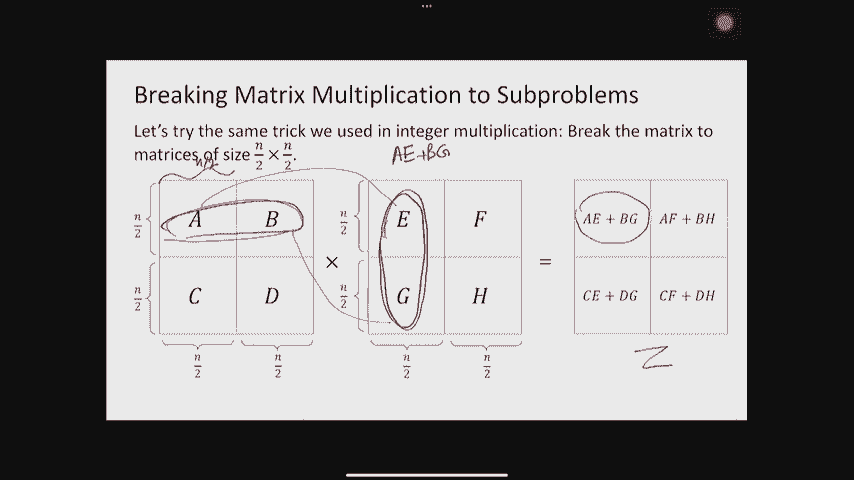
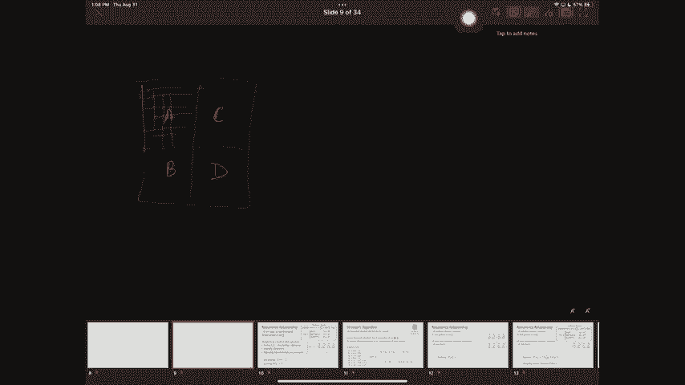
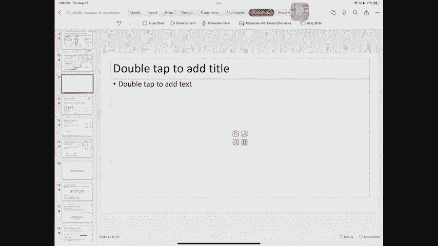
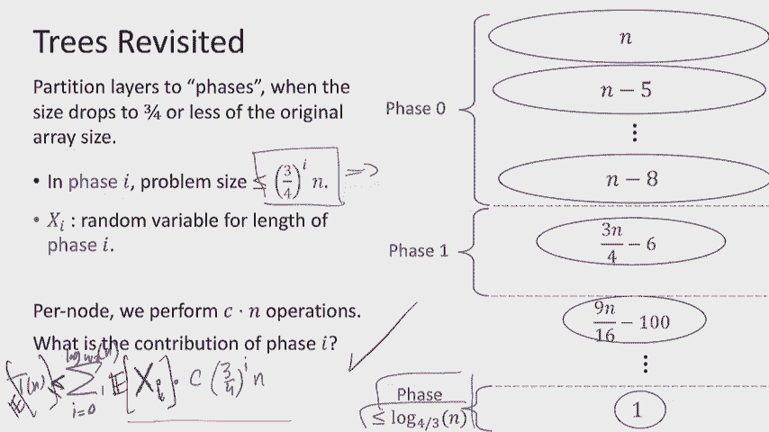

# 课程 P3：Lec3 分而治之 (第二部分) 🧩


在本节课中，我们将继续学习分而治之算法。我们将首先回顾主定理，然后探讨两个重要的应用：矩阵乘法和选择问题（特别是中位数查找）。我们将看到如何运用分治思想来改进这些经典问题的算法效率。

***

## 回顾主定理 🌳

上一节我们介绍了分治算法的递归关系及其分析方法。本节中，我们来看看一个强大的工具——主定理，它能帮助我们快速分析许多分治算法的时间复杂度。

主定理适用于形式如下的递归关系：
`T(n) = a * T(n/b) + O(n^d)`
其中：
*   `a` 是子问题的数量。
*   `b` 是问题规模缩小的因子（子问题规模为 `n/b`）。
*   `d` 是分解与合并步骤所需计算量的指数。

主定理指出，该递归式的解取决于 `a`、`b^d` 的比较：

1.  如果 `a > b^d`，则 `T(n) = O(n^(log_b a))`。此时递归树分支多，大部分工作在最底层完成。
2.  如果 `a < b^d`，则 `T(n) = O(n^d)`。此时递归树窄，大部分工作在顶层完成。
3.  如果 `a = b^d`，则 `T(n) = O(n^d * log n)`。此时每一层工作量均衡。

理解其背后的直觉很重要：比较 `a` 和 `b^d` 实质是在比较递归树每一层工作量的增长（或衰减）速率。

***

## 矩阵乘法 ✖️

现在，让我们将分治思想应用到一个基础但计算量巨大的问题上：矩阵乘法。

### 问题定义与朴素算法

给定两个 `n x n` 的矩阵 `X` 和 `Y`，计算它们的乘积 `Z = X * Y`。`Z` 中第 `i` 行第 `j` 列的元素是 `X` 的第 `i` 行向量与 `Y` 的第 `j` 列向量的点积。

计算一个点积需要 `O(n)` 次操作（`n` 次乘法和 `n-1` 次加法）。由于 `Z` 有 `n^2` 个元素，因此朴素算法的时间复杂度为 `O(n^3)`。





### 分治策略



我们可以模仿大整数乘法的思路，将每个矩阵划分为四个 `n/2 x n/2` 的子矩阵：
```
X = | A  B |,  Y = | E  F |,  Z = | C  D |
    | C  D |       | G  H |       | G  H |
```
那么 `Z` 的四个子矩阵可以通过 `A, B, C, D, E, F, G, H` 的乘法和加法来计算，例如 `C = A*E + B*G`。这导出了8个子问题（8次矩阵乘法）。

由此得到的递归关系为：`T(n) = 8 * T(n/2) + O(n^2)`。这里 `a=8`, `b=2`, `d=2`。因为 `a > b^d` (8 > 4)，根据主定理，时间复杂度为 `O(n^(log_2 8)) = O(n^3)`，与朴素算法相同。

### Strassen 算法

关键突破在于减少子问题的数量。Strassen 设计了一种巧妙的方法，通过构造7个中间矩阵 `Q1...Q7`，仅用7次 `n/2 x n/2` 的矩阵乘法就能组合出结果。这7个中间矩阵由原始子矩阵的加/减运算预先构成。

以下是 Strassen 算法的核心步骤：
1.  计算7个矩阵乘积：
    *   `Q1 = A * (F - H)`
    *   `Q2 = (A + B) * H`
    *   `Q3 = (C + D) * E`
    *   `Q4 = D * (G - E)`
    *   `Q5 = (A + D) * (E + H)`
    *   `Q6 = (B - D) * (G + H)`
    *   `Q7 = (A - C) * (E + F)`
2.  通过 `Q1...Q7` 的加减法组合出 `Z` 的四个子块：
    *   `C = Q5 + Q4 - Q2 + Q6`
    *   `D = Q1 + Q2`
    *   `G = Q3 + Q4`
    *   `H = Q1 + Q5 - Q3 - Q7`

新的递归关系为：`T(n) = 7 * T(n/2) + O(n^2)`。此时 `a=7`, `b=2`, `d=2`，因为 `a > b^d` (7 > 4)，时间复杂度为 `O(n^(log_2 7)) ≈ O(n^2.81)`，优于立方时间。

***

## 选择问题（以中位数为重点）🎯

接下来，我们探讨一个不同领域的问题：选择。即在一个未排序的数组中找出第 `k` 小（或第 `k` 大）的元素。中位数查找是 `k = n/2` 的特例。

### 简单解法

以下是几种简单解法：
*   **排序法**：先排序（`O(n log n)`），然后直接索引第 `k` 个元素。
*   **多次遍历法（针对最小/最大值）**：例如找最小值，只需线性扫描一次（`O(n)`）。但找中位数则无法在线性扫描中简单维护。

我们的目标是找到一个**最坏情况或平均情况为 `O(n)`** 的算法。

### 分治策略：快速选择

算法的核心是“划分（Partition）”，类似于快速排序。我们选择一个“枢轴（pivot）”元素，将数组 `S` 划分为三部分：
*   `S_L`: 所有**小于**枢轴的元素。
*   `S_V`: 所有**等于**枢轴的元素。
*   `S_R`: 所有**大于**枢轴的元素。

这个划分过程只需线性扫描数组一次，时间复杂度为 `O(n)`。

划分后，根据 `k` 值所在范围决定递归方向：
1.  如果 `k <= |S_L|`，则第 `k` 小元素在 `S_L` 中，递归地在 `S_L` 中寻找第 `k` 小元素。
2.  如果 `|S_L| < k <= |S_L| + |S_V|`，则枢轴就是第 `k` 小元素，直接返回。
3.  如果 `k > |S_L| + |S_V|`，则第 `k` 小元素在 `S_R` 中，递归地在 `S_R` 中寻找第 `(k - |S_L| - |S_V|)` 小元素。

### 枢轴的选择与算法效率

算法的效率完全取决于枢轴的质量。一个“好”的枢轴应能将数组划分得相对均衡，即 `S_L` 和 `S_R` 的大小都不会太大。

*   **理想情况（中位数）**：如果每次都能选到中位数，则 `|S_L|, |S_R| <= n/2`。递归式为 `T(n) = T(n/2) + O(n)`。根据主定理（`a=1, b=2, d=1`, 属于 `a < b^d` 情况），`T(n) = O(n)`。
*   **足够好的情况**：如果我们能保证每次选到的枢轴都落在数组的“中间50%”区间（即大小在 `n/4` 到 `3n/4` 之间），那么 `max(|S_L|, |S_R|) <= 3n/4`。递归式为 `T(n) <= T(3n/4) + O(n)`。这仍然是一个规模以常数因子（3/4）缩小的递归，通过递归树法或主定理分析，可得 `T(n) = O(n)`。

### 如何找到好枢轴？

有两种主要思路：

1.  **随机选择**：随机选取一个元素作为枢轴。在随机算法中，我们分析其**期望时间复杂度**。因为一个好枢轴（中间50%）被选中的概率是 1/2，所以期望上只需要常数次尝试就能找到一个好枢轴。通过更细致的概率分析（例如将算法进程划分为以找到好枢轴为标志的“阶段”），可以证明快速选择的期望运行时间是 `O(n)`。
2.  **确定性选择**：存在复杂的确定性算法（如“五元组中位数”法）可以在最坏情况下 `O(n)` 时间内找到一个足够好的枢轴。但该算法常数较大，实践中不如随机算法高效。

***

## 总结 📝

本节课我们一起深入学习了分而治之算法的两个经典应用。
*   我们首先回顾了主定理，它是分析分治递归式的利器。
*   在**矩阵乘法**中，我们看到了 Strassen 如何通过将8个子问题减少为7个，将复杂度从 `O(n^3)` 降至约 `O(n^2.81)`，展示了减少子问题数量的威力。
*   在**选择问题**中，我们介绍了快速选择算法。其核心在于通过划分将问题规模缩小，并深入探讨了枢轴选择对效率的影响。我们了解到，即使是简单的随机选择枢轴，也能在期望 `O(n)` 时间内解决问题，这体现了随机化算法的魅力。



通过这两个例子，我们巩固了设计分治算法的思维：如何划分子问题，如何合并结果，以及如何分析其复杂度。