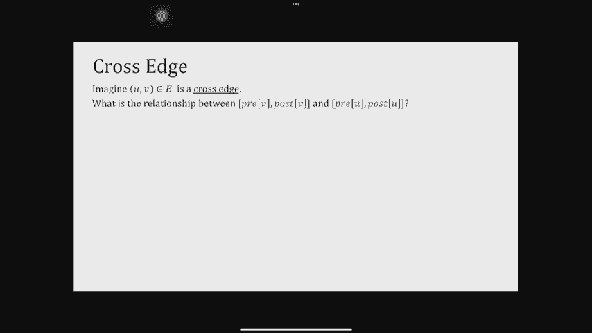

# P6：Lec6 Graphs and DFS - 东风渐起UCAS - BV1o64y177K8

我现在有点害怕换HDMI，但是我的iPad没有显示，嗯，我的iPad显示不出来，我应该连接到另一个吗。

也许是A让我试试这个。

好啦，我们拿到了，好啦，我们马上就开始，所以我来拿，好啦，谢谢你，所以我，这个我有，如果你找到了，很高兴一周后见到你，我听说上周我不在的时候你们玩得很开心，学习了慢傅里叶变换，这就是你学到的。

关于快速傅里叶变换你学到了什么，是啊，是啊，是啊，是啊，慢的那个，那没那么有趣，感觉一周真的很长，我已经把学过的名字都忘了，所以我道歉，我会再问你一次，你们叫什么名字，呃。

显然我也忘了今天是第六课而不是第五课，我差点就走错楼了，所以这就是我拥有的记忆，很明显今天我们要讨论的是，所以我们终于完成了分而治之，我们已经征服了那一章，你只有在需要的时候才会再去。

但我们要谈谈真正令人兴奋的，非常非常直观的图算法，在我们这么做之前，几个通知，作业三今天要发布了，你也知道，我们从周二晚上和周三开始讨论，后来又有几个，有人告诉我，讨论3对做作业3很有帮助。

助教们鼓励你去，我猜他们会给你一些提示，所以一定要参加第三次讨论，因为很显然，你不用花太多时间就能把这项家庭作业做得很好，好啦，这实际上是我们所有的公告，所以我们可以从图表开始，什么是图表。

我知道你所知道的，图表是，你知道的，不是你喜欢的图表，绘制以了解您拥有什么样的数据，但是有顶点、节点和连接的图，是我们将要谈论的，他们无处不在，它们真的帮助我们想象世界上许多非常重要的事情，例如。

这是1999年互联网的图表，我不知道现在是什么样子，当时它有几十亿，可能有八九十亿个网站，如果一个网站链接到另一个网站，这里有个边，这是你出生前的互联网图表，Facebook上的友谊图。

这也是2010年的，显示你知道它实际上显示了用户在哪里，在那里有很多友谊联系，所以北美东海岸有很多，在欧洲和其他地方有很多，这也是人与人之间友谊的曲线图，我们有生物现象的图表。

尤其是我们的大脑真的很有趣，你知道的，如果一个神经元，有边缘，本质上，它是在我们身体的不同部位之间被激活的，这是我们大脑神经元的曲线图，这是达美航空在美国的航班图表，S，当你看这里时，连接在哪里。

很明显亚特兰大明尼阿波利斯和盐，湖城似乎是底特律似乎是三角洲的中心，如果你不知道那是三角洲的总部，好啦，所以我们有所有这些图，而且有些很小，其中一些是巨大的，我们真正想讨论的是，我们要怎么处理这些图。

为什么我们甚至以图形的形式呈现它们，这个想法可能是因为我们想从这些，所以我们要解决的是，我们实际上是如何看待这些图表的，我们如何储存它们，我们如何在计算机中呈现它们，一旦我们储存并展示它们。

我们能在它们身上检测到什么样的结构，也许我们想检测社区，也许你想检测友谊的群体，非常紧，友好团体，也许我们想找到路线，那么我们如何设计算法来完成所有这些并回答同样的问题，我们从一开始就一直在回答和询问。

这些算法正确吗，它们是否像我们认为的那样工作，他们快吗，我们能做得更好吗，所以这就是我们要做的，就像下一个，我想三堂课，所以让我们从无向图的形式定义开始，我知道你们在61年就已经学过了。

你在61年学过图形算法，但我们将更深入地研究，实际上，一些你认为你已经知道的算法，现在你将从一个不同的角度看他们，那么什么是图，无向图，G有一组顶点或节点，由集合V显示，然后有一组边。

这些边只是这些顶点的对，我们用顶点集和边集v和e定义一个图，例如，我们可以用一个顶点来编号，两个，三个，四，或者五个，然后边缘不定向的时候，它们通常用花括号表示，所以一切都无所谓，如果是一个，三三一。

然后这些边缘，一三，两个，四，三个，四，两个，三个，告诉我在我的图表中把这些弧线和边放在哪里，无向图的一个例子是什么，有没有人愿意举一个无向图的例子，方向无关紧要，或者是双向的，双行道。

所以一条双行道肯定有双向的边缘，有没有其他建议，好啦，所以肯定是双向的，但是交通图表很抱歉是无方向的，但交通实际上是一个有向图，因为有一些道路你只能以一种方式行驶，另一个有人想做志愿者的例子。

另一个例子，蜘蛛网，一张蜘蛛网，是啊，是啊，蜘蛛网，你可以，你可以从它的任何一端到另一端，只要你不被卡住，完美，又一个，作者发现基于边缘的伟大，所以如果我有顶点是作者，然后边缘是你是否合著了一些东西。

如果我和你一起写了一篇论文，希望你知道这是一种对称的关系，你还和我合著了，好极了，所以另一个我们将有更多的机会自愿回答，另一个我要告诉你的是Facebook，其实呢，尤其是Facebook上的友谊。

因为如果你的朋友，嗯你的你知道，有人，也有和你在一起的朋友，在Facebook上不是片面的关系，至少在现实生活中，我了解友谊因为我们是单方面的，这张图有多大，嗯，我想这可能是几年前的。

但这是最好的统计数据，我可以发现这个图中的节点数大约是30亿，平均每个人在Facebook上都有大约338个朋友，所以边数，如果你真的想一下，这更像是30亿次，三百三十八。

所以我想这就像我不能做数学所以很多，这就是Facebook的规模，它是一个无向图，现在我们也有了有向图，有向图的主要变化是边现在是有序的，每条边从一个顶点到另一个顶点，它可以双向，你仍然可以拥有它。

但重要的是我们要把花括号换成圆括号，所以我们强调有一个命令，所以是1比3，当我写这篇文章的时候，不是三对一，然后是一个有向图的例子，我已经说过交通是一个，好的单行道是有向边的一个例子，交通是一个是的。

食物网，哎呦，像什么吃什么，哎呦，是呀，是呀，是呀，真的，那就像动物吃的东西，什么动物是有向图，是呀，又一个，我想说这有点像Facebook，我猜是推特，我被告知不要再叫它推特了，因为你可能会跟踪某人。

他们不会跟著你，就像如果你跟着泰勒·斯威夫特，不幸的是她没有跟着你，那么这个图的大小是多少，这个图也很大，没有Facebook那么大，嗯，但是嗯，顶点的大小约为四亿五千万，平均边数，每个人都跟着。

所以我想我们跟踪的人比我们喜欢做朋友的人多，看来是这样，但这张图也很大，如果我想储存它，即使是跟踪图表中的人数也是巨大的，这是两个图的例子，我一直在说这些是巨大的图表，但是我们真正使用的参数是什么。

来谈谈图的大小，你知道的，当我们讨论整数乘法时，我们谈到了数字的数量，那么图形呢，你叫什么？我们实际上在看什么，我们在看顶点的数量和边的数量，我们通常考虑的顶点数，从现在到接下来的四堂课。

如果任何时候我说N，那是图的顶点数，嗯边数，我们叫它M，你可能真的可以在脑海中很快做到这一点，说m最多等于n的平方，因为两个顶点之间的边，有最多和大约和正方形的顶点对，你绝对是对的，但在许多情况下。

它实际上要小得多，例如，在脸书的图表中，而n大约是30亿，边数不是30亿乘30亿，是三十亿乘三百，所以它要小得多，在许多情况下，我们称这些图通常为稀疏图，但这两个参数都是我们关心的，我们认为它们很大。

所以我们想提高效率，还有一个参数叫做度，知道那是什么意思是很有用的，它在一个无向图中，只是有向图中邻居的数量，你可以更正式一点，谈论学位和学位，就像许多有优势的邻居来找你一样，你有优势的邻居数量。

出去很多次，out学位也只是非正式地称为degree，比如你去找谁，这些是我们在今天的课上会用到的参数和图表，所以让我们进入主要的第一个问题，这就是我们如何表示图，我刚说了这些图很大，如果你想代表他们。

如果你想把它们存储在电脑里，我们需要一些有效的数据结构，我们怎么做，表示图形有两种主要方法，它们都叫邻接，在邻接矩阵和邻接列表的意义上，邻接只是说，啊，我在跟踪边缘，如果a和b相邻，他们之间有优势。

那么我们如何跟踪他们呢，在矩阵中，邻接矩阵，是一个n乘n矩阵，正如我所说，n是顶点的数目，你把顶点列表放在行和列上，这是方阵，每个细胞放一个，如果该单元格表示边，所以如果ij是图中的一条边。

我把它放在一个，否则我放一个零，现在我也有一个邻接列表，邻接列表，不知道为什么这不起作用，好的，先列邻接表，只是像，数组中的顶点通常，然后在数组的每个位置，假设商店的位置，i的所有邻居的集合。

它是如何储存的，它可以是任何其他数据结构，以符合您的教科书，我们假设这是一个链表，所以本质上有一个指针存储在这个数组中，指针指向，到i的所有邻居的链表，以任何顺序，这些未排序的顺序，他们可能会很乱。

所以这是表示图的两种方法，对他们有什么问题吗？好啦，所以很简单，但是我们现在要做一个练习，所以你为什么不花三十秒，你可以和你旁边的人说话，绘制此图的邻接矩阵和邻接列表，好啦，让我们现在一起做这件事。

所以我想画一个邻接矩阵，我有四个顶点，所以我有四行四列，这是一个B，C，D，因为这些边是指向，是ij还是j i很重要，所以我是排，j是列，所以第一条边a到c，我看a和c，我在这里放了一个。

注意没有c 2 a，好啦，其他的边缘呢，嗯，还有一个B到C，有一个d到c，也有一个d到b，其他的都是零，这就是邻接矩阵，邻接列表呢，好吧，我现在为每个人做一个b c d，我得把邻居的链表。

所以A有一个邻居，c b也有一个邻居，因为它没有邻居，注意它有很多邻居进来，但没有东西出去，D有两个，我就按顺序写，任意，CMB邻接列表，为什么邻居被表示为链表，而不是像。

这主要是因为我们希望在实践中保持一致，其实不是联系少，你在里面放了更有趣的数据结构，只是我们不想喜欢评论，从上到下，你可以在那里堆一堆，如果你想的话，你可以有一种，你可以把哈希图，如果你想的话。

还有其他事情，但为了接下来几节课的目的，只是为了让我们都在同一页上，我们假设它是一个链表，但是是的，当然，你应该，你应该做的，有几件事我想注意，那就是，尤其是当我看邻接列表的时候，嗯。

所有这些链表的大小，在某种意义上与，我试图存储的所有边缘的大小，事实上每一个边缘，每个有向边通过存储在这个链表中基本上只出现一次，链表通常要小得多，嗯，不是通常它总是小得多，它小得多的原因。

它没有存储任何零，正如你在左手边看到的，我存储了太多的零，我本可以说得很好，如果我不写下一些东西，假设它是零，我为什么要写下来，所以这就是为什么我们要谈论，两者之间是如何权衡的。

这两种不同的表示实际上是做什么的，为什么我们要选一个而不是另一个，所以让我们一起做第一篇专栏文章，然后我想让你们和你的邻居一起工作，对于邻接列表，所以让我们看看这个存储大小。

我只想知道在大O符号中我需要多少存储空间，保存具有n个顶点和m条边的图的邻接矩阵，也许我们可以一起说，一二三常n的平方，因为我有N行和N列，那里的一切往往都是平方的，现在好了。

假设我有一个非常特殊的优势，我想看看那个边是不是，这是不是一个真正的优势，所以我有紫外线，我想看看，这到底是不是优势，我要花多少时间来检查紫外线是否在一起，一二三，我听到常量，所有的人都是一样的。

对此有什么问题吗，为什么好，因为我在这里有一个代表，所以当我有一个数组或矩阵，我只要给它地址就能进入它的任何一个细胞，好啦，链表实际上不是这样，如你所知，在链表中，你必须一个接一个地跳。

但是数组和矩阵的美妙之处，你想检查的任何地方都可以从一个，好啦，所以我们这里有一个O，是呀，你想做什么变成一个喜欢的整数，呃，呵呵，嗯，然后你在数那个整数的位数。

所以这个空间现在就像我们可以作弊说所有的整数，一般来说你只拿一样东西，把它变成另一种形式，只要你还在储存所有的零1，它不会改变它，最后一个呢，所以现在我实际上想列举你们所有邻居的集合，在我们回答之前。

让我们考虑一下，所以有一个顶点，我想看看所有的边缘，它有它所有的邻居，好啦，那要花多少时间3 2，N个好的之一，对于那些想知道，为什么，因为嗯，我想了解一下这里的邻居，嗯，我必须经历它，一个个来看。

那些在哪里，零在哪里，所以我必须遍历整排，太伟大了，好啦，现在我要求你为另一个专栏做这件事，我给你一分钟，请和你的邻居一起工作，无论你想往哪个方向走，六十秒后再谈，好啦，再过十秒，好啦。

所以这可能会更微妙一点，所以与其让你们大声喊，我想为邻接列表的第一个存储大小做志愿者，有人想做志愿者吗？你可以这么说，这是一个很好的建议，可能是不完整的，所以让我们看看是否有另一个建议，全部m加n。

你能告诉我们更多吗，好的好的，所以M的O是一个很好的猜测，因为链表是O的M好的，就像我们说的，每条边，每条有向边，仅在其中一个链表中表示，本质上，但也有所有这些顶点，很有可能。

他们中的许多人根本没有邻居，所以我们还是应该解释，这就是为什么我们说N加M你，你也可以说e+v，这是一回事，对此有什么问题吗，我们为什么要解释n，你可以，你可以把它写成平方。

这是否是一个好主意是这里的主要问题，记住我们说过有些图没有很多边，例如，脸书图表，我们说是三十亿，m比n的平方小得多，因为只有30亿次，三百三十，所以这就是为什么不把n的平方付清是很重要的。

这正是你更喜欢用这个的时候，所以这些图的平均度数很小，或者边数比n的平方小得多，好啦，是呀，很好，可以把这个写成塔塔吗，因为你总是需要用那么多的内存，这是真的，因为如果我真的想谈论边缘。

我得把它们写下来，是啊，是啊，你绝对可以用θ来谈论它，好啦，这里的第二个牢房呢，所以我想我有一个非常具体的，你知道U和V，我想检查一下，有优势吗，UV，自愿告诉我需要多少时间，M，这是一个合理的上限。

你能告诉我为什么，就像一个顶点可能有m条边，或者最多是他们中的M，但我也可以一个一个地看，天真地，你能做得更好吗，什么，如果像平均水平，别的东西很小，Auth n也是一个很好的猜测，可能比我好。

因为你可以跳转到正确的数组位置，最多只有n个邻居，最小的也是，所以那些善良的人，你能从根本上依赖于不同的数量，很好，你猜呢，你的程度你会是对的，如果是无定向的太好了，所以我们要说的是，它实际上有点。

一定小于n和m的东西，因为我去找你，然后我遍历它的列表，这份名单是你邻居的数量，也就是你没事的程度，或者你伟大的程度，最后一个问题呢，尤其是我们刚才看到的，我想一一列举，需要多少时间。

假设我真的想把它们一个一个地写下来，嗯，任何志愿者，可能从这边或那边，好吧，你的程度，所以这仍然是你的所有程度，这就是我想要的答案，我会写下任何反对意见，如果什么，对呀，如果它是直接，其实呢。

如果它是直接的，没关系的，因为它还在使用，就像我还在看这个学位是出局的学位，记得我是怎么说的吗，嗯，你非正式地把我们的学位称为学位，所以这是一回事，因为它是导演的，你还在看那份名单，如果它是非定向的。

是呀，但我们实际上并没有在这里做一个无方向性的假设，这可能是矩阵，这两种表示也用于定向，但是是的，如果是的话，这将是两者中最小的，嗯，让我们，让我们来看看第三个，嗯，只是因为我觉得这是我经常听到的答案。

尤其是因为这是一个链表，你们中的一个可能会这么想，也许只是一个，因为我要去U数组位置，我只是给了一个指向链表的指针，这就像是一种方式，你可以指向所有邻居的列表，当然啦，但既然我们在考虑真正列举。

就像一个接一个地经历，这就是为什么我们不想谈论他们所有人，我们真的不想去想，很好，这就是你如何表示一个图，有什么问题吗？酷，现在我们知道了如何表示图，呃，首先呢，嗯，我们将主要使用邻接列表。

因为n的平方所需的空间非常大，所以只要记住脸书或推特就行了，这将是非常无效的，所以除非我告诉你，让我们假设我们正在处理一个邻接列表，好啦，那么现在我们可能想问什么问题，有疑问。

就像从u到v有一条路径吗图是连通的，有一条从任何东西到任何东西的道路吗，如果没有连接，连接的组件是什么，所以这些是一些问题，我们将开始看到答案，在今天的讲座中，让我们从一个非常自然的问题开始。

即我们如何探索一个图表，还有呃，在古代，也许他们不叫它图表，但重要的是要考虑，你怎么能，探索迷宫或迷宫，如果你要杀一个牛头怪，有一个关于忒修斯和牛头怪的故事，不知道你记不记得，有人记得这个吗，你还记得。

好啦，也许我会很快地把故事讲出来，他要杀一个牛头怪，谁藏在这个迷宫里，没有人能做到这一点，因为他们会在迷宫里迷路然后被杀，最终以欺骗的方式，这个他给了一块，他被告知用这根绳子找到你的路，别在迷宫里迷路。

事实上，用这根弦，尽可能深入，在迷宫里，不要向左或向右，走更深的路，所以这启发了探索迷宫的算法，图和迷宫，即使你不想杀人，我们需要的不仅仅是一根绳子，我们也要用粉笔，因为我觉得TCS的记忆力很好。

我已经向你证明了我没有，所以这支粉笔将被用来，这样我们就能跟踪我们去过的地方，这样我们就不会去一个不必要的地方，这根绳子会帮助我们追踪到，所以永远不要在电脑里迷路，你使用粉笔的方法是。

把它设为真或假或者一些数字和字符串，尤其是如果你只是想追溯，可能是递归调用，因为你可以全部或一堆，你总是可以把更多的东西往下走，然后再往上走，所以让我们看看这个类比是如何，从古希腊翻译成算法。

我们将讨论算法，首先用于探索无向图中的连通性，那我们就直接说吧，所以我想做的是用粉笔和标记，我去过的地方，所以我希望这是一个布尔值数组，我把这叫做参观它的规模，n代表每个顶点，我把它初始化为所有的球。

所以我什么都没看到，现在我想做的是调用这个函数，探索一个图和一个节点，当它听到那个音符，它马上就去探索，从它访问它的意义上说，所以用粉笔，上面写着好的，我一直在这里。

然后它观察从这个顶点出来的邻居或边缘，如果他们中的任何一个还没有被访问过，它将递归地调用它们以被访问，好啦，所以现在我有粉笔了，它是我访问的数组，我有绳子，哪一个是探索的递归调用，这个算法效果如何。

我只想喜欢，因为它有点定义不足，我只想说当我们检查邻居的名单时，你可以按任何顺序去，只是为了让我们在同一页上，让我们按字母顺序来，只是打破平局的命令，好啦，所以这就是传说，白色是我还没去过那里。

黄色是我去过那里，但我还没有探索出所有的出路，蓝色已经在那里了，我受够了，所以让我们开始，我们先从，或者一个，那只是，让我们假设那是，你知道的，我们首先开始的地方，在A之后，我设置了一个要访问的。

因为它是橙色的，意思是现在它被访问是真的，我检查了边缘列表，从一个，只有一个顶点，顶点B和我的一根绳子，显示递归调用的字符串片段，我基本上可以打电话给，现在呢，探索，G和顶点B，现在我继续，我在探索B。

我做的第一件事就是把它标记为已访问，这就是为什么它是橙色的，然后我会把它的一个邻居按字母顺序，它有两个邻居C和D，我要C，取c，我正在做一个递归调用来探索C，所以我要沿着这条路走下去。

所以现在我在探索C，当我探索C的时候，我得看看这份邻居名单，有邻居，我要D和，在某个时候，我看着D，我说我是如何探索我所有的邻居，或者不好，我看着这条虚线，回头看B，并说实际上我已经探索了B，B已标记。

访问真实，因为它是橙色的，所以我不需要探索它，所以我也用完了C，所以没有什么可做的，这意味着我和D玩完了，所以现在我在回溯，我受够了，是谁打的电话，C在叫D，现在我看c，我碰巧用完了C。

没有其他邻居未被探索，我回去，我受够B了，最后我做了一个，所以这就是你如何探索，从一个，对此有什么问题吗，所以对于这个探险家，我们刚刚所做的，是我们，其实呢，必须准确地访问在图G中有一条路径的顶点集。

在我的第一个顶点U和我访问的顶点之间，所以这是探索者担保的一个属性，我们可以证明这一点，我们真正要说的是，我们想证明当你探索一个节点，然后看看所有访问过的顶点，他们被拜访是真的。

这是所有平易近人的事情的集合，从你那里可以到达，对声明有什么问题吗，好啦，那么我该如何证明这一点呢，有两种方法，因为它是一个，当且仅当或一种表征，我必须指出两个方向，第一个方向说如果B被访问。

就像如果我在V上打了一个对勾，因为它意味着g有一条从u到v的路径，直觉，我想请你在家里证明这一点，因为你可以像，有很多不同的方法可以证明，你可以用归纳法来证明，你可以用很多不同的方法证明。

但一定要在家里正式确定，如果有人来拜访你，一定有一条路把你带到了那里，我想在这里证明的部分是，如果有一条路，你会被拜访的，所以让我们试着证明这一点，和往常一样，很容易想到这些事情，试图证明相反的情况。

就像相反的主张，所以假设这是假的，其实我也把四个放在这里，对于那些想记住我刚才写的东西的人，假设这个陈述是假的，所以如果它是假的，这意味着有一个V没有被探索，从你变成这样，让我们画这条路。

这是一条抽象的道路，所以我有你，我有V I，不知何故，我在他们之间有一条路，我说V没有被访问，嗯，也许还有其他东西在这条路上也没有被访问过，所以有一件事实际上简化了，事情是这么说的，让我们试着证明矛盾。

不是通过关注V，但实际上通过回溯并说让我们走这条路，让我们把节点，我们称之为DK，BK是这条道路上最早的，那不是出口，所以这不是探索，这不是出口，但因为它是最早的，另一个是探索，Bk减一。

我要给它起名字，好啦，所以我们现在作为出口减了一个，我已经有了一个矛盾，因为记住，通过说我已经运行了探索者，G v k减去1，我得看看所有的邻居，所有的边都从BK减1出来，探索它们中的每一个。

所以我不得不打电话，现在我刚刚证明了这个说法是错误的，好啦，所以这是，一个证明的结构，你最终会在图表中使用和看到很多，你会假设某件事是假的，但你不一定要放大那个东西，你试图找到更极端的东西。

那么什么比v更极端呢，B井被勘探，但也许更早的东西是出口，所以这就是你想在图表中走的路，通常会选择更极端的东西，让你更容易推理，好啦，对此有什么问题吗，有什么问题吗，否，好啦，嗯。

我想现在是短暂休息的好时机，是一二三，让我们回到一二六，哦，请把门关上，最后一个，好啦，好啦，让我们一起回来，好啦，所以说，那么下一步是什么，我们现在要用这个资源管理器函数做其他事情。

特别是我想重温你们在61年学到的东西，称为深度优先搜索，图，深度优先搜索树，搜索程序的深度，第一次搜索碰巧是本质上的探索，但正如我们所看到的，在看到一个连接的组件后，探索了一些结束。

但图表中剩下的太多了，就像电动势，我们根本没碰它，那么dfs想做的是，是这么说的，每当你陷入困境，没有更多的东西可以通过递归调用来探索，只需遍历任何导出的顶点，并开始另一个导出调用，这就是dfs的作用。

那到底是什么意思，这意味着我调用g的dfs，我把我的第一个节点，这是一个，然后我做了整个探险家，A，所有这些，但后来我出来了，那么DFS做的是说，好啦，你探索了一个，你现在为什么不试试B，所以我试着B。

但在我打电话给探索之前，我查了一下，好吧，B是否已经被访问过，因为B是作为A的探险家的一部分被访问的，我再也不碰它了，我只想开始，然后我问了同样的问题，C呢，那D呢，而且都已经出口了，然后我就可以。

我看着说实际上，我还没有探索过，我还没有参观过，所以因为我还没有参观过，到目前为止，我会再次探索E，我做的，A出口后的呼叫或B的呼叫满足所有其他的勘探呼叫，这看起来基本上是你从我在左手边做的开始。

对于另一个连接的组件，你从E开始，你访问E，你看看它所有的邻居，然后你看，你说得很好，没有别的可探索的了，所以我要把它标记为完成，然后我回来了，他没有别的可探索的了，所以我做了。

这实际上是你可以思考探索整个图表的方法，而不是它的第一个连接组件，事实上，dfs的使用方式与，我刚才解释了如何找到一个图的所有连通分量，只是为了让他们做更多的簿记，假设我想拥有，现在呢。

另一个数据结构告诉我有多少连接的组件，谁与家相连，那我就拿DFS，我解释的方式，我将添加一个计数器，它将计算连接组件的数量，我把它初始化为1，我还做了一个整数数组，我把它叫做连接组件号，因此。

如果您与其他人共享连接的组件，你的号码现在会是一样的，每次我叫探索我会做什么，你知道我只是想标记，就像我探索了一个，那我给它编号，当我一个人探索它的时候，所以只要我在这个递归中，计数不变的a的堆栈。

所以当我访问B时，我也叫它一个，当我访问C时，我也叫它一个，当我访问D，我也叫它一个，但每次，嗯，节点我要做的是，我会增加人数，所以当我到E的时候，现在我用的是不同的号码，所以这真正告诉我的是。

我实际上把图分成了，基于这个连接的组件编号数组存储的编号，嗯，它为左边连接的组件上的所有东西存储了第一个，它为右边连接的组件上的所有东西存储了第二个，对此有什么问题吗，当然最后。

我可以知道连接的组件有多少，我只是看着我的计数，因为我一直在增加，但我也有一个结构，可以通过，就像说好，查找标记为一个的所有节点，对此有什么问题吗，这是dfs的一个非常简单的用法，我想让你远离的是。

DFS已经非常有用了，实际上，通过在里面做更多的簿记，就像添加更多的数组和更多的计数器，我甚至发现或写下了更多关于图表的结构，你在61年可能会也可能不会这么做，好啦，对此有什么问题吗，好啦。

所以如果这是dfs，嗯，本质上，我们在这里真正做的是，我们隐含地制作一棵树，甚至可能是为我们做的，如果它没有连接，我说的含蓄是什么意思，我是说，看看dfs做了什么，橙色的边缘，所有这些递归调用的边。

或者现在我把我调用的第一个节点，我把它拉起来，我得到的是树，这是探索调用的堆栈，就像在一个被探索的地方，它被称为探索者b b正在被探索，它叫探索C，看看出口的是什么，称为D的虚线边缘，说得很好。

这个图中还有一些其他的边，与我的递归调用不一致，我只是要把一些点，所以我记得这正是那个图，只是我不把这算作出口电话，好啦，这就是你对dfs树或dfs森林的看法，通过本质上思考这些联系，橙色的边缘。

或者从不同的地方调用explore函数的连接，这被称为深度优先搜索树的原因是因为我们实际上是在说，让一棵树越深越好，或者TCS被告知离开，不要左右摇摆，尽你所能往下走，这正是我们正在做的，我们正在寻找。

或者我们优先考虑深度，所以让我们，让我们举一个例子，现在我想为这个无向图做一个dfs树，所以不幸的是，我要怎么做，我不能在这张幻灯片中再次显示算法，但正如你所记得的。

dfs按字母顺序遍历任何未探索的顶点，然后递归地调用explore，所以它从一个，因为按字母顺序那是第一位的，所以我写下了一个，现在我正在探索一个，这意味着我必须查看它所有的邻居。

那么接下来我应该探索的是什么，因为这里基本上是橙色的边缘，我在探索B，下一步我应该探索什么，我听到两件事，C我们都同意，C，下一步我应该探索什么，好了，现在A D，我该怎么办，在回溯之前，我做别的事。

我去找邻居，对呀，所以当我检查邻居的时候，我注意到有B，但我不是，但因为它已经被探索过了，因为它已经出现在我的树上了，我不会再叫它了，所以我要画一条虚线，好现在我把虚线，我看着D，有没有邻居下落不明。

所以现在我回溯，好啦，我回溯到C，有没有邻居下落不明，对于，我又回到了B，没有邻居下落不明，所以说，我回到了现在，我该怎么办，谁做的，我接下来探索，我接下来探索E，好啦，然后在那之后，我在F做什么。

我检查了边缘，是否有未知的优势，是哪个f到a，我把虚线，然后我再看F，还剩下什么吗，所以我和F玩完了，我回到E，我受够了，我回溯到一个，我受够了，dfs看了看说，还有未访问的顶点吗没有。

这是一个单独的连接组件，没有什么是不被访问的，所以我有一棵树，现在这棵树有不同的边缘，这些实心边叫做树边，因为就像字面意思一样，我们用它们做了这棵树，还有这些虚线，这些叫做后边。

所以一棵树可以由后边和树边组成，它不能做的，然而，是由，因为无向图叫做交叉边，交叉边是点缀在两个不同分支之间的边，如果我看这里，每一个边缘都在祖先和后代之间，不管是不是虚线，总是在祖先和后代之间。

如果是一棵树，父母和孩子之间的边缘，如果不是，可能是祖先，后裔，穿过边缘是一条边缘，那就是，他们两个都不在对面，是一种优势，你放紫外线的地方，他们都不是祖先，对方后裔的后裔，有问题吗，DNF之间，好啦。

让我们快速看一下，想象一下DNF和DNF之间有一个边缘，所以当我到了D，我会，我会看b，这是一个包，还剩下什么，是f，所以我会在这里探索f，所以还是不是这个，嗯，只是为了，我们不混淆它。

我实际上要删除什么，我刚写了，因为我不想事后把你们搞糊涂，嗯，问得好，这正是我们需要你的直觉来证明的，为什么交叉边不存在，交叉边的定义清楚吗，好啦，所以事实是，在无向图中，实际上没有交叉边。

我们证明它的方法正是你的直觉，想象一下它的存在，那会是什么样子，我有一棵树，然后两个像两个大的子树，两个分支，我想说的是，嗯，想象一下在u和v之间有一条虚线，好啦，所以假设是假的，所以有紫外线。

那是一条交叉的边，现在我要说的是，当你被探索，注意V还没有被探索对吗，因为它在后面的分支里，V不是，所以如果他们之间有优势，边缘应该出现在这里，不是在另一个分支，使用子树，事实上。

就像在根植于您的子树中一样，所以这就是为什么这是一个矛盾，所以这是说对于一个无向图，画得真漂亮，只是后代和祖先之间的边缘，三个边，偶尔这些后边，现在这里的dfs运行时是什么，嗯，dfs的运行时。

这是更容易思考的方式，那口井，让我们数一数我们叫探索的次数，再看看探险家在，每个节点只调用dfs资源管理器一次，因为当你探索一个节点的时候，你检查它作为访问，所以你再也不会在那个节点上调用资源管理器了。

所以要探索的调用数正好是顶点集的大小，好好探索自己有多贵，当我看着探索，我首先把它标记为，所以这只是一个常数，我只是说我拜访了你，然后我得列出它所有的邻居，记住，如果你在列举某人的邻居。

你只是在支付他们在邻接列表中的学位，因为我去那个地方，然后我遍历链表，所以我们真正要说的是，我为每个节点付费，探索一个常数加上它的度，然后当我对所有可能的节点求和时，这将加起来为n，这将总结为M。

如果我看了所有的度，基本上我在数所有的邻居，这就是边数，所以dfs ss运行时也是n加m的o，这是你能做的最好的，因为我忘了有人问过这个问题，因为即使是运行简单的算法，更像是n加m的θ，你得喜欢。

通过你的顶点，你得穿过你的边缘，这是你应该做的最起码的事情，DFS是非常有效的问题，如果图的方向是好的，有向图的dfs实际上遵循完全相同的原理，我们仍然会跟踪访问的数组。

我们仍然会去每次有一个未被探索的邻居，我们要去探索它，唯一不同的是我们只打算这么做，如果它是一个向外的边缘，好啦，所以现在邻里是直接的，但由于这种方向性，dfs树或森林看起来会有点不同。

所以为了说明为什么它有点不同，我们要做更多的簿记，那么我想做的簿记是什么，我想跟踪我开始探索节点的时间，然后因为有一个递归调用，之后我会打一大堆电话，然后我想把那张纸条做完，所以我想写下，当我也用完了。

好啦，所以开始和结束，我们真的要这么做，有一个会滴答作响的时钟，所以我知道时间戳，然后我有两个数组，一个叫Pre，另一个叫波斯特，你可以考虑一下，因为pre是开始时间，帖子是完成时间。

所以我要做的簿记工作，每次我第一次进入一个节点并访问它，我在上面盖了章，当前时钟的开始时间，每次我用邮票，我让时钟前进，所以时钟走得更远，然后我做了所有其他可能的递归调用，我从递归调用中出来。

这是该节点完成的时候，它所有的邻居都被探索过，所以我又盖了一次章，这一次的帖子，完成标记，因为我在上面盖章，我又把钟调快了，每次我跺脚，时钟就向前走，那么现在这看起来像什么，我们要做dfs，我画的树。

我们现在要，使用邮票，所以时钟从时间一开始，我探索了一个Pre设置在当前时钟上，邮报，我还不知道，好啦，现在呢，我接下来探索什么，因为我进入它，我探索它，我会用钟在上面盖章，钟比一多，所以是二。

我把b的前部按两下，我还不知道邮局，我探索下一个d，所以这仍然是，我又经历了一次，我用下一个钟标上了开始时间，所以三个，以此类推，所以我得到了E，我盖了章，它的开始时间是四点，我回头看。

没有额外的递归调用，有背影，我看着说，哎呦，有某种包裹，但时钟不前进，因为我没有参观任何新的东西，所以钟还在四点，加一，四加一，所以我做完了，因为我受够了，我按下了E的完成时间，这是它的帖子。

所以这将是五个，我回溯，所以我看着D做得很好，D就做好了，我们没有任何未被探索的d的其他邻居，所以d就结束了，当我完成它，我给它盖章，D的邮票是什么，你能说大声点吗，六个，只是最后一个钟，加一个。

所以我把D标记为6，现在的钟是七点，每次我跺脚它就往前走，我看B B有未开发的邻居吗，好啦，所以我盖章，B的完成时间，什么是，B的完成时间，我看着一个，我准备好盖章了吗，完成了，否，为什么不伟大。

所以到目前为止我已经探索了这个，我看到有一个后边，A还有其他的优势，我有一个出口，所以我还没做完，我不能盖章它完成了，我必须探索它的下一个邻居，所以现在我又在探索一些新的东西，所以我在标记它的开始时间。

也就是八个，我接下来探索什么，我是探索E X还是E已经探索过了，所以让我们在这里跟踪它，那么我下一步在C之后做什么，注意这里有一条虚线，看起来像一个交叉的边缘，如果这不是直接的，它就不应该存在。

但在有向图中，你可以有一个交叉边，所以我先画这个十字，所以我把它记在脑子里，现在我看着说，所以这是我的十字架，我看了看，说我已经用C了，所以我准备好戳c了，我在上面盖上当前时间，也就是九，我回溯到一个。

我现在做什么，所以让我们再看看，我探索了这些东西，A下一步做什么，这不叫回溯，它在检查，嗯，因为回溯是沿着树向上的，让我们用回溯的语言来谈论上树，更像是在检查，E，事实上，这只小鸡被称为前言。

因为它从上到下，所以我查了一下，我把圆点线，现在我受够了，所以我要标记它的完成时间，作为十，啊，为什么这些簿记都是对的，就像，为什么我画这些东西来打扰你和我自己，因为在某种程度上，首先，我想让树看起来。

或者我在这里建造的任何东西，树加上其他边与原始图完全相同，它只是以不同的方式延伸，所以它看起来像一棵树，但也是因为这样做，你在揭示关于图的结构，在算法的设计中非常有价值，我会的，如果我们有时间。

我将向你们展示一个例子，希望在今天讲座结束前，如果没有，我们下次课开始时再看，好啦，关于我们是怎么做dfs的时钟冲压的，有什么问题吗，代码没有跟踪它，至少不是在这里，但他一直在跟踪。

Pre和Post可以告诉你这些边缘，所以再给我五分钟，好吧好吧，我想用一种更简洁的方式来谈论前和后，所以从某种意义上说，我会考虑，而不是写，b前，员额b，我将把它们看作是间隔，所以A是活动的。

从时钟1到时间戳，十个开始和结束，好啦，所以我想说清楚，这是一个，这是一个，只是更简洁一点，图中现在存在的边的类型，我想给他们起个名字，然后我们将看到它们与此有关，这个pre和post有一些属性。

那么边缘的类型是什么，还有树边，这些是黑色的边缘，这些是explore的递归调用，好啦，和以前一模一样，在无向图中，我还有后边，后缘是从后代到祖先，所以这个是后边，从后人到先人，在它上面。

我也有向前的边缘，无向图中不存在的前向边是一种新型的边，前缘是从祖先到后代，但就这样我们和树分开了，Edge是给非子代的，好啦，在树的深处，所以这是一个向前的边缘，好啦，而这是一个树边。

即使它的祖先后代，我们在分离孩子而不是孩子，最后是一个交叉边，交边在两个顶点之间，他们都不是彼此的祖先或后代，这是一个交叉边，这也是一种新型的，既然我们知道了这些类型，我实际上想多说一点关于交叉边缘。

因为以前我们没有，现在呢，我们有他们，看起来很不一样，所以我们看到我可以有一个交叉边缘，从这里的东西到这里的东西，让我们看看这里，这段话是从C到E，从右分支到左，后一个分支到前一个分支，问题是。

它能走另一条路吗，我能从前面的分支到后面的分支有优势吗，所以右手左手可能并不重要，但这是因为它是按字母顺序排列的，这是较早的分支，这里是洛杉矶，所以不仅，我们下去，我们也从左到右。

现在我声称这种边缘不应该存在，它们并不完全存在，因为你说的话，因为再一次，我想说，想象紫外线的存在，这和以前的证明完全一样，但这一次命令很重要，紫外线很紧张，它是一个交叉的边缘，无人造访。

这就是为什么它在后面的分支，G，应该叫V，在子树中，在递归堆栈或子树中，但是，你想考虑一下，关于你，所以U有一个子树，V真的应该出现在那里，所以它应该是向前的边缘而不是交叉的边缘，所以存在交叉边。

但他们很有条理，他们只是从晚到早，从不从早到晚，对此有什么问题吗，希望我们有足够的时间来看看这些边缘，就他们的前置和后置号码而言，我的主张是想象一个边缘，要么是树边，要么是向前的边缘。

我想了解它的前号和后号之间的关系，把这条边的两端，所以对于三条边，本质上，我想思考树边的方式，这是不是像我有u和v，它有一个树边，然后它下面有一个完整的子树，注意，我一开始是以u的pre开头的。

然后我叫V，所以你的pre肯定比v的pre小，因为我开始了母亲，在我开始生孩子之前的父母，一旦我开始生孩子，我做了很多其他的事情，然后我把孩子吃完，所以邮件总是在之后，但我还没说完，你你还没说完。

其实呢，也许这是做不到的，因为它会有一大堆其他的分支，所以它的帖子会更晚，如果这是一个向前的边缘，在这里的某个地方，这又是一个虚线前缘，同样的事情也会发生，神父们被命令，柱子是有序的。

所以这意味着每当你有一个树边或向前的边缘，从父级的pre开始，孩子出生前，儿童职位，然后父母的帖子，现在后边和前边正好相反，事实上，它们的顺序正好相反，那是什么意思，这意味着我有一个后缘。

这意味着V已经被探索过了，然后你被探索，然后你给B发了一个后边，好啦，所以这是如果你作为一个包裹，当然，您可以在它下面有另一个子树，但如果我看到这个，我又看了一遍家长的pre。

所以这次v的pre比u的pre小，然后你做了一大堆事情，一旦完成，你的帖子发生了，但我们可能做不到，我得一次又一次地回来，我们可能有许多其他子树，所以v的帖子会在后面发生，所以现在包装正好相反。

我们基本上是在，那么下次我要做的是，告诉你交叉边也有一个非常特殊的结构，然后我们从那里开始，好啦，那我们星期四见，我们再从交叉圣贤开始，是啊，是啊，为什么我们真的关心时钟，什么钟，所以一旦我，我们是。

我们关心邮政和预号码，因为邮政和预编号会通过算法告诉我们。

