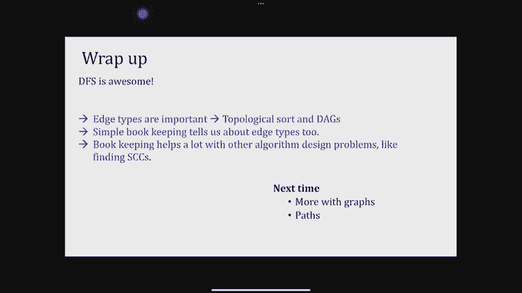

# P7：Lec7 Strongly Connected Components - 东风渐起UCAS - BV1o64y177K8

好啦，你们能听到我说，好啦，所以我们要开始了，或者你可以再坐30秒，这样我就可以得到一个指针，好啦，谢谢你，好啦，所以如果你现在加入我们，请坐，今天我们从第七讲开始，我们将更多地讨论为什么。

DFS太棒了，我是说，我们上次看到它允许我们找到无向图的连通分量，允许我们讨论所有这些不同的边缘类型，所以我们要继续，并向你们展示一些例子，有时直觉或非直觉，比你想象的还要强大，你们很多人都在问。

为什么我要跟踪所有这些前和后的号码，今天你就会明白为什么，所以我们已经发布了三个解决方案的讨论，我们通常在星期五放，但这次我们决定提前发布，因为我们认为它们对第三作业很有帮助，所以你可以用它们。

你仍然应该去讨论你，如果你没有去过，我们还有一对，但你也可以参考讨论的解决方案，另一件事是请填写家庭作业派对的反馈表，我们想知道有多有效，它们有多有效，什么在起作用，什么不起作用。

这样我们就可以改善你的体验，所以这是一个很小的URL，但你可以拍张照片，或者在已经上传的空白幻灯片上点击它，或者在ED上也找到链接，好啦，今天的公告就到这里，简单回顾一下我们上次看到的。

所以我们首先讨论了如何探索一个图表，用一支粉笔和一根绳子，我们在左手边介绍了这个函数资源管理器，我们展示的是探险家访问的不仅仅是边缘，正好是顶点的集合，可从开始导出的源访问的。

然后我们看到第一个搜索算法的dfs可以重复编写，打电话去探索尚未被探索的顶点，所以你会打电话去探索，利用可能会打更多的电话，访问一堆东西，然后你出来，如果有任何顶点，然后FS会再次对其中一个调用四个。

我们看到dfs帮助我们找到无向图的连通分量，它还告诉我们有向图的边类型，我们看到树边，包件，前边和交叉边，事实上，我们更多地讨论了它们，我们谈到了DFS是如何，算法本身的遍历本质上是为我们画一棵树。

告诉我们这些不同类型的边缘，所以我们说从u到v的边属于四种类型之一，第一个是树边，黑色的边缘，这些是explore的递归调用，在讲座快结束的时候，我告诉过你，如果你有一个树边，或者实际上是向前的边缘。

从祖先到非后代的边缘之一，然后你可以考虑这些东西的前和后之间的顺序，你开始，所以它的前数较小，然后你最终进入v，所以是预数，然后v结束，然后u结束，所以本质上，如果你有一个向前或树边。

树中较低的顶点被拥抱在一起，在树中较高的顶点的区间内，我们还看到，后边缘本质上与此相反，所以如果你有一个后边和一个后边的例子，这是一个e到b，话说回来，取决于边缘指向的位置，无论指向什么。

帖子号都会更高，然后我们看到交叉的边缘，这些是交叉边缘的类型，对不起，这里有一个滞后，怎么了？这里的交叉边，共阶段不在节点之间，既不是对方的后代也不是对方的祖先。

我们看到交叉的边缘只从较晚的分支到较早的分支，反之亦然，这就是我们上次所做的，但我想做的是继续我们在交叉边缘上停止的地方，因为我们讨论了树的顺序，向前和向后，所以让我们来弄清楚交叉边序是什么样子的。

所以对于交叉边，我能想到两个分支，我们上次说过，交叉的边缘只能从较晚的分支到较早的分支，这是我有的一个交叉边的图片，我想知道谁的帖子或pre是第一位的，所以在这个图中，我基本上是从DFS开始的。

然后我不知何故得到了V，所以v前面比其他任何东西都重要，但V也结束了，当它结束时，对你一点影响都没有，你还未被探索，它完成了，这是V对不起，我的笔迹和你还没有被探索过，所以它回来了，然后去给你。

所以在B之后甚至使用pre-start，然后你完成了，这个帖子变大了，所以这就是交叉边之间的关系，他们的职位和号码，好啦，所以这是一个例子，间隔实际上不是嵌套的，音程不相交。

让我们快速回顾一下我们看到的所有边缘，所以我们上次看到的树的前后边缘，这些基本上看起来像，你可能需要考虑的所有其他可能的方法，这些间隔是如何相互影响的，也许其中一个像他们相交，但不完全。

也可能顺序与我给你看的相反，这是不可能的，你可以在家里验证这一点，为什么不可能，但它本质上是我刚刚给出的交叉边缘的证明，我上次做的前后和三条边，对此有什么问题吗，好啦，所以这里有一些很特别的东西。

其实呢，嗯，我们将再次看到这一点，但我现在想强调一点如果我有优势，从u到v，就像我们在这里讨论的那样，看起来大多数时候你发的号码都比V晚出现，只有一个例外，除非它是一个包裹，所以从某种意义上说。

后边是特殊的，记住这一点，我们会重温这个，但由于所有其他边缘类型和所有其他内部关系都是不可能的，这已经给了你一个关键的观察，关于如何查看两个顶点的柱子号，知道那是不是后缘，那么我们今天要做什么呢？

在这节课中，我们将使用FS，而现在，我们更好地理解这些间隔相对于彼此的间隔是什么样子的，为了其他目的做一堆其他的算法，所以我们要设计的算法，应用程序本身可能不会对我们大喊大叫，告诉我们使用dfs。

但你将看到的是dfs和post号码，特别有用的或非常有用的，所以我们发现我们本质上运行dfs，去解决一堆其他的算法问题，好啦，我们将开始一个拓扑排序，那么什么是拓扑排序呢，有谁想告诉我。

你听说过图上的拓扑排序吗，完全正确，这就像你试图对一个图的顶点进行排序，这样所有的边都是从左到右，从右到左没有边，你为什么要把那样的事做好，好啦，所以这是一个形式上的拓扑排序，求图形顶点的顺序。

所以没有边按这个顺序向后，所以如果u按这个顺序出现在v之前，从V到你没有边，你为什么要找这样的东西，因为很多时候图表告诉我们，秩序可能很重要，例如，假设我想安装一堆软件包，如果我试图安装包。

我需要安装那个包所依赖的所有东西，所以我需要按照一个非常具体的顺序安装所有的软件包，如果你试着喜欢，查看在计算机上安装Linux的日志，或者你将要看到的东西，所有这些哒哒哒就像，好啦，首先像依赖图。

这将按顺序安装，然后一切都很好，因为否则，如果您试图在这个非常复杂的图形中的某个地方安装，你不知道，你可能有你需要的这些包，你安装了一个，现在一切都要崩溃了，你可能想做的另一个地方是。

如果你在拍电影马拉松，你想看与漫威英雄有关的一切，然后你不想得到剧透，所以你要按顺序观察它们，按时间顺序，这部电影的事件出现得越来越晚，甚至更多，最近，所以这些是一些例子，拓扑排序是什么样子的。

我从一个有向图开始，我把它塑造成这样所有的边缘都从左到右，当我整理的时候，然后向我揭示了某些结构，特别是有特殊的节点，其中一些节点被称为源，其他的叫做同步，源是最早的节点，在某种意义上，在这个顺序中。

它们没有进入的边缘，您可以随时安装该包，没有依赖性，本质上，所以这是一个源，因为它不需要任何东西，我们也有水槽，是没有传出边的节点，所以它们本质上是树上的叶子，如果你想安装它们。

你需要确保你已经在他们之前安装了所有的东西，但其他事情都不需要它们，这里的事情是，这种拓扑排序不一定是唯一的，例如，我本可以把这些东西重新排序，就像我可以想出五个，六个，然后三个。

它仍然会推动所有的边缘，对不起，五不是一件事，嗯，这是个水槽，这是一个水槽，所以我本可以，是啊，是啊，所以你的图表可能有所有这些像时髦，其他类似的事情根本没有联系，所以从技术上讲，你可以把它看作是。

这些这些不那么重要，所以这是一个拓扑排序，现在我们实际上如何进行拓扑排序，我们总是能做到这一点吗，我应该期望总是能够对图形进行排序吗，以一种没有向后边缘的方式，你想自愿举一个不可能的例子吗，有一个循环。

如果有一个循环，对呀，所以如果我有一个循环，不知何故，那我就不能这么做了，这正是我们将要看到的，所以我们要定义一个叫做dag有向无环图的东西，这些是没有有向循环的图，我们刚刚听到的是，如果你有一个循环。

所以，如果你不是一个DAG，那么排序似乎是不可能的，其实呢，我们将要展示的是，你可以对一个图进行排序，当且仅当它是一个DAG，那是什么意思，这意味着您可以对一个图进行拓扑排序，当且仅当不存在有向循环。

关于这个声明有什么问题吗，这个说法我们马上就会看到证据，好啦，所以事实上，我要证明这一点的方法是提出一点主张，更间接地关于循环和更多地关于后边，所以我要说g是一个有向无环图，当且仅当我运行FS时。

我找不到后边，让我们看看为什么这是真的，嗯，这是当且仅当我有两个方向，第一个方向是说如果哎呀，第二个方向是反的，所以如果G不是一个DAG，让我先证明第一个，嗯，声称这是更容易的一个。

所以这意味着如果我有一个包裹，我可以创造一个循环，本质上，那么为什么情况会这样想象我有一个包裹，这个后边是什么样子的，就像我从你开始一样，我不知何故得到了V，然后V送一个包裹给你，因为它寄了一个包裹。

因为你两个V是dfs穿过的东西，所以有一条路，我刚刚找到了，有向循环，好啦，所以这是用图片来证明的，我们可以从包创建一个循环，所以包裹总是被送到被访问的东西，这就是为什么他们为你创造循环，很酷的是。

如果你有下一个，如果你有一个循环，如果你不是DAC，则g有一个有向循环，你也有包裹，所以这个稍微微妙一点，但还是很容易想象，所以让我从一个循环开始，好啦，假设我有一个定向循环。

那么这个循环是什么样子的呢，好像是这样的，因为dfs访问了图中的每个顶点，最终，FS将访问该图的一个顶点，假设FS进入这里，我要把这个叫做V一，那么V1是什么，V一是第一个，然后FS将继续，你知道的。

所以这是FS，然后FS会做一些事情，不一定有序，但在某个时候，它会击中维克，假设我开始给这两个V2命名，V3在它开始撞击VK之前，因为它必须向右，K可以从V到达，现在我能展示的是。

它实际上是在一棵树上被访问的，所以v，K到V 1是一个包，这就是证据，好啦，所以我又开始了一个循环，我不想以一种非常具体的方式来安排这个循环，在知道dfs做了什么之前，但我刚才说，让我们调用第一个顶点。

那个，在树上最高的那个，在循环中，V一，那是dfs首先接触的，然后在某个时候，当我到了V k，我有个包裹，V K到OK，关于这个证明有什么问题吗，或索赔，是呀，不，实际上v one是v的祖先。

这个dfs树中的k，因为我画错了吗，现在呢，没关系的，所以你从DFS开始看这里，从这里开始，因为FS正在探索V One，从v1到vk有一条路径，V k是树中V one的后代，这个后边。

从后代到更高祖先的优势，好的，其他问题，所以这是一个拓扑排序，我只是说，本质上，你可以做一个拓扑排序，而且只有在没有后边的情况下，回想一下我几分钟前告诉过你，背面的边缘真的很特别，事实上。

当你看他们的邮编，它们看起来与你能想象的任何其他边缘的任何其他邮政号码都截然不同，树边，前进，交叉边缘，所以后边是唯一，如果你有u到v的边，V的帖子实际上比你们大多数人都大，现在呢。

这应该能告诉我们一些事情，尤其是，意思是如果我没有包裹，然后每当我有爸爸，这个dag u到v的每条边都有这个性质，所以v的位置比你们大多数人都小，对吧，这正是用表格证明的证明。

因为没有其他的边类型可能每次我从u到v，我所做的是，我有这个职位V是我的签证使用，看起来很像，你们大多数人，那么你认为这实际上表明了什么，如果我想做一个拓扑排序，我可以看看门牌号码然后决定谁先来吗？

谁应该是最后一名，想想三十秒，你可以和旁边的人说话，如果你用邮政编码，你会怎么用它，好啦，三十秒，好啦，再过五秒，好啦，我们回来吧，有人能给我一个如何使用邮政编码的建议吗？后面没人，好啦。

所以删除帖子使用的所有后边，按Pre OK排序的边缘，所以这是一个有趣的思考方式，所以你说，首先删除所有包，但是没有包裹，因为我已经有一个DAG了，所以你的建议是用你的，好啦，所以这可能是一个建议。

我会回来的，但让我们看看是否还有其他建议，您将按哪个顺序对增加或减少的邮件编号进行排序，你不知道，但那很好，所以你想根据邮政编码进行排序，最后一个问题是，我应该排序增加还是减少，好的很好。

所以我们首先想到的是，你不想想太多的原因，当你看着牧师，你实际上没有一个一致的画面谁先，但你确实有一个一致的画面谁是最后一名，当你看帖子的时候，这就是为什么在算法设计中。

post-number实际上比pre-number使用得更多，但你的意思是让我把建议的算法写出来，首先在g上运行dfs，然后在递减的v中枚举所有的v，所以这是一个好算法的原因，第一个注意是没有后边。

所以根据上一张幻灯片中的证据，这就是我们想要创建的边缘类型，从左到右，所以当这种情况发生时，U的柱子比V的柱子大，所以如果我想基本上总是从左到右，我应该把东西从大点到小点，所以本质上。

如果这是我的拓扑排序，边缘总是这样，第一个的家伙是最大的帖子，所以这就是为什么你实际上把邮政编码，你按递减顺序开始列出，所以想想邮政编码，只要没有后边，无论何时，只要你能真正排序，树中更高的东西的数量。

大于树中较低的东西的post数，所以你才知道，拓扑排序本质上是试图绘制树，也许森林，也没有包裹，所以因为没有包裹，本质上，你只是扔掉这些树并订购它们，嗯是的，所以让我看看我是否能在飞行中想出一个例子。

为什么不使用预购，所以这个图的预序，尤其是如果我按字母顺序排列，什么是FS，dfs以，然后去b b什么都不做，所以b就结束了，然后回来一个，然后去C开始C C哪儿也去不了，完成然后，哎呦，然后回到，嗯。

如果我，但是注意c有一个包，所以预购不起作用的原因是因为交叉边缘，但也，就像我说的，如果你回头看那棵树，在那张桌子上，当涉及到其他问题时，你没有一个一致的顺序，在职位的递增顺序中，让我们看看这里。

如果我真的把它贴出来了，在职位的递增顺序中，然后我得到的是，这是不是一个很好的例子，让我们取两个两个两个节点，我有A，我有B，现在邮件的增加顺序是什么，我去开一个，然后我去B，B变成两个。

然后两个b结束，所以三个，然后一个结束，所以说，增加职位的顺序，会把b放在第一位，然后是a，并再次注意到，从A到B有一个后边，好啦，对不起，我输了，是啊，是啊，所以贴号码，就像我说的。

当我们看这里的时候，你要去V，U的柱子比V的柱子大，这正是我们想要在拓扑排序中列出事物的顺序，总是从左到右，这就是为什么我们从较大的岗位到较小的岗位，好啦，所以这是一个非常简单的算法，拓扑排序。

我们看到你们DFS的帖子号码真的很有用，接下来我们要看到的是，所以我想在我们真正开始之前，你应该休息一下，所以去休息三分钟，当你回来的时候，我们将有一个更难回答的问题，求求你了，如果你能关上礼堂的门。

我将不胜感激，现在是1点11分，我们一点半再来，关于这次尝试，好啦，所以我们要开始，好啦，接下来我们要讲的是连接组件，你知道，谈论直接连接的组件是如此容易，对于间接图，我是说基本上有一些顶点。

你可以打他们中的一个，使用资源管理器，把他们都找回来，然后DFS会为你找到另一个斑点，当我们开始讨论有向图时，甚至什么是连接组件的定义也开始变得更加毛茸茸的，呃，所以首先我们想知道我们应该如何定义它们。

一旦我们定义了它们，我们该怎么找到他们，好啦，所以让我们从连通组件的定义开始，我们实际上称这些东西为强连接组件，为了强调它们是有向图，那么什么是强连通分量，我要说有向图中的两个顶点是强连通的。

从其中一个到另一个有一条路，从另一个到第一个有一条路，所以从两个顶点到两个方向有一条路径，这就是连通图如果你能从u到v，你可以从v到你，所以任何，对此有什么问题吗，他们能共享边缘吗。

如果它们有共同的边缘也没关系，但这条边必须是一个非定向的边，从某种意义上说，所以可能是这样的，这家伙不是导演，这家伙还能这样走，所以这就是两个顶点强连接的意思，如此强连接的组件，我们对他们的看法。

是点状的点就像点状的点，其中每个簇只有彼此强连接的顶点，我会说，就像一个图是强连接的，或者图的一个分量是强连通的，如果它的所有顶点都是强连接的，所以这是一个强连通图，这不是一个强连通图，为什么这与。

因为我可以从任何事情到任何事情有两种方式，为什么这个没有强连接，因为没有从v到u的路径，这就是如何定义强连通图，就像，如果我说一个组件是强连通的，本质上是这样的，所以现在我们可以考虑用图表。

把它们分解成这些紧密相连的部分，“嗯，那看起来像什么？”，让我用图片证明给你看，图片证明，上面说这些是，对不起，不是通过图片来证明定义的，这些是这个图的连通分量，A本身只在一个组件中。

因为这里面没有任何东西，所以它必须自己，同样，d也没有任何东西离开它，所以它不可能与任何其他顶点，但是b和e是紧密相连的，当我回首往事，不管发生什么事，所以它是自己连接的组件，所以把图分解为连通分量。

本质上是你试图恢复的，现在我如何更正式地定义这些，这个分解井，需要注意的一点是，两个顶点之间的关系是强连接的，称为等价关系，等价关系需要满足三个属性，反身性意味着某物与自身有很强的联系，这是真的。

我们一直在想，你知道的，基本上每个节点在我们的头脑中都有一个自我循环，它与自身相连，它可以自食其果，在a与b强连接的意义上，它是对称的，B也与A强连接，这是千真万确的，因为我们说过。

如果在两个方向上都有一条路径，它们就会紧密相连，它是传递性的，它是传递的，因为它意味着如果a变成b，b到c，本质上有一条从A到C的路径，这条路也相反，所以强关联是一种等价关系，因为它满足了这三件事。

当你在一个集合中有等价关系时，您可以基于等价类对该集合进行分区，好啦，所以组件，这些强连接的组件实际上是，这是正式的定义，如果你想看非正式的定义是通过图片定义，每当我可以划分这两个东西时。

每个集合都是强连接的，我觉得在这里观察一些非常可爱的东西很酷，一旦我有一个直接连接的组件，边缘本身的作用，呃，开始变得不那么重要了，因为我可以反转这个图中的所有边，所有这些。

实际上是强连接的组件都不会改变，现在你可能想知道我为什么要这么做，碰巧的是，有时图表的反面向你揭示了更多的信息，以一种可以用于算法设计的方式，记住这一点，因为我们将在今天晚些时候看到一个关键的观察结果。

图表被颠倒了，这就是连通分量的定义，现在我可以通过思考连接的组件来思考，即使是更高的一层作为这些元图，所以这就是我如何将我的图分解成连接的组件，这个分解我可以写在右手边，通过这些集群或这些组件。

所以每一个虚线顶点本身都是一个连通的分量，强连接元件一号，二号强连接组件，三个，四五和我放在这里的东西，这些都是相互等价的东西，从某种意义上说，他们可以，从每一个都能到达另一个，那一套中的一个。

所以这个方法图是一个非常好的图片，因为再一次，就像我说的，一旦你知道一旦你有了这些连接的组件，边缘开始重要，少一点这样，通过查看元图，本质上，我在看连接组件之间的关系。

然后每个连接组件内部的关系是等价关系，反正，任何关于它意味着什么的问题，谈论方法图或构造它，H和J好，所以g，H和J肯定是紧密相连的，但我不认为它是一个组成部分，因为组件必须是一个分区。

所以这是一个等价类，这是一个很好的问题，所以这里的观察是，这三件事肯定是相互联系的组件，为什么我不把他们和我分开，K和L，我不分开的原因是这里的任何东西，假设h可以到达i，i也可以到达h。

所以i和h也是强连接的，i和k也有很强的联系，L和J是强连通的，所以在某种意义上，所有这些，所以当我在最后一张幻灯片中谈到，等价类，那是等价类，如果两件事情不在同一类中，这真的很重要。

那么它们就不应该是等价的，我们把G，H，I，L，因为它们都是等价的，如果我把他们分开，那么我不尊重等价关系，我不想叫它最大，它是最小的数字，是真的，而且是唯一的，但更多的是。

定义实际上回到了等价类的含义，好啦，等价类必须捕获所有相等的关系，这就是为什么组件将是尽可能大的组件，问得好，其他问题，他们在这里技术上是分开的，本质上我们假设反身性，因为任何事物都可以从自身到达。

但是就等价性而言，定义，平等，平等，这三件事是分不开的，其实我们没有很多时间讨论，但我希望你们，也许只要想三十秒，然后我们会回答这个问题，如果我看元图，这两个陈述中哪一个是真的，元图必须是DAG。

所以它不可能有一个循环，或者元图可以有一个有向循环，其中只有一个是真的，当然啦，哪一个，让我们，让我们花十五秒想想这个，然后我们会回答，好啦，所以让我们一起回答这个问题，三二一哪个是真的，这是一个达格。

好啦，嗯很好，那么为什么这是一个DAG，我会解释给你听，因为我们时间不多，是爸爸，因为如果我真的在一堆组件之间有一个直接的循环，这些组件会紧密地联系在一起，因为我现在可以从他们中的每一个向两个方向走。

一旦我能做到，我应该把他们放在一个等价类，所以元图不应该有任何循环，这也与你问的问题有关，所以这很棒，因为现在我们似乎又回到了拓扑排序，元图中似乎没有循环，即使在较小的地方也有循环。

那么现在我们为什么要关心这些强连接的组件，如果我们想找到他们，它们在工程和科学的许多应用中都很有用，它们通常是人们在同一个阶级的标志，因为彼此关系非常密切，所以这就像经济学中的广告一样。

但它实际上也使用了证据检查模型，检查正式方法，像这样的事情，它被用作许多预处理的前步骤，一步到很多其他算法，这就是为什么我们将要讨论的算法非常重要，你想如何简单地找到连接的组件。

你可以尝试两种非常天真的方法，他们两个我们都不会关注太多，因为他们太慢了，但是让我们来看看您可能想要做的一些方法，第一个缓慢的尝试是考虑，将一个图划分为一组，这是非常缓慢的。

因为你要考虑所有顶点的所有子集，所以你真的不想这么做，第二个稍微不那么天真，可能是类似于每两个节点，我想弄清楚，如果这家伙在这家伙的探索者里，这家伙在那个家伙的探险家里。

因为探险家要告诉我谁可以从家里联系到，如果你这样做，至少你要支付n的平方，因为你要弄清楚任意两个节点之间的关系，所以这两个算法都是我们不想做的，因为那是，事实证明，有一个算法只在n加m的情况下运行。

这与dfs是相同的运行时，所以它告诉我们，本质上这和，运行一轮dfs，也许十轮DFS，所有一轮的DFS，事实上，我们将要看到的是，您只需要运行dfs两次，但是你需要运行两次fs。

以一种非常聪明的方式得到这个，我已经告诉过你这个算法有点违背直觉，所以我的目标是给你们一点直觉，然后介绍算法，然后我们将运行它，看看为什么这是有意义的，好啦，那么如何找到强连接的组件，假设我要做FS。

我们说过给DFS就够了，所以说，但是我应该从哪里开始DFS，我们说过现在是按字母顺序开始的，如果我按字母顺序开始会发生什么，这意味着我在这里开始DFS，这是从，我探索的是什么，原来我探索了很多东西。

所以我看到了这个，我看到B，我看到C，我看到F，我看到了，我一路回溯，回到c和b，然后我看到E回溯是I D，然后我就这么做了，如果我从一个，我探索了整个图表，好啦。

这并没有真正告诉我关于这些连接的组件的任何事情，但如果我从另一个嗯节点开始呢，假设我从G开始在DFS，那么当我导出g时访问的所有节点是什么，我先说hcg然后说h，然后我开始回溯，JK L I H。

我从不退出这个连接的组件，因为当我看着这个连接的组件，这个连接的部件外面没有边缘，所以如果我从这个连接组件的任何地方开始，我只会恢复连接的组件，仅此而已，所以现在看起来我从哪里开始我的DFS很重要。

如果我开始，让我们再练习一次，如果我从D do开始呢，我访问任何其他顶点不，这个连接的组件没有边缘，所以这里发生的是a和d或g之间的区别，A是一个来源，它有它的连接组件，嗯。

它是金属图中的一个源会有向外的边缘，所以它会探索更多的东西，但是d和g在金属图中是下沉的，他们不探索任何东西，所以我们开始选择他们自己以外的任何东西，强连接数据，设置强连接组件。

所以我们在这里真正要说的是，在提取连接的组件方面，dfs实际上是有效的，如果我知道从哪里开始，如果我真的知道金属图的结构，好啦，因此，有一个概念，正确的地方开始DFS，关于这张直观的图片有什么问题吗。

好啦，所以让我们把这个直观的图片形式化，我已经说过了，我谈到了源头和罪恶，开始DFS的正确地点，金属图形的水槽，事实上，在水槽的任何地方，元图的汇是一个完整的强连通分量，你可以在任何地方启动它。

就像我不需要在G中启动它一样，我可以从K或者L开始，重要的是无论我从哪里开始，那个连接的组件不应该有任何向外的边缘，那么为什么这是好的，因为如果我从g开始，我最终会的，因为我可以探索和探索。

找到从G可以到达的一切，在这个等价中的一切都可以从g，我看到了这一切，但是这个连接的组件没有边缘出来，所以我停在那一点上，现在我可以提取那个成分，把它扔到什么地方，存放起来妥善保管。

在这里继续这个新图形的接收器，所以看起来本质上，我想说的是做一个拓扑排序，在元图上，然后把自己倒过来，好啦，所以这将告诉我们一个算法，但实际上在我向你们展示算法之前。

算法真正起作用的原因是因为元图的结构是一个DAG，尊重拓扑排序，本质上告诉我们每次我有一个优势从一个组件到另一个组件，然后我可以谈谈这些组件上顶点的后号，你还记得我告诉你之前，如果你有一个U和一个V。

这个边的意思是u的位置比b的位置高，这就是我们之前吃的，我现在对组件说的是完全相同的事情，但我想说的是，定义了某件事的帖子，作为连接组件的最高柱子，作为最高职位，连接组件。

所以我是说如果我有一个连接的组件，具有连接组件的边的C，C素数，那么我能在C中找到的最高职位比最高职位高，或者C素数中的所有帖子，对这份声明有什么问题吗，我证明给你看，关于本索赔陈述的问题。

我们真的是说这里最高的职位比所有这些都大，因为我是说，这就是另一个最高职位的定义，嗯，我们对C中的所有其他帖子都不多说，因为你很可能知道我是从C开始的，我访问C Prime，然后我还有一些东西在这里。

或者我完成了这个和另一个，好啦，是呀，我们不是想做第二个，所以我们说金属图，元图中的每个顶点表示强连通分量，就像这个可以有一个B，C在里面，这里面可能有E，这两者都不是，但它将用于后者。

所以这是一个关于元图顶点之间关系的陈述的证明，呃，记住那个标记，我们已经观察到megraph是一个dag，所以这和那个有很大关系，说在任何DAG类型的帖子中，数字都有一个非常具体的，你还记得吗。

这是我们在任何DAG都说过的，邮政号码有一个非常具体的顺序，这就是那句话的证据，一旦我们有了这个，它将帮助我们以尊重DAG的方式找到这些组件之间的顺序，好呀，我还没有对此提出要求，所以现在。

我只是说F可以从任何地方从任何顺序开始，好吧可能是按字母顺序，好啦，所以让我们看看，那是我们将要参观的一个箱子，所以现在我们开始谈论证据而不是陈述，让我看看你在说什么，让我从案例一开始。

这两个案子实际上是关于，dfs从何而来，好啦，嗯，第一种情况是说假设，所以如果我有c，然后我有c一撇，假设dfs从一个节点开始，所以这就是DFS开始的地方，好啦，所以u和c是第一个，然后发生的事情是。

你dfs会花一些时间在组件c上，在某一点上交叉到分量c一撇右，我们只是在做那个，因为在某个时候它会探索这个家伙，这家伙很外向，所以我将开始探索关于c素数的一些东西，现在请注意，当我在c素数中探索事物时。

我的U还没说完，我的电话是从你开始的，你还在探索C中的一切，然后它在c素数中探索一些东西，所以当我回来给你贴邮票的时候，它，C素数已经完成了，所以这意味着你们中的大多数人首先大于W的POST。

对于所有W和C，尤其是对这个家伙来说，和的职位，对于所有v和c素数，c中的u u大于最高的职位，v和c素数，好啦，这是我从c开始的第一个条件，我把c素数看作是你的孩子或后代。

这就是为什么他们的帖子数量会减少，是呀，这很好，因为如果你访问c素数，最重要的是，在你回到c之前，你完成了c素数，你不能这么做因为如果你继续这么做，在c和c素数之间有两种边的方式，所以你说的很好。

我的邮政号码还是会更大，所以如果我从c素数开始我的dfs，注意，我永远不能喜欢，我打了一个电话给C Prime，C仍然没有被访问对吧，我会完成所有的c素数，但是从c素数回到c仍然没有优势。

所以在c中的任何东西的pre开始之前，都需要完成c素数的POST，C中的任何u都停止了，所以这又说明既然c素数已经完成了，它的柱子要小一点，然后会有一个不同的dfs，调用C中某个顶点的探索。

所以这表明c素数的位置，实际上对于所有u和c素数，我想我一直把它叫做V和C素数，比你的帖子还小，为了你所看到的，所以这回答了第二种情况，回答你的问题，这是索赔，索赔的证据。

这和我们以前做的基本上是一样的证明，为了达格斯，只是认识到，事实上，有一堆更多的顶点，我们应该考虑的每一个巨大的金属顶点，好啦，所以这告诉我，组件的邮政编码之间有关系，它们在拓扑源中的时间是早还是晚。

拓扑排序，其实呢，它真正告诉我的是，如果我在图G上运行dfs，从任何顺序开始，我按字母顺序做，反正我们一直在做字母dfs，那么你要得到的最高职位号码，保证实际上在源中，为什么它保证在一个来源中。

因为本质上，这么说吧，你和C的最高职位，所以如果最高的数字不在这里，那么它可能在某个c素数的其他地方，在c素数中，那么c素数就会有一条进入的边，其实让我更正式一点，我刚说了些技术上很粗略的话。

我知道你是这样知道的，你必须发现自己说了一些不完全正确的话，好啦，我在说什么，我是说，想象一下，但是C不是来源，因为它不是，存在一个c双素数，使得它有一个可以看到的边，然后由最后一张幻灯片最高的柱子。

双素数应该大于c的最高位置，这就是为什么，好啦，现在我说了一些完全正确的话，所以这里的主张是，如果我用任何顺序运行dfs，最高的帖子数量在一个一切都好的来源，但是说实话，我想要消息来源吗。

我是否要求从源代码运行DFS，还是我想从同步运行DFS，我想让它沉下去，我现在该怎么办，我有办法找到神话中的源头，我该怎么办，翻转边缘，如果我翻转图的边，连接组件不改变的方法，我们观察到，唯一改变的是。

谁是同步的，谁就成为源，不管是谁，什么来源变成了东西，元图顶点上的边也会改变，但是源和同步确实翻转了，这正是你要做的，反转g的所有边，在我们运行dfs之前，好啦，这是我们在课程开始时看到的说法。

我不会再证明了，但我想说的是，如果我有G，假设g是这样的，像b到d然后像这样，然后这个元图看起来像这样，a，b，c，然后是d，这是源图，这是同步，当我翻转所有的边缘，神话看起来一模一样。

但有了翻转的边缘，所以连接的组件不会改变同步和源的变化，这给了我们一个完美的借口，在图的反面运行dfs，我现在要打电话给这个GR，如果我这样做，基本上是我们目前所看到的必然结果。

上面说如果你在图的反面运行dfs，那么最高的帖子号就保证在一个罪恶中，强连通分量，在别的地方吃一口，我们只是翻转了所有的边缘，所以花点时间，关于这些说法有什么问题吗，你也许只是想理解。

或者为什么它能成立，让我们从那里开始，我们是，其实呢，寻找后缘，最重要的是你可以在组件内部有后边对吧，所以我们想讨论金属图上的包，还是对不起，金属图形上缺乏后边，这就是为什么我们说的是最高的职位数。

因为一旦我有了，我可以提取一个，然后去另一个，所以本质上，我真的试图找到金属图的顺序，一旦我有了元图的顺序，我想叫dfs倒着走，这种排序基本上来自于首先在反向图上运行dfs，然后根据，这里有个问题。

实际上走在最后一个前面，为什么不进行拓扑排序，然后挑最后一个，也许你可以回答你自己的问题，如果我那样做会怎么样，你可以找到像一个，所以问题是我们能保证水槽真的没问题吗，我来回答这个问题。

我的图并不是说原始图不能保证是DAG，如果我试着做拓扑排序，我会失败的，也不清楚我最终会得到什么，因为元图是一副牌，所以我的意思是现在把图形放在黑板上，假设那里，Dfs，是啊，是啊，最后一个音符，哎呦。

没关系的，如果有一个没有任何联系的E，它将是一个帖子，它本身就是一个连接的组件，所以我要把它取出来，你问的主要问题是一旦我把东西拿出来，我可以继续这个帖子号码吗，这正是你说的你应该。

你就会发现最后一个问题，是啊，是啊，FS保证到达图的每个顶点，所以我们不假设我们上次证明了这一点，所以探索保证我们展示了探索，到达一切，如果我探索你，我得到了你能得到的一切。

DFS反复探索未被探索的事情，我们仍然采取最大限度的原因，因为最大值是有这个属性的，柱子的最大值在组件中更大，我不想拿最低限度的原因，是因为我不能保证，当最小的完成时，唯一的问题是最大限度地帮助我。

抽象出组件中的所有顶点，然后我把事情颠倒过来，因为它没有改变组件的结构，好的很好，所以让我们看看这意味着什么，这实际上提出了一种寻找强连通分量的算法，算法如下，我先把这个图反转一下，好啦。

然后使用任何顺序运行我的dfs，我想要，让我们按字母顺序，因为这是我们在反向图上使用的，将其帖子号保存到数组中，我要把它叫做帖子，破折号R只是说这是一个，这是相反的图表，员额编号，好啦。

然后我再运行一次dfs，在实图上，不是相反的图，在原图上，这次不是按字母顺序，我会按照减少的职位数量去做，根据一篇帖子R，这些本质上是后一种东西及其组成部分，每次DFS发现一个新的，喜欢就得叫，探索。

那是一个新组件，因为当它调用资源管理器时，它找到一个组件，探索自己，将执行递归调用并找到整个组件，然后我提取出这就是算法的样子，所以我不再叫它DFS了，但它看起来很像dfs，我有它访问数组，那都是假的。

我在GR上打电话给FS，我假设它给了我前和后的号码，所以这些是前置和后置的号码，我只在乎那些帖子，我有一个计数器，我有一个连接组件数量的计数器，我对每一个v都是这样，对不起，这个，这不是显示，好啦。

让我为每一个v进入从最高到最低的这个帖子是，我会打电话给探索，如果它还没有被探索过，然后做什么或探索整个组件，我们当然有保证，并将计数器设置为正确的计数器，所以我知道这就是正在发生的事情。

让我们看看这个算法是什么样子的，所以算法的第一步是把图反转，那很容易，我只是把所有的边缘反转，组件没有改变，正如你所看到的，所有的边缘都翻转了，我把红色的边缘显示为翻转的边缘。

所以我们记得黑色的边缘是原来的，关于第一步有什么问题吗，第二步是什么，第二步是在这个gr上运行dfs，还记得我们运行dfs的时候吗，我们有一个没有有色人种，从没见过有色人种，因为我还在探索，我还没做完。

不存在和忧郁是，我已经完成了探索，那么这看起来像什么，我将按字母顺序使用dfs，我说什么都可以，所以我从一个，我把它的预编号加盖为1，现在我们要做dfs，我们上次也是这么做的，所以我们要快一点，从一个。

我去看看，我没有任何向外的边缘对吧，所以A最终会自己完成，它变成了一个印有两个的帖子，所以现在dfs再次按字母顺序调用，b b有一个向外的边，E所以我探索E现在E没有任何其他外向的东西，所以E完成了。

我在上面盖了个时间戳，我回到B B也结束了，因为没有其他未被探索的外向邻居好，所以现在就这样做了，dfs调用下一个未访问节点，C我从C开始C我在7点盖章，然后我从c到f，我八点跺脚，这些是前数字八。

我看f对e是否有边，但E已经被探索过了，所以我什么都不做，然后我就完成了F，我在上面盖上邮编，我回到C，我在上面盖上邮编，下一个未访问的是D，我继续，D确实有一个向外的边缘，但是b，但这已经探索过了。

所以在b和d没有什么可做的，所以我在上面盖上了完成时间，下一个未探索的顶点是g，所以我从g开始，然后g对j对k对l对i，我探索F，但那已经被访问过了，我研究了h和h也同时研究了g和e，但他们都被拜访了。

所以它现在什么都不做，该贴邮票了，正在做的一切，所以说，H现在完成了，我现在盖章，我回溯，我受够了，我给它盖章，我就完了，K就完成了，J完成，G完成，这张图表上的dfs有点迂腐。

写这些幻灯片花了很长时间，好啦，我做得好的是什么，让我们来看看，这是算法的第二步，但是让我们看看同步节点在哪里，我回到原来的图表，所以我要回到黑色的边缘而不是红色的边缘，我看着最高的职位号码在哪里。

最高职位数为G，我保证这是在我的元图的水槽里，对于g，所以现在如果我从g开始运行explore，我会把整个部件找回来的，我得到保证，从G那里得到的任何东西都将通过EXPO恢复。

但是因为这个组件根本没有任何东西出来，我在那一点上停下来，我增加我的计数器，事实上，我刚刚恢复了一个组件，我把那个组件命名为强连接组件1号，我继续前进，我继续前进，第二高的在哪里，它碰巧在d。

我只想说这里有很多东西，所以d是一个水槽，CF一起也是剩余图中的汇，从哪里开始并不重要，但我的邮编告诉我从D开始，我从没有出边的d开始，所以它马上就结束了，然后我把它叫做强连通分量2。

我的dfs转到下一个帖子号码，最高的职位数变成十个，现在是c，我将从C开始访问，我会去参观整件事来结束它，那就成了我的第三个强连接组件，一次又一次，一次又一次，所以我完全恢复了我的强连接组件。

所以这实际上说明了通过属性，我向你证明了，有什么性质，我向你证明了如果你有优势，从元图中的一个节点到另一个节点，邮政编号为订单，你保证总是打水槽，剩下的图，因此算法是正确的，我们只运行了两个dfs。

所以运行时关闭了，M加N，好啦，原来如此，我们还有两分钟，所以让我来做总结，然后允许你问问题，所以我们今天看到的是FS的两个应用，拓扑排序和强连接组件和强连接组件实际上与拓扑排序有关。

我们看到你一直问我的邮编记录，我为什么要在乎实际上真的很重要，所以你才要关心，下次我们将有更多的乐趣与图表，但希望你们今天学到的是dfs非常棒，你会读到更多关于它的东西，并从中获得更多的乐趣，好的。

好的，我会在这里回答问题，我们星期二见。

