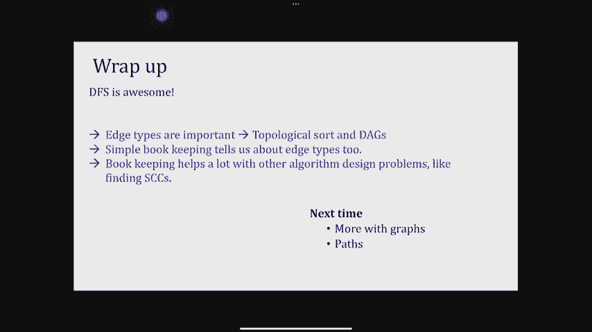

# 课程 P7：Lec7 强连通分量 🔗


在本节课中，我们将学习深度优先搜索（DFS）的两个重要应用：**拓扑排序**和**寻找强连通分量**。我们将看到，DFS 产生的“后序编号”是解决这些问题的关键。

---

## 回顾：DFS 与边类型

上一节我们介绍了 DFS 算法及其在遍历过程中定义的四种边类型。本节中，我们将利用这些知识来解决新的问题。

首先，快速回顾 DFS 发现的边类型及其与顶点“前序编号”（pre）和“后序编号”（post）的关系：
*   **树边**：DFS 递归调用产生的边。
*   **前向边**：从祖先指向非直系后代的边。
*   **后向边**：从后代指向祖先的边。
*   **交叉边**：连接两个既非祖先也非后代关系的顶点的边。

一个关键观察是：对于图中的一条边 `u -> v`，在大多数情况下 `v` 的后序编号小于 `u` 的后序编号。唯一的例外是**后向边**。这个观察将在后续算法中起到核心作用。

---

## 拓扑排序 📊

拓扑排序是针对**有向无环图**的任务。其目标是为图的顶点找到一个线性顺序，使得对于任意一条边 `u -> v`，在排序中 `u` 都出现在 `v` 之前。

### 为什么需要拓扑排序？
以下是拓扑排序的一些应用场景：
*   **软件包安装**：安装一个软件包前，必须先安装其所有依赖项。
*   **课程安排**：学习高级课程前，需要先完成先修课程。
*   **任务调度**：某些任务必须在其他任务开始之前完成。

### DAG 与后向边
一个重要结论是：**一个图可以进行拓扑排序，当且仅当它是一个有向无环图**。而有向环的存在与 DFS 中的后向边密切相关。

**定理**：一个有向图 `G` 是有向无环图，当且仅当在 `G` 上运行 DFS 时**不会发现任何后向边**。
*   如果发现后向边 `u -> v`，则从 `v` 到 `u` 的树路径加上这条后向边就构成了一个有向环。
*   如果图中存在有向环，则 DFS 必然会访问到该环，并发现一条后向边。

### 拓扑排序算法
由于在 DAG 中不存在后向边，因此对于 DAG 中的任何边 `u -> v`，都有 `post(u) > post(v)`。这意味着**后序编号较大的顶点在拓扑顺序中应该更靠前**。

基于此，算法非常简单：
1.  在输入图 `G` 上运行 DFS。
2.  按照顶点**后序编号递减**的顺序输出顶点。

**代码描述**：
```python
def topological_sort(graph):
    visited = [False] * n
    post_order = []

    def dfs(v):
        visited[v] = True
        for neighbor in graph[v]:
            if not visited[neighbor]:
                dfs(neighbor)
        post_order.append(v) # 在递归返回后记录后序

    for v in range(n):
        if not visited[v]:
            dfs(v)

    # 后序列表是“完成时间”递增的顺序，反转后即为拓扑序
    return post_order[::-1]
```

---

## 强连通分量 🤝

对于无向图，连通分量很容易通过 DFS 找到。但对于有向图，连通性的定义需要加强。

### 定义
*   **强连通**：有向图中的两个顶点 `u` 和 `v` 是强连通的，如果存在从 `u` 到 `v` 的路径，**并且**存在从 `v` 到 `u` 的路径。
*   **强连通分量**：一个极大的顶点子集，其中任意两个顶点都强连通。强连通关系是一种等价关系，因此强连通分量构成了图顶点的一个划分。

将每个强连通分量收缩为一个“元顶点”，得到的图称为**分量图**或**缩图**。一个重要性质是：**分量图必定是一个有向无环图**。因为如果分量图中有环，那么环上的所有分量实际上可以合并为一个更大的强连通分量。

### 算法直觉
如果我们知道分量图的结构，那么寻找强连通分量会变得简单：在分量图的**汇点**（没有出边的分量）中启动 DFS，只能访问到该分量内部的顶点。完成后，移除该分量，下一个汇点又会暴露出来。

问题在于，我们最初并不知道分量图的结构。关键的突破口是：**如果将原图 `G` 的所有边反向得到图 `G^R`，其强连通分量保持不变，但分量图中的源点和汇点发生了互换**。

### Kosaraju 算法
基于以上观察，我们可以设计以下算法：
1.  在图 `G^R`（原图的反图）上运行 DFS，记录每个顶点的后序编号。
2.  在原图 `G` 上，按照**第一步得到的后序编号递减的顺序**，再次运行 DFS。
3.  第二次 DFS 中，每次从主循环调用 `explore` 函数所访问到的所有顶点，就构成一个强连通分量。

**算法正确性核心**：在 `G^R` 上后序编号最大的顶点，位于原图 `G` 的分量图的某个**汇点**中。从这个顶点开始在 `G` 上探索，恰好能完整找出其所在的强连通分量。

**代码描述**：
```python
def kosaraju_scc(graph):
    n = len(graph)
    visited = [False] * n
    post_order = []

    # 第一步：在反图上计算后序编号
    reversed_graph = build_reverse_graph(graph)

    def dfs1(v):
        visited[v] = True
        for neighbor in reversed_graph[v]:
            if not visited[neighbor]:
                dfs1(neighbor)
        post_order.append(v)

    for v in range(n):
        if not visited[v]:
            dfs1(v)

    # 第二步：在原图上按后序逆序进行DFS
    visited = [False] * n
    sccs = []

    def dfs2(v, component):
        visited[v] = True
        component.append(v)
        for neighbor in graph[v]:
            if not visited[neighbor]:
                dfs2(neighbor, component)

    # 按第一步后序的逆序（即编号从大到小）访问
    for v in reversed(post_order):
        if not visited[v]:
            current_scc = []
            dfs2(v, current_scc)
            sccs.append(current_scc)

    return sccs
```
该算法的时间复杂度为 `O(|V| + |E|)`，因为它只进行了两次 DFS。

---

## 总结

本节课中我们一起学习了：
1.  **拓扑排序**：用于为有向无环图顶点排序，使得所有边都从左指向右。算法核心是在 DFS 后按后序编号递减输出。
2.  **强连通分量**：有向图中相互可达的顶点最大子集。我们介绍了 **Kosaraju 算法**，其核心思想是：
    *   在反图上运行 DFS 以获得特定的顶点处理顺序。
    *   在原图上按此顺序再次运行 DFS，每次探索调用找到一个强连通分量。



这两个算法都巧妙地利用了 DFS 和后序编号的性质，展示了深度优先搜索作为图算法基础工具的强大威力。