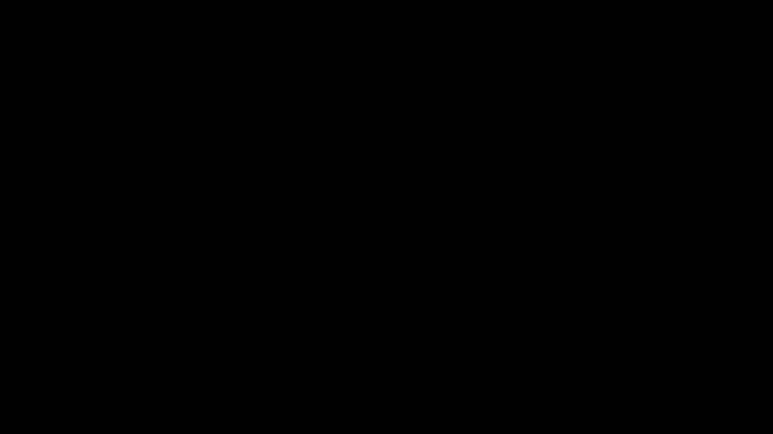

# P9：Lec9 Greedy Algorithms - 东风渐起UCAS - BV1o64y177K8

一个快速的问题，有人有iPad的USB充电器吗？我可以借一下，你是最接近的，谢谢你。

没有加密狗，因为这是丢失的USB，嗯其实，我找到了。

好啦，我们三十秒后开始，所以如果你要进入，请入座，我们先宣布一些事情，希望你们知道期中考试快到了，很快，还有不到两个星期，所以我相信你一定很兴奋，关于那件事的几件事，期中考试的范围包括，包括9月2日。

第六讲，这意味着我们今天要教的和下次要教的，包括最小生成树将被包括在考试中，我也会有关于他们的家庭作业，所以你要有足够的准备，第二个声明是，如你所知，作业本应该在周二发布，但是由于一些技术上的困难。

昨天晚些时候发布的，所以我们也把它的到期日推迟到了下星期三，这是一个重要的，但是我们的办公时间不会有任何改变，或者我们的家庭作业派对时间表，我们通常没有很多办公时间，否则我们就没有办公室了。

周二周三的许多办公时间，周二周四没有家庭作业派对，星期二星期三，所以如果你想利用办公时间，如果你想参加家庭作业聚会，你得早点走，你需要在星期五或星期一参加聚会，并使用您早些时候可用的资源。

如果你离开得很晚，发了很多问题，或者试图寻求TA办公时间，你会看到其他人排着长队，他们也做得很晚，所以请，我们的助教真的恳求，求求你了，不要拖到最后一刻，我们没有人力，星期二和星期三的办公时间，好啦。

最后一个声明是关于讨论表，我们一直在想，发布解决方案的合适时机是什么，我们知道你们中的很多人在周二周三去参加会议，但直到周四或周五你才能看到解决方案，这似乎不是最佳的，但我们也想鼓励你去参加那些会议。

所以这里有一个折衷方案，我们将在发布床单的同时发布解决方案，但他们的密码保护了，你怎样才能得到密码，我们会在星期四公布密码，不管，这样你就知道你以前的日程安排了，你可以继续那个时间表。

但如果你周二去参加一个会议，你从助教那里得到密码，当然，你可以在任何事情上与你的朋友分享密码，密码只是一种小小的激励机制，如果你在想，我今天感觉懒吗，我应该去办公室吗，我该不该参加讨论，希望它打破平局。

以便把你送到讨论区，因为我们认为这些很重要，好啦，但除此之外，它们将比以前更早地提供给你，所以你可以早点用它们来帮助你做作业，你可以早点用它们来帮助你处理混合物和一切，所以我希望你对这一变化感到兴奋。

在解决方案的可用性中，好了，今天的公告就到这里，简单回顾一下上两节课的内容，我们讨论了很多图算法，你将如何探索图表，然后你如何使用这些算法来探索图，喜欢广度优先搜索，深度优先搜索其他。

就像其他算法的预处理步骤一样，比如如何在不同的图中找到最短路径，或者如何对图进行拓扑排序，所以这些真的很重要，我们今天要看到的是一个稍微不同的算法概念，它们实际上在图表上也用得很多。

但是算法类本身被称为贪婪算法，你们中有多少人在过去见过贪婪的算法，好啦，我再次假设，六十一B右，好啦，那么什么是贪婪算法，嗯，贪婪的算法是当你看到它们时，你知道他们很贪心，但要正式定义它们。

需要一些努力，你不会给他们下超级的定义，超级，正式作为一个班级，而是，假设贪婪算法是那些本质上构建解决方案的算法，一件件，每走一步，他们都拿着最明显的一块，或者给你最直接的好处，好啦，因此。

眼前的好处是你不必展望未来的，但是你可以在一个步骤中优化，因为它们非常简单，通常要编码，但它们更难分析，因为你必须说为什么你立即采取的行动，归根结底，正确的行动，所以我们今天要看到的是。

今天和下节课讲的是贪婪算法的应用，它们并不总是起作用，我想如果下节课有时间，我将包括一个贪婪算法非常糟糕的例子，任何人碰巧都知道他们头顶上的应用程序，贪婪算法做得很差的地方，啊好，好啦，对呀。

所以关键字是一些动态编程，我们还没有讨论，但是动态编程出现了，问题是把东西放进袋子里，背包问题，如果你想在包里尽可能地合身，你会贪婪地把它放进去吗，这是一个很好的例子，它不起作用。

让我们下次再来讨论更多关于，如果你有时间谈谈其他例子，但是在过去，你已经看到过贪婪算法不起作用的例子，今天我们确实有一个完整的时间表来关注他们确实起作用的情况，我们正在努力弄清楚，有什么魔力。

这将使贪婪算法在一天结束时成功，所以应用程序将被调度，可满足性，霍夫曼编码与最小生成树，我们今天将尽我们所能编码，但我想我们会在今天和下节课之间转换，当我们讨论我一半的编码时，好啦。

让我们从日程安排开始，调度，或通常称为活动调度或间隔调度，是一个给你一个输入集合的问题，在工作的开始时间和结束时间方面，所以这些是间隔，开始是SI，结束是我的工作，我没事。

你要做的就是找到这些区间的最大子集，在他们之间没有冲突的地方，所以它们不相交，这就是你和你想找到的最大数量的，那么这看起来像什么，嗯，我可能会有六份工作，这是我的间歇期，这条线是我的时间间隔。

每个作业的开始和结束基本上是由这个间隔上的某个数字给出的，所以我不会显示所有的数字，还有其他号码，这是二号二号，三个，三个，以此类推，等等，你要做的是找出我能安排多少。

所以我实际上不能在任何两个之间有重叠，你为什么要做这种事，嗯，原因有时被称为活动调度，呃，或者，非常特殊的工作调度形式是因为你可以考虑这些间隔，作为你必须做的活动类型，可能你得去上课了。

你知道你得去讨论区和家庭作业派对，所有这些其他的东西，然后你就有了正常的生活，你当然想和你的朋友一起玩，你想吃午餐和晚餐，你需要睡觉，你得去看医生，所有这些其他的事情，他们都设定了开始和结束的时间。

你知道那个伯克利的学生，他总是试图做尽可能多的事情，你在尽量压缩你的日程安排，通过做最多的活动，好啦，所以这将是一个间隔调度的例子，当然你不应该，你知道你的医生的预约，你知道你的CS在同一时间。

这将是一个冲突，但你确实想安排尽可能多的事情，这是一个间隔调度的例子，所以这就是，如果我看到这个，对不起，这很喜欢，如果我看到这个，对你来说应该不难，要知道有三个工作你可以同时安排。

这方面的一个例子是一二三，事实上，没有其他的时间表可以让你完成其中的三项工作，所以我想让你好好想想，如果你真的贪婪地，你的日程安排是什么，你怎么穿，你会试着优先考虑最短的工作或间隔吗。

你能安排一下最早开始的吗？或者你会试着安排最早结束的，所以让我们花90秒和你旁边的人聊聊，如果你想优化你的工作，你可能想做这三个中的哪一个，好啦，所以90秒，好啦，再过15秒。

让我们先看看谁投票选最短的工作，好啦，你能解释她为什么先做这份工作吗？你们中的一个是个好主意，好啦，你知道吗，让我把，好啦，几手，很好的选择二，谁再多拿几手，好啦，好啦，更多的手。

你们中的一些人投票给不止一个，所以这很有趣，让我们看看，我真的要告诉你为什么，选项一和选项二至少不是正确的选项，所以先做最短的工作，如果我选择最短的工作，我会选什么六个，所以这会是最短的。

然后它冲突了所有这些，所以我能做的就是，如果我选最短的工作，首先是挑六个，然后，这是两个活动，这就是为什么最短的工作第一不是，至少最好的做法是，有趣的是，那是我们通常做日程安排的方式。

就像我能最快地摆脱哪一个，所以这不是最好的办法，好了，现在，让我们看看为什么最早的时间先也不是个好主意，如果我想先做最早的时间，我会选择什么，我会选择的最早开始时间，如果我选四个，那我就是二选一。

我现在能做的就是再挑五六三个，我最多只能安排两份工作，所以这也不是最好的事情，好吧，关于早起的鸟儿什么的，也许不是最好的事情，好吧，那么你们中任何一个投票支持第三种选择的人，你想给我们一些直觉吗。

为什么你要为这个选择辩护，完美，你叫什么名字？Aj好的，所以阿杰是对的，从某种意义上说，你试图优化的是你在一天剩下的时间里的自由，所以提前完成的工作，是让你一天剩下的时间再次被最佳利用的。

那正是我们将要看到的，这就是为什么，选择三确实是正确的选择，所以让我们看看，是呀，有个问题，好呀，所以原因是，最短的工作不是，因为这不是你可以反复保持自由的东西，所以如果我选择了很短的工作。

让我们回到这里，所以你认为它让我一天中的大部分时间都有空，这在某种程度上是真的，也许之后，但不是前后都有，所以在某种意义上，你本可以选择一个非常短的工作，与你最喜欢的两件事相交，好啦。

这就是为什么最短的工作不是最好的选择，最早的开始时间也不对，因为也许最早的开始时间恰好也是最长的工作，所以你只能做一件事，所以从这个意义上说，这两件事，最早，你真的不应该指望它给你留下任何免费的东西。

但那一秒钟最短的，感觉它让你大部分时间都很自由，但这并不意味着它以一种有用的方式保持它的自由，这里还有别的问题吗，是啊，是啊，第三个是两者的结合，也许吧，绝对是，试图利用同样的直觉让你的时间尽可能自由。

但在某种程度上，你可以按照时间表建立，好啦，这就是你将要看到的，更多问题，好呀，那么最新的开始时间呢，嗯，你对这个问题有自己的答案吗？或者不是，因为我可以翻转整个音程。

时间向前和向后的概念实际上并没有改变这里的任何东西，所以我可以扭转物理定律，然后从最新的开始时间开始，是啊，是啊，好啦，好呀，然后我们做的，好啦，所以这是一个贪婪算法，之所以叫贪婪。

因为它是一块一块地建造东西，每次它在挑那块，就像选择最早的工作或间隔一样，和尚未与过去冲突的时间，好啦，那么算法是什么样子的，这是一个很大的时间循环，当间隔集不为空时，它选择其中一个间隔，叫那个间隔。

J它选择了，它的间隔应该是，J不是我最早的完成时间，一旦它选择了它，它承诺采取这一行动，所以这将是我的日程表，然后我要删除所有其他会与此冲突的东西，所以我的两个作业之间的任何间隔i，交集都不是空的。

会被移除，好啦，所以让我们应用这个算法，现在看起来又是，不幸的是，因为这些幻灯片是相互叠加的，EJ就是AI就是EJ，所以我选择的第一份工作是第一名，因为如果我看着一切的结束时间，那是结束的时间，先来。

所以我挑了一个，现在我必须移除任何与之冲突的东西，所以它只是安排一个数字，与我的第一份工作相交的第四份工作，所以我把它移除，通过移除它，我只是用红色把它划掉，然后我继续，这是while循环的下一次迭代。

还有工作吗，是呀，还有很多工作要做，我看着他们的结束时间，我选择下一个可用的结束时间，那是什么工作？第二项工作，然后我删除任何与之冲突的东西，这里五号和六号都有冲突，所以我把它们从一组可能的间隔中移除。

现在我只剩下一份工作，那是三个，我挑的，也没有什么要移除的，我回头看我的while循环，我的间隔就这样消失了，他们要么对我的日程安排很投入，或者因为冲突而被移除，就这样了，所以这就是算法。

我们将讨论为什么它是最优的，但在那之前，关于实际的，就像我们运行它的方式，集合表示法，是呀，所以这只是意味着两个区间之间有一个交集，所以如果我有这样的间隔，所以这就像是开始的时候。

然后我有另一个像这样的间隔，它们相交，所以他们的交集不是空的，因为这是他们的交点，所以这意味着有冲突，因为你不能同时做两份工作，如果它是空的，应该是这样的，这就是区间相交的意思，好啦。

那么我们想知道这个算法的什么，我们想知道，首先，它为什么有效，一会儿就知道了，但是这个算法的运行时是什么，对运行时的任何建议，好的很好，所以本质上，你说，你说二分搜索，你的意思是别的，对呀，对不起。

你可以把最小的东西移除N次，一种方法是排序，另一种方法是堆成一堆，然后不断地移除，但本质上你必须排序n次，所以如果结束时间已经排序，那我们就一次拆一个，这就变成了线性，但如果没有排序。

然后你要做的就是对所有东西进行排序，但到最后，然后你不断地移除它，这将是一个登录，但我已经付了N log N，所以它还没有排序，否，你不必去找那个，所以假设我在努力，我有东西，我想出了最短的起点。

最短的，对不起，最早停止时间，好的，好的，现在我需要弄清楚的是，在我现在的时间之前，事情开始了什么，结束了什么，所以说，就像想象我有另一个数组，这也是开始的时间。

现在我可以计算出是否有东西与我当前的间隔相交，这有道理吗，也许我们可以把它加到讨论中，所以这将确保你知道怎么做，是呀，另一个问题，这是个好问题，也许我应该，也许我应该付钱去做那件事。

或者我需要基本上能够有两个排序的时间，不管怎样，我们要补充一点，也可能是讨论或家庭作业，讲座是这些事情的一个很好的来源，好了现在，让我们回到为什么，其实是这样的，为什么这个算法实际上工作得很好。

主要的想法是AJ说的，从某种意义上说，我们有最大的自由，更数学的说法是，也就是说，每当我们选择在解中包含一个间隔时，贪婪地，我们实际上并没有妥协最优解，因为我们从不排除。

将解决方案扩展到看起来最优的东西的能力，因为我们从来没有排除在时间结束时，我们最终会得到最理想的结果，为什么我们不排除最优解，或者为什么我们要保持最灵活的，我们仍然可用的解决方案。

想想贪婪的人会输出什么，最佳时间表是什么，假设贪婪等于，也许最佳方案可以更大，所以是i 1 i 2对i k加1，让我们来看看这里的第一件事，我不是在声称这些东西中的哪一个来得更早，对不起，我开始得早了。

所以我只是在看他们的结束时间，我在这里观察到的是，这是第一次，对于第一个解决方案，至少i 1对j 1，我可以把最优解的内容，因为我本可以接受的，我一个出去，把J一个进去。

这仍然允许我继续研究剩下的最优解，因为这个任务的结束时间在i i曾经任务的结束时间之前，所以它不会造成额外的冲突，所以这就是高层的想法，我是说有某种结构，你可以允许自己不排除最优解，每次你做出选择。

这就是我们所说的结构类型，让我们把这个问题形式化，有什么问题吗，不，好吧，关于直觉有什么问题吗，好啦，让我们看看如何将其形式化，嗯，贪婪算法，因为他们正在一点一点地建造一些东西。

我们进行证明的典型方法通常包括某种归纳法，现在还有其他方法，但归纳法很好地说明了，如果我到现在为止没有做出错误的选择，我现在不会做出错误的选择，我可以继续做出好的选择直到时间结束，所以归纳法设置得很好。

这样我们就可以和，我要用归纳法证明的主张，对任何小于k的m，嗯，K就像贪婪的长度，贪婪的解决方案，有一个叫做opt的时间表，这是与贪婪解一致的最优时间表，我想我们在第一个m间隔上称它为g，好啦，否。

我是说，在溶液的前m间隔内，所以如果是这样，让我们，让我们证明这一点，但我是什么意思，所以我说选择是i 1对i k加1，这些是时间间隔，就像在I的结尾一样，i 1比i 2和i 2的开始小，三开始。

像这样，好啦，所以这并不意味着它们被分类了，只是说明他们没有冲突，所以让我们假设那是选择，假设这是贪婪的，我要用j来点赞jk，所以说，当然是为了贪婪的人，它们按最早的结束时间排序，但不是为了选择，好啦。

所以我要证明这一点，我如何证明这一点，嗯，我要做归纳，对于m等于零，请注意，这只是微不足道的，就像任何计划一样，每隔一段时间分享他们的第一个零，因为没有什么不可以分享的，所以这几乎是真的。

因为任何两个时间表，现在用归纳法，我有一个归纳假设，那么什么是归纳假说，归纳法假设是，对于m，我是这样做的，这种说法成立，对我来说，这样的说法是正确的，对于m意味着i 1等于j 1，直到我和J M相等。

就是这个意思，这就是我的归纳假设，现在我的归纳步骤是说如果归纳假设是真的，我的iam加1也等于j m加1，这就是我想说的，我想说I am plus one is j n plus one。

所以让我们做两个案例，第一种情况是，无论如何，事实确实如此，所以想象一下他们是一样的，然后我做了选择和贪婪已经分享了他们的第一个，M加1间隔大，如果他们不分享呢，如果他们不分享。

我要做的是证明会有另一个最佳时间表，会分享，M加1看，我是说存在一个最优的时间表，那么最优的时间表是什么呢，它本质上与opt完全相同，除了，JM加一个选择，好啦，所以选择质数本质上是我一个对我很抱歉。

一加一，然后我加两个直到最后，好啦，所以如果是这样的话，我的主张是，选择素数是不冲突的，是最优的，这是我需要确定的两件事，所以首先要注意的是，选择素数并不冲突，所以这是一个有效的时间表。

下面是我如何使用这个结构，我是这么说的，J，M加1，在它面前的任何东西，从j到j，有人能告诉我为什么，这不仅仅是归纳假设，让我看看，也许在那里，对呀，根据贪婪算法的定义，因为这些是贪婪算法中的第一个m。

所以J M加1和他们没有冲突，所以这是因为，这些都在贪婪的解决方案中，你叫什么名字？好啦，所以这是第一个知道的事实，所以它和之前的任何东西都没有冲突，所以如果有的话，它必须与之后的事情发生冲突。

我的第二个主张是，这也不会发生，那个j，一加一不行，我现在是加2到最后，为什么会这样？好极了，你叫什么名字？迪伦，好啦，迪伦是正确的，迪伦说，因为它结束得更早，这是因为J，M加1，嗯一个。

所以让我再正式一点，迪伦的意思是如果，他的意思是如果我把它放在星星上，J，M加1，我加二不是空的，我是严格晚一点结束的加一，这是一个矛盾，因为，好啦，这证明了质数是有效的，好啦，因为贪婪算法。

所以贪婪算法在选择了j之后，选择了jm加一，这意味着j m加1的结束时间比任何其他结束时间都早，包括i n加1的结束时间，其他问题，好啦，所以这是我的一个，我证明了质数并不冲突，注意这里也有两个。

让我把这两个，也许在这里，这里的两个是说素数的大小是一样的，作为选择，因为我只是翻转了一个时间表，在附表的数量上是一样的，所以一和二一起告诉我们，所以1和2加在一起会告诉我们质数是一个有效的时间表。

加1等于j，M加，所以这是通过归纳法证明的，我证明了如果第一个m匹配，下一个最优解，关于这个证明有什么问题吗，是啊，是啊，这就像如果他们没有相同的解决方案，我构造了一个选择素数，会有同样的解决方法。

好啦，好啦，很好是的，你能澄清一下案例二归纳步骤的案例二吗，好呀，所以归纳步骤的第二种情况是有趣的事情发生的地方，所以让我们更加关注它，我们是说想象一个选择，m加1的间隔与贪婪的不匹配。

所以我要设计一个完全不同的选择，这次完全不同的行动是什么，其实和我的选择是一样的，但我会改变，我把m加一个东西，刚刚发生的事，我说，选择和贪婪彼此同意，直到我一步，如果他们不同意下一步。

本质上我翻转了它，这个样子和这个一模一样，如果这是m加1，好啦，因为我想说的是，在这之前，他们实际上完全匹配，在这里他们不匹配，我所做的就是把这两个翻转过来，把这个叫做opt prime。

现在没有冲突的原因，它与之前的任何东西都不冲突，因为这都是同一个贪婪的解决方案的一部分，它与之后的任何事情都不冲突，因为如果这两者发生冲突，这两个会有冲突，那正是你正在做的，这就是归纳法的美妙之处。

就像，或者对结构的思考之美，即使我试着向自己证明，为什么在工作中的一步，这与证明为什么下一步会奏效本质上是一样的，好啦。

还有其他问题吗？你能再说一遍吗，好啦，为什么我们被允许那样做，因为让我们来看看，看索赔，索赔说有一个最优解，它并没有说每一个最优解都有这个性质，事实上这不是真的，假设我有，我有可能。

我觉得绿色更适合你们，我有可能有这个解决方案，这个解决方案是贪婪的，我也可以有这个解决方案，它们都是最佳的，因为它们都是三号的，但是选择和贪婪是不一样的，我想说的是有一个最优解，与贪婪相匹配。

并不是说每一个最优解都是贪婪的，尤其是这种事情完全没问题，所以我想说的是如果我碰巧在研究最优解，那不是贪婪，我要把最优解变成贪婪解，因此贪婪也是最优的。

好的，像上次一样，这个呢，好啦，这是说嗯，让我们回到这张照片，我说，想象一下我已经在这里了，所以我在这里说什么，我是说我有J M加1，我有，我是加一的，我有，我加两个，想象一下j m加1。

这两个矛盾冲突，意味着它们是重叠的，因为i'm+1的结尾严格晚于j'm+1，这也会与，好啦，所以这两者不可能有交集，但这两个人不会，就是这个说法，好啦。

所以这是一个很好的时间来思考我们刚刚做的事情的模式，我们在一个非常具体的应用中证明了这一点，是作业调度还是间隔调度，但这个证明的模式是你一直看到的一种模式，在分析贪婪算法。

所以贪婪本质上是做出一系列选择，我们想展示的是，也就是说，贪婪的人所做的任何选择都不会排除最优的选择，所有最优解，在贪婪算法做出的每一个选择之后，仍然有一些最优的解决方案可以匹配贪婪。

我们是如何证明的我们通过使用归纳法证明了这一点，这个归纳证明的不同部分是什么，我们有一个归纳假设和归纳假设，有两种说法，我做这件事的具体方式是第一种，也就是说，贪婪者的前M选择与，的前M选择。

你可以做得稍微不同一点，你可以说在贪婪算法的前m个选择之后，实现最优解仍有可能，这基本上是第一行，是第二行的形式化，好啦，这就是归纳假设，那么你想有一个基本情况，基本情况通常是简单情况。

因为也许你只做了一个选择，或者你只做了一个选择，对不起，零选择或一个选择，不是微不足道就是很简单，当然要看实际应用，具体问题的部分是如何做归纳步骤，但通常会有一个问题，帮助您使用它的特定结构。

它对你有帮助，因为你说，如果第一个M选择匹配，我可以把M加第一选择改为贪婪的，好啦，所以我到目前为止都是匹配的，然后我再匹配一个，我把它变形了，我交换了一些选择，当我这么做的时候。

我得到了一个不比选择更糟的解决方案，在我们的情况下，一点也不比平时差，从某种意义上说，这是一个有效的时间表，它的大小是一样的，在其他情况下，你得根据问题来决定，就像不比选择更糟意味着什么。

所以这本质上是一个，你把这些放在一起，您使用一个非常特定于问题的结构来，当然啦，做归纳步骤，但如果你把这作为一个整体，这通常是你证明贪婪算法输出最优解的方法，这是概述，我们将看到另外两种用途。

而今天和下节课的其他三种用途，但在那之前，让我们给你们一个短暂的休息，让我们花三分钟，是一二五，我们1点2点8分回来，嗯，你们能把礼堂的门也关上吗，谢谢你，好啦，我们十秒钟后再回来。

让我们回到贪婪算法的下一个应用，好啦，如果你加入我们，是啊，是啊，请入座，贪婪算法的下一个应用实际上是逻辑和逻辑公式，嗯，有人听说过圆号公式吗，好啦，在我上了算法课之前，但它们恰好对逻辑很重要。

所以我会告诉你一些关于他们的事情，让我们回到一般的逻辑，所以当你记得逻辑时，我们有不同的变量比如x 1，x2，x m和文字要么是变量，要么是变量的否定，变量上方的条形图显示的否定。

这些变量可以取值为真或假，然后我们有号角公式的子句，我们只允许自己考虑两种类型的从句，第一种被称为蕴涵子句，这是一种非常特殊的暗示形式，一堆变量的结束，重要的不是这些变量的否定，必须是积极的。

变量意味着另一个变量，好啦，所以这就像是说，如果事实一二三是正确的，然后我推断出事实，现在第二个子句被称为纯否定子句，实际上，在我们用同样的写法之前，这是用你的逻辑，嗯，先决条件。

然后用POST条件取一个OR，所以唯一可能是假的，这是真的，这是假的，好啦，所以通过这样做，我们本质上是说这是真的，岗位条件正确，或者前置条件中的东西，其中一些变量至少是假的，好啦，这就是隐含条款。

我们关心的第二种子句叫做纯否定子句，就像那个暗示，但实际上它根本没有邮政条件，好啦，所以它是说，我在看，或者一堆被否定的东西，字面意思，号角公式是这些公式的集合，我们认为这是这些条款的结束。

所以我们认为它是，因为如果我想满足一个号角公式，本质上，我必须满足它给我的每一个条款，现在我为什么要关心所有的角CLA，人们关心的原因有很多，实际上这些出现在，这是在一个研究生的论文中。

他是伯克利的毕业生，大约三十年前，在现代计算机科学或逻辑学中，它们发挥了重要作用的地方实际上是在构图逻辑中，因为它们更像是用于自动定理证明，就像如果你看隐含条款，上面说如果这些东西是正确的。

那东西也必须是正确的，那是一种证明你试图做的定理，我们从一些事实出发，然后我们从他们那里证明更大的Lemas，特别的开场白是一种用于逻辑的语言，是基于喇叭公式，反正它是用来证明定理的。

所以这就是你可能想要关心号角公式的一个原因，因为如果你能证明有一种方法可以满足喇叭公式，你可能已经证明了一个定理是正确的，好啦，那么我们要怎么处理这些号角公式，你想解决一个叫做角SAT或角满意度的问题。

对于那些记得逻辑上的可满足性的人来说，是一个关于我们是否可以赋值为true和false的问题，我们关心的所有子句都是正确的，或者他们评估为真，所以喇叭集问题是一个输入是喇叭公式的问题，让我们再回忆一次。

号角公式是号角子句的一个和，这些要么是，或纯否定句，我们想要给出的输出是，找到使号角公式为真的变量赋值，说这是不可能的，好啦，所以如果有可能找到这样的任务，我们想找到它，是呀，是啊，是啊，所以有点像。

这是一堆积极事情的结束，这只是假的，如果我，如果这是假的，这是真的，我将向你们展示贪婪的算法，下面也是构建圆号公式赋值的正确方法，我先给你一个算法，然后证明为什么这是真的，那么算法是什么。

从某种意义上说，算法将试图创建最保守的解决方案，事物为真的赋值，所以它首先遍历所有的蕴涵子句，每当有暗示条款，请记住当前未计算为true的此表单，它想让它成为现实，然后呢，正如我所说的。

它是假的唯一方法是它的前置条件为真，而且帖子条件是假的，所以使一个暗示成为现实的最简单的方法，把变量x k设为真变量，好啦，这是你能满足暗示的最简单的方法，前提条件是什么并不重要，只要帖子条件为真。

所以它会返回并询问，是否还有一些隐含条款没有被评估为真，如果他们不是，它继续将x个案例的职位条件赋值为true，当它需要的时候，直到所有的隐含条款都得到满足，它研究的是纯否定句。

所有的纯否定句都已经满足了，上面说很好，这是正确的作业，我把它输出，如果他们中的一个不满意，然后它说不可能满足这个号角公式，关于算法有什么问题吗，我去做个运行分析，我其实很喜欢，在一个例子上运行一次。

但我们要确保，如果你对我右边写的有任何疑问，现在是问的好时机，对不起，我会重复while循环，让我先看看这些问题是什么，它的意思是返回我为它们设置的值，正是这样，如果它们中的每一个都是真的。

它就会返回赋值，这意味着如果其中任何一个是假的，那就没有了，就像这些值一样，就像这些是真和假的值，分配给他们的，好啦，让我们回到我所问的，就像，让我们再来一遍while循环，它看起来是迭代的。

它发现任何目前不满足的暗示，为了让它满意，它说让我们把这件事变成真的，请注意，当我将此设置为true时，这整件事就会被计算为真，因为我们说过，唯一错误的方法是，如果它的帖子条件是假的，且前提为真。

所以好吧，所以这是一个算法，我将在一个非常具体的例子上这样做，假设我有一堆公式，我一个一个看，第一个蕴涵是w和y，z给出x，所以这是一个号角条款，另一个是x和z给我w，那也是一个角爪X给我Y。

那是号角条款，其实呢，没有什么给我X本身是，这相当于只是说X，这是一个号角条款，心满意足，只要这设置为真，更多隐含条款，现在我也有一些纯否定条款，所以不是w不是x不是y，所以这些是我的变量。

我想通过这个来看看会发生什么，好啦，所以我看的第一件事是我把一切都设置为假的，所以如果我看看所有这些含义，他们中的一个在那里吗，任何一个评估为假的，哪一个，没有任何迹象表明x被计算为false。

因为帖子条件是假的，我们说这等价于本质上只是说x，所以因为这是假的，我要做的是，让我来，我做的每件事都是假的，我要做什么才能把这变成真的，所以现在x成了真，现在见面，现在的条件我回去了，嗯。

也许我会从上到下迭代，是否有任何条款对任何，所以被评估为错误的隐含条款，你能给我一个吗，第三个，是啊，是啊，他们有很多人，但第三个也是，因为这是真的，但为什么是假的，所以这被评估为假。

所以我要做的就是改变Y，让它成为现实，好啦，所以现在这是正确的，现在呢，我先回去，有没有人被评估为假的，第五个，这两个都是真的，所以整个前提是正确的，这是假的，所以要修好它，我不得不说W也是真的。

所以现在我需要这个，还有别的吗？第一个蕴涵子句是真的吗，它是真的，因为后置条件是真的，所以这是遇到了第二个呢，W为真，所以也可以，好啦，所以现在我完成了我的while循环，我现在要看我的纯否定从句。

我只有一个，这里发生的事情是我在说，假的，所以这被评估为假，那么我还什么不满足，一些事情，我是啊，所以你确实需要一些，是啊，是啊，那倒是真的，在某些情况下，这是千真万确的，因为所有的一切。

每个帖子条件都是，对不起，每个前置条件都已经分配给false，所以隐含条款并不重要，而你是完全消极的，求值为真，因为它是一个或一堆否定的否定，所以这是正确的，那是为了角的原因，你确实需要这些类型的。

不是微不足道的，您确实需要这些类型的含义，从无到有，它们对于组合逻辑的意义，有一些事实是真实的，所以你总是要从一个事实开始，如果你想在这里证明，好了，现在，贪婪的人为什么为牛角脂肪工作。

这就是我们想看到的，我想回到我们做的归纳技巧，我说有一些模式来证明我们有，这里的图案是什么，这里的模式还是，我想确定以下事情，每当贪婪把一个变量设为真，它不会毁了一个令人满意的任务，好啦。

这就是我想建立的，就像，每当贪婪承诺包括一个间隔，它没有毁了，它仍然可以继续匹配，那么我该怎么做呢，事实上，我要证明一些更有力的东西，你又想起来了，刚开始上课的时候，说阿杰是说，啊，我们有最多的自由。

如果我们贪婪地选择，从某种意义上说，它仍然是一样的，实际上贪婪算法是最保守的算法，在分配真理方面，所以我要声明的是，设置为true的变量集，必须设置为真，在任何其他令人满意的解中，这就是我的主张。

我如何证明这一说法，让我们把这个声明写下来，那么关于索赔的陈述有什么问题吗，所以任何事情都是真的，在满足的解中，宽贪婪必须是真的，如果有的话好吧，所以第一件事，我所做的就是通过归纳法来证明，其实呢。

我要开始了，while循环的迭代次数，记住while循环是通过蕴涵子句，如果其中任何一个是阴性的，它将把职位条件设置为正，所以基本情况是，在while循环的零迭代之后，嗯，我的说法是正确的，的确。

是正确的，如果我根本不去while循环，我从没说过什么是真的，所以我说的都不是真的，和所有其他解决方案，至少有零件事被设置为true，所以那是，我的归纳假设是我的主张对m是正确的。

所以第一个被贪婪设置为true的m个变量，就像第一次一样，我经历了一次循环，说了一些真实的话，在每一个令人满意的解决方案中，它们也被设置为真，那是我的归纳假设，现在我要谈谈我的归纳步骤。

那么我的归纳步骤是什么，我想说下一个，m加1等于真，说由贪到真，也有这种结构，我们把它叫做xm加一，所以这是在while的下一次迭代中设置为true的变量，如果是这样的话，记住。

每当我经历while循环时，这是为了一个非常特殊的目的，因为有一些隐含条款，让我们说，当时被评价为假的这个含意条款，好吧，因为它被评估为假的，因为这是假的，这是真的，这是唯一可能发生的方式。

所以在我进入m+之前，while循环的第一次迭代，这是真的，就像这个结构存在一样，因为那个，这意味着，在满足的解中，这个东西必须为真，因为这是在我进入m加一次while循环之前。

意味着我的归纳假设被激活了，我说的是同时循环的第一轮，所以在while循环的前m轮，贪婪和选择在真正成为现实的事情上匹配，对这份声明有什么问题吗，这正是我们要去的地方，退一步。

并不是说他们的数字是一样的，从某种意义上说，它们被设定为真，只是有一些武断的事情，我在说什么，我没有改变这些任意东西的价值，在我进入我的循环之前，所以无论被评估的是什么，仍然被评估为，同样的事情。

所以请注意，现在真正满足这个子句的唯一方法是，这个，整个条款，是因为这个前置条件设置为真，它的post条件也必须设置为true并选择，所以任何正确的赋值都必须将其设置为true，好啦。

所以这正是这一说法的证据，本质上，我查看了while循环的迭代次数，我说，如果同时循环使一些事情成为现实，现在是因为别的事情，先决条件必须是真实的，即使在任何正确的作业中，一旦前提必须成立。

使暗示为真的唯一方法是使后条件也为真，所以这个说法归纳地证明了，任何由贪婪设置为真的变量集也设置为真，在满足解中，现在呢，我如何用这个来表明我对号角满意度的主要主张，我的主张是贪婪的解决方案是正确的。

是正确的解决方案，我要展示两件事，第一件事是说，如果贪婪算法输出一个解，这是正确的，这其实很简单，你可以回顾一下算法，然后说，算法首先确保所有的蕴涵子句都是正确的，然后确保所有的纯负面原因也被设置为真。

所以一切都为真，所以不管是什么，如果我真的输出了一个解决方案，这是一个正确的解决方案，相反的方向是，更难的是我们试图证明，他说如果号角公式可以满足，然后贪婪输出一个可满足的解，我们从本质上证明了这一点。

相反，假设号角公式，是可以满足的，但贪婪说不是，如果是这样的话，这是因为贪婪的任务就在它到达，如果loop违反了这种形式的纯否定子句，你不知道喜不喜欢，XJ与否，XK什么的，现在请注意。

因为贪婪设置的每个变量，据说那是真的，好啦，一秒钟，这是这个子句的计算结果为false，如果x i中的每一个都为真，但我们刚刚说过如果贪婪使任何事情成为真的，任何令人满意的赋值也必须将其设置为true。

这就是最后一张幻灯片上的说法，所以如果我们说的是真的，这意味着这整件事也会被评估为假，在满足解中，这意味着这不是一个令人满意的解决方案，原来如此，我仍然依靠矛盾来证明，一点点完成主要索赔。

但是分析这个归纳的主要工作，贪婪选择的结构通过，while循环上的归纳法，好啦，关于号角可满足性的证明有什么问题吗，好极了，好啦，所以我们今天最不想看到的是代码，就像我说的。

我们没有时间把所有的东西都看完，所以我们有十分钟的时间继续，我们会尽量多谈谈，下节课我们再开始，为什么我们要考虑像ascii这样的代码，这是因为我们正在考虑用二进制语言编码一些东西，而且电脑也能理解。

有时是因为我们也试图压缩我们的数据，所以通常像ascii这样的代码使用固定长度的字符，每封信，所以他们都像八个角色，十六字，三个二位，但如果我们的目标是真正节省空间，我们也许不应该使用固定长度的代码。

事实上，我们知道在英语中有些字母表比其他字母表更常见，就像E A S T，这些比Q、W、X、Y更常见，所以也许我们应该使用更短的代码，更频繁的信件，对于这些非常罕见的字母来说，代码可能稍微长一点。

如果我们真的看看英语，我们确实看到了这些事情之间的巨大差异，你所说的是，最佳编码方式是什么，所以也许你知道，我的完整编码尽可能短，所以这就像我说的，差不多吧，挺大的，我想j q x z是非常罕见的。

好啦，那么我们如何真正形式化这样一个东西，让我们来谈谈不同的编码方式，看看会发生什么，让我们想象一下，我只有四个字母要编码，只是因为这样会更容易，假设它们的频率写在这里，四点两点三点一。

让我用固定长度的编码，这是什么并不重要，但是假设我使用编码zero-zero-one，一零一一，假设我编码了一段很长的文本，在这个，嗯，用这种语言，我将为这样一个代码支付的总成本是多少，为什么是n。

对呀，就像，如果我想说a b c d，我有a零，零，零，一个，一个，零和一，每个都有两个比特，所以这并不重要，I，无论发生什么，我正在编码到n个比特，但我说我想用稍微短一点的代码来表示更频繁的字母。

对于不常见的代码稍微长一点，所以让我改变这个，说对于a和c，我用0 1表示b和d，我用的是零零，就像零一，也许我想这么做的原因是，我可以把这个代码缩短一点，就会变成零零一零一。

让我先计算一下这段代码的长度，好吧，这就像我付钱的任何信，也就是a或c和分数的点4其中的点4是分数点，其中三个是c，我每封信只付一点钱，那就是n，然后我给每个字母两个比特，每当我编码b和d。

所以这是第一点加第二点，如果我写下来，这里就变成七了，嗯嗯三加六这里一点三n，所以我节省了相当多的空间，好啦，这太棒了，我用了很多空间，但是这个代码有什么问题吗，我们有像，这是个很好的问题。

这正是这个代码的问题所在，因为代码2是有损的，我真的不能回头看那些片段，唯一地写下代码的含义，因为如果我看0，0，0，它是a，um，b，还是B a，你知道谁知道，这不是一个好代码。

因为它在某种意义上是无法挽回的，所以我实际上想要可以以独特的方式解释的代码，当我写下来的时候，所以让我写一个稍微不同的代码，它碰巧具有该属性，这个属性叫做无前缀，从某种意义上说。

一个字母的编码不能是另一个字母的前缀，好的，好的，所以就像我不能有一个更大的代码为其他字母，哪里像第一个，其中的两三个字母，让我们来看看第三个编码，我认为最低是零，然后c i把它赋给一个零。

然后我把b赋值到1 1 0，把d赋给1 1 1，这是一个无前缀的代码，从零的意义上说，每当我从一开始看到零，如果我从头开始，我看到零，我知道它不能继续变成任何其他的信，所以我只是把它移除，我写了一个。

我继续这样做，我的代码的成本是多少，让我看看，嗯，第四点n只有一个位，所以这只是n的点，那么我有第三点，这是我的字母C，它有两个部分，所以我乘以2，然后我有，呃，第二点和第一点，这些是字母b和d。

每一个都有三个比特，如果我写下来，我看还是比两个N稍微好一点，所以这说明了什么，有可能有一个比固定长度更好的代码，它是无损的，在某种程度上，它可以被解释为，把我们所说的无损和无前缀很好地形式化。

无前缀代码是引用二叉树的代码，二叉树中的一个叶子将对字母进行编码，然后该字母的代码是该字母在树中的地址，那么这意味着什么呢，这意味着如果我想一个有四点频率的，地址是零，所以a的代码就是零。

C的地址先转到1，然后归零，所以0是左边的孩子，一个是合适的孩子，所以无前缀代码指的是树，因为我所有的信基本上都是这棵树的叶子，所以我不可能扩展代码，混淆两个字母，好的，好的，事实上。

任何二叉树也是前缀，所以我下次要做的是从这些前缀代码开始，而不是把它们当作前缀代码来谈论，谈树，因为有一个一对一的映射到他们，我想说的是，我们如何设计最优的代码，从某种意义上说。

每棵具有一定频率的树都将编码，一段很长的信息，基于位数，所以比特数为零，这些b的位数是3，所以长度和深度，树的结构会给我一些关于代码长度的信息，我们将讨论如何设计最优代码。

以及这些二叉树实际上是什么样子的，原来如此，我们星期二见，我们将讨论最优代码，对不起，很抱歉打扰你，但你能不能快点跟我解释一下，是呀，你的麦克风，但就像这部分，我不明白就像，为什么这说明，好啦。

